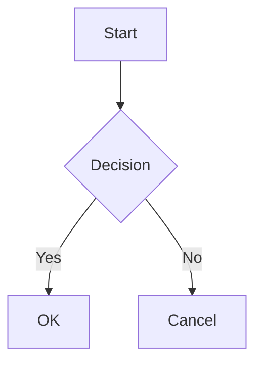

# yceffort-blog

previously, <https://github.com/yceffort/yceffort-blog>

github repository of <https://yceffort.kr>

## Dependencies

- nodejs@22.12.0
- react@19.x
- typescript@5.x
- tailwindcss@4.x
- nextjs@16.x
- next-mdx-remote@5.x
- pnpm@10.6.5
- vercel

## Writing Posts

### File Structure

포스트는 `/posts/YYYY/MM/DD/post-slug.md` 형식으로 저장합니다.

```
posts/
└── 2024/
    └── 01/
        └── 15/
            └── my-first-post.md
```

### Frontmatter

모든 포스트는 YAML frontmatter가 필수입니다.

```yaml
---
title: Docker 공부 (3) - 도커 이미지 # required
tags:
  - docker # required, 여러개 가능
published: true # required
date: 2020-08-09 03:48:47 # required
description: '여기에 Description을 적어둡니다.' # required
---
```

### Table of Contents

문서에 목차를 자동 생성하려면 아래 헤딩을 추가합니다.

```md
## Table of Contents
```

`remark-toc`이 자동으로 하위 헤딩들을 수집하여 목차를 생성합니다.

### Code Blocks

Prism.js 기반 신택스 하이라이팅을 지원합니다.

````md
```javascript
const hello = 'world'
console.log(hello)
```
````

라인 하이라이팅도 가능합니다.

````md
```javascript {1,3-5}
const a = 1
const b = 2
const c = 3
const d = 4
const e = 5
```
````

### Math (KaTeX)

인라인 수식은 `$...$`, 블록 수식은 `$$...$$`를 사용합니다.

```md
인라인 수식: $E = mc^2$

블록 수식:

$$
\sum_{i=1}^{n} x_i = x_1 + x_2 + \cdots + x_n
$$
```

### Mermaid Diagrams

Mermaid 다이어그램을 지원합니다.

````md

````

### GFM (GitHub Flavored Markdown)

`remark-gfm`을 통해 GFM 문법을 지원합니다.

#### Tables

```md
| Header 1 | Header 2 |
| -------- | -------- |
| Cell 1   | Cell 2   |
```

#### Strikethrough

```md
~~deleted text~~
```

#### Task Lists

```md
- [x] Completed task
- [ ] Incomplete task
```

#### Autolinks

URL은 자동으로 링크로 변환됩니다.

```md
https://yceffort.kr
```

### Images

이미지는 Next.js Image 컴포넌트로 자동 최적화됩니다.

```md

```

외부 이미지도 사용 가능합니다.

```md

```

### Headings with Anchors

모든 헤딩에 자동으로 앵커 링크가 생성됩니다. `rehype-slug`와 `rehype-autolink-headings`가 처리합니다.

```md
## My Section

위 헤딩은 #my-section 앵커를 가집니다.
```

## Author

yceffort [email](root@yceffort.kr)
