## Table of Contents

## Introduction

Next.js App Router caching has a notorious reputation. Even after reading the official docs, questions like "why isn't my data changing?" and "I definitely revalidated, didn't I?" never seem to stop. Even the Next.js team seems to have acknowledged this — in a blog post titled [Our Journey with Caching](https://nextjs.org/blog/our-journey-with-caching), they declared "there should be no hidden caches" and drastically changed the caching defaults in version 15.

This article dissects the four cache layers of Next.js step by step. Rather than simply saying "use it like this," we'll dig deep into the internal mechanics of each layer, how cache keys are generated, the differences in self-hosted environments, and the mistakes that are easy to make in practice.

## Why Did Caching Become So Complicated?

To understand why Next.js caching became so complex, we need to look at the evolution of web frameworks and the problems Next.js was trying to solve.

### 1. The Ambition to Unify Every Rendering Strategy

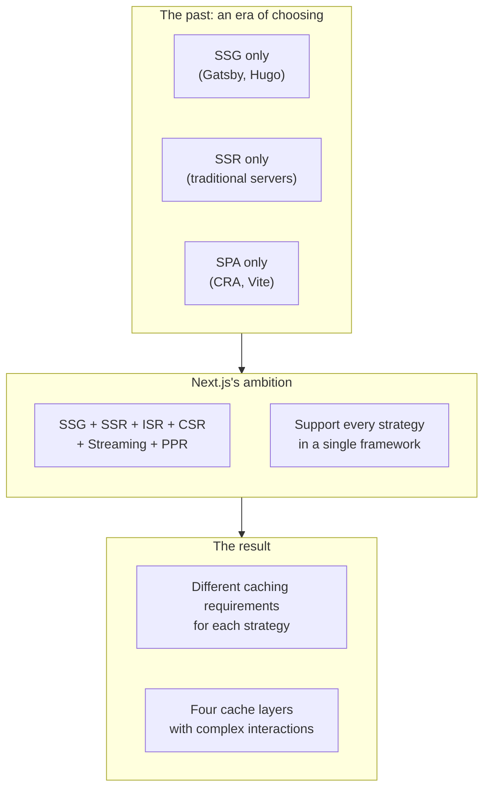

Traditionally, web frameworks focused on a single rendering strategy. Gatsby specialized in SSG, traditional server frameworks in SSR, and Create React App in CSR. Next.js set out to support all of these in one framework, and even added ISR (Incremental Static Regeneration), Streaming, and PPR (Partial Prerendering) on top.

The problem is that each rendering strategy comes with different caching requirements:

| Rendering strategy | Caching requirement                      |
| ------------------ | ---------------------------------------- |
| SSG                | Generated at build time, permanent cache |
| SSR                | No cache or short TTL                    |
| ISR                | Time-based revalidation                  |
| CSR                | Client-side state management             |
| Streaming          | Partial caching, chunk by chunk          |

Supporting all of this naturally required multiple cache layers.

### 2. The New Paradigm of React Server Components

| Aspect        | Pages Router                                      | App Router (RSC)                     |
| ------------- | ------------------------------------------------- | ------------------------------------ |
| Data fetching | `getStaticProps`, `getServerSideProps`            | `async/await` anywhere in components |
| Boundaries    | Clear: fetching functions ↔ rendering components  | Blurry: fetching = rendering         |
| Mental model  | "Data in these functions, components only render" | "Freely, anywhere"                   |

The Pages Router had clear data fetching points: `getStaticProps` and `getServerSideProps`. Developers could hold a mental model of "fetch data in these functions, and only render in components."

The App Router and React Server Components completely changed this paradigm. You can now fetch data anywhere in a component with `async/await`. The freedom increased, but a new kind of complexity emerged: "when is it cached, and when is it not?"

```tsx
// Pages Router: the data fetching point is clear
export async function getStaticProps() {
  const data = await fetchData() // data is fetched only here
  return {props: {data}, revalidate: 60}
}

export default function Page({data}) {
  // this is pure rendering
  return <div>{data}</div>
}

// App Router: data can be fetched anywhere
export default async function Page() {
  const data = await fetchData() // directly inside the component
  const more = await fetchMore() // multiple times, too

  return (
    <div>
      {data}
      <ChildComponent /> {/* children can fetch on their own as well */}
    </div>
  )
}
```

### 3. The Limits of Extending the fetch API

The Next.js team decided to implement caching by extending the web-standard `fetch` API. In theory, this was a good choice:

- No new API to learn
- Compatibility with web standards
- Gradual migration possible

But reality was different. Real projects don't use only `fetch`:

- **ORMs**: Prisma, Drizzle, etc.
- **GraphQL clients**: Apollo, urql, etc.
- **Direct DB connections**: Redis, MongoDB, etc.
- **SDK clients**: Stripe, AWS SDK, etc.

These don't use `fetch`, so Next.js caching doesn't apply to them automatically. Next.js provided separate APIs to cover this, but each came with a different purpose and different constraints, which only added to the confusion:

| API                        | Purpose                      | Cache scope                    | Constraints                                                       |
| -------------------------- | ---------------------------- | ------------------------------ | ----------------------------------------------------------------- |
| `React.cache()`            | Memoize function results     | Within a single request        | Gone when the request ends, no permanent caching                  |
| `unstable_cache()`         | Manually store in Data Cache | Permanent (until revalidation) | Unstable as the name says, function body is part of the cache key |
| `use cache` (experimental) | Cache functions/components   | Permanent                      | Still canary, not usable in production                            |

In the end, the simple question "how do I cache data sources that aren't fetch?" ended up with three different answers.

### 4. Side Effects of the "Zero Config" Philosophy

Next.js aims for "Zero Config" — the philosophy that things should work in an optimized state without any configuration. To achieve this, it **enabled caching by default**.

Despite the good intention of "sensible defaults," in practice it mostly bred confusion. You performed a mutation but the screen didn't update, you slapped `force-dynamic` on a page and something still got cached somewhere, and every time you wanted to turn caching off you had to search for which layer to touch. It was hard to predict when the cache would kick in and when it wouldn't, so behavior frequently felt like a bug. Eventually, Next.js 15 changed direction to "default = caching disabled."

### 5. Deep Ties to the Vercel Platform

To be honest, the Next.js caching system was designed to work best on the Vercel platform. Vercel doesn't keep Next.js open source as charity. If Next.js's complex caching works "like magic" on Vercel but requires extra setup when self-hosted, developers will naturally choose Vercel.

**On Vercel:**

- Data Cache is distributed across the global Edge Network with "cache shielding" applied automatically
- ISR is internally optimized and works without extra configuration
- Cache invalidation propagates quickly to edges worldwide

**Self-hosted:**

- **Single instance**: the default filesystem cache works well enough
- **Multi-instance/Serverless**: requires an external cache store like Redis plus a custom handler
- In Next.js 14 and below, the `stale-while-revalidate` header was missing its time value, causing CDN integration issues (fixed in 15)

If you run a single server, self-hosting works perfectly fine. But in environments that need to scale out, you have to implement yourself what Vercel does automatically. This gap created the perception that "Next.js only works properly on Vercel," which fueled community complaints. Next.js 15 significantly improved the self-hosting docs and made cache handler configuration easier, but the complexity of multi-instance environments remains.

### 6. Was This Complexity Inevitable in the End?

Honestly, I think much of this complexity was **inevitable**. To support diverse rendering strategies while delivering optimal performance, some degree of simplicity had to be sacrificed.

But there was **unnecessary complexity** too:

- Implicit caching behavior (fixed in Next.js 15)
- Inconsistent APIs (the `fetch` extension vs `unstable_cache` vs `React.cache`)
- Insufficient debugging tools
- Behavioral differences between Vercel and self-hosted

The Next.js team is aware of this and is working toward more explicit APIs like the `use cache` directive. It's worth watching how well the new philosophy of "there should be no hidden caches" holds up going forward.

## Step 1: The Big Picture of Caching

### The Four-Cache-Layer Architecture

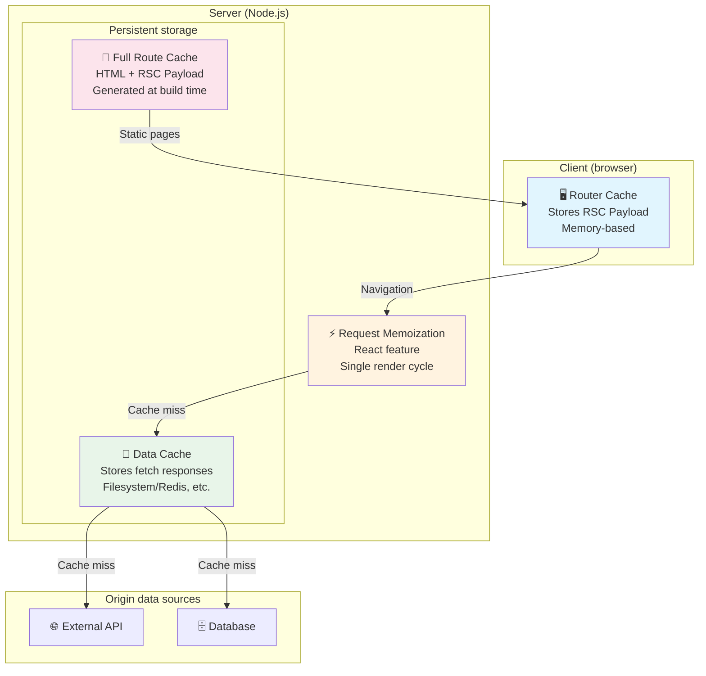

### Detailed Cache Layer Comparison

| Layer               | Location | Storage    | Duration       | Target              | Shared scope           |
| ------------------- | -------- | ---------- | -------------- | ------------------- | ---------------------- |
| Request Memoization | Server   | Memory     | Single request | fetch return values | Within the render tree |
| Data Cache          | Server   | Filesystem | Permanent      | fetch responses     | All requests/deploys   |
| Full Route Cache    | Server   | Filesystem | Permanent      | HTML + RSC          | All users              |
| Router Cache        | Client   | Memory     | Session        | RSC Payload         | Current user           |

### The Request Flow in Detail

When a user requests a page, the caches are checked in the following order.

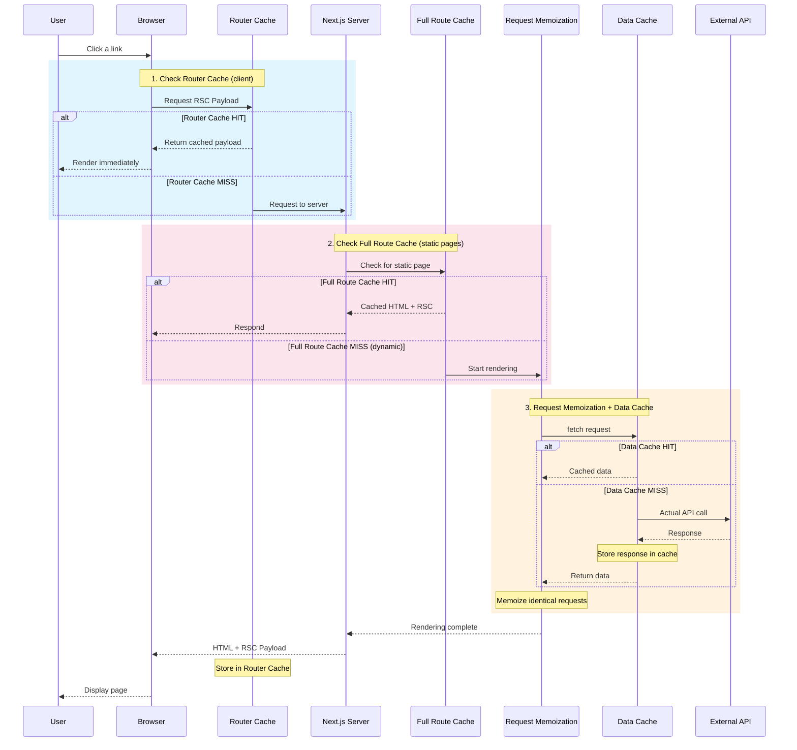

### The Paradigm Shift in Next.js 15

The Next.js team made a 180-degree turn in caching philosophy in version 15, moving from "cache everything by default" to "cache nothing by default."

| Item                | Next.js 14 and below        | Next.js 15 and above      |
| ------------------- | --------------------------- | ------------------------- |
| fetch default       | `force-cache`               | `no-store`                |
| Route Handler       | `force-static`              | `force-dynamic`           |
| Router Cache (Page) | Dynamic 30s, static 5 min   | Not cached                |
| Philosophy          | Opt-out (choose to disable) | Opt-in (choose to enable) |

## Step 2: Deep Dive into Each Cache Layer

### Wait, What's the Difference Between Request Memoization and Data Cache?

This is the most confusing part. Both are related to `fetch`, and both do "caching." But they have completely different purposes and scopes.

**Request Memoization (owned by React)**

- **Purpose**: prevent duplicate execution when the same fetch call happens multiple times during rendering
- **Scope**: the render cycle of a single request (one page render)
- **Storage**: memory (temporary)
- **Lifetime**: deleted when rendering ends
- **Sharing**: not shared with other users/requests

**Data Cache (owned by Next.js)**

- **Purpose**: store API responses for reuse in subsequent requests
- **Scope**: all requests, all users
- **Storage**: filesystem, Redis, etc. (persistent)
- **Lifetime**: kept until the `revalidate` time or manual invalidation
- **Sharing**: all users share the same cache

**Let's understand this with a concrete example:**

```tsx
// Page component
export default async function UserPage() {
  // call #1
  const user1 = await fetch('https://api.example.com/user', {
    next: {revalidate: 3600},
  })

  return (
    <div>
      <Header /> {/* calls the same API internally */}
      <Sidebar /> {/* calls the same API internally */}
    </div>
  )
}

async function Header() {
  // call #2 (same URL)
  const user2 = await fetch('https://api.example.com/user', {
    next: {revalidate: 3600},
  })
  return <div>{user2.name}</div>
}

async function Sidebar() {
  // call #3 (same URL)
  const user3 = await fetch('https://api.example.com/user', {
    next: {revalidate: 3600},
  })
  return <div>{user3.email}</div>
}
```

**What happens when this code runs?**

```mermaid
sequenceDiagram
    participant Page as UserPage
    participant RM as Request Memoization
    participant DC as Data Cache
    participant API as External API

    Note over Page: First user request

    Page->>RM: fetch('/user') #1
    RM->>DC: Check cache
    DC->>API: Cache miss, call API
    API-->>DC: Response data
    Note over DC: Store in Data Cache<br/>(valid for 1 hour)
    DC-->>RM: Return data
    Note over RM: Store in Request Memoization
    RM-->>Page: Data

    Page->>RM: fetch('/user') #2 (Header)
    Note over RM: Memoization hit!
    RM-->>Page: Cached data (no API call)

    Page->>RM: fetch('/user') #3 (Sidebar)
    Note over RM: Memoization hit!
    RM-->>Page: Cached data (no API call)

    Note over RM: Rendering complete, Request Memoization deleted

    Note over Page: Second user request (30 minutes later)

    Page->>RM: fetch('/user')
    RM->>DC: Check cache
    Note over DC: Data Cache hit!<br/>(1 hour hasn't passed yet)
    DC-->>RM: Cached data (no API call)
    RM-->>Page: Data
```

**To summarize:**

| Aspect   | Request Memoization                            | Data Cache                         |
| -------- | ---------------------------------------------- | ---------------------------------- |
| Owner    | React                                          | Next.js                            |
| Purpose  | Prevent duplicate calls within the same render | Reuse data across requests         |
| Scope    | Component tree of a single request             | All requests, all users            |
| Lifetime | Deleted when rendering ends                    | Kept until the `revalidate` time   |
| Storage  | Memory (temporary)                             | Filesystem/external storage        |
| Config   | Automatic (opt-out only)                       | `cache`, `next.revalidate` options |
| Sharing  | Not shared with other requests                 | Shared by all requests             |

The core difference in one sentence each:

- **Request Memoization**: "You're making the same fetch you made earlier in this render? Here's the result from before."
- **Data Cache**: "I'll store this API response and reuse it for whoever requests it next."

That's the gist of it.

### 2.1 Request Memoization

**Key point: this is a React feature, not a Next.js one.**

When the same fetch request occurs multiple times during rendering, React reuses the result of the first request. This lets you freely design your component structure around data dependencies.

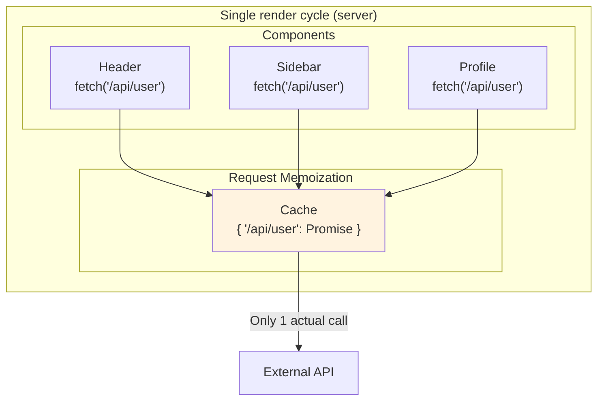

#### How Cache Keys Are Generated

The Request Memoization cache key is composed of the following elements:

```typescript
// Cache key = combination of URL + HTTP method + request options
const cacheKey = JSON.stringify({
  url: 'https://api.example.com/user',
  method: 'GET',
  headers: { ... },
  // ... other options
})
```

**Important**: [W3C trace context](https://www.w3.org/TR/trace-context/) headers like `traceparent` and `tracestate` are excluded from the cache key. These headers change with every request, so including them would render the cache useless. The Next.js source code explicitly strips these headers. ([relevant GitHub code](https://github.com/vercel/next.js/blob/canary/packages/next/src/server/lib/incremental-cache/index.ts#L387-L406))

#### Limitations

Request Memoization only works **inside React's component tree**. In other words, it deduplicates when multiple components call the same fetch within one render cycle.

**✅ Where memoization works:**

Server Components, Layouts, Pages, and functions that run during build/render such as `generateMetadata` and `generateStaticParams`. These all execute inside React's rendering context, so memoization applies.

**❌ Where memoization does not work:**

- **Route Handlers**: API routes (`/api/...`) run independently, outside the component tree. Calling fetch multiple times here sends each as a separate request.
- **POST, DELETE, etc.**: only GET and HEAD are memoized. Other HTTP methods can cause side effects, so they are intentionally excluded.
- **When passing an AbortSignal**: passing a cancellation signal like `fetch(url, { signal })` disables memoization, because cancellable requests must each be managed independently.

#### Memoizing Non-fetch Functions with React.cache()

When you're not using fetch (ORMs, direct DB queries, etc.), use React's `cache()` function.

```tsx
// lib/data.ts
import {cache} from 'react'
import {db} from '@/lib/db'

// ✅ Correct usage: defined at module level
export const getUser = cache(async (id: string) => {
  return await db.user.findUnique({where: {id}})
})

export const getPost = cache(async (slug: string) => {
  return await db.post.findUnique({where: {slug}})
})
```

**Key characteristics of React.cache():**

- **Server Components only**: it can't be used in Client Components. On the client, use `useMemo` instead.
- **How it works**: on the first call, execute the function and cache the result → on re-invocation with the same arguments, return from the cache → with different arguments, execute anew.
- **Errors are cached too**: if the function throws, that error is cached, and calling again with the same arguments throws the same error.
- **Cache key comparison**: shallow comparison using `Object.is()`. Primitives are compared by value, objects by reference.
- **No manual invalidation**: there's no way to invalidate the cache manually. It's invalidated automatically when the server request ends.

#### What Is a "Request-Scoped Cache"?

The statement "the cache disappears when the request ends" can be confusing. Doesn't that make it not a cache?

```
User A visits the /profile page
    ↓
Server starts rendering (one "request")
    ├─ Header component  → calls getUser('123')  ← actually executed
    ├─ Sidebar component → calls getUser('123')  ← cache hit!
    └─ Profile component → calls getUser('123')  ← cache hit!
    ↓
Rendering complete, HTML response
    ↓
Cache deleted
```

Within the same render cycle, `getUser('123')` executes **only once**, and the other two calls reuse the cached result. That is the "cache."

But the next request **starts fresh**:

```
User A request → getUser('123') runs → cache → response → cache deleted
User B request → getUser('123') runs again → new cache → response → cache deleted
```

| Cache type      | Analogy                                                                      | Scope          |
| --------------- | ---------------------------------------------------------------------------- | -------------- |
| `React.cache()` | Not taking the same ingredient out multiple times during one cooking session | Single request |
| `Data Cache`    | Keeping ingredients in the fridge for the next meal too                      | All requests   |

Why it was designed this way:

- **Memory management**: if caches accumulated per request, server memory would explode
- **Data freshness**: guarantees that the next request always has a chance to fetch the latest data
- **Separation of purpose**: use `cache()` for render optimization, and `unstable_cache` or fetch's Data Cache for persistent caching

#### The Preload Pattern

One powerful use of `cache()` is the preload pattern. You request data ahead of time, and the component that actually needs it uses the cached result.

```tsx
// lib/data.ts
import {cache} from 'react'

export const getUser = cache(async (id: string) => {
  return await db.user.findUnique({where: {id}})
})

// Explicit preload function (optional)
export const preloadUser = (id: string) => {
  void getUser(id)
}
```

```tsx
// app/user/[id]/page.tsx
import {getUser, preloadUser} from '@/lib/data'

export default async function UserPage({params}: {params: {id: string}}) {
  // 1. Start the data request as soon as rendering begins (no await!)
  preloadUser(params.id)

  // 2. Other synchronous work can happen here
  const headerConfig = getHeaderConfig()

  return (
    <>
      <Header config={headerConfig} />
      <UserProfile id={params.id} /> {/* 3. The cached Promise is used here */}
    </>
  )
}

async function UserProfile({id}: {id: string}) {
  // Reuses the Promise of the request already started by preload
  const user = await getUser(id)
  return <div>{user.name}</div>
}
```

This pattern prevents waterfalls and maximizes parallel requests.

**Caveats:**

```tsx
// ❌ Wrong: calling cache() inside a component
function Profile({ userId }) {
  // Creates a new cached function on every render!
  const getUser = cache(async (id) => { ... })
  const user = await getUser(userId)
}

// ❌ Wrong: calling the cached function outside a component
const getUser = cache(async (id) => { ... })
getUser('demo-id') // No cache context

async function Profile() {
  const user = await getUser('demo-id') // Cache miss
}

// ❌ Wrong: passing a new object every time
const processData = cache((data) => { ... })

function Component(props) {
  // props is a new object each time, so cache miss
  const result = processData(props)
}

// ✅ Correct: pass primitive values
const processData = cache((x, y, z) => { ... })

function Component({ x, y, z }) {
  const result = processData(x, y, z) // Cache hit when the values match
}
```

**cache() vs useMemo vs memo comparison:**

| Aspect         | `cache()`                       | `useMemo()`                | `memo()`                     |
| -------------- | ------------------------------- | -------------------------- | ---------------------------- |
| Where used     | Server Components               | Client Components          | Client Components            |
| Purpose        | Cache function results          | Cache computed results     | Prevent component re-renders |
| Cache sharing  | Shared across components        | Within that component      | That component only          |
| Cache size     | Stores multiple argument combos | Stores only the latest one | N/A                          |
| Cache lifetime | Single request                  | Kept across re-renders     | Kept while props are equal   |

### 2.2 Data Cache

The Data Cache stores fetch responses **persistently** on the server. Unlike Request Memoization, which is valid only within a single request, the Data Cache **persists across deploys**.

**Storage:**

- Vercel: globally distributed cache (Vercel's Edge Network)
- Self-hosted: by default, memory (50MB) + filesystem ([self-hosting guide](https://nextjs.org/docs/app/guides/self-hosting))
  - Specific location: `.next/cache/fetch-cache/` (based on the Next.js source code)
- Custom Handler: Redis, Memcached, etc. (implemented yourself)

```bash
# Inspect the Data Cache when self-hosted
ls .next/cache/fetch-cache/
# Example output: files named with hashed cache keys
# a1b2c3d4e5f6...
# f6e5d4c3b2a1...
```

#### How the Filesystem Cache Works

Whenever the Next.js server receives a cacheable fetch response, it writes it to the filesystem:

```
1. fetch() call (cache: 'force-cache' or a revalidate setting)
     ↓
2. Check the .next/cache/fetch-cache/ directory
     ↓
3-a. Cache hit → read from the file and return
3-b. Cache miss → call the API → save the response to a file → return
```

Each cache file is JSON, containing the response body and metadata:

```json
{
  "kind": "FETCH",
  "data": {
    "body": "...",
    "headers": {"content-type": "application/json"},
    "status": 200
  },
  "revalidate": 3600,
  "tags": ["posts"]
}
```

#### Limits of the Filesystem Cache

The filesystem cache works well in **single-server environments**, but problems can arise in modern deployment setups:

| Environment                     | Cache storage                          | Problem                                  |
| ------------------------------- | -------------------------------------- | ---------------------------------------- |
| Single server                   | Local filesystem                       | Fine                                     |
| Multi-instance (k8s, ECS, etc.) | Local filesystem of each Pod/container | **Cache inconsistency across instances** |
| Serverless (AWS Lambda, etc.)   | Container filesystem                   | **Cache lost on cold start**             |
| Vercel                          | Vercel Edge Network                    | Globally distributed, no problem         |

In multi-instance environments, whenever the load balancer routes a request to a different server, you can get cache misses or different versions of data being returned. In serverless environments, a cold-started function has none of the previous cache. In these environments, an external cache store like Redis is a better choice.

#### How Are Cache Keys Generated?

The Data Cache key is composed of: **URL, HTTP method, Headers (with some excluded), Request Body, and `next.tags`**. Even for the same URL, different headers result in different cache entries.

#### fetch Options in Detail

```tsx
// 1. Enable caching (Next.js 14 default)
const data = await fetch('https://api.example.com/data', {
  cache: 'force-cache',
})

// 2. Disable caching (Next.js 15 default)
const data = await fetch('https://api.example.com/data', {
  cache: 'no-store',
})

// 3. Time-based revalidation
const data = await fetch('https://api.example.com/data', {
  next: {revalidate: 3600}, // 1 hour
})

// 4. Tag-based caching (for on-demand revalidation)
const data = await fetch('https://api.example.com/posts', {
  next: {tags: ['posts', 'homepage']},
})

// 5. Combined settings
const data = await fetch('https://api.example.com/posts', {
  next: {
    revalidate: 3600,
    tags: ['posts'],
  },
})
```

#### Deep Dive into the Stale-While-Revalidate Pattern

Next.js's time-based revalidation follows HTTP's `stale-while-revalidate` pattern.

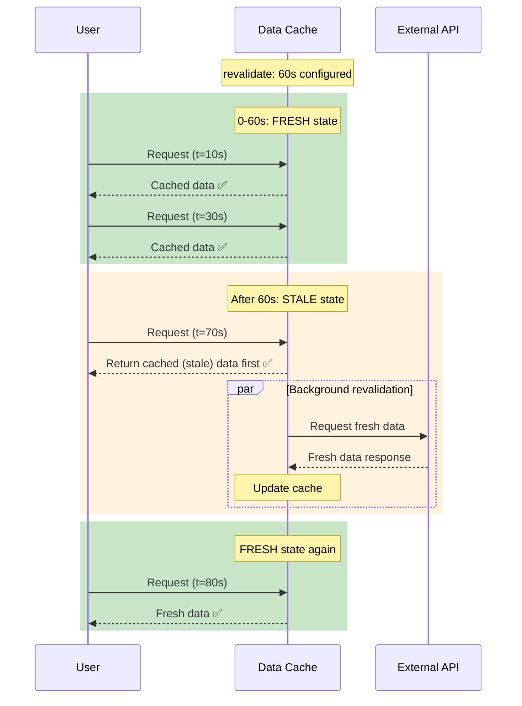

**Important point**: even after the revalidation time passes, Next.js does **not fetch new data immediately**. It first returns the stale data to the user and fetches fresh data in the background. The "next user" is the one who receives the fresh data.

#### unstable_cache: Caching Non-fetch Data Sources

When using an ORM or a DB client, use `unstable_cache`.

```tsx
import {unstable_cache} from 'next/cache'
import {db} from '@/lib/db'

const getCachedUser = unstable_cache(
  async (userId: string) => {
    return await db.user.findUnique({where: {id: userId}})
  },
  ['user'], // cache key array
  {
    tags: ['user'],
    revalidate: 3600,
  },
)

export default async function Profile({userId}) {
  const user = await getCachedUser(userId)
  return <div>{user.name}</div>
}
```

**How unstable_cache generates cache keys:**

The cache key is generated by combining the `keyParts array` + `function arguments` + `the function body (serialized!)`.

**Caveats:**

`unstable_cache` carries a few tricky constraints — enough that "unstable" is right there in its name:

- **The function body is part of the cache key**: if the function's contents change even slightly, the cache is invalidated. The entire function is serialized for this, which introduces performance overhead.
- **Only serializable values can be returned**: returning class instances like a Prisma client will fail. You must return plain objects or primitives only.
- **Errors are cached too**: if the function throws, that error is cached, and subsequent calls throw the same error.
- **A request context is required**: it doesn't work when called outside a component or page (e.g., at module top level).

#### The use cache Directive (Experimental)

To overcome the limitations of `unstable_cache`, the Next.js team is developing the `use cache` directive. It's still experimental even in Next.js 16, and you must enable a flag in `next.config.js` to use it.

```js
// next.config.js
const nextConfig = {
  experimental: {
    useCache: true,
  },
}
```

```tsx
// Function-level caching
async function getUser(id: string) {
  'use cache'
  return await db.user.findUnique({where: {id}})
}

// Page-level caching
;('use cache')

export default async function Page() {
  const data = await fetch('...')
  return <div>{data}</div>
}
```

`use cache` uses a much more intuitive cache key scheme than `unstable_cache`:

- **Build ID**: changes automatically with every new build, invalidating all caches. When the code changes, the cache should change too, so this is reasonable.
- **Function ID**: instead of the entire function body, only a hash of its location in the codebase and its signature is used. More efficient than `unstable_cache`.
- **Serializable arguments**: the argument values passed to the function become part of the cache key. Calling with the same arguments is a cache hit; different arguments, a cache miss.

Once stabilized, it is expected to fully replace `unstable_cache`.

### 2.3 Full Route Cache

#### What Is the Full Route Cache?

When you run `next build`, Next.js analyzes each page and pre-renders **pages that can be generated statically**. The HTML and RSC Payload produced this way are called the **Full Route Cache**.

**Why is it needed?**

```
Dynamic rendering (no Full Route Cache):
  User request → render on server → generate HTML → respond

Static rendering (with Full Route Cache):
  Pre-render at build time → store
  User request → return the stored HTML immediately
```

Static pages don't need to be rendered on the server every time. Since the pre-built HTML can be sent right away, **response times are extremely fast** and server load drops. Cached on a CDN, they can be accessed quickly from anywhere in the world.

**Storage location:**

```bash
.next/server/app/
├── page.html           # HTML for the / path
├── page_client-reference-manifest.js
├── about/
│   └── page.html       # HTML for the /about path
└── blog/
    └── [slug]/
        └── page.html   # HTML for /blog/[slug] paths (those produced by generateStaticParams)
```

#### Static vs Dynamic: How Is It Decided?

At build time, Next.js analyzes each page's code and determines whether it can be generated statically.

**Conditions that switch a page to dynamic rendering:**

1. **Using a Dynamic API**: calling `cookies()`, `headers()`, `searchParams`, or `connection()`
2. **A cache-disabled fetch**: `cache: 'no-store'` or `revalidate: 0`
3. **Route Config**: `export const dynamic = 'force-dynamic'`

```tsx
// ✅ Static rendering (stored in the Full Route Cache)
export default async function AboutPage() {
  const data = await fetch('https://api.example.com/about', {
    next: {revalidate: 3600},
  })
  return <div>{data}</div>
}

// ❌ Dynamic rendering (no Full Route Cache)
export default async function DashboardPage() {
  const session = cookies().get('session') // Uses a Dynamic API!
  return <div>Welcome, {session?.value}</div>
}
```

**Checking the build log:**

```bash
Route (app)                    Size     First Load JS
┌ ○ /                         5.2 kB        89 kB
├ ○ /about                    1.2 kB        85 kB
├ λ /dashboard                3.1 kB        87 kB    # λ = dynamic
└ ● /blog/[slug]              2.8 kB        86 kB    # ● = ISR

○ = static (generated at build time)
● = ISR (generated at build time + revalidated)
λ = dynamic (rendered per request)
```

#### generateStaticParams: Making Dynamic Routes Static

A dynamic route like `/blog/[slug]` can't be generated statically by default, since there's no way to know which slug values will come in. With `generateStaticParams`, you can specify **which paths to pre-generate at build time**.

```tsx
// app/blog/[slug]/page.tsx

// Runs at build time
export async function generateStaticParams() {
  const posts = await fetch('https://api.example.com/posts').then((res) =>
    res.json(),
  )

  // Generate only the top 10 at build time
  return posts.slice(0, 10).map((post) => ({
    slug: post.slug,
  }))
}

// Decide the behavior for remaining paths
export const dynamicParams = true // (default) generated on first request
// export const dynamicParams = false // return 404
```

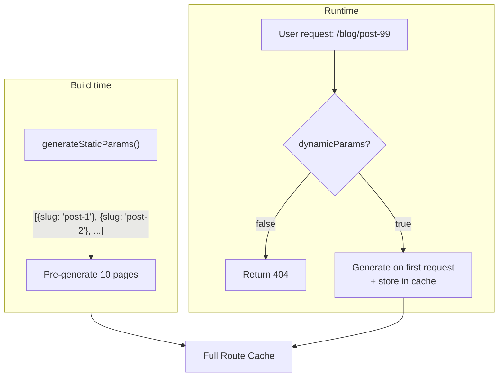

**The relationship with ISR:**

```tsx
// Enable ISR: return an empty array
export async function generateStaticParams() {
  return [] // Generate nothing at build time
}

// Every page is generated on first request,
// and revalidated via ISR according to the revalidate setting
```

### 2.4 Router Cache

#### What Is the Router Cache?

The Router Cache is the only one of the four caches that operates on the **client (browser)**. As users navigate between pages, the **RSC Payload** (the rendered output of React Server Components) received from the server is stored in browser memory and reused when the same page is visited again.

**What is the RSC Payload?**

It's the rendered output of server components. It's not HTML, but a special data format React uses to construct the DOM on the client. Caching this payload lets pages appear instantly on navigation without a server request.

**Why is it needed?**

```
Typical SPA navigation:
  Click link → request server → wait for response → render

With the Router Cache:
  Click link → render immediately from cache (no server request)
```

In particular, the `<Link>` component automatically **prefetches** the target page when it enters the viewport. The data is fetched and cached before the user even clicks, so the page transition is instant on click.

#### Differences from the Other Caches

| Aspect       | Router Cache                  | Data Cache / Full Route Cache        |
| ------------ | ----------------------------- | ------------------------------------ |
| Location     | Browser memory                | Server (filesystem/external storage) |
| Shared scope | Current tab/session only      | All users                            |
| Duration     | For the session or a set time | Permanent until revalidation         |
| Stored data  | RSC Payload                   | fetch responses / HTML               |

**A crucial difference**: calling `revalidatePath()` on the server does **not invalidate the Router Cache in other users' browsers**. Each browser holds its own independent cache.

#### Changes in Next.js 15

Up through Next.js 14, the Router Cache was **enabled by default**. Visiting a page cached it for 30 seconds to 5 minutes, and revisiting showed the cached data without a server request. This caused a lot of confusion like "I updated the data but it's not reflected."

Next.js 15 **disabled page caching by default**:

| Item           | Next.js 14  | Next.js 15         |
| -------------- | ----------- | ------------------ |
| Layout         | 5 min cache | 5 min cache (kept) |
| Loading        | -           | 5 min cache        |
| Page (static)  | 5 min cache | **Not cached**     |
| Page (dynamic) | 30s cache   | **Not cached**     |

Layouts are still cached. In most apps, layouts (headers, sidebars, etc.) rarely change, so caching them causes few problems. But page content is no longer cached, so users always see the latest data.

**Exceptions:**

- **Back/forward navigation**: like the browser's bfcache, the previous page state is restored as-is
- **Links with `prefetch={true}`**: explicitly enabling prefetch caches the page for 5 minutes

#### Understanding Prefetch Behavior

The `<Link>` component automatically prefetches the target page when it becomes visible:

```tsx
// 1. Static route: prefetch the entire page
<Link href="/about">About</Link>
// When visible in the viewport → preload the entire /about page → cache for 5 minutes

// 2. Dynamic route: prefetch only up to the Loading state
<Link href="/posts">Posts</Link>
// When visible in the viewport → preload only up to loading.tsx
// On click → fetch the actual page data (Next.js 15: not cached)

// 3. Force-enable prefetch
<Link href="/posts" prefetch={true}>Posts</Link>
// Prefetch the entire page even for dynamic routes → cache for 5 minutes

// 4. Disable prefetch
<Link href="/posts" prefetch={false}>Posts</Link>
// No prefetch even when visible → fetch only on click
```

**Tip**: setting `prefetch={true}` for frequently visited pages and `prefetch={false}` for rarely visited ones can optimize network usage.

#### Invalidating the Router Cache

Since the Router Cache lives on the client, invalidating it works differently:

| Method                 | Behavior                                             | When to use                                   |
| ---------------------- | ---------------------------------------------------- | --------------------------------------------- |
| `router.refresh()`     | Re-fetches only the current page's server components | When data needs refreshing from the client    |
| `revalidatePath()`     | Invalidates the cache for that path                  | After data changes in a Server Action         |
| `revalidateTag()`      | Invalidates all caches with that tag                 | After related data changes in a Server Action |
| `cookies.set/delete()` | Invalidates the entire Router Cache                  | On login/logout                               |

**`router.refresh()` vs a full reload (F5):**

```tsx
'use client'

function RefreshButton() {
  const router = useRouter()

  return <button onClick={() => router.refresh()}>Refresh data</button>
}
```

- `router.refresh()`: re-renders only the server components, preserving client state (useState, etc.)
- Full reload (F5): reloads the whole page, resetting all state

```tsx
// Invalidating from a Server Action
'use server'

import {revalidatePath, revalidateTag} from 'next/cache'
import {cookies} from 'next/headers'

export async function updatePost(id: string, data: FormData) {
  await db.post.update({where: {id}, data})

  // Method 1: path-based
  revalidatePath('/posts')
  revalidatePath(`/posts/${id}`)

  // Method 2: tag-based
  revalidateTag('posts')

  // Method 3: everything including the layout
  revalidatePath('/posts', 'layout')
}

export async function logout() {
  cookies().delete('session')
  // → Router Cache invalidated automatically
}
```

```tsx
// Invalidating from the client
'use client'

import {useRouter} from 'next/navigation'

function RefreshButton() {
  const router = useRouter()

  return <button onClick={() => router.refresh()}>Refresh</button>
}
```

## Step 3: Interactions Between Caches and Advanced Patterns

### The Cascade Effect of Invalidation

The caches don't exist independently — they are connected by **dependency relationships**. Data from the Data Cache is used to generate the Full Route Cache (HTML), and from that HTML the Router Cache (RSC Payload) is created.

Because of these dependencies, invalidating a lower layer automatically invalidates the layers above it. For example, invalidating the Data Cache also invalidates the Full Route Cache that used that data, since it has to be regenerated. Conversely, invalidating only an upper layer leaves the lower layers intact.

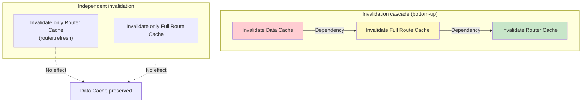

**Invalidation matrix:**

| Invalidation target    |   Data Cache    | Full Route Cache |      Router Cache      |
| ---------------------- | :-------------: | :--------------: | :--------------------: |
| `revalidateTag('x')`   |       ✅        |        ✅        |           ✅           |
| `revalidatePath('/x')` |       ✅        |        ✅        |           ✅           |
| `router.refresh()`     |       ❌        |        ❌        | ✅ (current page only) |
| New deploy             | ❌ (preserved!) |        ✅        |          N/A           |

**Important**: the Data Cache survives a new deploy! If you don't know this, you end up in the "I deployed, so why hasn't the data changed?" situation.

### The On-demand Revalidation Webhook Pattern

This is the most useful pattern when integrating with a CMS or external service. When content changes, the cache is invalidated immediately via a webhook.

```tsx
// app/api/revalidate/route.ts
import {revalidateTag, revalidatePath} from 'next/cache'
import {NextRequest, NextResponse} from 'next/server'

export async function POST(request: NextRequest) {
  // 1. Verify authentication
  const secret = request.headers.get('x-revalidate-secret')
  if (secret !== process.env.REVALIDATE_SECRET) {
    return NextResponse.json({message: 'Invalid secret'}, {status: 401})
  }

  // 2. Parse the webhook payload
  const body = await request.json()
  const {type, slug} = body

  try {
    // 3. Tag-based invalidation (recommended)
    switch (type) {
      case 'post':
        revalidateTag('posts')
        revalidateTag(`post-${slug}`)
        break
      case 'product':
        revalidateTag('products')
        revalidatePath(`/products/${slug}`)
        break
      default:
        revalidateTag('all')
    }

    return NextResponse.json({revalidated: true, now: Date.now()})
  } catch (error) {
    return NextResponse.json({message: 'Error revalidating'}, {status: 500})
  }
}
```

**Configuring fetch tags for CMS integration:**

```tsx
// fetch with tags
async function getPost(slug: string) {
  const res = await fetch(`${CMS_URL}/posts/${slug}`, {
    next: {
      tags: ['posts', `post-${slug}`], // fine-grained tags
      revalidate: 3600, // time-based revalidation as a backup
    },
  })
  return res.json()
}
```

**Choosing between revalidatePath and revalidateTag:**

| Situation                    | Recommended approach                 | Reason                                    |
| ---------------------------- | ------------------------------------ | ----------------------------------------- |
| Refresh only a specific page | `revalidatePath('/posts/123')`       | Targets an exact path                     |
| Refresh all related pages    | `revalidateTag('posts')`             | Invalidates every cache linked by the tag |
| Refresh including the layout | `revalidatePath('/posts', 'layout')` | Invalidates the layout cache as well      |
| Refresh the entire site      | `revalidatePath('/', 'layout')`      | Invalidates everything from the root      |

### The Hybrid Caching Pattern

This is the pattern used most often in practice: **render the page dynamically, but cache some of the data**.

Consider a product detail page. Product information (name, price, description) is the same for every user, so it's fine to cache. But cart information differs per user, so it must not be cached. And since showing the cart requires identifying the user via `cookies()`, the entire page becomes dynamically rendered.

In this situation, thinking "the page is dynamic, so I shouldn't cache any of the fetches either" wastes performance. **Dynamic rendering and the Data Cache are separate concerns.** Even if a page is rendered dynamically, the fetches inside it can still use the Data Cache.

```tsx
import {cookies} from 'next/headers'

export default async function ProductPage({params}) {
  // ✅ This data goes into the Data Cache (shared by all users)
  const product = await fetch(`https://api.example.com/products/${params.id}`, {
    next: {revalidate: 3600, tags: ['products']},
  }).then((r) => r.json())

  // ⚠️ Calling cookies() makes the page dynamically rendered
  const userId = cookies().get('userId')?.value

  // ✅ Per-user data is not cached
  const cartItems = userId
    ? await fetch(`https://api.example.com/cart/${userId}`, {
        cache: 'no-store',
      }).then((r) => r.json())
    : []

  return (
    <div>
      <ProductDetails product={product} />
      <AddToCart productId={params.id} cartItems={cartItems} />
    </div>
  )
}
```

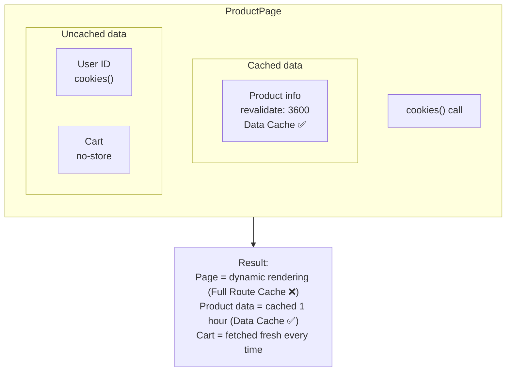

### Parallel Data Fetching and Caching

When multiple pieces of data need to be fetched, **sequential awaits** create a waterfall. The second request doesn't start until the first finishes, so the request times add up.

**With `Promise.all()`, all requests start at once**, and the total time approaches that of the longest single request. And if the requests are cached, the ones that hit the cache return almost instantly.

```tsx
export default async function Dashboard() {
  // ❌ Sequential: total time = getUser + getPosts + getAnalytics (summed)
  const user = await getUser()
  const posts = await getPosts()
  const analytics = await getAnalytics()

  // ✅ Parallel: total time = max(getUser, getPosts, getAnalytics)
  const [user, posts, analytics] = await Promise.all([
    getUser(), // returns immediately on cache hit
    getPosts(), // returns immediately on cache hit
    getAnalytics(), // calls the API on cache miss
  ])

  return <DashboardView user={user} posts={posts} analytics={analytics} />
}
```

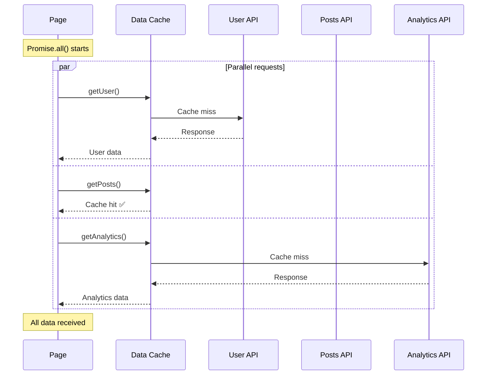

### Self-hosted vs Vercel Environment Differences

Because Next.js is made by Vercel, deploying to Vercel gets you every caching feature in its optimized form. But deploying to AWS, GCP, or your own servers comes with a few differences. Not knowing them leads to problems like "it worked on Vercel but not on our server."

| Aspect             | Vercel                            | Self-hosted                                    |
| ------------------ | --------------------------------- | ---------------------------------------------- |
| Data Cache         | Globally distributed              | Local filesystem (`.next/cache/`)              |
| ISR revalidation   | Handled automatically at the edge | Handled on a single server                     |
| Cache invalidation | Propagated automatically          | Possible inconsistency with multiple instances |
| SWR support        | Fully supported                   | Requires CDN configuration                     |

Vercel stores caches on its globally distributed Edge Network and automatically propagates `revalidateTag()` calls to every edge node. In a self-hosted environment, you have to implement all of this yourself or find alternatives.

**Key issues in self-hosted environments:**

#### 1. Multi-instance Cache Inconsistency

Running multiple instances in environments like Kubernetes or AWS ECS means each instance holds an **independent filesystem cache**. Data cached on instance A doesn't exist on instance B, so users may see different data depending on where the load balancer routes their request.

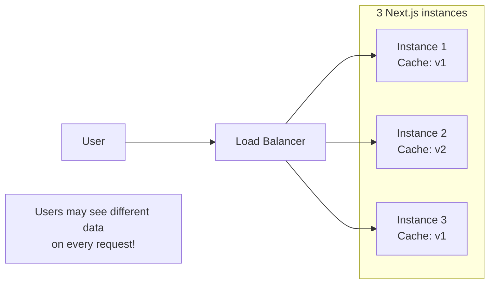

**Solution: a Custom Cache Handler**

If every instance shares an **external store like Redis** instead of its local filesystem, a cache written by any instance can be read by all the others. That way, no matter where the load balancer sends a request, the same data is returned.

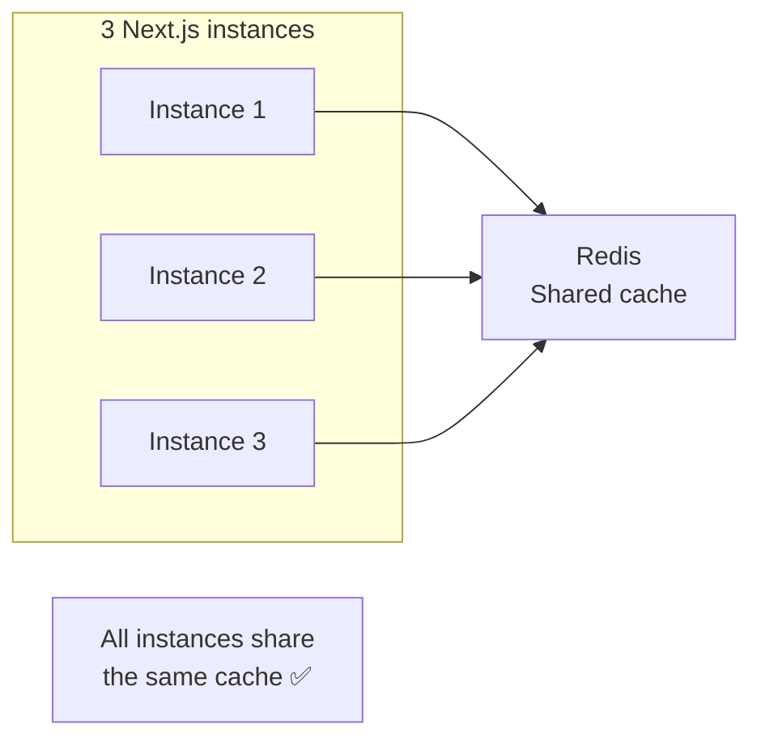

```tsx
// cache-handler.js
const Redis = require('ioredis')
const redis = new Redis(process.env.REDIS_URL)

module.exports = {
  async get(key) {
    const data = await redis.get(key)
    return data ? JSON.parse(data) : null
  },

  async set(key, data, ctx) {
    const ttl = ctx.revalidate || 60 * 60 // default 1 hour
    await redis.setex(key, ttl, JSON.stringify(data))
  },

  async revalidateTag(tags) {
    // Implement tag-based invalidation
    for (const tag of tags) {
      const keys = await redis.keys(`*:tag:${tag}:*`)
      if (keys.length) await redis.del(...keys)
    }
  },
}
```

```js
// next.config.js
module.exports = {
  cacheHandler: require.resolve('./cache-handler.js'),
  cacheMaxMemorySize: 0, // disable the in-memory cache
}
```

#### 2. The stale-while-revalidate Header Issue (Next.js 14 and below)

`stale-while-revalidate` is an HTTP header that tells a CDN to serve stale data while fetching fresh data in the background. This feature needs to work correctly for ISR to cooperate well with a CDN.

The problem is that in Next.js 14 and below, this header was missing its time value, so CDNs like Cloudflare or CloudFront could ignore it. Vercel's own CDN is optimized for Next.js so there's no issue there, but on other CDNs, ISR revalidation may not behave as expected.

```js
// next.config.js (needed on Next.js 14 and below)
module.exports = {
  experimental: {
    swrDelta: 31536000, // 1 year (maximum time to keep serving stale)
  },
}
```

Adding this setting produces the `Cache-Control: s-maxage=N, stale-while-revalidate=31536000` header, and the CDN behaves correctly. This issue was fixed in Next.js 15.

### How to Debug the Cache

When the cache doesn't behave as expected, here are ways to diagnose the problem.

#### 1. Enable Logging in Development

Next.js can log cache behavior via a hidden environment variable. Setting it in `.env.local` prints the cache hit/miss status of each fetch request to the console.

```bash
# .env.local
NEXT_PRIVATE_DEBUG_CACHE=1
```

With this enabled, you'll see logs like:

```
[cache] GET https://api.example.com/posts HIT
[cache] GET https://api.example.com/users MISS
```

`HIT` means the data came from the cache, and `MISS` means the API was actually called. If the results differ from what you expect, check your fetch options.

#### 2. Test with a Production Build

As explained in mistake 3, the Full Route Cache doesn't operate in development. To verify caching behavior accurately, you must test with a production build.

```bash
npm run build && npm run start
```

Check the symbol next to each page in the build log (○, ●, λ) and verify the rendering type is assigned as intended.

#### 3. Inspect Response Headers

The most reliable way to check cache status in production is to look at the HTTP response headers.

```bash
curl -I https://your-site.com/page
```

**Headers on Vercel:**

- `x-vercel-cache: HIT` - served from Vercel's Edge Cache
- `x-vercel-cache: MISS` - cache miss, fetched from the origin server
- `x-vercel-cache: STALE` - serving stale data, revalidating in the background

**Headers when self-hosted:**

```
cache-control: s-maxage=3600, stale-while-revalidate=31536000
```

`s-maxage` is the CDN/proxy cache time, and `stale-while-revalidate` is how long it may respond with stale data while revalidating.

#### 4. Inspect the .next Directory Directly

When self-hosted, you can inspect the cache stored on the filesystem directly.

```bash
# Data Cache: where fetch responses are stored
ls -la .next/cache/fetch-cache/
# If you see hashed filenames, the cache is being written

# Full Route Cache: where static pages are stored
ls -la .next/server/app/
# If you see page.html files, static generation happened
```

To look inside a cache file:

```bash
cat .next/cache/fetch-cache/<hash> | jq
```

Here you can check the `revalidate` value, `tags`, the cached response data, and more.

## Step 4: Common Mistakes in Practice

### Mistake 1: Setting force-dynamic on Every Page

**Symptoms**: "Pages got slower", "Server costs are higher than expected", "TTFB is high"

**Why does this happen?**

Setting `force-dynamic` means the page is **rendered fresh on the server for every request**. A static page pre-builds its HTML at build time and serves it straight from the CDN, responding within a few milliseconds. But a dynamic page, on every request:

1. The server receives the request
2. Fetches data (if any)
3. Renders with React
4. Generates HTML
5. Responds

It goes through all of these steps. If you make a page like "About Us" — with no data that ever changes — dynamic, users wait unnecessarily every time, and in serverless environments the function invocation costs keep accruing.

```tsx
// ❌ Wrong approach: static content configured as dynamic
export const dynamic = 'force-dynamic'

export default async function AboutPage() {
  return (
    <div>
      <h1>About Us</h1>
      <p>We were founded in 2020...</p>
    </div>
  )
}
```

**Consequences:**

- Increased TTFB: static pages respond straight from the CDN, but dynamic pages must go through server rendering
- Serverless cost: function execution cost on every request
- Reduced CDN benefit: static responds right at the edge, dynamic always round-trips to the origin server

```tsx
// ✅ Keep the default for static pages
export default async function AboutPage() {
  return (
    <div>
      <h1>About Us</h1>
      <p>We were founded in 2020...</p>
    </div>
  )
}
```

### Mistake 2: fetch Wrapped in a Wrapper Function Doesn't Get Cached

A problem frequently reported in [GitHub Issue #71881](https://github.com/vercel/next.js/issues/71881).

```tsx
// ❌ Capturing fetch at module scope
const originalFetch = fetch

function loggedFetch(url: string, options?: RequestInit) {
  console.log('Fetching:', url)
  return originalFetch(url, options) // Next.js's patching doesn't apply!
}

export async function getData() {
  return loggedFetch('https://api.example.com/data', {
    cache: 'force-cache', // ignored!
  })
}
```

**How the problem happens:**

1. `const originalFetch = fetch` runs when the module loads (capturing the original fetch)
2. Next.js then extends fetch (applying its patch)
3. Calling `loggedFetch` uses the original fetch → caching doesn't work ❌

**Solution:** referencing fetch at call time uses the extended fetch.

```tsx
// ✅ Reference fetch at call time
function loggedFetch(url: string, options?: RequestInit) {
  console.log('Fetching:', url)
  return fetch(url, options) // uses the (patched) fetch at call time
}

// ✅ Or take the function as an argument
function createLoggedFetch(fetchFn: typeof fetch) {
  return (url: string, options?: RequestInit) => {
    console.log('Fetching:', url)
    return fetchFn(url, options)
  }
}
```

### Mistake 3: Testing Only in Development

**Symptoms**: "It works fine locally but acts weird in production", "I deployed but the data doesn't change"

**Why does this happen?**

The development server started with `npm run dev` behaves differently from production for the sake of **developer convenience**. The biggest difference is that the **Full Route Cache is completely disabled**.

During development, you need to see results as soon as you change code. If pages were cached, code changes would keep returning the cached HTML and you'd never see them. So the dev server renders every page dynamically.

The problem is that if you only test in this environment, **you never experience production's caching behavior at all**. You can't verify whether static pages are cached as expected, whether `revalidate` settings work properly, or whether the Router Cache is causing data inconsistencies.

| Cache layer         | `npm run dev`       | `npm run build && start` |
| ------------------- | ------------------- | ------------------------ |
| Request Memoization | ✅                  | ✅                       |
| Data Cache          | ✅                  | ✅                       |
| Full Route Cache    | ❌ (always dynamic) | ✅                       |
| Router Cache        | ⚠️ (limited)        | ✅                       |

**Solution:**

When testing anything cache-related, always verify with a production build:

```bash
# To test caching accurately
npm run build && npm run start

# Or exactly as in the production environment
NODE_ENV=production npm run build && npm run start
```

Check each page's rendering type (○/●/λ) in the build log, and actually visit pages multiple times to verify cache behavior.

### Mistake 4: Data Inconsistency Caused by the Router Cache

**Symptoms**: "I edited data in another tab but it doesn't show in this one", "I deleted something but it reappears when I go back"

**Why does this happen?**

The Router Cache is stored in **client browser memory**. Calling `revalidatePath()` on the server does not invalidate the Router Cache in other tabs or other browsers. On back navigation, the previous state is shown as-is, like a bfcache.

**A common scenario: delete, then navigate back**

```tsx
// 1. On the list page (/posts), click a post → navigate to /posts/123
// 2. Click the delete button
async function deletePost(id: string) {
  await fetch(`/api/posts/${id}`, {method: 'DELETE'})
  router.push('/posts') // navigate back to the list
}
// 3. Confirm the deletion in the list (UI updated via state)
// 4. Click the browser's back button
// 5. ??? The deleted post shows up again!

// Cause: the /posts/123 page is cached in the Router Cache
// Back navigation shows the cached page as-is
```

**The cross-tab synchronization problem**

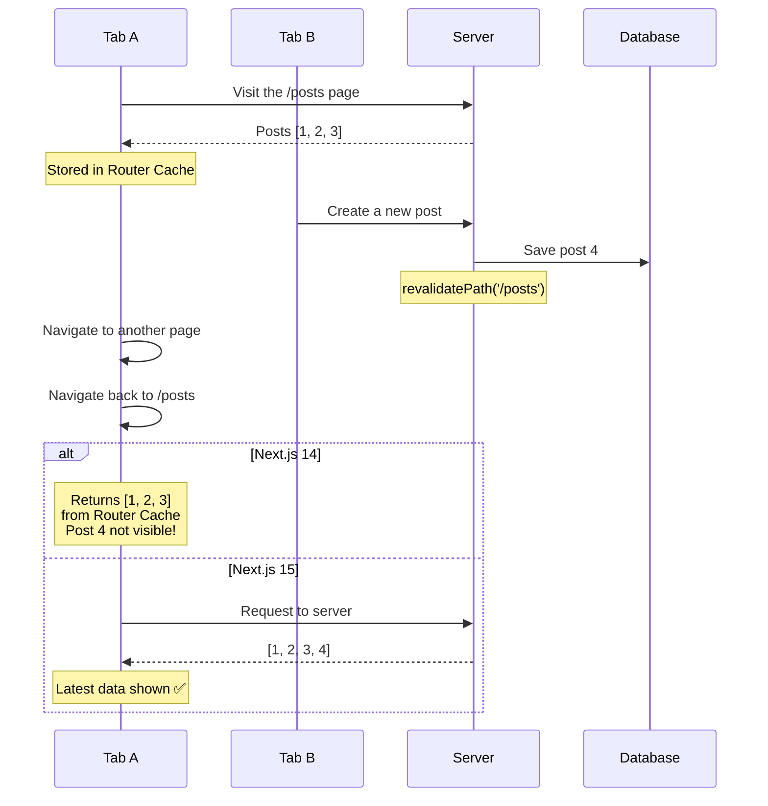

**Solution (Next.js 14):**

```js
// next.config.js
module.exports = {
  experimental: {
    staleTimes: {
      dynamic: 0, // dynamic pages: no cache
      static: 180, // static pages: 3 minutes
    },
  },
}
```

**Solution 1: the delete-then-back problem**

```tsx
// Server Actions automatically invalidate the Router Cache
'use server'

export async function deletePost(id: string) {
  await db.post.delete({where: {id}})
  revalidatePath('/posts')
  revalidatePath(`/posts/${id}`) // invalidate the detail page cache too
  redirect('/posts')
}

// Or call router.refresh() from the client
;('use client')

async function handleDelete(id: string) {
  await fetch(`/api/posts/${id}`, {method: 'DELETE'})
  router.refresh() // invalidate the Router Cache for the current page
  router.push('/posts')
}
```

**Solution 2: poll if you need real-time synchronization**

```tsx
'use client'

import {useEffect} from 'react'
import {useRouter} from 'next/navigation'

function useLiveRefresh(intervalMs = 30000) {
  const router = useRouter()

  useEffect(() => {
    const interval = setInterval(() => {
      router.refresh()
    }, intervalMs)

    return () => clearInterval(interval)
  }, [router, intervalMs])
}

function PostList({posts}) {
  useLiveRefresh(30000) // refresh every 30 seconds

  return posts.map((post) => <PostCard key={post.id} post={post} />)
}
```

### Mistake 5: Storing Per-user Data in the Global Cache

**Symptoms**: "I can see another user's personal information on my screen" (a security incident!)

**Why does this happen?**

The Data Cache is a **global cache**. The cache key is generated from only the URL and options — it doesn't consider who made the request. So if user A requests `/api/me` and the response gets cached, user B receives the same cached response (user A's data).

```tsx
// ❌ Dangerous: the same cache is returned to every user
export default async function Dashboard() {
  const user = await fetch('https://api.example.com/me', {
    cache: 'force-cache', // the first user's data goes to everyone!
  }).then((r) => r.json())

  return <div>Hello, {user.name}</div>
}
```

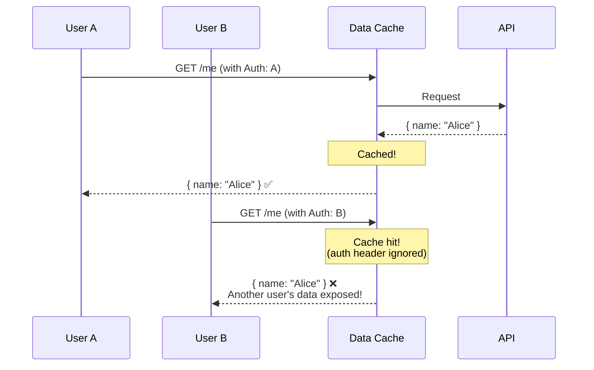

```tsx
// ✅ Don't cache per-user data
export default async function Dashboard() {
  const user = await fetch('https://api.example.com/me', {
    cache: 'no-store',
    headers: {
      Authorization: `Bearer ${cookies().get('token')?.value}`,
    },
  }).then((r) => r.json())

  return <div>Hello, {user.name}</div>
}

// ✅ Or trigger dynamic rendering with cookies()
export default async function Dashboard() {
  const token = cookies().get('token')?.value // dynamic rendering

  const user = await fetch('https://api.example.com/me', {
    headers: {Authorization: `Bearer ${token}`},
    // no cache option = no-store in Next.js 15
  }).then((r) => r.json())

  return <div>Hello, {user.name}</div>
}
```

### Mistake 6: Misconfigured revalidate Times

**Symptoms**: "The API server is getting way too many requests", "There's no point in caching", "Every page has a different revalidate and I don't know which is right"

**Why does this happen?**

The `revalidate` value is the balance point between "how often can this data change?" and "how stale can the data be while still being okay to show users?" Set it too short and the benefits of caching vanish while the API server takes the load. Set it too long and the data goes stale, hurting the user experience.

The most common mistakes are **applying the same value to all data**, or **setting 1–10 seconds thinking "shorter is safer."** With 1 second, you effectively have no cache at all, and when traffic spikes the API server can't keep up.

**Guide by data characteristics:**

| Data characteristic  | Examples                    | Recommended setting              |
| -------------------- | --------------------------- | -------------------------------- |
| Real-time required   | Stocks, chat, notifications | `cache: 'no-store'` or WebSocket |
| Minute-level updates | Comments, likes             | `revalidate: 30~60`              |
| Hour-level updates   | Blog posts, products        | `revalidate: 3600`               |
| Day-level updates    | Policy pages                | `revalidate: 86400`              |
| Rarely changes       | About pages                 | Static rendering (default)       |

**Common mistake examples:**

```tsx
// ❌ Revalidate every second? API server overload!
fetch('https://api.example.com/data', {
  next: {revalidate: 1},
})

// ❌ The same value on every page
export const revalidate = 60 // is this really right for all data?
```

```tsx
// ✅ Configure individually based on data characteristics
async function ProductPage({params}) {
  // Product info: 1-hour cache (changes occasionally)
  const product = await fetch(`/api/products/${params.id}`, {
    next: {revalidate: 3600},
  })

  // Stock: 1-minute cache (changes frequently)
  const stock = await fetch(`/api/stock/${params.id}`, {
    next: {revalidate: 60},
  })

  // Reviews: 5-minute cache
  const reviews = await fetch(`/api/reviews/${params.id}`, {
    next: {revalidate: 300},
  })
}
```

### Mistake 7: Data Cache Not Refreshed After Deploy

**Symptoms**: "I deployed, so why is the data unchanged?", "The API response is stale", "The new code deployed but the screen didn't change"

**Why does this happen?**

**The Full Route Cache and the Data Cache react differently to a new deploy.** The Full Route Cache (static HTML) is regenerated at build time, so it's always fresh. But the Data Cache (fetch responses) **stays on the server regardless of the build**.

The reason is simple. The Full Route Cache is a "build artifact," so a new build overwrites the previous artifact. The Data Cache, on the other hand, is "API responses stored at runtime," so it survives as long as the `.next/cache/fetch-cache/` directory remains.

On platforms like Vercel in particular, the Data Cache lives in global storage, so even after a new deploy, previously cached API responses are used as-is. This produces the situation where "the code changed but the data is old."

| Cache type       | State after deploy   | Reason                                |
| ---------------- | -------------------- | ------------------------------------- |
| Full Route Cache | Regenerated ✅       | Build artifact, overwritten           |
| Data Cache       | **Old data kept ⚠️** | Runtime cache, unrelated to the build |

**Solutions:**

```tsx
// Method 1: invalidate cache tags on deploy
// deploy.sh
curl -X POST https://your-site.com/api/revalidate \
  -H "Authorization: Bearer $REVALIDATE_SECRET" \
  -d '{"tag": "all"}'

// Method 2: include the build ID in the cache key
const buildId = process.env.BUILD_ID || 'development'

fetch(`https://api.example.com/data?v=${buildId}`, {
  next: { revalidate: 3600 }
})

// Method 3: revalidate on the first request after deploy
// middleware.ts
export function middleware(request: NextRequest) {
  const deployTime = process.env.DEPLOY_TIME
  const lastRevalidate = request.cookies.get('last-revalidate')?.value

  if (deployTime !== lastRevalidate) {
    // New deploy detected → cache invalidation logic
  }
}
```

### Mistake 8: Unintended Switches to Dynamic Rendering

**Symptoms**: "There are too many λ (dynamic) entries in the build log", "Pages that should be static are slow"

**Why does this happen?**

Next.js analyzes each page at build time to decide static vs dynamic. Using **information only knowable at request time**, like `cookies()`, `headers()`, or `searchParams`, makes it impossible to pre-generate the page at build time, so it switches to dynamic rendering.

The problem is that **a single call to any of these functions makes the entire page dynamic**. You called `cookies()` just to read a theme cookie, and suddenly every data caching strategy on the page can be neutralized.

```tsx
// ❌ Problem: calling cookies() merely to check the theme
// → the whole page becomes dynamically rendered (no Full Route Cache)
export default async function BlogPost({params}) {
  const theme = cookies().get('theme')?.value || 'light' // switches to dynamic!

  const post = await fetch(`/api/posts/${params.slug}`, {
    next: {revalidate: 3600},
  })

  return <Article post={post} theme={theme} />
}

// ✅ Solution: split the dynamic part into a Client Component
export default async function BlogPost({params}) {
  const post = await fetch(`/api/posts/${params.slug}`, {
    next: {revalidate: 3600},
  })

  return (
    <Article post={post}>
      <ThemeProvider /> {/* read the cookie in a Client Component */}
    </Article>
  )
}
```

**APIs that trigger dynamic rendering:**

- `cookies()`, `headers()` - per-request information
- `searchParams` - URL query parameters
- `connection()` - network connection information
- `unstable_noStore()` - explicit opt-out

### Mistake 9: searchParams Neutralizing Caching

**Symptoms**: "I only added a query parameter to the URL and the page got slower"

**Why does this happen?**

`searchParams` reads the URL's query parameters (`?category=books`). This value **can differ every time a user visits**, so it can't be known at build time. Therefore, the moment you receive `searchParams` as props or access it, Next.js treats the page as dynamic.

```tsx
// ❌ Problem: using searchParams → a static page becomes dynamic
export default async function ProductList({
  searchParams
}: {
  searchParams: { category?: string }
}) {
  // Merely accessing searchParams triggers dynamic rendering!
  const category = searchParams.category || 'all'

  const products = await fetch(`/api/products?category=${category}`)
  return <ProductGrid products={products} />
}

// ✅ Solution: pre-generate the main categories with generateStaticParams
export async function generateStaticParams() {
  return [
    { category: 'electronics' },
    { category: 'clothing' },
    { category: 'books' },
  ]
}

// Or filter on the client
export default async function ProductList() {
  const products = await fetch('/api/products', {
    next: { revalidate: 300 }
  })

  return <ProductGrid products={products} />  {/* filter on the client */}
}
```

### Mistake 10: Conflicting fetch Options

**Symptoms**: "I set `revalidate: 3600`, so why isn't it caching?", "I can't tell which option is in effect"

**Why does this happen?**

Next.js's `fetch` accepts two caching options: the standard `cache` option and the Next.js-specific `next` option. When both are set, only one applies according to **precedence rules**, and if you don't know the rules, behavior diverges from your intent.

```tsx
// ❌ Confusing: which setting applies?
fetch(url, {
  cache: 'force-cache',
  next: {revalidate: 0}, // revalidate: 0 is equivalent to no-store
})
// → revalidate: 0 wins! Not cached

// ❌ A meaningless combination
fetch(url, {
  cache: 'no-store',
  next: {revalidate: 3600}, // ignored
})

// ✅ Use just one, clearly
fetch(url, {cache: 'force-cache'}) // permanent cache
fetch(url, {cache: 'no-store'}) // no cache
fetch(url, {next: {revalidate: 3600}}) // 1-hour cache
```

**Precedence:**

1. `cache: 'no-store'` → never cached
2. `next: { revalidate: 0 }` → not cached
3. `next: { revalidate: N }` → cached for N seconds
4. `cache: 'force-cache'` → permanent cache

### Mistake 11: First-request Latency for Pages Not Returned by generateStaticParams

**Symptoms**: "Visiting a new blog post URL for the first time takes several seconds", "Popular posts are fast but old ones are slow"

**Why does this happen?**

Only the paths returned by `generateStaticParams` are pre-generated at build time. The remaining paths, with `dynamicParams: true` (the default), are **generated at first request**. That first user has to wait for the entire render (data fetching + rendering). After generation it's cached and fast, but the "first at bat" gets a slow experience.

```tsx
// app/blog/[slug]/page.tsx
export async function generateStaticParams() {
  // Generate only the 10 most popular posts at build time
  const popularPosts = await getPopularPosts(10)
  return popularPosts.map((post) => ({slug: post.slug}))
}

export const dynamicParams = true // the rest are generated on request
```

**Problem**: the first visitor to a page not in `generateStaticParams` (e.g., `/blog/obscure-post`) has to wait for the full render.

**Solutions:**

```tsx
// 1. Provide a loading UI
// app/blog/[slug]/loading.tsx
export default function Loading() {
  return <ArticleSkeleton />
}

// 2. Or pre-generate more pages
export async function generateStaticParams() {
  const allPosts = await getAllPosts() // generate everything
  return allPosts.map((post) => ({slug: post.slug}))
}
```

### Mistake 12: Cache Invalidation Timing in Server Actions

**Symptoms**: "After submitting the form I get redirected but the data hasn't changed", "It shows up after a refresh"

**Why does this happen?**

When `revalidatePath()` and `redirect()` are used together, cache invalidation can be processed **asynchronously**. If `redirect()` runs first, the client can receive a cache that hasn't been invalidated yet. Especially if the Router Cache remains, the old data is shown.

```tsx
// ❌ Problem: redirecting after revalidate can navigate before the cache updates
'use server'

export async function updateProfile(formData: FormData) {
  await db.user.update({ ... })

  revalidatePath('/profile')
  redirect('/profile')  // may redirect before the cache is refreshed!
}

// ✅ Solution: revalidate only, without redirect, or handle it on the client
'use server'

export async function updateProfile(formData: FormData) {
  await db.user.update({ ... })
  revalidatePath('/profile')
  // return without redirect → the client calls router.refresh() or router.push()
}
```

## A Caching Design Checklist

When designing caching for a project, walk through these questions in order:

1. **Is the data different per user?**
   - Yes → `no-store` + `cookies()`/`headers()`

2. **Is real-time synchronization required?**
   - Yes → `no-store` or WebSocket/SSE

3. **How often does it change?**
   - Seconds → `revalidate: 10~30`
   - Minutes → `revalidate: 60~300`
   - Hours → `revalidate: 3600`
   - Rarely → static rendering (default)

4. **Is on-demand invalidation needed?**
   - Yes → add `tags` + use `revalidateTag()`

| Scenario         | Recommended setting         | Reason                                                            |
| ---------------- | --------------------------- | ----------------------------------------------------------------- |
| Product listings | `revalidate: 300` + `tags`  | Stock/prices change occasionally, admin edits reflect immediately |
| User profiles    | `no-store` + `cookies()`    | Personal data, never cache                                        |
| Blog posts       | `revalidate: 3600` + `tags` | Rarely change, edits reflect immediately                          |
| Comment lists    | `revalidate: 60`            | Change frequently, 1-minute delay acceptable                      |
| News feeds       | `revalidate: 30`            | Need fast refresh                                                 |
| Static pages     | Default (Full Route Cache)  | No changes                                                        |
| Dashboards       | `no-store` + client polling | Real-time required                                                |

## Conclusion

Next.js caching is four layers tangled together in complex ways, but once you understand each layer's role and their interactions, you can use them effectively.

**Key takeaways:**

1. **Request Memoization**: a React feature, deduplicates requests during rendering, scoped to a single request
2. **Data Cache**: stored persistently on the server, survives deploys(!), invalidated via `revalidateTag`
3. **Full Route Cache**: caches static pages at build time, automatically opts out when Dynamic APIs are used
4. **Router Cache**: client memory, page caching disabled by default in Next.js 15

**The philosophy shift in Next.js 15:**

> "There should be no hidden caches"

Now that developers must explicitly enable caching, confusion like "why isn't my data changing?" should decrease. Instead, you have to actively design "which data to cache, and for how long."

**Looking ahead:**

Once the `use cache` directive and **PPR (Partial Prerendering)** stabilize, caching will become even more intuitive.

PPR is a new rendering strategy where, within a single page, the static shell (header, footer, etc.) is cached at build time while the dynamic content (the parts wrapped in `<Suspense>`) is streamed at request time. This moves us past the "static vs dynamic" dichotomy, enabling fine-grained caching strategies even within a single page.

Ultimately, future Next.js caching will come down to just two concepts:

- `"use cache"`: cache the result of this function/component
- `<Suspense>`: stream this part dynamically

Until then, it's important to understand and make good use of the current four layers.

## References

- [Next.js official docs: Caching](https://nextjs.org/docs/app/guides/caching)
- [Next.js blog: Our Journey with Caching](https://nextjs.org/blog/our-journey-with-caching)
- [React official docs: cache](https://react.dev/reference/react/cache)
- [GitHub Discussion #54075: Deep Dive: Caching and Revalidating](https://github.com/vercel/next.js/discussions/54075)
- [GitHub Issue #71881: Unclear caching behavior in Next.js 14 and 15](https://github.com/vercel/next.js/issues/71881)
- [Next.js official docs: generateStaticParams](https://nextjs.org/docs/app/api-reference/functions/generate-static-params)
- [Next.js official docs: unstable_cache](https://nextjs.org/docs/app/api-reference/functions/unstable_cache)
- [Web Dev Simplified: Finally Master Next.js's Most Complex Feature](https://blog.webdevsimplified.com/2024-01/next-js-app-router-cache/)
- [TrackJS: Common Errors in Next.js Caching](https://trackjs.com/blog/common-errors-in-nextjs-caching/)
- [Flightcontrol: Secret knowledge to self-host Next.js](https://www.flightcontrol.dev/blog/secret-knowledge-to-self-host-nextjs)
