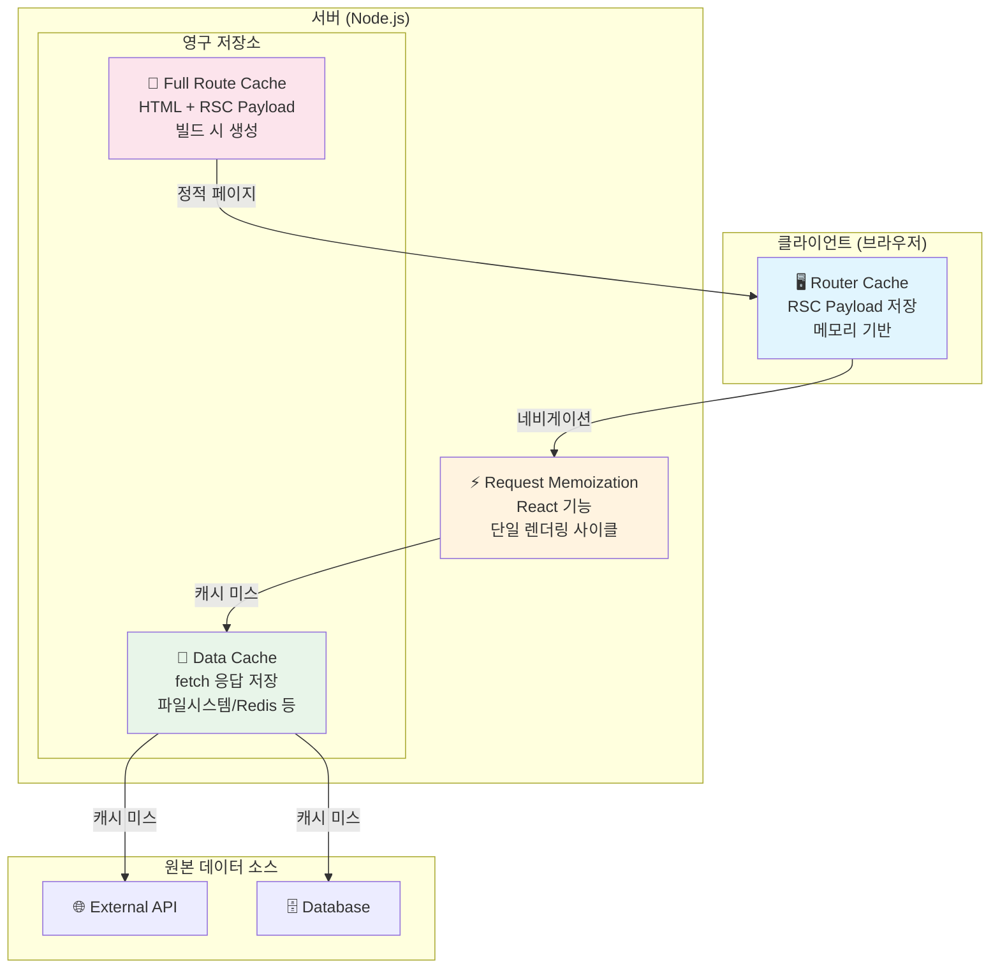

## Table of Contents

## 서론

Next.js App Router의 캐싱은 악명이 높다. 공식 문서를 읽어도 "왜 내 데이터가 안 바뀌지?", "분명히 revalidate 했는데?" 같은 의문이 끊이지 않는다. 심지어 Next.js 팀도 이를 인정했는지, [Our Journey with Caching](https://nextjs.org/blog/our-journey-with-caching)이라는 블로그 글에서 "숨겨진 캐시는 없어야 한다"라며 버전 15에서 캐싱 기본값을 대폭 변경했다.

이 글에서는 Next.js의 4가지 캐시 레이어를 단계별로 파헤친다. 단순히 "이렇게 쓰면 된다"가 아니라, 각 레이어의 내부 동작 원리, 캐시 키 생성 방식, Self-hosted 환경에서의 차이점, 그리고 실무에서 어떤 실수를 하기 쉬운지까지 깊이 있게 다룬다.

## 왜 이렇게 캐싱이 복잡해졌는가?

Next.js의 캐싱이 복잡해진 이유를 이해하려면, 웹 프레임워크의 진화 과정과 Next.js가 해결하려 했던 문제들을 살펴봐야 한다.

### 1. 모든 렌더링 전략을 하나로 통합하려는 야망


전통적으로 웹 프레임워크들은 하나의 렌더링 전략에 집중했다. Gatsby는 SSG, 전통적인 서버 프레임워크는 SSR, Create React App은 CSR에 특화되어 있었다. Next.js는 이 모든 것을 하나의 프레임워크에서 지원하려 했고, 심지어 ISR(Incremental Static Regeneration), Streaming, PPR(Partial Prerendering)까지 추가했다.

문제는 각 렌더링 전략이 서로 다른 캐싱 요구사항을 가진다는 것이다:

| 렌더링 전략 | 캐싱 요구사항           |
| ----------- | ----------------------- |
| SSG         | 빌드 시 생성, 영구 캐시 |
| SSR         | 캐시 없음 또는 짧은 TTL |
| ISR         | 시간 기반 재검증        |
| CSR         | 클라이언트 상태 관리    |
| Streaming   | 부분 캐싱, 청크 단위    |

이 모든 것을 지원하다 보니, 자연스럽게 여러 캐시 레이어가 필요해졌다.

### 2. React Server Components라는 새로운 패러다임

| 구분        | Pages Router                              | App Router (RSC)                |
| ----------- | ----------------------------------------- | ------------------------------- |
| 데이터 페칭 | `getStaticProps`, `getServerSideProps`    | 컴포넌트 어디서든 `async/await` |
| 경계        | 명확: 페칭 함수 ↔ 렌더링 컴포넌트         | 모호: 페칭 = 렌더링             |
| 멘탈 모델   | "이 함수에서 데이터, 컴포넌트는 렌더링만" | "어디서든 자유롭게"             |

Pages Router에서는 `getStaticProps`와 `getServerSideProps`라는 명확한 데이터 페칭 지점이 있었다. 개발자는 "이 함수에서 데이터를 가져오고, 컴포넌트에서는 렌더링만 한다"는 멘탈 모델을 가질 수 있었다.

App Router와 React Server Components는 이 패러다임을 완전히 바꿨다. 이제 컴포넌트 어디서든 `async/await`로 데이터를 가져올 수 있다. 자유도는 높아졌지만, "언제 캐시되고 언제 안 되는가?"라는 새로운 복잡성이 생겼다.

```tsx
// Pages Router: 데이터 페칭 지점이 명확
export async function getStaticProps() {
  const data = await fetchData() // 여기서만 데이터 페칭
  return {props: {data}, revalidate: 60}
}

export default function Page({data}) {
  // 여기는 순수 렌더링
  return <div>{data}</div>
}

// App Router: 어디서든 데이터 페칭 가능
export default async function Page() {
  const data = await fetchData() // 컴포넌트 내에서 직접
  const more = await fetchMore() // 여러 번 가능

  return (
    <div>
      {data}
      <ChildComponent /> {/* 자식도 자체적으로 fetch 가능 */}
    </div>
  )
}
```

### 3. fetch API 확장의 한계

Next.js 팀은 Web 표준인 `fetch` API를 확장하여 캐싱을 구현하기로 결정했다. 이론상으로는 좋은 선택이었다:

- 새로운 API를 배울 필요 없음
- Web 표준과의 호환성
- 점진적 마이그레이션 가능

하지만 현실은 달랐다. 실제 프로젝트에서는 `fetch`만 사용하지 않는다:

- **ORM**: Prisma, Drizzle 등
- **GraphQL 클라이언트**: Apollo, urql 등
- **직접 DB 연결**: Redis, MongoDB 등
- **SDK 클라이언트**: Stripe, AWS SDK 등

이들은 `fetch`를 사용하지 않으므로 Next.js의 캐싱이 자동으로 적용되지 않는다. 이를 위해 별도의 API들을 제공했지만, 각각 다른 용도와 제약을 가져 혼란을 가중시켰다:

| API                  | 용도                   | 캐시 범위              | 제약사항                                       |
| -------------------- | ---------------------- | ---------------------- | ---------------------------------------------- |
| `React.cache()`      | 함수 결과 메모이제이션 | 단일 요청 내           | 요청 끝나면 사라짐, 영구 캐시 불가             |
| `unstable_cache()`   | Data Cache에 수동 저장 | 영구적 (재검증 전까지) | 이름 그대로 불안정, 함수 본체가 캐시 키에 포함 |
| `use cache` (실험적) | 함수/컴포넌트 캐싱     | 영구적                 | 아직 canary, 프로덕션 사용 불가                |

결국 "fetch가 아닌 데이터 소스를 어떻게 캐시할 것인가"라는 단순한 질문에 3개의 서로 다른 답이 존재하게 된 것이다.

### 4. "Zero Config" 철학의 부작용

Next.js는 "Zero Config"를 지향한다. 설정 없이도 최적화된 상태로 동작해야 한다는 철학이다. 이를 위해 **기본값으로 캐싱을 활성화**했다.

"좋은 기본값"이라는 의도와 달리, 개발자들은 오히려 혼란스러워했다:

- "왜 내 데이터가 안 바뀌지?"
- "캐시를 어떻게 끄나요?"
- "너무 많은 것이 숨겨져 있다"

캐시가 언제 동작하고 언제 안 하는지 예측하기 어려웠고, 버그처럼 느껴지는 동작들이 발생했다. 결국 Next.js 15에서 "기본값 = 캐싱 비활성화"로 방향을 틀었다.

### 5. Vercel 플랫폼과의 깊은 연관성

솔직히 말하면, Next.js의 캐싱 시스템은 Vercel 플랫폼에서 가장 잘 동작하도록 설계되었다. Vercel이 Next.js를 오픈소스로 유지하는 건 자선사업이 아니다. Next.js의 복잡한 캐싱이 Vercel에서 "마법처럼" 동작하고, Self-hosted에서는 추가 설정이 필요하다면, 개발자들은 자연스럽게 Vercel을 선택하게 된다.

**Vercel에서는:**

- Data Cache가 글로벌 Edge Network에 분산되어 "cache shielding" 자동 적용
- ISR이 내부적으로 최적화되어 별도 설정 없이 동작
- 캐시 무효화가 전 세계 엣지에 빠르게 전파

**Self-hosted에서는:**

- **단일 인스턴스**: 기본 파일시스템 캐시로 충분히 동작
- **멀티 인스턴스/Serverless**: Redis 같은 외부 캐시 저장소 + 커스텀 핸들러 필요
- Next.js 14 이하에서 `stale-while-revalidate` 헤더에 시간 값이 누락되어 CDN 연동 문제 발생 (15에서 수정됨)

단일 서버로 운영한다면 Self-hosted도 충분히 잘 동작한다. 하지만 스케일 아웃이 필요한 환경에서는 Vercel이 자동으로 해주는 것들을 직접 구현해야 한다. 이런 격차가 "Next.js는 Vercel에서만 제대로 동작한다"는 인식을 만들었고, 커뮤니티의 불만으로 이어졌다. Next.js 15에서는 Self-hosting 문서를 대폭 개선하고 캐시 핸들러 설정을 더 쉽게 만들었지만, 멀티 인스턴스 환경의 복잡성은 여전하다.

### 6. 결국 이 복잡성은 필연적이었는가?

솔직히, 이 복잡성의 상당 부분은 **필연적**이었다고 본다. 다양한 렌더링 전략을 지원하면서 최적의 성능을 내려면, 단순함을 어느 정도 포기할 수밖에 없다.

하지만 **불필요한 복잡성**도 있었다:

- 암묵적 캐싱 동작 (Next.js 15에서 수정)
- 일관성 없는 API (`fetch` 확장 vs `unstable_cache` vs `React.cache`)
- 부족한 디버깅 도구
- Vercel과 Self-hosted 간의 동작 차이

Next.js 팀도 이를 인지하고 있고, `use cache` 디렉티브 같은 더 명시적인 API로 개선하려 하고 있다. "숨겨진 캐시는 없어야 한다"는 새로운 철학이 앞으로 얼마나 잘 지켜질지 지켜볼 필요가 있다.

## 1단계: 캐싱의 전체 그림

### 4가지 캐시 레이어 아키텍처



### 캐시 레이어 상세 비교

| 레이어              | 위치       | 저장소     | 지속 시간 | 대상         | 공유 범위      |
| ------------------- | ---------- | ---------- | --------- | ------------ | -------------- |
| Request Memoization | 서버       | 메모리     | 단일 요청 | fetch 반환값 | 렌더링 트리 내 |
| Data Cache          | 서버       | 파일시스템 | 영구적    | fetch 응답   | 모든 요청/배포 |
| Full Route Cache    | 서버       | 파일시스템 | 영구적    | HTML + RSC   | 모든 사용자    |
| Router Cache        | 클라이언트 | 메모리     | 세션      | RSC Payload  | 현재 사용자    |

### 요청 흐름 상세

사용자가 페이지를 요청하면, 캐시는 다음과 같은 순서로 확인된다.


### Next.js 15에서의 패러다임 전환

Next.js 팀은 버전 15에서 캐싱 철학을 180도 바꿨다. "기본적으로 모든 것을 캐시"에서 "기본적으로 아무것도 캐시하지 않음"으로 전환했다.

| 항목                | Next.js 14 이하         | Next.js 15 이상      |
| ------------------- | ----------------------- | -------------------- |
| fetch 기본값        | `force-cache`           | `no-store`           |
| Route Handler       | `force-static`          | `force-dynamic`      |
| Router Cache (Page) | 동적 30초, 정적 5분     | 캐시 안 함           |
| 철학                | Opt-out (비활성화 선택) | Opt-in (활성화 선택) |

## 2단계: 각 캐시 레이어 Deep Dive

### 잠깐, Request Memoization과 Data Cache는 뭐가 다른가?

가장 혼란스러운 부분이다. 둘 다 `fetch`와 관련되어 있고, 둘 다 "캐싱"을 한다. 하지만 완전히 다른 목적과 범위를 가진다.

**Request Memoization (React 담당)**

- **목적**: 렌더링 중 동일한 fetch 호출이 여러 번 발생하면 중복 실행 방지
- **범위**: 단일 요청의 렌더링 사이클 (하나의 페이지 렌더링)
- **저장소**: 메모리 (임시)
- **수명**: 렌더링 끝나면 삭제
- **공유**: 다른 사용자/요청과 공유 안 됨

**Data Cache (Next.js 담당)**

- **목적**: API 응답을 저장해서 다음 요청에서 재사용
- **범위**: 모든 요청, 모든 사용자
- **저장소**: 파일시스템, Redis 등 (영구적)
- **수명**: `revalidate` 시간 또는 수동 무효화 전까지 유지
- **공유**: 모든 사용자가 동일한 캐시 공유

**구체적인 예시로 이해해보자:**

```tsx
// 페이지 컴포넌트
export default async function UserPage() {
  // 1번 호출
  const user1 = await fetch('https://api.example.com/user', {
    next: {revalidate: 3600},
  })

  return (
    <div>
      <Header /> {/* 내부에서 같은 API 호출 */}
      <Sidebar /> {/* 내부에서 같은 API 호출 */}
    </div>
  )
}

async function Header() {
  // 2번 호출 (같은 URL)
  const user2 = await fetch('https://api.example.com/user', {
    next: {revalidate: 3600},
  })
  return <div>{user2.name}</div>
}

async function Sidebar() {
  // 3번 호출 (같은 URL)
  const user3 = await fetch('https://api.example.com/user', {
    next: {revalidate: 3600},
  })
  return <div>{user3.email}</div>
}
```

**이 코드가 실행되면 무슨 일이 일어날까?**


**정리하면:**

| 특성   | Request Memoization            | Data Cache                      |
| ------ | ------------------------------ | ------------------------------- |
| 담당   | React                          | Next.js                         |
| 목적   | 같은 렌더링에서 중복 호출 방지 | 요청 간 데이터 재사용           |
| 범위   | 단일 요청의 컴포넌트 트리      | 모든 요청, 모든 사용자          |
| 수명   | 렌더링 끝나면 삭제             | `revalidate` 시간까지 유지      |
| 저장소 | 메모리 (임시)                  | 파일시스템/외부 저장소          |
| 설정   | 자동 (옵트아웃만 가능)         | `cache`, `next.revalidate` 옵션 |
| 공유   | 다른 요청과 공유 안 됨         | 모든 요청이 공유                |

핵심 차이를 한 문장으로 요약하면 다음과 같다.

- **Request Memoization**: "이번 렌더링에서 아까 했던 같은 fetch를 또 하네? 아까 결과 줄게"
- **Data Cache**: "이 API 응답 저장해뒀다가, 다음에 누가 요청해도 재사용할게"

로 정리해볼 수 있다.

### 2.1 Request Memoization

**핵심: 이건 Next.js가 아니라 React의 기능이다.**

React는 렌더링 중 동일한 fetch 요청이 여러 번 발생하면, 첫 번째 요청의 결과를 재사용한다. 이는 컴포넌트 구조를 데이터 의존성에 맞게 자유롭게 설계할 수 있게 해준다.


#### 캐시 키 생성 원리

Request Memoization의 캐시 키는 다음 요소들로 구성된다:

```typescript
// 캐시 키 = URL + HTTP 메서드 + 요청 옵션들의 조합
const cacheKey = JSON.stringify({
  url: 'https://api.example.com/user',
  method: 'GET',
  headers: { ... },
  // ... 기타 옵션
})
```

**중요**: `traceparent`, `tracestate` 같은 [W3C trace context](https://www.w3.org/TR/trace-context/) 헤더는 캐시 키에서 제외된다. 이 헤더들은 요청마다 달라지므로, 포함하면 캐시가 무용지물이 되기 때문이다. Next.js 소스 코드에서 명시적으로 이 헤더들을 제거한다. ([관련 GitHub 코드](https://github.com/vercel/next.js/blob/canary/packages/next/src/server/lib/incremental-cache/index.ts#L387-L406))

#### 제한사항

Request Memoization은 **React의 컴포넌트 트리 내**에서만 동작한다. 다시 말해, 하나의 렌더링 사이클에서 여러 컴포넌트가 같은 fetch를 호출할 때 중복을 제거하는 것이다.

**✅ 메모이제이션이 작동하는 곳:**

Server Components, Layouts, Pages, 그리고 `generateMetadata`, `generateStaticParams` 같은 빌드/렌더링 시 실행되는 함수들이다. 이들은 모두 React의 렌더링 컨텍스트 안에서 실행되므로 메모이제이션이 적용된다.

**❌ 메모이제이션이 안 되는 곳:**

- **Route Handlers**: API 라우트(`/api/...`)는 컴포넌트 트리 밖에서 독립적으로 실행된다. 여기서 fetch를 여러 번 호출하면 각각 별도의 요청으로 나간다.
- **POST, DELETE 등**: GET과 HEAD만 메모이제이션된다. 다른 HTTP 메서드는 부작용(side effect)을 일으킬 수 있으므로 의도적으로 제외된다.
- **AbortSignal 전달 시**: `fetch(url, { signal })`처럼 취소 시그널을 전달하면 메모이제이션이 비활성화된다. 취소 가능한 요청은 각각 독립적으로 관리해야 하기 때문이다.

#### React.cache()로 비-fetch 함수 메모이제이션

fetch를 사용하지 않는 경우(ORM, 직접 DB 쿼리 등)에는 React의 `cache()` 함수를 사용한다.

```tsx
// lib/data.ts
import {cache} from 'react'
import {db} from '@/lib/db'

// ✅ 올바른 사용: 모듈 수준에서 정의
export const getUser = cache(async (id: string) => {
  return await db.user.findUnique({where: {id}})
})

export const getPost = cache(async (slug: string) => {
  return await db.post.findUnique({where: {slug}})
})
```

**React.cache()의 핵심 특성:**

- **Server Components 전용**: Client Components에서는 사용할 수 없다. 클라이언트에서는 `useMemo`를 사용해야 한다.
- **동작 원리**: 첫 호출 시 함수 실행 + 결과 캐싱 → 같은 인자로 재호출 시 캐시에서 반환 → 다른 인자면 새로 실행
- **에러도 캐싱됨**: 함수가 에러를 던지면 그 에러도 캐시되어, 같은 인자로 재호출 시 동일한 에러가 다시 던져진다.
- **캐시 키 비교**: `Object.is()`를 사용한 얕은 비교. 원시값은 값 비교, 객체는 참조 비교.
- **수동 무효화 불가**: 캐시를 수동으로 무효화할 방법이 없다. 서버 요청이 끝나면 자동으로 무효화된다.

#### "요청 범위 캐시"란?

"요청이 끝나면 캐시가 사라진다"는 말이 혼란스러울 수 있다. 그럼 캐시가 아닌 것 아닌가?

```
사용자 A가 /profile 페이지 접속
    ↓
서버에서 렌더링 시작 (하나의 "요청")
    ├─ Header 컴포넌트  → getUser('123') 호출  ← 실제 실행
    ├─ Sidebar 컴포넌트 → getUser('123') 호출  ← 캐시 히트!
    └─ Profile 컴포넌트 → getUser('123') 호출  ← 캐시 히트!
    ↓
렌더링 완료, HTML 응답
    ↓
캐시 삭제
```

같은 렌더링 사이클 안에서 `getUser('123')`는 **1번만** 실행되고, 나머지 2번은 캐시된 결과를 재사용한다. 이것이 "캐시"다.

하지만 다음 요청은 **새로 시작**한다:

```
사용자 A 요청 → getUser('123') 실행 → 캐시 → 응답 → 캐시 삭제
사용자 B 요청 → getUser('123') 다시 실행 → 새 캐시 → 응답 → 캐시 삭제
```

| 캐시 종류       | 비유                                            | 범위      |
| --------------- | ----------------------------------------------- | --------- |
| `React.cache()` | 한 번의 요리 중 같은 재료를 여러 번 꺼내지 않음 | 단일 요청 |
| `Data Cache`    | 냉장고에 재료 보관해두고 다음 요리에도 사용     | 모든 요청 |

이렇게 설계한 이유:

- **메모리 관리**: 요청마다 캐시가 누적되면 서버 메모리 폭발
- **데이터 신선도**: 다음 요청은 항상 최신 데이터를 가져올 기회 보장
- **용도 분리**: 렌더링 최적화는 `cache()`, 영구 캐싱은 `unstable_cache`나 `fetch`의 Data Cache 사용

#### Preload 패턴

`cache()`의 강력한 활용법 중 하나는 preload 패턴이다. 데이터를 미리 요청해두고, 실제로 필요한 컴포넌트에서는 캐시된 결과를 사용한다.

```tsx
// lib/data.ts
import {cache} from 'react'

export const getUser = cache(async (id: string) => {
  return await db.user.findUnique({where: {id}})
})

// 명시적인 preload 함수 (선택적)
export const preloadUser = (id: string) => {
  void getUser(id)
}
```

```tsx
// app/user/[id]/page.tsx
import {getUser, preloadUser} from '@/lib/data'

export default async function UserPage({params}: {params: {id: string}}) {
  // 1. 렌더링 시작과 동시에 데이터 요청 시작 (await 없음!)
  preloadUser(params.id)

  // 2. 다른 동기 작업 수행 가능
  const headerConfig = getHeaderConfig()

  return (
    <>
      <Header config={headerConfig} />
      <UserProfile id={params.id} /> {/* 3. 여기서 캐시된 Promise 사용 */}
    </>
  )
}

async function UserProfile({id}: {id: string}) {
  // preload로 이미 시작된 요청의 Promise를 재사용
  const user = await getUser(id)
  return <div>{user.name}</div>
}
```

이 패턴은 워터폴을 방지하고 병렬 요청을 최대화한다.

**주의사항:**

```tsx
// ❌ 잘못된 사용: 컴포넌트 내부에서 cache() 호출
function Profile({ userId }) {
  // 매 렌더링마다 새로운 캐시 함수 생성!
  const getUser = cache(async (id) => { ... })
  const user = await getUser(userId)
}

// ❌ 잘못된 사용: 컴포넌트 외부에서 캐시 함수 호출
const getUser = cache(async (id) => { ... })
getUser('demo-id') // 캐시 컨텍스트 없음

async function Profile() {
  const user = await getUser('demo-id') // 캐시 미스
}

// ❌ 잘못된 사용: 매번 새 객체 전달
const processData = cache((data) => { ... })

function Component(props) {
  // props는 매번 새 객체이므로 캐시 미스
  const result = processData(props)
}

// ✅ 올바른 사용: 원시값 전달
const processData = cache((x, y, z) => { ... })

function Component({ x, y, z }) {
  const result = processData(x, y, z) // 값이 같으면 캐시 히트
}
```

**cache() vs useMemo vs memo 비교:**

| 특성      | `cache()`             | `useMemo()`       | `memo()`             |
| --------- | --------------------- | ----------------- | -------------------- |
| 사용처    | Server Components     | Client Components | Client Components    |
| 용도      | 함수 결과 캐싱        | 계산 결과 캐싱    | 컴포넌트 리렌더 방지 |
| 캐시 공유 | 여러 컴포넌트 간 공유 | 해당 컴포넌트 내  | 해당 컴포넌트만      |
| 캐시 크기 | 다중 인자 조합 저장   | 최근 1개만 저장   | N/A                  |
| 캐시 수명 | 단일 요청             | 리렌더 간 유지    | props 동일 시 유지   |

### 2.2 Data Cache

Data Cache는 fetch 응답을 서버에 **영구적으로** 저장한다. Request Memoization이 단일 요청 내에서만 유효한 것과 달리, Data Cache는 **배포 간에도 유지**된다.

**저장소:**

- Vercel: 글로벌 분산 캐시 (Vercel의 Edge Network)
- Self-hosted: 기본적으로 메모리(50MB) + 파일시스템에 저장 ([Self-hosting 가이드](https://nextjs.org/docs/app/guides/self-hosting))
  - 구체적 위치: `.next/cache/fetch-cache/` (Next.js 소스 코드 기반)
- Custom Handler: Redis, Memcached 등 (직접 구현)

```bash
# Self-hosted에서 Data Cache 확인
ls .next/cache/fetch-cache/
# 출력 예시: 해시된 캐시 키 파일들
# a1b2c3d4e5f6...
# f6e5d4c3b2a1...
```

#### 파일시스템 캐시의 동작 원리

Next.js 서버는 캐시 가능한 fetch 응답을 받을 때마다 파일시스템에 기록한다:

```
1. fetch() 호출 (cache: 'force-cache' 또는 revalidate 설정)
     ↓
2. .next/cache/fetch-cache/ 디렉토리 확인
     ↓
3-a. 캐시 히트 → 파일에서 읽어서 반환
3-b. 캐시 미스 → API 호출 → 응답을 파일로 저장 → 반환
```

각 캐시 파일은 JSON 형태로, 응답 본문과 메타데이터를 포함한다:

```json
{
  "kind": "FETCH",
  "data": {
    "body": "...",
    "headers": {"content-type": "application/json"},
    "status": 200
  },
  "revalidate": 3600,
  "tags": ["posts"]
}
```

#### 파일시스템 캐시의 한계

파일시스템 캐시는 **단일 서버 환경**에서는 잘 동작하지만, 현대적인 배포 환경에서는 문제가 생길 수 있다:

| 환경                        | 캐시 저장소                       | 문제점                         |
| --------------------------- | --------------------------------- | ------------------------------ |
| 단일 서버                   | 로컬 파일시스템                   | 괜찮음                         |
| 멀티 인스턴스 (k8s, ECS 등) | 각 Pod/컨테이너의 로컬 파일시스템 | **인스턴스 간 캐시 불일치**    |
| Serverless (AWS Lambda 등)  | 컨테이너 파일시스템               | **콜드 스타트 시 캐시 사라짐** |
| Vercel                      | Vercel Edge Network               | 글로벌 분산, 문제 없음         |

멀티 인스턴스 환경에서는 로드밸런서가 요청을 다른 서버로 보낼 때마다 캐시 미스가 발생하거나, 서로 다른 버전의 데이터를 반환할 수 있다. Serverless 환경에서는 함수가 콜드 스타트되면 이전 캐시가 없어진다. 이런 환경에서는 Redis 같은 외부 캐시 저장소를 사용하는 것이 좋다.

#### 캐시 키는 어떻게 생성되나?

Data Cache의 캐시 키는 다음 요소들로 구성된다: **URL, HTTP 메서드, Headers(일부 제외), Request Body, `next.tags`**. 같은 URL이라도 헤더가 다르면 다른 캐시 항목으로 저장된다.

#### fetch 옵션 상세

```tsx
// 1. 캐싱 활성화 (Next.js 14 기본값)
const data = await fetch('https://api.example.com/data', {
  cache: 'force-cache',
})

// 2. 캐싱 비활성화 (Next.js 15 기본값)
const data = await fetch('https://api.example.com/data', {
  cache: 'no-store',
})

// 3. 시간 기반 재검증
const data = await fetch('https://api.example.com/data', {
  next: {revalidate: 3600}, // 1시간
})

// 4. 태그 기반 캐싱 (온디맨드 재검증용)
const data = await fetch('https://api.example.com/posts', {
  next: {tags: ['posts', 'homepage']},
})

// 5. 복합 설정
const data = await fetch('https://api.example.com/posts', {
  next: {
    revalidate: 3600,
    tags: ['posts'],
  },
})
```

#### Stale-While-Revalidate 패턴 심층 분석

Next.js의 시간 기반 재검증은 HTTP의 `stale-while-revalidate` 패턴을 따른다.


**중요한 점**: 재검증 시간이 지나도 **즉시 새 데이터를 가져오지 않는다**. 사용자에게는 먼저 stale 데이터를 반환하고, 백그라운드에서 새 데이터를 가져온다. 이 "다음 사용자"가 새 데이터를 받게 된다.

#### unstable_cache: fetch 외 데이터 소스 캐싱

ORM이나 DB 클라이언트를 사용할 때는 `unstable_cache`를 사용한다.

```tsx
import {unstable_cache} from 'next/cache'
import {db} from '@/lib/db'

const getCachedUser = unstable_cache(
  async (userId: string) => {
    return await db.user.findUnique({where: {id: userId}})
  },
  ['user'], // 캐시 키 배열
  {
    tags: ['user'],
    revalidate: 3600,
  },
)

export default async function Profile({userId}) {
  const user = await getCachedUser(userId)
  return <div>{user.name}</div>
}
```

**unstable_cache의 캐시 키 생성 원리:**

캐시 키는 `keyParts 배열` + `함수 인자` + `함수 본체(직렬화됨!)`를 조합하여 생성된다.

**주의사항:**

`unstable_cache`는 이름에 "unstable"이 붙어있을 정도로 몇 가지 까다로운 제약이 있다:

- **함수 본체가 캐시 키에 포함된다**: 함수 내용이 조금이라도 바뀌면 캐시가 무효화된다. 이를 위해 함수 전체를 직렬화하므로 성능 오버헤드가 발생한다.
- **직렬화 가능한 값만 반환 가능**: Prisma 클라이언트 같은 클래스 인스턴스를 반환하면 실패한다. 순수 객체나 원시값만 반환해야 한다.
- **에러도 캐싱된다**: 함수가 에러를 던지면 그 에러가 캐시되어, 이후 호출에서도 같은 에러가 발생한다.
- **Request Context가 필요하다**: 컴포넌트나 페이지 외부(예: 모듈 최상위)에서 호출하면 동작하지 않는다.

#### use cache 디렉티브 (실험적 기능)

`unstable_cache`의 한계를 극복하기 위해, Next.js 팀은 `use cache` 디렉티브를 개발 중이다. Next.js 16에서도 아직 experimental 상태이며, 사용하려면 `next.config.js`에서 플래그를 활성화해야 한다.

```js
// next.config.js
const nextConfig = {
  experimental: {
    useCache: true,
  },
}
```

```tsx
// 함수 레벨 캐싱
async function getUser(id: string) {
  'use cache'
  return await db.user.findUnique({where: {id}})
}

// 페이지 레벨 캐싱
;('use cache')

export default async function Page() {
  const data = await fetch('...')
  return <div>{data}</div>
}
```

`use cache`는 `unstable_cache`보다 훨씬 직관적인 캐시 키 생성 방식을 사용한다:

- **Build ID**: 새로 빌드할 때마다 자동으로 변경되어 모든 캐시가 무효화된다. 코드가 바뀌면 캐시도 바뀌어야 하므로 합리적이다.
- **Function ID**: 함수 본체 전체가 아니라, 코드베이스에서의 위치와 시그니처의 해시만 사용한다. `unstable_cache`보다 효율적이다.
- **직렬화 가능한 인자**: 함수에 전달된 인자값이 캐시 키의 일부가 된다. 같은 인자로 호출하면 캐시 히트, 다른 인자면 캐시 미스.

안정화되면 `unstable_cache`를 완전히 대체할 예정이다.

### 2.3 Full Route Cache

#### Full Route Cache란?

`next build`를 실행하면, Next.js는 각 페이지를 분석해서 **정적으로 생성 가능한 페이지**를 미리 렌더링한다. 이렇게 생성된 HTML과 RSC Payload를 **Full Route Cache**라고 한다.

**왜 필요한가?**

```
동적 렌더링 (Full Route Cache 없음):
  사용자 요청 → 서버에서 렌더링 → HTML 생성 → 응답

정적 렌더링 (Full Route Cache 있음):
  빌드 시 미리 렌더링 → 저장
  사용자 요청 → 저장된 HTML 즉시 반환
```

정적 페이지는 서버에서 매번 렌더링할 필요가 없다. 미리 만들어둔 HTML을 바로 보내면 되므로 **응답 속도가 매우 빠르고**, 서버 부하도 줄어든다. CDN에 캐시하면 전 세계 어디서든 빠르게 접근할 수 있다.

**저장 위치:**

```bash
.next/server/app/
├── page.html           # / 경로의 HTML
├── page_client-reference-manifest.js
├── about/
│   └── page.html       # /about 경로의 HTML
└── blog/
    └── [slug]/
        └── page.html   # /blog/[slug] 경로의 HTML (generateStaticParams로 생성된 것들)
```

#### 정적 vs 동적: 어떻게 결정되나?

Next.js는 빌드 시점에 각 페이지의 코드를 분석해서, 정적으로 생성할 수 있는지 판단한다.

**동적 렌더링으로 전환되는 조건:**

1. **Dynamic API 사용**: `cookies()`, `headers()`, `searchParams`, `connection()` 호출
2. **캐시 비활성화 fetch**: `cache: 'no-store'` 또는 `revalidate: 0` 설정
3. **Route Config**: `export const dynamic = 'force-dynamic'` 설정

```tsx
// ✅ 정적 렌더링 (Full Route Cache 저장)
export default async function AboutPage() {
  const data = await fetch('https://api.example.com/about', {
    next: {revalidate: 3600},
  })
  return <div>{data}</div>
}

// ❌ 동적 렌더링 (Full Route Cache 안 됨)
export default async function DashboardPage() {
  const session = cookies().get('session') // Dynamic API 사용!
  return <div>Welcome, {session?.value}</div>
}
```

**빌드 로그에서 확인하기:**

```bash
Route (app)                    Size     First Load JS
┌ ○ /                         5.2 kB        89 kB
├ ○ /about                    1.2 kB        85 kB
├ λ /dashboard                3.1 kB        87 kB    # λ = 동적
└ ● /blog/[slug]              2.8 kB        86 kB    # ● = ISR

○ = 정적 (빌드 시 생성)
● = ISR (빌드 시 생성 + 재검증)
λ = 동적 (요청 시 렌더링)
```

#### generateStaticParams: 동적 라우트를 정적으로

`/blog/[slug]` 같은 동적 라우트는 기본적으로 어떤 slug 값이 올지 모르므로 정적 생성이 불가능하다. `generateStaticParams`를 사용하면 **빌드 타임에 어떤 경로들을 미리 생성할지** 지정할 수 있다.

```tsx
// app/blog/[slug]/page.tsx

// 빌드 시점에 실행
export async function generateStaticParams() {
  const posts = await fetch('https://api.example.com/posts').then((res) =>
    res.json(),
  )

  // 상위 10개만 빌드 타임에 생성
  return posts.slice(0, 10).map((post) => ({
    slug: post.slug,
  }))
}

// 나머지 경로의 동작 결정
export const dynamicParams = true // (기본값) 첫 요청 시 생성
// export const dynamicParams = false // 404 반환
```


**ISR과의 관계:**

```tsx
// ISR 활성화: 빈 배열 반환
export async function generateStaticParams() {
  return [] // 빌드 타임에 아무것도 생성 안 함
}

// 모든 페이지가 첫 요청 시 생성되고,
// revalidate 설정에 따라 ISR로 재검증됨
```

### 2.4 Router Cache

#### Router Cache란?

Router Cache는 4가지 캐시 중 유일하게 **클라이언트(브라우저)** 에서 동작한다. 사용자가 페이지를 탐색할 때 서버에서 받은 **RSC Payload**(React Server Component의 렌더링 결과)를 브라우저 메모리에 저장해두고, 같은 페이지를 다시 방문할 때 재사용한다.

**RSC Payload란?**

서버 컴포넌트가 렌더링된 결과물이다. HTML이 아니라, React가 클라이언트에서 DOM을 구성하기 위해 사용하는 특수한 형식의 데이터다. 이 Payload를 캐시해두면 페이지 이동 시 서버 요청 없이 즉시 화면을 보여줄 수 있다.

**왜 필요한가?**

```
일반적인 SPA 네비게이션:
  링크 클릭 → 서버 요청 → 응답 대기 → 렌더링

Router Cache가 있을 때:
  링크 클릭 → 캐시에서 즉시 렌더링 (서버 요청 없음)
```

특히 `<Link>` 컴포넌트는 뷰포트에 보이면 자동으로 해당 페이지를 **prefetch**한다. 사용자가 클릭하기 전에 이미 데이터를 가져와 캐시해두므로, 클릭하면 즉시 페이지가 전환된다.

#### 다른 캐시와의 차이

| 특성      | Router Cache               | Data Cache / Full Route Cache |
| --------- | -------------------------- | ----------------------------- |
| 위치      | 브라우저 메모리            | 서버 (파일시스템/외부 저장소) |
| 공유 범위 | 현재 탭/세션만             | 모든 사용자                   |
| 지속 시간 | 세션 동안 또는 설정된 시간 | 재검증 전까지 영구            |
| 저장 대상 | RSC Payload                | fetch 응답 / HTML             |

**중요한 차이**: 서버에서 `revalidatePath()`를 호출해도, **다른 사용자의 브라우저에 있는 Router Cache는 무효화되지 않는다**. 각 브라우저가 독립적인 캐시를 가지고 있기 때문이다.

#### Next.js 15에서의 변화

Next.js 14까지는 Router Cache가 **기본적으로 활성화**되어 있었다. 페이지를 방문하면 30초~5분간 캐시되어, 다시 방문해도 서버 요청 없이 캐시된 데이터를 보여줬다. 이로 인해 "데이터를 수정했는데 반영이 안 돼요" 같은 혼란이 많았다.

Next.js 15에서는 **페이지 캐시를 기본적으로 비활성화**했다:

| 구분        | Next.js 14 | Next.js 15      |
| ----------- | ---------- | --------------- |
| Layout      | 5분 캐시   | 5분 캐시 (유지) |
| Loading     | -          | 5분 캐시        |
| Page (정적) | 5분 캐시   | **캐시 안 함**  |
| Page (동적) | 30초 캐시  | **캐시 안 함**  |

Layout은 여전히 캐시된다. 대부분의 앱에서 레이아웃(헤더, 사이드바 등)은 자주 변하지 않으므로 캐시해도 문제가 적기 때문이다. 하지만 페이지 내용은 더 이상 캐시하지 않아, 항상 최신 데이터를 보여준다.

**예외 상황:**

- **뒤로가기/앞으로가기**: 브라우저의 bfcache처럼, 이전 페이지 상태를 그대로 복원한다
- **`prefetch={true}`인 Link**: 명시적으로 prefetch를 활성화하면 5분간 캐시된다

#### prefetch 동작 이해하기

`<Link>` 컴포넌트는 화면에 보이면 자동으로 대상 페이지를 미리 가져온다:

```tsx
// 1. 정적 라우트: 전체 페이지를 prefetch
<Link href="/about">About</Link>
// 뷰포트에 보이면 → /about 페이지 전체를 미리 로드 → 5분 캐시

// 2. 동적 라우트: Loading 상태까지만 prefetch
<Link href="/posts">Posts</Link>
// 뷰포트에 보이면 → loading.tsx까지만 미리 로드
// 클릭하면 → 실제 페이지 데이터 fetch (Next.js 15: 캐시 안 함)

// 3. prefetch 강제 활성화
<Link href="/posts" prefetch={true}>Posts</Link>
// 동적 라우트도 전체 페이지 prefetch → 5분 캐시

// 4. prefetch 비활성화
<Link href="/posts" prefetch={false}>Posts</Link>
// 뷰포트에 보여도 prefetch 안 함 → 클릭 시에만 fetch
```

**팁**: 자주 방문하는 페이지는 `prefetch={true}`로, 거의 방문하지 않는 페이지는 `prefetch={false}`로 설정하면 네트워크 사용량을 최적화할 수 있다.

#### Router Cache 무효화

Router Cache는 클라이언트에 있으므로, 무효화 방법도 다르다:

| 방법                   | 동작                                      | 사용 시점                             |
| ---------------------- | ----------------------------------------- | ------------------------------------- |
| `router.refresh()`     | 현재 페이지의 서버 컴포넌트만 다시 가져옴 | 클라이언트에서 데이터 갱신 필요 시    |
| `revalidatePath()`     | 해당 경로의 캐시 무효화                   | Server Action에서 데이터 변경 후      |
| `revalidateTag()`      | 해당 태그의 모든 캐시 무효화              | Server Action에서 관련 데이터 변경 후 |
| `cookies.set/delete()` | 전체 Router Cache 무효화                  | 로그인/로그아웃 시                    |

**`router.refresh()` vs 새로고침(F5):**

```tsx
'use client'

function RefreshButton() {
  const router = useRouter()

  return <button onClick={() => router.refresh()}>데이터 새로고침</button>
}
```

- `router.refresh()`: 서버 컴포넌트만 다시 렌더링, 클라이언트 상태(useState 등) 유지
- 새로고침(F5): 전체 페이지 리로드, 모든 상태 초기화

```tsx
// Server Action에서 무효화
'use server'

import {revalidatePath, revalidateTag} from 'next/cache'
import {cookies} from 'next/headers'

export async function updatePost(id: string, data: FormData) {
  await db.post.update({where: {id}, data})

  // 방법 1: 경로 기반
  revalidatePath('/posts')
  revalidatePath(`/posts/${id}`)

  // 방법 2: 태그 기반
  revalidateTag('posts')

  // 방법 3: 레이아웃 포함 전체
  revalidatePath('/posts', 'layout')
}

export async function logout() {
  cookies().delete('session')
  // → Router Cache 자동 무효화
}
```

```tsx
// 클라이언트에서 무효화
'use client'

import {useRouter} from 'next/navigation'

function RefreshButton() {
  const router = useRouter()

  return <button onClick={() => router.refresh()}>새로고침</button>
}
```

## 3단계: 캐시 간 상호작용과 고급 패턴

### 무효화의 연쇄 효과

캐시들은 독립적으로 존재하는 것이 아니라, **의존 관계**로 연결되어 있다. Data Cache의 데이터로 Full Route Cache(HTML)를 생성하고, 그 HTML에서 Router Cache(RSC Payload)가 만들어진다.

이 의존 관계 때문에, 하위 레이어를 무효화하면 상위 레이어도 자동으로 무효화된다. 예를 들어 Data Cache를 무효화하면 그 데이터를 사용하는 Full Route Cache도 다시 생성해야 하므로 무효화된다. 반대로, 상위 레이어만 무효화하면 하위 레이어는 그대로 유지된다.


**무효화 매트릭스:**

| 무효화 대상            |  Data Cache  | Full Route Cache |    Router Cache    |
| ---------------------- | :----------: | :--------------: | :----------------: |
| `revalidateTag('x')`   |      ✅      |        ✅        |         ✅         |
| `revalidatePath('/x')` |      ✅      |        ✅        |         ✅         |
| `router.refresh()`     |      ❌      |        ❌        | ✅ (현재 페이지만) |
| 새 배포                | ❌ (유지됨!) |        ✅        |        N/A         |

**중요**: Data Cache는 새 배포 후에도 유지된다! 이 점을 모르면 "배포했는데 왜 데이터가 안 바뀌지?" 상황이 발생한다.

### On-demand Revalidation 웹훅 패턴

CMS나 외부 서비스와 연동할 때 가장 유용한 패턴이다. 콘텐츠가 변경되면 웹훅을 통해 즉시 캐시를 무효화한다.

```tsx
// app/api/revalidate/route.ts
import {revalidateTag, revalidatePath} from 'next/cache'
import {NextRequest, NextResponse} from 'next/server'

export async function POST(request: NextRequest) {
  // 1. 인증 확인
  const secret = request.headers.get('x-revalidate-secret')
  if (secret !== process.env.REVALIDATE_SECRET) {
    return NextResponse.json({message: 'Invalid secret'}, {status: 401})
  }

  // 2. 웹훅 페이로드 파싱
  const body = await request.json()
  const {type, slug} = body

  try {
    // 3. 태그 기반 무효화 (권장)
    switch (type) {
      case 'post':
        revalidateTag('posts')
        revalidateTag(`post-${slug}`)
        break
      case 'product':
        revalidateTag('products')
        revalidatePath(`/products/${slug}`)
        break
      default:
        revalidateTag('all')
    }

    return NextResponse.json({revalidated: true, now: Date.now()})
  } catch (error) {
    return NextResponse.json({message: 'Error revalidating'}, {status: 500})
  }
}
```

**CMS 연동 시 fetch 태그 설정:**

```tsx
// 태그를 활용한 fetch
async function getPost(slug: string) {
  const res = await fetch(`${CMS_URL}/posts/${slug}`, {
    next: {
      tags: ['posts', `post-${slug}`], // 세분화된 태그
      revalidate: 3600, // 백업용 시간 기반 재검증
    },
  })
  return res.json()
}
```

**revalidatePath vs revalidateTag 선택 기준:**

| 상황                  | 권장 방식                            | 이유                           |
| --------------------- | ------------------------------------ | ------------------------------ |
| 특정 페이지만 갱신    | `revalidatePath('/posts/123')`       | 정확한 경로 지정               |
| 관련 페이지 모두 갱신 | `revalidateTag('posts')`             | 태그로 연결된 모든 캐시 무효화 |
| 레이아웃 포함 갱신    | `revalidatePath('/posts', 'layout')` | 레이아웃 캐시도 무효화         |
| 전체 사이트 갱신      | `revalidatePath('/', 'layout')`      | 루트부터 전체 무효화           |

### 하이브리드 캐싱 패턴

실무에서 가장 많이 쓰는 패턴이다. **페이지는 동적으로 렌더링하지만, 일부 데이터는 캐시**한다.

예를 들어 상품 상세 페이지를 생각해보자. 상품 정보(이름, 가격, 설명)는 모든 사용자에게 동일하므로 캐시해도 된다. 하지만 장바구니 정보는 사용자마다 다르므로 캐시하면 안 된다. 그리고 장바구니를 보여주려면 `cookies()`로 사용자를 식별해야 하므로 페이지 전체가 동적 렌더링이 된다.

이 상황에서 "페이지가 동적이니까 모든 fetch도 캐시 안 해야지"라고 생각하면 성능이 낭비된다. **동적 렌더링과 Data Cache는 별개**이기 때문이다. 페이지가 동적으로 렌더링되더라도, 그 안에서 호출하는 fetch는 Data Cache를 사용할 수 있다.

```tsx
import {cookies} from 'next/headers'

export default async function ProductPage({params}) {
  // ✅ 이 데이터는 Data Cache에 저장 (모든 사용자 공유)
  const product = await fetch(`https://api.example.com/products/${params.id}`, {
    next: {revalidate: 3600, tags: ['products']},
  }).then((r) => r.json())

  // ⚠️ cookies() 호출로 페이지는 동적 렌더링
  const userId = cookies().get('userId')?.value

  // ✅ 사용자별 데이터는 캐시하지 않음
  const cartItems = userId
    ? await fetch(`https://api.example.com/cart/${userId}`, {
        cache: 'no-store',
      }).then((r) => r.json())
    : []

  return (
    <div>
      <ProductDetails product={product} />
      <AddToCart productId={params.id} cartItems={cartItems} />
    </div>
  )
}
```


### 병렬 데이터 페칭과 캐싱

여러 데이터를 가져와야 할 때, **순차적으로 await**하면 워터폴이 발생한다. 첫 번째 요청이 끝날 때까지 두 번째 요청을 시작하지 않으므로, 각 요청 시간이 합산된다.

**Promise.all()을 사용하면 모든 요청이 동시에 시작**되어 전체 시간이 가장 긴 요청 시간과 비슷해진다. 그리고 각 요청이 캐시되어 있다면, 캐시 히트인 요청은 거의 즉시 반환된다.

```tsx
export default async function Dashboard() {
  // ❌ 순차 실행: 총 시간 = getUser + getPosts + getAnalytics (합산)
  const user = await getUser()
  const posts = await getPosts()
  const analytics = await getAnalytics()

  // ✅ 병렬 실행: 총 시간 = max(getUser, getPosts, getAnalytics)
  const [user, posts, analytics] = await Promise.all([
    getUser(), // 캐시 히트면 즉시 반환
    getPosts(), // 캐시 히트면 즉시 반환
    getAnalytics(), // 캐시 미스면 API 호출
  ])

  return <DashboardView user={user} posts={posts} analytics={analytics} />
}
```


### Self-hosted vs Vercel 환경 차이

Next.js는 Vercel에서 만들었기 때문에, Vercel에 배포하면 모든 캐싱 기능이 최적화되어 동작한다. 하지만 AWS, GCP, 또는 직접 운영하는 서버에 배포하면 몇 가지 차이점이 있다. 이를 모르면 "Vercel에서는 됐는데 우리 서버에서는 안 돼요" 같은 문제를 겪게 된다.

| 특성        | Vercel             | Self-hosted                      |
| ----------- | ------------------ | -------------------------------- |
| Data Cache  | 글로벌 분산        | 로컬 파일시스템 (`.next/cache/`) |
| ISR 재검증  | Edge에서 자동 처리 | 단일 서버에서 처리               |
| 캐시 무효화 | 자동 전파          | 멀티 인스턴스 시 불일치 가능     |
| SWR 지원    | 완벽 지원          | CDN 설정 필요                    |

Vercel은 전 세계에 분산된 Edge Network에 캐시를 저장하고, `revalidateTag()` 호출 시 모든 엣지 노드에 자동으로 전파한다. Self-hosted 환경에서는 이 모든 것을 직접 구현하거나 대안을 찾아야 한다.

**Self-hosted 환경의 주요 이슈:**

#### 1. 멀티 인스턴스 캐시 불일치

Kubernetes나 AWS ECS 같은 환경에서 여러 인스턴스를 운영하면, 각 인스턴스가 **독립적인 파일시스템 캐시**를 가진다. 인스턴스 A에서 캐시된 데이터가 인스턴스 B에는 없으므로, 로드밸런서가 어디로 요청을 보내느냐에 따라 사용자가 다른 데이터를 볼 수 있다.


**해결책: Custom Cache Handler**

각 인스턴스가 로컬 파일시스템 대신 **Redis 같은 외부 저장소를 공유**하면, 어떤 인스턴스에서 캐시를 저장하든 다른 인스턴스에서도 동일한 캐시를 읽을 수 있다. 이렇게 하면 로드밸런서가 어디로 요청을 보내든 항상 같은 데이터를 반환한다.


```tsx
// cache-handler.js
const Redis = require('ioredis')
const redis = new Redis(process.env.REDIS_URL)

module.exports = {
  async get(key) {
    const data = await redis.get(key)
    return data ? JSON.parse(data) : null
  },

  async set(key, data, ctx) {
    const ttl = ctx.revalidate || 60 * 60 // 기본 1시간
    await redis.setex(key, ttl, JSON.stringify(data))
  },

  async revalidateTag(tags) {
    // 태그 기반 무효화 구현
    for (const tag of tags) {
      const keys = await redis.keys(`*:tag:${tag}:*`)
      if (keys.length) await redis.del(...keys)
    }
  },
}
```

```js
// next.config.js
module.exports = {
  cacheHandler: require.resolve('./cache-handler.js'),
  cacheMaxMemorySize: 0, // 메모리 캐시 비활성화
}
```

#### 2. stale-while-revalidate 헤더 이슈 (Next.js 14 이하)

`stale-while-revalidate`는 CDN이 stale 데이터를 반환하면서 백그라운드에서 새 데이터를 가져오도록 하는 HTTP 헤더다. 이 기능이 제대로 동작해야 ISR이 CDN과 함께 잘 작동한다.

문제는 Next.js 14 이하에서 이 헤더에 시간 값이 빠져있어, Cloudflare나 CloudFront 같은 CDN에서 무시될 수 있다는 것이다. Vercel은 자체 CDN이 Next.js에 맞게 최적화되어 있어서 문제가 없지만, 다른 CDN에서는 ISR 재검증이 예상대로 동작하지 않을 수 있다.

```js
// next.config.js (Next.js 14 이하에서 필요)
module.exports = {
  experimental: {
    swrDelta: 31536000, // 1년 (stale 상태로 유지할 최대 시간)
  },
}
```

이 설정을 추가하면 `Cache-Control: s-maxage=N, stale-while-revalidate=31536000` 헤더가 생성되어 CDN이 올바르게 동작한다. Next.js 15에서는 이 문제가 해결되었다.

### 캐시 디버깅 방법

캐시가 예상대로 동작하지 않을 때, 문제를 진단하는 방법들이다.

#### 1. 개발 환경에서 로깅 활성화

Next.js는 숨겨진 환경 변수를 통해 캐시 동작을 로깅할 수 있다. `.env.local`에 설정하면 각 fetch 요청의 캐시 히트/미스 여부가 콘솔에 출력된다.

```bash
# .env.local
NEXT_PRIVATE_DEBUG_CACHE=1
```

이 설정을 켜면 다음과 같은 로그를 볼 수 있다:

```
[cache] GET https://api.example.com/posts HIT
[cache] GET https://api.example.com/users MISS
```

`HIT`는 캐시에서 데이터를 가져왔다는 의미이고, `MISS`는 실제로 API를 호출했다는 의미다. 예상과 다른 결과가 나온다면 fetch 옵션을 확인해보자.

#### 2. 프로덕션 빌드로 테스트

앞서 실수 3에서 설명했듯이, 개발 환경에서는 Full Route Cache가 동작하지 않는다. 캐싱 동작을 정확히 확인하려면 반드시 프로덕션 빌드로 테스트해야 한다.

```bash
npm run build && npm run start
```

빌드 로그에서 각 페이지 옆의 심볼(○, ●, λ)을 확인하고, 의도한 대로 렌더링 타입이 지정되었는지 검증하자.

#### 3. 응답 헤더 확인

프로덕션 환경에서 캐시 상태를 확인하는 가장 확실한 방법은 HTTP 응답 헤더를 보는 것이다.

```bash
curl -I https://your-site.com/page
```

**Vercel 환경에서의 헤더:**

- `x-vercel-cache: HIT` - Vercel의 Edge Cache에서 반환됨
- `x-vercel-cache: MISS` - 캐시 미스, 오리진 서버에서 가져옴
- `x-vercel-cache: STALE` - stale 데이터 반환 중, 백그라운드에서 재검증 진행

**Self-hosted 환경에서의 헤더:**

```
cache-control: s-maxage=3600, stale-while-revalidate=31536000
```

`s-maxage`는 CDN/프록시 캐시 시간, `stale-while-revalidate`는 stale 상태에서 재검증하며 응답할 수 있는 시간이다.

#### 4. .next 디렉토리 직접 확인

Self-hosted 환경에서는 파일시스템에 저장된 캐시를 직접 확인할 수 있다.

```bash
# Data Cache: fetch 응답이 저장된 위치
ls -la .next/cache/fetch-cache/
# 해시된 파일명들이 보인다면 캐시가 저장되고 있는 것

# Full Route Cache: 정적 페이지가 저장된 위치
ls -la .next/server/app/
# page.html 파일들이 보인다면 정적 생성이 된 것
```

캐시 파일의 내용을 직접 보고 싶다면:

```bash
cat .next/cache/fetch-cache/<해시값> | jq
```

여기서 `revalidate` 값, `tags`, 캐시된 응답 데이터 등을 확인할 수 있다.

## 4단계: 실무에서 흔히 발생하는 실수

### 실수 1: 모든 페이지에 force-dynamic 설정

**증상**: "페이지 로딩이 느려졌어요", "서버 비용이 예상보다 많이 나와요", "TTFB가 높아요"

**왜 이런 일이 발생하는가?**

`force-dynamic`을 설정하면 해당 페이지는 **모든 요청마다 서버에서 새로 렌더링**된다. 정적 페이지는 빌드 시 HTML을 미리 만들어두고 CDN에서 바로 반환하므로 수 밀리초 안에 응답할 수 있다. 하지만 동적 페이지는 요청이 들어올 때마다:

1. 서버가 요청을 받음
2. 데이터를 페칭 (있다면)
3. React로 렌더링
4. HTML 생성
5. 응답

이 모든 과정을 거친다. 변경될 데이터가 없는 "회사 소개" 같은 페이지를 동적으로 만들면, 사용자는 매번 불필요하게 기다려야 하고, 서버리스 환경에서는 함수 호출 비용이 계속 발생한다.

```tsx
// ❌ 잘못된 접근: 정적 콘텐츠인데 동적으로 설정
export const dynamic = 'force-dynamic'

export default async function AboutPage() {
  return (
    <div>
      <h1>회사 소개</h1>
      <p>우리는 2020년에 설립되었습니다...</p>
    </div>
  )
}
```

**결과:**

- TTFB 증가: 정적 페이지는 CDN에서 바로 응답하지만, 동적 페이지는 서버 렌더링을 거쳐야 함
- 서버리스 비용: 매 요청마다 함수 실행 비용 발생
- CDN 효과 감소: 정적이면 엣지에서 바로 응답, 동적이면 항상 오리진 서버까지 왕복

```tsx
// ✅ 정적 페이지는 기본값 유지
export default async function AboutPage() {
  return (
    <div>
      <h1>회사 소개</h1>
      <p>우리는 2020년에 설립되었습니다...</p>
    </div>
  )
}
```

### 실수 2: 래퍼 함수로 감싼 fetch 캐시 안 됨

[GitHub Issue #71881](https://github.com/vercel/next.js/issues/71881)에서 많이 보고된 문제다.

```tsx
// ❌ 모듈 스코프에서 fetch를 캡처
const originalFetch = fetch

function loggedFetch(url: string, options?: RequestInit) {
  console.log('Fetching:', url)
  return originalFetch(url, options) // Next.js 패칭이 적용 안 됨!
}

export async function getData() {
  return loggedFetch('https://api.example.com/data', {
    cache: 'force-cache', // 무시됨!
  })
}
```

**문제 발생 원리:**

1. 모듈 로드 시점에 `const originalFetch = fetch` 실행 (원본 fetch 캡처)
2. 이후 Next.js가 fetch를 확장 (패칭 적용)
3. `loggedFetch` 호출 시 원본 fetch 사용 → 캐싱 동작 안 함 ❌

**해결책:** 호출 시점에 fetch를 참조하면 확장된 fetch를 사용하게 된다.

```tsx
// ✅ 호출 시점에 fetch 참조
function loggedFetch(url: string, options?: RequestInit) {
  console.log('Fetching:', url)
  return fetch(url, options) // 호출 시점의 (패칭된) fetch 사용
}

// ✅ 또는 함수를 인자로 받기
function createLoggedFetch(fetchFn: typeof fetch) {
  return (url: string, options?: RequestInit) => {
    console.log('Fetching:', url)
    return fetchFn(url, options)
  }
}
```

### 실수 3: 개발 환경에서만 테스트

**증상**: "로컬에서는 잘 되는데 프로덕션에서 이상해요", "배포하니까 데이터가 안 바뀌어요"

**왜 이런 일이 발생하는가?**

`npm run dev`로 실행하는 개발 서버는 **개발 편의성**을 위해 캐싱 동작이 프로덕션과 다르다. 가장 큰 차이는 **Full Route Cache가 완전히 비활성화**된다는 것이다.

개발 중에는 코드를 수정하면 바로 결과를 확인해야 한다. 만약 페이지가 캐시되어 있다면, 코드를 바꿔도 캐시된 HTML이 반환되어 변경사항을 확인할 수 없다. 그래서 개발 서버는 모든 페이지를 동적으로 렌더링한다.

문제는 이 환경에서만 테스트하면, **프로덕션의 캐싱 동작을 전혀 경험하지 못한다**는 것이다. 정적 페이지가 예상대로 캐시되는지, `revalidate` 설정이 제대로 동작하는지, Router Cache로 인한 데이터 불일치가 있는지 모두 확인할 수 없다.

| 캐시 레이어         | `npm run dev`  | `npm run build && start` |
| ------------------- | -------------- | ------------------------ |
| Request Memoization | ✅             | ✅                       |
| Data Cache          | ✅             | ✅                       |
| Full Route Cache    | ❌ (항상 동적) | ✅                       |
| Router Cache        | ⚠️ (제한적)    | ✅                       |

**해결책:**

캐싱 관련 기능을 테스트할 때는 반드시 프로덕션 빌드로 확인해야 한다:

```bash
# 캐싱을 정확히 테스트하려면
npm run build && npm run start

# 또는 프로덕션 환경과 동일하게
NODE_ENV=production npm run build && npm run start
```

빌드 로그에서 각 페이지의 렌더링 타입(○/●/λ)을 확인하고, 실제로 페이지를 여러 번 방문하며 캐시 동작을 검증하자.

### 실수 4: Router Cache로 인한 데이터 불일치

**증상**: "다른 탭에서 데이터를 수정했는데 이 탭에서는 안 보여요", "삭제했는데 뒤로가기하니까 다시 나타나요"

**왜 이런 일이 발생하는가?**

Router Cache는 **클라이언트 브라우저 메모리**에 저장된다. 서버에서 `revalidatePath()`를 호출해도, 다른 탭이나 다른 브라우저의 Router Cache는 무효화되지 않는다. 뒤로가기 시에는 bfcache처럼 이전 상태를 그대로 보여준다.

**흔한 시나리오: 삭제 후 뒤로가기**

```tsx
// 1. 목록 페이지 (/posts)에서 게시글 클릭 → /posts/123 이동
// 2. 게시글 삭제 버튼 클릭
async function deletePost(id: string) {
  await fetch(`/api/posts/${id}`, {method: 'DELETE'})
  router.push('/posts') // 목록으로 이동
}
// 3. 목록에서 삭제된 것 확인 (state로 UI 업데이트)
// 4. 브라우저 뒤로가기 버튼 클릭
// 5. ??? 삭제된 게시글이 다시 보인다!

// 원인: Router Cache에 /posts/123 페이지가 캐시되어 있음
// 뒤로가기는 캐시된 페이지를 그대로 보여줌
```

**다른 탭 동기화 문제**


**해결책 (Next.js 14):**

```js
// next.config.js
module.exports = {
  experimental: {
    staleTimes: {
      dynamic: 0, // 동적 페이지: 캐시 안 함
      static: 180, // 정적 페이지: 3분
    },
  },
}
```

**해결책 1: 삭제 후 뒤로가기 문제**

```tsx
// Server Action 사용 시 자동으로 Router Cache 무효화
'use server'

export async function deletePost(id: string) {
  await db.post.delete({where: {id}})
  revalidatePath('/posts')
  revalidatePath(`/posts/${id}`) // 상세 페이지 캐시도 무효화
  redirect('/posts')
}

// 또는 클라이언트에서 router.refresh() 호출
;('use client')

async function handleDelete(id: string) {
  await fetch(`/api/posts/${id}`, {method: 'DELETE'})
  router.refresh() // 현재 페이지의 Router Cache 무효화
  router.push('/posts')
}
```

**해결책 2: 실시간 동기화가 필요하면 폴링**

```tsx
'use client'

import {useEffect} from 'react'
import {useRouter} from 'next/navigation'

function useLiveRefresh(intervalMs = 30000) {
  const router = useRouter()

  useEffect(() => {
    const interval = setInterval(() => {
      router.refresh()
    }, intervalMs)

    return () => clearInterval(interval)
  }, [router, intervalMs])
}

function PostList({posts}) {
  useLiveRefresh(30000) // 30초마다 새로고침

  return posts.map((post) => <PostCard key={post.id} post={post} />)
}
```

### 실수 5: 사용자별 데이터를 전역 캐시에 저장

**증상**: "다른 사용자의 개인정보가 내 화면에 보여요" (보안 사고!)

**왜 이런 일이 발생하는가?**

Data Cache는 **전역 캐시**다. 캐시 키는 URL과 옵션으로만 생성되고, 요청한 사용자가 누구인지는 고려하지 않는다. 따라서 사용자 A가 `/api/me`를 요청해서 캐시되면, 사용자 B도 같은 캐시된 응답(사용자 A의 데이터)을 받게 된다.

```tsx
// ❌ 위험: 모든 사용자에게 동일한 캐시 반환
export default async function Dashboard() {
  const user = await fetch('https://api.example.com/me', {
    cache: 'force-cache', // 첫 번째 사용자의 데이터가 모든 사용자에게!
  }).then((r) => r.json())

  return <div>안녕하세요, {user.name}님</div>
}
```


```tsx
// ✅ 사용자별 데이터는 캐시하지 않음
export default async function Dashboard() {
  const user = await fetch('https://api.example.com/me', {
    cache: 'no-store',
    headers: {
      Authorization: `Bearer ${cookies().get('token')?.value}`,
    },
  }).then((r) => r.json())

  return <div>안녕하세요, {user.name}님</div>
}

// ✅ 또는 cookies()로 동적 렌더링 트리거
export default async function Dashboard() {
  const token = cookies().get('token')?.value // 동적 렌더링

  const user = await fetch('https://api.example.com/me', {
    headers: {Authorization: `Bearer ${token}`},
    // cache 옵션 없음 = Next.js 15에서는 no-store
  }).then((r) => r.json())

  return <div>안녕하세요, {user.name}님</div>
}
```

### 실수 6: revalidate 시간 설정 미스

**증상**: "API 서버에 요청이 너무 많이 들어와요", "캐시하는 의미가 없어요", "페이지마다 revalidate가 다른데 뭐가 맞는지 모르겠어요"

**왜 이런 일이 발생하는가?**

`revalidate` 값은 "이 데이터가 얼마나 자주 변할 수 있는가"와 "얼마나 오래된 데이터를 사용자에게 보여줘도 괜찮은가"의 균형점이다. 이 값을 너무 짧게 설정하면 캐싱의 이점이 사라지고 API 서버에 부하가 걸린다. 반대로 너무 길게 설정하면 데이터가 오래되어 사용자 경험이 나빠진다.

가장 흔한 실수는 **모든 데이터에 동일한 값을 적용**하거나, **"일단 짧게 하면 안전하겠지"라는 생각으로 1~10초를 설정**하는 것이다. 1초로 설정하면 사실상 캐시가 없는 것과 다름없고, 트래픽이 몰리면 API 서버가 감당할 수 없다.

**데이터 특성별 가이드:**

| 데이터 특성    | 예시             | 권장 설정                          |
| -------------- | ---------------- | ---------------------------------- |
| 실시간 필수    | 주식, 채팅, 알림 | `cache: 'no-store'` 또는 WebSocket |
| 분 단위 갱신   | 댓글, 좋아요     | `revalidate: 30~60`                |
| 시간 단위 갱신 | 블로그 글, 상품  | `revalidate: 3600`                 |
| 일 단위 갱신   | 정책 페이지      | `revalidate: 86400`                |
| 거의 변경 없음 | 회사 소개        | 정적 렌더링 (기본값)               |

**흔한 실수 예시:**

```tsx
// ❌ 1초마다 재검증? API 서버 과부하!
fetch('https://api.example.com/data', {
  next: {revalidate: 1},
})

// ❌ 모든 페이지에 동일한 값
export const revalidate = 60 // 이게 정말 모든 데이터에 적절한가?
```

```tsx
// ✅ 데이터 특성에 맞게 개별 설정
async function ProductPage({params}) {
  // 상품 정보: 1시간 캐시 (가끔 변경)
  const product = await fetch(`/api/products/${params.id}`, {
    next: {revalidate: 3600},
  })

  // 재고: 1분 캐시 (자주 변경)
  const stock = await fetch(`/api/stock/${params.id}`, {
    next: {revalidate: 60},
  })

  // 리뷰: 5분 캐시
  const reviews = await fetch(`/api/reviews/${params.id}`, {
    next: {revalidate: 300},
  })
}
```

### 실수 7: 배포 후 Data Cache 미갱신

**증상**: "배포했는데 왜 데이터가 그대로예요?", "API 응답이 옛날 거예요", "새 코드는 배포됐는데 화면이 안 바뀌어요"

**왜 이런 일이 발생하는가?**

**Full Route Cache와 Data Cache는 새 배포에 다르게 반응**한다. Full Route Cache(정적 HTML)는 빌드할 때 새로 생성되므로 항상 최신 상태다. 하지만 Data Cache(fetch 응답)는 **빌드와 무관하게 서버에 남아있다**.

이유는 간단하다. Full Route Cache는 "빌드 결과물"이므로 새 빌드가 이전 결과물을 덮어쓴다. 반면 Data Cache는 "런타임에 저장된 API 응답"이므로 `.next/cache/fetch-cache/` 디렉토리가 유지되는 한 계속 남아있다.

특히 Vercel 같은 플랫폼에서는 Data Cache가 글로벌 저장소에 있어서, 새 배포를 해도 이전에 캐시된 API 응답을 그대로 사용한다. 이로 인해 "코드는 바뀌었는데 데이터는 옛날 거"라는 상황이 발생한다.

| 캐시 종류        | 배포 후 상태            | 이유                          |
| ---------------- | ----------------------- | ----------------------------- |
| Full Route Cache | 새로 생성 ✅            | 빌드 결과물이므로 덮어씀      |
| Data Cache       | **이전 데이터 유지 ⚠️** | 런타임 캐시이므로 빌드와 무관 |

**해결책:**

```tsx
// 방법 1: 배포 시 캐시 태그 무효화
// deploy.sh
curl -X POST https://your-site.com/api/revalidate \
  -H "Authorization: Bearer $REVALIDATE_SECRET" \
  -d '{"tag": "all"}'

// 방법 2: 빌드 ID를 캐시 키에 포함
const buildId = process.env.BUILD_ID || 'development'

fetch(`https://api.example.com/data?v=${buildId}`, {
  next: { revalidate: 3600 }
})

// 방법 3: 배포 후 첫 요청에서 revalidate
// middleware.ts
export function middleware(request: NextRequest) {
  const deployTime = process.env.DEPLOY_TIME
  const lastRevalidate = request.cookies.get('last-revalidate')?.value

  if (deployTime !== lastRevalidate) {
    // 새 배포 감지 → 캐시 무효화 로직
  }
}
```

### 실수 8: 의도치 않은 동적 렌더링 전환

**증상**: "빌드 로그에 λ (dynamic)이 너무 많아요", "정적이어야 할 페이지가 느려요"

**왜 이런 일이 발생하는가?**

Next.js는 빌드 시점에 각 페이지를 분석해서 정적/동적을 결정한다. `cookies()`, `headers()`, `searchParams` 같은 **요청 시점에만 알 수 있는 정보**를 사용하면, 빌드 타임에 페이지를 미리 생성할 수 없으므로 동적 렌더링으로 전환된다.

문제는 이 함수들을 **한 번이라도 호출하면 페이지 전체가 동적**이 된다는 것이다. 단순히 테마 쿠키를 읽으려고 `cookies()`를 호출했는데, 페이지의 모든 데이터 캐싱 전략이 무력화될 수 있다.

```tsx
// ❌ 문제: 단순히 테마 확인을 위해 cookies() 호출
// → 페이지 전체가 동적 렌더링 (Full Route Cache 안 됨)
export default async function BlogPost({params}) {
  const theme = cookies().get('theme')?.value || 'light' // 동적 전환!

  const post = await fetch(`/api/posts/${params.slug}`, {
    next: {revalidate: 3600},
  })

  return <Article post={post} theme={theme} />
}

// ✅ 해결: 동적 부분을 Client Component로 분리
export default async function BlogPost({params}) {
  const post = await fetch(`/api/posts/${params.slug}`, {
    next: {revalidate: 3600},
  })

  return (
    <Article post={post}>
      <ThemeProvider /> {/* Client Component에서 쿠키 읽기 */}
    </Article>
  )
}
```

**동적 렌더링을 트리거하는 API:**

- `cookies()`, `headers()` - 요청별 정보
- `searchParams` - URL 쿼리 파라미터
- `connection()` - 네트워크 연결 정보
- `unstable_noStore()` - 명시적 opt-out

### 실수 9: searchParams 사용 시 캐싱 무력화

**증상**: "URL에 쿼리 파라미터만 추가했는데 페이지가 느려졌어요"

**왜 이런 일이 발생하는가?**

`searchParams`는 URL의 쿼리 파라미터(`?category=books`)를 읽는다. 이 값은 **사용자가 접속할 때마다 다를 수 있으므로**, 빌드 타임에 미리 알 수 없다. 따라서 `searchParams`를 props로 받거나 접근하는 순간, Next.js는 해당 페이지를 동적으로 처리한다.

```tsx
// ❌ 문제: searchParams 사용 → 정적 페이지가 동적으로
export default async function ProductList({
  searchParams
}: {
  searchParams: { category?: string }
}) {
  // searchParams 접근만으로 동적 렌더링!
  const category = searchParams.category || 'all'

  const products = await fetch(`/api/products?category=${category}`)
  return <ProductGrid products={products} />
}

// ✅ 해결: generateStaticParams로 주요 카테고리 미리 생성
export async function generateStaticParams() {
  return [
    { category: 'electronics' },
    { category: 'clothing' },
    { category: 'books' },
  ]
}

// 또는 클라이언트에서 필터링
export default async function ProductList() {
  const products = await fetch('/api/products', {
    next: { revalidate: 300 }
  })

  return <ProductGrid products={products} />  {/* 클라이언트에서 필터 */}
}
```

### 실수 10: fetch 옵션 충돌

**증상**: "`revalidate: 3600` 설정했는데 왜 캐시가 안 되지?", "어떤 옵션이 적용된 건지 모르겠어요"

**왜 이런 일이 발생하는가?**

Next.js의 `fetch`는 두 가지 캐싱 옵션을 받는다: 표준 `cache` 옵션과 Next.js 전용 `next` 옵션. 둘 다 설정하면 **우선순위 규칙**에 따라 하나만 적용되는데, 이 규칙을 모르면 의도와 다르게 동작한다.

```tsx
// ❌ 혼란: 어떤 설정이 적용될까?
fetch(url, {
  cache: 'force-cache',
  next: {revalidate: 0}, // revalidate: 0은 no-store와 동일
})
// → revalidate: 0이 우선! 캐시되지 않음

// ❌ 의미 없는 조합
fetch(url, {
  cache: 'no-store',
  next: {revalidate: 3600}, // 무시됨
})

// ✅ 명확하게 하나만 사용
fetch(url, {cache: 'force-cache'}) // 영구 캐시
fetch(url, {cache: 'no-store'}) // 캐시 안 함
fetch(url, {next: {revalidate: 3600}}) // 1시간 캐시
```

**우선순위:**

1. `cache: 'no-store'` → 무조건 캐시 안 함
2. `next: { revalidate: 0 }` → 캐시 안 함
3. `next: { revalidate: N }` → N초 캐시
4. `cache: 'force-cache'` → 영구 캐시

### 실수 11: generateStaticParams 미반환 페이지의 첫 요청 지연

**증상**: "새 블로그 글 URL로 처음 접속하면 몇 초씩 걸려요", "인기 글은 빠른데 오래된 글은 느려요"

**왜 이런 일이 발생하는가?**

`generateStaticParams`에서 반환한 경로들만 빌드 타임에 미리 생성된다. 나머지 경로는 `dynamicParams: true`(기본값)일 때 **첫 요청 시점에 생성**된다. 이 첫 번째 사용자는 전체 렌더링 시간(데이터 페칭 + 렌더링)을 기다려야 한다. 생성된 후에는 캐시되어 빠르지만, "첫 타자"는 느린 경험을 하게 된다.

```tsx
// app/blog/[slug]/page.tsx
export async function generateStaticParams() {
  // 인기 글 10개만 빌드 타임에 생성
  const popularPosts = await getPopularPosts(10)
  return popularPosts.map((post) => ({slug: post.slug}))
}

export const dynamicParams = true // 나머지는 요청 시 생성
```

**문제**: `generateStaticParams`에 없는 페이지(예: `/blog/obscure-post`)의 첫 요청자는 전체 렌더링 시간을 기다려야 한다.

**해결책:**

```tsx
// 1. 로딩 UI 제공
// app/blog/[slug]/loading.tsx
export default function Loading() {
  return <ArticleSkeleton />
}

// 2. 또는 더 많은 페이지를 미리 생성
export async function generateStaticParams() {
  const allPosts = await getAllPosts() // 전체 생성
  return allPosts.map((post) => ({slug: post.slug}))
}
```

### 실수 12: Server Action에서 캐시 무효화 타이밍

**증상**: "폼 제출 후 리다이렉트되는데 데이터가 안 바뀌어 있어요", "새로고침하면 보여요"

**왜 이런 일이 발생하는가?**

`revalidatePath()`와 `redirect()`를 함께 사용할 때, 캐시 무효화가 **비동기적으로** 처리될 수 있다. `redirect()`가 먼저 실행되면, 클라이언트는 아직 무효화되지 않은 캐시를 받을 수 있다. 특히 Router Cache가 남아있으면 이전 데이터가 보인다.

```tsx
// ❌ 문제: revalidate 후 redirect하면 캐시 갱신 전에 이동
'use server'

export async function updateProfile(formData: FormData) {
  await db.user.update({ ... })

  revalidatePath('/profile')
  redirect('/profile')  // 캐시 갱신 전에 리다이렉트될 수 있음!
}

// ✅ 해결: redirect 없이 revalidate만, 또는 클라이언트에서 처리
'use server'

export async function updateProfile(formData: FormData) {
  await db.user.update({ ... })
  revalidatePath('/profile')
  // redirect 없이 반환 → 클라이언트가 router.refresh() 또는 router.push()
}
```

## 캐싱 설계 체크리스트

프로젝트에서 캐싱을 설계할 때 다음 질문들을 순서대로 확인하자:

1. **사용자별로 다른 데이터인가?**
   - 예 → `no-store` + `cookies()`/`headers()`

2. **실시간 동기화가 필요한가?**
   - 예 → `no-store` 또는 WebSocket/SSE

3. **변경 빈도는?**
   - 초 단위 → `revalidate: 10~30`
   - 분 단위 → `revalidate: 60~300`
   - 시간 단위 → `revalidate: 3600`
   - 거의 안 변함 → 정적 렌더링 (기본값)

4. **온디맨드 무효화가 필요한가?**
   - 예 → `tags` 추가 + `revalidateTag()` 사용

| 시나리오      | 권장 설정                    | 이유                                            |
| ------------- | ---------------------------- | ----------------------------------------------- |
| 상품 목록     | `revalidate: 300` + `tags`   | 재고/가격이 가끔 변경, 관리자 수정 시 즉시 반영 |
| 사용자 프로필 | `no-store` + `cookies()`     | 개인 데이터, 절대 캐시 금지                     |
| 블로그 글     | `revalidate: 3600` + `tags`  | 자주 안 바뀜, 수정 시 즉시 반영                 |
| 댓글 목록     | `revalidate: 60`             | 자주 변경, 1분 지연 허용                        |
| 뉴스 피드     | `revalidate: 30`             | 빠른 갱신 필요                                  |
| 정적 페이지   | 기본값 (Full Route Cache)    | 변경 없음                                       |
| 대시보드      | `no-store` + 클라이언트 폴링 | 실시간 필요                                     |

## 결론

Next.js의 캐싱은 4개의 레이어가 복잡하게 얽혀있지만, 각 레이어의 역할과 상호작용을 이해하면 효과적으로 활용할 수 있다.

**핵심 정리:**

1. **Request Memoization**: React 기능, 렌더링 중 중복 요청 제거, 단일 요청 범위
2. **Data Cache**: 서버에 영구 저장, 배포 후에도 유지(!), `revalidateTag`로 무효화
3. **Full Route Cache**: 정적 페이지를 빌드 시 캐시, Dynamic API 사용 시 자동 opt-out
4. **Router Cache**: 클라이언트 메모리, Next.js 15에서 페이지 캐시 기본 비활성화

**Next.js 15의 철학 전환:**

> "숨겨진 캐시는 없어야 한다"

이제 개발자가 명시적으로 캐싱을 활성화해야 하므로, "왜 데이터가 안 바뀌지?" 같은 혼란은 줄어들 것이다. 대신 "어떤 데이터를 얼마나 캐시할 것인가"를 적극적으로 설계해야 한다.

**앞으로의 방향:**

`use cache` 디렉티브와 **PPR(Partial Prerendering)** 이 안정화되면, 캐싱은 더욱 직관적이 될 것이다.

PPR은 하나의 페이지에서 정적 셸(헤더, 푸터 등)은 빌드 타임에 캐시하고, 동적 콘텐츠(`<Suspense>`로 감싼 부분)는 요청 시 스트리밍하는 새로운 렌더링 전략이다. 이를 통해 "정적 vs 동적"이라는 이분법에서 벗어나, 하나의 페이지 내에서도 세분화된 캐싱 전략을 적용할 수 있게 된다.

결국 미래의 Next.js 캐싱은 두 가지 개념만 기억하면 된다:

- `"use cache"`: 이 함수/컴포넌트의 결과를 캐시해라
- `<Suspense>`: 이 부분은 동적으로 스트리밍해라

그때까지는 현재의 4가지 레이어를 잘 이해하고 활용하는 것이 중요하다.

## 참고

- [Next.js 공식 문서: Caching](https://nextjs.org/docs/app/guides/caching)
- [Next.js 블로그: Our Journey with Caching](https://nextjs.org/blog/our-journey-with-caching)
- [React 공식 문서: cache](https://react.dev/reference/react/cache)
- [GitHub Discussion #54075: Deep Dive: Caching and Revalidating](https://github.com/vercel/next.js/discussions/54075)
- [GitHub Issue #71881: Unclear caching behavior in Next.js 14 and 15](https://github.com/vercel/next.js/issues/71881)
- [Next.js 공식 문서: generateStaticParams](https://nextjs.org/docs/app/api-reference/functions/generate-static-params)
- [Next.js 공식 문서: unstable_cache](https://nextjs.org/docs/app/api-reference/functions/unstable_cache)
- [Web Dev Simplified: Finally Master Next.js's Most Complex Feature](https://blog.webdevsimplified.com/2024-01/next-js-app-router-cache/)
- [TrackJS: Common Errors in Next.js Caching](https://trackjs.com/blog/common-errors-in-nextjs-caching/)
- [Flightcontrol: Secret knowledge to self-host Next.js](https://www.flightcontrol.dev/blog/secret-knowledge-to-self-host-nextjs)
