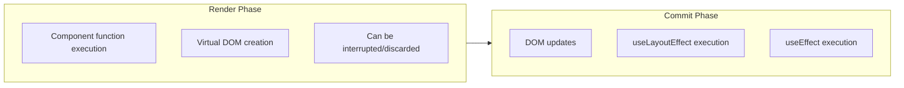
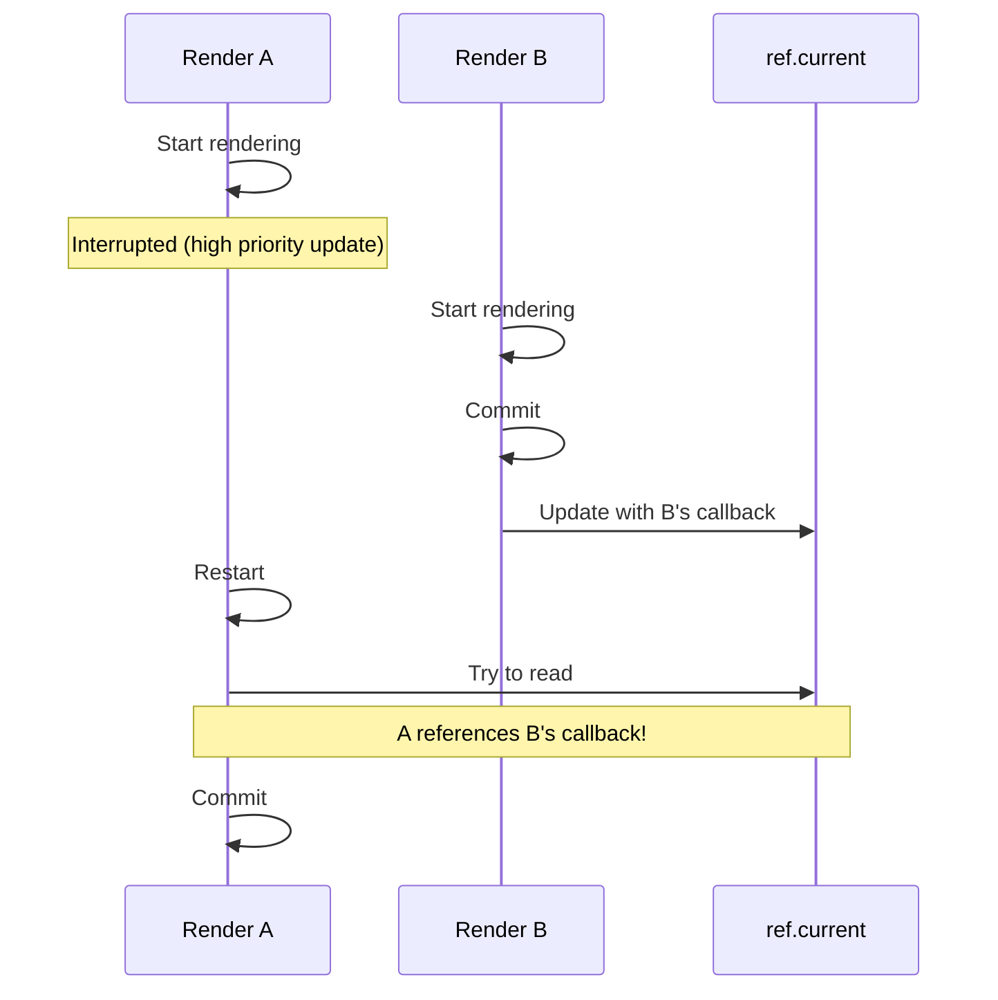

## Table of Contents

## Introduction: Revisiting a 3-Year-Old Article

In May 2022, I wrote an article about [`useEvent`, a new React hook](/2022/05/useEvent) that was in the RFC (Request for Comments) stage at the time. This hook generated quite a buzz among React developers because it promised to solve both function recreation and closure problems simultaneously.

Now, three years later, this hook has appeared in the official React documentation under the name `useEffectEvent`. (Though still an experimental feature) As the name change suggests, its scope has been narrowed from the original ambitious goals. Let's examine why this happened and how `useEffectEvent` should be used today.

## History: useCallback's Over-Invalidation Problem

This problem was actually raised when Hooks first appeared. In November 2018, Dan Abramov himself opened [GitHub issue #14099](https://github.com/facebook/react/issues/14099) to document this issue. The title itself reveals the core problem: **"useCallback() invalidates too often in practice"**

> "You're trying not to invalidate a callback (e.g. to keep shallow equality below or to avoid re-subscriptions) but it depends on props or state that changes too often."
>
> — Dan Abramov

This issue received many emoji reactions and comments, proving it was a problem many developers could relate to.

### Comparison with useReducer

An interesting point is the comparison with `useReducer`. Let's implement the same functionality using both `useReducer` and `useCallback`.

**Implementation with useCallback:**

```tsx
function Counter() {
  const [count, setCount] = useState(0)
  const [step, setStep] = useState(1)

  // The increment function is recreated whenever step changes
  const increment = useCallback(() => {
    setCount((c) => c + step)
  }, [step])

  return (
    <>
      <MemoizedButton onClick={increment}>+{step}</MemoizedButton>
      <input
        type="number"
        value={step}
        onChange={(e) => setStep(Number(e.target.value))}
      />
    </>
  )
}
```

When `step` changes, the `increment` function is recreated, invalidating the memoization of `MemoizedButton`.

**Implementation with useReducer:**

```tsx
function reducer(state, action) {
  switch (action.type) {
    case 'increment':
      return {...state, count: state.count + state.step}
    case 'setStep':
      return {...state, step: action.step}
    default:
      return state
  }
}

function Counter() {
  const [state, dispatch] = useReducer(reducer, {count: 0, step: 1})

  // dispatch maintains the same reference throughout the component lifecycle!
  // dispatch isn't recreated even when step changes
  const increment = useCallback(() => {
    dispatch({type: 'increment'})
  }, []) // Safe even with empty deps

  return (
    <>
      <MemoizedButton onClick={increment}>+{state.step}</MemoizedButton>
      <input
        type="number"
        value={state.step}
        onChange={(e) =>
          dispatch({type: 'setStep', step: Number(e.target.value)})
        }
      />
    </>
  )
}
```

`dispatch` is created once when the component mounts and never changes afterward. This is because the reducer function is evaluated directly during the render phase, accessing the latest state. No matter how much `step` changes, `dispatch`'s identity is preserved, so `MemoizedButton`'s memoization is maintained.

This difference is the root of the problem. We needed a way to have stable identity like `useReducer` while being as simple to use as `useCallback`.

### Community Solution: useEventCallback

Sophie Alpert's proposed `useEventCallback` pattern in this issue stands out:

```tsx
function useEventCallback(fn) {
  const ref = useRef()
  useLayoutEffect(() => {
    ref.current = fn
  })
  return useCallback(() => (0, ref.current)(), [])
}
```

This pattern later became the foundation for the `useEvent` RFC. However, Dan Abramov made clear why this shouldn't be the default behavior:

> "This might be an explicit solution but it's too easy to cause bugs with in Concurrent Mode."

It's prone to causing bugs in Concurrent Mode. Why is that?

### Why is it Problematic in Concurrent Mode?

In React's Concurrent Mode, rendering can be **interrupted**, **discarded**, or **executed multiple times**. Let's see how this conflicts with the `useEventCallback` pattern.

```tsx
function useEventCallback(fn) {
  const ref = useRef()
  useLayoutEffect(() => {
    ref.current = fn // Executed in commit phase
  })
  return useCallback(() => (0, ref.current)(), [])
}
```

The key is that `useLayoutEffect` runs during the **commit phase**. Let's recall React's rendering process:



**Problem Scenario 1: Calling during rendering**

```tsx
function Component() {
  const [count, setCount] = useState(0)

  const getCount = useEventCallback(() => count)

  // What if we call this during rendering?
  const doubled = getCount() * 2 // ref.current still has the previous value!

  return <div>{doubled}</div>
}
```

If `getCount()` is called during the render phase, `useLayoutEffect` hasn't executed yet, so `ref.current` still points to the callback from the previous render. This results in reading stale values.

**Problem Scenario 2: Render interruption and restart**

In Concurrent Mode, React can interrupt current rendering when higher-priority updates come in and restart later.



In this situation, when render A restarts, `ref.current` has already been updated with render B's callback. From render A's perspective, it's referencing a value from a different render, not its own.

**Problem Scenario 3: Render discard**

```tsx
function SearchResults({query}) {
  const [results, setResults] = useState([])

  const handleResults = useEventCallback((data) => {
    // Logic using query
    setResults(filterByQuery(data, query))
  })

  useEffect(() => {
    fetchData().then(handleResults)
  }, [])
}
```

When users quickly change `query`, React may discard previous renders and start new ones. But the already-started `fetchData()` callback's reference to `query` becomes unpredictable.

These problems led the React team to add the constraint that `useEffectEvent` can only be called within Effects. Effects always run after the commit phase, ensuring the ref is updated with the latest value before being called.

This warning evolved into the constraints of `useEffectEvent` three years later.

## Past Problems: Why useEvent was Needed?

Let me briefly summarize the content covered in [my previous article](/2022/05/useEvent).

### The Function Recreation Problem

When functions are defined in React components, they're recreated every time the component re-renders.

```tsx
function ChatInput({onSend}) {
  const [text, setText] = useState('')

  // sendMessage becomes a new function instance whenever text changes
  function sendMessage() {
    onSend(text)
  }

  return (
    <>
      <input value={text} onChange={(e) => setText(e.target.value)} />
      <button onClick={sendMessage}>Send</button>
    </>
  )
}
```

We use `useCallback` to solve this problem, but it's not perfect either.

### useCallback's Dilemma

```tsx
function ChatInput({ onSend }) {
  const [text, setText] = useState('')

  // Since text is in deps, the function is still recreated when text changes
  const sendMessage = useCallback(() => {
    onSend(text)
  }, [text, onSend])

  return (
    // ...
  )
}
```

With `text` in `useCallback`'s deps array, the function is recreated whenever `text` changes. But what if we remove `text` from deps?

```tsx
// Never do this!
const sendMessage = useCallback(() => {
  onSend(text) // Will always reference only the initial value ''
}, [])
```

This creates a **stale closure** problem. `text` will always reference only the value from component mount time (empty string).

### What is a Stale Closure?

Let's clarify what a stale closure is. JavaScript closures "remember" the scope when the function was created. The problem occurs when this "memory" is held too long.

```tsx
function Counter() {
  const [count, setCount] = useState(0)

  useEffect(() => {
    const id = setInterval(() => {
      console.log(count) // Always logs 0!
    }, 1000)
    return () => clearInterval(id)
  }, []) // With empty deps, this function is created only at mount
}
```

In the above code, the `setInterval` callback is created only once when the component mounts. This function's closure captured the scope when `count` was 0. No matter how much `count` changes afterward, this callback still references only the initially captured `count = 0`. It's like looking at an old (stale) photograph.

To fix this, we need to add `count` to deps:

```tsx
useEffect(() => {
  const id = setInterval(() => {
    console.log(count) // Now logs the latest count
  }, 1000)
  return () => clearInterval(id)
}, [count]) // The interval resets whenever count changes
```

But this breaks and restarts the interval every time `count` changes. This is the dilemma: **"We want to reference the latest value without recreating the function"** - conflicting requirements.

This is exactly the problem React developers have been grappling with for a long time. We needed a way to satisfy the conflicting requirement of "maintaining function identity while accessing the latest state/props."

## The Emergence of useEvent RFC

In 2022, the React team finally proposed an official solution. The [RFC: useEvent](https://github.com/reactjs/rfcs/blob/useevent/text/0000-useevent.md) was it. Looking at the RFC document's Motivation section, we can see it aimed to solve two core problems:

### Two Problems the RFC Aimed to Solve

**1. Event handlers breaking memoization**

```tsx
function Chat({selectedRoom}) {
  const [message, setMessage] = useState('')

  // Creates a new function whenever message changes
  const onClick = () => {
    sendMessage(selectedRoom, message)
  }

  // React.memo is meaningless since onClick keeps changing
  return <MemoizedButton onClick={onClick}>Send</MemoizedButton>
}
```

A new function is created every render, invalidating the memoization of child components wrapped with `React.memo`.

**2. Event handlers causing unnecessary Effect re-runs**

```tsx
function Chat({selectedRoom, theme}) {
  // onConnected is recreated whenever theme changes
  const onConnected = useCallback(() => {
    showNotification(theme, 'Connected!')
  }, [theme])

  useEffect(() => {
    const socket = createSocket(selectedRoom)
    socket.on('connected', onConnected)
    socket.connect()
    return () => socket.disconnect()
  }, [selectedRoom, onConnected]) // Socket reconnects when onConnected changes!
}
```

When `theme` changes, `onConnected` is recreated, causing the socket connection to disconnect and reconnect. In reality, reconnection isn't needed when only `theme` changes.

### The RFC's Proposed Solution

The RFC proposed a `useEvent` hook. The core idea was:

```tsx
function ChatInput({onSend}) {
  const [text, setText] = useState('')

  // useEvent: Can always access latest text without deps!
  const sendMessage = useEvent(() => {
    onSend(text)
  })

  // sendMessage's identity is always the same
  return (
    <>
      <input value={text} onChange={(e) => setText(e.target.value)} />
      <button onClick={sendMessage}>Send</button>
    </>
  )
}
```

`useEvent` aimed to satisfy three things simultaneously:

1. **No deps array** - No need to manage dependencies
2. **Stable function identity** - Maintains the same function reference across re-renders
3. **Always accesses latest values** - No stale closure problems

### Internal Implementation Principle

The implementation approach proposed in the RFC was roughly:

```tsx
function useEvent<T extends Function>(callback: T): T {
  const callbackRef = useRef<T>(callback)

  // Store the latest callback in ref every render
  useLayoutEffect(() => {
    callbackRef.current = callback
  })

  // Always return the same function reference, execute latest callback when called
  return useCallback((...args: unknown[]) => {
    return callbackRef.current?.(...args)
  }, []) as T
}
```

Store the latest callback in `useRef`, update it every render with `useLayoutEffect`. The returned function is wrapped with `useCallback` to maintain identity, but when actually called, it executes the latest callback stored in the ref.

### useEvent Implementation Used in Practice

When the RFC was released, many developers implemented and used this hook directly. Here's a `useEvent` hook implementation I created while working:

First, let's look at `useIsomorphicLayoutEffect`. This hook avoids warnings that `useLayoutEffect` causes in SSR environments:

```tsx
// useIsomorphicLayoutEffect.ts
import {useEffect, useLayoutEffect} from 'react'

// Use useEffect on server, useLayoutEffect on client
const useIsomorphicLayoutEffect =
  typeof window !== 'undefined' ? useLayoutEffect : useEffect

export default useIsomorphicLayoutEffect
```

React warns when using `useLayoutEffect` on the server side. Since `useLayoutEffect` is for DOM manipulation and there's no DOM on the server, we select the appropriate hook based on the environment.

Now let's look at the `useEvent` implementation:

```tsx
import {useMemo, useRef} from 'react'
import useIsomorphicLayoutEffect from './useIsomorphicLayoutEffect'

type CallbackFunction<ARGS extends unknown[], R> = (...args: ARGS) => R

const useEvent = <Arg extends unknown[], Return>(
  fn: CallbackFunction<Arg, Return>,
): CallbackFunction<Arg, Return> => {
  const ref = useRef<CallbackFunction<Arg, Return>>(fn)

  useIsomorphicLayoutEffect(() => {
    ref.current = fn
  })

  return useMemo(
    () =>
      (...args: Arg): Return => {
        const {current} = ref
        return current(...args)
      },
    [],
  )
}

export default useEvent
```

This is almost identical to the RFC's conceptual implementation. Let's examine a few points:

1. **`useIsomorphicLayoutEffect`**: Safely operates in SSR environments by choosing between `useLayoutEffect` and `useEffect` based on environment. (Since `useLayoutEffect` generates warnings on the server)

2. **`useMemo` vs `useCallback`**: Used `useMemo` instead of `useCallback`. Since `useCallback(fn, deps)` is identical to `useMemo(() => fn, deps)`, the result is the same.

3. **Type safety**: Uses generics to preserve argument and return value types.

This implementation works well but is vulnerable to the problems mentioned earlier (calling during rendering, Concurrent Mode, etc.). That's why it's important for the React team to provide an official API.

### Caveats Presented in the RFC

The RFC also made clear when `useEvent` shouldn't be used:

**1. Functions called during rendering should still use `useCallback`**

```tsx
function Component({items}) {
  // Functions called during rendering use useCallback, not useEvent
  const sortedItems = useMemo(() => {
    return items.sort(compareFn)
  }, [items, compareFn])
}
```

**2. Not all Effect dependencies are Events**

Just because a function is in an Effect's dependency array doesn't mean it should all be turned into events. You need to judge whether a value's change should re-run the Effect.

**3. Not all functions extracted from Effects are Events**

If a helper function inside an Effect is part of the Effect's reactive logic, it's not an event.

## But Why Did it Become useEffectEvent?

Several issues were raised during the RFC discussion process.

### 1. The Problem of Calling During Rendering

What happens if you call a function created with `useEvent` during rendering?

```tsx
function Component() {
  const [count, setCount] = useState(0)

  const getCount = useEvent(() => count)

  // What if we call this during rendering?
  const doubled = getCount() * 2 // Problem occurs!

  return <div>{doubled}</div>
}
```

Looking at `useEvent`'s internal implementation, ref updates happen in `useLayoutEffect`. That is, the latest callback is stored after rendering completes. Therefore, calling during rendering might reference values from the previous render.

### 2. Concerns About Generic Usage

Originally, `useEvent` was designed as a generic hook that could be used anywhere, not just for event handlers. But using it generically could:

- Make it hard to prevent calls in rendering logic
- Be abused to bypass Effect dependencies
- Make debugging difficult

### 3. Name Ambiguity

There were opinions that the name "Event" could be confused with DOM events.

## useEffectEvent: A Narrowed Solution

After these discussions, the React team narrowed the scope and introduced the hook under the name `useEffectEvent`. The key change is the constraint that it can **"only be called within Effects."**

### Basic Syntax

```tsx
import {useEffectEvent} from 'react'

const onSomething = useEffectEvent((param) => {
  // Can access latest props/state
  doSomethingWith(param, latestValue)
})
```

### Core Use Case: Separating Non-reactive Logic in Effects

Let's look at `useEffectEvent`'s most important use case.

```tsx
function ChatRoom({roomId, theme}) {
  useEffect(() => {
    const connection = createConnection(serverUrl, roomId)

    connection.on('connected', () => {
      // We don't want this Effect to re-run when theme changes!
      showNotification('Connected!', theme)
    })

    connection.connect()
    return () => connection.disconnect()
  }, [roomId, theme]) // theme in deps is the problem
}
```

The problem with the above code is that the socket connection disconnects and reconnects every time `theme` changes. `theme` is only needed when displaying notifications; it's not related to the connection itself.

This can be solved with `useEffectEvent`:

```tsx
function ChatRoom({roomId, theme}) {
  const onConnected = useEffectEvent(() => {
    showNotification('Connected!', theme)
  })

  useEffect(() => {
    const connection = createConnection(serverUrl, roomId)

    connection.on('connected', () => {
      onConnected() // theme removed from deps!
    })

    connection.connect()
    return () => connection.disconnect()
  }, [roomId]) // theme removed
}
```

`onConnected` is an "Effect Event." It's called inside an Effect but doesn't affect the Effect's reactivity. It behaves like a non-reactive code fragment inside the Effect.

### Another Example: Page Visit Logging

```tsx
function Page({url}) {
  const {items} = useContext(ShoppingCartContext)
  const numberOfItems = items.length

  useEffect(() => {
    logVisit(url, numberOfItems)
  }, [url, numberOfItems]) // Log every time numberOfItems changes?
}
```

In the above code, page visits are logged every time `numberOfItems` changes. But what we actually want is "log visits only when URL changes, but include the current cart item count in the log."

```tsx
function Page({url}) {
  const {items} = useContext(ShoppingCartContext)
  const numberOfItems = items.length

  const onVisit = useEffectEvent((visitedUrl) => {
    logVisit(visitedUrl, numberOfItems)
  })

  useEffect(() => {
    onVisit(url)
  }, [url]) // Only runs when url changes!
}
```

`onVisit` reads `numberOfItems`, but changes to `numberOfItems` don't cause the Effect to re-run.

## useEffectEvent Constraints

There are important constraints specified in the official documentation.

### 1. Only Callable Within Effects

```tsx
function ChatRoom({roomId}) {
  const onConnected = useEffectEvent(() => {
    // ...
  })

  useEffect(() => {
    onConnected() // OK
  }, [roomId])

  return (
    <button onClick={onConnected}>Click</button> // Don't do this!
  )
}
```

Effect Events are "non-reactive code fragments" of Effects. They're not functions that can be called anywhere like event handlers; they must only be called inside Effects.

### 2. No Passing to Other Components or Hooks

```tsx
function Timer() {
  const onTick = useEffectEvent(() => {
    // ...
  })

  useTimer(onTick, 1000) // Don't pass to other Hooks!
}
```

### 3. Don't Abuse to Bypass Dependency Linter

This is the most important caveat. `useEffectEvent` is not a tool to "hide" dependencies.

```tsx
// Wrong usage
function SearchResults({query}) {
  const onResults = useEffectEvent((results) => {
    setResults(results)
  })

  useEffect(() => {
    fetchResults(query).then(onResults)
  }, []) // Don't use useEffectEvent to remove query from deps!
}
```

Correct approach:

```tsx
// Correct usage
function SearchResults({query}) {
  useEffect(() => {
    fetchResults(query).then((results) => {
      setResults(results)
    })
  }, [query]) // query should be in deps since we need to search again when it changes
}
```

The key is to judge based on **"Should the Effect re-run when this value changes?"**

| Situation                                                 | Handling Method            |
| --------------------------------------------------------- | -------------------------- |
| Effect should re-run when value changes                  | Include in dependency array |
| Effect doesn't need to re-run when value changes         | Separate with `useEffectEvent` |

## useEffectEvent vs useCallback Comparison

| Feature               | useCallback               | useEffectEvent     |
| --------------------- | ------------------------- | ------------------ |
| Dependency array      | Required                  | None               |
| Function identity stability | Changes when deps change | Always stable      |
| Latest value access   | Only values in deps are latest | Always latest      |
| Usage location        | Anywhere possible         | Only within Effects |
| Status                | Stable API                | Stable API (19.2.0+) |

## Why Did it Take 3 Years?

The RFC came out in May 2022, but why was it only officially released in October 2025? Looking at the timeline reveals the reasons.

| Time           | Event                                                                                        |
| -------------- | -------------------------------------------------------------------------------------------- |
| May 2022       | [useEvent RFC](https://github.com/reactjs/rfcs/pull/220) proposed                          |
| Sep-Dec 2022   | experimental implementation, [renamed to useEffectEvent](https://github.com/facebook/react/pull/25881) |
| Dec 2022       | Original RFC abandoned ("That RFC is defunct")                                              |
| 2023           | React 19 development (focusing on RSC, Compiler, etc.)                                      |
| Apr 2024       | React 19 beta                                                                               |
| Dec 2024       | React 19 stable                                                                             |
| Oct 2025       | useEffectEvent officially released in React 19.2                                            |

There seem to be two factors:

1. **Original RFC was abandoned and scope was narrowed**: In [PR #25881](https://github.com/facebook/react/pull/25881), sebmarkbage said "That RFC is defunct. This is different." The direction completely changed from generic `useEvent` to Effect-specific `useEffectEvent`.

2. **React 19 itself took over 2 years**: It took about 2.5 years from React 18.2.0 (June 2022) to React 19 (December 2024). The major version release was delayed due to focus on large-scale work like React Server Components and React Compiler, leaving `useEffectEvent` waiting in experimental status.

## Current Status and Usage

In October 2025, [React 19.2.0](https://github.com/facebook/react/releases/tag/v19.2.0) finally released `useEffectEvent` as a **stable API**.

```tsx
import {useEffectEvent} from 'react'

const onSomething = useEffectEvent((param) => {
  // Can access latest props/state
})
```

You no longer need to import `experimental_useEffectEvent`. Also, `eslint-plugin-react-hooks` 6.1.0 added lint rules that prevent calling `useEffectEvent` functions within arbitrary closures, enforcing correct usage.

## Summary

- `useEffectEvent` originated from the 2022 `useEvent` RFC and was born by narrowing its scope
- Its main purpose is to separate non-reactive logic within Effects, preventing unnecessary Effect re-runs
- It can always access the latest props/state without a dependency array
- It has the constraint of only being callable within Effects
- It shouldn't be abused to bypass eslint react-hooks rules
- It was officially released as a stable API in React 19.2.0

Honestly, it would have been better if generic `useEvent` had been released. It could have been used for event handler optimization too. In [PR #25881](https://github.com/facebook/react/pull/25881), Sebastian Markbåge said:

> The scope of the new RFC will be specifically aimed at solving the Effects case. We wanted to decouple the Effects problem (which is very clear) from the rendering optimizations (to which there are many possible solutions, and where there isn't a clear winner yet).

While the Effects problem has a clear solution, rendering optimization doesn't have a clear winner yet, so they decided to separate the two problems. It's disappointing, but the approach of solving clear problems first makes sense.

## References

- [React Official Documentation: useEffectEvent](https://ko.react.dev/reference/react/useEffectEvent)
- [useEvent RFC](https://github.com/reactjs/rfcs/blob/useevent/text/0000-useevent.md)
- [GitHub Issue #14099: useCallback() invalidates too often in practice](https://github.com/facebook/react/issues/14099)
- [PR #25881: Rename experimental useEvent to useEffectEvent](https://github.com/facebook/react/pull/25881)
- [React 19.2.0 Release](https://github.com/facebook/react/releases/tag/v19.2.0)
- [Previous article: React's new hook, useEvent](/2022/05/useEvent)