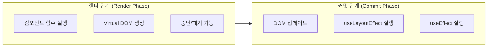
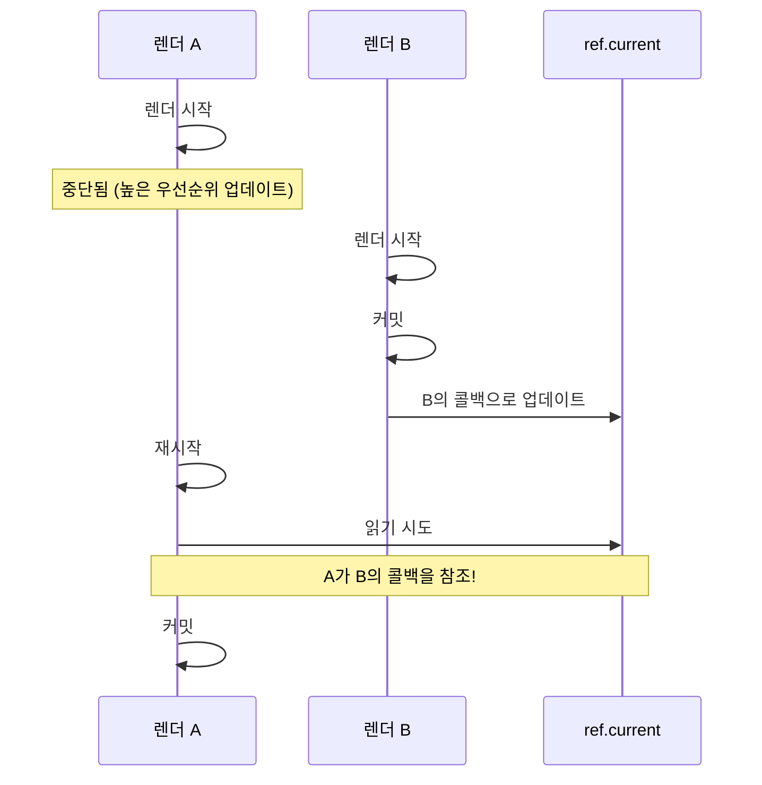

## Table of Contents

## 서론: 3년 전 글을 다시 꺼내며

2022년 5월, 나는 [`useEvent`라는 리액트의 새로운 훅에 대한 글](/2022/05/useEvent)을 작성한 적이 있다. 당시 RFC(Request for Comments) 단계였던 이 훅은 리액트 개발자들 사이에서 꽤 화제가 되었다. 함수 재생성 문제와 클로저 문제를 동시에 해결할 수 있다는 점에서 많은 기대를 모았기 때문이다.

그리고 3년이 지난 지금, 이 훅은 `useEffectEvent`라는 이름으로 React 공식 문서에 등장했다. (아직 실험적 기능이지만) 이름이 바뀐 것에서 알 수 있듯이, 원래의 야심찬 목표에서 범위가 좀 줄어들었다. 왜 그렇게 되었는지, 그리고 현재 `useEffectEvent`는 어떻게 사용해야 하는지 자세히 살펴보자.

## 역사: useCallback의 과도한 무효화 문제

사실 이 문제는 Hooks가 처음 등장했을 때부터 제기되었다. 2018년 11월, Dan Abramov가 직접 [GitHub 이슈 #14099](https://github.com/facebook/react/issues/14099)를 열어 이 문제를 정리했다. 이슈 제목부터 문제의 핵심을 드러낸다: **"useCallback() invalidates too often in practice"**

> "You're trying not to invalidate a callback (e.g. to keep shallow equality below or to avoid re-subscriptions) but it depends on props or state that changes too often."
>
> — Dan Abramov

번역하면 "콜백을 무효화하지 않으려 하지만(얕은 동등성 유지나 재구독 방지), props나 state에 의존하면 너무 자주 무효화된다"는 것이다. 이 이슈는 많은 이모지와 댓글을 받으며, 많은 개발자들이 공감하는 문제임을 입증했다.

### useReducer와의 비교

흥미로운 점은 `useReducer`와의 비교다. 같은 기능을 `useReducer`와 `useCallback`으로 각각 구현해보자.

**useCallback으로 구현한 경우:**

```tsx
function Counter() {
  const [count, setCount] = useState(0)
  const [step, setStep] = useState(1)

  // step이 바뀔 때마다 increment 함수가 재생성된다
  const increment = useCallback(() => {
    setCount((c) => c + step)
  }, [step])

  return (
    <>
      <MemoizedButton onClick={increment}>+{step}</MemoizedButton>
      <input
        type="number"
        value={step}
        onChange={(e) => setStep(Number(e.target.value))}
      />
    </>
  )
}
```

`step`이 변경되면 `increment` 함수가 재생성되고, `MemoizedButton`의 메모이제이션이 무효화된다.

**useReducer로 구현한 경우:**

```tsx
function reducer(state, action) {
  switch (action.type) {
    case 'increment':
      return {...state, count: state.count + state.step}
    case 'setStep':
      return {...state, step: action.step}
    default:
      return state
  }
}

function Counter() {
  const [state, dispatch] = useReducer(reducer, {count: 0, step: 1})

  // dispatch는 컴포넌트 생애주기 동안 항상 동일한 참조!
  // step이 바뀌어도 dispatch는 재생성되지 않는다
  const increment = useCallback(() => {
    dispatch({type: 'increment'})
  }, []) // deps가 비어있어도 안전하다

  return (
    <>
      <MemoizedButton onClick={increment}>+{state.step}</MemoizedButton>
      <input
        type="number"
        value={state.step}
        onChange={(e) =>
          dispatch({type: 'setStep', step: Number(e.target.value)})
        }
      />
    </>
  )
}
```

`dispatch`는 컴포넌트가 마운트될 때 한 번 생성되고, 이후 절대 변경되지 않는다. 왜냐하면 리듀서 함수가 렌더 단계에서 직접 평가되어 최신 state에 접근하기 때문이다. `step`이 아무리 바뀌어도 `dispatch`의 identity는 유지되므로 `MemoizedButton`의 메모이제이션도 유지된다.

이 차이가 바로 문제의 근원이다. `useReducer`처럼 안정적인 identity를 가지면서도, `useCallback`처럼 간단하게 사용할 수 있는 방법이 필요했다.

### 커뮤니티의 해결책: useEventCallback

이 이슈에서 Sophie Alpert가 제안한 `useEventCallback` 패턴이 눈에 띈다:

```tsx
function useEventCallback(fn) {
  const ref = useRef()
  useLayoutEffect(() => {
    ref.current = fn
  })
  return useCallback(() => (0, ref.current)(), [])
}
```

이 패턴은 나중에 `useEvent` RFC의 기반이 되었다. 하지만 Dan Abramov는 이것을 기본 동작으로 만들지 않으려는 이유를 명확히 했다:

> "This might be an explicit solution but it's too easy to cause bugs with in Concurrent Mode."

동시 모드에서 버그를 유발하기 쉽다는 것이다. 왜 그럴까?

### 왜 Concurrent Mode에서 문제가 되는가?

React의 Concurrent Mode(동시 모드)에서는 렌더링이 **중단**되거나, **폐기**되거나, **여러 번 실행**될 수 있다. 이게 `useEventCallback` 패턴과 어떻게 충돌하는지 살펴보자.

```tsx
function useEventCallback(fn) {
  const ref = useRef()
  useLayoutEffect(() => {
    ref.current = fn // 커밋 단계에서 실행
  })
  return useCallback(() => (0, ref.current)(), [])
}
```

핵심은 `useLayoutEffect`가 **커밋 단계**에서 실행된다는 것이다. React의 렌더링 과정을 떠올려보자:



**문제 시나리오 1: 렌더링 중 호출**

```tsx
function Component() {
  const [count, setCount] = useState(0)

  const getCount = useEventCallback(() => count)

  // 렌더링 중에 호출하면?
  const doubled = getCount() * 2 // ref.current는 아직 이전 값!

  return <div>{doubled}</div>
}
```

렌더 단계에서 `getCount()`를 호출하면, `useLayoutEffect`가 아직 실행되지 않았으므로 `ref.current`는 이전 렌더의 콜백을 가리킨다. 결과적으로 stale 값을 읽게 된다.

**문제 시나리오 2: 렌더링 중단과 재시작**

Concurrent Mode에서 React는 우선순위가 높은 업데이트가 들어오면 현재 렌더링을 중단하고 나중에 다시 시작할 수 있다.



이런 상황에서 렌더 A가 재시작될 때, `ref.current`는 이미 렌더 B의 콜백으로 업데이트되어 있다. 렌더 A 입장에서는 자신의 값이 아닌 다른 렌더의 값을 참조하게 되는 것이다.

**문제 시나리오 3: 렌더링 폐기**

```tsx
function SearchResults({query}) {
  const [results, setResults] = useState([])

  const handleResults = useEventCallback((data) => {
    // query를 사용하는 로직
    setResults(filterByQuery(data, query))
  })

  useEffect(() => {
    fetchData().then(handleResults)
  }, [])
}
```

사용자가 빠르게 `query`를 변경하면, React는 이전 렌더를 폐기하고 새 렌더를 시작할 수 있다. 하지만 이미 시작된 `fetchData()`의 콜백은 어떤 시점의 `query`를 참조할지 예측하기 어렵다.

이런 문제들 때문에 React 팀은 `useEffectEvent`에 "Effect 내에서만 호출 가능"이라는 제약을 두었다. Effect는 항상 커밋 단계 이후에 실행되므로, ref가 최신 값으로 업데이트된 후에만 호출되는 것이 보장된다.

이 경고는 3년 후 `useEffectEvent`의 제약사항으로 이어진다.

## 과거의 문제: 왜 useEvent가 필요했나?

[이전 글](/2022/05/useEvent)에서 다뤘던 내용을 간단히 요약해보자.

### 함수 재생성의 문제

리액트 컴포넌트에서 함수를 정의하면, 컴포넌트가 리렌더링될 때마다 함수가 새로 생성된다.

```tsx
function ChatInput({onSend}) {
  const [text, setText] = useState('')

  // text가 변경될 때마다 sendMessage도 새로운 함수 인스턴스가 된다
  function sendMessage() {
    onSend(text)
  }

  return (
    <>
      <input value={text} onChange={(e) => setText(e.target.value)} />
      <button onClick={sendMessage}>Send</button>
    </>
  )
}
```

이 문제를 해결하기 위해 `useCallback`을 사용하지만, 이것도 완벽하지 않다.

### useCallback의 딜레마

```tsx
function ChatInput({ onSend }) {
  const [text, setText] = useState('')

  // deps에 text가 있으므로, text가 바뀌면 여전히 함수가 재생성된다
  const sendMessage = useCallback(() => {
    onSend(text)
  }, [text, onSend])

  return (
    // ...
  )
}
```

`useCallback`의 deps 배열에 `text`를 넣으면 `text`가 변경될 때마다 함수가 재생성된다. 그렇다고 deps에서 `text`를 빼면?

```tsx
// 절대 이렇게 하면 안 된다!
const sendMessage = useCallback(() => {
  onSend(text) // 항상 초기값인 ''만 참조하게 된다
}, [])
```

**stale closure**(오래된 클로저) 문제가 발생한다. `text`는 항상 컴포넌트 마운트 시점의 값(빈 문자열)만 참조하게 된다.

### Stale Closure란 무엇인가?

잠깐, stale closure가 뭔지 짚고 넘어가자. JavaScript의 클로저는 함수가 생성될 때의 스코프를 "기억"한다. 문제는 이 "기억"이 너무 오래 유지될 때 발생한다.

```tsx
function Counter() {
  const [count, setCount] = useState(0)

  useEffect(() => {
    const id = setInterval(() => {
      console.log(count) // 항상 0만 출력된다!
    }, 1000)
    return () => clearInterval(id)
  }, []) // deps가 비어있으면 이 함수는 마운트 시점에만 생성됨
}
```

위 코드에서 `setInterval` 콜백은 컴포넌트가 마운트될 때 한 번만 생성된다. 이 함수의 클로저는 `count`가 0일 때의 스코프를 캡처했다. 이후 `count`가 아무리 변경되어도, 이 콜백은 여전히 처음 캡처한 `count = 0`만 참조한다. 마치 오래된(stale) 사진을 보고 있는 것처럼.

이걸 해결하려면 deps에 `count`를 추가해야 한다:

```tsx
useEffect(() => {
  const id = setInterval(() => {
    console.log(count) // 이제 최신 count를 출력
  }, 1000)
  return () => clearInterval(id)
}, [count]) // count가 바뀔 때마다 인터벌을 재설정
```

하지만 이러면 `count`가 바뀔 때마다 인터벌이 끊기고 다시 시작된다. 이게 바로 딜레마다: **"최신 값을 참조하면서도 함수는 재생성하고 싶지 않다"** 는 상충되는 요구.

이것이 바로 리액트 개발자들이 오랫동안 고민해왔던 문제다. "함수의 identity는 유지하면서, 최신 state/props에는 접근하고 싶다"는 상충되는 요구사항을 해결할 방법이 필요했다.

## useEvent RFC의 등장

2022년, React 팀은 드디어 공식적인 해결책을 제안했다. [RFC: useEvent](https://github.com/reactjs/rfcs/blob/useevent/text/0000-useevent.md)가 그것이다. RFC 문서의 동기(Motivation) 섹션을 살펴보면, 두 가지 핵심 문제를 해결하려 했음을 알 수 있다:

### RFC가 해결하려던 두 가지 문제

**1. 이벤트 핸들러가 메모이제이션을 깨뜨리는 문제**

```tsx
function Chat({selectedRoom}) {
  const [message, setMessage] = useState('')

  // message가 바뀔 때마다 새 함수 생성
  const onClick = () => {
    sendMessage(selectedRoom, message)
  }

  // React.memo로 감싸도 onClick이 계속 바뀌니까 의미 없음
  return <MemoizedButton onClick={onClick}>Send</MemoizedButton>
}
```

매 렌더링마다 새 함수가 생성되어 `React.memo`로 감싼 자식 컴포넌트의 메모이제이션을 무효화한다.

**2. 이벤트 핸들러가 Effect의 불필요한 재실행을 유발하는 문제**

```tsx
function Chat({selectedRoom, theme}) {
  // theme이 바뀔 때마다 onConnected도 새로 생성
  const onConnected = useCallback(() => {
    showNotification(theme, 'Connected!')
  }, [theme])

  useEffect(() => {
    const socket = createSocket(selectedRoom)
    socket.on('connected', onConnected)
    socket.connect()
    return () => socket.disconnect()
  }, [selectedRoom, onConnected]) // onConnected가 바뀌면 소켓 재연결!
}
```

`theme`이 바뀌면 `onConnected`가 재생성되고, 그로 인해 소켓 연결이 끊겼다가 다시 연결된다. 실제로는 `theme`이 변경되어도 재연결이 필요 없는데 말이다.

### RFC가 제안한 해결책

RFC는 `useEvent` 훅을 제안했다. 핵심 아이디어는 다음과 같았다:

```tsx
function ChatInput({onSend}) {
  const [text, setText] = useState('')

  // useEvent: deps가 없어도 항상 최신 text에 접근 가능!
  const sendMessage = useEvent(() => {
    onSend(text)
  })

  // sendMessage의 identity는 항상 동일하다
  return (
    <>
      <input value={text} onChange={(e) => setText(e.target.value)} />
      <button onClick={sendMessage}>Send</button>
    </>
  )
}
```

`useEvent`는 세 가지를 동시에 만족시키려 했다:

1. **deps 배열이 없다** - 의존성을 관리할 필요가 없다
2. **함수 identity가 안정적이다** - 리렌더링에도 동일한 함수 참조를 유지한다
3. **항상 최신 값에 접근한다** - stale closure 문제가 없다

### 내부 구현 원리

당시 RFC에서 제안된 구현 방식은 대략 이랬다:

```tsx
function useEvent<T extends Function>(callback: T): T {
  const callbackRef = useRef<T>(callback)

  // 매 렌더링마다 최신 콜백을 ref에 저장
  useLayoutEffect(() => {
    callbackRef.current = callback
  })

  // 항상 동일한 함수 참조를 반환, 호출 시 최신 콜백 실행
  return useCallback((...args: unknown[]) => {
    return callbackRef.current?.(...args)
  }, []) as T
}
```

`useRef`로 최신 콜백을 저장하고, `useLayoutEffect`로 매 렌더링마다 업데이트한다. 반환하는 함수는 `useCallback`으로 감싸서 identity를 유지하되, 실제 호출 시에는 ref에 저장된 최신 콜백을 실행하는 방식이다.

### 실무에서 직접 구현해 쓰던 useEvent

RFC가 나왔을 때 많은 개발자들이 이 훅을 직접 구현해서 사용했다. 실제 내가 일하면서 만든 `useEvent` 훅 구현은 다음과 같다.

먼저 `useIsomorphicLayoutEffect`부터 살펴보자. 이 훅은 SSR 환경에서 `useLayoutEffect`가 발생시키는 경고를 피하기 위한 것이다:

```tsx
// useIsomorphicLayoutEffect.ts
import {useEffect, useLayoutEffect} from 'react'

// 서버에서는 useEffect, 클라이언트에서는 useLayoutEffect 사용
const useIsomorphicLayoutEffect =
  typeof window !== 'undefined' ? useLayoutEffect : useEffect

export default useIsomorphicLayoutEffect
```

서버 사이드에서 `useLayoutEffect`를 사용하면 React가 경고를 뱉는다. `useLayoutEffect`는 DOM 조작을 위한 훅인데, 서버에는 DOM이 없기 때문이다. 그래서 환경에 따라 적절한 훅을 선택하는 것이다.

이제 `useEvent` 구현을 보자:

```tsx
import {useMemo, useRef} from 'react'
import useIsomorphicLayoutEffect from './useIsomorphicLayoutEffect'

type CallbackFunction<ARGS extends unknown[], R> = (...args: ARGS) => R

const useEvent = <Arg extends unknown[], Return>(
  fn: CallbackFunction<Arg, Return>,
): CallbackFunction<Arg, Return> => {
  const ref = useRef<CallbackFunction<Arg, Return>>(fn)

  useIsomorphicLayoutEffect(() => {
    ref.current = fn
  })

  return useMemo(
    () =>
      (...args: Arg): Return => {
        const {current} = ref
        return current(...args)
      },
    [],
  )
}

export default useEvent
```

RFC의 개념적 구현과 거의 동일하다. 몇 가지 포인트를 살펴보자:

1. **`useIsomorphicLayoutEffect`**: SSR 환경에서도 안전하게 동작하도록 `useLayoutEffect`와 `useEffect`를 환경에 따라 선택한다. (서버에서는 `useLayoutEffect`가 경고를 발생시키기 때문)

2. **`useMemo` vs `useCallback`**: `useCallback`대신 `useMemo`를 사용했다. 사실 `useCallback(fn, deps)`는 `useMemo(() => fn, deps)`와 동일하므로 결과는 같다.

3. **타입 안전성**: 제네릭을 사용해서 인자와 반환값의 타입을 보존한다.

이 구현은 잘 동작하지만, 앞서 언급한 문제들(렌더링 중 호출, Concurrent Mode 등)에 취약하다. 그래서 React 팀이 공식 API를 제공하는 게 중요한 것이다.

### RFC에서 제시한 주의사항

RFC는 `useEvent`를 사용하면 안 되는 경우도 명확히 했다:

**1. 렌더링 중에 호출되는 함수는 여전히 `useCallback` 사용**

```tsx
function Component({items}) {
  // 렌더링 중에 호출되는 함수는 useEvent가 아닌 useCallback 사용
  const sortedItems = useMemo(() => {
    return items.sort(compareFn)
  }, [items, compareFn])
}
```

**2. 모든 Effect 의존성이 Event는 아니다**

Effect의 의존성 배열에 있는 함수라고 해서 모두 event로 바꿔야 하는 건 아니다. 어떤 값의 변경이 Effect를 다시 실행해야 하는지 판단이 필요하다.

**3. Effect에서 추출한 모든 함수가 Event는 아니다**

Effect 내부의 보조 함수가 Effect의 reactive 로직 일부라면, 그건 event가 아니다.

## 그런데 왜 useEffectEvent가 되었나?

RFC 논의 과정에서 몇 가지 문제가 제기되었다.

### 1. 렌더링 중 호출 문제

`useEvent`로 만든 함수를 렌더링 도중 호출하면 어떻게 될까?

```tsx
function Component() {
  const [count, setCount] = useState(0)

  const getCount = useEvent(() => count)

  // 이렇게 렌더링 중에 호출하면?
  const doubled = getCount() * 2 // 문제 발생!

  return <div>{doubled}</div>
}
```

`useEvent`의 내부 구현을 보면, ref 업데이트가 `useLayoutEffect`에서 일어난다. 즉, 렌더링이 완료된 후에 최신 콜백이 저장된다. 따라서 렌더링 도중에 호출하면 이전 렌더의 값을 참조할 수 있다.

### 2. 범용적 사용에 대한 우려

원래 `useEvent`는 이벤트 핸들러뿐만 아니라 어디서든 사용할 수 있는 범용 훅으로 설계되었다. 하지만 이렇게 범용적으로 사용하면:

- 렌더링 로직에서 호출되는 경우를 막기 어렵다
- Effect의 의존성을 우회하는 용도로 남용될 수 있다
- 디버깅이 어려워질 수 있다

### 3. 이름의 모호함

"Event"라는 이름이 DOM 이벤트와 혼동될 수 있다는 의견도 있었다.

## useEffectEvent: 범위를 좁힌 해결책

이러한 논의 끝에, React 팀은 범위를 좁혀서 `useEffectEvent`라는 이름으로 훅을 도입했다. 핵심적인 변화는 **"Effect 내에서만 호출 가능"** 하다는 제약이다.

### 기본 문법

```tsx
import {useEffectEvent} from 'react'

const onSomething = useEffectEvent((param) => {
  // 최신 props/state에 접근 가능
  doSomethingWith(param, latestValue)
})
```

### 핵심 사용 사례: Effect에서 비반응형 로직 분리

`useEffectEvent`의 가장 중요한 사용 사례를 살펴보자.

```tsx
function ChatRoom({roomId, theme}) {
  useEffect(() => {
    const connection = createConnection(serverUrl, roomId)

    connection.on('connected', () => {
      // theme이 변경되어도 이 Effect가 재실행되길 원하지 않는다!
      showNotification('연결됨!', theme)
    })

    connection.connect()
    return () => connection.disconnect()
  }, [roomId, theme]) // theme이 deps에 있어서 문제다
}
```

위 코드의 문제는 `theme`이 변경될 때마다 소켓 연결이 끊겼다가 다시 연결된다는 것이다. `theme`은 알림을 표시할 때만 필요하지, 연결 자체와는 관련이 없는데 말이다.

`useEffectEvent`로 해결할 수 있다:

```tsx
function ChatRoom({roomId, theme}) {
  const onConnected = useEffectEvent(() => {
    showNotification('연결됨!', theme)
  })

  useEffect(() => {
    const connection = createConnection(serverUrl, roomId)

    connection.on('connected', () => {
      onConnected() // theme이 deps에서 사라졌다!
    })

    connection.connect()
    return () => connection.disconnect()
  }, [roomId]) // theme 제거
}
```

`onConnected`는 "Effect Event"다. Effect 내부에서 호출되지만, Effect의 반응성에는 영향을 주지 않는다. 마치 Effect 내부의 비반응형 코드 조각처럼 동작한다.

### 또 다른 예시: 페이지 방문 로깅

```tsx
function Page({url}) {
  const {items} = useContext(ShoppingCartContext)
  const numberOfItems = items.length

  useEffect(() => {
    logVisit(url, numberOfItems)
  }, [url, numberOfItems]) // numberOfItems가 변경될 때마다 로깅?
}
```

위 코드에서 `numberOfItems`가 변경될 때마다 페이지 방문이 로깅된다. 하지만 실제로 원하는 것은 "URL이 바뀔 때만 방문을 기록하되, 현재 장바구니 아이템 수도 함께 기록하고 싶다"이다.

```tsx
function Page({url}) {
  const {items} = useContext(ShoppingCartContext)
  const numberOfItems = items.length

  const onVisit = useEffectEvent((visitedUrl) => {
    logVisit(visitedUrl, numberOfItems)
  })

  useEffect(() => {
    onVisit(url)
  }, [url]) // url이 변경될 때만 실행!
}
```

`onVisit`은 `numberOfItems`를 읽지만, `numberOfItems`의 변경이 Effect를 재실행시키지는 않는다.

## useEffectEvent의 제약사항

공식 문서에서 명시하는 중요한 제약사항들이 있다.

### 1. Effect 내에서만 호출 가능

```tsx
function ChatRoom({roomId}) {
  const onConnected = useEffectEvent(() => {
    // ...
  })

  useEffect(() => {
    onConnected() // OK
  }, [roomId])

  return (
    <button onClick={onConnected}>클릭</button> // 이렇게 하면 안 된다!
  )
}
```

Effect Event는 Effect의 "비반응형 코드 조각"이다. 이벤트 핸들러처럼 아무 데서나 호출할 수 있는 함수가 아니라, 반드시 Effect 내부에서만 호출되어야 한다.

### 2. 다른 컴포넌트나 Hook으로 전달 금지

```tsx
function Timer() {
  const onTick = useEffectEvent(() => {
    // ...
  })

  useTimer(onTick, 1000) // 다른 Hook으로 전달하면 안 된다!
}
```

### 3. 의존성 린터 우회 용도로 남용 금지

가장 중요한 주의사항이다. `useEffectEvent`는 의존성을 "숨기는" 도구가 아니다.

```tsx
// 잘못된 사용
function SearchResults({query}) {
  const onResults = useEffectEvent((results) => {
    setResults(results)
  })

  useEffect(() => {
    fetchResults(query).then(onResults)
  }, []) // query를 deps에서 빼려고 useEffectEvent를 쓰면 안 된다!
}
```

올바른 접근:

```tsx
// 올바른 사용
function SearchResults({query}) {
  useEffect(() => {
    fetchResults(query).then((results) => {
      setResults(results)
    })
  }, [query]) // query가 바뀌면 다시 검색해야 하므로 deps에 있어야 한다
}
```

핵심은 **"이 값이 바뀌면 Effect가 다시 실행되어야 하는가?"** 를 기준으로 판단하는 것이다.

| 상황                                         | 처리 방법               |
| -------------------------------------------- | ----------------------- |
| 값이 바뀌면 Effect를 다시 실행해야 함        | 의존성 배열에 포함      |
| 값이 바뀌어도 Effect를 다시 실행할 필요 없음 | `useEffectEvent`로 분리 |

## useEffectEvent vs useCallback 비교

| 특성                 | useCallback             | useEffectEvent     |
| -------------------- | ----------------------- | ------------------ |
| 의존성 배열          | 필요함                  | 없음               |
| 함수 identity 안정성 | deps가 바뀌면 변경됨    | 항상 안정적        |
| 최신 값 접근         | deps에 포함된 값만 최신 | 항상 최신          |
| 사용 위치            | 어디서든 가능           | Effect 내에서만    |
| 상태                 | 안정적 API              | 정식 API (19.2.0+) |

## 왜 3년이나 걸렸나?

2022년 5월 RFC가 나왔는데, 왜 2025년 10월에야 정식 출시되었을까? 타임라인을 정리해보면 이유가 보인다.

| 시점            | 이벤트                                                                                        |
| --------------- | --------------------------------------------------------------------------------------------- |
| 2022년 5월      | [useEvent RFC](https://github.com/reactjs/rfcs/pull/220) 제안                                 |
| 2022년 9월-12월 | experimental 구현, [useEffectEvent로 이름 변경](https://github.com/facebook/react/pull/25881) |
| 2022년 12월     | 원래 RFC 폐기 ("That RFC is defunct")                                                         |
| 2023년          | React 19 개발 중 (RSC, Compiler 등에 집중)                                                    |
| 2024년 4월      | React 19 beta                                                                                 |
| 2024년 12월     | React 19 stable                                                                               |
| 2025년 10월     | React 19.2에서 useEffectEvent 정식 출시                                                       |

두 가지 요인이 있었던 걸로 추측해볼 수 있다:

1. **원래 RFC가 폐기되고 범위가 축소됨**: [PR #25881](https://github.com/facebook/react/pull/25881)에서 sebmarkbage는 "That RFC is defunct. This is different."라고 말했다. 범용적인 `useEvent`에서 Effect 전용 `useEffectEvent`로 방향이 완전히 바뀌었다.

2. **React 19 자체가 2년 넘게 걸림**: React 18.2.0(2022년 6월)에서 React 19(2024년 12월)까지 약 2년 반이 걸렸다. React Server Components, React Compiler 등 대규모 작업에 집중하느라 메이저 버전 출시가 늦어졌고, `useEffectEvent`는 experimental 상태로 대기해야 했다.

## 현재 상태와 사용 방법

2025년 10월, [React 19.2.0](https://github.com/facebook/react/releases/tag/v19.2.0)에서 `useEffectEvent`가 드디어 **정식 API**로 출시되었다.

```tsx
import {useEffectEvent} from 'react'

const onSomething = useEffectEvent((param) => {
  // 최신 props/state에 접근 가능
})
```

더 이상 `experimental_useEffectEvent`를 import할 필요가 없다. 또한 `eslint-plugin-react-hooks` 6.1.0에서는 `useEffectEvent` 함수를 임의의 클로저 내에서 호출하는 것을 금지하는 린트 규칙이 추가되어, 올바른 사용을 강제한다.

## 요약

- `useEffectEvent`는 2022년 `useEvent` RFC에서 출발하여, 범위를 좁혀서 탄생한 훅이다
- Effect 내에서 비반응형 로직을 분리하여, 불필요한 Effect 재실행을 방지하는 것이 주 목적이다
- 의존성 배열 없이도 항상 최신 props/state에 접근할 수 있다
- Effect 내에서만 호출 가능하다는 제약이 있다
- eslint react-hooks 의 규칙을 우회하는 용도로 남용하면 안 된다
- React 19.2.0에서 정식 API로 출시되었다

솔직히 범용적인 `useEvent`가 나왔으면 더 좋았을 것 같다. 이벤트 핸들러 최적화에도 쓸 수 있었을 텐데. [PR #25881](https://github.com/facebook/react/pull/25881)에서 Sebastian Markbåge는 이렇게 말했다:

> The scope of the new RFC will be specifically aimed at solving the Effects case. We wanted to decouple the Effects problem (which is very clear) from the rendering optimizations (to which there are many possible solutions, and where there isn't a clear winner yet).

Effect 문제는 해결 방법이 명확한 반면, 렌더링 최적화는 아직 어떤 방식이 최선인지 결론이 나지 않아서 두 문제를 분리하기로 했다는 것이다. 아쉽지만, 명확한 문제부터 해결하겠다는 건 납득이 된다.

## 참고

- [React 공식 문서: useEffectEvent](https://ko.react.dev/reference/react/useEffectEvent)
- [useEvent RFC](https://github.com/reactjs/rfcs/blob/useevent/text/0000-useevent.md)
- [GitHub Issue #14099: useCallback() invalidates too often in practice](https://github.com/facebook/react/issues/14099)
- [PR #25881: Rename experimental useEvent to useEffectEvent](https://github.com/facebook/react/pull/25881)
- [React 19.2.0 Release](https://github.com/facebook/react/releases/tag/v19.2.0)
- [이전 글: 리액트의 새로운 훅, useEvent](/2022/05/useEvent)
