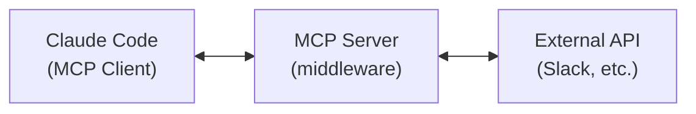
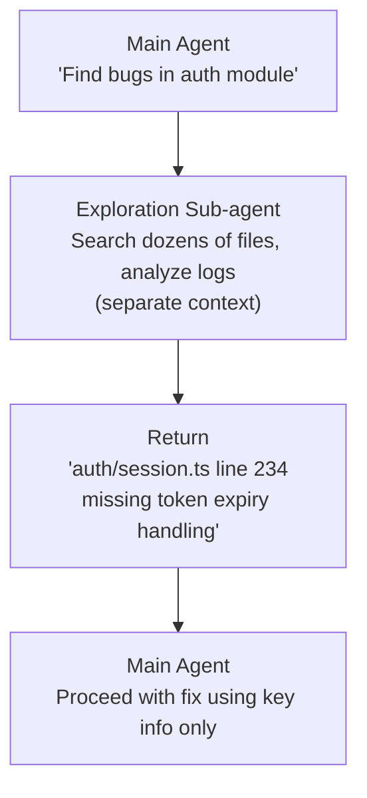
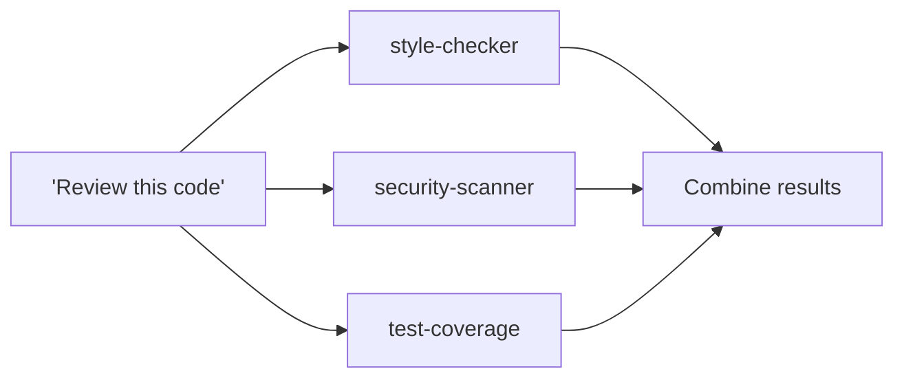
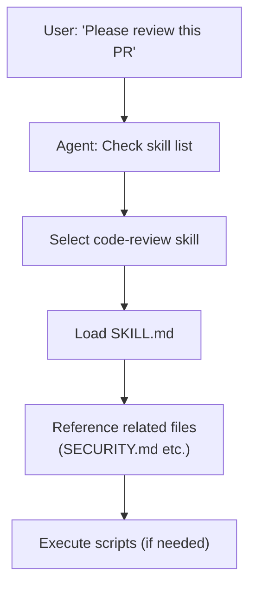
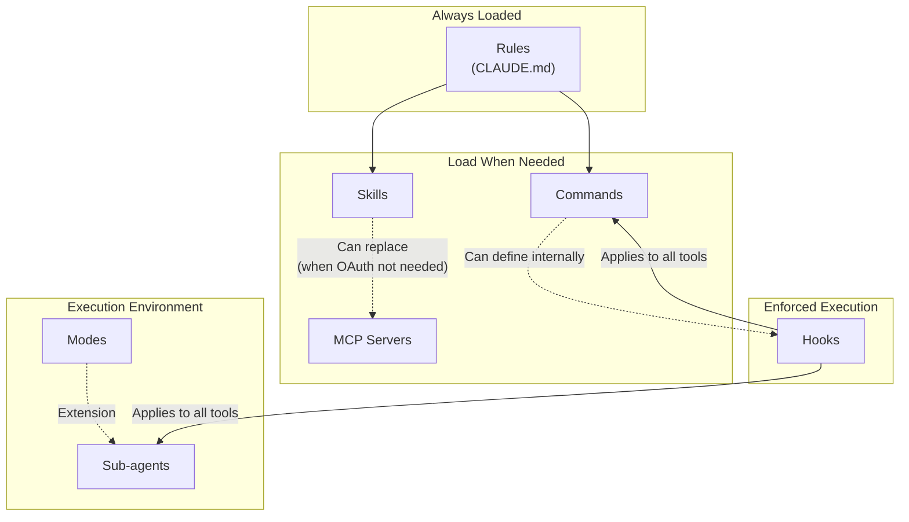
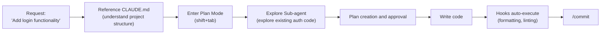
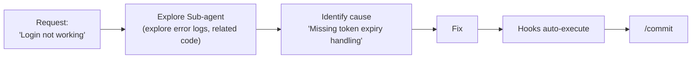
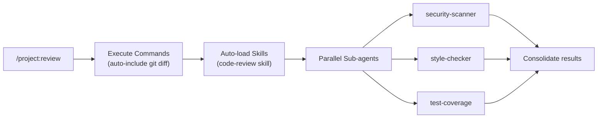
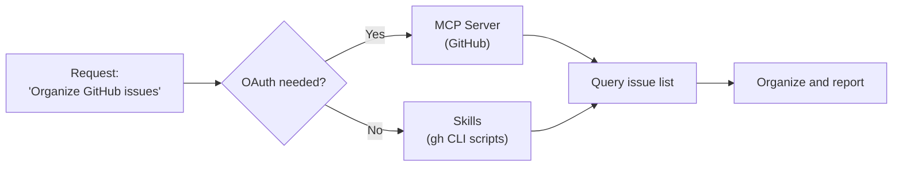

## Table of Contents

## Introduction

This post is based on [leerob's video](https://www.youtube.com/watch?v=L_p5GxGSB_I), translated with additional content and links added from my knowledge. Note that it may differ somewhat from the original.

To properly utilize coding agents, you need to understand several core concepts. Rules, Commands, MCP, Sub-agents, Modes, Hooks, Skills, Plugins - these may sound complex at first, but once you understand the problems each one solves, they become much easier to grasp.

## What to Learn First

You don't need to master all concepts at once. Follow this learning path:

**Step 1: CLAUDE.md (Rules)**

- The first thing you should set up
- Writing down project structure, coding conventions, and frequently used commands makes your agent much smarter

**Step 2: Hooks**

- Enforce "must-do" tasks like auto-formatting and linting after file saves
- Prevent the agent from forgetting important steps

**Step 3: Commands**

- Create these when repetitive workflows emerge - no need to rush

**Step 4: Sub-agents, MCP, Skills**

- Learn these when you need complex operations
- Trying to use everything from the start only adds complexity

---

## 1. Rules - Static Context

### Definition

Rules are **static context that's always included in every conversation**. They automatically load when the agent starts working, providing project context, coding conventions, business requirements, and more.

### Background

Early AI coding agents suffered from severe hallucination problems. Models would misunderstand codebase structure, use non-existent APIs, or ignore team coding conventions.

Rules files emerged to solve these problems. Instead of repeatedly entering the same information in every conversation, you write it once and it's automatically referenced in all sessions.

### Evolution

```
Single rules file → Multiple sub-files → Eventually merged into unified static context
```

Initially a single file, but as projects grew complex, they were split into multiple files. However, all files eventually merge into one context that's included in every conversation.

### Implementation in Claude Code: CLAUDE.md

In Claude Code, the `CLAUDE.md` file serves this role.

**File Location and Hierarchy:**

```
your-project/
├── CLAUDE.md                    # Project root (applies globally)
├── .claude/
│   ├── CLAUDE.md               # Project configuration
│   └── rules/
│       ├── code-style.md       # Code style rules
│       ├── testing.md          # Testing rules
│       └── security.md         # Security rules
├── frontend/
│   └── CLAUDE.md               # Subdirectory (applies only to this folder)
└── CLAUDE.local.md             # Personal settings (add to .gitignore)
```

**CLAUDE.md Example:**

```markdown
# Project Overview

Next.js 15-based fintech application using PostgreSQL + Prisma.

## Commands

- `pnpm dev`: Start development server
- `pnpm test`: Run tests
- `pnpm lint`: Run ESLint + Prettier checks

## Code Style

- Use TypeScript strict mode
- Functional components + React hooks only
- Apply Zod schemas to all API responses

## File Boundaries

- Safe to edit: /src/, /tests/
- Never touch: /node_modules/, /.env\*
```

### Core Principles

**Include only minimal, high-quality context.** Since it's included in every conversation, unnecessary information wastes tokens and degrades performance.

Research shows modern LLMs can consistently follow about 150-200 instructions. Claude Code's system prompt already contains about 50 instructions, so only include truly essential items in CLAUDE.md.

**Maintain as a living document.** Add rules whenever the agent makes mistakes. During PR reviews, just say "@cursor add this to the rules" and the agent will automatically update them.

### Official Documentation

- [Claude Code Memory Documentation](https://docs.anthropic.com/en/docs/claude-code/memory)
- [Best Practices](https://www.anthropic.com/engineering/claude-code-best-practices)

---

## 2. Commands / Slash Commands

### Definition

Commands are **workflows that package frequently used prompts for execution when needed**. Enter a command starting with `/` to execute a predefined prompt.

### Background

Using coding agents leads to repetitive request patterns. Asking for "code reviews," "write tests," or "commit and open PR" in detail every time is inefficient.

Commands solve this by executing common workflows with a single command. They can be shared with teams and stored in Git.

### Difference from Rules

| Aspect        | Rules                           | Commands                    |
| ------------- | ------------------------------- | --------------------------- |
| Application   | Always included in conversations | Only when explicitly called |
| Purpose       | Provide context                 | Execute workflows           |
| Context Impact| Always consumes tokens          | Consumes tokens only when called |

### Implementation in Claude Code

**File Structure:**

```
your-project/
├── .claude/
│   └── commands/
│       ├── review.md           # /project:review
│       ├── commit.md           # /project:commit
│       └── deploy/
│           └── staging.md      # /project:deploy:staging

~/.claude/
└── commands/
    └── my-workflow.md          # /user:my-workflow (available in all projects)
```

**Command File Example (.claude/commands/review.md):**

```markdown
---
description: Review code changes
argument-hint: [file-path]
allowed-tools: Read, Grep, Glob, Bash(git diff:*)
---

## Review Target

!`git diff --name-only HEAD~1`

## Changes

!`git diff HEAD~1`

## Review Checklist

1. Code quality and readability
2. Security vulnerabilities
3. Performance impact
4. Test coverage
5. Documentation completeness

Please focus on the $ARGUMENTS file in your review.
```

**Usage:**

```bash
# In the input field
/project:review src/auth/login.ts

# Or anywhere in conversation by typing /
```

### Advanced Features

**Dynamic Argument Handling:**

```markdown
---
argument-hint: [pr-number] [priority] [assignee]
---

Please review PR #$1 with $2 priority and assign to $3.
```

**Hooks within Commands:**

```markdown
---
description: Deploy to staging
hooks:
  PreToolUse:
    - matcher: 'Bash'
      hooks:
        - type: command
          command: './scripts/validate-deploy.sh'
          once: true
---

Please deploy the current branch to staging.
```

### Best Practices

- Keep it simple. Complex command lists are an anti-pattern.
- Use only for truly repetitive tasks.
- Handle workflow orchestration with Skills or Sub-agents, not Commands.

### Official Documentation

- [Slash Commands Documentation](https://docs.anthropic.com/en/docs/claude-code/slash-commands)

---

## 3. MCP Servers (Model Context Protocol)

### Definition

MCP (Model Context Protocol) is an **open-source standard that provides AI agents access to external tools and data sources**. MCP servers expose tools, prompts, and resources that agents can use.

### Background

Early agents only had basic tools like file read/write and shell command execution. But real development workflows require integration with external systems like reading Slack messages, creating Jira issues, managing GitHub PRs, and querying databases.

MCP provides a standardized way to expose third-party tools to agents. It also supports OAuth authentication, making it suitable for security-critical enterprise environments.

### Basic vs Third-party Tools

| Category                       | Examples                                    |
| ------------------------------ | ------------------------------------------- |
| **Basic Tools (First-party)**  | File read/write, shell commands, code search |
| **MCP Tools (Third-party)**    | Slack, GitHub, Jira, Notion, PostgreSQL, Sentry, etc. |

### Architecture



Claude Code can act as both MCP client and server. Multiple simultaneous MCP server connections are possible.

### MCP Setup in Claude Code

**Adding via CLI:**

```bash
# Connect HTTP server
claude mcp add --transport http notion https://mcp.notion.com/mcp

# With environment variables
claude mcp add github \
  -e GITHUB_PERSONAL_ACCESS_TOKEN=ghp_xxx \
  -- docker run -i --rm -e GITHUB_PERSONAL_ACCESS_TOKEN ghcr.io/github/github-mcp-server

# List servers
claude mcp list

# Check server status (within Claude Code)
/mcp
```

**Adding via Configuration File (.mcp.json):**

```json
{
  "mcpServers": {
    "github": {
      "command": "npx",
      "args": ["-y", "@modelcontextprotocol/server-github"],
      "env": {
        "GITHUB_PERSONAL_ACCESS_TOKEN": "ghp_xxx"
      }
    },
    "postgres": {
      "command": "npx",
      "args": ["-y", "@modelcontextprotocol/server-postgres"],
      "env": {
        "DATABASE_URL": "postgresql://..."
      }
    }
  }
}
```

### Scope Options

| Scope            | Description                                    |
| ---------------- | ---------------------------------------------- |
| `local` (default)| Current project, personal use only             |
| `project`        | All project members (stored in .mcp.json)     |
| `user`           | Personal use across all projects               |

### MCP Limitations and Solutions

**Problem:** As tools multiply, context usage increases dramatically. With 10 MCP servers having 10 tools each, 100 tool definitions get included in context. A 200k context window might effectively become only 70k with too many active MCPs.

**Solution:** Modern agents apply optimizations learned from Skills patterns. Instead of always loading all tools, they load only the tools actually being used. Both Cursor and Claude Code implement this optimization.

**Practical Tips:** Register 20-30 MCP servers in configuration but keep active ones under 10, with active tools under 80. Use `/mcp` command to check current status.

**vs Skills:** Use MCP only when OAuth is needed. Otherwise, Skills can substitute.

### Major MCP Servers

| Server                                      | Purpose                           |
| ------------------------------------------- | --------------------------------- |
| **@modelcontextprotocol/server-github**     | GitHub PR, issues, repository management |
| **@modelcontextprotocol/server-slack**      | Slack message read/write          |
| **@modelcontextprotocol/server-postgres**   | PostgreSQL queries                |
| **@modelcontextprotocol/server-filesystem** | Local file system access         |
| **Puppeteer MCP**                           | Browser automation, screenshots   |
| **Sentry MCP**                              | Error monitoring                  |

Hundreds of MCP servers are available on GitHub.

### Security Considerations

MCP servers access external services on your behalf. Don't install untrusted servers. Servers that fetch content from the internet pose prompt injection risks.

### Official Documentation

- [Claude Code MCP Documentation](https://docs.anthropic.com/en/docs/claude-code/mcp)
- [MCP Official Site](https://modelcontextprotocol.io)
- [MCP Server List](https://github.com/modelcontextprotocol/servers)

---

## 4. Sub-agents

### Definition

Sub-agents are **specialized AI assistants that handle specific types of work**. Each sub-agent has its own context window, custom system prompt, specific tool access permissions, and independent permission settings.

### Background

Complex tasks consume significant context. For example, running tests can produce thousands of lines of output, and searching documentation can accumulate content from dozens of files in context. When all this accumulates in the main conversation, the context window gets depleted quickly.

Sub-agents solve this problem. They handle tasks like test execution or document search in separate contexts and return only the results to the main conversation.

### Why Sub-agents Are Useful

**Context Separation:** Separates exploration and implementation from the main conversation.



**Tool Restrictions:** Specific sub-agents can use only permitted tools.

```yaml
# Document reviewer: read-only, no modifications
name: doc-reviewer
tools: Read, Grep
# Edit, Write, Bash, etc. not allowed
```

**Parallel Execution:** Multiple sub-agents can work simultaneously.



### Implementation in Claude Code

**Built-in Sub-agents:**

| Name            | Description                                              |
| --------------- | -------------------------------------------------------- |
| **Explore**     | Read-only codebase exploration                           |
| **Plan**        | Research in planning mode                                |
| **Task** (generic) | General-purpose sub-agent available without explicit definition |

**Custom Sub-agent Definition (.claude/agents/security-reviewer.md):**

```markdown
---
name: security-reviewer
description: Security vulnerability analysis expert. Used for security review requests.
tools: Read, Grep, Glob, Bash(npm audit:*, snyk:*)
model: sonnet
---

You are a security review expert. When analyzing code:

1. Check OWASP Top 10 vulnerabilities
2. Verify authentication/authorization logic
3. Check input validation
4. Check for sensitive information exposure
5. Audit dependency security

For all discovered vulnerabilities, provide:

- Severity (Critical/High/Medium/Low)
- Location (filename, line number)
- Description
- Recommended fix

```

### Sub-agent Invocation Methods

**Automatic Invocation:** Claude automatically selects appropriate sub-agents based on task description.

```
User: "Check this PR for security vulnerabilities"
Claude: (automatically invokes security-reviewer sub-agent)
```

**Explicit Invocation:**

```
User: "Use the security-reviewer agent to review the auth module"
```

**Parallel Invocation:**

```
User: "Run these in parallel" or "Do some research on this"
```

### Caveats

**Context Gatekeeping:** Creating a sub-agent hides that domain's context from the main agent. Creating a `PythonTests` sub-agent means the main agent can't directly see test-related context.

**Result Accumulation:** If multiple sub-agents each return detailed results, the main context can be depleted quickly.

### Official Documentation

- [Sub-agents Documentation](https://docs.anthropic.com/en/docs/claude-code/sub-agents)

---

## 5. Modes

### Definition

Modes are **an extension of Sub-agents that include instructions + system prompt modifications + UI changes** to provide agent operation modes optimized for specific tasks.

### Difference from Sub-agents

| Aspect          | Sub-agent     | Mode                         |
| --------------- | ------------- | ---------------------------- |
| System Prompt   | Own prompt    | Can modify main prompt       |
| UI              | No changes    | UI customization possible    |
| Tools           | Can restrict  | Restrict + add new tools     |
| Context         | Separate      | Shared with main             |
| Reminders       | None          | Include mode maintenance reminders |

### What Modes Can Do

1. **System Prompt Modification**: Informs about currently available tools and modes
2. **New Tool Access**: Add tools for generating and modifying plans
3. **GUI Changes**: Provide specialized interfaces
4. **Reminders**: Remind about current mode and tasks to focus on

### Example: Plan Mode

Claude Code's Plan Mode is for establishing plans before writing code.

- File modification tools disabled
- Only plan generation/modification tools enabled
- "Currently in plan mode. Please finalize plan before writing code" reminder
- Automatically switches to normal mode when plan is finalized

### Limitations

Even with modes, it's still a **non-deterministic system**. Modes provide more reliable and discoverable functionality, but unexpected behavior can still occur.

**Use Hooks when deterministic behavior is required.**

---

## 6. Hooks

### Definition

Hooks are **code that executes 100% deterministically at specific points in the agent lifecycle**. They allow you to inject deterministic behavior into the agent's non-deterministic nature.

### Background

When you ask an agent to "run lint before committing," it sometimes forgets. When you tell it to "format after modifying files," it's inconsistent.

Hooks enforce these "must-do" tasks. The agent cannot forget or ignore them.

### Use Cases

**Context injection on every execution:**

- Add git status at session start
- Inject current time information

**Pre/post tool execution processing:**

- Before file modification: validation checks
- After file modification: Prettier formatting, ESLint checks, type checking

**Post-session processing:**

- Save conversation logs to database
- Auto-commit

### Hook Types

| Event               | Timing                    | Use Cases                                    |
| ------------------- | ------------------------- | -------------------------------------------- |
| `SessionStart`      | Session start/resume      | Load dev context, environment setup         |
| `UserPromptSubmit`  | Right after user input    | Input validation, context injection, security filtering |
| `PreToolUse`        | Before tool execution     | Command validation, blocking dangerous commands |
| `PostToolUse`       | After tool execution      | Formatting, linting, result logging         |
| `PermissionRequest` | When permission requested | Auto approve/deny decisions                  |
| `Stop`              | Agent response complete   | Auto-commit, completion notifications        |
| `SubagentStop`      | Sub-agent completion      | Result processing, trigger next steps       |
| `PreCompact`        | Before compaction         | Transcript backup                            |
| `Notification`      | When notification occurs  | Custom notification handling                 |

### Implementation in Claude Code

**Configuration file locations:**

- User settings: `~/.claude/settings.json`
- Project settings: `.claude/settings.json`

**Configuration example:**

```json
{
  "hooks": {
    "PostToolUse": [
      {
        "matcher": "Write|Edit",
        "hooks": [
          {
            "type": "command",
            "command": "npx prettier --write \"$CLAUDE_FILE_PATH\""
          },
          {
            "type": "command",
            "command": "npx eslint --fix \"$CLAUDE_FILE_PATH\""
          }
        ]
      }
    ],
    "PreToolUse": [
      {
        "matcher": "Bash",
        "hooks": [
          {
            "type": "command",
            "command": "python3 $CLAUDE_PROJECT_DIR/scripts/validate-command.py"
          }
        ]
      }
    ],
    "Stop": [
      {
        "matcher": "*",
        "hooks": [
          {
            "type": "command",
            "command": "$CLAUDE_PROJECT_DIR/scripts/auto-commit.sh"
          }
        ]
      }
    ]
  }
}
```

### Decision Control with Hooks

Hooks can control agent behavior through JSON output:

```python
#!/usr/bin/env python3
import json
import sys

input_data = json.load(sys.stdin)
tool_name = input_data.get("tool_name", "")
tool_input = input_data.get("tool_input", {})

# Block dangerous commands
if tool_name == "Bash":
    command = tool_input.get("command", "")
    if "rm -rf" in command or ".env" in command:
        output = {
            "decision": "block",
            "reason": "Dangerous command detected"
        }
        print(json.dumps(output))
        sys.exit(2)  # Block

# Auto-approve document files
if tool_name == "Read":
    file_path = tool_input.get("file_path", "")
    if file_path.endswith((".md", ".txt", ".json")):
        output = {
            "decision": "approve",
            "reason": "Document file auto-approved"
        }
        print(json.dumps(output))
        sys.exit(0)

sys.exit(0)  # Proceed normally
```

### Security Considerations

- Hooks execute arbitrary shell commands automatically on the system
- Direct modification of configuration files is only applied after review in the `/hooks` menu
- Thoroughly implement input validation, path escaping, and sensitive file exclusion

### Official Documentation

- [Hooks Documentation](https://docs.anthropic.com/en/docs/claude-code/hooks)

---

## 7. Skills

### Definition

Skills are **folders that package instructions, scripts, and resources, serving as capability extension units that agents can discover and use when needed**. They combine the advantages of Rules and Commands as dynamic context.

### Background

Rules (static context) and Commands (workflow execution) each have limitations:

- **Rules**: Included in all conversations, wasting tokens
- **Commands**: Require explicit invocation, difficult to support complex workflows
- **MCP**: Overkill except for OAuth, context bloat issues

> **What does "overkill except for OAuth" mean?**
>
> Setting up an MCP server requires complex tasks like running server processes, writing configuration files, and managing connections. For simply running repetitive prompts or scripts, all this setup is excessive.
> MCP is truly needed when connecting to external services requiring OAuth authentication (Slack, GitHub, Notion, etc.). Implementing OAuth flows directly is tricky, and MCP standardizes this process.
> For simple tasks without OAuth, Skills are sufficient.

> **What is the "context bloat problem"?**
>
> When you connect MCP servers, all tool definitions provided by those servers are included in the context. For example:
>
> - GitHub MCP: 20 tools (create_issue, list_prs, merge_pr...)
> - Slack MCP: 15 tools (send_message, list_channels...)
> - Notion MCP: 25 tools
>
> Just connecting these 3 includes 60 tool definitions in every conversation. Even though you only use 1-2 actually. That's "bloat."

Skills solve all these issues:

- Load only when needed (not always included like Rules)
- Agent automatically selects appropriate skills (no explicit invocation like Commands)
- Open standard usable across multiple agents

### Rules vs Commands vs Skills

| Characteristic     | Rules           | Commands           | Skills                      |
| ------------------ | --------------- | ------------------ | --------------------------- |
| Load timing        | Always          | Explicit invocation | Automatically when needed   |
| Context impact     | Always consumes | Consumes on call   | Consumes only when used     |
| Discovery method   | N/A             | `/` input          | Agent automatic decision    |
| Includable elements| Text            | Text + metadata    | Text + scripts + assets     |
| Sharing scope      | Project         | Project/user       | Entire ecosystem            |

### Skill Structure

```
skills/
├── code-review/
│   ├── SKILL.md              # Skill definition (required)
│   ├── SECURITY.md           # Security checklist
│   ├── PERFORMANCE.md        # Performance patterns
│   ├── STYLE.md              # Style guide
│   └── scripts/
│       └── run-linters.sh    # Executable scripts
│
├── docx/
│   ├── SKILL.md
│   └── scripts/
│       ├── pack.py
│       └── unpack.py
│
└── frontend-design/
    ├── SKILL.md
    ├── examples/
    │   └── landing-page.html
    └── assets/
        └── design-tokens.json
```

### SKILL.md Format

```markdown
---
name: code-review
description: Code review expert. Use for security, performance, style reviews.
metadata:
  category: development
  tags: [review, quality]
---

# Code Review Skill

This skill provides comprehensive guides for code reviews.

## Usage

Automatically activated when code review is requested.

## Checklist

1. Refer to @SECURITY.md for security review
2. Refer to @PERFORMANCE.md for performance review
3. Refer to @STYLE.md for style review

## Scripts

Run linters: `./scripts/run-linters.sh`
```

### Skill Usage Flow



### Ecosystem

Skills are an **open standard**. Developed and open-sourced by Anthropic, adopted by various agent products:

- Claude Code
- Cursor
- GitHub Codex
- Windsurf
- VS Code Copilot
- Other MCP-compatible clients

### Official Documentation

- [Agent Skills Official Site](https://agentskills.io)
- [Skills Specification](https://agentskills.io/specification)
- [Anthropic Official Skills](https://github.com/anthropics/skills)

---

## 8. Plugins

### Definition

Plugins are **an extension system that packages tools, skills, MCP, and hooks for easy installation**. They can be installed from a marketplace and used immediately without complex configuration.

### Background

Setting up MCP servers or skills directly requires tedious processes like modifying configuration files, setting environment variables, and installing dependencies. Plugins abstract this complex configuration to automatically set up everything with a single installation.

### Plugin Types

| Type | Description | Examples |
| --- | --- | --- |
| **Skill + MCP combination** | Package skills and MCP together | firecrawl, supabase |
| **LSP plugins** | Language server integration | typescript-lsp, pyright-lsp |
| **Hooks + Tools** | Hook and tool bundles | hookify |
| **Search tools** | Enhanced search functionality | mgrep |

### Key Plugins

**LSP plugins:**

If you frequently use Claude Code in the terminal without an IDE, LSP plugins are useful. They provide real-time type checking, go-to-definition, and auto-completion.

```bash
# Useful LSP plugins
typescript-lsp@claude-plugins-official  # TypeScript support
pyright-lsp@claude-plugins-official     # Python type checking
```

**hookify:**

Create hooks interactively instead of writing JSON directly.

```
/hookify "Run prettier after saving files"
```

**mgrep:**

More powerful search tool than ripgrep. Supports both local and web search.

```bash
mgrep "function handleSubmit"           # Local search
mgrep --web "Next.js 15 app router"     # Web search
```

### Plugin Installation

```bash
# Add marketplace
claude plugin marketplace add https://github.com/mixedbread-ai/mgrep

# Within Claude Code
/plugins  # Check plugin list and install
```

### Considerations

Like MCP, plugins **affect the context window**. Only activate necessary plugins and deactivate unused ones.

### Official Documentation

- [Plugins Documentation](https://docs.anthropic.com/en/docs/claude-code/plugins)

---

## 9. Interrelationships Between Concepts

We've explored 8 concepts so far. They don't exist independently but are interconnected.

### Relationship Diagram



### Defining Hooks Within Commands

You can define command-specific Hooks within Commands files.

```markdown
---
description: Production deployment
hooks:
  PreToolUse:
    - matcher: 'Bash'
      hooks:
        - type: command
          command: './scripts/check-env.sh'
  PostToolUse:
    - matcher: 'Bash'
      hooks:
        - type: command
          command: './scripts/notify-slack.sh'
---

Please deploy to production environment.
```

This way, these Hooks only apply when executing the `/project:deploy` command.

### Skills vs MCP: When to Use What?

| Situation                              | Choice                                 |
| -------------------------------------- | -------------------------------------- |
| OAuth authentication needed (Slack, GitHub, etc.) | **MCP**                                |
| Simple script + instruction combination | **Skills**                             |
| External API calls (no authentication) | **Skills** (use curl in scripts)      |
| Share with team/community              | **Skills** (open standard)            |
| Real-time data streaming               | **MCP**                                |

Skills are sufficient for most cases. Use MCP only when OAuth is needed or real-time bidirectional communication is required.

### Sub-agents vs Modes: When to Use What?

| Situation                                              | Choice                       |
| ------------------------------------------------------ | ---------------------------- |
| Want to separate context                               | **Sub-agents**               |
| Want to maintain main context while limiting tools only | **Modes**                    |
| Execute multiple tasks in parallel                     | **Sub-agents**               |
| UI/reminder customization                              | **Modes**                    |
| Read-only exploration tasks                            | **Sub-agents** (Explore)     |

---

## 10. Real Workflow Examples

Now that we understand the concepts, let's see how they're combined in practice.

### Developing a New Feature



**Step-by-step explanation:**

1. **CLAUDE.md auto-load**: Understand project structure, coding conventions
2. **Plan Mode** (`shift+tab`): Establish plan before writing code
3. **Explore Sub-agent**: Explore existing code (prevent main context pollution)
4. **Write code**: Implement according to plan
5. **Hooks auto-execute**: Prettier, ESLint automatically applied on file save
6. **/commit**: Auto-generate commit message

### Fixing Bugs



**Key points:**

- Explore Sub-agent can search through dozens of files while keeping main context clean
- Returns only cause summary, allowing focus on fixing

### Code Review



**Component combination:**

- **Commands**: Shortcut for repetitive review workflows
- **Skills**: Provide review checklists and guidelines
- **Sub-agents**: Check security, style, tests in parallel

### External Service Integration



**Selection criteria:**

- If GitHub API needs OAuth authentication → MCP
- If `gh` CLI is already authenticated → Skills (simpler)

---

## 11. Token and Cost Perspective

Coding agents consume tokens. Understanding how each concept impacts token usage allows you to optimize costs.

### Token Consumption by Concept

| Concept        | Token Consumption Point     | Impact Level                |
| -------------- | --------------------------- | --------------------------- |
| **Rules**      | Every conversation start    | 🔴 High (always included)   |
| **Commands**   | When called                 | 🟡 Medium                   |
| **MCP**        | When loading tool definitions | 🔴 High (all connected tools) |
| **Sub-agents** | When executed (separate context) | 🟢 Low (minimal impact on main) |
| **Modes**      | When switching modes        | 🟡 Medium                   |
| **Hooks**      | When executed               | 🟢 Low (returns result only) |
| **Skills**     | Only when needed            | 🟢 Low                      |

### Cost Optimization Tips

**1. Diet Your CLAUDE.md**

```markdown
# ❌ Bad: Too verbose

This project started in January 2024,
using Next.js 15.
Our team has 5 members...

# ✅ Good: Core essentials only

Next.js 15 + Prisma + PostgreSQL

- pnpm dev / test / lint
- TypeScript strict
```

**2. Minimize MCP Servers**

```json
// ❌ Bad: Connecting unused servers too
{
  "mcpServers": {
    "github": { ... },
    "slack": { ... },
    "notion": { ... },
    "jira": { ... },
    "linear": { ... }
  }
}

// ✅ Good: Only what you actually use
{
  "mcpServers": {
    "github": { ... }
  }
}
```

**3. Separate Context with Sub-agents**

Long exploration tasks should be separated into Sub-agents to avoid polluting the main context.

```
// ❌ Bad: Direct exploration in main
"Find and organize all API endpoints"
→ Contents of dozens of files pile up in main context

// ✅ Good: Use Sub-agents
"Use Explore agent to find API endpoints"
→ Only summary returned to main
```

**4. Use /compact**

When conversations get long, use the `/compact` command to compress context. It preserves important information while saving tokens.

### Cost Monitoring

Claude Code shows token usage when sessions end. Check regularly to understand which tasks consume the most tokens.

---

## 12. Comparison with Other Agents

Besides Claude Code, there are various coding agents like Cursor, Windsurf, and GitHub Copilot. The same concepts sometimes go by different names.

### Terminology Mapping

| Claude Code | Cursor       | Windsurf       | GitHub Copilot                  |
| ----------- | ------------ | -------------- | ------------------------------- |
| CLAUDE.md   | .cursorrules | .windsurfrules | .github/copilot-instructions.md |
| Commands    | -            | -              | -                               |
| MCP         | MCP          | MCP            | -                               |
| Sub-agents  | -            | Cascade        | -                               |
| Hooks       | -            | -              | -                               |
| Skills      | Skills       | Skills         | -                               |

### Claude Code's Unique Features

**1. Hooks**

A feature unique to Claude Code that other agents don't have. You can inject deterministic code into agent behavior.

**2. Granular Sub-agents**

Provides built-in Sub-agents like Explore and Plan for specific purposes. Custom Sub-agents are also easy to define.

**3. Commands**

The most systematic approach to packaging workflows with slash commands.

**4. Terminal Native**

Runs directly in terminal, not as an IDE plugin. Works in SSH environments and servers.

### Key Differences with Cursor

| Aspect        | Claude Code         | Cursor                        |
| ------------- | ------------------- | ----------------------------- |
| Environment   | Terminal            | IDE (VS Code fork)            |
| Models        | Claude only         | Claude, GPT, others           |
| File editing  | Direct modification | Diff view within IDE          |
| Pricing       | API usage based     | Monthly subscription ($20/mo) |
| Strengths     | Automation, Hooks   | IDE integration, real-time autocomplete |

### When to Use Claude Code?

- Heavy terminal work
- Building CI/CD, automation pipelines
- When forced execution with Hooks is needed
- SSH/remote server environments
- Preference for API usage-based billing

### When to Use Cursor?

- IDE integration is important
- Leveraging real-time autocomplete
- Need for various model choices
- Preference for monthly flat rate

---

## 13. Tips and Tricks

A collection of practical tips for real-world use.

### Keyboard Shortcuts

| Shortcut | Function |
| --- | --- |
| `Ctrl+U` | Delete entire input line (faster than repeated backspace) |
| `!` | Quick bash command prefix |
| `@` | File search |
| `/` | Start slash command |
| `Shift+Enter` | Multi-line input |
| `Tab` | Toggle thinking display |
| `Esc Esc` | Stop Claude / restore code |

### Parallel Workflows

**/fork - Conversation Branching**

Useful for parallel work on non-overlapping tasks. Instead of queuing messages, you can branch conversations to work simultaneously.

```bash
/fork  # Branch current conversation
```

**Git Worktrees - Parallel Claude Instances**

Running multiple Claude instances in the same repository can cause conflicts. Using Git Worktrees makes each worktree an independent checkout, preventing conflicts.

```bash
git worktree add ../feature-branch feature-branch
# Run separate Claude instances in each worktree
```

### Managing Long-Running Commands with tmux

For long-running commands like builds and tests, using tmux maintains sessions. When Claude executes commands in a tmux session, you can monitor logs in real-time.

```bash
tmux new -s dev           # Create new session
# Claude executes commands here
tmux attach -t dev        # Reconnect to session
```

### Useful Commands

| Command | Function |
| --- | --- |
| `/rewind` | Revert to previous state |
| `/statusline` | Customize status bar with branch, context %, todos, etc. |
| `/checkpoints` | File-level undo points |
| `/compact` | Manually compress context |
| `/mcp` | Check MCP server status |
| `/plugins` | Plugin list and management |

### Editor Integration

While Claude Code runs in terminal, it's more effective when used alongside an editor.

**Recommended Setup:**

- Split screen: Terminal (Claude Code) + Editor
- Enable auto-save: Claude's file reading always reflects latest state
- File watcher: Confirm automatic reload of changed files
- Git integration: Use editor's git features to review Claude changes before committing

---

## 14. Common Issues and Solutions

### "The agent gives weird answers due to lack of context"

When context is insufficient, agents can hallucinate or give irrelevant answers.

**Solutions:**

- Specify project structure and key file locations in CLAUDE.md
- Explicitly instruct: "First read X file, then work on this"
- Separate complex tasks into Sub-agents to prevent context pollution

### "The agent keeps ignoring my instructions"

Sometimes agents don't follow what's written in CLAUDE.md.

**Solutions:**

- Force with Hooks (e.g., always lint after saving files)
- Write instructions more specifically
- Use positive statements "do this instead" rather than "never do this"

### "Token usage is too high"

**Solutions:**

- Diet your CLAUDE.md (only truly necessary items)
- Separate long tasks into Sub-agents
- Use `/compact` command to compress context

---

## 15. Real .claude Folder Structure Example

Let's see how to structure this in an actual project.

```
your-project/
├── .claude/
│   ├── settings.json           # Hooks configuration
│   ├── commands/
│   │   ├── commit.md           # /project:commit
│   │   ├── review.md           # /project:review
│   │   └── deploy/
│   │       └── staging.md      # /project:deploy:staging
│   ├── agents/
│   │   └── security-reviewer.md
│   └── rules/
│       ├── code-style.md
│       └── testing.md
├── .mcp.json                   # MCP server config (for project sharing)
├── CLAUDE.md                   # Main rules file
└── CLAUDE.local.md             # Personal settings (.gitignore)
```

**settings.json Example:**

```json
{
  "hooks": {
    "PostToolUse": [
      {
        "matcher": "Write|Edit",
        "hooks": [
          {
            "type": "command",
            "command": "npx prettier --write \"$CLAUDE_FILE_PATH\""
          }
        ]
      }
    ]
  }
}
```

---

## 16. Summary

### Concept Overview

Coding agents consist of **static context**, **dynamic context**, and **deterministic execution (Hooks)**.

**📌 Static Context (always included)**
- **Rules / CLAUDE.md**: Basic rules always included in every conversation

**⚡ Dynamic Context (loaded/called only when needed)**
- **Skills**: Specialized knowledge/workflows loaded only for specific tasks
- **Commands**: Explicitly called command collections
- **MCP Servers**: External service integration (Slack, GitHub, DB, etc.)
- **Plugins**: Easy bundled provision of tools/skills installation
- **Sub-agents**: Sub-agents that delegate specialized tasks
- **Modes**: Work-optimized behavior modes (instructions + UI + system prompts)

**🔧 Hooks (deterministic execution)**
- **Hooks**: Automation triggers before/after tool execution, session start/end, etc.

### When to Use What?

| Situation                                              | Use This              |
| ------------------------------------------------------ | --------------------- |
| Want to inform about project structure, coding rules  | **Rules** (CLAUDE.md) |
| Want to create shortcuts for repetitive workflows     | **Commands**          |
| Want to connect to external services like Slack, GitHub, DB | **MCP Servers**       |
| Want to easily install MCP or skills                  | **Plugins**           |
| Want specialized processing in separate context       | **Sub-agents**        |
| Always want to run formatting after file modification | **Hooks**             |
| Want to package complex domain knowledge + scripts    | **Skills**            |

### Tips

1. **Keep Rules short**: Only core instructions, 50 or fewer
2. **Add to Rules when agent makes mistakes**: Manage as living documentation
3. **Keep Commands simple**: Use Skills for complex orchestration
4. **MCP only when OAuth is needed**: Otherwise use Skills
5. **Ensure consistency with Hooks**: Automate linting, formatting, testing
6. **Read Skills first**: Check relevant SKILL.md before starting work

## References

- [Claude Code Documentation](https://docs.anthropic.com/en/docs/claude-code)
- [Anthropic Best Practices](https://www.anthropic.com/engineering/claude-code-best-practices)
- [MCP Official](https://modelcontextprotocol.io)
- [Agent Skills Official](https://agentskills.io)
- [awesome-claude-code](https://github.com/hesreallyhim/awesome-claude-code)