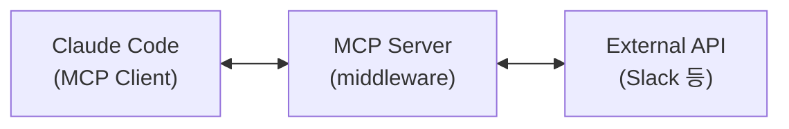
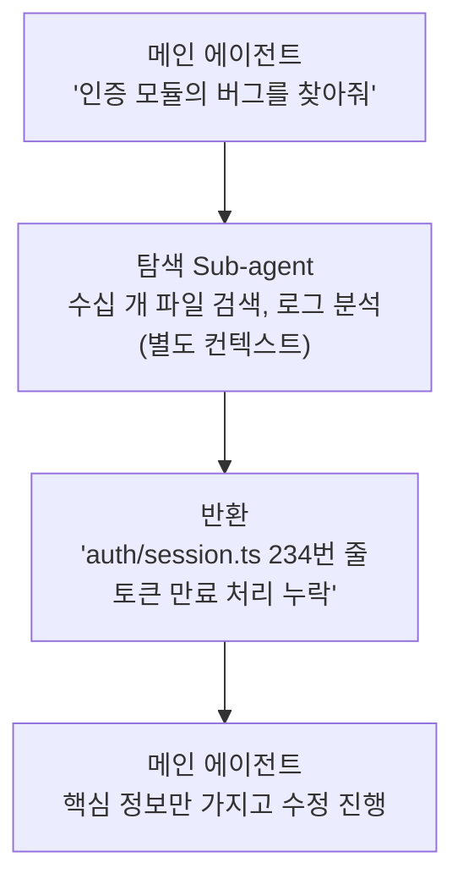
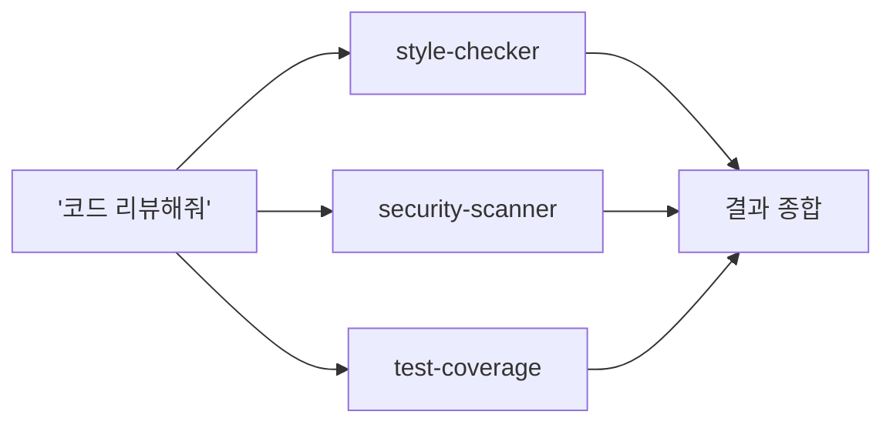
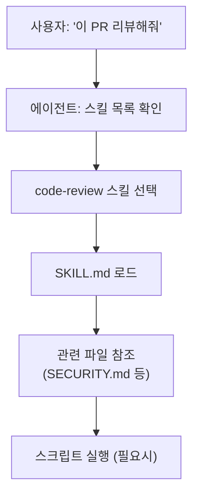
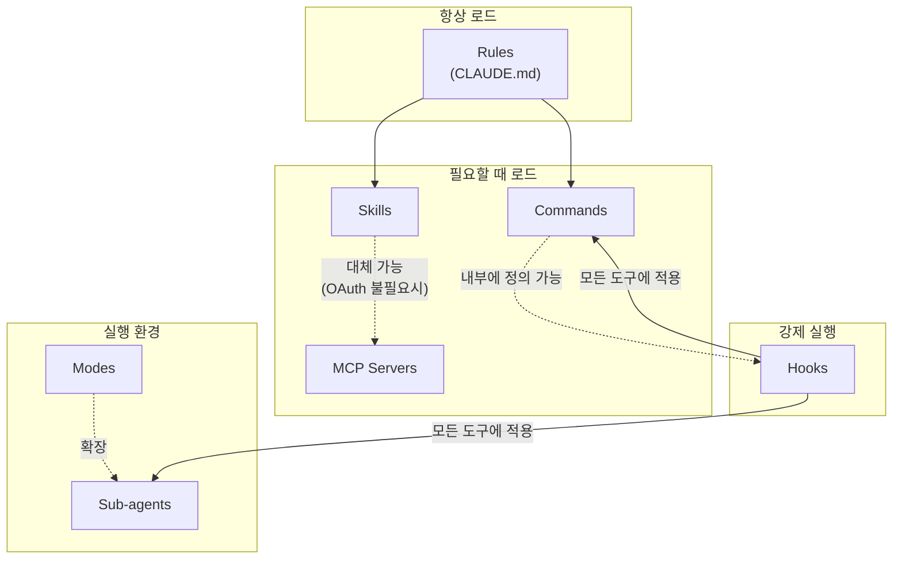
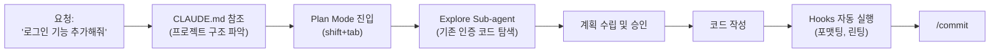
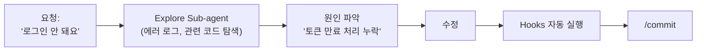
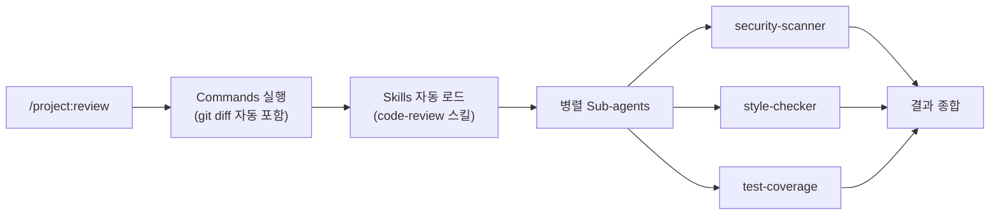
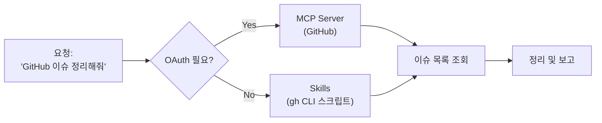

## Table of Contents

## 들어가며

이 글은 [leerob 채널의 영상](https://www.youtube.com/watch?v=L_p5GxGSB_I)을 번역하고, 내가 아는 선에서 내용을 덧붙이고 링크를 추가한 것이다. 원본과 다소 다를 수 있으니 참고하자.

코딩 에이전트를 제대로 활용하려면 몇 가지 핵심 개념을 이해해야 한다. Rules, Commands, MCP, Sub-agents, Modes, Hooks, Skills, Plugins - 이름만 들어도 복잡해 보이지만, 각각이 해결하는 문제를 파악하면 쉽게 이해할 수 있다.

## 먼저 배워야 할 것들

모든 개념을 한 번에 익힐 필요는 없다. 다음 순서로 접근하면 된다.

**1단계: CLAUDE.md (Rules)**

- 가장 먼저 설정해야 할 것
- 프로젝트 구조, 코딩 컨벤션, 자주 쓰는 명령어를 적어두면 에이전트가 훨씬 똑똑해진다

**2단계: Hooks**

- 파일 저장 후 자동 포맷팅, 린팅 같은 "반드시 해야 하는 것"을 강제
- 에이전트가 잊어버리는 것을 방지

**3단계: Commands**

- 반복되는 워크플로우가 생기면 그때 만들어도 늦지 않다

**4단계: Sub-agents, MCP, Skills**

- 복잡한 작업이 필요해질 때 배우면 된다
- 처음부터 다 쓰려고 하면 오히려 복잡해진다

---

## 1. Rules (규칙) - 정적 컨텍스트

### 정의

Rules는 **모든 대화에 항상 포함되는 정적 컨텍스트**다. 에이전트가 작업을 시작할 때 자동으로 로드되어 프로젝트의 맥락, 코딩 규칙, 비즈니스 요구사항 등을 제공한다.

### 등장 배경

초기 AI 코딩 에이전트들은 환각(hallucination) 문제가 심했다. 모델이 코드베이스의 구조를 잘못 이해하거나, 존재하지 않는 API를 사용하거나, 팀의 코딩 컨벤션을 무시하는 경우가 빈번했다.

Rules 파일은 이러한 문제를 해결하기 위해 등장했다. 매 대화마다 동일한 정보를 반복해서 입력할 필요 없이, 한 번 작성해두면 모든 세션에서 자동으로 참조된다.

### 발전 과정

```
단일 rules 파일 → 여러 sub-files로 분리 → 결국 하나의 정적 컨텍스트로 병합
```

초기에는 하나의 파일이었지만, 프로젝트가 복잡해지면서 여러 파일로 분리되었다. 하지만 결국 모든 파일이 하나의 컨텍스트로 합쳐져서 매 대화에 포함된다.

### Claude Code에서의 구현: CLAUDE.md

Claude Code에서는 `CLAUDE.md` 파일이 이 역할을 한다.

**파일 위치와 계층 구조:**

```
your-project/
├── CLAUDE.md                    # 프로젝트 루트 (전체 적용)
├── .claude/
│   ├── CLAUDE.md               # 프로젝트 설정
│   └── rules/
│       ├── code-style.md       # 코드 스타일 규칙
│       ├── testing.md          # 테스트 규칙
│       └── security.md         # 보안 규칙
├── frontend/
│   └── CLAUDE.md               # 하위 디렉토리 (이 폴더에서만 적용)
└── CLAUDE.local.md             # 개인 설정 (.gitignore에 추가)
```

**CLAUDE.md 예시:**

```markdown
# Project Overview

Next.js 15 기반 핀테크 애플리케이션. PostgreSQL + Prisma 사용.

## Commands

- `pnpm dev`: 개발 서버 시작
- `pnpm test`: 테스트 실행
- `pnpm lint`: ESLint + Prettier 검사

## Code Style

- TypeScript strict 모드 사용
- 함수형 컴포넌트 + React hooks만 사용
- 모든 API 응답에 Zod 스키마 적용

## File Boundaries

- Safe to edit: /src/, /tests/
- Never touch: /node_modules/, /.env\*
```

### 핵심 원칙

**최소한의 고품질 컨텍스트만 포함하자.** 모든 대화에 포함되기 때문에 불필요한 정보는 토큰 낭비이자 성능 저하의 원인이 된다.

연구에 따르면 최신 LLM은 약 150-200개의 지시사항을 일관되게 따를 수 있다. Claude Code의 시스템 프롬프트 자체가 이미 약 50개의 지시사항을 포함하고 있으므로, CLAUDE.md에는 정말 필요한 것만 넣어야 한다.

**살아있는 문서로 관리하자.** 에이전트가 실수할 때마다 해당 내용을 규칙에 추가한다. PR 리뷰에서 "@cursor 이거 규칙에 추가해줘"라고 하면 에이전트가 자동으로 업데이트한다.

### 공식 문서

- [Claude Code Memory 문서](https://docs.anthropic.com/en/docs/claude-code/memory)
- [Best Practices](https://www.anthropic.com/engineering/claude-code-best-practices)

---

## 2. Commands / Slash Commands (명령어)

### 정의

Commands는 **반복적으로 사용하는 프롬프트를 패키징해서 필요할 때 실행하는 워크플로우**다. `/`로 시작하는 명령어를 입력하면 미리 정의된 프롬프트가 실행된다.

### 등장 배경

코딩 에이전트를 사용하다 보면 동일한 패턴의 요청을 반복하게 된다. "코드 리뷰해줘", "테스트 작성해줘", "커밋하고 PR 열어줘" 같은 요청을 매번 상세하게 작성하는 것은 비효율적이다.

Commands는 이런 반복 작업을 한 번의 명령어로 실행할 수 있게 해준다. 팀과 공유할 수 있고, Git에 저장할 수 있다.

### Rules와의 차이점

| 구분          | Rules                 | Commands               |
| ------------- | --------------------- | ---------------------- |
| 적용 시점     | 모든 대화에 항상 포함 | 명시적으로 호출할 때만 |
| 목적          | 컨텍스트 제공         | 워크플로우 실행        |
| 컨텍스트 영향 | 항상 토큰 소비        | 호출 시에만 토큰 소비  |

### Claude Code에서의 구현

**파일 위치:**

```
your-project/
├── .claude/
│   └── commands/
│       ├── review.md           # /project:review
│       ├── commit.md           # /project:commit
│       └── deploy/
│           └── staging.md      # /project:deploy:staging

~/.claude/
└── commands/
    └── my-workflow.md          # /user:my-workflow (모든 프로젝트에서 사용)
```

**명령어 파일 예시 (.claude/commands/review.md):**

```markdown
---
description: 코드 변경사항 리뷰
argument-hint: [file-path]
allowed-tools: Read, Grep, Glob, Bash(git diff:*)
---

## 리뷰 대상

!`git diff --name-only HEAD~1`

## 변경 내역

!`git diff HEAD~1`

## 리뷰 체크리스트

1. 코드 품질 및 가독성
2. 보안 취약점
3. 성능 영향
4. 테스트 커버리지
5. 문서화 완성도

$ARGUMENTS 파일에 집중해서 검토해주세요.
```

**사용법:**

```bash
# 입력창에서
/project:review src/auth/login.ts

# 또는 대화 중 아무 위치에서나 / 입력
```

### 고급 기능

**동적 인자 처리:**

```markdown
---
argument-hint: [pr-number] [priority] [assignee]
---

PR #$1을 $2 우선순위로 리뷰하고 $3에게 할당해주세요.
```

**커맨드 내 훅 정의:**

```markdown
---
description: 스테이징 배포
hooks:
  PreToolUse:
    - matcher: 'Bash'
      hooks:
        - type: command
          command: './scripts/validate-deploy.sh'
          once: true
---

현재 브랜치를 스테이징에 배포해주세요.
```

### 사용 권장 사항

- 단순하게 유지하자. 복잡한 커맨드 목록은 안티패턴이다.
- 진짜 반복되는 작업에만 사용하자.
- 워크플로우 오케스트레이션은 Commands가 아닌 Skills나 Sub-agents로 처리하자.

### 공식 문서

- [Slash Commands 문서](https://docs.anthropic.com/en/docs/claude-code/slash-commands)

---

## 3. MCP Servers (Model Context Protocol)

### 정의

MCP(Model Context Protocol)는 **AI 에이전트에게 외부 도구와 데이터 소스에 대한 접근 권한을 제공하는 오픈 소스 표준**이다. MCP 서버는 에이전트가 사용할 수 있는 도구(tools), 프롬프트(prompts), 리소스(resources)를 노출한다.

### 등장 배경

초기 에이전트는 파일 읽기/쓰기, 셸 명령 실행 같은 기본 도구만 가지고 있었다. 하지만 실제 개발 워크플로우에서는 Slack 메시지 읽기, Jira 이슈 생성, GitHub PR 관리, 데이터베이스 쿼리 같은 외부 시스템과의 연동이 필요하다.

MCP는 이런 서드파티 도구를 에이전트에 노출시키는 표준화된 방법을 제공한다. OAuth 인증도 지원하므로 보안이 중요한 엔터프라이즈 환경에서도 사용할 수 있다.

### 기본 vs 서드파티 도구

| 구분                        | 예시                                               |
| --------------------------- | -------------------------------------------------- |
| **기본 도구 (First-party)** | 파일 읽기/쓰기, 셸 명령, 코드 검색                 |
| **MCP 도구 (Third-party)**  | Slack, GitHub, Jira, Notion, PostgreSQL, Sentry 등 |

### 아키텍처



Claude Code는 MCP 클라이언트이자 서버로 동작할 수 있다. 여러 MCP 서버에 동시 연결이 가능하다.

### Claude Code에서 MCP 설정

**CLI를 통한 추가:**

```bash
# HTTP 서버 연결
claude mcp add --transport http notion https://mcp.notion.com/mcp

# 환경 변수와 함께
claude mcp add github \
  -e GITHUB_PERSONAL_ACCESS_TOKEN=ghp_xxx \
  -- docker run -i --rm -e GITHUB_PERSONAL_ACCESS_TOKEN ghcr.io/github/github-mcp-server

# 서버 목록 확인
claude mcp list

# 서버 상태 확인 (Claude Code 내에서)
/mcp
```

**설정 파일을 통한 추가 (.mcp.json):**

```json
{
  "mcpServers": {
    "github": {
      "command": "npx",
      "args": ["-y", "@modelcontextprotocol/server-github"],
      "env": {
        "GITHUB_PERSONAL_ACCESS_TOKEN": "ghp_xxx"
      }
    },
    "postgres": {
      "command": "npx",
      "args": ["-y", "@modelcontextprotocol/server-postgres"],
      "env": {
        "DATABASE_URL": "postgresql://..."
      }
    }
  }
}
```

### Scope 옵션

| Scope            | 설명                                           |
| ---------------- | ---------------------------------------------- |
| `local` (기본값) | 현재 프로젝트에서 본인만 사용                  |
| `project`        | 프로젝트의 모든 사람이 사용 (.mcp.json에 저장) |
| `user`           | 모든 프로젝트에서 본인이 사용                  |

### MCP의 단점과 해결책

**문제:** 도구가 많아지면 컨텍스트 사용량이 급격히 증가한다. 10개의 MCP 서버에 각각 10개의 도구가 있으면 100개의 도구 정의가 컨텍스트에 포함된다. 200k 컨텍스트 윈도우가 MCP를 너무 많이 활성화하면 실제로는 70k 정도만 사용 가능해질 수 있다.

**해결책:** 최신 에이전트들은 Skills 패턴에서 배운 최적화를 적용한다. 모든 도구를 항상 로드하는 대신, 실제로 사용할 때만 해당 도구를 로드한다. Cursor와 Claude Code 모두 이 최적화를 구현했다.

**실전 팁:** 설정 파일에 20-30개의 MCP 서버를 등록해두되, 실제로 활성화하는 것은 10개 이하, 활성 도구는 80개 이하로 유지하자. `/mcp` 명령어로 현재 상태를 확인할 수 있다.

**Skills와의 차이:** OAuth가 필요한 경우에만 MCP를 사용하자. 그 외에는 Skills로 대체할 수 있다.

### 주요 MCP 서버 목록

| 서버                                        | 용도                         |
| ------------------------------------------- | ---------------------------- |
| **@modelcontextprotocol/server-github**     | GitHub PR, 이슈, 저장소 관리 |
| **@modelcontextprotocol/server-slack**      | Slack 메시지 읽기/쓰기       |
| **@modelcontextprotocol/server-postgres**   | PostgreSQL 쿼리              |
| **@modelcontextprotocol/server-filesystem** | 로컬 파일 시스템 접근        |
| **Puppeteer MCP**                           | 브라우저 자동화, 스크린샷    |
| **Sentry MCP**                              | 에러 모니터링                |

수백 개의 MCP 서버가 GitHub에서 사용 가능하다.

### 보안 주의사항

MCP 서버는 사용자를 대신해 외부 서비스에 접근한다. 신뢰할 수 없는 서버는 설치하지 말자. 특히 인터넷에서 콘텐츠를 가져오는 서버는 프롬프트 인젝션 위험이 있다.

### 공식 문서

- [Claude Code MCP 문서](https://docs.anthropic.com/en/docs/claude-code/mcp)
- [MCP 공식 사이트](https://modelcontextprotocol.io)
- [MCP 서버 목록](https://github.com/modelcontextprotocol/servers)

---

## 4. Sub-agents (하위 에이전트)

### 정의

Sub-agents는 **특정 유형의 작업을 처리하는 전문화된 AI 어시스턴트**다. 각 서브에이전트는 자체 컨텍스트 윈도우, 커스텀 시스템 프롬프트, 특정 도구 접근 권한, 독립적인 권한 설정을 가진다.

### 등장 배경

복잡한 작업은 많은 컨텍스트를 소비한다. 예를 들어 테스트를 실행하면 출력이 수천 줄이 될 수 있고, 문서를 검색하면 수십 개의 파일 내용이 컨텍스트에 쌓인다. 이 모든 것이 메인 대화에 누적되면 컨텍스트 윈도우가 빠르게 소진된다.

Sub-agents는 이 문제를 해결한다. 테스트 실행이나 문서 검색 같은 작업을 별도의 컨텍스트에서 처리하고, 결과만 메인 대화에 반환한다.

### 왜 Sub-agents가 유용한가?

**컨텍스트 분리:** 탐색(exploration)과 구현(implementation)을 메인 대화에서 분리한다.



**도구 제한:** 특정 서브에이전트에게 허용된 도구만 사용하게 할 수 있다.

```yaml
# 문서 리뷰어: 읽기만 가능, 수정 불가
name: doc-reviewer
tools: Read, Grep
# Edit, Write, Bash 등은 사용 불가
```

**병렬 실행:** 여러 서브에이전트가 동시에 작업할 수 있다.



### Claude Code에서의 구현

**빌트인 서브에이전트:**

| 이름            | 설명                                                     |
| --------------- | -------------------------------------------------------- |
| **Explore**     | 읽기 전용 코드베이스 검색                                |
| **Plan**        | 계획 모드에서 리서치 수행                                |
| **Task** (일반) | 명시적으로 정의하지 않아도 사용 가능한 범용 서브에이전트 |

**커스텀 서브에이전트 정의 (.claude/agents/security-reviewer.md):**

```markdown
---
name: security-reviewer
description: 보안 취약점 분석 전문가. 보안 리뷰 요청 시 사용.
tools: Read, Grep, Glob, Bash(npm audit:*, snyk:*)
model: sonnet
---

당신은 보안 리뷰 전문가입니다. 코드를 분석할 때:

1. OWASP Top 10 취약점 확인
2. 인증/인가 로직 검증
3. 입력 검증 확인
4. 민감 정보 노출 확인
5. 의존성 보안 감사

발견된 모든 취약점에 대해:

- 심각도 (Critical/High/Medium/Low)
- 위치 (파일명, 라인 번호)
- 설명
- 권장 수정 방법

을 제공하세요.
```

### 서브에이전트 호출 방식

**자동 호출:** Claude가 작업 설명(description)을 보고 적절한 서브에이전트를 자동 선택한다.

```
사용자: "이 PR의 보안 취약점을 확인해줘"
Claude: (security-reviewer 서브에이전트 자동 호출)
```

**명시적 호출:**

```
사용자: "security-reviewer 에이전트를 사용해서 인증 모듈을 검토해줘"
```

**병렬 호출:**

```
사용자: "이걸 병렬로 실행해줘" 또는 "리서치 좀 해줘"
```

### 주의사항

**컨텍스트 게이트키핑:** 서브에이전트를 만들면 해당 영역의 컨텍스트가 메인 에이전트에서 숨겨진다. `PythonTests` 서브에이전트를 만들면 메인 에이전트는 테스트 관련 컨텍스트를 직접 볼 수 없다.

**결과 누적:** 여러 서브에이전트가 각각 상세한 결과를 반환하면 메인 컨텍스트가 빠르게 소진될 수 있다.

### 공식 문서

- [Sub-agents 문서](https://docs.anthropic.com/en/docs/claude-code/sub-agents)

---

## 5. Modes (모드)

### 정의

Modes는 **Sub-agent의 확장 개념으로, 지시사항 + 시스템 프롬프트 수정 + UI 변경까지 포함**하는 에이전트 동작 모드다. 특정 작업에 최적화된 환경을 제공한다.

### Sub-agent와의 차이점

| 구분            | Sub-agent     | Mode                     |
| --------------- | ------------- | ------------------------ |
| 시스템 프롬프트 | 자체 프롬프트 | 메인 프롬프트 수정 가능  |
| UI              | 변경 없음     | UI 커스터마이징 가능     |
| 도구            | 제한 가능     | 제한 + 새 도구 추가 가능 |
| 컨텍스트        | 별도          | 메인과 공유              |
| 리마인더        | 없음          | 모드 유지 리마인더 포함  |

### 모드가 할 수 있는 것들

1. **시스템 프롬프트 수정**: 현재 사용 가능한 도구와 모드를 알려줌
2. **새 도구 접근 권한**: 계획(plan)을 생성하고 수정하는 도구 추가
3. **GUI 변경**: 특화된 인터페이스 제공
4. **리마인더**: 현재 모드와 집중해야 할 작업을 상기시킴

### 예시: Plan Mode

Claude Code의 Plan Mode는 코드 작성 전에 계획을 수립하는 모드다.

- 파일 수정 도구는 비활성화
- 계획 생성/수정 도구만 활성화
- "현재 계획 모드입니다. 코드 작성 전에 계획을 확정하세요" 리마인더
- 계획 확정 시 일반 모드로 자동 전환

### 한계

모드를 사용해도 여전히 **비결정적(non-deterministic) 시스템**이다. 모드가 더 신뢰성 있고 발견하기 쉬운 기능을 제공하지만, 예상치 못한 동작이 발생할 수 있다.

**결정적 동작이 필요하면 Hooks를 사용하자.**

---

## 6. Hooks (훅)

### 정의

Hooks는 **에이전트 라이프사이클의 특정 시점에 100% 결정적으로 실행되는 코드**다. 에이전트의 비결정적 특성에 결정적 동작을 주입할 수 있다.

### 등장 배경

에이전트에게 "커밋 전에 린트 실행해"라고 요청해도 가끔 잊어버린다. "파일 수정 후 포맷팅해"라고 해도 일관되지 않다.

Hooks는 이런 "반드시 해야 하는" 작업을 강제한다. 에이전트가 잊어버리거나 무시할 수 없다.

### 사용 사례

**매 실행마다 컨텍스트 주입:**

- 세션 시작 시 git status 추가
- 현재 시간 정보 주입

**도구 실행 전/후 처리:**

- 파일 수정 전: 유효성 검사
- 파일 수정 후: Prettier 포맷팅, ESLint 검사, 타입 체크

**세션 종료 후 처리:**

- 대화 로그 데이터베이스 저장
- 자동 커밋

### 훅 종류

| 이벤트              | 시점               | 사용 예                               |
| ------------------- | ------------------ | ------------------------------------- |
| `SessionStart`      | 세션 시작/재개     | 개발 컨텍스트 로드, 환경 설정         |
| `UserPromptSubmit`  | 사용자 입력 직후   | 입력 검증, 컨텍스트 주입, 보안 필터링 |
| `PreToolUse`        | 도구 실행 전       | 명령어 검증, 위험 명령 차단           |
| `PostToolUse`       | 도구 실행 후       | 포맷팅, 린팅, 결과 로깅               |
| `PermissionRequest` | 권한 요청 시       | 자동 승인/거부 결정                   |
| `Stop`              | 에이전트 응답 완료 | 자동 커밋, 완료 알림                  |
| `SubagentStop`      | 서브에이전트 완료  | 결과 처리, 다음 단계 트리거           |
| `PreCompact`        | 컴팩션 전          | 트랜스크립트 백업                     |
| `Notification`      | 알림 발생 시       | 커스텀 알림 처리                      |

### Claude Code에서의 구현

**설정 파일 위치:**

- 사용자 설정: `~/.claude/settings.json`
- 프로젝트 설정: `.claude/settings.json`

**설정 예시:**

```json
{
  "hooks": {
    "PostToolUse": [
      {
        "matcher": "Write|Edit",
        "hooks": [
          {
            "type": "command",
            "command": "npx prettier --write \"$CLAUDE_FILE_PATH\""
          },
          {
            "type": "command",
            "command": "npx eslint --fix \"$CLAUDE_FILE_PATH\""
          }
        ]
      }
    ],
    "PreToolUse": [
      {
        "matcher": "Bash",
        "hooks": [
          {
            "type": "command",
            "command": "python3 $CLAUDE_PROJECT_DIR/scripts/validate-command.py"
          }
        ]
      }
    ],
    "Stop": [
      {
        "matcher": "*",
        "hooks": [
          {
            "type": "command",
            "command": "$CLAUDE_PROJECT_DIR/scripts/auto-commit.sh"
          }
        ]
      }
    ]
  }
}
```

### 훅의 의사결정 제어

훅은 JSON 출력을 통해 에이전트 동작을 제어할 수 있다:

```python
#!/usr/bin/env python3
import json
import sys

input_data = json.load(sys.stdin)
tool_name = input_data.get("tool_name", "")
tool_input = input_data.get("tool_input", {})

# 위험한 명령 차단
if tool_name == "Bash":
    command = tool_input.get("command", "")
    if "rm -rf" in command or ".env" in command:
        output = {
            "decision": "block",
            "reason": "위험한 명령이 감지되었습니다"
        }
        print(json.dumps(output))
        sys.exit(2)  # 차단

# 문서 파일 자동 승인
if tool_name == "Read":
    file_path = tool_input.get("file_path", "")
    if file_path.endswith((".md", ".txt", ".json")):
        output = {
            "decision": "approve",
            "reason": "문서 파일 자동 승인"
        }
        print(json.dumps(output))
        sys.exit(0)

sys.exit(0)  # 정상 진행
```

### 보안 주의사항

- 훅은 시스템에서 임의의 셸 명령을 자동 실행한다
- 설정 파일의 직접 수정은 `/hooks` 메뉴에서 검토 후에야 적용된다
- 입력 검증, 경로 이스케이프, 민감 파일 제외를 철저히 하자

### 공식 문서

- [Hooks 문서](https://docs.anthropic.com/en/docs/claude-code/hooks)

---

## 7. Skills (스킬)

### 정의

Skills는 **지시사항, 스크립트, 리소스를 패키징한 폴더로, 에이전트가 필요할 때 발견하고 사용할 수 있는 능력 확장 단위**다. Rules와 Commands의 장점을 결합한 동적 컨텍스트다.

### 등장 배경

Rules(정적 컨텍스트)와 Commands(워크플로우 실행)는 각각 한계가 있다:

- **Rules**: 모든 대화에 포함되어 토큰 낭비
- **Commands**: 명시적 호출 필요, 복잡한 워크플로우 지원 어려움
- **MCP**: OAuth 외에는 오버킬, 컨텍스트 bloat 문제

> **"OAuth 외에는 오버킬"이란?**
>
> MCP 서버를 세팅하려면 서버 프로세스 실행, 설정 파일 작성, 연결 관리 등 복잡한 작업이 필요하다. 단순히 반복 프롬프트를 실행하거나 스크립트를 돌리는 용도라면 이 모든 설정이 과도하다.
> MCP가 진짜 필요한 경우는 OAuth 인증이 필요한 외부 서비스(Slack, GitHub, Notion 등)에 연결할 때다. OAuth 플로우를 직접 구현하는 건 까다롭고, MCP가 이걸 표준화해서 처리해주기 때문이다.
> OAuth가 필요 없는 단순 작업이라면 Skills로 충분하다.

> **"컨텍스트 bloat 문제"란?**
>
> MCP 서버를 연결하면 해당 서버가 제공하는 모든 도구 정의가 컨텍스트에 포함된다. 예를 들어:
>
> - GitHub MCP: 20개 도구 (create_issue, list_prs, merge_pr...)
> - Slack MCP: 15개 도구 (send_message, list_channels...)
> - Notion MCP: 25개 도구
>
> 이렇게 3개만 연결해도 60개의 도구 정의가 매 대화에 포함된다. 실제로 사용하는 건 1-2개뿐인데도. 이게 "bloat"다.

Skills는 이 모든 것을 해결한다:

- 필요할 때만 로드 (Rules처럼 항상 포함 X)
- 에이전트가 자동으로 적절한 스킬 선택 (Commands처럼 명시적 호출 불필요)
- 오픈 스탠다드로 여러 에이전트에서 사용 가능

### Rules vs Commands vs Skills

| 특성           | Rules     | Commands            | Skills                   |
| -------------- | --------- | ------------------- | ------------------------ |
| 로드 시점      | 항상      | 명시적 호출         | 필요할 때 자동           |
| 컨텍스트 영향  | 항상 소비 | 호출 시 소비        | 사용 시에만 소비         |
| 발견 방식      | N/A       | `/` 입력            | 에이전트 자동 판단       |
| 포함 가능 요소 | 텍스트    | 텍스트 + 메타데이터 | 텍스트 + 스크립트 + 에셋 |
| 공유 범위      | 프로젝트  | 프로젝트/사용자     | 에코시스템 전체          |

### 스킬의 구조

```
skills/
├── code-review/
│   ├── SKILL.md              # 스킬 정의 (필수)
│   ├── SECURITY.md           # 보안 체크리스트
│   ├── PERFORMANCE.md        # 성능 패턴
│   ├── STYLE.md              # 스타일 가이드
│   └── scripts/
│       └── run-linters.sh    # 실행 가능한 스크립트
│
├── docx/
│   ├── SKILL.md
│   └── scripts/
│       ├── pack.py
│       └── unpack.py
│
└── frontend-design/
    ├── SKILL.md
    ├── examples/
    │   └── landing-page.html
    └── assets/
        └── design-tokens.json
```

### SKILL.md 형식

```markdown
---
name: code-review
description: 코드 리뷰 전문가. 보안, 성능, 스타일 검토 시 사용.
metadata:
  category: development
  tags: [review, quality]
---

# Code Review Skill

이 스킬은 코드 리뷰를 위한 종합적인 가이드를 제공합니다.

## 사용법

코드 리뷰 요청 시 자동으로 활성화됩니다.

## 체크리스트

1. @SECURITY.md 참조하여 보안 검토
2. @PERFORMANCE.md 참조하여 성능 검토
3. @STYLE.md 참조하여 스타일 검토

## 스크립트

린터 실행: `./scripts/run-linters.sh`
```

### 스킬 사용 흐름



### 생태계

Skills는 **오픈 스탠다드**다. Anthropic이 개발하고 공개했으며, 다양한 에이전트 제품에서 채택되었다:

- Claude Code
- Cursor
- GitHub Codex
- Windsurf
- VS Code Copilot
- 그 외 MCP 호환 클라이언트

### 공식 문서

- [Agent Skills 공식 사이트](https://agentskills.io)
- [Skills 스펙](https://agentskills.io/specification)
- [Anthropic 공식 Skills](https://github.com/anthropics/skills)

---

## 8. Plugins (플러그인)

### 정의

Plugins는 **도구, 스킬, MCP, 훅을 패키징해서 쉽게 설치할 수 있게 만든 확장 시스템**이다. 복잡한 설정 없이 마켓플레이스에서 설치하면 바로 사용할 수 있다.

### 등장 배경

MCP 서버나 스킬을 직접 설정하려면 설정 파일 수정, 환경 변수 설정, 의존성 설치 등 번거로운 과정이 필요하다. Plugins는 이런 복잡한 설정을 추상화해서 한 번의 설치로 모든 것을 자동으로 구성한다.

### 플러그인 유형

| 유형 | 설명 | 예시 |
| --- | --- | --- |
| **Skill + MCP 조합** | 스킬과 MCP를 함께 패키징 | firecrawl, supabase |
| **LSP 플러그인** | 언어 서버 연동 | typescript-lsp, pyright-lsp |
| **Hooks + Tools** | 훅과 도구 번들 | hookify |
| **검색 도구** | 향상된 검색 기능 | mgrep |

### 주요 플러그인

**LSP 플러그인:**

IDE 없이 터미널에서 Claude Code를 자주 사용한다면 LSP 플러그인이 유용하다. 실시간 타입 체킹, go-to-definition, 자동 완성을 제공한다.

```bash
# 유용한 LSP 플러그인
typescript-lsp@claude-plugins-official  # TypeScript 지원
pyright-lsp@claude-plugins-official     # Python 타입 체킹
```

**hookify:**

JSON을 직접 작성하는 대신 대화형으로 훅을 만들 수 있다.

```
/hookify "파일 저장 후 prettier 실행해줘"
```

**mgrep:**

ripgrep보다 강력한 검색 도구. 로컬 검색과 웹 검색을 모두 지원한다.

```bash
mgrep "function handleSubmit"           # 로컬 검색
mgrep --web "Next.js 15 app router"     # 웹 검색
```

### 플러그인 설치

```bash
# 마켓플레이스 추가
claude plugin marketplace add https://github.com/mixedbread-ai/mgrep

# Claude Code 내에서
/plugins  # 플러그인 목록 확인 및 설치
```

### 주의사항

MCP와 마찬가지로 **컨텍스트 윈도우에 영향**을 준다. 필요한 플러그인만 활성화하고, 사용하지 않는 것은 비활성화하자.

### 공식 문서

- [Plugins 문서](https://docs.anthropic.com/en/docs/claude-code/plugins)

---

## 9. 개념들의 상호 관계

지금까지 8가지 개념을 살펴봤다. 이들은 독립적으로 존재하는 게 아니라 서로 연결되어 있다.

### 관계 다이어그램



### Commands 안에서 Hooks 정의하기

Commands 파일 안에서 해당 커맨드 전용 Hooks를 정의할 수 있다.

```markdown
---
description: 프로덕션 배포
hooks:
  PreToolUse:
    - matcher: 'Bash'
      hooks:
        - type: command
          command: './scripts/check-env.sh'
  PostToolUse:
    - matcher: 'Bash'
      hooks:
        - type: command
          command: './scripts/notify-slack.sh'
---

프로덕션 환경에 배포해주세요.
```

이렇게 하면 `/project:deploy` 커맨드를 실행할 때만 이 Hooks가 적용된다.

### Skills vs MCP: 언제 뭘 쓸까?

| 상황                             | 선택                         |
| -------------------------------- | ---------------------------- |
| Slack, GitHub 등 OAuth 인증 필요 | **MCP**                      |
| 단순 스크립트 + 지시사항 조합    | **Skills**                   |
| 외부 API 호출 (인증 없음)        | **Skills** (스크립트로 curl) |
| 팀/커뮤니티와 공유               | **Skills** (오픈 스탠다드)   |
| 실시간 데이터 스트리밍           | **MCP**                      |

대부분의 경우 Skills로 충분하다. MCP는 OAuth가 필요하거나, 실시간 양방향 통신이 필요할 때만 사용하자.

### Sub-agents vs Modes: 언제 뭘 쓸까?

| 상황                                            | 선택                     |
| ----------------------------------------------- | ------------------------ |
| 컨텍스트를 분리하고 싶다                        | **Sub-agents**           |
| 메인 컨텍스트를 유지하면서 도구만 제한하고 싶다 | **Modes**                |
| 병렬로 여러 작업 실행                           | **Sub-agents**           |
| UI/리마인더 커스터마이징                        | **Modes**                |
| 읽기 전용 탐색 작업                             | **Sub-agents** (Explore) |

---

## 10. 실제 워크플로우 예시

개념을 알았으니 실제로 어떻게 조합해서 쓰는지 살펴보자.

### 새 기능 개발하기



**단계별 설명:**

1. **CLAUDE.md 자동 로드**: 프로젝트 구조, 코딩 컨벤션 파악
2. **Plan Mode** (`shift+tab`): 코드 작성 전에 계획 수립
3. **Explore Sub-agent**: 기존 코드 탐색 (메인 컨텍스트 오염 방지)
4. **코드 작성**: 계획대로 구현
5. **Hooks 자동 실행**: 파일 저장 시 Prettier, ESLint 자동 적용
6. **/commit**: 커밋 메시지 자동 생성

### 버그 수정하기



**핵심 포인트:**

- Explore Sub-agent가 수십 개 파일을 뒤져도 메인 컨텍스트는 깔끔하게 유지
- 원인만 요약해서 반환하므로 수정에 집중 가능

### 코드 리뷰하기



**구성 요소 조합:**

- **Commands**: 반복되는 리뷰 워크플로우 단축
- **Skills**: 리뷰 체크리스트와 가이드라인 제공
- **Sub-agents**: 보안, 스타일, 테스트를 병렬로 검사

### 외부 서비스 연동하기



**선택 기준:**

- GitHub API를 OAuth로 인증해야 한다면 → MCP
- `gh` CLI가 이미 인증되어 있다면 → Skills (더 간단)

---

## 11. 토큰과 비용 관점

코딩 에이전트는 토큰을 소비한다. 각 개념이 토큰에 미치는 영향을 이해하면 비용을 최적화할 수 있다.

### 개념별 토큰 소비

| 개념           | 토큰 소비 시점          | 영향도                     |
| -------------- | ----------------------- | -------------------------- |
| **Rules**      | 매 대화 시작            | 🔴 높음 (항상 포함)        |
| **Commands**   | 호출 시                 | 🟡 중간                    |
| **MCP**        | 도구 정의 로드 시       | 🔴 높음 (연결된 모든 도구) |
| **Sub-agents** | 실행 시 (별도 컨텍스트) | 🟢 낮음 (메인에 영향 적음) |
| **Modes**      | 모드 전환 시            | 🟡 중간                    |
| **Hooks**      | 실행 시                 | 🟢 낮음 (결과만 반환)      |
| **Skills**     | 필요할 때만             | 🟢 낮음                    |

### 비용 최적화 팁

**1. CLAUDE.md 다이어트**

```markdown
# ❌ 나쁜 예: 너무 장황함

이 프로젝트는 2024년 1월에 시작되었으며,
Next.js 15를 사용하고 있습니다.
우리 팀은 총 5명이며...

# ✅ 좋은 예: 핵심만

Next.js 15 + Prisma + PostgreSQL

- pnpm dev / test / lint
- TypeScript strict
```

**2. MCP 서버 최소화**

```json
// ❌ 나쁜 예: 안 쓰는 서버도 연결
{
  "mcpServers": {
    "github": { ... },
    "slack": { ... },
    "notion": { ... },
    "jira": { ... },
    "linear": { ... }
  }
}

// ✅ 좋은 예: 실제로 쓰는 것만
{
  "mcpServers": {
    "github": { ... }
  }
}
```

**3. Sub-agents로 컨텍스트 분리**

긴 탐색 작업은 Sub-agent로 분리하면 메인 컨텍스트가 오염되지 않는다.

```
// ❌ 나쁜 예: 메인에서 직접 탐색
"모든 API 엔드포인트를 찾아서 정리해줘"
→ 수십 개 파일 내용이 메인 컨텍스트에 쌓임

// ✅ 좋은 예: Sub-agent 활용
"Explore 에이전트로 API 엔드포인트 찾아줘"
→ 요약만 메인에 반환
```

**4. /compact 활용**

대화가 길어지면 `/compact` 명령어로 컨텍스트를 압축할 수 있다. 중요한 정보는 유지하면서 토큰을 절약한다.

### 비용 모니터링

Claude Code는 세션 종료 시 토큰 사용량을 보여준다. 정기적으로 확인하면서 어떤 작업이 토큰을 많이 소비하는지 파악하자.

---

## 12. 다른 에이전트와의 비교

Claude Code 외에도 Cursor, Windsurf, GitHub Copilot 등 다양한 코딩 에이전트가 있다. 같은 개념이 다른 이름으로 불리기도 한다.

### 용어 매핑

| Claude Code | Cursor       | Windsurf       | GitHub Copilot                  |
| ----------- | ------------ | -------------- | ------------------------------- |
| CLAUDE.md   | .cursorrules | .windsurfrules | .github/copilot-instructions.md |
| Commands    | -            | -              | -                               |
| MCP         | MCP          | MCP            | -                               |
| Sub-agents  | -            | Cascade        | -                               |
| Hooks       | -            | -              | -                               |
| Skills      | Skills       | Skills         | -                               |

### Claude Code만의 특징

**1. Hooks**

다른 에이전트에는 없는 Claude Code만의 기능이다. 에이전트 동작에 결정적 코드를 주입할 수 있다.

**2. Sub-agents 세분화**

Explore, Plan 등 용도별 빌트인 Sub-agent를 제공한다. 커스텀 Sub-agent도 쉽게 정의할 수 있다.

**3. Commands**

슬래시 커맨드로 워크플로우를 패키징하는 기능이 가장 체계적이다.

**4. 터미널 네이티브**

IDE 플러그인이 아닌 터미널에서 직접 실행된다. SSH 환경, 서버에서도 사용 가능하다.

### Cursor와의 주요 차이

| 항목      | Claude Code     | Cursor                    |
| --------- | --------------- | ------------------------- |
| 실행 환경 | 터미널          | IDE (VS Code 포크)        |
| 모델      | Claude만        | Claude, GPT, 기타         |
| 파일 수정 | 직접 수정       | IDE 내 diff 뷰            |
| 가격      | API 사용량 기반 | 월 구독 ($20/월)          |
| 강점      | 자동화, Hooks   | IDE 통합, 실시간 자동완성 |

### 언제 Claude Code를 쓸까?

- 터미널 작업이 많을 때
- CI/CD, 자동화 파이프라인 구축
- Hooks로 강제 실행이 필요할 때
- SSH/원격 서버 환경
- API 사용량 기반 과금 선호

### 언제 Cursor를 쓸까?

- IDE 통합이 중요할 때
- 실시간 자동완성 활용
- 다양한 모델 선택 필요
- 월 정액제 선호

---

## 13. Tips and Tricks

실전에서 유용한 팁들을 모았다.

### 키보드 단축키

| 단축키 | 기능 |
| --- | --- |
| `Ctrl+U` | 입력 중인 라인 전체 삭제 (백스페이스 연타보다 빠름) |
| `!` | 빠른 bash 명령어 접두사 |
| `@` | 파일 검색 |
| `/` | 슬래시 명령어 시작 |
| `Shift+Enter` | 멀티라인 입력 |
| `Tab` | thinking 표시 토글 |
| `Esc Esc` | Claude 중단 / 코드 복원 |

### 병렬 워크플로우

**/fork - 대화 분기**

겹치지 않는 작업을 병렬로 진행할 때 유용하다. 메시지를 큐에 쌓는 대신 대화를 분기해서 동시에 작업할 수 있다.

```bash
/fork  # 현재 대화를 분기
```

**Git Worktrees - 병렬 Claude 인스턴스**

같은 저장소에서 여러 Claude 인스턴스를 동시에 실행하면 충돌이 발생할 수 있다. Git Worktrees를 사용하면 각 worktree가 독립적인 체크아웃이 되어 충돌을 방지한다.

```bash
git worktree add ../feature-branch feature-branch
# 각 worktree에서 별도의 Claude 인스턴스 실행
```

### tmux로 장시간 명령어 관리

빌드, 테스트 같은 장시간 명령어를 실행할 때 tmux를 사용하면 세션이 유지된다. Claude가 tmux 세션에서 명령어를 실행하면 로그를 실시간으로 모니터링할 수 있다.

```bash
tmux new -s dev           # 새 세션 생성
# Claude가 여기서 명령어 실행
tmux attach -t dev        # 세션에 다시 연결
```

### 유용한 명령어들

| 명령어 | 기능 |
| --- | --- |
| `/rewind` | 이전 상태로 되돌리기 |
| `/statusline` | 브랜치, 컨텍스트 %, todo 등 상태바 커스터마이징 |
| `/checkpoints` | 파일 수준 undo 포인트 |
| `/compact` | 수동으로 컨텍스트 압축 |
| `/mcp` | MCP 서버 상태 확인 |
| `/plugins` | 플러그인 목록 및 관리 |

### 에디터 연동

Claude Code는 터미널에서 실행되지만 에디터와 함께 사용하면 더 효과적이다.

**추천 설정:**

- 화면 분할: 터미널(Claude Code) + 에디터
- Auto-save 활성화: Claude의 파일 읽기가 항상 최신 상태 반영
- 파일 감시(file watcher): 변경된 파일 자동 리로드 확인
- Git 통합: 에디터의 git 기능으로 Claude 변경사항 리뷰 후 커밋

---

## 14. 흔한 문제와 해결법

### "에이전트가 컨텍스트 부족으로 이상한 답을 해요"

컨텍스트가 부족하면 에이전트가 환각을 일으키거나 엉뚱한 답을 한다.

**해결법:**

- CLAUDE.md에 프로젝트 구조와 주요 파일 위치 명시
- "먼저 X 파일을 읽고 작업해줘"라고 명시적으로 지시
- 복잡한 작업은 Sub-agent로 분리해서 컨텍스트 오염 방지

### "에이전트가 지시사항을 자꾸 무시해요"

CLAUDE.md에 적어도 따르지 않는 경우가 있다.

**해결법:**

- Hooks로 강제 (예: 파일 저장 후 반드시 린팅)
- 지시사항을 더 구체적으로 작성
- "절대 하지 마" 대신 "대신 이렇게 해"로 긍정문 사용

### "토큰 사용량이 너무 많아요"

**해결법:**

- CLAUDE.md 다이어트 (정말 필요한 것만)
- 긴 작업은 Sub-agent로 분리
- `/compact` 명령어로 컨텍스트 압축

---

## 15. 실제 .claude 폴더 구조 예시

실제 프로젝트에서 어떻게 구성하는지 예시를 보자.

```
your-project/
├── .claude/
│   ├── settings.json           # Hooks 설정
│   ├── commands/
│   │   ├── commit.md           # /project:commit
│   │   ├── review.md           # /project:review
│   │   └── deploy/
│   │       └── staging.md      # /project:deploy:staging
│   ├── agents/
│   │   └── security-reviewer.md
│   └── rules/
│       ├── code-style.md
│       └── testing.md
├── .mcp.json                   # MCP 서버 설정 (프로젝트 공유용)
├── CLAUDE.md                   # 메인 규칙 파일
└── CLAUDE.local.md             # 개인 설정 (.gitignore)
```

**settings.json 예시:**

```json
{
  "hooks": {
    "PostToolUse": [
      {
        "matcher": "Write|Edit",
        "hooks": [
          {
            "type": "command",
            "command": "npx prettier --write \"$CLAUDE_FILE_PATH\""
          }
        ]
      }
    ]
  }
}
```

---

## 16. 요약

### 개념 정리

코딩 에이전트는 크게 **정적 컨텍스트**, **동적 컨텍스트**, **결정적 실행(Hooks)**로 구성된다.

**📌 정적 컨텍스트 (항상 포함됨)**
- **Rules / CLAUDE.md**: 매 대화에 항상 포함되는 기본 규칙

**⚡ 동적 컨텍스트 (필요할 때만 로드/호출)**
- **Skills**: 특정 작업에서만 로드되는 전문 지식/워크플로우
- **Commands**: 명시적으로 호출하는 명령 모음
- **MCP Servers**: 외부 서비스 연동 (Slack, GitHub, DB 등)
- **Plugins**: 도구/스킬 설치를 쉽게 묶어 제공
- **Sub-agents**: 전문 작업을 위임하는 하위 에이전트
- **Modes**: 작업별 최적화된 동작 모드 (지시사항+UI+시스템 프롬프트)

**🔧 Hooks (결정적 실행)**
- **Hooks**: 도구 실행 전/후, 세션 시작/종료 등 자동화 트리거

### 언제 무엇을 사용할까?

| 상황                                                   | 사용할 것             |
| ------------------------------------------------------ | --------------------- |
| 프로젝트 구조, 코딩 규칙을 알려주고 싶다               | **Rules** (CLAUDE.md) |
| 반복되는 워크플로우를 단축키로 만들고 싶다             | **Commands**          |
| Slack, GitHub, DB 등 외부 서비스에 연결하고 싶다       | **MCP Servers**       |
| MCP나 스킬을 쉽게 설치하고 싶다                        | **Plugins**           |
| 특정 작업을 별도 컨텍스트에서 전문적으로 처리하고 싶다 | **Sub-agents**        |
| 파일 수정 후 항상 포맷팅을 실행하고 싶다               | **Hooks**             |
| 복잡한 도메인 지식 + 스크립트를 패키징하고 싶다        | **Skills**            |

### 팁

1. **Rules는 짧게**: 50개 이하의 핵심 지시사항만
2. **에이전트가 실수하면 Rules에 추가**: 살아있는 문서로 관리
3. **Commands는 단순하게**: 복잡한 오케스트레이션은 Skills로
4. **MCP는 OAuth가 필요할 때만**: 그 외에는 Skills 사용
5. **Hooks로 일관성 확보**: 린팅, 포맷팅, 테스트 자동화
6. **Skills 먼저 읽기**: 작업 시작 전 관련 SKILL.md 확인

## 참고 자료

- [Claude Code 문서](https://docs.anthropic.com/en/docs/claude-code)
- [Anthropic Best Practices](https://www.anthropic.com/engineering/claude-code-best-practices)
- [MCP 공식](https://modelcontextprotocol.io)
- [Agent Skills 공식](https://agentskills.io)
- [awesome-claude-code](https://github.com/hesreallyhim/awesome-claude-code)
