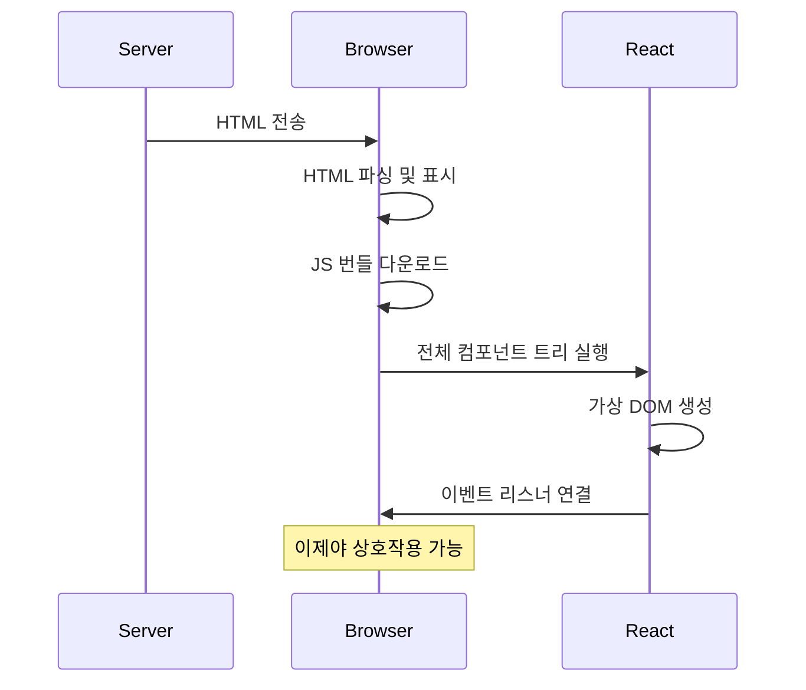
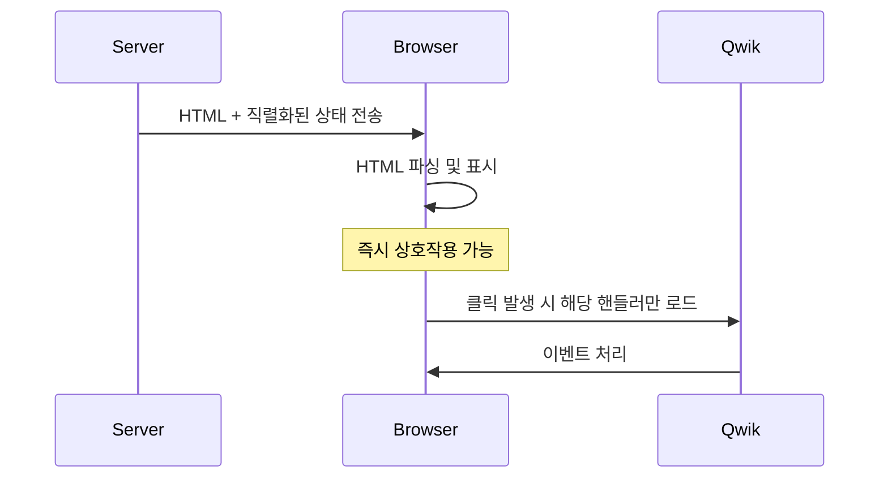
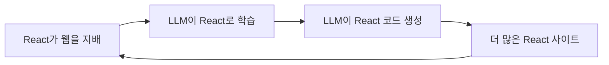

## Table of Contents

## 개요

X나 Reddit의 프론트엔드 커뮤니티를 보면 RSC를 둘러싼 논쟁이 끊이지 않는다. 그중에서도 가장 자주 등장하는 비판은 바로

> "React Server Components는 결국 PHP로 돌아가는 거 아니냐?"

서버에서 컴포넌트를 렌더링한다고? 그거 20년 전 JSP가 하던 거 아닌가? 프론트엔드가 그토록 벗어나려 했던 서버 의존성으로 다시 돌아가는 건 아닐까? 우리가 10년간 SPA를 만들면서 쌓아온 경험은 뭐가 되는 거지?

한편에서는 "역사는 반복된다"며 회의적인 시선을 보내고, 다른 한편에서는 "이건 회귀가 아니라 진화다"라고 반박한다. 솔직히 서버컴포넌트를 처음 접하는 사람들 대부분은 아마도 꽤나 혼란스러웠을 것이다. (나포함)

이 글에서는 RSC가 정말 역사의 반복인지, 아니면 발전인지 살펴본다.

여기서 잠깐, "나선형 발전"이라는 개념을 짚고 가자. 헤겔의 변증법에서 나온 개념인데, 역사는 단순히 원을 그리며 반복되는 게 아니라 **나선(spiral)처럼 한 바퀴 돌 때마다 조금씩 더 높은 곳에 도달한다**는 생각이다. 겉보기엔 같은 위치로 돌아온 것 같지만, 실제로는 이전보다 더 발전한 상태라는 것이다.

RSC가 PHP 시절로 "돌아간" 것처럼 보여도, 정말 같은 자리일까? 아니면 한 바퀴 돌아 더 높은 곳에 도달한 걸까? 이 질문에 답하기 위해 웹 개발의 역사부터 차근차근 살펴보자.

## 웹 개발 아키텍처의 변천사

RSC를 이해하려면 먼저 웹 개발이 어떻게 변해왔는지 돌아볼 필요가 있다.

### 1세대: 정적 HTML (1990년대)

웹의 초창기는 단순했다. 서버에 HTML 파일을 올려두면 브라우저가 그걸 받아서 보여줬다. 동적인 요소는 거의 없었다.

1991년 팀 버너스리가 최초의 웹사이트를 만들었을 때, 그건 그냥 하이퍼링크로 연결된 문서들이었다. "웹 애플리케이션"이라는 개념 자체가 없었다. CGI(Common Gateway Interface)가 등장하면서 Perl 스크립트로 동적 콘텐츠를 만들 수 있게 됐지만, 이건 HTML 파일과 분리된 별도의 프로그램이었다.

이 시대의 핵심 특징:

- **단순함**: 서버는 파일을 전송하는 역할만 했다
- **빠른 응답**: 처리할 로직이 없으니 응답이 빨랐다
- **확장성 제한**: 사용자별 맞춤 콘텐츠가 불가능했다

### 2세대: 서버 사이드 렌더링 - PHP, JSP, ASP (2000년대)

데이터베이스와 연동이 필요해지면서 PHP, JSP, ASP 같은 기술이 등장했다. 서버에서 데이터를 조회하고, HTML을 동적으로 생성해서 클라이언트에 내려보냈다. 이 방식이 아직도 웹의 77%를 차지하는 PHP의 전성기였다.

1995년 PHP가 등장했고, 이듬해 ASP(Active Server Pages)가, 1999년에는 JSP(JavaServer Pages)가 나왔다. "HTML 안에 코드를 넣는다"는 아이디어가 핵심이었다.

```php
<?php
// 전형적인 PHP 시절 코드
$users = $db->query("SELECT * FROM users");
foreach($users as $user) {
    echo "<li>" . $user['name'] . "</li>";
}
?>
```

이 시대에 WordPress, Drupal, Ruby on Rails, Django 같은 프레임워크들이 탄생했다. MVC(Model-View-Controller) 패턴이 표준이 됐고, 템플릿 엔진이 발전했다. 웹이 "문서"에서 "애플리케이션"으로 진화하기 시작한 시점이다.

하지만 치명적인 한계가 있었다.

- **전체 페이지 새로고침**: 사용자가 버튼 하나를 클릭해도 전체 페이지가 다시 로드되었다. 깜빡임과 함께 스크롤 위치도 초기화됐다.
- **서버 의존성**: 모든 인터랙션이 서버를 거쳐야 했다. 네트워크 지연이 곧 UX 저하였다.
- **상태 관리의 어려움**: 페이지가 바뀔 때마다 상태가 초기화되니, 세션과 쿠키에 의존해야 했다.

그래도 이 시대는 웹의 황금기였다. 단순했고, 예측 가능했고, SEO도 자연스럽게 됐다. 구글 크롤러가 HTML을 그대로 읽을 수 있었으니까.

### 3세대: SPA와 클라이언트 사이드 렌더링 (2010년대)

2005년 Gmail이 AJAX의 가능성을 보여줬고, 2006년 jQuery가 DOM 조작을 쉽게 만들었다. 하지만 진짜 혁명은 2010년대에 일어났다.

2010년 AngularJS, 2013년 React, 2014년 Vue.js가 등장하면서 패러다임이 완전히 바뀌었다. "서버는 API만 제공하고, 클라이언트에서 JavaScript로 화면을 그린다"는 SPA(Single Page Application) 시대가 열렸다.

```jsx
// SPA 시대의 전형적인 패턴
function UserList() {
  const [users, setUsers] = useState([])

  useEffect(() => {
    fetch('/api/users')
      .then((res) => res.json())
      .then(setUsers)
  }, [])

  return users.map((user) => <li key={user.id}>{user.name}</li>)
}
```

이 변화의 배경에는 몇 가지 요인이 있었다.

- **모바일 앱의 부상**: iOS와 Android 앱이 보여주는 부드러운 UX가 웹에서도 필요해졌다
- **REST API의 표준화**: 백엔드와 프론트엔드의 분리가 자연스러워졌다
- **프론트엔드 개발의 전문화**: "프론트엔드 개발자"라는 직군이 독립했다
- **npm과 빌드 도구**: Webpack, Babel 등이 복잡한 JavaScript 앱 개발을 가능하게 했다

페이지 전환이 부드러워졌고, 네이티브 앱 같은 사용자 경험을 제공할 수 있게 되었다. React의 컴포넌트 모델은 UI를 조합 가능한 단위로 쪼개는 새로운 사고방식을 가져왔다. 상태 관리, 라우팅, 폼 처리 등 모든 것을 JavaScript로 할 수 있게 됐다.

하지만 새로운 문제가 생겼다. 심각한 문제들이었다.

- **초기 로딩 지연**: 빈 HTML을 받고, JavaScript를 다운로드하고, 파싱하고, 실행하고, API를 호출하고, 다시 렌더링해야 콘텐츠가 보인다. 사용자는 몇 초간 빈 화면이나 스피너만 본다.
- **번들 크기 폭발**: moment.js(300KB), lodash(70KB), 각종 UI 라이브러리... 번들이 수 MB에 달하는 앱도 흔해졌다.
- **SEO 붕괴**: 구글봇이 JavaScript를 실행하기 시작했지만, 완벽하지 않았다. 소셜 미디어 미리보기가 제대로 작동하지 않아 온갖 트릭을 동원해야 했다.

  > 당시 흔히 사용된 트릭들: User-Agent를 감지해서 크롤러에게만 다른 HTML을 보여주는 "클로킹", Prerender.io 같은 서비스로 미리 렌더링된 페이지를 캐싱해두기, `react-helmet`이나 `react-snap`으로 빌드 타임에 메타 태그 주입하기 등이 있었다.

- **워터폴 현상**: 컴포넌트가 마운트되어야 데이터를 요청하므로, 중첩된 컴포넌트에서 순차적 네트워크 요청이 발생했다. 데이터 페칭의 악몽이었다.
- **접근성 저하**: JavaScript가 로드되기 전에는 아무것도 작동하지 않았다. 느린 네트워크 환경에서 UX가 급격히 나빠졌다.

### 3.5세대: SSR과 하이드레이션

SPA의 단점을 보완하기 위해 SSR(Server Side Rendering)이 등장했다. 2016년 Next.js가 출시됐고, Nuxt.js(Vue), Gatsby(React) 등이 뒤따랐다.

아이디어는 간단했다. 서버에서 초기 HTML을 렌더링해서 보내고, 클라이언트에서 JavaScript를 붙여(hydration) 상호작용을 가능하게 한다.

```jsx
// Next.js Pages Router의 getServerSideProps
export async function getServerSideProps() {
  const posts = await fetchPosts()
  return {props: {posts}}
}

export default function Blog({posts}) {
  return (
    <ul>
      {posts.map((post) => (
        <li key={post.id}>{post.title}</li>
      ))}
    </ul>
  )
}
```

이 접근법은 SPA의 문제를 상당 부분 해결했다.

- **빠른 초기 로딩**: 사용자가 즉시 콘텐츠를 볼 수 있다
- **SEO 해결**: 크롤러가 완성된 HTML을 읽을 수 있다
- **SPA의 장점 유지**: 하이드레이션 후에는 SPA처럼 동작한다

하지만 새로운 아이러니가 생겼다.

**하이드레이션의 비용**: 서버에서 HTML을 만들고, 같은 컴포넌트 코드를 클라이언트에서 다시 실행해서 이벤트 핸들러를 붙인다. 결국 같은 일을 두 번 하는 셈이다. 클라이언트는 여전히 전체 React 런타임과 모든 컴포넌트 코드를 다운로드해야 했다.

**불필요한 JavaScript 전송**: 상호작용이 전혀 필요 없는 정적 콘텐츠마저도 하이드레이션 대상이 되었다. 블로그 글 본문처럼 그냥 읽기만 하는 콘텐츠도 JavaScript 번들에 포함됐다.

**데이터 페칭의 제약**: `getServerSideProps`는 페이지 레벨에서만 동작했다. 컴포넌트 단위로 데이터를 페칭하려면 여전히 클라이언트에서 해야 했고, 워터폴 문제가 완전히 사라지지 않았다.

이 시점에서 개발자들은 의문을 품기 시작했다. "서버 렌더링을 하면서 왜 여전히 이렇게 많은 JavaScript를 보내야 하지?"

## React Server Components: 무엇이 다른가?

"그래서 RSC가 PHP랑 뭐가 다른데?"

핵심적인 차이가 몇 가지 있다. 하지만 그 전에, RSC가 해결하려는 근본적인 문제부터 이해할 필요가 있다.

### 두 개의 React: UI = f(data, state)

Dan Abramov는 [The Two Reacts](https://overreacted.io/the-two-reacts/)에서 React가 직면한 딜레마를 이렇게 설명한다.

**클라이언트 React** - `UI = f(state)`:

- `<Counter />`처럼 사용자 상호작용에 즉시 반응해야 하는 컴포넌트
- 상태는 사용자 기기에 있으므로, 네트워크 왕복 없이 즉각적인 응답이 필요하다

**서버 React** - `UI = f(data)`:

- `<PostPreview />`처럼 데이터베이스나 파일 시스템에 접근해야 하는 컴포넌트
- 데이터 소스 근처에서 실행되는 게 효율적이다

문제는 대부분의 앱이 **둘 다 필요**하다는 것이다. 게시글 목록(`data`)을 보여주면서 좋아요 버튼(`state`)도 있어야 한다. 기존에는 이걸 위해 API를 설계하고, 클라이언트에서 데이터를 페칭하고, 로딩 상태를 관리해야 했다.

RSC의 핵심 아이디어는 이 두 세계를 **컴포넌트 레벨에서 자연스럽게 조합**하는 것이다. 진정한 공식은 `UI = f(data, state)`다.

### 1. 컴포넌트 레벨의 서버/클라이언트 분리

PHP나 JSP는 페이지 단위로 서버에서 렌더링했다. 한 페이지 전체가 서버의 영역이었다. 반면 RSC는 **컴포넌트 단위**로 서버와 클라이언트를 선택할 수 있다.

```tsx
// 서버 컴포넌트 - 서버에서만 실행됨
async function ProductDetails({id}: {id: string}) {
  const product = await db.query(`SELECT * FROM products WHERE id = ${id}`)
  return (
    <div>
      <h1>{product.name}</h1>
      <p>{product.description}</p>
      <AddToCartButton product={product} />
    </div>
  )
}

// 클라이언트 컴포넌트 - 상호작용이 필요한 부분만
// prettier-ignore
;'use client'
function AddToCartButton({product}) {
  const [loading, setLoading] = useState(false)

  return <button onClick={() => addToCart(product)}>장바구니에 담기</button>
}
```

`ProductDetails`는 서버에서만 실행되고, 그 안의 `AddToCartButton`만 클라이언트로 전송된다. PHP 시절에는 불가능했던 세밀한 제어다.

### 2. 하이드레이션 없는 서버 컴포넌트

PHP로 만든 페이지도 JavaScript를 추가할 수 있었지만, 서버에서 만든 HTML과 클라이언트 JavaScript는 완전히 별개였다. React SSR에서의 하이드레이션처럼 "같은 컴포넌트를 서버와 클라이언트에서 두 번 실행"하는 개념 자체가 없었다.

RSC의 서버 컴포넌트는 **한 번만 실행**된다. 서버에서 렌더링되고, 그 결과만 클라이언트로 전송된다. 클라이언트에서 다시 실행되지 않으므로 하이드레이션 비용이 없다. 이게 "상호작용이 필요 없는 컴포넌트는 순수 정적 HTML로 유지되어야 한다"는 RSC의 핵심 철학이다.

### 3. 앱 상태 유지

PHP 시절에는 페이지 이동 시 모든 상태가 초기화되었다. 입력 중이던 폼 데이터, 스크롤 위치, 포커스 상태 모두 날아갔다.

RSC는 서버에서 새로운 컴포넌트를 렌더링하더라도 **클라이언트의 앱 상태를 유지**할 수 있다. React의 reconciliation이 서버에서 온 새로운 UI와 기존 클라이언트 상태를 똑똑하게 병합한다.

### 4. 동일한 언어, 통합된 모델

PHP/JSP 시절에는 서버 언어(PHP, Java)와 클라이언트 언어(JavaScript)가 달랐다. 데이터 타입도, 유틸리티 함수도, 유효성 검사 로직도 따로 작성해야 했다.

RSC는 동일한 JavaScript/TypeScript로 서버와 클라이언트 코드를 작성한다. 타입을 공유하고, 유틸리티를 재사용하고, 멘탈 모델을 통일할 수 있다.

### 5. 한 번의 라운드트립으로 모든 데이터 로딩

SPA 시대의 고질적인 문제가 있었다. 컴포넌트가 마운트되어야 데이터를 요청하므로, 중첩된 컴포넌트에서 워터폴이 발생한다.

```tsx
// SPA에서의 워터폴 문제
function PostPage({id}) {
  const [post, setPost] = useState(null)

  useEffect(() => {
    fetchPost(id).then(setPost) // 1번째 요청
  }, [id])

  if (!post) return <Loading />

  return (
    <div>
      <h1>{post.title}</h1>
      <AuthorInfo authorId={post.authorId} /> {/* 2번째 요청 (1번 완료 후) */}
      <Comments postId={id} /> {/* 3번째 요청 (1번 완료 후) */}
    </div>
  )
}
```

클라이언트 → 서버 → 클라이언트 → 서버... 왕복이 반복된다. Dan Abramov는 [One Roundtrip Per Navigation](https://overreacted.io/one-roundtrip-per-navigation/)에서 이 문제를 React 팀이 2010년대 내내 고민했다고 말한다.

RSC의 해결책은 단순하다. **서버에서 모든 데이터를 한 번에 로드**하고, 결과를 클라이언트로 보낸다.

```tsx
// RSC에서는 서버에서 병렬로 데이터 로드
async function PostPage({id}) {
  const [post, author, comments] = await Promise.all([
    getPost(id),
    getAuthor(id),
    getComments(id),
  ])

  return (
    <div>
      <h1>{post.title}</h1>
      <AuthorInfo author={author} />
      <Comments comments={comments} />
    </div>
  )
}
```

클라이언트는 서버에 한 번 요청하고, 서버가 필요한 모든 데이터를 수집해서 렌더링된 결과를 돌려준다. 네트워크 왕복 횟수가 최소화된다.

### 6. "불가능한 컴포넌트"의 가능성

Dan Abramov는 [Impossible Components](https://overreacted.io/impossible-components/)에서 RSC로만 가능한 패턴을 소개한다. 서버의 데이터와 클라이언트의 상호작용을 **하나의 컴포넌트 트리에서 자연스럽게 조합**하는 것이다.

```tsx
// 서버 컴포넌트: 마크다운 파싱 라이브러리는 서버에만 존재
async function BlogPost({slug}) {
  const content = await fs.readFile(`./posts/${slug}.md`, 'utf-8')
  const html = marked.parse(content) // marked는 번들에 포함되지 않음

  return (
    <article>
      <div dangerouslySetInnerHTML={{__html: html}} />
      <LikeButton slug={slug} /> {/* 클라이언트 컴포넌트 */}
    </article>
  )
}
```

`marked` 라이브러리(수십 KB)가 클라이언트 번들에 포함되지 않는다. 서버에서 파싱하고, 결과 HTML만 클라이언트로 전송된다. 이건 기존 SSR에서도 가능했지만, RSC는 이걸 **컴포넌트 단위로 선언적으로** 할 수 있게 해준다.

## 나선형 발전의 증거

기술 산업에서 pendulum swing(진자 운동)은 익숙한 현상이다. 중앙화와 분산화, thin client와 thick client 사이를 오가왔다. 그렇다면 RSC도 그저 서버로 돌아가는 진자의 한 순간에 불과할까?

그렇게 단순하지 않다. 각 진자의 왕복마다 우리는 새로운 지식과 경험을 통합해왔다. RSC는 다음과 같은 진화를 포함한다.

### 이전 세대의 장점 통합

| 시대    | 장점                            | RSC에서의 계승                      |
| ------- | ------------------------------- | ----------------------------------- |
| PHP/JSP | 서버에서 데이터 접근 용이       | async 컴포넌트에서 직접 DB 쿼리     |
| SPA     | 부드러운 페이지 전환, 상태 유지 | 클라이언트 컴포넌트로 상호작용 처리 |
| SSR     | 빠른 초기 로딩, SEO             | 서버 컴포넌트의 기본 렌더링         |

### 이전 세대의 단점 해결

- **PHP의 전체 페이지 새로고침** → 컴포넌트 단위 업데이트
- **SPA의 번들 크기 문제** → 서버 컴포넌트는 번들에 포함되지 않음 (40-60% 감소 가능)
- **SSR의 이중 실행 문제** → 서버 컴포넌트는 한 번만 실행

## 그래서 RSC는 정답인가?

개인적인 생각이지만, RSC가 모든 것을 해결한 은탄환은 아닌 것 같다. 오히려 새로운 문제들을 가져온 측면도 있다. 나선형 발전이라고 했지만, 그 나선이 모든 프로젝트에 적합하지는 않을 수 있다.

### 리액트는 더 이상 가장 빠른 프레임워크가 아니다

RSC를 채택한 Next.js App Router가 성능 면에서 최고인가? 그렇지 않다. [Builder.io의 프레임워크 벤치마크](https://github.com/BuilderIO/framework-benchmarks)를 보면 흥미로운 결과가 나온다.

| 프레임워크 | TTI | FCP | LCP | TBT | Lighthouse | JS 크기 |
| ---------- | --- | --- | --- | --- | ---------- | ------- |
| Qwik | 0.6s | 0.6s | 1.5s | 0ms | 100 | 2 KiB |
| Astro | 0.9s | 0.9s | 1.1s | 0ms | - | 15 KiB |
| Next.js | 1.6s | 0.6s | 1.2s | 10ms | - | 91 KiB |

Qwik은 2KB의 JavaScript만 전송하면서 TTI 0.6초를 달성한다. Next.js는 91KB를 전송하고도 TTI가 1.6초다. Astro는 기본적으로 JavaScript를 전송하지 않고, Qwik은 resumability로 하이드레이션 자체를 없앴다. RSC가 번들 크기를 줄인다고 하지만, 여전히 React 런타임 자체의 오버헤드가 존재한다.

"RSC 덕분에 번들이 40-60% 줄었다"는 말은 맞다. 하지만 그건 "기존 React 앱 대비"일 뿐이다. 애초에 React를 쓰지 않는 선택지와 비교하면 이야기가 달라진다.

### 러닝 커브가 험난하다

2025년 현재, React는 복잡하다. 너무 복잡하다.

```tsx
// 이건 서버에서 실행될까, 클라이언트에서 실행될까?
function MyComponent({data}) {
  const formatted = useMemo(() => formatData(data), [data])
  return <div>{formatted}</div>
}
```

정답: `useMemo`를 썼으니 클라이언트 컴포넌트다. 하지만 파일 상단에 `'use client'`가 없으면? 에러다. 부모 컴포넌트가 클라이언트 컴포넌트면? 이것도 클라이언트다. 혼란스럽다.

서버 컴포넌트와 클라이언트 컴포넌트의 경계, `'use client'`와 `'use server'` 지시자, 직렬화 가능한 props의 제약, Server Actions의 동작 방식... 새로 배워야 할 개념이 산더미다.

주니어 개발자에게 "이 컴포넌트는 서버에서 실행되고, 저 컴포넌트는 클라이언트에서 실행되고, 이 함수는 서버 액션이라서..."를 설명하는 게 쉬운 일이 아니다. React가 "UI 라이브러리"라는 단순한 정체성에서 벗어나 "풀스택 아키텍처"가 되면서 진입 장벽이 높아졌다.

### 성능이 기대만큼 좋지 않다

이론적으로 RSC는 성능 향상을 약속한다. 하지만 현실은 다르다.

- **서버 부하 증가**: 모든 요청마다 서버에서 컴포넌트를 렌더링해야 한다. 트래픽이 많은 서비스에서는 서버 비용이 급증할 수 있다.
- **스트리밍 설계의 복잡성**: RSC는 Suspense와 스트리밍을 통해 점진적 렌더링이 가능하지만, 제대로 설계하지 않으면 오히려 waterfall이 발생할 수 있다.
- **캐싱 복잡성**: 정적 생성(SSG)만큼 단순하지 않다. 무엇을 캐시하고, 언제 재검증할지 매번 고민해야 한다.

솔직히 많은 프로젝트에서 "그냥 SPA + API"가 더 나은 선택일 수 있다. 특히 대시보드, 어드민 패널 같은 SEO가 필요 없는 앱에서는 RSC의 이점이 크지 않다.

### Next.js와의 강결합

개인적으로 가장 우려되는 부분이다. RSC는 React의 기능이지만, 실질적으로 Next.js 없이는 쓰기 어렵다.

React 공식 문서조차 "프레임워크와 함께 사용하라"고 권장한다. Vite로 React 앱을 만들면? RSC 없다. Create React App? 이미 deprecated됐고, RSC 지원 없다. React Router(구 Remix)? [2025년부터 RSC 프리뷰를 지원](https://remix.run/blog/rsc-preview)하기 시작했지만 아직 안정화 단계는 아니다.

```bash
# 사실상 이게 유일한 선택지
npx create-next-app@latest
```

이건 React 생태계의 건강성에 대한 우려로 이어진다. Vercel이라는 단일 기업이 React의 방향성에 너무 큰 영향을 미치고 있다. Next.js의 캐싱 전략이 논란이 되면 React 개발자 전체가 영향을 받는다. Next.js 15에서 캐싱 기본값이 바뀌면서 얼마나 많은 앱이 깨졌는지 생각해보라.

"React를 쓴다"가 "Next.js를 쓴다"와 거의 동의어가 되어가는 현상은 개인적으로 조금 우려스럽다. 선택지가 줄어드는 것은 종속(lock-in)으로 이어질 수 있기 때문이다.

물론 다른 시각도 있다. 요즘 오픈소스 생태계를 보면 자금난과 투자 부족으로 유지보수가 중단되거나 개발자가 번아웃되는 프로젝트가 많다. 그런 상황에서 Vercel처럼 지속적으로 투자하고, React 생태계를 끌고 나가는 조직이 있다는 건 나쁘지 않다. RSC라는 야심찬 실험을 프로덕션 레벨까지 끌어올린 것도 쉬운 일은 아니었을 것이다.

### 디버깅의 어려움

서버에서 실행되는 코드와 클라이언트에서 실행되는 코드가 뒤섞이면서 디버깅이 복잡해졌다.

```tsx
// 이 에러는 어디서 발생한 걸까?
async function ProductPage({id}) {
  const product = await getProduct(id) // 서버
  return <ProductView product={product} /> // 서버
}

// prettier-ignore
;'use client'
function ProductView({product}) {
  const [qty, setQty] = useState(1) // 클라이언트
  // 여기서 에러가 나면... 서버 로그? 브라우저 콘솔?
}
```

에러 스택 트레이스가 서버와 클라이언트를 넘나들고, 어떤 코드가 어디서 실행됐는지 추적하기가 까다롭다. React DevTools도 이 새로운 모델에 완전히 적응하지 못했다.

**Server Actions는 디버깅을 더 어렵게 만든다.** 클라이언트에서 호출하지만 서버에서 실행되는 함수라니, 개념부터 혼란스럽다.

```tsx
'use server'
async function submitOrder(formData: FormData) {
  const items = formData.getAll('items')
  await db.orders.create({items}) // 서버에서 실행
  revalidatePath('/orders')
}

// 클라이언트 컴포넌트에서 호출
// prettier-ignore
;'use client'
function OrderForm() {
  return (
    <form action={submitOrder}>
      {' '}
      {/* 이게 어디서 실행되는 거지? */}
      <button type="submit">주문하기</button>
    </form>
  )
}
```

`submitOrder`에서 에러가 발생하면? 브라우저 콘솔에는 모호한 에러 메시지만 뜨고, 실제 스택 트레이스는 서버 로그에 있다. 브레이크포인트를 어디에 걸어야 할지, 네트워크 탭에서 뭘 봐야 할지 처음엔 감이 안 온다. 기존 REST API는 요청/응답이 명확했는데, Server Actions는 그 경계가 추상화되어 있어서 문제가 생겼을 때 원인을 찾기가 더 어렵다.

## 대안은 있는가? 프레임워크 비교

RSC/Next.js만이 "서버로의 회귀"를 구현한 건 아니다. 다른 프레임워크들은 같은 문제를 어떻게 풀고 있을까?

### Astro: Zero JavaScript by Default

Astro는 완전히 다른 접근법을 취한다. 기본적으로 JavaScript를 전혀 전송하지 않는다.

```jsx
---
// 이 코드는 빌드 시점에 서버에서 실행됨
const posts = await fetchPosts()
---

<ul>
  {posts.map(post => <li>{post.title}</li>)}
</ul>

<!-- 상호작용이 필요한 부분만 "island"로 -->
<LikeButton client:visible />
```

Astro의 "Islands Architecture"는 페이지의 대부분을 정적 HTML로 두고, 상호작용이 필요한 "섬"만 JavaScript로 하이드레이션한다. RSC와 비슷한 목표지만, React에 종속되지 않는다. Vue, Svelte, React 등 어떤 UI 라이브러리든 사용할 수 있다.

**벤치마크 결과**: Astro는 콘텐츠 중심 사이트에서 Next.js를 압도적으로 앞선다. JavaScript가 없으니 당연한 결과다. 2024년 기준 25%의 개발자가 Astro를 사용 중이다.

### Qwik: Resumability로 하이드레이션 자체를 제거

Qwik은 더 급진적이다. 하이드레이션이라는 개념 자체를 없앴다.

#### Hydration vs Resumability

먼저 기존 하이드레이션의 문제를 이해해야 한다. React SSR에서 하이드레이션은 다음과 같이 동작한다.



문제는 **서버에서 이미 한 일을 클라이언트에서 다시 한다**는 것이다. 컴포넌트를 실행하고, 가상 DOM을 만들고, 이벤트 리스너를 연결한다. 페이지가 복잡할수록 이 과정이 오래 걸리고, 그동안 사용자는 화면을 보면서도 클릭할 수 없는 "uncanny valley" 상태에 놓인다.

Qwik의 Resumability는 이 문제를 근본적으로 해결한다.



핵심 차이점은 다음과 같다.

| | Hydration (React) | Resumability (Qwik) |
|---|---|---|
| **초기 JS 실행** | 전체 컴포넌트 트리 | 없음 (0ms) |
| **상호작용 시점** | JS 실행 완료 후 | HTML 로드 즉시 |
| **이벤트 핸들러** | 모두 미리 연결 | 필요할 때 lazy load |
| **상태 복원** | 컴포넌트 재실행 | HTML에서 역직렬화 |

Qwik은 서버에서 렌더링할 때 컴포넌트의 상태와 이벤트 핸들러 위치를 HTML 속성으로 직렬화한다. 클라이언트에서는 이 정보를 읽어서 "재개(resume)"하기만 하면 된다. 사용자가 버튼을 클릭하면 그때서야 해당 이벤트 핸들러 코드만 다운로드하고 실행한다.

```tsx
// Qwik 컴포넌트 - $는 lazy loading 경계를 의미
export const Counter = component$(() => {
  const count = useSignal(0)

  // onClick$: 클릭 시에만 이 핸들러 코드가 로드됨
  return <button onClick$={() => count.value++}>Count: {count.value}</button>
})
```

`$` 접미사가 붙은 함수는 별도의 청크로 분리되어, 실제로 필요할 때만 네트워크를 통해 가져온다. 이것이 Qwik이 초기 JS를 거의 0에 가깝게 유지하는 비결이다.

**벤치마크 결과**: Qwik은 TTI(Time to Interactive) 0.5초, TBT(Total Blocking Time) 0초를 기록한다. Next.js App Router와 비교하면 cold-load 성능에서 거의 항상 Qwik이 이긴다.

### 프레임워크 비교 정리

| 특성                  | Next.js (RSC)                  | Astro                 | Qwik                |
| --------------------- | ------------------------------ | --------------------- | ------------------- |
| **기본 JS 전송**      | React 런타임 필요              | Zero JS               | 최소한의 JS         |
| **하이드레이션**      | 선택적 (클라이언트 컴포넌트만) | 부분적 (Islands)      | 없음 (Resumability) |
| **상호작용성**        | 완전한 React 기능              | 제한적 (Island 단위)  | 완전한 기능         |
| **생태계**            | 가장 큼 (React)                | 다양한 UI 라이브러리  | 성장 중             |
| **적합한 유스케이스** | 풀스택 앱, SaaS                | 콘텐츠 사이트, 블로그 | 성능 최우선 앱      |
| **러닝 커브**         | 높음                           | 낮음                  | 중간                |

벤치마크 결과를 보면, 순수 성능 면에서는 Qwik이나 Astro가 Next.js보다 나은 경우가 많은 것 같다. RSC의 "번들 40% 감소"는 React 앱 기준이라는 점도 고려해야 한다.

## 마이그레이션은?

이론은 그렇다 치고, 실제로 RSC를 도입하면 어떤 일이 벌어질까?

### 마이그레이션의 실상

[State of React 2024 조사](https://2024.stateofreact.com/en-US/conclusion/)에 따르면, React 개발자의 50% 이상이 RSC에 호감을 갖고 있지만, 실제로 사용해본 개발자는 약 29%에 불과하다. 이론적 매력과 실무 도입 사이에 간극이 있다는 뜻이다.

### 흔히 겪는 문제들

**서드파티 라이브러리 호환성**: 많은 인기 라이브러리들이 여전히 클라이언트 중심이다. 서버 컴포넌트 안에서 사용하면 하이드레이션 에러가 터지거나, 온갖 우회 방법을 써야 한다.

```tsx
// 이런 식의 에러를 만나게 된다
// Error: useState can only be used in Client Components.
// Add the "use client" directive to use it.
```

**더 엄격해진 경계**: Next.js에서는 서버 컴포넌트에서 클라이언트 컴포넌트로 함수를 직접 전달하면 [직렬화 문제로 에러가 발생](https://github.com/vercel/next.js/discussions/49625)한다.

```
Error: Functions cannot be passed directly to Client Components
unless you explicitly expose it by marking it with 'use server'.
```

이벤트 핸들러를 props로 전달하는 익숙한 패턴이 작동하지 않아 당황하는 경우가 많다.

**성능 개선 효과는 케이스바이케이스**: React 팀의 초기 탐색 결과에 따르면 번들 크기가 18-29% 감소할 수 있다고 한다. 일부 사례에서는 [최대 62%까지 감소](https://medium.com/@jaivalsuthar/how-i-reduced-our-react-bundle-by-62-a-junior-developers-optimization-journey-e0f5a2ca6ee6)하고 INP가 250ms에서 175ms로 개선된 경우도 있다. 하지만 이런 수치는 앱의 구조와 `'use client'` 적용 방식에 따라 크게 달라질 수 있다.

### 피해야 할 안티패턴

**1. 무작정 'use client' 남발**

RSC가 어렵다고 모든 곳에 `'use client'`를 붙이는 건 최악의 선택이다. 그러면 RSC를 쓰는 의미가 없다.

**2. 동적 서버 컴포넌트가 전체 렌더링을 블로킹**

서버 컴포넌트에서 무거운 데이터 페칭을 하면서 Suspense를 쓰지 않으면, 사용자는 빈 화면을 오래 본다.

```tsx
// 이러면 안 된다
async function SlowPage() {
  const data = await verySlowDatabaseQuery() // 전체 페이지 블로킹
  return <Content data={data} />
}

// 이렇게 해야 한다
async function BetterPage() {
  return (
    <Suspense fallback={<Loading />}>
      <SlowContent />
    </Suspense>
  )
}
```

### 마이그레이션 팁

일반적으로 권장되는 접근법들이다.

- **점진적 마이그레이션**: 한 번에 다 바꾸지 말고, 기능 단위로 나눠서 마이그레이션하는 것이 안전하다
- **읽기 중심 페이지부터**: 블로그, 문서, 상품 목록처럼 상호작용이 적은 페이지에서 RSC의 효과가 크다
- **라이브러리 호환성 확인**: 마이그레이션 전에 주요 서드파티 라이브러리들의 RSC 지원 여부를 체크하는 것이 좋다

## 결론

React Server Components는 PHP/JSP 시절로의 단순한 회귀는 아닌 것 같다. 그렇다고 모든 문제를 해결한 혁명이라고 보기도 어렵다. 개인적으로는 새로운 문제들도 함께 가져왔다고 느낀다.

RSC는 **나선형 발전**의 한 단계다. 서버 렌더링의 장점과 SPA의 장점을 컴포넌트 레벨에서 조합할 수 있게 해준다. 하지만 그 나선을 오르는 데 드는 비용이 만만치 않다. 러닝 커브, 프레임워크 종속, 디버깅 복잡성, 그리고 기대만큼 뛰어나지 않은 성능까지.

"React가 이제 PHP랑 똑같다"는 비판은 다소 과장된 것 같다. 하지만 "RSC가 프론트엔드의 미래"라는 주장에도 동의하기 어렵다. Astro나 Qwik 같은 대안들이 더 나은 성능을 보여주는 경우도 있고, React 없이도 좋은 웹 앱을 만들 수 있다.

개인적인 생각을 정리하면 이렇다.

- **RSC가 적합한 경우**: SEO가 중요하고, 이미 React 생태계에 익숙하며, Next.js 종속을 감수할 수 있는 프로젝트
- **RSC가 과한 경우**: 어드민 대시보드, 내부 도구, SEO가 필요 없는 앱. 그냥 Vite + React SPA가 더 단순하다.
- **아예 다른 선택지**: 콘텐츠 중심 사이트라면 Astro가, 극한의 성능이 필요하다면 Qwik이나 SolidStart가 더 나을 수 있다.

프론트엔드 아키텍처의 진자는 분명 서버 쪽으로 다시 움직이고 있다. 하지만 React/Next.js만이 그 방향의 유일한 답은 아니다. RSC는 한 가지 해법일 뿐이고, 그것도 상당한 트레이드오프를 동반한다.

"모든 프로젝트에 RSC를 써야 한다"는 생각은 조심스럽다고 본다. 기술 선택은 항상 맥락에 따라 달라져야 하지 않을까. RSC가 가져온 가능성은 분명 있지만, 그 복잡성과 제약도 함께 고려해봐야 할 것 같다.

## 부록: 죽은 프레임워크 이론

앞서 Qwik과 Astro가 벤치마크에서 Next.js를 압도한다고 했다. 그런데 왜 여전히 React/Next.js가 지배적일까? 기술적 우수성만으로는 설명이 안 된다.

["죽은 프레임워크 이론(Dead Framework Theory)"](https://aifoc.us/dead-framework-theory/)이라는 글이 하나의 답을 제시한다. React가 더 이상 다른 프레임워크와 경쟁하는 게 아니라 **플랫폼 자체가 되었다**는 것이다.

핵심은 자기강화 순환 고리(Self-Reinforcing Loop)다.



LLM들은 웹에서 학습 데이터를 수집하는데, 웹의 대부분이 React로 만들어져 있다. 그래서 LLM에게 코드를 요청하면 React 코드가 나온다. Cursor, Copilot, v0 같은 도구들이 React를 기본값으로 출력하면서, 더 많은 React 사이트가 만들어진다. 이 순환이 반복된다.

새로운 프레임워크가 등장해도 LLM 학습 데이터에 반영되려면 12-18개월이 걸린다. 그 사이에 React 생태계는 수백만 개의 새로운 사이트를 생성한다. Qwik이나 Astro가 기술적으로 아무리 우수해도, 이 **통계적 지배력**을 이기기는 쉽지 않다는 것이다.

물론 이건 하나의 시각일 뿐이고, 기술의 미래를 단정하기는 어렵다. 하지만 "왜 React/Next.js가 쉽게 대체되지 않는가"에 대한 하나의 설명으로는 꽤 설득력이 있다.

그래서 결론이 뭘까? RSC는 절대적인 정답이 아니다. 기술적으로 더 나은 대안도 있다. 하지만 현실적으로 React 생태계의 관성은 쉽게 바뀌지 않을 것이다. 중요한 건 이 모든 맥락을 이해하고, 자신의 상황에 맞는 선택을 하는 것이다. 트렌드를 맹목적으로 따르지도 말고, 순수한 기술적 우수성만 보고 판단하지도 말자. 팀의 역량, 프로젝트의 요구사항, 생태계의 현실을 함께 고려해서 합리적인 결정을 내릴 수 있어야 한다.

## 참고

- [The Two Reacts - Dan Abramov](https://overreacted.io/the-two-reacts/)
- [One Roundtrip Per Navigation - Dan Abramov](https://overreacted.io/one-roundtrip-per-navigation/)
- [Impossible Components - Dan Abramov](https://overreacted.io/impossible-components/)
- [State of React 2024](https://2024.stateofreact.com/en-US/conclusion/)
- [Where do React Server Components fit in the history of web development?](https://dev.to/matfrana/where-do-react-server-components-fit-in-the-history-of-web-development-1l0f)
- [Rethinking React best practices - Frontend Mastery](https://frontendmastery.com/posts/rethinking-react-best-practices/)
- [Making Sense of React Server Components - Josh W. Comeau](https://www.joshwcomeau.com/react/server-components/)
- [React Server Components: What are They? - thoughtbot](https://thoughtbot.com/blog/should-you-react-on-the-server)
- [Understanding React Server Components - Vercel](https://vercel.com/blog/understanding-react-server-components)
- [Next.js vs. Qwik vs. Astro: The Future of Frontend Frameworks](https://metamatrixtech.com/blogs/2025/03/06/next-js-vs-qwik-vs-astro-the-future-of-frontend-frameworks/)
- [React Server Components: Do They Really Improve Performance?](https://www.developerway.com/posts/react-server-components-performance)
- [Next.js Discussion: Functions cannot be passed directly to Client Components](https://github.com/vercel/next.js/discussions/49625)
- [Builder.io Framework Benchmarks](https://github.com/BuilderIO/framework-benchmarks)
- [React Router RSC Preview](https://remix.run/blog/rsc-preview)
- [Dead Framework Theory](https://aifoc.us/dead-framework-theory/)
