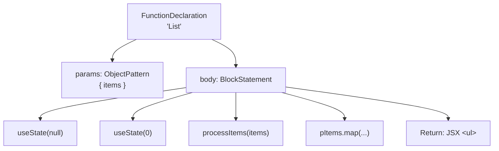
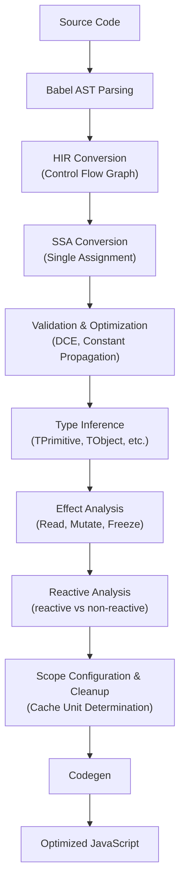

## Table of Contents

## Introduction

Using `useMemo`, `useCallback`, and `React.memo` correctly in React development has long been a thorny issue. Missing dependencies in dependency arrays leads to stale closures, incorrectly wrapping even one item makes the entire memoization meaningless due to its contagious nature, and there's the constant cognitive load of deciding "should I memoize this?"

React Compiler solves this manual memoization pain automatically at build time. It operates as a Babel plugin (a transpiler that transforms JavaScript code), statically analyzing components and hooks (analyzing code structure without executing it) to automatically generate optimal caching code. It's being used in production at Meta and is a stable tool with v1.0 released in October 2025.

This article covers each stage of the compilation pipeline, actual transformation outputs, production performance data, and comparisons with Signals-based approaches.

## Problems with Manual Memoization

Let's briefly touch on the problems React Compiler aims to solve. React re-executes a component and **all its child components** when state changes. To prevent this, we use `React.memo`, `useMemo`, and `useCallback`, but this manual memoization has well-known pitfalls.

```tsx
const ExpensiveList = memo(function ExpensiveList({ data, onClick }) {
  const processed = useMemo(() => expensiveProcessing(data), [data])

  const handleClick = useCallback((item) => {
    onClick(item.id)
  }, [onClick])

  return (
    <ul>
      {processed.map(item => (
        <Item key={item.id} onClick={() => handleClick(item)} />
      ))}
    </ul>
  )
})
```

This code appears well-optimized, but `onClick={() => handleClick(item)}` creates a new arrow function on every render. The `useCallback` wrapping of `handleClick` becomes meaningless. Manual memoization suffers from **contagion** (if one item is missing, the whole thing becomes invalid), **dependency management mistakes** (stale closures), and **cognitive load** (constant decision-making required).

React Compiler automates all these decisions. Developers just write code.

```tsx
function ExpensiveList({ data, onClick }) {
  const processed = expensiveProcessing(data)
  const handleClick = (item) => onClick(item.id)

  return (
    <ul>
      {processed.map(item => (
        <Item key={item.id} onClick={() => handleClick(item)} />
      ))}
    </ul>
  )
}
```

## Design Goals and Principles

Looking at React Compiler's [official design document](https://github.com/facebook/react/blob/main/compiler/docs/DESIGN_GOALS.md), the goals are clear.

**Core Goals:**

1. **Fast by default**: Automatically limit re-rendering scope during updates
2. **Minimal initial load impact**: Minimize code size increases and overhead
3. **Preserve programming model**: Use React's declarative model as-is without `memo`, `useMemo`, `useCallback`
4. **Support idiomatic code**: "Just work" with typical code that follows React rules
5. **Predictability**: Developers should be able to form intuitions about compiler behavior

**Explicit Non-Goals:**

- **Perfect optimization is not pursued.** Eliminating all unnecessary recalculations would require runtime tracking, which negatively impacts code size and performance.
- Code that violates React rules, class components, and dynamic code like `eval()` are not supported.

**Two Core Design Principles:**

1. **High-level output**: Doesn't convert logical operations (`a ?? b`) to if statements, and preserves JSX in its original form. This decision is for debugging convenience.
2. **High-level Intermediate Representation (HIR)**: Internally uses an IR that preserves the source code structure as much as possible.

## Compilation Pipeline

Now comes the core. Let's examine React Compiler's internal workings step by step.

To summarize what the compiler does in one sentence: **"It automatically inserts code that determines whether this value has changed from the previous render."** To achieve this, the compiler transforms the code we write into a form suitable for analysis (steps 1-4), identifies the characteristics of each value (steps 5-7), determines which values to group together for caching (step 8), and outputs the final code (step 9).

You can see the output of each step directly by enabling "Show Internals" in the [React Compiler Playground](https://playground.react.dev/). The entire pipeline consists of **44 steps**, but this is the general flow when viewed at a high level.

This article focuses on the major steps, tracking how the following example code is transformed at each stage.

```tsx
function List({ items }) {
  const [selItem, setSelItem] = useState(null)
  const [sort, setSort] = useState(0)

  const pItems = processItems(items)
  const listItems = pItems.map((item) => <li>{item}</li>)
  return <ul>{listItems}</ul>
}
```

### Steps 1-4: Transforming Code for Analysis

#### Step 1: AST Parsing and Compilation Target Identification

First, we need to convert the JavaScript/TypeScript code we wrote into a structure that computers can understand. Babel parses the source code to generate an AST (Abstract Syntax Tree). An AST is a tree-structured data representation of the code's structure.



The compiler identifies React components (functions that return JSX) and custom hooks (functions starting with `use`) from this AST and selects them as compilation targets. You can exclude specific components from compilation using the `'use no memo'` directive.

#### Step 2: Lowering — Converting AST to HIR

While the AST shows the structure of code, it's inconvenient for understanding "in what order is this code executed?" So the compiler converts the AST into a form more suitable for analysis. Lowering is the process of "lowering" high-level expressions to lower-level expressions that are better for analysis. Here, the Babel AST is converted to **HIR** (High-level Intermediate Representation). IR (Intermediate Representation) refers to internal compiler data structures that exist between source code and final output. React Compiler's HIR represents code as a **control flow graph** (a graph that represents code execution paths with blocks and arrows) while preserving high-level structures like JSX and logical operations.

The HIR for the above `List` component conceptually looks like this:

```
function List
bb0 (block):
  [1] $0 = Destructure items from params
  [2] $1 = Call useState(null)         // selItem, setSelItem
  [3] $2 = Call useState(0)            // sort, setSort
  [4] $3 = Call processItems($0)       // pItems
  [5] $4 = Function (item) => JSX <li>{item}</li>
  [6] $5 = MethodCall $3.map($4)       // listItems
  [7] $6 = JSX <ul>{$5}</ul>
  [8] Return $6
```

Each instruction generates a value with a unique identifier (`$0`, `$1`, ...), and `bb0` is a basic block (a group of instructions that execute sequentially without branching). If there are conditionals, it branches into multiple blocks.

Actual HIR output example from Playground (simple component):

```
function MyApp
bb0 (block):
  [1] $0 = JSXText "Hello World"
  [2] $1 = JSX <div>{$0}</div>
  [3] Return Explicit $1
```

The key point is that **high-level operations like `JSXText` and `JSX` are preserved as-is**. Unlike typical compilers, it doesn't convert to low-level representations.

#### Step 3: SSA Conversion

With HIR, we've captured the execution flow of the code. However, when a single variable is reassigned in multiple places, it becomes difficult to track "where did the value of `x` at this point come from?" To solve this problem, HIR is converted to **SSA** (Static Single Assignment) form. SSA is **a form where each variable is assigned exactly once**, forming the foundation of compiler optimizations.

```
// Regular code
let x = 1
if (cond) { x = 2 }
use(x)

// SSA form
x_0 = 1
if (cond) { x_1 = 2 }
x_2 = φ(x_0, x_1)   // φ(phi) node: decides which version to use when branches merge
use(x_2)
```

Why is this transformation important? SSA clearly reveals the **data dependency chain** where `items` in the `List` component is input to `processItems`, and its result is input to `map`. Since each value is defined exactly once, tracking "where did this value come from?" becomes straightforward.

As Lydia Hallie explained in her React Summit 2025 presentation, in complex code with conditionals, SSA treats assignments in each branch as separate variables to accurately track data flow. This becomes the foundation for dependency analysis in memoization.

#### Step 4: Validation and Basic Optimization

This completes the process of "transforming code into a form suitable for analysis." Before full-scale analysis begins, several validation and basic optimization passes are executed after SSA conversion.

- **PruneMaybeThrows**: Exception possibility analysis
- **DropManualMemoization**: Analyzes existing `useMemo`/`useCallback` and integrates them with compiler optimizations
- **EliminateRedundantPhi**: Removes unnecessary φ nodes
- **ConstantPropagation**: Propagates constant values
- **DeadCodeElimination**: Removes unused code

### Steps 5-7: Identifying Value Characteristics

Now the code is organized in a form suitable for analysis. From here, the compiler identifies three things to decide "which values to cache?": the **type** of values, the **effects** on values, and whether values **change between renders (reactivity)**.

#### Step 5: Type Inference (InferTypes)

Infers the type of each value. This is a compiler-internal type system, different from TypeScript types.

InferTypes output confirmed in Playground:

```
bb0 (block):
  [1] $4:TPrimitive = JSXText "Hello World"
  [2] $5:TObject<BuiltInJsx> = JSX <div>{$4:TPrimitive}</div>
```

`"Hello World"` is inferred as `TPrimitive`, JSX elements as `TObject<BuiltInJsx>`. In the `List` component, `items` is inferred as `TObject` family since it's props, and `useState` returns are inferred as `THook` family. This type information is utilized in later memoization strategies. For example, primitive values have low comparison costs, making them suitable for use as dependencies.

#### Step 6: Effect Analysis (InferMutationAliasingEffects)

Having identified types, next we analyze "how does this code handle data?" This is one of React Compiler's most sophisticated parts. It analyzes what **effects** each operation has on data, providing the basis for deciding "is it safe to cache this value?" and "how far should we group things into one cache unit?"

Major Effect types tracked by the compiler:

| Effect | Meaning | Impact on Memoization |
|--------|---------|----------------------|
| **Read** | Only reads values | Tracked as dependency |
| **Store** | Stores values | Marks creation of new values |
| **Capture** | Closures capture value references | Opens possibility of captured value changes |
| **Mutate** | Changes values | Extends scope until mutation completes |
| **Freeze** | Values become immutable | Safe to cache from this point |

The table might look similar, but specifically **the difference between Capture and Freeze** and **how Mutate extends scope** are key to determining actual compilation results. Let's examine with concrete examples.

##### Capture vs Freeze: The Difference Between Closures and JSX

Consider this component:

```tsx
function CaptureExample({ onClick, label }) {
  const data = { count: 0 }
  const handler = () => {
    onClick(data)
  }
  return <button onClick={handler}>{label}</button>
}
```

Turn on Show Internals in Playground and expand the InferMutationAliasingEffects pass to see what Effects the compiler assigns to each operation. Organized for readability:

```
[1] { onClick, label } = t0
      Create onClick = frozen          ← Value from props, immutable
      Create label = frozen
      ImmutableCapture onClick <- t0   ← Reference relationship with props object

[3] data = Object { count: 0 }
      Create data = mutable            ← New object creation, still changeable

[5] handler = Function @context[read onClick, capture data]
      Capture onClick <- data          ← handler captures data reference
      Capture data <- onClick          ← Cross-reference since onClick receives data
      MutateTransitiveConditionally onClick
          ← data might change when onClick(data) is called

[7] <button onClick={handler}>{label}</button>
      Freeze handler                   ← Becomes immutable when passed to JSX
      Freeze label
```

The key difference emerges:

- **Capture**: `handler` **captures a reference to** `data`. The possibility of `data` changing is still open. Since `onClick(data)` might change `data` when called, the compiler marks it as `MutateTransitiveConditionally`. This means "this function **might** change the values it receives."
- **Freeze**: `handler` and `label` **become immutable** when passed as JSX props. Since React doesn't change props, they can be safely cached from this point onward.

This analysis is directly reflected in the compilation result:

```tsx
// Playground output
function CaptureExample(t0) {
  const $ = _c(6)
  const { onClick, label } = t0

  // data object — literal so created only once (sentinel pattern)
  let t1
  if ($[0] === Symbol.for("react.memo_cache_sentinel")) {
    t1 = { count: 0 }
    $[0] = t1
  } else {
    t1 = $[0]
  }
  const data = t1

  // handler — captures onClick, so recreated when onClick changes
  let t2
  if ($[1] !== onClick) {
    t2 = () => { onClick(data) }
    $[1] = onClick
    $[2] = t2
  } else {
    t2 = $[2]
  }
  const handler = t2

  // JSX — point where handler and label freeze
  let t3
  if ($[3] !== handler || $[4] !== label) {
    t3 = <button onClick={handler}>{label}</button>
    $[3] = handler
    $[4] = label
    $[5] = t3
  } else {
    t3 = $[5]
  }
  return t3
}
```

`data` is a literal `{ count: 0 }` so its value won't change between renders (non-reactive). That's why it's created only once using the sentinel pattern. Conversely, `handler` captures `onClick` (reactive prop), so when `onClick` changes, a new closure must be created. And JSX depends on both `handler` and `label`, so if either changes, it gets recreated.

##### How Mutate Extends Scope

Mutate Effects play a decisive role in determining scope boundaries. Consider this example:

```tsx
function MutateExample({ items, title }) {
  const result = []
  for (const item of items) {
    result.push(<li key={item.id}>{item.name}</li>)
  }
  return <ul title={title}>{result}</ul>
}
```

The compiler's Effect analysis:

```
[1] result = []                    → Create result = mutable
[2] result.push(<li>...</li>)      → Mutate result  (repeated)
[3] <ul>{result}</ul>              → Freeze result
```

After `result` is created, it continues to be mutated in the for loop. The compiler **must group everything up to the point where mutation ends into one scope.** If the scope is split in the middle, incomplete values that are still being mutated could be cached.

This principle is clearly shown in the compilation result:

```tsx
// Playground output
function MutateExample(t0) {
  const $ = _c(5)
  const { items, title } = t0

  // result creation + all pushes in one scope
  let result
  if ($[0] !== items) {
    result = []                                         // Create
    for (const item of items) {
      result.push(<li key={item.id}>{item.name}</li>)   // Mutate
    }
    $[0] = items                                        // Only after all mutations complete
    $[1] = result                                       // Save to cache
  } else {
    result = $[1]
  }

  // JSX — point where result freezes
  let t1
  if ($[2] !== result || $[3] !== title) {
    t1 = <ul title={title}>{result}</ul>                // Freeze
    $[2] = result
    $[3] = title
    $[4] = t1
  } else {
    t1 = $[4]
  }
  return t1
}
```

`result = []` and all `result.push(...)` calls are **within the same if block.** If the compiler had separated array creation and push into different scopes, it would result in meaningless code where an empty array is cached and push executes separately. Because Mutate Effects indicate "changes to this value are still in progress," the compiler only draws scope boundaries after mutations complete.

And in `<ul>{result}</ul>`, `result` gets passed to JSX and Freezes — from this point, it's considered unchanging. A separate scope starts from this point.

#### Step 7: Reactive Analysis (InferReactivePlaces)

We've identified both types and Effects. Finally, it's time to answer **the most crucial question**: "Which values can change between renders?" The answer to this question determines "what to cache and what to recalculate?"

In the `List` component:

```
Reactive (can change each render):
  - items          ← props
  - selItem        ← useState value
  - sort           ← useState value
  - pItems         ← derived from items (reactive)
  - listItems      ← derived from pItems (reactive)

Non-reactive (immutable between renders):
  - null           ← literal
  - 0              ← literal
  - (item) => ...  ← function with no external dependencies (hoisted to module level)
  - <ul>           ← tag itself is immutable
```

This distinction is the core of memoization strategy. Non-reactive values, once cached, remain valid forever (sentinel check pattern). Computations depending on reactive values are recalculated only when those values change (dependency comparison pattern).

Related passes you can check in Playground:

- **InferReactivePlaces**: Determines reactive status of each value
- **InferReactiveScopeVariables**: Determines which variables to include in reactive scope

### Step 8: Determining Cache Units (Reactive Scope Configuration)

Based on the analysis results from steps 5-7, this step actually decides "what to group into one cache chunk." Related values are grouped into **scopes**, and one scope becomes one cache unit (one `if` block in the final output). You can see the scopes the compiler constructed by expanding the BuildReactiveFunction pass in Playground.

Let's look at the BuildReactiveFunction output for the previously analyzed `CaptureExample` (organized for readability):

```
function CaptureExample(t0) {
  [1] Destructure { onClick, label } = t0

  scope @1 dependencies=[0] declarations=[data] {
    [4] data = Object { count: 0 }
  }

  scope @2 dependencies=[onClick, data] declarations=[handler] {
    [8] handler = Function @context[read onClick, capture data]
  }

  scope @3 dependencies=[handler, label] declarations=[t3] {
    [11] t3 = <button onClick={handler}>{label}</button>
  }

  return t3
}
```

Three scopes were created. Each becomes one `if` block in the final output. **Why were they split this way?**

| Scope | Dependencies | Final Cache Pattern | Reason for Separation |
|-------|-------------|-------------------|----------------------|
| @1 `data` | `0` (primitive) | sentinel check | Depends only on literal → once created, valid forever |
| @2 `handler` | `onClick`, `data` | `$[1] !== onClick` | `onClick` is reactive. Since `data` is immutable from @1, actual dependency is only `onClick` |
| @3 JSX | `handler`, `label` | `$[3] !== handler \|\| $[4] !== label` | Both are reactive. If either changes, JSX recreates |

The key criterion for scope separation is **independence of dependencies**. If only `onClick` changes, only @2 re-executes while @1's `data` is reused. If only `label` changes, @2's `handler` also comes from cache and only @3 re-executes. If @2 and @3 were merged into one scope, changing only `label` would unnecessarily recreate the handler.

Although scope @2's dependency list includes `data`, the final output only compares `$[1] !== onClick`. Since `data` is cached with sentinel pattern in scope @1 and never changes, the compiler removed the unnecessary comparison. Even after scope configuration, several cleanup passes perform optimizations:

- **PruneNonEscapingScopes**: Removes scopes for values not passed outside the component since they don't need caching
- **MergeReactiveScopesThatInvalidateTogether**: Merges scopes with identical dependencies that always invalidate together (merging saves cost over separate comparisons)
- **PruneAlwaysInvalidatingScopes**: Removes scopes that invalidate every render since caching them is meaningless

Let's also compare the scope configuration for `MutateExample`. As seen in step 6, Mutate Effects extend scope, so array creation and all pushes are grouped into one scope:

```
scope @1 dependencies=[items] declarations=[result] {
  result = []
  for (const item of items) { result.push(...) }
}

scope @2 dependencies=[result, title] declarations=[t1] {
  t1 = <ul title={title}>{result}</ul>
}
```

@1 depends only on `items`. If `items` is the same, `result` is entirely retrieved from cache. @2 depends on `result` and `title` — if `items` changes and `result` is recreated, @2 also re-executes; if only `title` changes, only @2 re-executes. The key is achieving **maximum effect with minimum caching**.

### Step 9: Codegen (Code Generation)

All analysis and optimization is complete. Finally, the internal representation is converted back to Babel AST to output JavaScript. Variables are converted to `t0`, `t1`, and cache arrays and comparison logic are inserted.

To summarize the entire pipeline:



## Analyzing Compilation Results

Now that we understand the pipeline, let's examine the actual output.

### Static JSX: The Simplest Case

```tsx
export default function MyApp() {
  return <div>Hello World</div>
}
```

Compilation result:

```tsx
import { c as _c } from "react/compiler-runtime"

export default function MyApp() {
  const $ = _c(1)
  let t0
  if ($[0] === Symbol.for("react.memo_cache_sentinel")) {
    t0 = <div>Hello World</div>
    $[0] = t0
  } else {
    t0 = $[0]
  }
  return t0
}
```

Key patterns:

- **`_c(1)`**: Cache creation function from `react/compiler-runtime`. Creates a cache array of size 1 on the Fiber node.
- **`$`**: Cache array. Access slots like `$[0]`, `$[1]`.
- **`Symbol.for("react.memo_cache_sentinel")`**: Sentinel value to check if cache is empty. A sentinel is a special marker value indicating "this slot has never been used."

Since there are no props or state, the entire JSX is created once and returned from cache thereafter.

### Props Dependencies: Dependency Comparison Pattern

```tsx
function Greeting({ name }) {
  const text = `Hello, ${name}!`
  return <p>{text}</p>
}
```

Compilation result:

```tsx
function Greeting(t0) {
  const $ = _c(2)
  const { name } = t0
  let t1
  if ($[0] !== name) {
    t1 = <p>{`Hello, ${name}!`}</p>
    $[0] = name
    $[1] = t1
  } else {
    t1 = $[1]
  }
  return t1
}
```

Dependencies (`name`) are stored in `$[0]`, results (JSX) in `$[1]`. If `name` is the same as before, return cached JSX. Same effect as manual `useMemo` but without developers managing dependency arrays.

### Real-world Component: 4 Cache Slots Analysis

Let's look at the compilation result of the `List` component we tracked in the pipeline. This is from the [Playground](https://playground.react.dev/).

```tsx
import { c as _c } from "react/compiler-runtime"

function List(t0) {
  const $ = _c(4)
  const { items } = t0
  useState(null)
  useState(0)

  let t1
  if ($[0] !== items) {
    const pItems = processItems(items)
    t1 = pItems.map(_temp)
    $[0] = items
    $[1] = t1
  } else {
    t1 = $[1]
  }

  const listItems = t1
  let t2
  if ($[2] !== listItems) {
    t2 = <ul>{listItems}</ul>
    $[2] = listItems
    $[3] = t2
  } else {
    t2 = $[3]
  }
  return t2
}

function _temp(item) {
  return <li>{item}</li>
}
```

Several notable points:

**`useState` is not cached.** `useState(null)` and `useState(0)` are called directly without cache logic. Hook state is managed in React's internal Fiber, so the compiler doesn't need to cache it separately.

**Map callbacks are hoisted to module-level functions.** Since `(item) => <li>{item}</li>` doesn't depend on external variables, the compiler extracts it as a separate function called `_temp` outside the component. No need to create a new function on every render.

Breaking down the 4 cache slots:

| Slot | Pattern | Stores | Invalidated When |
|------|---------|---------|------------------|
| `$[0]` | Dependency | `items` (for comparison) | `items` reference changes |
| `$[1]` | Result | `pItems.map(_temp)` result | `items` changes |
| `$[2]` | Dependency | `listItems` (for comparison) | `listItems` reference changes |
| `$[3]` | Result | `<ul>{listItems}</ul>` JSX | `listItems` changes |

Each scope operates **independently**. When `items` changes, both `$[0]`~`$[1]` and `$[2]`~`$[3]` are updated. While manual `useMemo` would only cache the `processItems(items)` result, the compiler caches the dependent `<ul>` JSX as a separate scope.

### Cache Storage Location: Fiber Tree

Cache arrays created by `_c` are **stored in React's Fiber nodes**. Fiber is React's internal object for tracking each component instance, where hook state and effect information are stored as linked lists. Like `useMemo`, the compiler reuses this existing hook storage mechanism.

- **Per instance**: `<List items={a} />` and `<List items={b} />` have separate caches.
- **Lifecycle bound**: Created on mount, released on unmount. No memory leak concerns.
- **Memory-performance tradeoff**: Cache arrays use memory, but this is usually offset by reduced component re-rendering costs.

### Final Execution Code

React Compiler output **still contains JSX**. The code browsers actually execute has gone through one more JSX transpilation step.

```tsx
// React Compiler output
t0 = <div>Hello World</div>

// After JSX transpilation (browser executes)
t0 = _jsx("div", { children: "Hello World" })
```

It's important to be aware during debugging that **two transformation steps** exist between written code and execution code.

## Real Performance Results

Results from applying React Compiler to a 15,000-line production app at developerway.com.

### Compilation Coverage

**361 out of 363 components** compiled successfully. 0 ESLint rule violations. Nearly all components can be handled in codebases that follow React rules well.

### Initial Load vs Interactions

- **Initial load**: No significant difference. First render needs to calculate all values anyway, so overhead is minimal.
- **Settings page**: Total Blocking Time **280ms → 0ms**
- **Gallery filter**: Blocking time **130ms → 90ms** (about 30% reduction)

Meta reported up to 12% improvement in initial load/navigation and up to 2.5x faster interactions in Quest Store.

### Re-render Case Analysis

9 notable re-rendering cases:

| Result | Count | Characteristics |
|--------|--------|-----------------|
| Complete resolution | 2 | Non-primitive props passing, children patterns |
| Partial improvement | 5 | Some re-rendering reduction |
| No improvement | 2 | Always new object references, library bailouts |

## Limitations and Considerations

### Unstable Reference Issues

The compiler uses `!==` comparison to determine cache validity. Data that returns new objects every time (like API responses) invalidates cache even with same content.

```tsx
function UserProfile({ userId }) {
  const user = useFetchUser(userId)
  // If user object reference changes every time, everything below recalculates
  return <ProfileCard user={user} />
}
```

The fundamental solution is configuring libraries like TanStack Query or SWR to ensure reference stability.

### Compiler Bailouts

Bailout means the compiler determines "this code cannot be safely optimized" and abandons transformation. The compiler skips components with these patterns:

- Conditional hook calls
- Side effects during rendering
- Dynamic code execution like `eval()`
- External library calls the compiler can't model for mutability

Bailouts don't cause functionality issues but miss optimization benefits. Use `npx react-compiler-healthcheck` to check compatibility beforehand.

### Cases Where Manual Optimization Is Better

The compiler optimizes within given code structure but **doesn't change the structure itself**. These remain developer responsibilities:

- Separating frequently changing state from rarely changing state into different components
- Normalizing nested objects for comparison efficiency
- Changing component structure to reduce re-render scope

### Bundle Size Impact

In React 19, the `_c` function from `react/compiler-runtime` is included in React itself, so no separate runtime library is needed. React 17/18 requires installing the `react-compiler-runtime` package, but it's very small. Removing existing `useMemo`/`useCallback` wrappers might actually reduce bundle size.

## Comparison with Signals: Why React Chose a Compiler

Frameworks like Solid.js, Preact Signals, and Angular Signals implement **fine-grained reactivity** with Signals. Why did React choose to solve the same problem with a compiler?

### Approach Differences

| | Signals | React Compiler |
|---|---------|---------------|
| **Timing** | Runtime | Build time |
| **Tracking** | Automatic dependency tracking during execution | Static analysis to infer dependencies |
| **Granularity** | Expression-level (direct DOM node updates) | Component/hook level (maintains Virtual DOM diffing) |
| **Runtime cost** | Maintain subscriber Set per signal, graph ordering | Cache array comparison (proportional to dependencies) |
| **Bundle addition** | Runtime library needed (~1KB+) | 0 (included in existing React) |
| **API changes** | `.value` reading, Signal object management | None (existing React code as-is) |

### Why React Chose a Compiler

**1. Preserve programming model.** React's "UI is a function of state" mental model and accessibility using regular JavaScript values/idioms are core React values. Signals introduce mutable reactive atoms, which conflicts with React's immutability-first model.

**2. Features enabled by immutable state.** React's immutable state model enables time-travel debugging, concurrent rendering (ability to interrupt and replay work is because state is snapshots), React Server Components (serializable state), and Suspense. Mutable signals are fundamentally incompatible with the ability to replay renders from snapshots.

**3. Component function semantics.** In React, component functions re-execute every render. In Solid.js, component functions are "setup" functions that execute once, and signals directly update the DOM. Introducing signals would fundamentally change React's programming model.

**4. Pragmatic 80/20 solution.** The compiler's explicit goal isn't "perfect optimization" but "fast performance by default." A practical choice solving the biggest pain point of manual memoization without ecosystem changes.

## Comparison with Svelte: Same Compiler, Different Philosophy

While the Signals comparison was "runtime vs build-time" differences, the Svelte comparison is more interesting. **Both are compiler-based, so why do they produce completely different outputs?**

### Svelte's Approach: Compile Away the Framework

Svelte 5's compiler takes `.svelte` files and generates **imperative JavaScript that directly manipulates the DOM** without a Virtual DOM. Here's how the same counter component compiles:

```html
<script>
  let count = $state(0)
  const doubled = $derived(count * 2)
</script>

<button onclick={() => count++}>
  {count} x 2 = {doubled}
</button>
```

Svelte compiler output (simplified):

```js
import * as $ from 'svelte/internal/client'

var root = $.from_html(`<button> </button>`)

export default function Counter($$anchor) {
  let count = $.state(0)
  const doubled = $.derived(() => $.get(count) * 2)

  var button = root()
  var text = $.child(button)

  button.__click = () => $.set(count, $.get(count) + 1)

  // Only this callback re-executes on state changes
  $.template_effect(() =>
    $.set_text(text, `${$.get(count)} x 2 = ${$.get(doubled)}`)
  )

  $.append($$anchor, button)
}
```

**The component function executes only once.** When state changes, only the `template_effect` callback re-executes to directly update that DOM text node. No Virtual DOM diffing, no component re-execution.

### Core Difference: What Gets Compiled

| | Svelte 5 | React Compiler |
|---|---------|---------------|
| **Compilation goal** | Remove the framework | Optimize within the framework |
| **Runtime** | ~1.6KB (signal system only) | ~42KB (React + ReactDOM) |
| **Virtual DOM** | None — direct DOM manipulation | Maintained — diffing unchanged |
| **Update granularity** | Individual DOM nodes (`set_text`, `set_attribute`) | Component subtrees (skip via memoization) |
| **Component re-execution** | No (execute once, then only effects) | Yes (but skip children on cache hit) |
| **Reactivity model** | Signal-based (`$state`, `$derived`) | Immutable state + automatic memoization |

React Compiler is like "using the same engine but automating gear shifts," while Svelte "replaced the engine entirely."

### Why React Didn't Choose Svelte's Approach

Svelte's approach is indeed more performant. Eliminating Virtual DOM diffing removes overhead at the source. But React didn't choose this approach for reasons:

**1. Ecosystem compatibility.** Must preserve all existing React code, libraries, and patterns. Removing Virtual DOM breaks React's entire ecosystem.

**2. Concurrent features.** React's Suspense, Transitions, Streaming SSR and other concurrent features depend on Virtual DOM's "maintain intermediate state in memory and commit when needed" model. These features are hard to implement with direct DOM manipulation.

**3. Gradual adoption.** React Compiler just needs adding one Babel plugin to existing projects. No code changes needed. Transitioning to Svelte means complete rewrite.

Ultimately, both compilers found optimal answers under different constraints. Svelte "designed optimal structure from scratch," React "optimized as much as possible while maintaining existing structure." Neither is inherently better — they have different tradeoffs.

## Adoption Guide

### Requirements

- Works out of the box in **React 19**. Also usable in **React 17, 18** but requires installing the `react-compiler-runtime` package and setting the `target` option.
- Codebase must follow [Rules of React](https://react.dev/reference/rules). Conditional hook calls, side effects during rendering, etc. cause the compiler to skip those components.

Additional setup for React 17/18:

```bash
npm install react-compiler-runtime@latest
```

```js
// babel-plugin-react-compiler options
{
  target: '18' // or '17'
}
```

### Installation

```bash
npm install -D babel-plugin-react-compiler@latest
```

### Build Tool Configuration

#### Next.js (v15.3.1+)

Next.js has built-in React Compiler support. One line of configuration:

```js
// next.config.js
const nextConfig = {
  reactCompiler: true,
}
module.exports = nextConfig
```

#### Vite

Add the plugin to `@vitejs/plugin-react`'s Babel options:

```js
// vite.config.js
import react from '@vitejs/plugin-react'

export default defineConfig({
  plugins: [
    react({
      babel: {
        plugins: ['babel-plugin-react-compiler'],
      },
    }),
  ],
})
```

#### Babel (Direct Configuration)

For environments using Babel directly like Webpack, React Native (Metro), add to `babel.config.js`. **Must be first in the plugins list** because the compiler needs to see original code before other transformations for accurate analysis.

```js
// babel.config.js
module.exports = {
  plugins: [
    'babel-plugin-react-compiler', // Must be first
    // ... other plugins
  ],
}
```

### ESLint Configuration

Using the ESLint plugin with React Compiler catches code the compiler would have to skip beforehand.

```bash
npm install -D eslint-plugin-react-hooks@latest
```

The `recommended-latest` preset includes compiler-related rules. Violations only cause the compiler to skip those components without breaking the build, so you don't need to fix all warnings immediately.

### Compatibility Check

Check how compatible your existing codebase is before adoption:

```bash
npx react-compiler-healthcheck@latest
```

This command reports:

- Number of compilable components
- StrictMode activation status
- Number of removable manual memoizations (`useMemo`/`useCallback`)

### Verifying Operation

Two ways to confirm the compiler is working:

**1. React DevTools**: Compiled components show a "Memo ✨" badge. Open your app in development mode and check the Components tab in DevTools.

**2. Build output check**: If bundled code contains `import { c as _c } from "react/compiler-runtime"`, the compiler is working.

### What About Existing useMemo/useCallback?

If you already have code using `useMemo`, `useCallback`, `React.memo`, **you don't need to remove them immediately**. The compiler works alongside existing manual memoization without conflicts.

However, removing existing manual memoization **can change compiler output**. So if cleaning up existing code, do so after thorough testing. For new code, let the compiler handle it and use `useMemo`/`useCallback` only when you need precise control over effect dependencies.

### Gradual Adoption

If applying to the entire project at once feels overwhelming, you can adopt progressively.

**Compile only specific components (opt-in):**

```js
// babel or next.config.js
{
  compilationMode: 'annotation',
}
```

```tsx
export default function Page() {
  'use memo'  // Only compile this component
  // ...
}
```

**Exclude specific components (opt-out):**

```tsx
function ProblematicComponent() {
  'use no memo'  // Skip compiling this component
  // ...
}
```

**Directory-level application:** Using Babel's `overrides`, you can apply the compiler only to specific directories:

```js
// babel.config.js
module.exports = {
  plugins: [],
  overrides: [
    {
      test: './src/new-features/**/*.{js,jsx,ts,tsx}',
      plugins: ['babel-plugin-react-compiler'],
    },
  ],
}
```

## Conclusion

React Compiler performs automatic memoization through a sophisticated 44-stage pipeline that starts from Babel AST and goes through HIR, SSA, Effect analysis, and Reactive Scope inference. It operates at a more granular level than manual developer optimization, without dependency management mistakes.

The production results aren't a silver bullet, but they're sufficiently practical. It improves interaction performance without affecting initial load, and is compatible with 99%+ of components. Choosing build-time static analysis instead of runtime approaches like Signals was a pragmatic decision that preserves React's programming model while solving the biggest pain points.

### React Is No Longer Just a Library

This is my personal opinion, but honestly, at this point it's hard to call React a "UI library." With its own compiler, Server Components, Server Actions, and deep integration with frameworks like Next.js — React is already closer to being a platform. There was an old debate about "library vs framework," but there's no library in this world that comes with a 44-stage optimization compiler. And I don't necessarily think this direction is bad. Given the scale of problems the compiler solves, this level of complexity is well worth it.

### So Can We Stop Caring About useMemo/useCallback Now?

To be honest, **no.** Just because the compiler handles it automatically doesn't mean you don't need to understand the principles.

First, there are situations where the compiler bails out. In cases involving external library calls, complex dynamic patterns, etc., where the compiler gives up on analysis, you still need to optimize manually. Without understanding the principles, you can't even diagnose why performance isn't good.

Second, the compiler doesn't change your code structure. Separating frequently changing state from rarely changing state, or restructuring components to reduce re-render scope, is still the developer's responsibility. Making these decisions requires understanding React's rendering model and memoization principles.

Third, understanding referential equality is an important concept not just for React but for JavaScript in general. The concepts of closures, reference comparison, and immutability that you naturally learn while studying `useMemo` and `useCallback` aren't something a compiler can replace.

The compiler **automates boilerplate**, it doesn't **replace developer understanding**. Just as automatic transmission doesn't mean you don't need to understand engine principles, having a compiler doesn't mean you don't need to understand memoization principles. The key is being freed from the labor of repeatedly applying that knowledge to every component.

## References

- [How React Compiler Performs on Real Code - developerway.com](https://www.developerway.com/posts/how-react-compiler-performs-on-real-code)
- [Understanding React Compiler - Tony Alicea](https://tonyalicea.dev/blog/understanding-react-compiler/)
- [React Compiler Internals - Lydia Hallie (React Summit 2025)](https://gitnation.com/contents/react-compiter-internals)
- [React Compiler Design Goals - GitHub](https://github.com/facebook/react/blob/main/compiler/docs/DESIGN_GOALS.md)
- [React Compiler - Official Docs](https://react.dev/learn/react-compiler)
- [React Compiler Playground](https://playground.react.dev/)