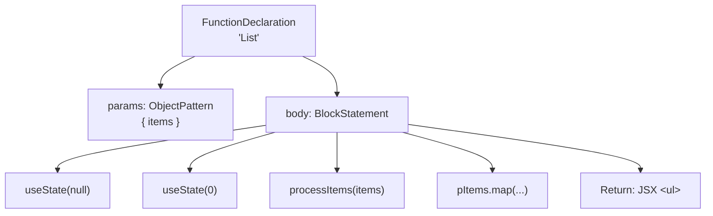
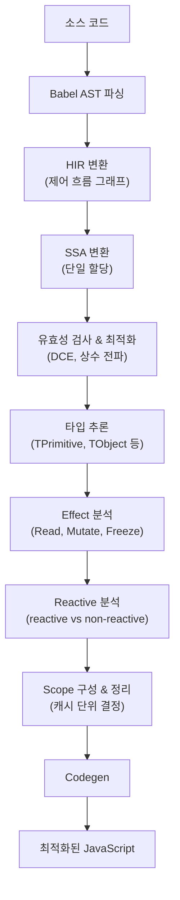

## Table of Contents

## 서론

React 개발에서 `useMemo`, `useCallback`, `React.memo`를 올바르게 사용하는 것은 오랫동안 골치 아픈 문제였다. 의존성 배열을 빠뜨리면 stale closure(오래된 값을 참조하는 클로저), 하나라도 잘못 감싸면 전체 메모이제이션이 무의미해지는 전염성, 그리고 "이걸 메모이제이션해야 하나?"를 매번 고민해야 하는 인지 부하까지.

React Compiler는 이 수동 메모이제이션의 고통을 빌드 타임에 자동으로 해결한다. Babel(JavaScript 코드를 변환하는 트랜스파일러) 플러그인 형태로 동작하며, 컴포넌트와 훅을 정적 분석(코드를 실행하지 않고 구조만 보고 분석하는 것)해서 최적의 캐싱 코드를 자동 생성한다. Meta에서 프로덕션에 적용하고 있으며, 2025년 10월 v1.0이 릴리스된 stable 도구다.

이 글에서는 컴파일 파이프라인의 각 단계, 실제 변환 결과물, 프로덕션 성능 데이터, 그리고 Signals 기반 접근법과의 비교까지 다뤄본다.

## 수동 메모이제이션의 문제

React Compiler가 해결하려는 문제를 간단히 짚고 넘어가자. React는 state가 변경되면 해당 컴포넌트와 **모든 자식 컴포넌트를 다시 실행**한다. 이를 방지하기 위해 `React.memo`, `useMemo`, `useCallback`을 사용하는데, 이 수동 메모이제이션에는 잘 알려진 함정들이 있다.

```tsx
const ExpensiveList = memo(function ExpensiveList({ data, onClick }) {
  const processed = useMemo(() => expensiveProcessing(data), [data])

  const handleClick = useCallback((item) => {
    onClick(item.id)
  }, [onClick])

  return (
    <ul>
      {processed.map(item => (
        <Item key={item.id} onClick={() => handleClick(item)} />
      ))}
    </ul>
  )
})
```

이 코드는 최적화가 잘 된 것 같지만, `onClick={() => handleClick(item)}`에서 매 렌더링마다 새로운 화살표 함수가 생성된다. `handleClick`을 `useCallback`으로 감싼 의미가 없어지는 것이다. 이처럼 수동 메모이제이션은 **전염성**(하나라도 빠지면 전체가 무효), **의존성 관리 실수**(stale closure), **인지 부하**(매번 판단 필요) 문제를 안고 있다.

React Compiler는 이 모든 판단을 자동화한다. 개발자는 그냥 코드를 작성하면 된다.

```tsx
function ExpensiveList({ data, onClick }) {
  const processed = expensiveProcessing(data)
  const handleClick = (item) => onClick(item.id)

  return (
    <ul>
      {processed.map(item => (
        <Item key={item.id} onClick={() => handleClick(item)} />
      ))}
    </ul>
  )
}
```

## 설계 목표와 원칙

React Compiler의 [공식 설계 문서](https://github.com/facebook/react/blob/main/compiler/docs/DESIGN_GOALS.md)를 보면, 목표가 명확하다.

**핵심 목표:**

1. **기본적으로 빠른 성능**: 업데이트 시 리렌더링 범위를 자동으로 제한
2. **초기 로드 영향 최소화**: 코드 크기 증가와 오버헤드를 최소화
3. **프로그래밍 모델 유지**: `memo`, `useMemo`, `useCallback` 없이도 React의 선언적 모델을 그대로 사용
4. **관용적 코드 지원**: React 규칙을 따르는 일반적인 코드에서 "그냥 동작"
5. **예측 가능성**: 개발자가 컴파일러의 동작에 대한 직관을 형성할 수 있어야 함

**명시적 비목표:**

- **완벽한 최적화는 추구하지 않는다.** 모든 불필요한 재계산을 제거하려면 런타임 추적이 필요하고, 이는 코드 크기와 성능에 부정적 영향을 미친다.
- React 규칙을 위반하는 코드, 클래스 컴포넌트, `eval()` 같은 동적 코드는 지원하지 않는다.

**두 가지 핵심 설계 원칙:**

1. **고수준 출력**: 논리 연산(`a ?? b`)을 if문으로 변환하지 않고, JSX도 원래 형태를 보존한다. 디버깅 편의성을 위한 결정이다.
2. **고수준 중간 표현(HIR)**: 내부적으로도 소스 코드의 구조를 최대한 보존하는 IR을 사용한다.

## 컴파일 파이프라인

이제 핵심이다. React Compiler의 내부 동작을 단계별로 살펴보자.

컴파일러가 하는 일을 한 문장으로 요약하면 이렇다: **"이 값이 이전 렌더링과 달라졌는가?"를 판단하는 코드를 자동으로 삽입한다.** 이를 위해 컴파일러는 우리가 작성한 코드를 분석하기 좋은 형태로 바꾸고(1\~4단계), 각 값의 특성을 파악한 뒤(5\~7단계), 어떤 값들을 묶어서 캐시할지 결정하고(8단계), 최종 코드를 출력한다(9단계).

[React Compiler Playground](https://playground.react.dev/)에서 "Show Internals"를 활성화하면 각 단계의 출력을 직접 확인할 수 있다. 전체 파이프라인은 무려 **44단계**에 달하지만, 크게 보면 위의 흐름이다.

이 글에서는 주요 단계를 중심으로, 다음 예시 코드가 각 단계에서 어떻게 변환되는지 추적한다.

```tsx
function List({ items }) {
  const [selItem, setSelItem] = useState(null)
  const [sort, setSort] = useState(0)

  const pItems = processItems(items)
  const listItems = pItems.map((item) => <li>{item}</li>)
  return <ul>{listItems}</ul>
}
```

### 1\~4단계: 코드를 분석하기 좋은 형태로 변환

#### 1단계: AST 파싱과 컴파일 대상 식별

먼저 우리가 작성한 JavaScript/TypeScript 코드를 컴퓨터가 이해할 수 있는 구조로 바꿔야 한다. Babel이 소스 코드를 파싱하여 AST(Abstract Syntax Tree)를 생성한다. AST란 코드의 구조를 트리 형태의 데이터로 표현한 것이다.



컴파일러는 이 AST에서 React 컴포넌트(JSX를 반환하는 함수)와 커스텀 훅(`use`로 시작하는 함수)을 식별하여 컴파일 대상으로 선정한다. `'use no memo'` 지시자로 특정 컴포넌트의 컴파일을 제외할 수도 있다.

#### 2단계: Lowering — AST를 HIR로 변환

AST는 코드의 구조를 보여주지만, "이 코드가 어떤 순서로 실행되는가?"를 파악하기엔 불편하다. 그래서 컴파일러는 AST를 좀 더 분석에 적합한 형태로 변환한다. Lowering이란 고수준 표현을 좀 더 분석하기 좋은 저수준 표현으로 "내리는" 과정이다. 여기서는 Babel AST를 **HIR**(High-level Intermediate Representation, 고수준 중간 표현)로 변환한다. IR(중간 표현)이란 소스 코드와 최종 출력 사이에 존재하는 컴파일러 내부 데이터 구조를 말한다. React Compiler의 HIR은 코드를 **제어 흐름 그래프**(Control Flow Graph — 코드의 실행 경로를 블록과 화살표로 표현한 그래프)로 나타내되, JSX나 논리 연산 같은 고수준 구조를 보존한다.

위 `List` 컴포넌트의 HIR은 개념적으로 이런 형태다:

```
function List
bb0 (block):
  [1] $0 = Destructure items from params
  [2] $1 = Call useState(null)         // selItem, setSelItem
  [3] $2 = Call useState(0)            // sort, setSort
  [4] $3 = Call processItems($0)       // pItems
  [5] $4 = Function (item) => JSX <li>{item}</li>
  [6] $5 = MethodCall $3.map($4)       // listItems
  [7] $6 = JSX <ul>{$5}</ul>
  [8] Return $6
```

각 명령어가 고유 식별자(`$0`, `$1`, ...)를 가진 값을 생성하고, `bb0`는 기본 블록(Basic Block — 분기 없이 순차 실행되는 명령어 묶음)이다. 조건문이 있으면 여러 블록으로 분기된다.

Playground에서 확인한 실제 HIR 출력 예시 (단순 컴포넌트):

```
function MyApp
bb0 (block):
  [1] $0 = JSXText "Hello World"
  [2] $1 = JSX <div>{$0}</div>
  [3] Return Explicit $1
```

`JSXText`, `JSX` 같은 **고수준 연산이 그대로 보존**되어 있다는 것이 핵심이다. 일반적인 컴파일러처럼 저수준으로 변환하지 않는다.

#### 3단계: SSA 변환

HIR로 코드의 실행 흐름은 파악했다. 하지만 하나의 변수가 여러 곳에서 재할당되면 "이 시점의 `x`가 어디서 온 값인가?"를 추적하기 어렵다. 이 문제를 해결하기 위해 HIR을 **SSA**(Static Single Assignment) 형태로 변환한다. SSA는 **각 변수가 정확히 한 번만 할당되는 형태**로, 컴파일러 최적화의 기초가 된다.

```
// 일반 코드
let x = 1
if (cond) { x = 2 }
use(x)

// SSA 형태
x_0 = 1
if (cond) { x_1 = 2 }
x_2 = φ(x_0, x_1)   // φ(phi) 노드: 분기 합류 시 어떤 버전을 사용할지 결정
use(x_2)
```

이 변환이 왜 중요한가? `List` 컴포넌트에서 `items`가 `processItems`의 입력이고, 그 결과가 `map`의 입력이라는 **데이터 의존성 체인**을 SSA가 명확하게 드러낸다. 각 값이 정확히 한 번 정의되므로, "이 값이 어디에서 왔는가?"를 추적하는 것이 간단해진다.

Lydia Hallie의 React Summit 2025 발표에서 설명했듯이, 조건문이 있는 복잡한 코드에서 SSA는 각 분기에서의 할당을 별도 변수로 취급하여 데이터 흐름을 정확히 추적한다. 이것이 곧 메모이제이션의 의존성 분석 기반이 된다.

#### 4단계: 유효성 검사와 기본 최적화

여기까지가 "코드를 분석하기 좋은 형태로 바꾸는" 과정이었다. 본격적인 분석에 앞서, SSA 변환 후 여러 검증과 기본 최적화 패스가 실행된다.

- **PruneMaybeThrows**: 예외 가능성 분석
- **DropManualMemoization**: 기존 `useMemo`/`useCallback`을 분석하여 컴파일러 최적화와 통합
- **EliminateRedundantPhi**: 불필요한 φ 노드 제거
- **ConstantPropagation**: 상수 값 전파
- **DeadCodeElimination**: 사용되지 않는 코드 제거

### 5\~7단계: 각 값의 특성 파악

이제 코드가 분석하기 좋은 형태로 정리되었다. 컴파일러는 여기서부터 "어떤 값을 캐시할 것인가?"를 결정하기 위해 세 가지를 파악한다: 값의 **타입**, 값에 미치는 **영향(Effect)**, 값이 렌더링 간에 **변하는지 여부(Reactivity)**.

#### 5단계: 타입 추론 (InferTypes)

각 값의 타입을 추론한다. TypeScript의 타입과는 다른, 컴파일러 내부용 타입 시스템이다.

Playground에서 확인한 InferTypes 출력:

```
bb0 (block):
  [1] $4:TPrimitive = JSXText "Hello World"
  [2] $5:TObject<BuiltInJsx> = JSX <div>{$4:TPrimitive}</div>
```

`"Hello World"`는 `TPrimitive`, JSX 요소는 `TObject<BuiltInJsx>`로 추론된다. `List` 컴포넌트에서는 `items`가 props이므로 `TObject` 계열로, `useState`의 반환이 `THook` 계열로 추론된다. 이 타입 정보는 이후 메모이제이션 전략에 활용된다. 예를 들어 프리미티브 값은 비교 비용이 낮으므로 의존성으로 사용하기 적합하다.

#### 6단계: Effect 분석 (InferMutationAliasingEffects)

타입을 파악했으니, 다음은 "이 코드가 데이터를 어떻게 다루는가?"를 분석할 차례다. React Compiler의 가장 정교한 부분 중 하나다. 각 연산이 데이터에 어떤 **Effect**(영향)를 미치는지 분석하여, "이 값을 캐시해도 안전한가?"와 "어디까지를 하나의 캐시 단위로 묶을 것인가?"를 결정하는 근거를 만든다.

컴파일러가 추적하는 주요 Effect 종류:

| Effect | 의미 | 메모이제이션에 미치는 영향 |
|--------|------|---------------------------|
| **Read** | 값을 읽기만 한다 | 의존성으로 추적 |
| **Store** | 값을 저장한다 | 새 값의 생성을 표시 |
| **Capture** | 클로저가 값의 참조를 붙잡는다 | 캡처된 값이 변경될 가능성 열림 |
| **Mutate** | 값을 변경한다 | mutation 완료까지 scope 확장 |
| **Freeze** | 값이 불변으로 굳어진다 | 이 시점부터 안전하게 캐시 가능 |

표만 보면 비슷해 보이지만, 특히 **Capture와 Freeze의 차이**, 그리고 **Mutate가 scope를 확장하는 방식**이 실제 컴파일 결과를 결정짓는 핵심이다. 구체적 예시로 살펴보자.

##### Capture vs Freeze: 클로저와 JSX의 차이

다음 컴포넌트를 보자.

```tsx
function CaptureExample({ onClick, label }) {
  const data = { count: 0 }
  const handler = () => {
    onClick(data)
  }
  return <button onClick={handler}>{label}</button>
}
```

Playground에서 Show Internals를 켜고 InferMutationAliasingEffects 패스를 펼치면, 컴파일러가 각 연산에 어떤 Effect를 부여하는지 확인할 수 있다. 가독성을 위해 정리하면:

```
[1] { onClick, label } = t0
      Create onClick = frozen          ← props에서 꺼낸 값, 불변
      Create label = frozen
      ImmutableCapture onClick <- t0   ← props 객체와의 참조 관계

[3] data = Object { count: 0 }
      Create data = mutable            ← 새 객체 생성, 아직 변경 가능

[5] handler = Function @context[read onClick, capture data]
      Capture onClick <- data          ← handler가 data의 참조를 붙잡음
      Capture data <- onClick          ← onClick이 data를 받으므로 상호 참조
      MutateTransitiveConditionally onClick
          ← onClick(data) 호출 시 data가 변경될 수도 있음

[7] <button onClick={handler}>{label}</button>
      Freeze handler                   ← JSX에 전달되면서 불변으로 굳어짐
      Freeze label
```

핵심 차이가 드러난다:

- **Capture**: `handler`가 `data`의 **참조를 붙잡는다.** 아직 `data`가 변경될 가능성이 열려 있다. 실제로 `onClick(data)`가 호출되면 `data`가 변경될 수도 있으므로, 컴파일러는 `MutateTransitiveConditionally`로 표시한다. "이 함수가 전달받은 값을 변경할 **수도** 있다"는 뜻이다.
- **Freeze**: `handler`와 `label`이 JSX의 props로 전달되면서 **불변으로 굳어진다.** React는 props를 변경하지 않으므로, 이 시점 이후로는 안전하게 캐시할 수 있다.

이 분석이 컴파일 결과에 그대로 반영된다:

```tsx
// Playground 출력
function CaptureExample(t0) {
  const $ = _c(6)
  const { onClick, label } = t0

  // data 객체 — 리터럴이므로 한 번만 생성 (sentinel 패턴)
  let t1
  if ($[0] === Symbol.for("react.memo_cache_sentinel")) {
    t1 = { count: 0 }
    $[0] = t1
  } else {
    t1 = $[0]
  }
  const data = t1

  // handler — onClick을 capture하므로, onClick이 바뀌면 재생성
  let t2
  if ($[1] !== onClick) {
    t2 = () => { onClick(data) }
    $[1] = onClick
    $[2] = t2
  } else {
    t2 = $[2]
  }
  const handler = t2

  // JSX — handler와 label이 freeze되는 지점
  let t3
  if ($[3] !== handler || $[4] !== label) {
    t3 = <button onClick={handler}>{label}</button>
    $[3] = handler
    $[4] = label
    $[5] = t3
  } else {
    t3 = $[5]
  }
  return t3
}
```

`data`는 `{ count: 0 }`이라는 리터럴이므로 렌더링 간에 값이 바뀔 일이 없다(non-reactive). 그래서 sentinel 패턴으로 한 번만 생성한다. 반면 `handler`는 `onClick`(reactive prop)을 capture하고 있어서, `onClick`이 바뀌면 새로운 클로저를 만들어야 한다. 그리고 JSX는 `handler`와 `label` 모두에 의존하므로, 둘 중 하나라도 바뀌면 재생성된다.

##### Mutate가 scope를 확장하는 원리

Mutate Effect는 scope 경계를 결정하는 데 결정적인 역할을 한다. 다음 예시를 보자.

```tsx
function MutateExample({ items, title }) {
  const result = []
  for (const item of items) {
    result.push(<li key={item.id}>{item.name}</li>)
  }
  return <ul title={title}>{result}</ul>
}
```

컴파일러의 Effect 분석:

```
[1] result = []                    → Create result = mutable
[2] result.push(<li>...</li>)      → Mutate result  (반복)
[3] <ul>{result}</ul>              → Freeze result
```

`result`가 생성(Create)된 후 for문에서 계속 변경(Mutate)된다. 컴파일러는 **mutation이 끝나는 시점까지를 하나의 scope로 묶어야 한다.** 중간에 scope를 끊으면, 아직 mutation이 진행 중인 불완전한 값이 캐시될 수 있기 때문이다.

컴파일 결과를 보면 이 원리가 명확히 드러난다:

```tsx
// Playground 출력
function MutateExample(t0) {
  const $ = _c(5)
  const { items, title } = t0

  // result 생성 + 모든 push가 하나의 scope
  let result
  if ($[0] !== items) {
    result = []                                         // Create
    for (const item of items) {
      result.push(<li key={item.id}>{item.name}</li>)   // Mutate
    }
    $[0] = items                                        // mutation이 모두 끝난 후에야
    $[1] = result                                       // 캐시에 저장
  } else {
    result = $[1]
  }

  // JSX — result가 freeze되는 지점
  let t1
  if ($[2] !== result || $[3] !== title) {
    t1 = <ul title={title}>{result}</ul>                // Freeze
    $[2] = result
    $[3] = title
    $[4] = t1
  } else {
    t1 = $[4]
  }
  return t1
}
```

`result = []`과 모든 `result.push(...)` 호출이 **같은 if 블록 안에** 있다. 만약 컴파일러가 배열 생성과 push를 별도 scope로 분리했다면, 빈 배열이 캐시되고 push가 별도로 실행되는 의미 없는 코드가 됐을 것이다. Mutate Effect가 "이 값에 대한 변경이 아직 진행 중이다"를 알려주기 때문에, 컴파일러는 mutation이 완료된 후에야 scope 경계를 긋는다.

그리고 `<ul>{result}</ul>`에서 `result`가 JSX에 전달되면 Freeze — 이후로는 변경되지 않는다고 간주한다. 이 시점부터 별도의 scope가 시작된다.

#### 7단계: Reactive 분석 (InferReactivePlaces)

타입과 Effect를 모두 파악했다. 마지막으로 **가장 핵심적인 질문**에 답할 차례다: "어떤 값이 렌더링 간에 변할 수 있는가?" 이 질문의 답이 곧 "무엇을 캐시하고, 무엇을 재계산할 것인가?"를 결정한다.

`List` 컴포넌트에서:

```
Reactive (렌더링마다 변할 수 있음):
  - items          ← props
  - selItem        ← useState 값
  - sort           ← useState 값
  - pItems         ← items(reactive)에서 파생
  - listItems      ← pItems(reactive)에서 파생

Non-reactive (렌더링 간 불변):
  - null           ← 리터럴
  - 0              ← 리터럴
  - (item) => ...  ← 외부 의존성 없는 함수 (모듈 레벨로 호이스팅됨)
  - <ul>           ← 태그 자체는 불변
```

이 구분이 메모이제이션 전략의 핵심이다. Non-reactive 값은 한 번 캐시하면 영원히 유효하다(센티넬 체크 패턴). Reactive 값에 의존하는 계산은 해당 값이 변경될 때만 재계산한다(의존성 비교 패턴).

Playground에서 확인할 수 있는 관련 패스:

- **InferReactivePlaces**: 각 값의 reactive 여부 판별
- **InferReactiveScopeVariables**: reactive scope에 포함될 변수 결정

### 8단계: 캐시 단위 결정 (Reactive Scope 구성)

5\~7단계의 분석 결과를 바탕으로, 실제로 "무엇을 하나의 캐시 덩어리로 묶을지" 결정하는 단계다. 관련 있는 값들을 **scope**로 묶고, 하나의 scope가 하나의 캐시 단위(최종 출력의 `if` 블록)가 된다. Playground에서 BuildReactiveFunction 패스를 펼치면 컴파일러가 구성한 scope를 직접 확인할 수 있다.

앞서 분석한 `CaptureExample`의 BuildReactiveFunction 출력을 보자 (가독성을 위해 정리했다):

```
function CaptureExample(t0) {
  [1] Destructure { onClick, label } = t0

  scope @1 dependencies=[0] declarations=[data] {
    [4] data = Object { count: 0 }
  }

  scope @2 dependencies=[onClick, data] declarations=[handler] {
    [8] handler = Function @context[read onClick, capture data]
  }

  scope @3 dependencies=[handler, label] declarations=[t3] {
    [11] t3 = <button onClick={handler}>{label}</button>
  }

  return t3
}
```

3개의 scope가 만들어졌다. 각각이 최종 출력에서 하나의 `if` 블록이 된다. **왜 이렇게 나뉘었는가?**

| Scope | 의존성 | 최종 캐시 패턴 | 분리 이유 |
|-------|--------|---------------|-----------|
| @1 `data` | `0` (primitive) | sentinel 체크 | 리터럴에만 의존 → 한 번 생성하면 영원히 유효 |
| @2 `handler` | `onClick`, `data` | `$[1] !== onClick` | `onClick`이 reactive. `data`는 @1에서 불변이므로 실질적 의존성은 `onClick`뿐 |
| @3 JSX | `handler`, `label` | `$[3] !== handler \|\| $[4] !== label` | 둘 다 reactive. 하나라도 변하면 JSX 재생성 |

scope가 분리되는 핵심 기준은 **의존성의 독립성**이다. `onClick`만 변경되면 @2만 재실행되고, @1의 `data`는 재사용된다. `label`만 변경되면 @2의 `handler`도 캐시에서 나오고, @3만 재실행된다. 만약 @2와 @3이 하나의 scope로 합쳐졌다면, `label`만 변경되어도 handler를 불필요하게 새로 만들게 된다.

scope @2의 의존성 목록에는 `data`도 포함되어 있지만, 최종 출력에서는 `$[1] !== onClick`만 비교한다. `data`는 scope @1에서 sentinel 패턴으로 캐시되어 절대 변하지 않으므로, 컴파일러가 불필요한 비교를 제거한 것이다. 이처럼 scope 구성 이후에도 여러 정리 패스가 최적화를 수행한다:

- **PruneNonEscapingScopes**: 컴포넌트 외부로 전달되지 않는 값의 scope는 캐시할 필요가 없으므로 제거
- **MergeReactiveScopesThatInvalidateTogether**: 의존성이 동일하여 항상 함께 무효화되는 scope들을 하나로 합침 (별도 비교보다 합치는 것이 비용 절감)
- **PruneAlwaysInvalidatingScopes**: 매 렌더링마다 무효화되는 scope는 캐시 의미가 없으므로 제거

`MutateExample`의 scope 구성도 비교해보자. 6단계에서 봤듯이 Mutate Effect가 scope를 확장하므로, 배열 생성과 모든 push가 하나의 scope로 묶인다:

```
scope @1 dependencies=[items] declarations=[result] {
  result = []
  for (const item of items) { result.push(...) }
}

scope @2 dependencies=[result, title] declarations=[t1] {
  t1 = <ul title={title}>{result}</ul>
}
```

@1은 `items`에만 의존한다. `items`가 같으면 `result`를 통째로 캐시에서 꺼낸다. @2는 `result`와 `title`에 의존하는데, `items`가 바뀌어 `result`가 새로 만들어지면 @2도 재실행되고, `title`만 바뀌면 @2만 재실행된다. 핵심은 **최소한의 캐시로 최대의 효과**를 내는 것이다.

### 9단계: Codegen (코드 생성)

모든 분석과 최적화가 끝났다. 마지막으로 내부 표현을 다시 Babel AST로 변환하여 JavaScript를 출력한다. 변수를 `t0`, `t1`로 변환하고, 캐시 배열과 비교 로직을 삽입한다.

전체 파이프라인을 요약하면 다음과 같다.



## 컴파일 결과물 분석

파이프라인을 이해했으니, 실제 결과물을 살펴보자.

### 정적 JSX: 가장 단순한 케이스

```tsx
export default function MyApp() {
  return <div>Hello World</div>
}
```

컴파일 결과:

```tsx
import { c as _c } from "react/compiler-runtime"

export default function MyApp() {
  const $ = _c(1)
  let t0
  if ($[0] === Symbol.for("react.memo_cache_sentinel")) {
    t0 = <div>Hello World</div>
    $[0] = t0
  } else {
    t0 = $[0]
  }
  return t0
}
```

핵심 패턴:

- **`_c(1)`**: `react/compiler-runtime`에서 가져온 캐시 생성 함수. 크기 1인 캐시 배열을 Fiber 노드에 생성한다.
- **`$`**: 캐시 배열. `$[0]`, `$[1]` 식으로 슬롯에 접근.
- **`Symbol.for("react.memo_cache_sentinel")`**: 캐시가 비어있는지 확인하는 센티넬(sentinel) 값. 센티넬이란 "이 슬롯은 아직 한 번도 사용되지 않았다"를 나타내는 특수한 표지 값이다.

Props도 state도 없으므로, JSX 전체를 한 번만 생성하고 이후에는 캐시에서 반환한다.

### props 의존: 의존성 비교 패턴

```tsx
function Greeting({ name }) {
  const text = `Hello, ${name}!`
  return <p>{text}</p>
}
```

컴파일 결과:

```tsx
function Greeting(t0) {
  const $ = _c(2)
  const { name } = t0
  let t1
  if ($[0] !== name) {
    t1 = <p>{`Hello, ${name}!`}</p>
    $[0] = name
    $[1] = t1
  } else {
    t1 = $[1]
  }
  return t1
}
```

`$[0]`에 의존성(`name`), `$[1]`에 결과(JSX)를 저장한다. `name`이 이전과 같으면 캐시된 JSX를 반환. 수동 `useMemo`와 동일한 효과지만, 의존성 배열을 개발자가 관리할 필요가 없다.

### 현실적 컴포넌트: 4개 캐시 슬롯 분석

앞서 파이프라인에서 추적한 `List` 컴포넌트의 컴파일 결과를 보자. [Playground](https://playground.react.dev/)에서 직접 확인한 결과다.

```tsx
import { c as _c } from "react/compiler-runtime"

function List(t0) {
  const $ = _c(4)
  const { items } = t0
  useState(null)
  useState(0)

  let t1
  if ($[0] !== items) {
    const pItems = processItems(items)
    t1 = pItems.map(_temp)
    $[0] = items
    $[1] = t1
  } else {
    t1 = $[1]
  }

  const listItems = t1
  let t2
  if ($[2] !== listItems) {
    t2 = <ul>{listItems}</ul>
    $[2] = listItems
    $[3] = t2
  } else {
    t2 = $[3]
  }
  return t2
}

function _temp(item) {
  return <li>{item}</li>
}
```

몇 가지 눈에 띄는 점이 있다.

**`useState`는 캐싱하지 않는다.** `useState(null)`과 `useState(0)`은 캐시 로직 없이 그대로 호출된다. 훅의 state는 React 내부의 Fiber에서 관리하므로, 컴파일러가 별도로 캐싱할 필요가 없다.

**map 콜백은 모듈 레벨 함수로 호이스팅된다.** `(item) => <li>{item}</li>`는 외부 변수에 의존하지 않으므로, 컴파일러가 `_temp`라는 별도 함수로 추출해서 컴포넌트 밖으로 빼냈다. 매 렌더링마다 함수를 새로 만들 필요가 없어지는 것이다.

4개의 캐시 슬롯이 각각 어떤 역할을 하는지 분석하면:

| 슬롯 | 패턴 | 저장 내용 | 무효화 조건 |
|------|------|-----------|------------|
| `$[0]` | 의존성 | `items` (비교용) | `items` 참조 변경 시 |
| `$[1]` | 결과 | `pItems.map(_temp)` 결과 | `items` 변경 시 |
| `$[2]` | 의존성 | `listItems` (비교용) | `listItems` 참조 변경 시 |
| `$[3]` | 결과 | `<ul>{listItems}</ul>` JSX | `listItems` 변경 시 |

각 scope가 **독립적으로 작동**한다. `items`가 바뀌면 `$[0]`\~`$[1]`과 `$[2]`\~`$[3]`이 갱신된다. 수동으로 `useMemo`를 사용했다면 `processItems(items)` 결과만 캐싱하겠지만, 컴파일러는 그 결과에 의존하는 `<ul>` JSX까지 별도의 scope로 캐싱한다.

### 캐시의 저장 위치: Fiber Tree

`_c`가 생성한 캐시 배열은 **React의 Fiber 노드에 저장**된다. Fiber란 React가 내부적으로 각 컴포넌트 인스턴스를 추적하기 위해 만드는 객체로, 훅의 state나 effect 정보가 이 Fiber에 연결 리스트 형태로 저장된다. `useMemo`가 그러하듯, 컴파일러도 이 기존 훅 저장 메커니즘을 재활용한다.

- **인스턴스 단위**: `<List items={a} />`와 `<List items={b} />`는 별도의 캐시를 가진다.
- **생명주기 연동**: 마운트 시 생성, 언마운트 시 해제. 메모리 누수 걱정이 없다.
- **메모리-성능 트레이드오프**: 캐시 배열이 메모리를 사용하지만, 컴포넌트 리렌더링 비용에 비하면 대부분 상쇄된다.

### 최종 실행 코드

React Compiler의 출력에는 **아직 JSX가 포함**되어 있다. 실제로 브라우저가 실행하는 코드는 JSX 트랜스파일을 한 번 더 거친 결과다.

```tsx
// React Compiler 출력
t0 = <div>Hello World</div>

// JSX 트랜스파일 후 (브라우저가 실행)
t0 = _jsx("div", { children: "Hello World" })
```

작성한 코드와 실행 코드 사이에 **두 단계의 변환**이 존재한다는 점을 디버깅 시 인식하고 있어야 한다.

## 실제 성능 결과

developerway.com에서 15,000줄 규모의 프로덕션 앱에 React Compiler를 적용한 결과다.

### 컴파일 커버리지

363개 컴포넌트 중 **361개가 성공적으로 컴파일**되었다. ESLint 규칙 위반 0건. React 규칙을 잘 따르는 코드베이스에서 거의 모든 컴포넌트를 처리할 수 있다.

### 초기 로드 vs 인터랙션

- **초기 로드**: 유의미한 차이 없음. 첫 렌더링에서는 어차피 모든 값을 계산해야 하므로 오버헤드가 거의 없다.
- **설정 페이지**: Total Blocking Time **280ms → 0ms**
- **갤러리 필터**: Blocking time **130ms → 90ms** (약 30% 감소)

Meta에서는 Quest Store에서 초기 로드/내비게이션 최대 12% 개선, 인터랙션 최대 2.5배 빨라진 결과를 보고했다.

### 리렌더링 케이스 분석

눈에 띄는 9개의 리렌더링 케이스:

| 결과 | 건수 | 특징 |
|------|------|------|
| 완전 해결 | 2 | 비-프리미티브 props 전달, children 패턴 |
| 부분 개선 | 5 | 일부 리렌더링 감소 |
| 개선 없음 | 2 | 매번 새 객체 참조, 라이브러리 bailout |

## 한계와 주의사항

### 불안정한 참조 문제

컴파일러는 `!==` 비교로 캐시 유효성을 판단한다. API 응답처럼 매번 새 객체를 반환하는 데이터는 내용이 같아도 캐시가 무효화된다.

```tsx
function UserProfile({ userId }) {
  const user = useFetchUser(userId)
  // user 객체의 참조가 매번 바뀌면, 아래 전체가 매번 재계산된다
  return <ProfileCard user={user} />
}
```

TanStack Query나 SWR 같은 라이브러리가 참조 안정성을 보장하도록 설정하는 것이 근본적 해결책이다.

### 컴파일러 Bailout

Bailout이란 컴파일러가 "이 코드는 안전하게 최적화할 수 없다"고 판단하여 변환을 포기하는 것이다. 다음 패턴에서 컴파일러는 해당 컴포넌트를 건너뛴다:

- 조건부 훅 호출
- 렌더링 중 side effect
- `eval()` 등 동적 코드 실행
- 컴파일러가 mutability를 모델링할 수 없는 외부 라이브러리 호출

Bailout 시 기능 문제는 없지만 최적화 효과를 받지 못한다. `npx react-compiler-healthcheck`로 사전에 호환성을 점검할 수 있다.

### 수동 최적화가 더 나은 경우

컴파일러는 주어진 코드 구조 안에서 최적화할 뿐, **구조 자체를 바꾸지는 않는다.** 다음은 여전히 개발자의 영역이다:

- 자주 변경되는 state와 드물게 변경되는 state를 별도 컴포넌트로 분리
- 중첩된 객체를 정규화하여 비교 효율성 향상
- 리렌더링 범위를 줄이기 위한 컴포넌트 구조 변경

### 번들 사이즈 영향

React 19에서는 `react/compiler-runtime`의 `_c` 함수가 React 자체에 포함되어 있으므로, 별도의 런타임 라이브러리를 추가할 필요가 없다. React 17/18에서는 `react-compiler-runtime` 패키지를 설치해야 하지만, 크기가 매우 작다. 오히려 기존 `useMemo`/`useCallback` 래퍼를 제거하면 번들이 줄어들 수도 있다.

## Signals와의 비교: 왜 React는 컴파일러를 선택했나

Solid.js, Preact Signals, Angular Signals 같은 프레임워크는 **Signals**로 세밀한 반응성(fine-grained reactivity)을 구현한다. React가 같은 문제를 컴파일러로 풀기로 한 이유는 무엇일까?

### 접근법의 차이

| | Signals | React Compiler |
|---|---------|---------------|
| **시점** | 런타임 | 빌드 타임 |
| **추적 방식** | 실행 시 의존성 자동 추적 | 정적 분석으로 의존성 추론 |
| **정밀도** | 표현식 단위 (DOM 노드 직접 업데이트) | 컴포넌트/훅 단위 (Virtual DOM diffing 유지) |
| **런타임 비용** | Signal당 구독자 Set 유지, 그래프 정렬 | 캐시 배열 비교 (의존성 수에 비례) |
| **번들 추가** | 런타임 라이브러리 필요 (~1KB+) | 0 (기존 React에 포함) |
| **API 변경** | `.value` 읽기, Signal 객체 관리 | 없음 (기존 React 코드 그대로) |

### React가 컴파일러를 선택한 이유

**1. 프로그래밍 모델 보존.** React의 "UI는 state의 함수"라는 멘탈 모델과 일반 JavaScript 값/관용구를 사용하는 접근성이 React의 핵심 가치다. Signals는 mutable reactive atom이라는 새로운 프리미티브를 도입하는데, 이는 React의 불변성 우선 모델과 상충한다.

**2. 불변 state가 가능하게 하는 기능들.** React의 불변 state 모델은 time-travel 디버깅, concurrent rendering(작업을 중단하고 재생할 수 있는 것은 state가 snapshot이기 때문), React Server Components(직렬화 가능한 state), Suspense를 가능하게 한다. Mutable signals는 렌더를 snapshot에서 재생하는 능력과 근본적으로 호환되지 않는다.

**3. 컴포넌트 함수의 의미.** React에서 컴포넌트 함수는 매 렌더링마다 재실행된다. Solid.js에서는 컴포넌트 함수가 한 번 실행되는 "setup" 함수이고, signals가 DOM을 직접 업데이트한다. Signals를 도입하면 React의 프로그래밍 모델이 근본적으로 달라진다.

**4. 실용적 80/20 해결.** 컴파일러의 명시적 목표는 "완벽한 최적화"가 아니라 "기본적으로 빠른 성능"이다. 수동 메모이제이션이라는 가장 큰 고충을 생태계 변경 없이 해결하는 실용적 선택이다.

## Svelte와의 비교: 같은 컴파일러, 다른 철학

Signals 비교가 "런타임 vs 빌드타임"의 차이였다면, Svelte와의 비교는 더 흥미롭다. **둘 다 컴파일러 기반인데, 왜 완전히 다른 결과물을 만들어내는가?**

### Svelte의 접근: 프레임워크를 컴파일해서 없앤다

Svelte 5의 컴파일러는 `.svelte` 파일을 받아서, Virtual DOM 없이 **DOM을 직접 조작하는 명령형 JavaScript**를 생성한다. 같은 카운터 컴포넌트가 어떻게 컴파일되는지 보자.

```html
<script>
  let count = $state(0)
  const doubled = $derived(count * 2)
</script>

<button onclick={() => count++}>
  {count} x 2 = {doubled}
</button>
```

Svelte 컴파일러의 출력(단순화):

```js
import * as $ from 'svelte/internal/client'

var root = $.from_html(`<button> </button>`)

export default function Counter($$anchor) {
  let count = $.state(0)
  const doubled = $.derived(() => $.get(count) * 2)

  var button = root()
  var text = $.child(button)

  button.__click = () => $.set(count, $.get(count) + 1)

  // 이 콜백만 state 변경 시 재실행된다
  $.template_effect(() =>
    $.set_text(text, `${$.get(count)} x 2 = ${$.get(doubled)}`)
  )

  $.append($$anchor, button)
}
```

**컴포넌트 함수가 한 번만 실행된다.** 이후 state가 바뀌면 `template_effect` 콜백만 다시 실행되어 해당 DOM 텍스트 노드를 직접 업데이트한다. Virtual DOM diffing도, 컴포넌트 재실행도 없다.

### 핵심 차이: 무엇을 컴파일하는가

| | Svelte 5 | React Compiler |
|---|---------|---------------|
| **컴파일 목표** | 프레임워크를 없앤다 | 프레임워크 안에서 최적화한다 |
| **런타임** | ~1.6KB (신호 시스템만) | ~42KB (React + ReactDOM) |
| **Virtual DOM** | 없음 — DOM 직접 조작 | 유지 — diffing은 그대로 |
| **업데이트 단위** | 개별 DOM 노드 (`set_text`, `set_attribute`) | 컴포넌트 서브트리 (메모이제이션으로 skip) |
| **컴포넌트 재실행** | 안 함 (한 번 실행 후 effect만 재실행) | 함 (다만 캐시 hit 시 자식은 skip) |
| **반응성 모델** | Signal 기반 (`$state`, `$derived`) | 불변 state + 자동 메모이제이션 |

React Compiler를 비유하면 "같은 엔진을 쓰되 기어 변속을 자동으로" 해주는 것이고, Svelte는 "엔진 자체를 다른 것으로 교체"한 것이다.

### 왜 React는 Svelte 방식을 택하지 않았나

Svelte 방식이 성능 면에서 유리한 것은 사실이다. Virtual DOM diffing 자체를 없앴으니, 오버헤드가 원천적으로 사라진다. 그런데 React가 이 방식을 선택하지 않은 데는 이유가 있다.

**1. 생태계 호환성.** React의 기존 코드, 라이브러리, 패턴을 모두 보존해야 한다. Virtual DOM을 제거하면 React의 전체 생태계가 깨진다.

**2. Concurrent 기능.** React의 Suspense, Transitions, Streaming SSR 같은 concurrent 기능들은 Virtual DOM의 "중간 상태를 메모리에 유지하고 필요할 때 커밋"하는 모델에 의존한다. DOM 직접 조작 방식에서는 이런 기능을 구현하기 어렵다.

**3. 점진적 도입.** React Compiler는 기존 프로젝트에 Babel 플러그인 하나만 추가하면 된다. 코드 변경이 필요 없다. Svelte로의 전환은 전체 재작성을 의미한다.

결국 두 컴파일러는 서로 다른 제약 조건에서 최선의 답을 낸 것이다. Svelte는 "처음부터 최적의 구조를 설계"했고, React는 "기존 구조를 유지하면서 가능한 최대한 최적화"했다. 어느 쪽이 더 낫다기보다, 트레이드오프가 다른 것이다.

## 도입 가이드

### 요구 사항

- **React 19**에서는 추가 설정 없이 바로 동작한다. **React 17, 18**에서도 사용할 수 있지만, `react-compiler-runtime` 패키지를 추가로 설치하고 `target` 옵션을 설정해야 한다.
- 코드베이스가 [Rules of React](https://react.dev/reference/rules)를 따르고 있어야 한다. 조건부 훅 호출, 렌더링 중 side effect 등을 사용하면 컴파일러가 해당 컴포넌트를 건너뛴다.

React 17/18에서의 추가 설정:

```bash
npm install react-compiler-runtime@latest
```

```js
// babel-plugin-react-compiler 옵션
{
  target: '18' // 또는 '17'
}
```

### 설치

```bash
npm install -D babel-plugin-react-compiler@latest
```

### 빌드 도구별 설정

#### Next.js (v15.3.1+)

Next.js는 React Compiler를 빌트인으로 지원한다. 설정 한 줄이면 된다.

```js
// next.config.js
const nextConfig = {
  reactCompiler: true,
}
module.exports = nextConfig
```

#### Vite

`@vitejs/plugin-react`의 Babel 옵션에 플러그인을 추가한다.

```js
// vite.config.js
import react from '@vitejs/plugin-react'

export default defineConfig({
  plugins: [
    react({
      babel: {
        plugins: ['babel-plugin-react-compiler'],
      },
    }),
  ],
})
```

#### Babel (직접 설정)

Webpack, React Native(Metro) 등 Babel을 직접 사용하는 환경에서는 `babel.config.js`에 추가한다. **반드시 플러그인 목록의 첫 번째**여야 한다. 컴파일러가 정확한 분석을 위해 다른 변환 전의 원본 코드를 봐야 하기 때문이다.

```js
// babel.config.js
module.exports = {
  plugins: [
    'babel-plugin-react-compiler', // 반드시 첫 번째
    // ... 다른 플러그인
  ],
}
```

### ESLint 설정

React Compiler와 함께 ESLint 플러그인을 사용하면, 컴파일러가 건너뛸 수밖에 없는 코드를 사전에 잡아낼 수 있다.

```bash
npm install -D eslint-plugin-react-hooks@latest
```

`recommended-latest` 프리셋을 사용하면 컴파일러 관련 규칙이 포함된다. 위반 사항이 있어도 컴파일러가 해당 컴포넌트를 건너뛸 뿐 빌드가 깨지지는 않으므로, 당장 모든 경고를 해결하지 않아도 된다.

### 호환성 점검

도입 전에 기존 코드베이스가 얼마나 호환되는지 미리 확인할 수 있다.

```bash
npx react-compiler-healthcheck@latest
```

이 명령은 다음을 리포트한다:

- 컴파일 가능한 컴포넌트 수
- StrictMode 활성화 여부
- 제거 가능한 수동 메모이제이션 (`useMemo`/`useCallback`) 수

### 동작 확인

컴파일러가 제대로 적용되었는지 확인하는 방법은 두 가지다.

**1. React DevTools**: 컴파일된 컴포넌트에 "Memo ✨" 배지가 표시된다. 개발 모드에서 앱을 열고 DevTools의 Components 탭을 확인하면 된다.

**2. 빌드 출력 확인**: 번들된 코드에 `import { c as _c } from "react/compiler-runtime"` 이 포함되어 있으면 컴파일러가 동작하고 있는 것이다.

### 기존 useMemo/useCallback은 어떻게 해야 하나?

이미 `useMemo`, `useCallback`, `React.memo`를 사용하고 있는 코드가 있다면, **당장 제거하지 않아도 된다.** 컴파일러는 기존 수동 메모이제이션과 충돌 없이 함께 동작한다.

다만 주의할 점이 있다. 기존 수동 메모이제이션을 제거하면 **컴파일러의 출력이 달라질 수 있다.** 따라서 기존 코드를 정리하려면 충분한 테스트를 거친 후 진행하는 것이 좋다. 새로운 코드에서는 컴파일러에 맡기고, `useMemo`/`useCallback`은 effect 의존성을 정밀하게 제어해야 하는 경우에만 사용하면 된다.

### 점진적 도입

전체 프로젝트에 한꺼번에 적용하기 부담스러우면, 단계적으로 도입할 수 있다.

**특정 컴포넌트만 컴파일 (opt-in):**

```js
// babel 또는 next.config.js
{
  compilationMode: 'annotation',
}
```

```tsx
export default function Page() {
  'use memo'  // 이 컴포넌트만 컴파일
  // ...
}
```

**특정 컴포넌트 제외 (opt-out):**

```tsx
function ProblematicComponent() {
  'use no memo'  // 이 컴포넌트는 컴파일 건너뜀
  // ...
}
```

**디렉토리 단위 적용:** Babel의 `overrides`를 활용하면 특정 디렉토리에만 컴파일러를 적용할 수 있다.

```js
// babel.config.js
module.exports = {
  plugins: [],
  overrides: [
    {
      test: './src/new-features/**/*.{js,jsx,ts,tsx}',
      plugins: ['babel-plugin-react-compiler'],
    },
  ],
}
```

## 마치며

React Compiler는 Babel AST에서 시작해 HIR, SSA, Effect 분석, Reactive Scope 추론을 거치는 44단계의 정교한 파이프라인으로 자동 메모이제이션을 수행한다. 개발자가 수동으로 하는 것보다 더 세밀한 수준에서, 의존성 관리 실수 없이.

프로덕션 결과는 은탄환이 아니지만, 충분히 실용적이다. 초기 로드 영향 없이 인터랙션 성능을 개선하고, 99%+ 컴포넌트와 호환된다. Signals 같은 런타임 접근법 대신 빌드 타임 정적 분석을 선택한 것은, React의 프로그래밍 모델을 보존하면서 가장 큰 고충을 해결하는 실용적 결정이다.

### React는 더 이상 라이브러리가 아니다

개인적인 의견이지만, 솔직히 이 시점에서 React를 "UI 라이브러리"라고 부르기는 어렵다. 자체 컴파일러, Server Components, Server Actions, 그리고 Next.js 같은 프레임워크와의 깊은 통합까지 — React는 이미 하나의 플랫폼에 가깝다. "라이브러리냐 프레임워크냐"라는 오래된 논쟁이 있었는데, 44단계짜리 최적화 컴파일러를 내장한 라이브러리는 이 세상에 없다. 그리고 이런 방향이 반드시 나쁘다고 생각하지도 않는다. 컴파일러가 해결해주는 문제의 크기를 생각하면, 이 정도의 복잡성은 충분히 그 가치가 있다.

### 그럼 useMemo/useCallback은 이제 몰라도 되는 걸까?

솔직히 말하면, **아니다.** 컴파일러가 자동으로 처리해준다고 해서 원리를 몰라도 된다는 뜻은 아니다.

첫째, 컴파일러가 bailout하는 상황이 존재한다. 외부 라이브러리 호출, 복잡한 동적 패턴 등 컴파일러가 분석을 포기하는 경우에는 여전히 수동으로 최적화해야 한다. 원리를 모르면 왜 성능이 안 나오는지 진단조차 할 수 없다.

둘째, 컴파일러는 코드 구조를 바꿔주지 않는다. 자주 변경되는 state와 드물게 변경되는 state를 분리하거나, 리렌더링 범위를 줄이기 위해 컴포넌트를 재구성하는 것은 여전히 개발자의 몫이다. 이런 판단을 하려면 React의 렌더링 모델과 메모이제이션의 원리를 이해하고 있어야 한다.

셋째, 참조 동등성(referential equality)에 대한 이해는 React뿐 아니라 JavaScript 전반에서 중요한 개념이다. `useMemo`와 `useCallback`을 공부하는 과정에서 자연스럽게 익히게 되는 클로저, 참조 비교, 불변성 같은 개념들은 컴파일러가 대체할 수 있는 성격의 것이 아니다.

컴파일러는 **보일러플레이트를 자동화**해주는 것이지, **개발자의 이해를 대체**해주는 것이 아니다. 자동 변속기가 나왔다고 해서 엔진의 원리를 몰라도 되는 건 아닌 것처럼, 컴파일러가 나왔다고 해서 메모이제이션의 원리를 몰라도 되는 건 아니다. 다만, 그 지식을 매 컴포넌트마다 반복적으로 적용하는 노동에서 해방된다는 것이 핵심이다.

## 참고

- [How React Compiler Performs on Real Code - developerway.com](https://www.developerway.com/posts/how-react-compiler-performs-on-real-code)
- [Understanding React Compiler - Tony Alicea](https://tonyalicea.dev/blog/understanding-react-compiler/)
- [React Compiler Internals - Lydia Hallie (React Summit 2025)](https://gitnation.com/contents/react-compiter-internals)
- [React Compiler Design Goals - GitHub](https://github.com/facebook/react/blob/main/compiler/docs/DESIGN_GOALS.md)
- [React Compiler - Official Docs](https://react.dev/learn/react-compiler)
- [React Compiler Playground](https://playground.react.dev/)
