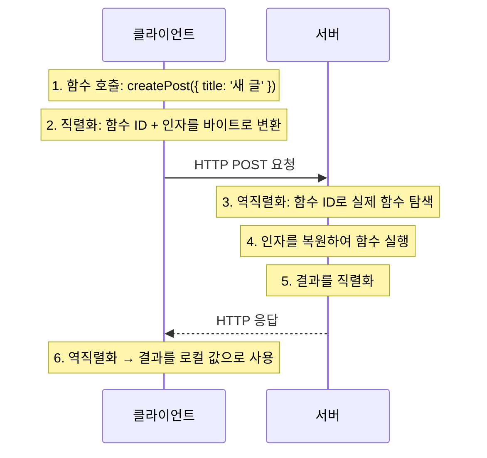
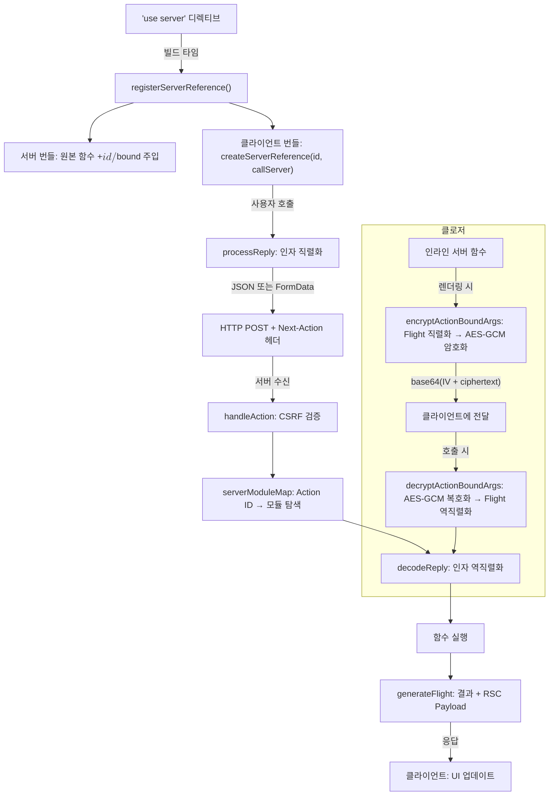

## Table of Contents

## 서론

```tsx
async function createPost(formData: FormData) {
  'use server'
  const title = formData.get('title')
  await db.posts.create({title})
}
```

`"use server"` 한 줄. 이걸 함수 본문 첫 줄에 적는 순간, 이 함수는 더 이상 일반 함수가 아니다. 클라이언트에서 호출할 수 있는 **서버 엔드포인트**가 된다. 전통적인 백엔드에서 라우터를 정의하고, 미들웨어를 설정하고, 요청을 파싱하고, 응답을 직렬화하는 그 모든 과정이 이 한 줄 뒤에 숨어있다.

React 공식 문서에서는 2024년 9월부터 용어를 정리했다[^1].

- **서버 함수(Server Function)**: `"use server"`로 표시된 모든 비동기 함수
- **서버 액션(Server Action)**: 서버 함수 중 `action` prop에 전달되거나, action 내부에서 호출되는 것

즉, 모든 서버 액션은 서버 함수이지만, 모든 서버 함수가 서버 액션인 것은 아니다. 이 글에서는 "서버 함수"라는 공식 용어를 사용한다.

이 글에서는 `"use server"` 한 줄이 만들어내는 모든 것을 파헤친다. 빌드 타임에 코드가 어떻게 변환되는지, 클라이언트에서 호출하면 네트워크에서 무슨 일이 벌어지는지, 인자는 어떻게 직렬화되는지, 클로저 변수는 어떻게 암호화되는지, 그리고 왜 보안에 각별히 신경 써야 하는지까지.

> 이 글의 소스 코드 분석은 **React 19.2**, **Next.js 16.1** 기준이다. 버전에 따라 내부 구현이 달라질 수 있다.

## RPC: 서버 함수의 뿌리

서버 함수를 이해하려면 RPC(Remote Procedure Call)부터 알아야 한다. RPC는 "원격 서버의 함수를 마치 로컬 함수처럼 호출하는 프로토콜"이다.

```ts
// 전통적인 방식: HTTP 요청의 모든 세부사항을 직접 작성
const response = await fetch('/api/posts', {
  method: 'POST',
  headers: {'Content-Type': 'application/json'},
  body: JSON.stringify({title: '새 글', content: '본문'}),
})
const post = await response.json()

// RPC 방식: 네트워크의 존재를 숨긴다
const post = await createPost({title: '새 글', content: '본문'})
```

RPC의 핵심은 네트워크 통신을 **추상화**하는 것이다. 호출하는 쪽은 이 함수가 로컬에서 실행되는지, 지구 반대편 서버에서 실행되는지 알 필요가 없다. 그리고 이 추상화를 가능하게 하는 기술이 **직렬화(Serialization)** 와 **역직렬화(Deserialization)** 다.



gRPC, JSON-RPC, XML-RPC 등이 대표적인 RPC 프로토콜이다. React의 서버 함수도 본질적으로 같은 메커니즘이지만, **Flight Protocol**이라는 자체 직렬화 포맷과 React 컴포넌트 트리가 통합되어 있다는 점이 다르다.

Flight Protocol은 React 팀이 RSC(React Server Components)를 위해 만든 **커스텀 스트리밍 직렬화 포맷**이다. 서버 컴포넌트의 렌더링 결과를 클라이언트로 전송하거나(Server → Client), 서버 함수를 호출할 때 인자와 반환값을 전달하는(Client → Server) 양방향 통신에 사용된다. JSON의 한계(함수, `undefined`, `Date`, 순환 참조 등 미지원)를 넘어서, React 엘리먼트 트리, 서버 참조, Promise, `Map`, `Set` 등을 행 기반 청크(chunk) 단위로 스트리밍할 수 있다. 이 글에서 다루는 `$h`, `$D`, `$n` 같은 접두사 토큰이 모두 Flight Protocol의 인코딩 규칙이다.

### RPC의 오래된 함정: 분산 컴퓨팅의 8가지 오류

RPC는 1984년에 발표된 개념이다. Java RMI, CORBA, DCOM 등 수많은 시도가 있었고, 대부분 실패했다. 왜 실패했을까? 1994년에 정리된 "분산 컴퓨팅의 8가지 오류(Eight Fallacies of Distributed Computing)"[^2]가 핵심을 찌른다. 개발자들이 네트워크에 대해 무의식적으로 가정하는 8가지가 전부 틀렸다는 것이다.

서버 함수와 직접적으로 부딪히는 오류 네 가지를 먼저 보자.

- **"네트워크는 신뢰할 수 있다"** — 서버 함수 호출은 언제든 실패할 수 있다. `try/catch` 없이 호출하면 사용자는 아무 피드백 없이 멈춘 화면을 보게 된다.
- **"지연 시간은 0이다"** — 로컬 함수 호출은 나노초지만, 서버 함수는 밀리초~초 단위다. `for` 루프 안에서 100번 호출하면 100번의 네트워크 왕복이 발생한다.
- **"대역폭은 무한하다"** — 직렬화된 인자와 응답은 크기가 있다. 거대한 객체를 인자로 넘기면 그대로 네트워크 비용이 된다.
- **"네트워크는 안전하다"** — 서버 함수의 인자는 HTTP 요청으로 전달된다. 중간에서 가로챌 수 있고, 조작할 수도 있다.

나머지 네 가지(토폴로지 변화, 관리 주체, 전송 비용, 네트워크 이질성)도 대규모 서비스에서는 무시할 수 없지만, 프론트엔드 개발에서 체감하는 건 위 네 가지다.

React 팀은 이 문제를 알고 있다. 공식 문서에서 서버 함수를 사용할 때 `useActionState`나 `useTransition`과 함께 사용하도록 가이드한다[^1]. pending 상태, 에러 처리, optimistic update 같은 네트워크 고유의 문제를 명시적으로 다루게 하는 것이다. **"네트워크를 숨기되, 네트워크의 특성은 드러낸다"** — 이것이 과거 RPC 실패로부터 배운 교훈이다.

## 빌드 타임 변환: "use server"가 실제로 하는 일

`"use server"` 디렉티브는 런타임에 아무런 효과가 없다. 진짜 일은 **빌드 타임**에 벌어진다.

### registerServerReference: 함수에 메타데이터 찍기

번들러(webpack, Turbopack)가 `"use server"` 디렉티브를 발견하면, React의 `registerServerReference` 함수를 호출해서 해당 함수 객체에 메타데이터를 **프로퍼티로 주입**한다. 이 함수의 실제 구현은 `react-server-dom-webpack` 패키지에 있다[^3].

```js
// react-server-dom-webpack/src/ReactFlightWebpackReferences.js

const SERVER_REFERENCE_TAG = Symbol.for('react.server.reference')

export function registerServerReference(reference, id, exportName) {
  return Object.defineProperties(reference, {
    $$typeof: {value: SERVER_REFERENCE_TAG},
    $$id: {
      value: exportName === null ? id : id + '#' + exportName,
      configurable: true,
    },
    $$bound: {value: null, configurable: true},
    bind: {value: bind, configurable: true},
  })
}
```

핵심은 `Object.defineProperties`다. 원래 함수 객체 위에 세 개의 특수 속성을 덮어쓴다.

| 속성       | 값                                     | 설명                                         |
| ---------- | -------------------------------------- | -------------------------------------------- |
| `$$typeof` | `Symbol.for('react.server.reference')` | 이 함수가 서버 참조임을 식별하는 태그        |
| `$$id`     | `"moduleId#exportName"`                | 서버에서 함수를 찾기 위한 고유 식별자        |
| `$$bound`  | `null`                                 | `.bind()`로 바인딩된 인자들. 초기값은 `null` |

`$$id`의 형식이 중요하다. `moduleId + '#' + exportName`이다. 예를 들어 `app/actions.ts`에서 `createPost`를 export하면, ID는 `"app/actions.ts#createPost"` 같은 형태가 된다. Next.js에서는 이 ID가 해싱되어 **42자 길이의 문자열**로 변환된다.

### 클라이언트/SSR 측의 다른 구현

여기서 주의할 점이 있다. 위 코드는 **RSC 서버 레이어**의 구현이다. 클라이언트/SSR 레이어에는 같은 이름이지만 **완전히 다른 구현**이 존재한다[^4].

```js
// react-client/src/ReactFlightReplyClient.js

function registerBoundServerReference(reference, id, bound, encodeFormAction) {
  knownServerReferences.set(reference, {
    id: id,
    originalBind: reference.bind,
    bound: bound,
  })
  Object.defineProperties(reference, {
    $$FORM_ACTION: {value: encodeFormAction || defaultEncodeFormAction},
    $$IS_SIGNATURE_EQUAL: {value: isSignatureEqual},
    bind: {value: bind},
  })
}
```

두 구현의 차이를 정리하면 다음과 같다.

|                     | RSC 서버 (`ReactFlightWebpackReferences`)         | 클라이언트/SSR (`ReactFlightReplyClient`)                    |
| ------------------- | ------------------------------------------------- | ------------------------------------------------------------ |
| **실행 환경**       | RSC 서버 (Flight 직렬화 시)                       | 브라우저, SSR                                                |
| **메타데이터 저장** | `Object.defineProperties`로 함수에 직접           | `WeakMap`(`knownServerReferences`)에 저장                    |
| **주입하는 속성**   | `$$typeof`, `$$id`, `$$bound`, `bind`             | `$$FORM_ACTION`, `$$IS_SIGNATURE_EQUAL`, `bind`              |
| **목적**            | Flight 직렬화 시 서버 참조 식별 (`$$typeof` 체크) | Progressive Enhancement (`$$FORM_ACTION`), HMR 시그니처 비교 |

RSC 서버는 컴포넌트 트리를 직렬화할 때 `$$typeof === Symbol.for('react.server.reference')`를 확인해서 `$h` 토큰으로 변환한다. 클라이언트/SSR 측은 서버 참조를 직렬화할 필요가 없으므로 `$$typeof`가 불필요하고, 대신 JS 없이 폼을 제출하기 위한 `$$FORM_ACTION`이 필요하다. WeakMap을 쓰는 이유는 함수 객체에 불필요한 프로퍼티를 노출하지 않기 위해서다.

Turbopack도 `react-server-dom-turbopack/src/ReactFlightTurbopackReferences.js`에서 동일한 `$$typeof`/`$$id`/`$$bound` 패턴을 사용한다. 다만, Turbopack은 RSC 레이어와 SSR 레이어를 **같은 청크 파일 안에서 서로 다른 모듈 평가 컨텍스트**로 로드하기 때문에, 빌드 결과물을 정적으로 분석(grep)하면 클라이언트 측의 WeakMap 구현만 보인다. RSC 컨텍스트에서는 `$$typeof` 버전이 런타임에 로드된다.

### .bind() 오버라이드: 바인딩된 인자 누적

서버 함수에 렌더링 시점에 알 수 있는 값을 미리 묶어두고 싶을 때 `.bind()`를 사용한다. 예를 들어, 게시글 목록에서 각 삭제 버튼에 해당 게시글의 ID를 바인딩하는 식이다.

```tsx
// Server Component
export default async function PostList() {
  const posts = await db.posts.findMany()
  return posts.map((post) => (
    <form key={post.id} action={deletePost.bind(null, post.id)}>
      <button type="submit">삭제</button>
    </form>
  ))
}
```

문제는, 일반 `Function.prototype.bind`를 그대로 쓰면 반환된 함수에 `$$typeof`, `$$id` 같은 서버 참조 메타데이터가 사라진다는 점이다. React는 이 메타데이터로 "이 함수가 서버 참조인지"를 판단하므로, `.bind()`의 결과물도 여전히 서버 참조로 인식되어야 한다. 그래서 `registerServerReference`는 `.bind()`를 오버라이드해서, 메타데이터를 유지하면서 바인딩된 인자를 `$$bound` 배열에 **누적**하는 커스텀 구현으로 대체한다. (클라이언트 측에서는 WeakMap의 `bound`에 누적된다.)

```js
// RSC 서버 측: react-server-dom-webpack/src/ReactFlightWebpackReferences.js

function bind() {
  const newFn = FunctionBind.apply(this, arguments)
  if (this.$$typeof === SERVER_REFERENCE_TAG) {
    const args = ArraySlice.call(arguments, 1)
    return Object.defineProperties(newFn, {
      $$typeof: {value: SERVER_REFERENCE_TAG},
      $$id: {value: this.$$id},
      $$bound: {
        value: this.$$bound ? this.$$bound.concat(args) : args,
      },
      bind: {value: bind, configurable: true},
    })
  }
  return newFn
}
```

`.bind()`를 여러 번 체이닝해도 인자가 올바르게 누적된다.

```ts
const fn1 = deletePost.bind(null, userId) // $$bound: [userId]
const fn2 = fn1.bind(null, postId) // $$bound: [userId, postId]
```

### 서버 번들과 클라이언트 번들의 분리

원본 코드가 빌드 타임에 어떻게 분리되는지 구체적으로 보자.

```tsx
// 원본: app/actions.ts
'use server'

export async function createPost(formData: FormData) {
  const title = formData.get('title')
  await db.posts.create({title})
}
```

**서버 번들**: 원본 함수가 그대로 포함되고, `registerServerReference`로 메타데이터가 주입된다.

```js
// 서버 번들
import {registerServerReference} from 'react-server-dom-webpack/server'

async function createPost(formData) {
  const title = formData.get('title')
  await db.posts.create({title})
}

registerServerReference(createPost, 'abc123def456...', 'createPost')
```

**클라이언트 번들**: 함수 본문이 완전히 제거되고, `createServerReference`로 프록시 함수가 생성된다.

```js
// 클라이언트 번들
import {createServerReference} from 'react-server-dom-webpack/client'

export const createPost = createServerReference(
  'abc123def456...#createPost',
  callServer, // 프레임워크(Next.js)가 제공하는 콜백
)
```

`db.posts.create`도, `formData.get`의 로직도 클라이언트 번들에는 존재하지 않는다. 클라이언트가 받는 것은 서버로 HTTP 요청을 보내는 **프록시 함수**뿐이다.

## 클라이언트의 서버 참조: callServer의 정체

클라이언트에서 서버 함수를 호출하면 실제로 무슨 일이 벌어지는가? 위에서 본 `createServerReference`의 구현을 살펴보자.

```js
// react-client/src/ReactFlightReplyClient.js

export function createServerReference(id, callServer, encodeFormAction) {
  let action = function () {
    const args = Array.prototype.slice.call(arguments)
    return callServer(id, args)
  }
  registerBoundServerReference(action, id, null, encodeFormAction)
  return action
}
```

놀랍도록 단순하다. 서버 함수를 호출하면 **인자를 배열로 수집**하고, `callServer(id, args)`를 호출하는 것이 전부다.

`callServer`는 React가 아닌 **프레임워크(Next.js)가 주입하는 콜백**이다[^4]. React의 Flight 클라이언트를 초기화할 때 전달한다.

```js
// React Flight 클라이언트 초기화 시
this._callServer = callServer !== undefined ? callServer : missingCall

function missingCall() {
  throw new Error(
    'Trying to call a function from "use server" but the callServer ' +
      'option was not implemented in your router runtime.',
  )
}
```

`callServer`가 없으면 에러가 난다. Next.js 없이 React만으로는 서버 함수를 호출할 수 없다는 뜻이다. React는 프로토콜을 정의하고, Next.js가 구현한다.

### 바운드 인자가 있는 경우

`.bind()`나 클로저로 바인딩된 인자가 있으면 `createBoundServerReference`가 사용된다. 이 경우 바운드 인자를 호출 시점의 인자 앞에 붙인다.

```js
// react-client/src/ReactFlightReplyClient.js

export function createBoundServerReference(metaData, callServer) {
  const {id, bound} = metaData

  let action = function () {
    const args = Array.prototype.slice.call(arguments)
    const p = bound

    if (!p) {
      return callServer(id, args)
    }

    // bound는 Promise<Array<any>>
    if (p.status === 'fulfilled') {
      const boundArgs = p.value
      return callServer(id, boundArgs.concat(args))
    }

    return Promise.resolve(p).then(function (boundArgs) {
      return callServer(id, boundArgs.concat(args))
    })
  }

  registerBoundServerReference(action, id, bound)
  return action
}
```

`bound`가 `Promise`인 이유는 클로저 변수의 복호화가 비동기 작업이기 때문이다(뒤에서 상세히 다룬다). `p.status === 'fulfilled'` 체크는 이미 resolve된 Promise를 동기적으로 처리하는 최적화다.

## 인자 직렬화: processReply

클라이언트에서 서버 함수를 호출하면, 인자가 네트워크를 통해 전달되어야 한다. 이 직렬화를 담당하는 것이 `processReply` 함수다.

### JSON vs FormData: 두 가지 경로

`processReply`는 인자의 복잡도에 따라 두 가지 방식으로 직렬화한다.

```js
// react-client/src/ReactFlightReplyClient.js

export function processReply(
  root,
  formFieldPrefix,
  temporaryReferences,
  resolve,
  reject,
) {
  let nextPartId = 1
  let pendingParts = 0
  let formData = null

  const json = serializeModel(root, 0)

  if (formData === null) {
    resolve(json) // 단순한 경우: JSON 문자열
  } else {
    formData.set(formFieldPrefix + '0', json)
    if (pendingParts === 0) {
      resolve(formData) // 복잡한 경우: FormData
    }
  }
}
```

**JSON 경로**: 인자가 원시 타입, 배열, 일반 객체만으로 구성된 경우. 가장 가볍다.

```
// incrementLike(42) 호출 시
"42"
```

**FormData 경로**: Blob, ReadableStream, 다른 서버 참조 등 복잡한 타입이 포함된 경우. `FormData`의 각 파트에 개별 값을 넣는다.

```
------WebKitFormBoundary
Content-Disposition: form-data; name="0"
42
------WebKitFormBoundary
Content-Disposition: form-data; name="1"
[Blob data]
------WebKitFormBoundary--
```

### Flight Protocol의 $ 접두사 토큰

`serializeModel` 내부에서 JSON으로 표현할 수 없는 값들은 `$` 접두사가 붙은 특수 토큰으로 인코딩된다. 실제 React 소스에서 사용되는 전체 토큰 테이블이다.

| 토큰            | 의미             | 예시                         |
| --------------- | ---------------- | ---------------------------- |
| `$` + hex       | 인라인 참조      | `$3` → 3번 청크 참조         |
| `$@` + hex      | Promise          | 비동기 값                    |
| `$h` + hex      | 서버 참조        | `$h5` → 5번 청크의 서버 함수 |
| `$K` + hex      | FormData         |                              |
| `$Q` + hex      | Map              |                              |
| `$W` + hex      | Set              |                              |
| `$B` + hex      | Blob             |                              |
| `$A` + hex      | ArrayBuffer      |                              |
| `$R` + hex      | ReadableStream   |                              |
| `$D` + dateJSON | Date             | `$D2026-03-09T00:00:00.000Z` |
| `$n` + digits   | BigInt           | `$n12345678901234567890`     |
| `$S` + name     | Symbol.for()     | `$Smy-symbol`                |
| `$-0`           | -0 (음의 영)     |                              |
| `$Infinity`     | Infinity         |                              |
| `$-Infinity`    | -Infinity        |                              |
| `$NaN`          | NaN              |                              |
| `$undefined`    | undefined        |                              |
| `$$`            | 이스케이프된 `$` | 문자열에 `$`가 포함된 경우   |

JSON이 표현할 수 없는 `undefined`, `NaN`, `Infinity`, `-0`, `BigInt`, `Date` 등을 모두 커버한다. 일반적인 JSON-RPC보다 타입 지원 범위가 훨씬 넓다.

### 서버 함수를 인자로 전달할 때

서버 함수 자체를 다른 서버 함수의 인자로 전달할 수 있다. 이 경우 `knownServerReferences` WeakMap에서 해당 함수의 ID와 바운드 인자를 찾아 `$h` 토큰으로 직렬화한다.

```js
// resolveToJSON 내부
if (typeof value === 'function') {
  const referenceClosure = knownServerReferences.get(value)
  if (referenceClosure !== undefined) {
    const {id, bound} = referenceClosure
    const json = JSON.stringify({id, bound}, resolveToJSON)
    if (formData === null) {
      formData = new FormData()
    }
    const refId = nextPartId++
    formData.set(formFieldPrefix + refId, json)
    return serializeServerReferenceID(refId) // "$h" + hex
  }
}
```

직렬화 불가능한 일반 함수(서버 함수가 아닌)를 전달하면 에러가 난다.

### 직렬화 가능/불가능 타입 정리

**직렬화 가능**:

| 타입                                                         | 비고                            |
| ------------------------------------------------------------ | ------------------------------- |
| `string`, `number`, `bigint`, `boolean`, `undefined`, `null` | 원시 타입                       |
| `Symbol.for('name')`                                         | 전역 레지스트리에 등록된 심볼만 |
| `Array`, `Map`, `Set`, `TypedArray`, `ArrayBuffer`           | 이터러블                        |
| `Date`, `FormData`, `Promise`                                | 내장 객체                       |
| 일반 객체 (`{}`, `{ key: value }`)                           | object initializer로 생성된 것  |
| 서버 함수                                                    | `"use server"`로 표시된 함수    |

**직렬화 불가능**:

| 타입                                         | 이유                           |
| -------------------------------------------- | ------------------------------ |
| 일반 함수, 화살표 함수                       | 코드는 네트워크를 넘을 수 없다 |
| 클래스 인스턴스                              | 프로토타입 체인 복원 불가      |
| React 엘리먼트 (JSX)                         | 컴포넌트 함수 포함             |
| DOM 이벤트 객체                              | 순환 참조, 네이티브 객체       |
| null 프로토타입 객체 (`Object.create(null)`) |                                |
| 전역 레지스트리에 없는 `Symbol()`            |                                |

```tsx
// ❌ 이벤트 객체 전달 불가
<button onClick={(e) => serverFn(e)}>

// ✅ 필요한 값만 전달
<button onClick={() => serverFn(someId)}>
```

## 서버 측 처리: Next.js의 Action Handler

클라이언트에서 보낸 POST 요청이 서버에 도착하면, Next.js의 `handleAction` 함수가 전체 라이프사이클을 처리한다.

### 1단계: 요청 감지

```ts
// next/src/server/app-render/server-action-request-meta.ts

function getServerActionRequestMetadata(req) {
  const actionId = req.headers.get('next-action') // Action ID
  const contentType = req.headers.get('content-type')

  const isFetchAction = actionId && req.method === 'POST'
  const isMultipartAction =
    req.method === 'POST' && contentType?.startsWith('multipart/form-data')
  const isURLEncodedAction =
    req.method === 'POST' && contentType === 'application/x-www-form-urlencoded'

  return {actionId, isFetchAction, isMultipartAction, isURLEncodedAction}
}
```

서버 함수 요청은 두 가지 경로로 들어온다.

- **Fetch Action (SPA)**: JavaScript가 로드된 상태에서 호출. `Next-Action` 헤더에 Action ID가 있다.
- **MPA Action (Progressive Enhancement)**: JavaScript 없이 폼 제출. `Next-Action` 헤더가 없고, FormData 안에 `$ACTION_ID_<hash>` 필드가 있다.

### 2단계: CSRF 보호

```ts
// next/src/server/app-render/csrf-protection.ts

const originDomain = new URL(originHeader).host
const host = parseHostHeader(req.headers) // X-Forwarded-Host 우선, Host 차선

if (!originDomain) {
  // 경고만 — 오래된 브라우저는 Origin을 안 보낼 수 있다
} else if (!host || originDomain !== host.value) {
  if (isCsrfOriginAllowed(originDomain, serverActions?.allowedOrigins)) {
    // next.config.js의 allowedOrigins에 허용된 도메인
  } else {
    throw new Error('Invalid Server Actions request.') // CSRF 차단
  }
}
```

`Origin` 헤더와 `Host` 헤더(또는 `X-Forwarded-Host`)를 비교한다[^5]. 불일치하면 요청을 거부한다. `isCsrfOriginAllowed`는 `*.example.com` 같은 와일드카드 도메인 매칭을 지원해서 리버스 프록시 환경을 수용한다.

CSRF 토큰은 사용하지 않는다. POST 전용 + Origin 검증으로 대부분의 CSRF를 막지만, **XSS가 있으면 같은 origin에서 서버 함수를 호출할 수 있다**는 점에 주의해야 한다.

### 3단계: Action ID → 함수 탐색

Action ID로 실제 함수를 찾는 과정이다.

```ts
// next/src/server/app-render/action-handler.ts

function getActionModIdOrError(actionId, serverModuleMap) {
  const actionModId = serverModuleMap[actionId]?.id

  if (!actionModId) {
    throw getActionNotFoundError(actionId) // 배포 스큐 or 잘못된 요청
  }

  return actionModId
}

// 함수 로드
const actionMod = await ComponentMod.__next_app__.require(actionModId)
const actionHandler = actionMod[actionId]
```

`serverModuleMap`은 빌드 타임에 생성되는 **매니페스트**다[^6]. Action ID(42자 해시)를 모듈 경로로 매핑한다. 이 매핑이 존재하지 않으면 — 이전 빌드의 ID로 새 서버에 요청한 경우 — `getActionNotFoundError`가 던져진다. 이것이 **버전 스큐(version skew)** 문제다.

버전 스큐는 배포 직후에 자주 발생한다. 사용자가 이전 빌드의 HTML(이전 Action ID가 박힌 폼)을 보고 있는 상태에서 서버는 새 빌드로 교체된 경우다. 여기에 클로저 암호화 키까지 빌드마다 달라지므로, 이전 빌드에서 암호화된 바운드 인자도 복호화할 수 없다.

프로덕션에서 이 문제를 다루는 방법은 여러 가지다.

- **Skew Protection**: Vercel은 배포 시 이전 빌드를 즉시 내리지 않고 일정 시간 유지해서, 진행 중인 요청이 올바른 빌드로 라우팅되도록 한다.
- **`NEXT_SERVER_ACTIONS_ENCRYPTION_KEY`**: 이 환경 변수로 암호화 키를 빌드 간에 고정하면, 클로저 복호화 실패는 방지할 수 있다. 다만 Action ID 자체가 달라지는 문제는 해결하지 못한다.
- **Blue-Green 배포**: 새 빌드를 별도 환경에 올린 뒤 트래픽을 한 번에 전환한다. 전환 순간의 in-flight 요청만 실패할 수 있으므로, 전환 시점을 트래픽이 적은 때로 잡는다.
- **클라이언트 측 재시도**: 서버 함수 호출이 실패하면 `router.refresh()`로 페이지를 새로고침하여 새 빌드의 Action ID를 받아오는 패턴을 적용할 수 있다.

### 4단계: 인자 역직렬화 및 실행

```ts
// Fetch Action의 경우
const args = await decodeReply(requestBody, serverModuleMap)
const result = await actionHandler.apply(null, args)
```

`decodeReply`는 React의 Flight 역직렬화 함수로, `processReply`의 역과정이다. `$D`, `$n`, `$h` 등의 토큰을 원래 타입으로 복원한다.

### 5단계: 응답 생성

함수 실행이 끝나면 결과와 함께 **업데이트된 UI**도 하나의 응답으로 반환한다.

```ts
// revalidation이 발생한 경우
const flightResponse = await generateFlight({
  actionResult: result,
  // 변경된 페이지의 RSC Payload도 포함
})
```

이것이 서버 함수의 핵심적인 이점이다. 전통적인 API에서는 "변경 → refetch → UI 갱신"이 3단계였지만, 서버 함수에서는 **한 번의 왕복**으로 끝난다.

### 요청/응답 헤더 전체 정리

| 헤더                        | 방향 | 용도                                             |
| --------------------------- | ---- | ------------------------------------------------ |
| `Next-Action`               | 요청 | Action ID (42자 해시)                            |
| `Content-Type`              | 요청 | `multipart/form-data` 또는 `text/plain`          |
| `Origin`                    | 요청 | CSRF 보호 (Host와 비교)                          |
| `Host` / `X-Forwarded-Host` | 요청 | CSRF 보호 (Origin과 비교)                        |
| `Cache-Control`             | 응답 | `no-cache, no-store, max-age=0, must-revalidate` |
| `x-action-redirect`         | 응답 | 리다이렉트 URL + 타입                            |
| `x-next-revalidated`        | 응답 | 캐시 무효화 지시                                 |

`Cache-Control`이 항상 `no-store`인 점에 주목하자. 서버 함수의 응답은 절대 캐싱되지 않는다. mutation의 결과를 캐싱하면 안 되기 때문이다.

## 클로저 암호화: AES-GCM의 세계

Server Component 안에서 인라인으로 정의한 서버 함수가 외부 변수를 캡처할 때, 이 클로저 변수는 암호화되어 클라이언트를 경유한다. Next.js의 실제 구현을 파헤쳐보자.

### 왜 암호화가 필요한가

```tsx
export default async function AdminPage() {
  const secretConfig = await getSecretConfig()

  async function updateConfig(formData: FormData) {
    'use server'
    // secretConfig를 클로저로 캡처
    await db.config.update(secretConfig.id, {
      value: formData.get('value'),
    })
  }

  return <form action={updateConfig}>...</form>
}
```

`secretConfig`는 서버에서만 존재해야 하는 비밀 데이터다. 그런데 서버 함수의 동작 방식상, 클로저 변수는 클라이언트로 전송되었다가 호출 시 다시 서버로 돌아와야 한다. 암호화 없이는 브라우저 DevTools에서 `secretConfig`의 내용을 볼 수 있다.

### 암호화 구현: AES-GCM

Next.js는 Web Crypto API의 **AES-GCM**을 사용한다[^7]. 인증된 암호화(authenticated encryption) 방식으로, 기밀성과 무결성을 동시에 보장한다.

```ts
// next/src/server/app-render/encryption-utils.ts

export function encrypt(key: CryptoKey, iv: Uint8Array, data: Uint8Array) {
  return crypto.subtle.encrypt({name: 'AES-GCM', iv}, key, data)
}

export function decrypt(key: CryptoKey, iv: Uint8Array, data: Uint8Array) {
  return crypto.subtle.decrypt({name: 'AES-GCM', iv}, key, data)
}
```

### 암호화 키의 출처

```ts
// next/src/server/app-render/encryption-utils.ts

export async function getActionEncryptionKey() {
  if (__next_loaded_action_key) {
    return __next_loaded_action_key
  }

  const rawKey =
    process.env.NEXT_SERVER_ACTIONS_ENCRYPTION_KEY ||
    serverActionsManifest.encryptionKey // 빌드 시 자동 생성

  __next_loaded_action_key = await crypto.subtle.importKey(
    'raw',
    stringToUint8Array(atob(rawKey)), // base64 디코딩
    'AES-GCM',
    true,
    ['encrypt', 'decrypt'],
  )

  return __next_loaded_action_key
}
```

키는 두 가지 소스 중 하나에서 온다.

1. `NEXT_SERVER_ACTIONS_ENCRYPTION_KEY` 환경 변수 (수동 설정)
2. `serverActionsManifest.encryptionKey` (빌드 시 자동 생성)

빌드할 때마다 새 키가 생성되므로, 이전 빌드에서 암호화된 클로저는 새 빌드의 서버에서 복호화할 수 없다. 이것이 앞서 다룬 버전 스큐 문제의 암호화 측면이다. 여러 버전이 동시에 서빙되는 배포 환경에서는 `NEXT_SERVER_ACTIONS_ENCRYPTION_KEY`를 명시적으로 설정해서 빌드 간 키를 고정해야 한다. 단, 키를 고정하면 보안과 편의 사이의 트레이드오프가 생기므로, 키 로테이션 주기를 별도로 관리하는 것이 권장된다.

### 암호화 과정: encodeActionBoundArg

실제 암호화 과정을 단계별로 보자.

```ts
// next/src/server/app-render/encryption.ts

async function encodeActionBoundArg(actionId: string, arg: string) {
  const key = await getActionEncryptionKey()

  // 1. 16바이트 랜덤 IV 생성
  const iv = new Uint8Array(16)
  crypto.getRandomValues(iv)

  // 2. actionId를 평문 앞에 붙여서 암호화
  //    → 복호화 시 actionId가 일치하는지 검증 (무결성 체크)
  const encrypted = await encrypt(key, iv, textEncoder.encode(actionId + arg))

  // 3. base64(IV + 암호문) 형태로 반환
  return btoa(arrayBufferToString(iv.buffer) + arrayBufferToString(encrypted))
}
```

와이어 포맷: `base64(IV_16bytes + AES_GCM_ciphertext)`

`actionId`를 평문 앞에 붙이는 것이 핵심이다. AES-GCM 자체에도 무결성 검증이 있지만, actionId를 평문에 포함시켜서 **"이 암호문이 정말 이 Action ID용인지"** 를 추가로 검증한다. 다른 서버 함수의 암호화된 클로저를 이 서버 함수에 붙여넣는 공격을 방지한다.

### 복호화 과정: decodeActionBoundArg

```ts
async function decodeActionBoundArg(actionId: string, arg: string) {
  const key = await getActionEncryptionKey()

  // 1. base64 디코딩 → IV(16바이트) + 암호문 분리
  const payload = atob(arg)
  const iv = stringToUint8Array(payload.slice(0, 16))
  const ciphertext = stringToUint8Array(payload.slice(16))

  // 2. 복호화
  const decrypted = textDecoder.decode(await decrypt(key, iv, ciphertext))

  // 3. actionId 접두사 검증
  if (!decrypted.startsWith(actionId)) {
    throw new Error('Invalid Server Action payload: failed to decrypt.')
  }

  // 4. actionId 제거 → 원본 직렬화 데이터
  return decrypted.slice(actionId.length)
}
```

### 직렬화 계층: Flight Protocol 사용

클로저 변수의 암호화/복호화는 **React Flight Protocol** 위에서 동작한다. 변수를 바이트로 변환하는 것이 아니라, Flight의 `renderToReadableStream`/`createFromReadableStream`으로 직렬화/역직렬화한다.

```ts
// 암호화 시
export const encryptActionBoundArgs = React.cache(async function (
  actionId,
  ...args
) {
  // 1. Flight Protocol로 직렬화
  const serialized = await streamToString(
    renderToReadableStream(args, clientModules),
  )
  // 2. AES-GCM으로 암호화
  return await encodeActionBoundArg(actionId, serialized)
})

// 복호화 시
export async function decryptActionBoundArgs(actionId, encryptedPromise) {
  const encrypted = await encryptedPromise
  // 1. AES-GCM으로 복호화
  const decrypted = await decodeActionBoundArg(actionId, encrypted)
  // 2. Flight Protocol로 역직렬화
  return await createFromReadableStream(
    new ReadableStream({
      start(controller) {
        controller.enqueue(textEncoder.encode(decrypted))
        controller.close()
      },
    }),
    {
      serverConsumerManifest: {
        /* module maps */
      },
    },
  )
}
```

Flight Protocol을 사용하는 이유는 클로저 변수에 서버 참조, Date, Map 등 JSON으로 표현할 수 없는 타입이 포함될 수 있기 때문이다.

`React.cache`로 래핑되어 있어서 같은 렌더링 패스 내에서 참조가 동일한 인자로 호출될 때 캐싱된다. 다만 `React.cache`는 인자의 참조 동일성(`Object.is`)으로 비교하므로, 매 렌더링마다 새로 생성되는 객체가 인자에 포함되면 캐시 히트가 발생하지 않는다. 모듈 스코프의 서버 함수처럼 클로저가 없는 경우에 가장 효과적이다.

### .bind()는 암호화되지 않는다

`.bind()`로 전달된 값은 암호화되지 않는다. `ReactFlightWebpackReferences.js`의 `bind` 구현[^3]을 보면 바운드 인자를 `$$bound` 배열에 누적할 뿐, 암호화 경로를 타지 않는다. React 팀의 공식 언급은 찾지 못했지만, 소스 코드 구조상 의도된 동작으로 보인다.

```tsx
// 클로저 — 암호화됨
async function deletePost() {
  'use server'
  await db.posts.delete(post.id) // post.id는 암호화되어 전달
}

// .bind() — 암호화 안 됨
const deletePostWithId = deletePost.bind(null, post.id)
// post.id가 클라이언트에 평문으로 노출됨
```

|        | 클로저                  | `.bind()`     |
| ------ | ----------------------- | ------------- |
| 암호화 | ✅ AES-GCM              | ❌ 평문       |
| 성능   | 암호화/복호화 오버헤드  | 오버헤드 없음 |
| 용도   | 민감한 데이터 포함 가능 | 공개 데이터만 |

`.bind()`로 비밀 토큰을 전달하면 클라이언트에 그대로 노출된다. 비밀 값이 필요하면 클로저를 사용하거나, 서버 함수 내부에서 직접 읽어야 한다.

## Progressive Enhancement: JS 없이도 동작하는 폼

서버 함수와 `<form>`의 조합에서 가장 중요한 특성은 JavaScript 없이도 동작한다는 것이다. 이것이 어떻게 구현되는지 보자.

### MPA Action: HTML에 Action ID 숨기기

JavaScript가 로드되기 전에 폼을 제출하면, 브라우저는 일반 HTML 폼 제출을 수행한다. 이때 `Next-Action` 헤더를 보낼 수 없으므로, Action ID를 **FormData 안에** 숨긴다.

```html
<!-- 서버에서 렌더링된 HTML (개념적) -->
<form method="POST" action="/posts">
  <input type="hidden" name="$ACTION_ID_abc123def456..." value="" />
  <input type="text" name="title" />
  <button type="submit">작성</button>
</form>
```

Next.js에서 사용하는 특수 FormData 필드명:

| 필드 접두사    | 용도                                     |
| -------------- | ---------------------------------------- |
| `$ACTION_ID_`  | 바인딩 없는 서버 함수의 Action ID (42자) |
| `$ACTION_REF_` | 바인딩이 있는 서버 함수의 참조           |

서버에서 이 요청을 받으면, `Next-Action` 헤더가 없으므로 FormData에서 `$ACTION_ID_`로 시작하는 필드를 찾아 Action ID를 추출한다.

### Hydration 전 제출 큐잉

JavaScript가 로딩 중(hydration 전)에 사용자가 폼을 제출하면, React는 이를 큐에 넣고 hydration이 완료되면 **재생(replay)** 한다.

```
1. 서버에서 HTML 렌더링 → 브라우저에 전송
2. 사용자가 즉시 폼 제출 (JS 아직 미로드)
3. 제출이 큐에 저장됨
4. JavaScript 로드 + hydration 완료
5. 큐에 쌓인 제출을 순서대로 처리
```

이 때문에 서버 함수를 사용한 폼은 "로딩 중에 제출해도 안전하다"는 보장이 있다. `useActionState`의 세 번째 인자(permalink)를 사용하면, hydration이 완료되기 전에 제출된 경우 해당 URL로 리다이렉트해서 결과를 보여줄 수도 있다.

## 폼과의 통합: useActionState와 useTransition

### useActionState: 상태와 액션의 연결

`useActionState`는 서버 함수의 반환값을 상태로 관리하고, pending 상태를 추적한다.

```tsx
'use client'

import {useActionState} from 'react'
import {createPost} from '@/app/actions'

function PostForm() {
  const [state, submitAction, isPending] = useActionState(createPost, null)

  return (
    <form action={submitAction}>
      <input type="text" name="title" disabled={isPending} />
      <button type="submit" disabled={isPending}>
        {isPending ? '작성 중...' : '작성'}
      </button>
      {state?.error && <p>{state.error}</p>}
    </form>
  )
}
```

```ts
'use server'

export async function createPost(previousState: any, formData: FormData) {
  const title = formData.get('title') as string
  if (!title) {
    return {error: '제목을 입력해주세요'}
  }
  await db.posts.create({title})
  return {error: null}
}
```

`useActionState`를 사용하면 서버 함수의 시그니처가 바뀐다. 첫 번째 인자로 **이전 상태**(previous state)가 추가된다. React가 내부적으로 이전 호출의 반환값을 저장해두었다가, 다음 호출 시 첫 번째 인자로 주입한다.

### useTransition: 폼 밖에서의 호출

폼이 아닌 이벤트 핸들러에서 서버 함수를 호출할 때는 `startTransition`으로 감싸야 한다.

```tsx
'use client'

import {useState, useTransition} from 'react'
import {incrementLike} from '@/app/actions'

function LikeButton({postId}: {postId: number}) {
  const [likes, setLikes] = useState(0)
  const [isPending, startTransition] = useTransition()

  return (
    <button
      disabled={isPending}
      onClick={() => {
        startTransition(async () => {
          const updatedLikes = await incrementLike(postId)
          setLikes(updatedLikes)
        })
      }}
    >
      {isPending ? '...' : `좋아요 ${likes}`}
    </button>
  )
}
```

`<form action>`은 내부적으로 자동으로 transition을 사용한다. 이벤트 핸들러에서는 명시적으로 감싸야 한다. 빼먹으면 pending 상태를 추적할 수 없고, 에러 바운더리도 제대로 동작하지 않는다.

## Next.js 프레임워크 통합

### revalidation: 한 번의 왕복으로 변경과 갱신

```ts
'use server'

import {revalidatePath} from 'next/cache'

export async function createPost(formData: FormData) {
  await db.posts.create({title: formData.get('title') as string})
  revalidatePath('/posts')
}
```

`revalidatePath`를 호출하면 서버 함수의 응답에 업데이트된 RSC Payload가 포함된다. 클라이언트는 이 한 번의 응답으로 데이터 변경 결과와 UI 갱신을 동시에 처리한다.

### redirect: 제어 흐름 예외

```ts
'use server'

import {redirect} from 'next/navigation'
import {revalidatePath} from 'next/cache'

export async function createPost(formData: FormData) {
  const post = await db.posts.create({title: formData.get('title') as string})
  revalidatePath('/posts')
  redirect(`/posts/${post.id}`)
}
```

`redirect`는 내부적으로 예외를 throw한다. 이후의 코드는 실행되지 않으므로 `revalidatePath`는 **반드시 `redirect` 전에** 호출해야 한다. Next.js의 action handler는 이 예외를 잡아서 `x-action-redirect` 헤더로 변환한다.

### 순차 실행: 클라이언트 단위의 큐잉

서버 함수의 순차 실행은 **서버 전체가 아니라 개별 클라이언트(브라우저 탭) 단위**의 동작이다. 정확히 말하면, React의 클라이언트 런타임이 서버 함수 호출을 **하나씩 디스패치**한다. 서버가 첫 번째 요청의 응답을 반환하기 전에 두 번째 요청을 보내지 않는다.

```
사용자 A의 브라우저:  [action1] ──완료──> [action2] ──완료──> [action3]
사용자 B의 브라우저:  [action1] ──완료──> [action2]
                     ↑ 서로 독립적으로 병렬 처리됨
```

서버 입장에서 사용자 A와 사용자 B의 요청은 동시에 처리된다. 순차 실행은 **같은 브라우저 탭 내**에서만 적용된다. 사용자가 좋아요 버튼을 빠르게 3번 클릭하면, React가 클라이언트 측에서 두 번째/세 번째 호출을 큐에 넣고 첫 번째 응답이 돌아온 뒤에 순서대로 보낸다.

이것은 **React 클라이언트 런타임의 구현 세부사항**이라 향후 변경될 수 있다. 현재로서는 하나의 탭에서 서버 함수를 병렬 호출할 수 없으므로, 병렬 처리가 필요하면 하나의 서버 함수 안에서 `Promise.all`을 사용해야 한다.

```ts
'use server'

// ❌ 클라이언트에서 동시 호출해도 순차 처리됨
// await Promise.all([publishPost(1), publishPost(2), publishPost(3)])

// ✅ 하나의 서버 함수 안에서 병렬 처리
export async function batchPublish(ids: number[]) {
  await Promise.all(ids.map((id) => db.posts.publish(id)))
}
```

## 보안: 모든 입력은 적대적이다

서버 함수는 본질적으로 **공개 API 엔드포인트**다. `"use server"`를 적는 순간, 그 함수는 누구든 HTTP 요청으로 호출할 수 있다.

```bash
curl -X POST https://your-app.com/posts \
  -H "Next-Action: abc123def456..." \
  -H "Content-Type: multipart/form-data" \
  -F "0=악의적인 데이터"
```

### 입력 검증: TypeScript 타입은 런타임에 없다

```ts
'use server'

// ❌ TypeScript 타입을 신뢰
export async function deletePost(id: number) {
  await db.posts.delete(id) // id에 문자열이 올 수도 있다
}

// ✅ 런타임 검증
import {z} from 'zod'

const schema = z.object({id: z.number().int().positive()})

export async function deletePost(id: unknown) {
  const {id: validId} = schema.parse({id})
  await db.posts.delete(validId)
}
```

### 인증/인가: "인증된 페이지에서만 호출되니까" 는 위험하다

서버 함수는 페이지와 독립적으로 호출할 수 있다. 미들웨어에서 페이지 접근을 차단해도, 서버 함수는 직접 POST 요청으로 호출 가능하다. **서버 함수 내부에서 반드시 인증/인가를 확인**해야 한다.

```ts
'use server'

import {getCurrentUser} from '@/lib/auth'

export async function deletePost(id: number) {
  const user = await getCurrentUser()
  if (!user) throw new Error('인증이 필요합니다')

  const post = await db.posts.get(id)
  if (post.authorId !== user.id && !user.isAdmin) {
    throw new Error('권한이 없습니다')
  }

  await db.posts.delete(id)
}
```

### Data Access Layer: 보안의 단일 관문

서버 함수에서 직접 DB를 호출하는 대신, 별도의 데이터 접근 레이어를 두는 것이 권장된다[^8].

```ts
// data/posts.ts
import 'server-only'
import {getCurrentUser} from './auth'

export async function deletePostById(id: number) {
  const user = await getCurrentUser()
  if (!user) throw new Error('Unauthorized')

  const post = await db.posts.get(id)
  if (post.authorId !== user.id && !user.isAdmin) {
    throw new Error('Forbidden')
  }

  await db.posts.delete(id)
}
```

```ts
// app/actions.ts
'use server'

import {deletePostById} from '@/data/posts'

export async function deletePost(id: number) {
  await deletePostById(id) // 인증/인가는 데이터 레이어에서 처리
}
```

보안 감사의 범위가 데이터 레이어로 좁아진다. 서버 함수가 100개여도 보안 로직은 한 곳에서 관리할 수 있다.

### 에러 메시지: 프로덕션에서는 자동으로 숨겨진다

프로덕션 모드에서 React는 서버의 에러 메시지를 클라이언트에 전달하지 않는다[^9]. 에러를 식별하는 해시만 전달한다. `[credit card number] is not a valid phone number` 같은 메시지가 노출되는 것을 방지한다.

개발 모드에서는 에러가 그대로 클라이언트에 전달된다. **프로덕션은 반드시 프로덕션 모드로 실행해야 한다.**

### server-only: 경계 누출 방지

```ts
import 'server-only'

export async function getSecretData() {
  return process.env.SECRET_KEY
}
```

이 모듈을 Client Component에서 import하면 빌드 에러가 난다. `"use server"`가 서버 함수의 경계를 만들어주지만, 서버 함수가 호출하는 유틸리티 함수에는 `server-only`를 명시하는 것이 안전하다.

## 서버 함수는 데이터 페칭용이 아니다

서버 함수는 **mutation(변경)** 을 위해 설계되었다[^1].

```tsx
// ❌ 서버 함수로 데이터 페칭
'use server'
export async function getPosts() {
  return await db.posts.findMany()
}

// 클라이언트에서
useEffect(() => {
  getPosts().then(setPosts)
}, [])
```

이 패턴의 문제:

1. **순차 실행**: 여러 데이터를 동시에 가져올 수 없다.
2. **캐싱 불가**: POST 요청이므로 브라우저/CDN 캐싱이 안 된다.
3. **반환값 미캐싱**: 프레임워크가 서버 함수의 반환값을 캐싱하지 않는다.
4. **워터폴**: 클라이언트 렌더링 → useEffect → 서버 요청 → 응답 → 재렌더링. Server Component에서 직접 데이터를 가져오면 이 워터폴이 사라진다.

```tsx
// ✅ Server Component에서 직접 데이터 페칭
export default async function PostsPage() {
  const posts = await db.posts.findMany()
  return <PostList posts={posts} />
}
```

서버 함수의 역할은 명확하다: **사용자의 행위에 의한 서버 상태 변경.** 폼 제출, 좋아요, 삭제, 업데이트. 이 범위를 벗어나면 더 적합한 도구가 있다.

## Flight Protocol에서 서버 함수는 어떻게 표현되는가

Server Component가 서버 함수를 Client Component의 prop으로 전달할 때, Flight 스트림에서 서버 함수가 어떻게 인코딩되는지 보자.

### 서버 측: serializeServerReference

`ReactFlightServer.js`[^10]에서 함수 값을 만나면, `isServerReference`로 서버 참조 여부를 확인한다.

```js
// react-server/src/ReactFlightServer.js

if (typeof value === 'function') {
  if (isClientReference(value)) {
    return serializeClientReference(request, parent, parentPropertyName, value)
  }
  if (isServerReference(value)) {
    return serializeServerReference(request, value)
  }
  // 서버 참조도 클라이언트 참조도 아닌 함수 → 에러
}
```

`isServerReference`는 단순히 `$$typeof` 속성을 확인한다.

```js
export function isServerReference(reference) {
  return reference.$$typeof === Symbol.for('react.server.reference')
}
```

`serializeServerReference`는 함수의 `$$id`와 `$$bound`를 메타데이터 객체로 만들고, **별도의 Flight 청크로 아웃라인**한다.

```js
function serializeServerReference(request, serverReference) {
  const existingId = request.writtenServerReferences.get(serverReference)
  if (existingId !== undefined) {
    return '$h' + existingId.toString(16) // 이미 처리된 참조 재사용
  }

  const id = getServerReferenceId(request.bundlerConfig, serverReference)
  const bound = getServerReferenceBoundArguments(
    request.bundlerConfig,
    serverReference,
  )

  const metadata = {
    id,
    bound: bound === null ? null : Promise.resolve(bound),
  }

  const metadataId = outlineModel(request, metadata)
  request.writtenServerReferences.set(serverReference, metadataId)

  return '$h' + metadataId.toString(16)
}
```

실제 Flight 스트림에서는 이런 형태가 된다.

```
5:{"id":"abc123#deletePost","bound":null}
0:["$","form",null,{"action":"$h5"}]
```

- `5:` 청크에 서버 함수의 메타데이터가 담긴다
- `"$h5"` → "5번 청크에 있는 서버 참조"를 가리킨다

### 클라이언트 측: $h 토큰 해석

클라이언트의 Flight 파서(`ReactFlightClient.js`)[^11]가 `$h` 토큰을 만나면 `loadServerReference`를 호출한다.

```js
// parseModelString 내부
case 'h': {
  const ref = value.slice(2)
  return getOutlinedModel(response, ref, parentObject, key, loadServerReference)
}
```

`loadServerReference`는 메타데이터의 `id`와 `bound`를 받아서 `createBoundServerReference`로 호출 가능한 함수를 만든다. 이 함수는 호출 시 `callServer(id, args)`를 실행하는 프록시다.

## 전체 아키텍처: 한 눈에 보기



## 마치며

`"use server"` 한 줄 뒤에 숨어있는 것들을 정리하면:

1. **빌드 타임**: `registerServerReference`가 함수에 `$$typeof`, `$$id`, `$$bound`를 주입한다. `.bind()`는 오버라이드되어 바운드 인자를 누적한다. 클라이언트 번들에는 `callServer`를 호출하는 프록시 함수만 남는다.

2. **직렬화**: `processReply`가 인자를 JSON 또는 FormData로 직렬화한다. `$h`, `$D`, `$n` 등 20개 이상의 접두사 토큰으로 JSON의 한계를 넘는다.

3. **네트워크**: 항상 POST. `Next-Action` 헤더에 42자 해시 ID. `Origin` vs `Host` 비교로 CSRF 차단. 응답은 `no-store`.

4. **서버 처리**: `serverModuleMap`에서 ID로 함수를 찾고, `decodeReply`로 인자를 복원하고, 실행하고, `generateFlight`로 결과와 업데이트된 UI를 한 번에 반환한다.

5. **클로저 암호화**: AES-GCM으로 암호화. 키는 빌드마다 자동 생성. Action ID를 평문에 포함시켜 무결성 검증. `.bind()`는 암호화 안 됨.

6. **Progressive Enhancement**: `$ACTION_ID_` 접두사로 FormData에 Action ID를 숨긴다. Hydration 전 제출은 큐잉되어 재생된다.

서버 함수는 편리하지만, 그 편리함은 40년 된 RPC의 역사, 빌드 타임 코드 변환, Flight Protocol, AES-GCM 암호화, CSRF 보호 위에 서있다. 이 모든 계층을 이해하고 나면, `"use server"` 한 줄이 왜 그렇게 무거운지 알 수 있다.

## 참고

[^1]: React 공식 문서, [Server Functions](https://react.dev/reference/rsc/server-functions)

[^2]: [Fallacies of Distributed Computing](https://en.wikipedia.org/wiki/Fallacies_of_distributed_computing), Wikipedia

[^3]: React 소스, [`ReactFlightWebpackReferences.js`](https://github.com/facebook/react/blob/main/packages/react-server-dom-webpack/src/ReactFlightWebpackReferences.js)

[^4]: React 소스, [`ReactFlightReplyClient.js`](https://github.com/facebook/react/blob/main/packages/react-client/src/ReactFlightReplyClient.js)

[^5]: Next.js 소스, [`csrf-protection.ts`](https://github.com/vercel/next.js/blob/canary/packages/next/src/server/app-render/csrf-protection.ts)

[^6]: Next.js 소스, [`action-handler.ts`](https://github.com/vercel/next.js/blob/canary/packages/next/src/server/app-render/action-handler.ts)

[^7]: Next.js 소스, [`encryption-utils.ts`](https://github.com/vercel/next.js/blob/canary/packages/next/src/server/app-render/encryption-utils.ts), [`encryption.ts`](https://github.com/vercel/next.js/blob/canary/packages/next/src/server/app-render/encryption.ts)

[^8]: Next.js 블로그, [How to Think About Security in Next.js](https://nextjs.org/blog/security-nextjs-server-components-actions)

[^9]: React 공식 문서, ["use server"](https://react.dev/reference/rsc/use-server)

[^10]: React 소스, [`ReactFlightServer.js`](https://github.com/facebook/react/blob/main/packages/react-server/src/ReactFlightServer.js)

[^11]: React 소스, [`ReactFlightClient.js`](https://github.com/facebook/react/blob/main/packages/react-client/src/ReactFlightClient.js)
