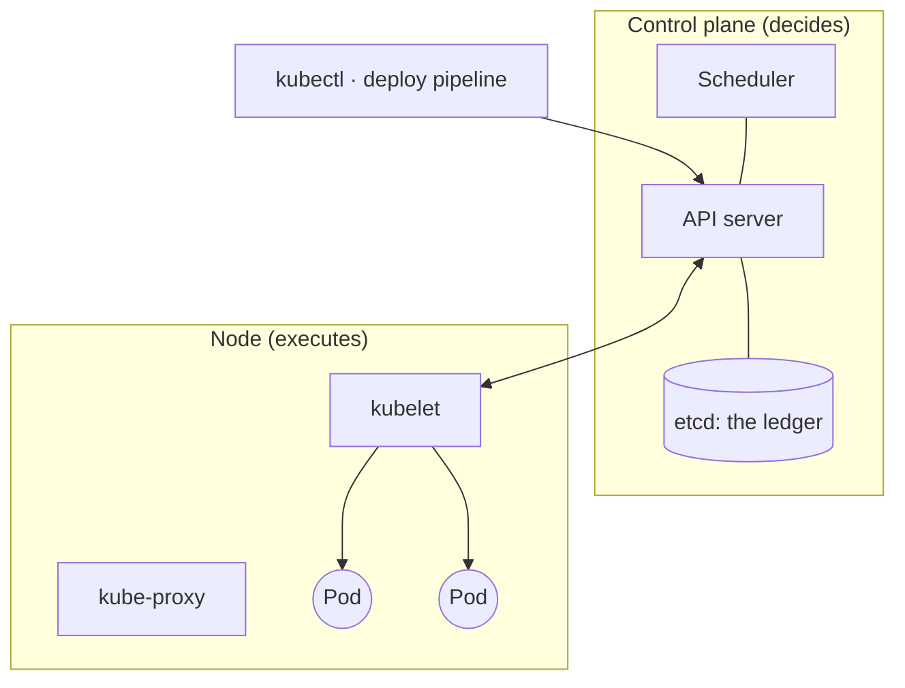
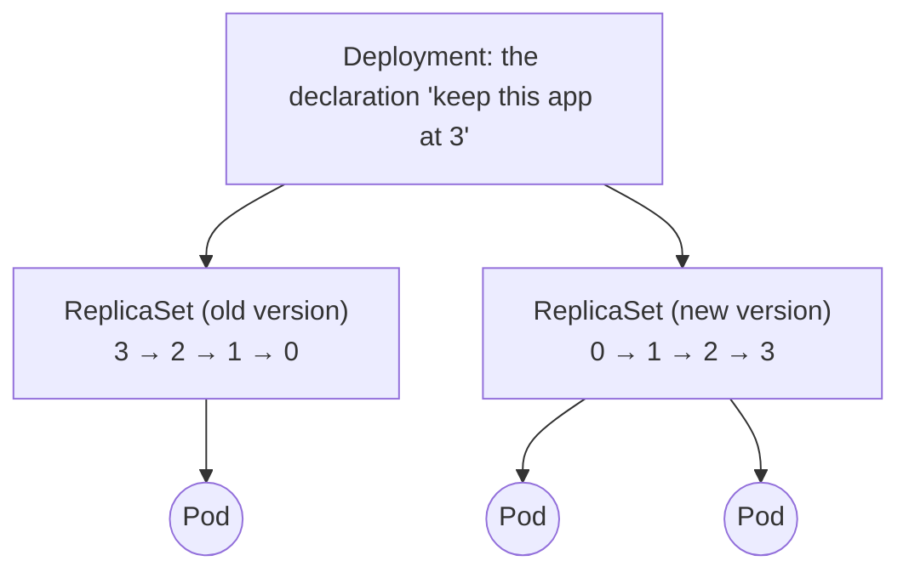
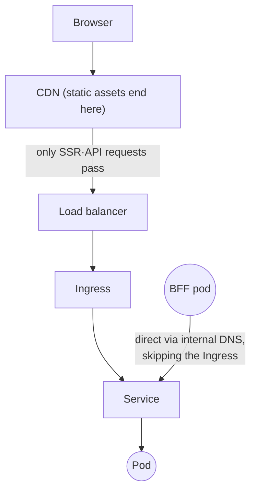

## Table of Contents

## Frontend Developers and Kubernetes

Next.js or Remix, the moment you operate SSR or a BFF (Backend For Frontend, an API middle server the frontend team manages directly), a frontend developer becomes a Kubernetes user. The deploy pipeline swaps pods in and out, monitoring alerts print words like OOMKilled, and conversations with the infrastructure team trade in requests and readiness. Yet opportunities to learn these terms systematically are surprisingly rare. Most of us look each one up as the need arises, collecting fragments, and how the fragments connect stays blurry.

This post is a vocabulary and concept survey that joins those fragments into one map. Instead of listing entries like a dictionary, it groups them in the order you meet them in real work: first a picture of the overall cluster structure, then what makes up a deploy, pod state and resources, the traffic path, and autoscaling, in that order. Toward the end there are tables collecting the concept pairs whose boundaries blur most easily, plus a glossary index you can return to from anywhere in the series.

This is also the first post of the "Kubernetes for Frontend Developers" series. This post concentrates on organizing terms and structure; the actual measurements belong to the posts that follow. It continues with [Part 2](/en/2026/08/k8s-for-frontend-2), which verifies what containers and pods physically are, [Part 3](/en/2026/08/k8s-for-frontend-3) following the traffic path, [Part 4](/en/2026/08/k8s-for-frontend-4) on the life and death of pods, and [Part 5](/en/2026/08/k8s-for-frontend-5) measuring autoscaling, with the already-published [Node.js pod sizing post](/en/2026/08/nodejs-k8s-pod-sizing) as the series' deep-dive terminus.

> Kubernetes-related statements in this post are based on Kubernetes v1.36. Since the goal is organizing concepts, version-sensitive details are kept to a minimum.

## The Overall Structure of a Cluster

A Kubernetes cluster splits into two big parts: the **control plane**, which makes decisions, and the **Nodes**, where the apps actually run. In a property-management analogy, they are the head office and the individual buildings.

A node is just a server. On AWS, one EC2 instance is one node. Apps are packaged into units called **Pods** and scattered across these nodes. What exactly a pod is comes in the next section; for now, hold it as "one running copy of the app."

On the control plane side, three components are worth knowing.

- **API server**: the cluster's single gateway. `kubectl` (coming up shortly), the deploy pipeline, and even Kubernetes' internal components all talk exclusively through the API server. The one and only way to ask the cluster to do anything is to send a request to this API.
- **etcd**: the ledger database where all cluster state is recorded (which apps, how many copies, where, with what configuration). You will rarely touch it directly, but the sense that the only truth of the cluster is what is written here helps in understanding many behaviors.
- **Scheduler**: looks at pods that have been created but not yet placed, and decides which node each should land on. It picks seats by accounting for each node's remaining reserved capacity.

On the node side there are two.

- **kubelet**: the agent resident on every node. It receives "the list of pods assigned to this node" from the API server and has the container runtime (containerd and the like) turn them into real processes. Pod health checks (the probes coming up later) are also kubelet's job.
- **kube-proxy**: manages each node's network rules so traffic can find its way to pods. It returns in the traffic section.

Finally, **kubectl** is the official CLI developers use to send requests to the API server. `kubectl get pods` is a GET request reading the pod list from the ledger, and `kubectl apply` is a request submitting a desired state. Remember that it is not a special tool but an HTTP client, and much of Kubernetes' behavior starts looking simpler.

All of the above in one diagram:



That is the whole structure. The control plane makes decisions based on the ledger (etcd), and each node's kubelet carries them out. Now, onto this structure, the vocabulary in working order.

## What Makes Up a Deploy: Images, Deployments, Pods

Start with the concepts that appear between pressing the merge button and the change reaching the service a few minutes later.

What CI does is turn code into an **image**. An image is a snapshot of the app and every file its execution needs (the Node.js runtime, node_modules, build output) taken whole, and once finished it is pushed to a **registry** (an image store: ECR, Docker Hub, and the like). When a node starts a pod, it pulls the image down from this registry. Why images are far larger than you expect, and how that size affects deploy speed, is measured directly in [Part 2](/en/2026/08/k8s-for-frontend-2).

What you actually write and edit in a deploy is not the image but a YAML document called a **manifest**, and at its center sits the **Deployment**. A Deployment is a **declaration**: "keep this image running as N pods." Here is Kubernetes' central idea. You do not command "start a pod"; you write "I want a state where 3 pods are running" into the ledger. Automated agents called controllers then keep pushing the current state toward the state written in the ledger. This is why a dead pod is replaced with no separate command: closing the gap between declaration and reality is the controllers' job.

Between the Deployment and the pods there is one more middle manager, the **ReplicaSet**. You can live without knowing it exists, but it is the reason pod names in `kubectl get pods` look like `my-app-6c8fb44888-wvx2x`: `my-app` (the Deployment), then the hash for the ReplicaSet, then five characters unique to the pod. As a hierarchy:

| Layer      | Role                                                  | Do we touch it?               |
| ---------- | ----------------------------------------------------- | ----------------------------- |
| Deployment | Declares "keep N copies, replace versions like this"  | We write it directly          |
| ReplicaSet | Middle manager keeping a specific version's pod count | Auto-generated, hands off     |
| Pod        | The smallest unit of execution. A consumable          | Not created directly, by rule |

The pod's consumable nature matters. Pods die, get replaced, get recreated on other nodes, and change names each time. So any design that depends on a specific pod (state saved to a pod-local file, a hardcoded pod IP) is misaligned from the start. What you manage is not pods but the declaration, the Deployment.

Replacing versions on top of this structure happens as a **rolling update**. The Deployment creates a new ReplicaSet for the new image, brings up one new pod, and once its readiness is confirmed, scales down one old pod, progressively swapping the fleet. The verdict behind "once its readiness is confirmed" is the readiness probe of the next section, and the conditions for not losing requests mid-swap are measured in [the life and death part](/en/2026/08/k8s-for-frontend-4).

A snapshot mid-replacement looks like two ReplicaSets on a seesaw under one Deployment:



Rolling a deploy back is simple thanks to the same structure. The previous ReplicaSet is still around, so `kubectl rollout undo` performs a **rollback** by scaling the previous version's pods back up, no rebuild needed. Along with `kubectl rollout status` for watching a deploy's progress, every command carrying the word rollout is a tool for this Deployment version swap.

Two more concepts belong in this section: **labels** and **selectors**. In Kubernetes, every membership relation ("this Deployment's pods," "the pods this Service sends traffic to") is established by selecting labels (key-value pairs like `app: my-app`) attached to pods with a selector. Objects are bound loosely by labels rather than referencing each other by name, so when traffic goes to the wrong pods, checking this label-selector matching is usually where you start.

In practice these YAML files are usually managed through tools rather than by hand. **Helm** packages manifests into templates plus value files ("charts"), while **Kustomize** layers per-environment differences (dev/prod) over common manifests. Either way, the final output is the same YAML submitted to the API server; knowing that keeps you oriented even when the tool is unfamiliar.

## The Basic Grammar of Manifests

Now that Deployment is defined, read what the YAML actually looks like. Every Kubernetes object shares the same skeleton regardless of kind, so learning this one skeleton makes the structure of any unfamiliar manifest legible.

- **apiVersion**: the API group and version the object belongs to. Deployment is `apps/v1`; the originals like Pod and Service are plain `v1`.
- **kind**: the object's type. `Deployment`, `Service`, `ConfigMap`, and so on.
- **metadata**: identity, including name, Namespace, and labels.
- **spec**: the body of the desired state. Its contents differ per kind, and most of what we write lives here.

These four are everything we write (the `status` field visible on reads is current state filled in by the system, never written by us). A minimal Deployment and Service, annotated:

```yaml
apiVersion: apps/v1
kind: Deployment
metadata:
  name: my-app
spec:
  replicas: 3 # keep 3 of this pod
  selector:
    matchLabels:
      app: my-app # must match the template's label below
  template: # from here on, the pod's blueprint
    metadata:
      labels:
        app: my-app # the label attached to each pod
    spec:
      containers:
        - name: app
          image: my-registry/my-app:1.2.3
          ports:
            - containerPort: 3000
          resources: # the resource contract. explained next section
            requests: {cpu: '500m', memory: '256Mi'}
            limits: {cpu: '1', memory: '512Mi'}
          readinessProbe: # checks whether traffic may be received. also next section
            httpGet: {path: /api/health, port: 3000}
---
apiVersion: v1
kind: Service
metadata:
  name: my-app
spec:
  selector:
    app: my-app # sends traffic to pods carrying this label
  ports:
    - port: 80
      targetPort: 3000
```

A few reading notes. First, the label `app: my-app` appears in three places (the Deployment's selector, the pod template, the Service's selector); this is the label-selector matching from the previous section. If the three disagree, you get pods that run but receive no traffic. Second, everything under `template` is the pod's blueprint, so spec appears twice (the pod's spec inside the Deployment's spec). It is the most confusing nesting on first read; parse it as "outside is the Deployment's desired state, inside is the shape of one pod." Third, `---` is YAML syntax joining multiple documents in one file, which is where the convention of keeping related objects together and submitting them with one `kubectl apply -f` comes from.

Units trip people up often enough to cover here. CPU's `500m` is millicores, that is 0.5 cores (`cpu: '1'` is one core). Memory's `Mi` is base-2 (1Mi = 1,048,576 bytes), a different unit from `M` (1M = 1,000,000 bytes); Kubernetes convention uses `Mi`/`Gi`. And YAML tries to interpret unquoted values on its own: write an image tag as `tag: 1.20` in a Helm values file and it becomes the number 1.2, not a string. So quotes are safe on quantity values that must be strings, like `cpu: '500m'`, but quoting everything is not the answer either; give an integer field a string, as in `replicas: '3'`, and the API server rejects it with a type error. How to check a field's type comes right next.

When you cannot recall a field name, `kubectl explain` beats digging through docs. Chain the path with dots, as in `kubectl explain deployment.spec.template.spec.containers`, and each field's description and type appear right in the terminal.

## Pod State and Resources: Probes, requests, limits

These are the terms for a pod's health and resources while it runs, and the cluster's most frequent vocabulary in monitoring alerts and incident conversations.

First, the three **probes** that judge a pod's health. All are checks kubelet runs periodically.

| Probe     | Question                         | On failure                                 |
| --------- | -------------------------------- | ------------------------------------------ |
| startup   | Still starting up?               | (past the startup grace) container restart |
| readiness | OK to receive traffic right now? | Removed from traffic targets (not killed)  |
| liveness  | Alive at all?                    | Container restart                          |

"The deploy went out but readiness never came up, so traffic is going to the previous version" is a situation you can read straight off this table: the new pods failed readiness and never made the traffic list, the rolling update paused at that point, and requests keep flowing to the old pods. The readiness/liveness distinction is where practice most often goes wrong. Liveness failure leads to the destructive remedy of a restart, so wiring external dependencies (a DB, a downstream API) into liveness turns a dependency outage into cascading restarts across every pod. That accident is reproduced in [the life and death part](/en/2026/08/k8s-for-frontend-4).

Next, the resource contract. A pod spec carries two values each for CPU and memory: **requests** and **limits**.

- **requests**: the reservation. The value the scheduler uses to compute which nodes can host this pod; unrelated to actual usage.
- **limits**: the ceiling. Exceed it and enforcement arrives; CPU slows down (throttling), memory dies (OOMKill). This asymmetry matters.

A pod killed for crossing its memory limit is recorded as **OOMKilled** (Out Of Memory). It appears in `kubectl describe pod` with exit code **137**, the conventional code for death by SIGKILL (128 + signal number 9). The signature of this death is that it leaves nothing in the app's error logs: the kernel terminates the process from outside, instantly, so no JS stack trace will ever surface it. Setting requests and limits from measurements is the entire topic of the [sizing post](/en/2026/08/nodejs-k8s-pod-sizing); from here, carry only the distinction of reservation versus ceiling.

The abnormal states you meet most often in `kubectl get pods`' STATUS column also belong here.

- **Pending**: the pod exists but has not been placed on any node. The classic cause is no node able to accommodate its requests.
- **ImagePullBackOff**: the image could not be pulled from the registry and retries are backing off. Typos in the image tag, registry auth failures, and nonexistent tags are the common causes.
- **CrashLoopBackOff**: the pod keeps dying on arrival, and kubelet has widened the restart interval exponentially (starting at 10 seconds, up to 5 minutes). It means the cause of death has not been resolved and only restarts are repeating.
- **Evicted**: kubelet expelled the pod due to node resource pressure (mostly memory or disk). Different in kind from the above: it may be the node's circumstances, not the pod's fault.

Finally, the procedure by which a pod terminates. When Kubernetes takes a pod down, it first sends **SIGTERM** to give it time to clean up, and if **terminationGracePeriodSeconds** (default 30) expires unfinished, it force-kills with SIGKILL. An app receiving SIGTERM, finishing its in-flight requests, and exiting is called a **graceful shutdown**, and in Node.js apps this signal has surprisingly many ways of failing to arrive (the PID 1 problem). That too belongs to [the life and death part](/en/2026/08/k8s-for-frontend-4).

## The Path of Traffic: Service, Ingress, DNS

The concepts along a request's route to the pod.

The starting point is that pods have IPs. Every pod receives its own IP, valid inside the cluster. But as seen above, pods are consumables that die and are reborn, changing IP each time. Clients cannot chase a moving IP, so the fleet of pods needs a fixed access point in front. That is the **Service**.

A Service groups a fleet of pods with a label selector and raises a fixed virtual IP called the **ClusterIP** in front of them. Clients send requests to the ClusterIP (or its DNS name), and each request is distributed to one of the healthy pods behind it. The verdict for "healthy" is the previous section's readiness: only pods passing readiness make it onto the Service's target list (**Endpoints**). readiness, Service, and Endpoints move as one set.

The ClusterIP, as the name says, works only inside the cluster. Interestingly, it is a virtual address attached to no machine or process, existing only as network rules (which is why it does not answer ping), and opening up its true identity is the core measurement of [the traffic part](/en/2026/08/k8s-for-frontend-3). For now just note that Services come in a few types by use: cluster-internal ClusterIP is the default, NodePort opens a port on the nodes, and LoadBalancer attaches a cloud load balancer.

The door for external HTTP traffic is separate: **Ingress** (or, more recently, the Gateway API). An Ingress is an L7 routing rule ("requests for this domain and this path go to this Service"), and the proxy that actually enforces the rule (nginx, ALB, and so on) is called the Ingress controller. The typical route of a request leaving a browser is summarized as CDN → load balancer → Ingress → Service → pod (strictly, many Ingress controllers skip the Service and send straight to the Endpoints' pod IPs; that bypass is verified in [the traffic part](/en/2026/08/k8s-for-frontend-3)).

For a frontend service, it pays to separate traffic that takes this route from traffic that does not. **Static assets, JS bundles and images, mostly end at the CDN.** What reaches the cluster's pods is the SSR requests that must render HTML, and API calls. So "traffic went up" splits in two: increased CDN hits are unrelated to the pods, and only the dynamic requests passing through the cache become pod load. This distinction connects directly to which numbers matter in autoscaling below.

Calls inside the cluster take a different road. When a BFF calls an internal API server, there is no need to exit through the Ingress and come back; it connects to the Service directly by the name that the **cluster's internal DNS** (CoreDNS) provides, addresses like `http://api-service` or `http://api-service.namespace.svc.cluster.local`. Within the cluster this way is shorter and faster, which is the background for the advice "skip the ingress, use internal DNS."

The two routes overlaid: static assets end at the CDN, only dynamic requests reach the pods, and internal calls inside the cluster never pass the door (Ingress).



One name collision needs sorting here: the `namespace` that just appeared. Kubernetes' **Namespace** is a logical partition dividing a cluster by team or environment (`production`, `staging`, and so on). The Linux kernel's **namespace**, which appears in Part 2, is the isolation mechanism that creates containers; same name, entirely different thing. In Kubernetes-object context read it as a partition; in container-internals context, an isolation device.

`kubectl port-forward`, used on dev machines, is a debugging tool that bypasses this entire route and tunnels between your local machine and a pod. Precisely, it is a tunnel through the API server, so it works even when your machine cannot reach the pod network at all. Convenient, but it traverses none of the real traffic path (Ingress, Service), so "it works over port-forward but fails in the real service" is a hint that the problem lives somewhere in between.

## Scaling: HPA and the Node Autoscalers

The automation that adjusts pod count to traffic is the **HPA** (Horizontal Pod Autoscaler). The name says it all: Horizontal (increase the count, not the size of one pod), Pod (pods, not nodes), Autoscaler (automatically, from metrics).

The HPA periodically reads a metric (CPU utilization being the classic) and adjusts the Deployment's replicas to whatever count sustains the target. Here the earlier concepts connect: when someone says "70% CPU utilization," the denominator is **requests**. The ratio is actual use over reservation, so if requests drift from reality, autoscaling judgment drifts with them. And growing the pod count means a new pod must pass the scheduler, land on a node, pull the image, and pass readiness before taking traffic, so scale-out is automatic but not instant. Which segments make up that delay is measured in [the autoscaling part](/en/2026/08/k8s-for-frontend-5).

As pods multiply, nodes eventually run short. Adding and removing nodes is not the HPA's job but that of a separate **node autoscaler** (Cluster Autoscaler, or Karpenter, common in AWS shops). Pod scaling and node scaling being different tools on different layers matters especially for cost: the cloud bill arrives per node (EC2), not per pod, and what determines node count is ultimately the sum of the pods' requests. This link, requests as the bill, is covered in the cost section of the [sizing post](/en/2026/08/nodejs-k8s-pod-sizing).

Configuration and secrets get organized around here too. Pods must receive the same configuration no matter which node or how many copies, so the convention is to keep config out of the image and inject it as environment variables or files via two objects: **ConfigMap** (plain settings) and **Secret** (sensitive values). The answer to "where do the app's environment variables come from" is usually these two.

There is one frontend-specific trap here: **build-time versus runtime environment variables**. Next.js' `NEXT_PUBLIC_*` variables are baked into the bundled JavaScript as strings at build time. They are decided when the image is built, so injecting different values into the pod via ConfigMap does not reach the client bundle. Incidents like "we deployed the dev image to prod and the API URL points at dev" are rooted here. What ConfigMap/Secret can change is only what server code reads from `process.env` **at runtime**; values going to the browser belong to the image build step.

## Where Logs and Metrics Go

In a structure where pods scatter across nodes and keep getting replaced, "where do I look at logs" gets redefined too.

Kubernetes' log model is simple. **Apps write logs to stdout/stderr, not files.** The container runtime captures that output on the node, and `kubectl logs` reads it back. With many pods, the usual setup is a per-node collection agent (Fluent Bit and the like; this one-per-node arrangement is the DaemonSet of the next section) gathering all pods' stdout into a central store (Elasticsearch, Loki, CloudWatch, and so on). For the app, remember one thing: creating and rotating log files is not the app's job; write to stdout, and the outside handles the rest.

A useful investigation flag is `kubectl logs --previous`. `kubectl logs` shows the currently running container's log, so right after a pod restarts you only see the new container's clean log. What happened just before death is visible only through `--previous`, the **previous container's** log. Even for deaths that leave no trace in app logs, like OOMKilled, what the process was doing until the end gives you clues here.

Two names on the metrics side. **Prometheus** is the time-series store that periodically scrapes and keeps pod and node metrics (CPU, memory, request counts), and **Grafana** is the dashboard that graphs it. If the team says "check Grafana," this pair is running. Note that the CPU/memory metrics the HPA consults by default come not from this stack but from a separate lightweight collector called **metrics-server**; the Prometheus stack connects to the HPA when scaling on custom metrics like request count.

## Everything Else You Will Run Into

Names outside the main flow that you will nonetheless meet while wandering a cluster.

First, **workload kinds** other than Deployment. SSR/BFF is almost always a Deployment, but `kubectl get pods -A` across the cluster shows pods of other shapes.

- **DaemonSet**: one pod on every node. Log collectors (Fluent Bit and the like) and node monitoring agents are the classic cases.
- **StatefulSet**: gives each pod a fixed name and storage. For workloads where pods being consumable is unacceptable, like databases; the opposite end from stateless web services.
- **Job / CronJob**: runs work that ends, once (Job) or on a schedule (CronJob). Batch work rides here.

**PDB** (PodDisruptionBudget) is the object that sets "the cap on how many pods may be down at once." It is a safety device that **applies only to voluntary disruptions**, administrative work like node replacement or cluster cleanup that empties pods out, so it does not protect against accidents like OOMKills or crashes. It returns in [the life and death part](/en/2026/08/k8s-for-frontend-4).

**kubeconfig** and **contexts** hold which cluster and which account kubectl sends requests as. You switch between dev and prod clusters with `kubectl config use-context`, and typing commands without checking your current context becomes a dangerous habit.

Finally, the five kubectl commands for investigation, the minimal toolbox for seeing this post's vocabulary with your own eyes.

| Command                              | Use                                                                           |
| ------------------------------------ | ----------------------------------------------------------------------------- |
| `kubectl get pods`                   | Pod list and states (Running, Pending, CrashLoopBackOff...)                   |
| `kubectl describe pod <name>`        | One pod in detail: events, exit codes, probe failure history                  |
| `kubectl logs -f <name>`             | The pod's stdout log stream. Add `--previous` for the dead previous container |
| `kubectl exec -it <name> -- sh`      | A shell inside the pod, for inspecting the container interior                 |
| `kubectl rollout undo deploy/<name>` | Roll back to the previous version                                             |

## Pairs That Blur Together

Concept pairs whose boundaries smear most easily, collected separately. I would argue these distinctions do more for the precision of real-world conversations than knowing the vocabulary itself.

**Container and pod.** A container is an isolated process; a pod is a Kubernetes management unit that bundles one or more containers and attaches an IP and a resource contract. Most pods hold one container, so everyday conversation can mix them, but the moment sidecars appear (helper containers attached beside the app), the distinction becomes necessary. If a log collector container and an app container share a pod, the two share an IP, get scheduled together, and die together.

**requests and limits.** Reservation and ceiling. requests is a promise used only in the scheduler's math; limits is a wall blocking actual use. Using more than requests can be normal (running above reservation); crossing limits means throttling or an OOMKill.

**liveness and readiness.** The restart switch and the traffic switch. Liveness failure kills and revives the container; readiness failure only pulls traffic. Wire a recoverable transient problem (downstream latency and the like) into liveness and you get a restart cascade instead of recovery.

**Pod scaling and node scaling.** The HPA adjusts pod count; Cluster Autoscaler and Karpenter adjust node (server) count. Different layers, different tools. If you scaled out and pods sit Pending, you usually grew the pods with no node to seat them, waiting on the node autoscaler.

**Namespace and namespace.** Kubernetes' Namespace is a logical partition of the cluster; Linux's namespace is the kernel isolation device that creates containers. Identical spelling, no relation.

**Image and container.** The image is the file snapshot (the stored thing); the container is its execution (the running thing). One image can start a hundred containers. Often analogized as class and instance.

**Container restart and pod recreation.** A restart from liveness failure or a crash brings only the container back up **inside the same pod**: pod name and IP stay, `restartCount` increments. When a deploy or eviction takes the pod down, that pod is finished, and the ReplicaSet creates a **new pod with a new name**. Which of the two "the pod restarted" actually was determines the direction of investigation (an app crash, or a scheduling/deploy event).

## Glossary Index

The whole post's vocabulary in one table, for returning to from anywhere in the series. The "In depth" column names the part that measures the term deeply.

| Term                                 | One-line definition                                                       | In depth                                              |
| ------------------------------------ | ------------------------------------------------------------------------- | ----------------------------------------------------- |
| Image / layer                        | Snapshot of every file the app needs to run / the strata composing it     | [Part 2](/en/2026/08/k8s-for-frontend-2)              |
| Registry                             | Image store; nodes pull images from here                                  | [Part 2](/en/2026/08/k8s-for-frontend-2)              |
| Container                            | An executed image; in reality a process wearing isolation devices         | [Part 2](/en/2026/08/k8s-for-frontend-2)              |
| cgroup / namespace (Linux)           | The two axes of isolation: capping usage / partitioning the visible world | [Part 2](/en/2026/08/k8s-for-frontend-2)              |
| Pod                                  | Container bundle + IP + resource contract; smallest unit of execution     | [Part 2](/en/2026/08/k8s-for-frontend-2)              |
| Node                                 | The server pods land on; the unit of the bill                             | [Part 2](/en/2026/08/k8s-for-frontend-2), sizing post |
| Control plane                        | API server, etcd, scheduler: the deciding side                            | [Part 2](/en/2026/08/k8s-for-frontend-2)              |
| kubelet                              | Per-node agent turning pods into real processes                           | [Part 2](/en/2026/08/k8s-for-frontend-2)              |
| Deployment / ReplicaSet              | The "keep N" declaration / the middle manager holding that count          | [Part 2](/en/2026/08/k8s-for-frontend-2)              |
| Label / selector                     | Key-value tags binding objects and the condition selecting them           | This post                                             |
| Rolling update                       | Zero-downtime replacement, growing new pods while shrinking old           | [Life and death part](/en/2026/08/k8s-for-frontend-4) |
| requests / limits                    | Resource reservation / ceiling; basis of scheduling and enforcement       | Sizing post                                           |
| OOMKilled (137)                      | The kernel killing a process for exceeding the memory limit               | Sizing post                                           |
| CrashLoopBackOff                     | Repeated crashes with exponentially widening restart intervals            | [Life and death part](/en/2026/08/k8s-for-frontend-4) |
| Probes (startup/readiness/liveness)  | kubelet's three health checks: startup / traffic / survival               | [Life and death part](/en/2026/08/k8s-for-frontend-4) |
| SIGTERM / grace period               | The termination notice and its grace; the materials of graceful shutdown  | [Life and death part](/en/2026/08/k8s-for-frontend-4) |
| Service / ClusterIP                  | The fixed access point before a pod fleet / its virtual IP                | [Traffic part](/en/2026/08/k8s-for-frontend-3)        |
| Endpoints / EndpointSlice            | The Service's list of traffic-ready pods; the standard is EndpointSlice   | [Traffic part](/en/2026/08/k8s-for-frontend-3)        |
| Ingress                              | L7 routing rules for external HTTP traffic                                | [Traffic part](/en/2026/08/k8s-for-frontend-3)        |
| Cluster internal DNS                 | CoreDNS turning Service names into addresses                              | [Traffic part](/en/2026/08/k8s-for-frontend-3)        |
| Pending / ImagePullBackOff / Evicted | Awaiting placement / image pull failing / expelled by node pressure       | This post                                             |
| Namespace (Kubernetes)               | Logical partition dividing a cluster                                      | -                                                     |
| ConfigMap / Secret                   | The channel injecting config and secrets from outside the image           | -                                                     |
| HPA                                  | The autoscaler adjusting pod count from metrics                           | [Autoscaling part](/en/2026/08/k8s-for-frontend-5)    |
| Cluster Autoscaler / Karpenter       | The autoscalers adjusting node count                                      | Sizing post                                           |
| stdout logs / `logs --previous`      | Logs go to stdout, not files / reading the previous container's log       | This post                                             |
| Prometheus / Grafana                 | Metrics time-series store / the dashboard that displays it                | -                                                     |
| DaemonSet / StatefulSet / CronJob    | One per node / fixed identity / scheduled-run workloads                   | -                                                     |
| PDB                                  | The cap on pods that may be down at once                                  | [Life and death part](/en/2026/08/k8s-for-frontend-4) |
| Helm / Kustomize                     | Managing manifests as templates / overlays                                | -                                                     |
| apiVersion / kind / metadata / spec  | The 4 skeleton fields every manifest shares                               | This post                                             |
| kubectl explain                      | Field descriptions and types, straight from the terminal                  | This post                                             |
| kubectl                              | The official CLI sending requests to the API server                       | Throughout                                            |

## Closing

The skeleton, summarized: the **structure**, where the control plane decides from the ledger and kubelet executes; the **deploy model**, where pods are consumables and the thing you manage is the Deployment declaration; **state and resources**, where requests is reservation, limits is ceiling, and probes split traffic from restarts; the **path**, where only readiness-passing pods enter the Service's Endpoints and receive traffic; and **scaling**, where the HPA adjusts pod count and the node autoscalers adjust node count. Those five lines are this post's summary.

But everything up to here organizes definitions and relations; whether each concept actually behaves that way has not been verified. Confirming by PID that a container really is a single process, dissecting the layers behind an image's 1.72GB, and hunting the network rules for the true identity of the virtual IP called ClusterIP are the work of the following parts. [Part 2](/en/2026/08/k8s-for-frontend-2) starts by running and measuring containers and pods directly.
