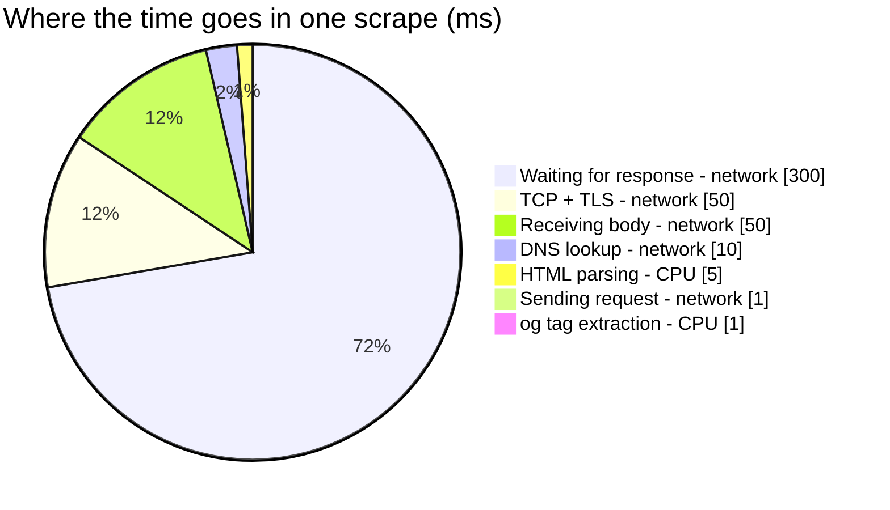
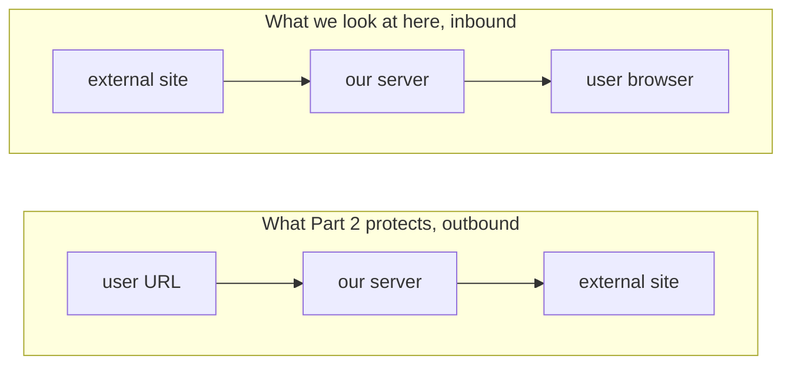
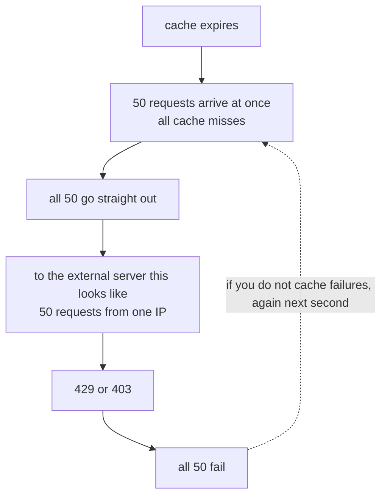
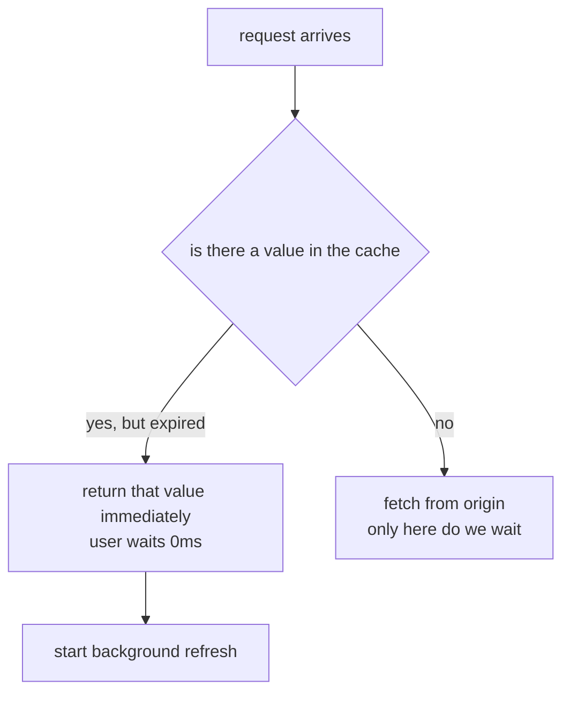

## Table of Contents

## The Three Lines That Work in a Demo

On paper, a link preview is a very simple feature. When a user pastes a URL, you show the page title and image as a card. In code, that is three lines.

```ts
const html = await fetch(url).then((r) => r.text())
const $ = cheerio.load(html)
const title = $('meta[property="og:title"]').attr('content')
```

Those three lines really do work. Try it on your own blog and the title comes out fine. The trouble starts after the code ships to production. In some hours the failure rate goes over 10%, when you ask why the answer is "the external site is behaving strangely," and the proposed fix is always "let us add a cache." And then the numbers barely move after the cache goes in.

This series is a design note that walks through the places where those three lines fall apart, in order. It weighs why you end up designing things a certain way over how to use them, and for security in particular it takes "how does it get broken" before "here is how to block it." Defensive code that cannot name the bypass it blocks is closer to a declaration than a defense.

> The scenario in this post (10% error rate, 5,000 requests a day, team composition) is an example set up for the sake of discussion. It is not the real metric of any particular service. The parts where code behavior is confirmed, on the other hand, are all things I ran myself, and those parts state the verification environment. The measurement environment for this series is macOS (darwin 25.5.0), Node.js `v24.14.1`, undici `8.10.0`, htmlparser2 `12.0.0`, and iconv-lite.

## The Other Side Is Not on Our Team

The first reason the three lines fall apart is the nature of the party we are talking to.

Most of the code we write day to day talks to a server we built, or at minimum to a server we have a contract with. If the response format changes we get notified, if it gets slow there is somewhere to complain, and when there is an outage we respond together. Scraping is communication where none of those premises hold.

If the response is slow there is nobody to complain to, and the same goes for being classified as a bot and blocked. You cannot ask anyone to fix HTML that violates the spec, and you will not be told when the structure changes tomorrow. Among external dependencies, this is one of the kinds we have the least control over.

So failures are frequent, and the face a failure shows on the surface is not one face.

| Failure         | What you see         | Actual cause              |
| --------------- | -------------------- | ------------------------- |
| Bot blocking    | `403 Forbidden`      | User-Agent based blocking |
| Login wall      | `200` but no og tags | Authentication required   |
| Timeout         | No response          | Slow remote server        |
| Broken encoding | Title reads `���`    | EUC-KR/CP949              |
| Redirect        | Stops at `301`       | No automatic following    |

On a dashboard these five get mashed into a single number called "10% error rate." And one of the five, broken encoding, has a quieter variant. The title does not turn into garbage characters, it turns into **perfectly normal looking but different characters**, and because the response is 200 and the og tags are fine with only the value wrong, it never shows up in the error rate at all. Why this kind is especially awkward is covered with measurements in the encoding section later in this post.

## Separating Symptom from Cause

Here is where the first premise that runs through this whole series comes in. **"The error rate is high" is a symptom, not a cause.** Pick a solution without classifying the cause and you will miss, and the most common misdiagnosis in scraping is "the error rate is high, so let us add a cache."

What a cache reduces is repeated requests for the same URL. Hold that against the five failures above one by one and the effect is uneven.

| Failure cause                                        | Effect of a cache                                |
| ---------------------------------------------------- | ------------------------------------------------ |
| Rate limiting from repeated requests to the same URL | Large                                            |
| User-Agent bot blocking                              | Almost none. Every cache miss is still a 403     |
| Login wall                                           | None                                             |
| Timeout                                              | None. A URL you have never seen is always a miss |
| Encoding failure                                     | None                                             |

If most of your failures sit in the bottom four rows, adding a cache will most likely leave the number almost exactly where it was. This does not mean caches are useless. It means you should first check whether the problem a cache fixes and the problem you have are the same problem. The cache itself gets its own treatment later in this post, stampedes included.

So the thing to do before touching code is measurement. It does not have to be elaborate. One log line at the failure point is enough to start.

```ts
logger.warn('og_scrape_failed', {
  reason, // FORBIDDEN | TIMEOUT | DECODE_FAIL | NO_OG_TAG | ...
  statusCode,
  host: url.hostname, // keep only the host, not the full URL
  elapsedMs,
})
```

Keeping only the host instead of the full URL is deliberate. A URL a user pasted can carry personal data or an auth token in its path and query, and once that lands in a log store, access to that store becomes access to personal data. The host alone is enough for classifying causes.

Collect this log for a single day and you get the ratio of failures by cause, and whether failures are concentrated in a handful of domains. In my experience the latter tends to hold: the top few domains often account for more than half. Without those two numbers, any improvement goal you set will be hard to back with evidence.

## The Shape of This Workload

Say measurement has started. Before moving on to runtimes, we need to settle what shape this workload has. Split one scrape by where the time goes and it breaks down roughly like this.



411ms waiting on the network, about 6ms spending CPU. Roughly 98% to 2%. The absolute values swing a lot depending on the target site, but the order of magnitude of that ratio does not move much. This is a textbook I/O bound workload where most of the time goes into waiting on someone else's server.

Scale matters too. A link preview is usually a low traffic feature. Assume 5,000 requests a day:

```
5,000 / 86,400 seconds ~= 0.06 TPS
Even taking peak as 10x the average, still under 1 TPS
```

This number gets used again later when we weigh "is there a reason to run a separate server." Attaching large infrastructure to small traffic is its own kind of design failure, and without knowing the scale there is no way to judge whether something is over-engineered.

## Two Arguments That Do Not Help

Start talking about runtimes and two arguments almost always show up first. Both are closer to reasoning attached to a conclusion that was already decided.

The first one goes like this.

> "Scraping is I/O bound, so Node.js, which is strong at async, has the advantage"

This does not hold up as a reason. The JVM has non-blocking I/O stacks too (Netty, WebClient, coroutines), and Go and Rust go without saying. At a load of roughly 1 TPS, thread-pool based blocking I/O would be perfectly fine to begin with. "It has the advantage because it is async" was a story that worked in the early 2010s. Every runtime does this now.

The second is from the other side.

> "The team has no operational experience with that runtime, so we should not use it"

The problem with this argument is that it only gets applied to one side. When the case for dropping Node is made, "the frontend team has no experience running Node servers" comes out, but if the alternative is "the frontend contributes to a JVM server repository," then the frontend's lack of JVM experience has to count with the same weight. A criterion applied to only one side is less a criterion than a conclusion.

This is not to say operational experience does not matter. As we will see, it is actually one of the most important conditions. But attach it to only one side and there is no comparison happening.

Clear those two arguments away and what remains comes into view.

## The Four Points Where It Actually Diverges

Lined up, there are four. Control up to the socket, whether broken HTML gets parsed the way a browser parses it, encoding, and who owns this code. The third is a point where Node loses, and I put it in on purpose. A comparison that only counts your own side is hard to trust.

### Control Up to the Socket

[Part 2](/2026/08/og-scraping-server-2) is entirely devoted to explaining why this one matters, so here I will only state the conclusion up front. For a feature where the server opens a URL a user handed it, SSRF defense boils down to this.

> We check the IP that DNS resolved, and connect directly to the IP we checked.

Most HTTP clients are an abstraction that "connects for you when you give it a name," and they leave no gap to step into in between. Node's `undici` leaves that gap open.

```ts
new Agent({
  connect: {
    lookup(hostname, options, callback) {
      // the socket connects to whatever address this function returns
    },
  },
})
```

Doing the same on the JVM usually means implementing a custom DNS resolver and injecting it into the HTTP client, going around it at the network layer, or standing up an egress proxy to force it. None of that is impossible. But it is a different difficulty from "hand over one function," and in practice that difference in difficulty often decides whether it gets implemented at all. The reason it matters whether a security control can be expressed in application code is that if it is hard, it ends up not getting done.

To add to that, Part 2 also confirms by measurement that this `lookup` hook is not a silver bullet. There is a path where the hook is not called at all.

### Broken HTML

The HTML you scrape is mostly out of spec.

```html
<meta property="og:title" content="title />
<!-- no closing quote -->
<meta property="og:image" content="/hero.png" />
<head>
  <p>a tag that has no business being inside head</p>
</head>
```

A browser recovers from documents like this and parses them according to fixed rules. Those rules are the [WHATWG HTML parsing algorithm](https://html.spec.whatwg.org/multipage/parsing.html), and `parse5` is an implementation that ports that standard directly. Every runtime has an HTML parser, but whether a parser that follows the standard's error recovery rules sits there as the default choice differs between ecosystems.

You see code that pulls og tags out with a regular expression fairly often, and on HTML like the above it quietly produces the wrong value. Quietly is the key word. If an exception is thrown you at least notice. If only the value is wrong, there is no way to know.

### Encoding

This is where Node loses.

Korean sites still have EUC-KR and CP949 in the wild. The JVM has a CP949 decoder inside the standard JDK.

```java
new String(bytes, Charset.forName("x-windows-949"))  // extension characters included
```

Strictly speaking it lives in the `jdk.charsets` module, so if you minimize the runtime with jlink for deployment, that module can be dropped and this fails (`--add-modules jdk.charsets` puts it back). Even so, it is not something you add a dependency for.

Node's built-in `TextDecoder`, on the other hand, quietly fails here.

```ts
new TextDecoder('euc-kr').decode(bytes) // CP949 extension characters break
```

Run it and `똠` becomes `c` and `꼃` becomes `X`. No exception, not a replacement character, just a different character. The measurement table and the reason are in the encoding section later, and the conclusion is that an `iconv-lite` dependency is effectively mandatory.

This is a genuine downside of Node and there is no reason to hide it. Still, it is solved by a single dependency, and being a pure JS implementation it carries no native build burden, which is worth writing down alongside.

### Who Owns It

A link preview is the kind of feature whose spec is attached to the UI. At how many characters does the title get truncated, what do you show when there is no image, do you fall back to `<title>` when `og:title` is missing, do you expose the domain name on the card. Those decisions mostly get made on the frontend.

Put code whose changes are driven by the frontend into a backend repository, and changing a single string requires two teams' schedules to line up. It is not a technical reason, but in practice it is the part that costs the most, most often.

## Conditions for Not Choosing It

Count all four points and it looks like things tilt toward Node, so the conditions pointing the other way have to be written with the same weight for there to be a comparison. If several of the below overlap, I would not choose Node.

| Condition                                | Reason                                                          |
| ---------------------------------------- | --------------------------------------------------------------- |
| The company standard runtime is JVM only | Deploy, secrets, and logging pipelines all have to be cut fresh |
| On-call sits with the backend org        | It becomes code that the person woken at 3am cannot read        |
| APM and monitoring are JVM only          | Dashboards and alerts end up managed twice                      |
| Security review is split by language     | A new language restarts the review cycle from scratch           |
| Traffic under 1 TPS                      | Before the runtime, the case for a separate server is weak      |

The last row is worth unpacking a bit more. Take the 0.06 TPS computed earlier and hold the common arguments for splitting out a server against it one at a time.

"Scraping CPU will block the event loop" means 5ms of parsing 0.06 times a second, which puts utilization around 0.03%, so it is not the right thing to worry about. "We need to separate monitoring" is often solved with per-route metric labels, so it does not rise to a reason to split servers. "We need failure isolation" is a fair point, except that timeouts and circuit breakers already secure a good chunk of it.

So at this scale what remains as a reason to split out a server is usually organizational. And that is not an embarrassing reason. Who owns it and who takes the pager are conditions that determine real operational cost, not a substitute for a technical reason. It is fine as long as you do not dress it up as a performance problem.

Put together, the judgment table looks like this.

| Situation                                                                                      | Recommendation                     |
| ---------------------------------------------------------------------------------------------- | ---------------------------------- |
| Frontend owns it, Node infrastructure exists in house, you want SSRF control expressed in code | Node                               |
| Company standard is JVM, on-call is backend, traffic is small                                  | Inside the existing backend server |
| Traffic is tiny, Next.js is already there, security requirements are low                       | Do not split it out                |
| Hundreds per second, latency sensitive                                                         | Consider Go or Rust too            |

What this table is saying is not that Node is superior, but that it is the choice when the conditions in the first row apply.

## From Here On, It Is About Making It Work

By this point what we have to build is fairly narrowed down. We got to: "10% error rate" was five different kinds of failure, a cache fixes only some of them, this workload is I/O bound at low TPS, and there are four points where runtime choice diverges.

Why the first of those four, control up to the socket, is needed is not covered in this post. [Part 2](/2026/08/og-scraping-server-2) is that place in its entirety. It covers why opening a URL a user handed you is so dangerous, the six ways code that believes a whitelist protects it gets broken, and what turns out to be wrong when you actually run the code meant to block them.

The rest of this post is not about not getting broken, it is about making it work. I said earlier to classify failure causes, so let us assume you did and start from there. Split that way, 403 often accounts for an overwhelming share.

## User-Agent Decides the Error Rate

Many sites serve OG tags only to preview bots. Names like these.

```
facebookexternalhit/1.1
Twitterbot/1.0
Slackbot-LinkExpanding 1.0
Discordbot/2.0
```

Request with the default User-Agent of `undici` or `node-fetch` and you often become a blocking target. So the question of whether to borrow someone else's UA follows immediately, and written out honestly the tradeoff looks like this.

| Choice                            | What you gain                                          | What you lose                                                                           |
| --------------------------------- | ------------------------------------------------------ | --------------------------------------------------------------------------------------- |
| Impersonate `facebookexternalhit` | Success rate rises a lot                               | It is identity forgery. It gives the other side grounds to change their blocking policy |
| Own UA with contact info          | Honest, and you can be reached when there is a problem | Low initial success rate                                                                |

The side I would recommend is your own UA with contact info in it.

```
MyPreviewBot/1.0 (+https://example.com/bot)
```

If the success rate is the problem, pulling the top blocking domains into a list and handling them individually is easier to walk back than blanket impersonation. Impersonation is a decision that is hard to stop once you start.

Whether you have to honor robots.txt is a policy question more than a technical one. It is better to start by admitting there is no single right answer. The argument for "this is not crawling" is that you are fetching a single URL the user explicitly pasted and not following links onward, which is closer to what a browser does. The argument for "this is crawling" is that it is a server requesting automatically rather than a person, and that is the definition of a bot.

Practice varies, but the minimum line worth holding is roughly this. Limit concurrent requests to the same domain to one and put a cap on requests per second, do not repeatedly retry a domain that failed (the negative caching we will see later applies here too), and document it as an organizational policy.

That is a ceiling that protects the other side. We need one on our side too, because leaving a window that opens any URL on request without authentication or a quota turns it into a relay for third-party attacks or a laundering channel for identity. Put a rate limit on the requester as well.

## Encoding: The Reality of Korean Sites

There are still sites served in EUC-KR and CP949. Public institutions, older news outlets, and community boards especially.

```ts
const html = buffer.toString('utf-8') // if it is EUC-KR this all breaks
```

The default for `Buffer.toString()` is UTF-8, so this one line quietly fails. And a broken title does not register as an error. The response is 200, the og tags are there, and only the value is `���`.

The standard order for determining an encoding is defined in the [WHATWG HTML Standard](https://html.spec.whatwg.org/multipage/parsing.html#determining-the-character-encoding). The thing to notice is that **detection comes last**.

| Rank | Basis                              | Reason                                                       |
| ---- | ---------------------------------- | ------------------------------------------------------------ |
| 1    | BOM                                | It is stamped into the bytes. It overrides every declaration |
| 2    | charset in the HTTP `Content-Type` | The transport layer's declaration                            |
| 3    | `<meta charset>` prescan           | The document's own declaration (first 1024 bytes)            |
| 4    | Heuristic detection or a default   | It is inference, so it can be wrong                          |

You sometimes see code that puts a detection library like `jschardet` first, which has the order inverted. There is no reason to guess when there is an explicit declaration.

In code it comes out like this.

```ts
function resolveCharset(head: Buffer, contentType?: string): string {
  // 1. BOM
  if (head[0] === 0xef && head[1] === 0xbb && head[2] === 0xbf) return 'utf-8'
  if (head[0] === 0xfe && head[1] === 0xff) return 'utf-16be'
  if (head[0] === 0xff && head[1] === 0xfe) return 'utf-16le'

  // 2. HTTP header
  const fromHeader = contentType?.match(/charset\s*=\s*"?([\w-]+)/i)?.[1]
  if (fromHeader) return fromHeader.toLowerCase()

  // 3. prescan the first 1024 bytes as latin1
  const prescan = head.subarray(0, 1024).toString('latin1')
  const fromMeta = prescan.match(/<meta[^>]+charset\s*=\s*["']?([\w-]+)/i)?.[1]
  if (fromMeta) return fromMeta.toLowerCase()

  // 4. only now do we infer
  return 'utf-8'
}
```

There is a reason step 3 prescans as `latin1` specifically. It is a chicken-and-egg problem. To know the encoding you have to read the meta tag, and to read the meta tag you have to know the encoding.

`latin1` breaks that loop. Bytes and characters map one to one (0x00 to 0xFF onto U+0000 to U+00FF), no byte sequence throws, and the ASCII range is preserved as is. `<meta charset="euc-kr">` is all ASCII. This is a lossless peek and nothing more, and the real decode happens against the original bytes once the charset is settled. Prescan as `utf-8` and EUC-KR bytes turn into replacement characters, which can shift the positions.

### The Trap of the `euc-kr` Label

This is a point especially worth knowing in the Korean-language world.

EUC-KR is the KS X 1001 precomposed set and expresses only 2,350 Hangul syllables. CP949 (UHC) extends it to hold all 11,172. But real-world HTML often **uses CP949 characters while declaring `charset=euc-kr`**. Use a strict EUC-KR decoder and the extension-area characters break.

The [WHATWG Encoding Standard](https://encoding.spec.whatwg.org/#legacy-multi-byte-korean-encodings) reflects that reality and defines the `euc-kr` label to cover the CP949 extension. Node's built-in `TextDecoder` does not follow that definition.

Here is the result of feeding CP949-encoded bytes produced in Python into `new TextDecoder('euc-kr')`.

| Character | CP949 bytes | Area            | `TextDecoder` | `iconv-lite` |
| --------- | ----------- | --------------- | ------------- | ------------ |
| 한        | `c7d1`      | KS X 1001 base  | `한`          | `한`         |
| 글        | `b1db`      | KS X 1001 base  | `글`          | `글`         |
| 뷁        | `94ee`      | CP949 extension | `�`           | `뷁`         |
| 똠        | `8c63`      | CP949 extension | **`c`**       | `똠`         |
| 꼃        | `8458`      | CP949 extension | **`X`**       | `꼃`         |
| 펲        | `bc84`      | CP949 extension | `�`           | `펲`         |

Changing the label does not change the result. `windows-949` and `ks_c_5601-1987` break identically, and the `cp949` label throws a `RangeError`.

What is genuinely awkward here is `똠` becoming `c` and `꼃` becoming `X`. A replacement character (`�`) would at least catch your eye. When it becomes a **perfectly normal looking different character**, you can stare at the log and never notice.

So `iconv-lite` becomes effectively mandatory.

```ts
import iconv from 'iconv-lite'

function decode(bytes: Buffer, charset: string): string {
  if (iconv.encodingExists(charset)) {
    return iconv.decode(bytes, charset) // 'euc-kr' and 'cp949' both handled as CP949
  }
  return iconv.decode(bytes, 'utf-8') // unknown label falls back to UTF-8
}
```

Do not skip the `encodingExists` check. Values like `charset="unicode"` genuinely exist, and if you check, `iconv.encodingExists('unicode')` is `false`. Miss this case and the exception propagates straight up.

This is the spot I meant when I said earlier that encoding is where Node loses. The JVM finishes it inside the standard library with one line of `Charset.forName("x-windows-949")`.

Laid out, this bug progresses like this. The response is 200, the og tags are properly there, parsing succeeds, and only the title reads `c방각하` instead of `똠방각하`. **No layer raises an error.** The error rate dashboard is clean, no alert fires, and nobody knows until a user reports it. Later on I will say you have to measure coverage (the share of URLs attempted for preview that actually succeeded) separately, and this is the reason. Failures hide inside successful responses too.

### Read Only `<head>` and Cut

og tags are mostly inside `<head>`. You can stop when `</head>` shows up and avoid receiving the whole body. Instead of `parse5` (the parser mentioned earlier), which builds a tree, use `htmlparser2`, a streaming parser that reads pieces as they arrive and can stop.

```ts
import {Parser} from 'htmlparser2'

let headDone = false
const parser = new Parser({
  onopentag(name, attribs) {
    if (name === 'meta' && attribs.property?.startsWith('og:'))
      result[attribs.property] = attribs.content
  },
  onclosetag(name) {
    if (name === 'head') headDone = true
  },
})

for await (const chunk of res.body) {
  parser.write(decode(chunk))
  if (headDone) {
    res.body.destroy() // cut reception right there once head ends
    break
  }
}
```

`parser.pause()` alone does not stop the download. The parser only defers its callbacks while the bytes the server sends keep piling up, so to actually stop you have to tear down the response stream with `destroy()` as above.

There are two effects. Most pages only need the first few KB read, so it gets faster, and you are less likely to hit the response size cap [Part 2](/2026/08/og-scraping-server-2) will set.

There is a tradeoff though. On the rare page where og tags got pushed outside `<head>`, cutting early loses those values. That shaves the coverage metric coming up later, so if coverage matters more, reading all the way to the cap (512KB) is also a valid choice.

One thing to add: a multibyte character like EUC-KR can straddle a chunk boundary, so decoding each chunk immediately breaks characters. In practice you collect the head region and decode it in one go, or use an `iconv` stream decoder. The code above is simplified to show the flow.

## Scraped Values Are User Input

Here the direction flips once.

What [Part 2](/2026/08/og-scraping-server-2) protects is the **outbound** direction of our server, so that a URL someone handed us does not send requests anywhere. What we look at here is the direction where **the fetched value comes into our screen**.



The two directions differ in the nature of the risk, but the reason is the same. The other side is not on our team.

Who decides `og:title`? The site we requested. That site can put any string in there, and we take that string and paint it onto a screen on our domain. Words someone else wrote come alive inside our page.

Most people have the habit of validating form input, but a scrape result feels like "data we fetched," so that habit does not kick in. `og:title` is not an API response, it is user input. It just was not typed into an input field. The trust level is the same.

### The Parser Already Decodes for You

A misunderstanding comes up here. Since it is inside an HTML attribute, people assume it will arrive in a form like `&lt;script&gt;`. It will not. The parser unescapes entities for you.

```ts
const html =
  '<meta property="og:title" content="A &amp; B &lt;script&gt; &#48156;">'
```

Feed that string to `htmlparser2` and take `attribs.content`, and the result is this.

```
opts= undefined                 -> "A & B <script> 발"
opts= {"decodeEntities":false}  -> "A &amp; B &lt;script&gt; &#48156;"
```

`decodeEntities` is on by default. The angle brackets are already real angle brackets, and the value arrives in our hands **with a tag inside it**.

The thought that follows is to just turn the option off, but that is not the fix. A perfectly normal title `Samsung & LG` would show up to the user as `Samsung &amp; LG`, and the place the value gets painted may not be HTML at all. Mobile apps, Slack cards, and push notifications are such places. Trying to block something by warping its shape at the receiving stage usually breaks something else.

The principle is this. **The place to block is not where you validate, it is where you use.** Hold the value as the decoded original, and process it for its context at the moment it goes into the screen. The same principle repeats in Part 2 when we handle URLs.

### Every Sink Has Its Own Rules

The answer "we use React, so are we not safe" is only half right. React and Vue escape text positions automatically.

```tsx
<h3>{og.title}</h3> // safe. <script> shows up as characters
```

The problem is that there are more positions that are not handled automatically than you would think.

```tsx
<div dangerouslySetInnerHTML={{__html: og.title}} />  // dangerous
<a href={og.url}>                                     // needs a scheme check
                                // covered separately below
```

And outside the screen, the framework's protection does not reach at all. Email HTML assembled as a string on the server, Slack or Discord cards, code that bakes OG images as SVG, older screens that write `innerHTML` directly. Rather than "we use React," the answer is closer to whether you have counted every place that value passes through.

For the same string, the dangerous characters change depending on where you put it.

| Sink                 | Example                  | Required handling                    |
| -------------------- | ------------------------ | ------------------------------------ |
| HTML text            | `<h3>here</h3>`          | Escape `< > & " '` (framework's job) |
| HTML attribute       | ``       | Escaping plus always quoting         |
| URL position         | `<a href="here">`        | Scheme check. Escaping is not enough |
| Query string         | `?q=here`                | `encodeURIComponent`                 |
| JSON inside a script | `<script>window.__D=...` | Avoid the position entirely          |

The third one is especially confusing. `javascript:alert(1)` is still `javascript:` after escaping, because there are no special characters in it. Escaping is a treatment that turns characters into characters, so it does not stop an address from being interpreted as an address.

### `og:image` Is Not a String, It Is an Address

`og:image` is a value worth one more thought before painting it. Three reasons.

There is no guarantee the scheme is http or https. Someone can embed a dozens-of-MB image with `data:`, and a relative path has to be resolved against the final URL.

Hand it to the browser as is and the remote server gets to see our users. The IP and User-Agent of every user who opens our page land in that site's logs.

Fetch it on our server instead and the problem from [Part 2](/2026/08/og-scraping-server-2) reproduces exactly. An image proxy is, in the end, the server opening a user-supplied URL, so the whole validation from Part 2 has to be applied again.

Any of the three works as an answer. Not choosing and moving on is not an answer.

Finally, there are things that look trivial but you will actually run into. `og:title` sometimes arrives at hundreds of KB, so truncate before storing (200 characters or so is plenty), and when the same `og:` tag appears more than once, decide which one wins and document it (first one wins is the safe default). An empty string and a missing tag have to be distinguished, because their lifetimes differ in the negative caching coming up. Filter out control characters and newlines or your logs and card layout break together. Watch where you truncate, too. Cut on UTF-16 boundaries and emoji get sliced in half.

In Part 2 I spend a fair amount of space saying "do not trust a URL someone handed you." What we saw here is the other side of it. What that URL answered with was also written by someone else.

## What the Cache Fixes and What It Does Not

Time to settle the topic I deferred earlier.

| Metric                                          | Effect of a cache               |
| ----------------------------------------------- | ------------------------------- |
| Requests going out to external servers          | Drops a lot                     |
| Response time on a cache hit                    | Hundreds of ms down to a few ms |
| Overall API error rate                          | Partial                         |
| URL coverage (successful URLs / attempted URLs) | Does not improve                |

The error rate is "partial" because a cache only reduces failures that come from the same URL repeating (rate limits, transient outages). Things that always fail for that URL, like 403, a login wall, or encoding, are still failure responses even when negative caching stores them, so the error rate number does not come down.

The last row is the key one. A URL you have never seen is always a cache miss, and when it fails there, the user still sees a broken card.

So split the goal in two.

```
(1) API error rate = failed responses / total API requests   <- only repeat-driven failures improve with a cache
(2) Coverage       = unique URLs succeeded / unique URLs attempted   <- improves with scraping quality
```

Target only (1) and the number improves purely from the cache hit rate going up. That is the classic trap where the metric improves while the user experience stays exactly the same. To raise (2) you have to do the things covered earlier in this post: UA adjustment, redirect handling, encoding support.

### Fixing the Definition of a Stampede

It is usually explained as "cache expires and requests pile onto the DB," but on a scraping server the backend is not a DB, it is an external site. Written precisely it is this.

> The moment a cache key expires, every concurrent request waiting on that key goes out to the origin

The more popular the link, the worse it gets, and **the other side reads it as an attack**.



You really can end up in a situation where the error rate rises after adding a cache. So with caches, how you add one matters more than whether you add one.

At the steady-state scale computed earlier (0.06 TPS) a moment like this does not come around often. The problem is not the average but the moment traffic piles onto one popular link, and the "50" above is a picture of that moment.

### Before That, the Cache Key

Before discussing the cache you have to decide what "the same URL" means. The four below are the same page to a human eye and entirely different strings.

```
https://Example.com/a?b=1&c=2
https://example.com/a?c=2&b=1
https://example.com/a?b=1&c=2#section
https://example.com/a?b=1&c=2&utm_source=twitter
```

Use the URL as the key without normalizing and these four get cached separately. The hit rate drops, and the single-flight coming up cannot group them under one key either, which loosens the stampede defense.

At minimum, line these up. Strip `#fragment` (it has nothing to do with the server response), lowercase the host, strip known tracking parameters like `utm_*` (leave arbitrary parameters alone, since they can change the content), and sort the query parameters.

This is easy to confuse with "do not normalize addresses yourself" from [Part 2](/2026/08/og-scraping-server-2), but the purposes differ. Security checks use the original (`BlockList` does the judging), cache keys use the normalized form. Different purpose, different rules.

### Three Responses

The first is single-flight. Of the concurrent requests for the same key, send one to the origin and share the result with the rest.

```ts
const inflight = new Map<string, Promise<OgResult>>()

function once(key: string, fn: () => Promise<OgResult>) {
  const running = inflight.get(key)
  if (running) return running // someone is already fetching it

  const p = fn().finally(() => inflight.delete(key))
  inflight.set(key, p)
  return p
}
```

Cheapest and highest impact. 50 requests become 1. The limits are that it only works within a process (with N instances, up to N go out) and that when the representative request fails, everyone waiting gets the same failure. If sharing failures is a problem, use the variant that shares only successes.

The second is stale-while-revalidate. Return the expired value immediately and refresh in the background.



OG data being a few minutes stale is not a big problem, so this strategy fits the workload well. Combined with single-flight, background refreshes also collapse to one per key.

The third is negative caching. Failures have to be cached too. Leave this out and failing URLs go out to the network on every request, which at a 10% error rate is a sizable leak.

```ts
function ttlFor(result: OgResult): number {
  if (result.ok) return 60 * 60 // success: 1 hour

  switch (result.reason) {
    case 'NOT_FOUND':
      return 60 * 30 // 404 rarely changes
    case 'FORBIDDEN':
      return 60 * 10 // bot blocking. shorter than 404 since policy can change
    case 'RATE_LIMITED':
      return result.retryAfter ?? 60 // honor Retry-After
    case 'TIMEOUT':
      return 30 // could be transient, keep it short
    default:
      return 60
  }
}
```

The reason for splitting TTL by failure kind is that giving them all the same TTL goes wrong one way or the other. Uniformly short and you keep retrying failures like 404 that will not change; uniformly long and a transient timeout leaves a perfectly good link dead for a long stretch. Different failure natures deserve different lifetimes. This is where classifying failures by cause, which I asked for earlier, pays off. Cause classification is not just for observability, it is an input to design decisions.

### Where the Local Cache Falls Apart

An in-memory cache built from a single `Map` only works well with one instance.

| Item                                     | 1 instance | N instances (even routing) |
| ---------------------------------------- | ---------- | -------------------------- |
| Chance the same URL meets the same cache | 100%       | About 1/N                  |
| Requests going out                       | 1          | Up to N                    |
| On deploy                                | Cache lost | Cache lost                 |
| On scale out                             | N/A        | New instances start empty  |

"We apply in-memory caching" and "we run multiple instances" eat each other when used together.

That does not mean the answer is always Redis. The criteria are instance count and unique URL distribution.

| Situation                          | Recommendation                                   |
| ---------------------------------- | ------------------------------------------------ |
| 1 to 2 instances, small traffic    | Local cache is enough. Redis is over-engineering |
| 3 or more instances                | Consider a distributed cache                     |
| Popular URLs concentrated in a few | Two tiers (local + Redis) is efficient           |
| Frequent deploys                   | Distributed cache. Local gets wiped every deploy |

A two-tier setup is, as far as I know, the most common in practice. Local absorbs the frequently requested keys and Redis takes the rest.

## Is "P95 Under One Second" an Achievable Goal?

Goals often get written like this.

> Reduce response time to under 1 second at P95

It is not a bad goal, but it is worth first asking whether anyone has computed if it is achievable. And it can be computed. All you need is the cache hit rate.

Say a cache hit is always fast (about 5ms), and call the hit rate `h`. Sort all requests by latency and the first `h` fraction is the hit region.

If `h` is greater than 0.95, the 95th percentile falls inside the hit region, so P95 lands around 5ms and the goal is met automatically. If `h` is less than 0.95, P95 sits in the miss region, and which percentile of the miss distribution it is comes out as:

```
q = (0.95 - h) / (1 - h)
```

`q` is the quantile of the external server's response time distribution we have to satisfy.

| Hit rate `h`  | Required quantile `q` | What has to be satisfied                                  |
| ------------- | --------------------- | --------------------------------------------------------- |
| 0.96 or above | N/A                   | Goal met automatically (P95 is inside the hit region)     |
| 0.95          | Boundary              | A small swing pushes it into the miss region. No headroom |
| 0.90          | 0.500                 | The external median has to be under 1 second              |
| 0.80          | 0.750                 | External P75 has to be under 1 second                     |
| 0.70          | 0.833                 | External P83 has to be under 1 second                     |
| 0.50          | 0.900                 | External P90 has to be under 1 second                     |

I checked this formula against a two-million-run simulation. External response time was drawn from a lognormal distribution (median 400ms), and for each hit rate the overall P95 was compared against the `q` quantile of the miss distribution that the formula points at.

| Hit rate `h` | Formula `q` | Simulated P95 | Value the formula points at | Error |
| ------------ | ----------- | ------------- | --------------------------- | ----- |
| 0.96         | N/A         | 5.0ms         | 5.0ms                       | 0.00% |
| 0.90         | 0.500       | 400.6ms       | 400.1ms                     | 0.13% |
| 0.80         | 0.750       | 733.9ms       | 734.2ms                     | 0.04% |
| 0.70         | 0.833       | 953.2ms       | 953.2ms                     | 0.01% |
| 0.50         | 0.900       | 1265.7ms      | 1265.6ms                    | 0.01% |

They agree to within 0.13%. Changing the shape of the distribution does not change that, because the formula assumes no particular distribution and only works out where a quantile sits.

The thing to notice here is that the right-hand column of the table is **a value we do not control**. It is the remote server's response time. The lower the hit rate, the more the goal passes into someone else's hands. So before promising "P95 under 1 second," the right order is to ask whether you can promise a hit rate.

The hit rate comes from the unique URL ratio.

```
hit rate ~= 1 - (unique URLs within the TTL window / total requests within the TTL window)
```

You can measure this right now. Just count URLs in the access log.

```bash
# upper-bound estimate for a 1 hour TTL
# $7 is the column holding the URL. adjust for your own log format
cat access.log | grep og_scrape | awk '{print $7}' \
  | sort | uniq -c | awk '{total+=$1; uniq++} END {print 1 - uniq/total}'
```

Set a P95 goal before running this one-liner and the goal has no basis behind it.

So write the goal like this instead. A bad goal looks like this.

> Get the error rate under 5% and P95 under 1 second

Add the evidence and it becomes this.

> **Prior measurement**: failure ratio by cause, top failing domains, unique URL ratio at a 1 hour TTL
>
> **Goal 1 (coverage)**: raise the share of unique URLs attempted that preview successfully from `X%` to `Y%`. The main levers are UA adjustment and redirect handling, not the cache
>
> **Goal 2 (latency)**: P95 of `Z ms` at a cache hit rate of `0.85`. If the hit rate is under `0.8`, reset the P95 target
>
> **Non-goals**: dynamic rendering support, image rehosting

The difference is not the numbers, it is whether there is evidence.

## Design Checklist

Gathering what is scattered across the two posts into one place gives this. The reasoning behind the security items comes out one by one in [Part 2](/2026/08/og-scraping-server-2).

**Security ([Part 2](/2026/08/og-scraping-server-2))**

- Check scheme, port, and URL credentials
- Judge IP literals at the URL validation stage (strip the brackets for IPv6)
- Range-check the DNS-resolved IP (both IPv4 and IPv6)
- Do not normalize addresses yourself. Pass the original straight to `BlockList`
- Connect directly to the checked IP (`lookup` hook, return an array)
- `undici.request()` instead of `fetch()`. The default redirect behavior differs
- Repeat the full validation on every redirect hop
- Cap the response size by bytes actually read
- Per-stage timeouts plus a cap on the whole chain
- Security group outbound blocking, IMDSv2 enforced
- Specify bypass cases as tests (hex IPv4-mapped, NAT64, boundary values)

**Scraping and output**

- Decide the UA policy and document whether you impersonate
- Honor the order: BOM, HTTP charset, meta prescan, inference
- Use `iconv-lite`. The built-in `TextDecoder` cannot read the CP949 extension
- Fall back on unknown labels with `encodingExists`
- Stop parsing at `</head>` (knowing the tradeoff against coverage)
- Treat scrape results at the same trust level as user input
- Count every place the value passes through (screen, email, Slack cards, OG images, logs)
- Handle URL positions with a scheme check, not escaping
- Decide the length cap and the duplicate tag rule

**Caching and goals**

- single-flight
- stale-while-revalidate
- negative caching (TTL per failure kind)
- Cache key normalization
- Pick the cache tier that matches your instance count
- Measure the failure ratio by cause first
- Estimate the hit rate from the unique URL ratio
- Split the error rate into API error rate and coverage
- Verify the P95 goal by working backwards from the hit rate

## In the End It Was About Recommending Conditions

This post was less about recommending Node than about recommending conditions.

The conditions worth choosing it under are when the frontend org owns this feature and changes are frequent, when Node deploy and monitoring paths already exist in house, and when you want SSRF control stated explicitly in application code. Conversely, if the company standard runtime is JVM only, if the person woken at 3am is in the backend org, and if traffic is under 1 TPS, it is worth reconsidering. That last item is less a signal to drop Node than **a signal not to run a separate server at all**, and it is the item most often ignored in practice. Not splitting it out is also a choice.

One shape repeated throughout this post: not mistaking a symptom for a cause. "The error rate is high" is a symptom and the cause could be 403 or it could be encoding. "It is slow" is a symptom too, and the cause could be the hit rate or the external response. "Node is good" or "bad" is a conclusion, and the conditions are the evidence. And as [Part 2](/2026/08/og-scraping-server-2) will show, "we block it with a whitelist" is a declaration, and which bypass it blocks is the evidence.

The thing I personally learned most from writing this series lies elsewhere. After finishing the writing I ran all the code, and four of the plausible-sounding things I had written down turned out to be wrong. Three were in [Part 2](/2026/08/og-scraping-server-2)'s SSRF code, and the remaining one is in this post.

| What I wrote first                             | What running it showed                               |
| ---------------------------------------------- | ---------------------------------------------------- |
| The built-in `TextDecoder('euc-kr')` is enough | The CP949 extension breaks. `iconv-lite` is required |

On top of that, while running things to double-check, I found that the `lookup` hook I had set up as the core SSRF defense in Part 2 is not called at all when the host is an IP literal.

Plausible code and working code are different things, and the difference mostly comes down to whether you ran it. "A decision you cannot write the evidence for is not yet a decision" is the same statement.

The minimum code to check it yourself is about this much.

```bash
npm i iconv-lite

# CP949 extension character
node -e "const b=Buffer.from('94ee','hex');
console.log('TextDecoder:',new TextDecoder('euc-kr').decode(b));
console.log('iconv-lite :',require('iconv-lite').decode(b,'euc-kr'))"
```

The expected outputs are `�` and `뷁` respectively. The former raises no error. The response is 200, the og tags are fine, and only the value is wrong.

What remains is the one spot deferred earlier: control up to the socket. [Part 2](/2026/08/og-scraping-server-2) covers why it is dangerous for a server to open a URL a user handed it, the six ways a whitelist gets bypassed, and the five defensive principles that block them, all with measurements.

## References

- [WHATWG HTML Standard, Parsing HTML documents](https://html.spec.whatwg.org/multipage/parsing.html)
- [WHATWG HTML Standard, Determining the character encoding](https://html.spec.whatwg.org/multipage/parsing.html#determining-the-character-encoding)
- [WHATWG Encoding Standard, Legacy multi-byte Korean encodings](https://encoding.spec.whatwg.org/#legacy-multi-byte-korean-encodings)
- [WHATWG URL Standard](https://url.spec.whatwg.org/)
- [undici Dispatcher / Agent docs](https://undici.nodejs.org/#/docs/api/Agent)
- [parse5](https://github.com/inikulin/parse5)
- [htmlparser2](https://github.com/fb55/htmlparser2)
- [iconv-lite](https://github.com/ashtuchkin/iconv-lite)
- [The Open Graph protocol](https://ogp.me/)
- [OWASP, Cross Site Scripting Prevention Cheat Sheet](https://cheatsheetseries.owasp.org/cheatsheets/Cross_Site_Scripting_Prevention_Cheat_Sheet.html)
- [RFC 5861, stale-while-revalidate](https://www.rfc-editor.org/rfc/rfc5861)
- Vattani et al., Optimal Probabilistic Cache Stampede Prevention (VLDB 2015). Covers probabilistic early refresh (XFetch), which this post does not get into. It complements the limits of single-flight across multiple instances
