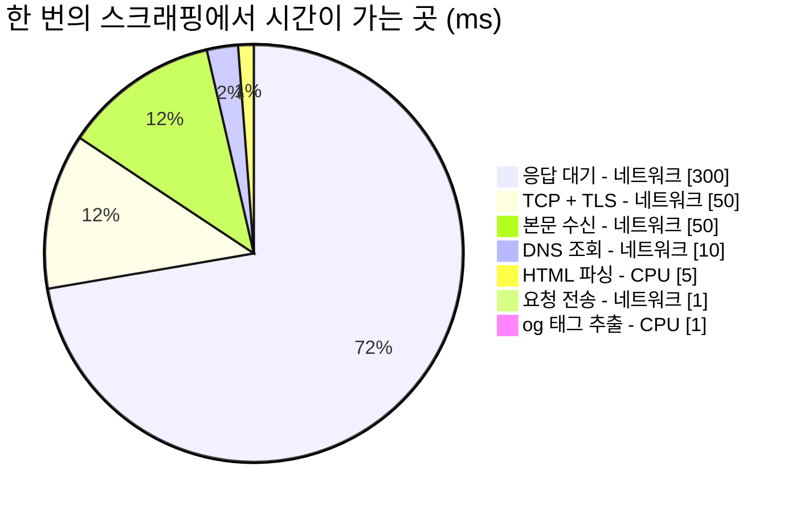
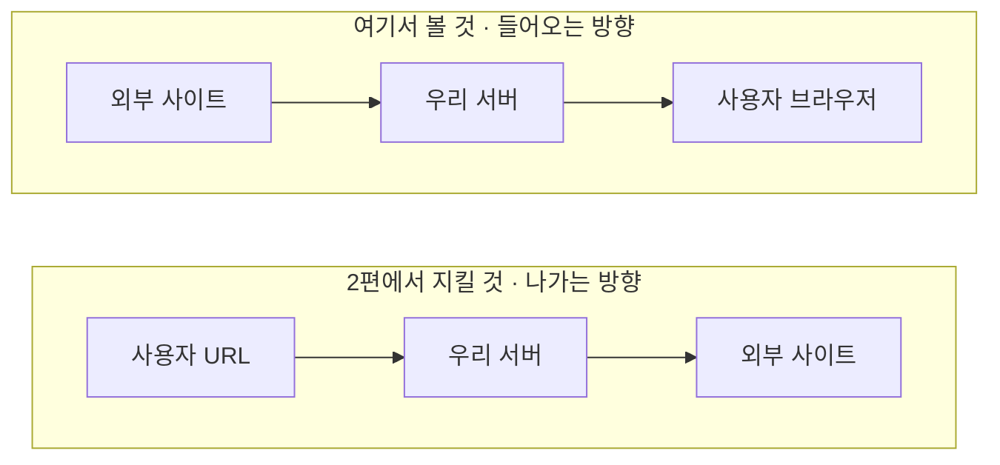
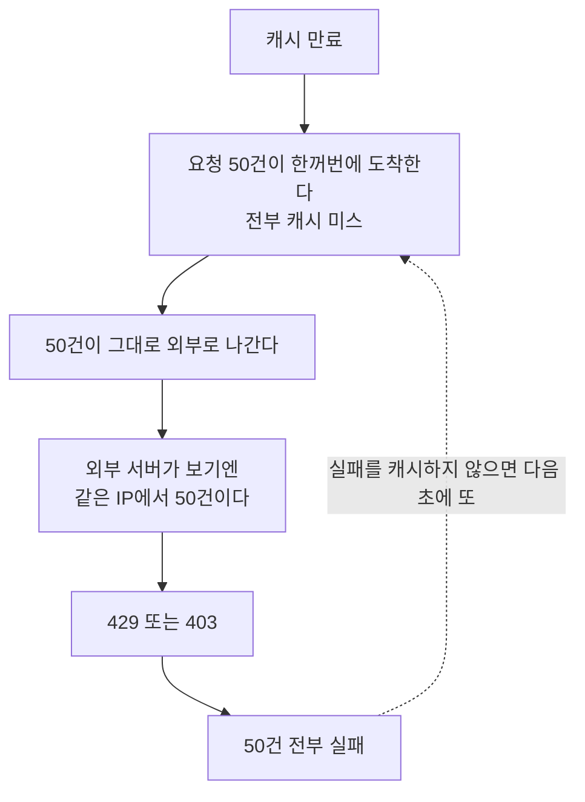
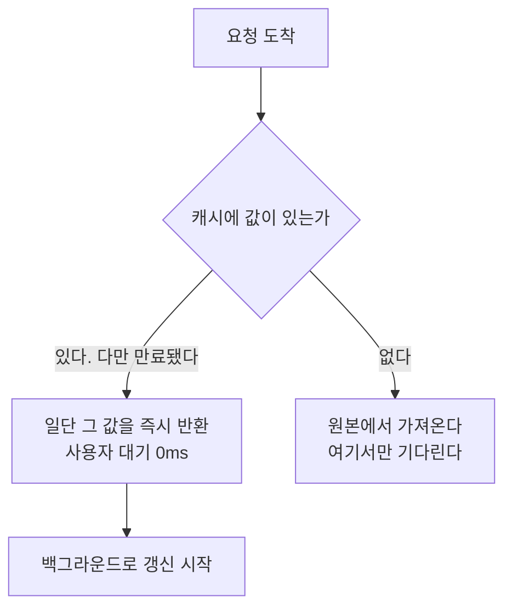

## Table of Contents

## 데모에서는 동작하는 세 줄

링크 미리보기는 명세만 보면 아주 단순한 기능이다. 사용자가 URL을 붙여넣으면 그 페이지의 제목과 이미지를 카드로 보여주면 된다. 코드로 옮기면 세 줄이다.

```ts
const html = await fetch(url).then((r) => r.text())
const $ = cheerio.load(html)
const title = $('meta[property="og:title"]').attr('content')
```

이 세 줄은 실제로 동작한다. 자기 블로그로 시험해 보면 제목이 잘 나온다. 문제는 이 코드가 프로덕션에 올라간 다음에 생긴다. 어느 시간대에는 실패율이 10%를 넘고, 원인을 물으면 "외부 사이트가 이상해서요"라는 답이 돌아오며, 개선안으로는 늘 "캐시를 넣죠"가 나온다. 그리고 캐시를 넣어도 숫자가 잘 안 움직인다.

이 시리즈는 그 세 줄이 무너지는 지점들을 순서대로 따라가 보는 설계 노트다. 사용법보다는 왜 그렇게 설계하게 되는지에 무게를 두었고, 특히 보안은 "이렇게 막으세요"보다 "어떻게 뚫리는가"를 먼저 보는 순서로 잡았다. 어떤 우회를 막는지 모르는 방어 코드는 방어라기보다 선언에 가깝다고 생각한다.

> 이 글에 나오는 상황 설정(에러율 10%, 일 5,000건, 팀 구성)은 논의를 위한 예시 시나리오다. 특정 서비스의 실제 지표가 아니다. 반면 코드의 동작을 확인한 대목은 전부 직접 돌려본 결과이고, 그런 대목에는 검증 환경을 따로 밝혀두었다. 이 시리즈의 실측 환경은 macOS(darwin 25.5.0), Node.js `v24.14.1`, undici `8.10.0`, htmlparser2 `12.0.0`, iconv-lite다.

## 상대가 우리 편이 아니다

세 줄이 무너지는 첫 번째 이유는 통신 상대의 성격에 있다.

우리가 평소에 짜는 대부분의 코드는 우리가 만든 서버, 혹은 최소한 계약이 있는 서버와 통신한다. 응답 형식이 바뀌면 통보를 받고, 느려지면 항의할 창구가 있고, 장애가 나면 같이 대응한다. 스크래핑은 그 전제가 전부 없는 통신이다.

응답이 느려도 항의할 곳이 없고, 우리를 봇으로 판단해 차단해도 마찬가지다. HTML이 규격에 안 맞아도 고쳐달라고 할 수 없고, 내일 갑자기 구조가 바뀌어도 통보받지 못한다. 외부 의존성 중에서도 통제력이 가장 낮은 종류에 속한다.

그래서 실패가 잦은데, 겉으로 보이는 실패의 얼굴이 하나가 아니다.

| 실패        | 겉으로 보이는 것       | 실제 원인            |
| ----------- | ---------------------- | -------------------- |
| 봇 차단     | `403 Forbidden`        | User-Agent 기반 차단 |
| 로그인 벽   | `200`인데 og 태그 없음 | 인증 요구            |
| 타임아웃    | 응답 없음              | 상대 서버 지연       |
| 인코딩 깨짐 | 제목이 `���`           | EUC-KR/CP949         |
| 리다이렉트  | `301`에서 멈춤         | 자동 추적 미구현     |

이 다섯이 대시보드에서는 "에러율 10%"라는 하나의 숫자로 뭉쳐 보인다. 그리고 다섯 중 인코딩 깨짐에는 더 조용한 변종이 있다. 제목이 깨진 글자로 바뀌는 것이 아니라 **멀쩡해 보이는 다른 글자로 바뀌는** 경우인데, 이건 200 응답에 og 태그도 정상이고 값만 틀리기 때문에 에러율에 아예 잡히지 않는다. 이 종류가 왜 특히 곤란한지는 이 글 뒷부분의 인코딩 절에서 실측과 함께 다룬다.

## 증상과 원인을 구분하기

여기서 이 시리즈 전체에 걸리는 첫 번째 전제가 나온다. **"에러율이 높다"는 증상이지 원인이 아니다.** 원인을 분류하지 않고 해법을 고르면 빗나가기 쉽고, 스크래핑에서 가장 흔한 오진이 "에러율이 높다, 그러니 캐시를 넣자"라고 생각한다.

캐시가 줄여주는 것은 같은 URL의 반복 요청이다. 앞의 다섯 실패에 하나씩 대보면 효과가 고르지 않다.

| 실패 원인                              | 캐시의 효과                             |
| -------------------------------------- | --------------------------------------- |
| 같은 URL 반복 요청으로 인한 rate limit | 크다                                    |
| User-Agent 봇 차단                     | 거의 없다. 캐시 미스마다 여전히 403이다 |
| 로그인 벽                              | 없다                                    |
| 타임아웃                               | 없다. 처음 보는 URL은 언제나 미스다     |
| 인코딩 실패                            | 없다                                    |

실패의 대부분이 아래 네 줄에 몰려 있는 상황이라면, 캐시를 넣어도 숫자는 거의 그대로 남을 가능성이 높다. 캐시가 쓸모없다는 뜻이 아니라, 캐시가 고치는 문제와 지금 겪는 문제가 같은 것인지 먼저 확인해야 한다는 뜻이다. 캐시 자체는 이 글 뒷부분에서 스탬피드까지 포함해 따로 다룬다.

그래서 코드를 고치기 전에 할 일은 측정이다. 거창할 필요는 없고 실패 지점에 로그 한 줄이면 시작할 수 있다.

```ts
logger.warn('og_scrape_failed', {
  reason, // FORBIDDEN | TIMEOUT | DECODE_FAIL | NO_OG_TAG | ...
  statusCode,
  host: url.hostname, // 전체 URL이 아니라 호스트만 남긴다
  elapsedMs,
})
```

전체 URL 대신 호스트만 남긴 것은 의도적이다. 사용자가 붙여넣은 URL에는 경로와 쿼리에 개인정보나 인증 토큰이 실려 있을 수 있고, 그것이 로그 저장소로 넘어가면 그 저장소의 접근 권한이 곧 개인정보 접근 권한이 된다. 원인 분류에는 호스트만으로 충분하다.

이 로그를 하루치만 모아도 실패의 원인별 비율과, 실패가 몇 개 도메인에 몰려 있는지가 나온다. 경험적으로 후자는 상위 몇 개 도메인이 절반 이상을 차지하는 경우가 많다. 이 두 숫자가 없으면 어떤 개선 목표를 세워도 근거를 붙이기 어렵다.

## 이 워크로드의 모양

측정을 시작했다고 치고, 이제 런타임 이야기로 넘어가려면 이 워크로드가 어떤 모양인지부터 정해야 한다. 한 번의 스크래핑에서 시간이 어디로 가는지 갈라보면 대략 이렇게 나뉜다.



네트워크를 기다리는 시간이 411ms, CPU를 쓰는 시간이 6ms 남짓이다. 대략 98% 대 2%다. 절대값은 대상 사이트에 따라 크게 흔들리지만 이 비율의 자릿수는 잘 안 바뀐다. 시간의 대부분이 남의 서버를 기다리는 데 들어가는, 전형적인 I/O 바운드 워크로드다.

규모도 같이 봐야 한다. 링크 미리보기는 대개 트래픽이 작은 기능이다. 일 5,000건이라고 가정하면,

```
5,000 / 86,400초 ≈ 0.06 TPS
피크를 평균의 10배로 잡아도 1 TPS 미만
```

이 숫자는 뒤에서 "서버를 따로 둘 근거가 있는가"를 따질 때 다시 쓰인다. 작은 트래픽에 큰 인프라를 붙이는 것도 설계 실패의 한 종류이고, 규모를 모르면 그게 과설계인지 아닌지 판단할 방법이 없다.

## 도움이 안 되는 주장 두 개

런타임 이야기를 시작하면 거의 항상 두 개의 주장이 먼저 나온다. 둘 다 결론을 정해두고 붙인 근거에 가깝다고 생각한다.

첫 번째는 이쪽이다.

> "스크래핑은 I/O 바운드니까 비동기에 강한 Node.js가 유리하다"

이건 근거가 되기 어렵다. JVM에도 논블로킹 I/O 스택이 있고(Netty, WebClient, 코루틴), Go나 Rust는 말할 것도 없다. 애초에 1 TPS 남짓한 부하에서는 스레드 풀 기반 블로킹 I/O로도 아무 문제가 없다. "비동기라서 유리하다"는 2010년대 초반에나 통하던 이야기고, 지금은 어느 런타임이든 한다.

두 번째는 반대편이다.

> "팀에 그 런타임 운영 노하우가 없으니 쓰면 안 된다"

이 주장의 문제는 한쪽에만 적용된다는 것이다. Node를 빼자고 할 때는 "프론트엔드 팀에 Node 서버 운영 경험이 없다"를 드는데, 그 대안이 "프론트엔드가 JVM 서버 저장소에 기여한다"라면 프론트엔드의 JVM 경험 부족도 같은 무게로 계산되어야 한다. 한쪽에만 적용되는 기준은 기준이라기보다 결론에 가깝다.

운영 경험이 중요하지 않다는 말은 아니다. 뒤에서 보겠지만 그건 실제로 가장 중요한 조건 중 하나다. 다만 그것을 한쪽에만 붙이면 비교가 되지 않는다.

이 두 주장을 치우고 나면 남는 지점이 보인다.

## 실제로 갈리는 네 지점

정리해 보면 네 개다. 소켓 직전까지의 통제권, 망가진 HTML을 브라우저처럼 파싱하는가, 인코딩, 그리고 누가 이 코드를 소유하는가. 세 번째는 Node가 불리한 항목인데 일부러 넣어두었다. 자기 편만 세는 비교는 신뢰하기 어렵다.

### 소켓 직전까지의 통제권

이 항목은 [2편](/2026/08/og-scraping-server-2) 전체가 그 이유를 설명하는 자리라, 여기서는 결론만 미리 적는다. 사용자가 준 URL을 서버가 대신 여는 기능에서 SSRF 방어의 핵심은 이렇게 요약된다.

> DNS가 해석한 IP를 우리가 검사하고, 그 검사한 IP로 직접 연결해야 한다.

대부분의 HTTP 클라이언트는 "이름을 주면 알아서 연결해 주는" 추상화라, 이 사이에 끼어들 틈을 주지 않는다. Node의 `undici`는 그 틈을 열어둔다.

```ts
new Agent({
  connect: {
    lookup(hostname, options, callback) {
      // 이 함수가 반환하는 주소로 소켓이 연결된다
    },
  },
})
```

JVM에서 같은 일을 하려면 보통 커스텀 DNS 리졸버를 구현해 HTTP 클라이언트에 주입하거나, 네트워크 계층에서 우회하거나, egress 프록시를 세워 강제하는 쪽으로 간다. 불가능한 일은 아니다. 다만 "함수 하나를 넘기면 된다"와는 난이도가 다르고, 이 난이도 차이가 실제로는 구현 여부를 가르는 경우가 많다. 보안 통제를 애플리케이션 코드로 표현할 수 있느냐가 중요한 이유는, 어려우면 결국 안 하게 되기 때문이다.

덧붙여, 2편에서 이 `lookup` 훅이 만능이 아니라는 것도 실측으로 확인하게 된다. 훅이 아예 호출되지 않는 경로가 있다.

### 망가진 HTML

스크래핑 대상의 HTML은 대체로 규격에 맞지 않는다.

```html
<meta property="og:title" content="제목 />
<!-- 닫는 따옴표가 없다 -->
<meta property="og:image" content="/hero.png" />
<head>
  <p>head 안에 있으면 안 되는 태그</p>
</head>
```

브라우저는 이런 문서도 정해진 규칙에 따라 복구해서 파싱한다. 그 규칙이 [WHATWG HTML 파싱 알고리즘](https://html.spec.whatwg.org/multipage/parsing.html)이고, `parse5`가 그 표준을 그대로 옮긴 구현이다. 어느 런타임에나 HTML 파서는 있지만, 표준의 오류 복구 규칙까지 따라가는 파서가 기본 선택지로 놓여 있는지는 생태계마다 차이가 있다.

여기서 정규식으로 og 태그를 뽑는 코드를 꽤 자주 보게 되는데, 위 같은 HTML에서 조용히 틀린 값을 낸다. 조용하다는 게 핵심이다. 예외가 나면 알아채기라도 하는데, 값만 틀리면 알 방법이 없다.

### 인코딩

여기는 Node가 불리한 자리다.

한국어 사이트에는 아직도 EUC-KR과 CP949가 남아 있다. JVM에는 CP949 디코더가 표준 JDK 안에 들어 있다.

```java
new String(bytes, Charset.forName("x-windows-949"))  // 확장 문자까지 정상
```

엄밀히는 `jdk.charsets` 모듈에 들어 있어서, jlink로 런타임을 최소화해 배포하면 이 모듈이 빠져 실패할 수 있다(`--add-modules jdk.charsets`로 넣는다). 그래도 의존성을 추가할 일은 아니다.

반면 Node의 내장 `TextDecoder`는 이 자리에서 조용히 실패한다.

```ts
new TextDecoder('euc-kr').decode(bytes) // CP949 확장 문자가 깨진다
```

실제로 돌려보면 `똠`이 `c`가 되고 `꼃`이 `X`가 된다. 예외도 없고 치환 문자도 아니고, 그냥 다른 글자가 된다. 실측 표와 이유는 뒤의 인코딩 절에 있고, 결론은 `iconv-lite` 의존성이 사실상 필수라는 것이다.

이건 Node의 단점이 맞고 감출 이유도 없다고 생각한다. 다만 의존성 하나로 해결되고, 순수 JS 구현이라 네이티브 빌드 부담도 없다는 점은 같이 적어둘 만하다.

### 누가 소유하는가

링크 미리보기는 기능 명세가 UI에 붙어 있는 종류다. 제목이 몇 자에서 잘리는가, 이미지가 없을 때 무엇을 보여주는가, `og:title`이 없으면 `<title>`로 대체하는가, 도메인 이름을 카드에 노출하는가. 이 결정들은 대체로 프론트엔드에서 난다.

변경 주도권이 프론트엔드에 있는 코드를 백엔드 저장소에 두면, 문구 하나 바꾸는 일에도 두 팀의 일정이 맞아야 한다. 기술적인 이유는 아니지만 실제로 가장 자주 비용이 나가는 부분이라고 생각한다.

## 고르지 말아야 할 조건

네 지점을 다 세고 나면 Node 쪽으로 기우는 것처럼 보이는데, 반대 방향의 조건도 같은 무게로 적어야 비교가 된다. 아래 중 여럿이 겹치면 Node를 고르지 않는 편이 낫다고 본다.

| 조건                          | 이유                                             |
| ----------------------------- | ------------------------------------------------ |
| 사내 표준 런타임이 JVM 하나뿐 | 배포, 시크릿, 로깅 파이프라인을 새로 뚫어야 한다 |
| 온콜 주체가 백엔드 조직       | 새벽에 깨는 사람이 못 읽는 코드가 된다           |
| APM과 모니터링이 JVM 전용     | 대시보드와 알람을 이중으로 관리하게 된다         |
| 보안 검토가 언어별로 나뉨     | 새 언어는 검토 주기가 처음부터 시작된다          |
| 트래픽이 1 TPS 미만           | 런타임 이전에 서버를 따로 둘 근거가 약하다       |

마지막 줄은 조금 더 풀어 쓸 가치가 있다. 앞에서 계산한 0.06 TPS를 놓고, 서버 분리의 흔한 근거들을 하나씩 대보면 이렇게 된다.

"스크래핑 CPU가 이벤트 루프를 막는다"는 걱정은 초당 0.06회의 5ms 파싱을 뜻하므로 점유율이 0.03% 수준이라 맞지 않는 걱정이다. "모니터링을 분리해야 한다"는 라우트별 메트릭 레이블로 해결되는 경우가 많아서 서버를 나눌 이유까지는 안 된다. "장애 격리가 필요하다"는 맞는 이야기인데, 다만 타임아웃과 서킷 브레이커만으로도 상당 부분 확보된다.

그래서 이 규모에서 서버를 나눌 만한 이유로 남는 것은 대개 조직적인 쪽이다. 그리고 그건 부끄러운 이유가 아니라고 생각한다. 누가 소유하고 누가 당직을 서는가는 실제 운영 비용을 결정하는 조건이지, 기술적인 이유를 대신하는 말이 아니다. 다만 그것을 성능 문제인 척 포장하지만 않으면 된다.

정리하면 이런 판단표가 나온다.

| 상황                                                                         | 권장                  |
| ---------------------------------------------------------------------------- | --------------------- |
| 프론트엔드가 소유, 사내에 Node 인프라 있음, SSRF 통제를 코드로 표현하고 싶음 | Node                  |
| 사내 표준이 JVM, 온콜이 백엔드, 트래픽 작음                                  | 기존 백엔드 서버 안에 |
| 트래픽 극소, 이미 Next.js가 있음, 보안 요구 낮음                             | 분리하지 않기         |
| 초당 수백 건, 지연에 민감                                                    | Go나 Rust도 검토      |

이 표에서 하고 싶은 말은 Node가 우월하다는 쪽이 아니라, 첫 줄의 조건에 해당할 때 고르는 선택지라는 쪽이다.

## 여기서부터는 되게 만드는 쪽이다

여기까지로 무엇을 짜야 하는지는 꽤 좁혀졌다. "에러율 10%"가 성질이 다른 다섯 종류의 실패였다는 것, 캐시는 그중 일부만 고친다는 것, 이 워크로드가 I/O 바운드에 저 TPS라는 것, 런타임이 갈리는 지점이 네 개라는 것까지 왔다.

네 지점 중 첫 번째로 꼽은 "소켓 직전까지의 통제권"이 왜 필요한지는 이 글에서 다루지 않는다. [2편](/2026/08/og-scraping-server-2)이 통째로 그 자리다. 사용자가 준 URL을 서버가 대신 여는 일이 왜 그렇게 위험한지, 화이트리스트로 막았다고 믿는 코드가 어떤 여섯 가지 방법으로 뚫리는지, 그리고 그것을 막는 코드를 실제로 돌려보면 무엇이 틀렸는지를 다룬다.

이 글의 나머지는 뚫리지 않는 법이 아니라 되게 만드는 법이다. 앞에서 실패 원인을 분류하라고 했으니, 실제로 분류했다고 치고 시작한다. 그렇게 나눠보면 403이 압도적인 비중을 차지하는 경우가 많다.

## User-Agent가 에러율을 가른다

많은 사이트가 미리보기 봇에만 OG 태그를 내준다. 이런 이름들이다.

```
facebookexternalhit/1.1
Twitterbot/1.0
Slackbot-LinkExpanding 1.0
Discordbot/2.0
```

`undici`나 `node-fetch`의 기본 User-Agent로 요청하면 차단 대상이 되는 경우가 많다. 그래서 남의 UA를 쓸 것인가 하는 질문이 바로 따라오는데, 트레이드오프를 정직하게 적으면 이렇게 된다.

| 선택                       | 얻는 것                                  | 잃는 것                                          |
| -------------------------- | ---------------------------------------- | ------------------------------------------------ |
| `facebookexternalhit` 사칭 | 성공률이 크게 오른다                     | 신원 위조다. 상대가 차단 정책을 바꿀 근거를 준다 |
| 자체 UA에 연락처 명시      | 정직하고, 문제가 생기면 연락받을 수 있다 | 초기 성공률이 낮다                               |

권하고 싶은 쪽은 자체 UA에 연락처를 넣는 것이다.

```
MyPreviewBot/1.0 (+https://example.com/bot)
```

성공률이 문제라면 차단하는 상위 도메인을 목록으로 뽑아 개별 대응하는 편이, 전면 사칭보다 되돌리기 쉽다고 생각한다. 사칭은 한 번 시작하면 중단하기 어려운 결정이다.

robots.txt를 지켜야 하는지는 기술 문제라기보다 정책 문제다. 정답이 없다는 것을 인정하고 시작하는 편이 낫다. 크롤링이 아니라는 쪽의 이야기는 사용자가 명시적으로 붙여넣은 단일 URL 한 건을 가져오는 것이고 링크를 따라 순회하지 않으니 브라우저의 동작에 가깝다는 것이다. 크롤링이라는 쪽의 이야기는 사람이 아니라 서버가 자동으로 요청한다는 것이고, 그게 봇의 정의라는 것이다.

실무 관행은 갈리는데, 최소한 지킬 만한 선은 이 정도라고 본다. 같은 도메인에 동시 요청은 1건으로 제한하고 초당 요청 상한을 두는 것, 실패한 도메인에 재시도를 반복하지 않는 것(뒤에서 볼 negative caching이 여기서도 쓰인다), 그리고 조직 차원의 정책으로 문서화하는 것이다.

이건 상대를 보호하는 상한이다. 우리 쪽에도 상한이 필요한데, 아무 URL이나 대신 열어주는 창구를 인증이나 쿼터 없이 열어두면 제3자 공격의 경유지나 신원 세탁 통로가 되기 때문이다. 요청하는 쪽에도 rate limit을 건다.

## 인코딩, 한국어 사이트의 현실

아직도 EUC-KR과 CP949로 서비스되는 사이트가 있다. 공공기관, 오래된 언론사, 커뮤니티에 특히 많다.

```ts
const html = buffer.toString('utf-8') // EUC-KR이면 전부 깨진다
```

`Buffer.toString()`의 기본값이 UTF-8이라, 이 한 줄이 조용히 실패한다. 그리고 깨진 제목은 에러로 잡히지 않는다. 200 응답에 og 태그도 있고 값만 `���`이다.

인코딩을 결정하는 표준 순서가 [WHATWG HTML Standard](https://html.spec.whatwg.org/multipage/parsing.html#determining-the-character-encoding)에 정의되어 있다. 눈여겨볼 점은 **감지가 맨 마지막**이라는 것이다.

| 순위 | 근거                          | 이유                                   |
| ---- | ----------------------------- | -------------------------------------- |
| 1    | BOM                           | 바이트로 박혀 있다. 모든 선언을 덮는다 |
| 2    | HTTP `Content-Type`의 charset | 전송 계층의 선언                       |
| 3    | `<meta charset>` 미리 훑기    | 문서 자신의 선언 (앞 1024바이트)       |
| 4    | 휴리스틱 감지나 기본값        | 추론이라 틀릴 수 있다                  |

`jschardet` 같은 감지 라이브러리를 1순위에 두는 코드를 종종 보는데, 순서가 뒤집힌 셈이다. 명시적인 선언이 있는데 추측할 이유는 없다.

코드로 옮기면 이렇게 된다.

```ts
function resolveCharset(head: Buffer, contentType?: string): string {
  // 1. BOM
  if (head[0] === 0xef && head[1] === 0xbb && head[2] === 0xbf) return 'utf-8'
  if (head[0] === 0xfe && head[1] === 0xff) return 'utf-16be'
  if (head[0] === 0xff && head[1] === 0xfe) return 'utf-16le'

  // 2. HTTP 헤더
  const fromHeader = contentType?.match(/charset\s*=\s*"?([\w-]+)/i)?.[1]
  if (fromHeader) return fromHeader.toLowerCase()

  // 3. 앞 1024바이트를 latin1로 훑는다
  const prescan = head.subarray(0, 1024).toString('latin1')
  const fromMeta = prescan.match(/<meta[^>]+charset\s*=\s*["']?([\w-]+)/i)?.[1]
  if (fromMeta) return fromMeta.toLowerCase()

  // 4. 여기까지 오면 그때 추론한다
  return 'utf-8'
}
```

3번에서 하필 `latin1`로 훑는 이유가 있다. 닭과 달걀 문제이기 때문이다. 인코딩을 알려면 meta 태그를 읽어야 하는데, meta 태그를 읽으려면 인코딩을 알아야 한다.

`latin1`이 이 고리를 끊어준다. 바이트와 문자가 1:1로 대응하고(0x00 ~ 0xFF가 U+0000 ~ U+00FF로), 어떤 바이트 열이 와도 예외를 던지지 않으며, ASCII 범위가 그대로 보존된다. `<meta charset="euc-kr">`은 전부 ASCII다. 손실 없이 훑어보기만 하는 용도이고, 실제 디코딩은 charset을 확정한 뒤 원본 바이트에 다시 한다. `utf-8`로 미리 훑으면 EUC-KR 바이트가 치환 문자로 바뀌면서 위치가 밀릴 수 있다.

### `euc-kr` 라벨의 함정

한국어권에서 특히 알아둘 만한 지점이다.

EUC-KR은 KS X 1001 완성형이고 한글 2,350자만 표현한다. CP949(UHC)는 그 확장으로 한글 11,172자 전부를 담는다. 그런데 현실의 HTML은 **CP949 문자를 쓰면서 `charset=euc-kr`이라고 선언**하는 경우가 많다. 엄격한 EUC-KR 디코더를 쓰면 확장 영역 글자가 깨진다.

[WHATWG Encoding Standard](https://encoding.spec.whatwg.org/#legacy-multi-byte-korean-encodings)는 이 현실을 반영해서 `euc-kr` 라벨을 CP949 확장까지 덮도록 정의한다. 그런데 Node의 내장 `TextDecoder`는 그 정의를 따르지 않는다.

파이썬으로 CP949 인코딩한 바이트를 `new TextDecoder('euc-kr')`에 넣어 확인한 결과다.

| 문자 | CP949 바이트 | 영역           | `TextDecoder` | `iconv-lite` |
| ---- | ------------ | -------------- | ------------- | ------------ |
| 한   | `c7d1`       | KS X 1001 기본 | `한`          | `한`         |
| 글   | `b1db`       | KS X 1001 기본 | `글`          | `글`         |
| 뷁   | `94ee`       | CP949 확장     | `�`           | `뷁`         |
| 똠   | `8c63`       | CP949 확장     | **`c`**       | `똠`         |
| 꼃   | `8458`       | CP949 확장     | **`X`**       | `꼃`         |
| 펲   | `bc84`       | CP949 확장     | `�`           | `펲`         |

라벨을 바꿔도 결과는 같다. `windows-949`와 `ks_c_5601-1987`도 동일하게 깨지고, `cp949` 라벨은 `RangeError`를 던진다.

여기서 정말 곤란한 것은 `똠`이 `c`가 되고 `꼃`이 `X`가 되는 쪽이다. 치환 문자(`�`)라면 눈에 띄기라도 하는데, **멀쩡해 보이는 다른 글자**가 되면 로그를 봐도 이상한 줄 모른다.

그래서 `iconv-lite`가 사실상 필수가 된다.

```ts
import iconv from 'iconv-lite'

function decode(bytes: Buffer, charset: string): string {
  if (iconv.encodingExists(charset)) {
    return iconv.decode(bytes, charset) // 'euc-kr', 'cp949' 둘 다 CP949로 처리한다
  }
  return iconv.decode(bytes, 'utf-8') // 모르는 라벨이면 UTF-8로 넘어간다
}
```

`encodingExists` 검사를 생략하면 안 된다. `charset="unicode"` 같은 값이 실제로 존재하고, 확인해 보면 `iconv.encodingExists('unicode')`는 `false`다. 이 경우를 잡지 않으면 예외가 그대로 올라온다.

앞에서 "인코딩은 Node가 불리한 지점"이라고 했던 게 이 자리다. JVM은 `Charset.forName("x-windows-949")` 한 줄로 표준 라이브러리 안에서 끝난다.

정리하면 이 버그의 진행은 이렇다. 응답은 200이고, og 태그도 정상적으로 있고, 파싱도 성공하고, 제목만 "똠방각하" 대신 "c방각하"가 된다. **어떤 계층에서도 에러가 발생하지 않는다.** 에러율 대시보드는 깨끗하고 알람도 울리지 않으며, 사용자가 제보하기 전까지 아무도 모른다. 뒤에서 커버리지(미리보기를 시도한 URL 중 실제로 성공한 비율)를 따로 재야 한다고 말할 텐데, 이유가 이것이다. 성공 응답 중에도 실패가 숨어 있다.

### `<head>`만 읽고 끊는다

og 태그는 대부분 `<head>` 안에 있다. `</head>`가 나오면 멈춰서 본문 전체를 받지 않을 수 있다. 트리를 만드는 `parse5`(앞에서 언급한 그 파서다) 대신, 조각을 그때그때 읽고 멈출 수 있는 스트리밍 파서인 `htmlparser2`를 쓴다.

```ts
import {Parser} from 'htmlparser2'

let headDone = false
const parser = new Parser({
  onopentag(name, attribs) {
    if (name === 'meta' && attribs.property?.startsWith('og:'))
      result[attribs.property] = attribs.content
  },
  onclosetag(name) {
    if (name === 'head') headDone = true
  },
})

for await (const chunk of res.body) {
  parser.write(decode(chunk))
  if (headDone) {
    res.body.destroy() // head가 끝나면 그 자리에서 수신을 끊는다
    break
  }
}
```

`parser.pause()`만으로는 다운로드가 멈추지 않는다. 파서가 콜백을 잠시 미룰 뿐 서버가 보내는 바이트는 계속 쌓이므로, 실제로 멈추려면 위처럼 응답 스트림을 `destroy()`로 끊어야 한다.

효과는 둘이다. 대부분의 페이지에서 앞 몇 KB만 읽으면 되니 빨라지고, [2편](/2026/08/og-scraping-server-2)에서 정할 응답 크기 상한에 도달할 일도 줄어든다.

다만 트레이드오프가 있다. og 태그가 드물게 `<head>` 밖으로 밀려난 페이지에서는 일찍 끊으면 그 값을 놓친다. 뒤에 나올 커버리지를 조금 깎는 셈이라, 커버리지가 더 중요하면 상한(512KB)까지 계속 읽는 선택도 된다.

한 가지 덧붙이면, EUC-KR 같은 멀티바이트 글자가 조각 경계에 걸릴 수 있어서 조각마다 바로 디코딩하면 글자가 깨진다. 실무에서는 head 구간을 모아 한 번에 디코딩하거나 `iconv` 스트림 디코더를 쓴다. 위 코드는 흐름을 보이려고 단순화했다.

## 스크랩해 온 값은 사용자 입력이다

여기서 방향이 한 번 바뀐다.

[2편](/2026/08/og-scraping-server-2)에서 지킬 것은 우리 서버가 **나가는** 방향이다. 남이 준 URL로 아무 데나 요청하지 않도록. 여기서 볼 것은 **가져온 값이 우리 화면으로 들어오는** 방향이다.



두 방향은 위험의 성격이 다른데 이유는 같다. 상대가 우리 편이 아니라는 것이다.

`og:title`을 누가 정하는가. 우리가 요청한 그 사이트다. 그 사이트는 아무 문자열이나 넣을 수 있고, 우리는 그 문자열을 받아서 우리 도메인의 화면에 그린다. 남이 쓴 글자가 우리 페이지 안에서 살아나는 셈이다.

폼 입력값을 검증하는 습관은 대체로 갖고 있는데, 스크래핑 결과는 "데이터를 가져온 것"처럼 느껴져서 그 습관이 잘 작동하지 않는 것 같다. `og:title`은 API 응답이 아니라 사용자 입력이다. 입력 필드에 넣지 않았을 뿐 신뢰도는 같다.

### 파서가 이미 디코딩해서 준다

여기서 오해가 하나 생긴다. HTML 속성 안에 있으니 `&lt;script&gt;` 같은 형태로 오리라는 생각이다. 그렇지 않다. 파서가 엔티티를 풀어서 준다.

```ts
const html =
  '<meta property="og:title" content="A &amp; B &lt;script&gt; &#48156;">'
```

이 문자열을 `htmlparser2`에 넣고 `attribs.content`를 받아보면 결과가 이렇다.

```
opts= undefined                 -> "A & B <script> 발"
opts= {"decodeEntities":false}  -> "A &amp; B &lt;script&gt; &#48156;"
```

`decodeEntities`가 기본으로 켜져 있다. 꺾쇠는 이미 진짜 꺾쇠이고, **값 안에 태그가 들어 있는 상태로** 우리 손에 온다.

그러면 옵션을 끄면 되지 않느냐는 생각이 드는데, 이건 해법이 아니다. 정상적인 제목 `삼성 & LG`가 사용자에게 `삼성 &amp; LG`로 보이게 되고, 값을 그리는 자리가 HTML이 아닐 수도 있다. 모바일 앱, 슬랙 카드, 푸시 알림이 그런 자리다. 받는 단계에서 형태를 비틀어 막으려는 시도는 대체로 다른 곳을 망가뜨린다.

원칙은 이렇다. **막는 자리는 검증하는 자리가 아니라 쓰는 자리다.** 값은 디코딩된 원문 그대로 들고 있다가, 화면에 넣는 순간 그 자리에 맞게 처리한다. 2편에서 URL을 다룰 때도 같은 원칙이 반복된다.

### 자리마다 규칙이 다르다

"React를 쓰니까 안전하지 않나"라는 답은 절반만 맞다고 생각한다. React나 Vue는 텍스트 자리를 자동으로 이스케이프한다.

```tsx
<h3>{og.title}</h3> // 안전하다. <script>는 글자로 보인다
```

문제는 자동으로 처리되지 않는 자리가 생각보다 많다는 것이다.

```tsx
<div dangerouslySetInnerHTML={{__html: og.title}} />  // 위험하다
<a href={og.url}>                                     // 스킴 검사가 필요하다
                                // 아래에서 따로 본다
```

그리고 화면 밖은 프레임워크의 보호가 아예 닿지 않는다. 서버에서 문자열로 조립하는 이메일 HTML, 슬랙이나 디스코드 카드, OG 이미지를 SVG로 만들어 굽는 코드, `innerHTML`을 직접 쓰는 오래된 화면 같은 것들이다. "우리는 React를 쓴다"보다는 그 값이 지나가는 자리를 전부 세어봤는가가 답에 가깝다.

같은 문자열이라도 어디에 넣느냐에 따라 위험한 글자가 달라진다.

| 넣는 자리        | 예                     | 필요한 처리                              |
| ---------------- | ---------------------- | ---------------------------------------- |
| HTML 텍스트      | `<h3>여기</h3>`        | `< > & " '` 이스케이프 (프레임워크 담당) |
| HTML 속성        | ``     | 이스케이프에 더해 반드시 따옴표로 감싸기 |
| URL 자리         | `<a href="여기">`      | 스킴 검사. 이스케이프로는 부족하다       |
| 쿼리스트링       | `?q=여기`              | `encodeURIComponent`                     |
| 스크립트 안 JSON | `<script>window.__D=…` | 그 자리 자체를 피한다                    |

세 번째가 특히 헷갈리는 자리다. `javascript:alert(1)`은 이스케이프해도 여전히 `javascript:`다. 특수문자가 없기 때문이다. 이스케이프는 글자를 글자로 만드는 처리라서, 주소가 주소로 해석되는 문제는 막지 못한다.

### `og:image`는 문자열이 아니라 주소다

`og:image`는 화면에 그리기 전에 한 번 더 생각할 값이다. 이유가 셋이다.

스킴이 http나 https라는 보장이 없다. `data:`로 수십 MB짜리 이미지를 박아 넣을 수 있고, 상대 경로면 최종 URL 기준으로 풀어야 한다.

그대로 브라우저에 넘기면 상대 서버가 우리 사용자를 보게 된다. 우리 페이지를 여는 모든 사용자의 IP와 User-Agent가 그 사이트 로그에 남는다.

그렇다고 우리 서버가 대신 받아오면 [2편](/2026/08/og-scraping-server-2)의 문제가 그대로 재현된다. 이미지 프록시는 결국 사용자 입력 URL을 서버가 여는 일이라, 2편에서 다룰 검증을 통째로 다시 적용해야 한다.

셋 중 무엇을 고르든 답이 된다. 다만 고르지 않고 넘어가는 것은 답이 아니라고 생각한다.

마지막으로 사소해 보이지만 실제로 겪게 되는 것들이 있다. `og:title`이 수백 KB로 오는 경우가 있어서 저장 전에 자르는 편이 낫고(200자 안팎이면 충분하다), 같은 `og:` 태그가 여러 번 나올 때 어느 것을 쓸지 정해서 문서화해야 한다(먼저 나온 것으로 정하는 쪽이 무난하다). 값이 빈 문자열인 경우와 태그 자체가 없는 경우는 구분해야 하는데, 뒤에 나올 negative caching에서 둘의 수명이 다르기 때문이다. 제어문자와 줄바꿈을 걸러내지 않으면 로그와 카드 레이아웃이 같이 깨진다. 자르는 위치도 조심할 필요가 있다. UTF-16 기준으로 자르면 이모지가 반토막 난다.

2편에서는 꽤 긴 분량을 들여 "남이 준 URL을 믿지 말라"고 말하게 된다. 여기서 본 것은 그 반대쪽이다. 그 URL이 돌려준 답도 남이 쓴 것이다.

## 캐시는 무엇을 고치고 무엇을 못 고치는가

앞에서 미뤄둔 이야기를 정리할 차례다.

| 지표                               | 캐시의 효과         |
| ---------------------------------- | ------------------- |
| 외부 서버로 나가는 요청 수         | 크게 준다           |
| 캐시 히트 시 응답 시간             | 수백 ms에서 수 ms로 |
| API 전체 에러율                    | 부분적이다          |
| URL 커버리지 (성공 URL / 시도 URL) | 개선되지 않는다     |

에러율이 "부분적"인 이유는 캐시가 같은 URL이 반복돼서 생기는 실패(rate limit, 일시적 장애)만 줄이기 때문이다. 403이나 로그인 벽, 인코딩처럼 그 URL이면 늘 실패하는 것은 negative caching으로 캐시해도 여전히 실패 응답이라, 에러율 숫자는 내려가지 않는다.

마지막 줄이 핵심이다. 처음 보는 URL은 언제나 캐시 미스이고, 그때 실패하면 사용자는 여전히 깨진 카드를 본다.

그래서 목표를 두 개로 쪼개는 편이 낫다고 생각한다.

```
① API 에러율   = 실패 응답 / 전체 API 요청          ← 반복 요청발 실패만 캐시로 개선된다
② 커버리지     = 성공한 고유 URL / 시도한 고유 URL   ← 스크래핑 품질로 개선된다
```

①만 목표로 잡으면 캐시 히트율이 오르는 것만으로 숫자가 좋아진다. 사용자 경험은 그대로인데 지표만 좋아지는 전형적인 함정이다. ②를 올리려면 UA 조정, 리다이렉트 처리, 인코딩 대응처럼 이 글의 앞부분에서 다룬 것들을 해야 한다.

### 스탬피드의 정의를 바로잡기

흔히 "캐시가 만료되어 DB에 요청이 몰리는 현상"이라고 설명하는데, 스크래핑 서버에서 뒷단은 DB가 아니라 외부 사이트다. 정확히 쓰면 이렇게 된다.

> 어떤 캐시 키가 만료되는 순간, 그 키를 기다리던 동시 요청이 전부 원본으로 나가는 현상

인기 있는 링크일수록 심하고, **상대는 그걸 공격으로 인식한다.**



캐시를 넣었는데 에러율이 오르는 상황이 실제로 생긴다. 그래서 캐시는 넣는 것보다 어떻게 넣는가가 중요하다.

앞에서 계산한 평시 규모(0.06 TPS)로는 이런 순간이 잘 오지 않는다. 문제는 평균이 아니라 인기 링크 하나에 트래픽이 확 몰리는 순간이고, 위의 "50건"은 그 순간을 그린 것이다.

### 그 전에 캐시 키부터

캐시를 논하기 전에 "같은 URL"이 무엇인지 정해야 한다. 아래는 사람 눈에는 같은 페이지지만 문자열로는 전부 다르다.

```
https://Example.com/a?b=1&c=2
https://example.com/a?c=2&b=1
https://example.com/a?b=1&c=2#section
https://example.com/a?b=1&c=2&utm_source=twitter
```

정규화 없이 URL을 그대로 키로 쓰면 이 넷이 각각 따로 캐시된다. 히트율이 떨어지고, 뒤에 나올 single-flight도 같은 키로 묶지 못해 스탬피드 방어가 헐거워진다.

최소한 이 정도는 맞춰두는 편이 낫다. `#fragment` 제거(서버 응답과 무관하다), 호스트 소문자화, `utm_*` 같은 알려진 추적 파라미터 제거(임의의 파라미터는 내용이 달라질 수 있으니 건드리지 않는다), 쿼리 파라미터 정렬이다.

[2편](/2026/08/og-scraping-server-2)에 나올 "주소 정규화를 직접 하지 말라"와 헷갈리기 쉬운데, 목적이 다르다. 보안 검사에는 원문을 쓰고(`BlockList`가 판단한다), 캐시 키에는 정규화본을 쓴다. 목적이 다르니 규칙도 다르다.

### 대응 세 가지

첫 번째는 single-flight다. 같은 키의 동시 요청 중 하나만 원본으로 보내고 나머지는 그 결과를 공유한다.

```ts
const inflight = new Map<string, Promise<OgResult>>()

function once(key: string, fn: () => Promise<OgResult>) {
  const running = inflight.get(key)
  if (running) return running // 이미 누가 가져오는 중이다

  const p = fn().finally(() => inflight.delete(key))
  inflight.set(key, p)
  return p
}
```

가장 싸고 효과가 크다. 50건이 1건이 된다. 한계는 프로세스 안에서만 동작한다는 것이고(인스턴스가 N개면 최대 N건이 나간다), 대표 1건이 실패하면 대기하던 나머지도 같은 실패를 받는다는 것이다. 실패 공유가 곤란하면 성공만 공유하는 변형을 쓴다.

두 번째는 stale-while-revalidate다. 만료된 값을 일단 돌려주고 갱신은 백그라운드에서 한다.



OG 데이터는 몇 분 낡아도 큰 문제가 없어서, 이 워크로드에 잘 맞는 전략이다. single-flight과 같이 쓰면 백그라운드 갱신도 키당 1건으로 묶인다.

세 번째는 negative caching이다. 실패도 캐시해야 한다. 이게 빠지면 실패 URL이 매 요청마다 외부로 나가고, 에러율이 10%인 상황에서 이건 꽤 큰 누수다.

```ts
function ttlFor(result: OgResult): number {
  if (result.ok) return 60 * 60 // 성공: 1시간

  switch (result.reason) {
    case 'NOT_FOUND':
      return 60 * 30 // 404는 잘 안 바뀐다
    case 'FORBIDDEN':
      return 60 * 10 // 봇 차단. 정책이 바뀌면 풀릴 수 있어 404보다 짧게
    case 'RATE_LIMITED':
      return result.retryAfter ?? 60 // Retry-After를 존중한다
    case 'TIMEOUT':
      return 30 // 일시적일 수 있으니 짧게
    default:
      return 60
  }
}
```

실패 종류별로 TTL을 나누는 이유는, 전부 같은 TTL을 주면 둘 중 하나가 잘못되기 때문이다. 짧게 통일하면 404처럼 잘 안 바뀔 실패를 계속 재시도하게 되고, 길게 통일하면 일시적인 타임아웃 때문에 멀쩡한 링크가 오래 죽어 있게 된다. 실패의 성질이 다르니 수명도 달라야 한다. 앞에서 실패를 원인별로 분류하라고 한 것이 여기서 쓰인다. 원인 분류는 관측만을 위한 게 아니라 설계 결정의 입력이다.

### 로컬 캐시가 무너지는 지점

`Map` 하나로 만든 인메모리 캐시는 인스턴스가 하나일 때만 잘 동작한다.

| 항목                             | 인스턴스 1개 | 인스턴스 N개 (균등 라우팅)     |
| -------------------------------- | ------------ | ------------------------------ |
| 같은 URL이 같은 캐시를 만날 확률 | 100%         | 약 1/N                         |
| 외부로 나가는 요청               | 1건          | 최대 N건                       |
| 배포 시                          | 캐시 소실    | 캐시 소실                      |
| 오토스케일 아웃                  | 해당 없음    | 새 인스턴스는 캐시가 비어 있다 |

"인메모리 캐싱을 적용한다"와 "다중 인스턴스로 운영한다"는 같이 쓰면 서로를 갉아먹는다.

그렇다고 항상 Redis인 것은 아니다. 판단 기준은 인스턴스 수와 고유 URL 분포다.

| 상황                        | 권장                                   |
| --------------------------- | -------------------------------------- |
| 인스턴스 1~2개, 트래픽 작음 | 로컬 캐시로 충분하다. Redis는 과설계다 |
| 인스턴스 3개 이상           | 분산 캐시를 검토                       |
| 인기 URL이 소수에 집중      | 2계층(로컬 + Redis)이 효율적이다       |
| 배포가 잦음                 | 분산 캐시. 로컬은 배포마다 비워진다    |

2계층 구성이 실무에서 가장 흔하다고 알고 있다. 로컬이 자주 찾는 키를 흡수하고 Redis가 나머지를 받는 형태다.

## "P95 1초 미만"은 달성 가능한 목표인가

목표를 이렇게 쓰는 경우가 많다.

> 응답 시간을 P95 기준 1초 미만으로 줄인다

나쁜 목표는 아닌데, 달성 가능한지 계산해 본 적이 있는가를 먼저 물어볼 만하다. 그리고 계산할 수 있다. 필요한 건 캐시 히트율 하나다.

캐시 히트는 항상 빠르다고 하고(대략 5ms), 히트율을 `h`라 한다. 전체 요청을 지연 순으로 정렬하면 앞쪽 `h` 비율이 히트 구간이다.

`h`가 0.95보다 크면 95번째 백분위가 히트 구간 안에 들어오므로 P95는 5ms 언저리가 되고 목표는 자동으로 달성된다. `h`가 0.95보다 작으면 P95는 미스 구간에 있고, 미스 분포에서 몇 번째 백분위인지는 이렇게 나온다.

```
q = (0.95 - h) / (1 - h)
```

`q`는 외부 서버 응답 시간 분포에서 우리가 만족시켜야 하는 분위수다.

| 히트율 `h` | 필요한 분위수 `q` | 무엇을 만족해야 하는가                          |
| ---------- | ----------------- | ----------------------------------------------- |
| 0.96 이상  | 해당 없음         | 목표 자동 달성 (P95가 히트 구간 안에 있다)      |
| 0.95       | 경계              | 근소한 변동으로 미스 구간에 걸린다. 여유가 없다 |
| 0.90       | 0.500             | 외부 응답 중앙값이 1초 미만이어야 한다          |
| 0.80       | 0.750             | 외부 P75가 1초 미만이어야 한다                  |
| 0.70       | 0.833             | 외부 P83이 1초 미만이어야 한다                  |
| 0.50       | 0.900             | 외부 P90이 1초 미만이어야 한다                  |

이 공식이 실제로 맞는지 200만 건 시뮬레이션으로 확인했다. 외부 응답 시간을 로그정규 분포(중앙값 400ms)로 두고, 히트율별로 전체 분포의 P95와 공식이 지목한 미스 분포의 `q` 분위수를 비교한 결과다.

| 히트율 `h` | 공식 `q`  | 시뮬레이션 P95 | 공식이 지목한 값 | 오차  |
| ---------- | --------- | -------------- | ---------------- | ----- |
| 0.96       | 해당 없음 | 5.0ms          | 5.0ms            | 0.00% |
| 0.90       | 0.500     | 400.6ms        | 400.1ms          | 0.13% |
| 0.80       | 0.750     | 733.9ms        | 734.2ms          | 0.04% |
| 0.70       | 0.833     | 953.2ms        | 953.2ms          | 0.01% |
| 0.50       | 0.900     | 1265.7ms       | 1265.6ms         | 0.01% |

오차가 0.13% 이내로 일치한다. 분포 모양을 바꿔도 마찬가지인데, 공식이 특정 분포를 가정하지 않고 순전히 분위수의 위치만 따지기 때문이다.

여기서 눈여겨볼 것은 표의 오른쪽 칸이 **우리가 통제할 수 없는 값**이라는 점이다. 상대 서버의 응답 시간이다. 히트율이 낮을수록 목표 달성 여부가 남의 손에 넘어간다. 그러니 "P95 1초"를 약속하기 전에 히트율을 약속할 수 있는지부터 물어보는 순서가 맞다고 생각한다.

히트율은 고유 URL 비율에서 나온다.

```
히트율 ≈ 1 - (TTL 기간 내 고유 URL 수 / TTL 기간 내 전체 요청 수)
```

이 숫자는 지금 당장 측정할 수 있다. 액세스 로그에서 URL을 세기만 하면 된다.

```bash
# TTL을 1시간으로 잡았을 때의 상한 추정
# $7 은 URL이 들어 있는 칸 번호다. 자기 로그 포맷에 맞는 번호로 바꾼다
cat access.log | grep og_scrape | awk '{print $7}' \
  | sort | uniq -c | awk '{total+=$1; uniq++} END {print 1 - uniq/total}'
```

이 한 줄을 돌려보기 전에 P95 목표를 정하면, 그 목표에 근거가 없는 셈이 된다.

그래서 목표는 이렇게 쓰는 편이 낫다고 생각한다. 나쁜 목표는 이런 모양이다.

> 에러율을 5% 미만으로, P95를 1초 미만으로 줄인다

근거를 붙이면 이렇게 바뀐다.

> **선행 측정**: 실패 원인별 비율, 상위 실패 도메인, 1시간 TTL 기준 고유 URL 비율
>
> **목표 1 (커버리지)**: 시도한 고유 URL 중 미리보기 성공 비율을 현재 `X%`에서 `Y%`로. 주 수단은 UA 조정과 리다이렉트 처리이고 캐시가 아니다
>
> **목표 2 (지연)**: 캐시 히트율 `0.85` 달성 시 P95 `Z ms`. 히트율이 `0.8` 미만이면 P95 목표를 재설정한다
>
> **비목표**: 동적 렌더링 지원, 이미지 재호스팅

차이는 숫자가 아니라 근거의 유무다.

## 설계 체크리스트

두 편에 흩어진 것을 한자리에 모으면 이렇게 된다. 보안 항목의 근거는 [2편](/2026/08/og-scraping-server-2)에서 하나씩 나온다.

**보안 ([2편](/2026/08/og-scraping-server-2))**

- 스킴, 포트, URL 자격증명 검사
- IP 리터럴을 URL 검증 단계에서 판정 (IPv6는 대괄호를 벗기고)
- DNS 해석 IP를 대역 검사 (IPv4와 IPv6 모두)
- 주소 정규화를 직접 하지 않기. `BlockList`에 원문 그대로 넘긴다
- 검사한 IP로 직접 연결 (`lookup` 훅, 배열을 반환한다)
- `fetch()` 대신 `undici.request()`. 리다이렉트 기본 동작이 다르다
- 리다이렉트 홉마다 전체 검증 반복
- 응답 크기 상한은 실제 읽은 바이트로
- 단계별 타임아웃에 더해 체인 전체 상한
- 보안그룹 아웃바운드 차단, IMDSv2 강제
- 우회 케이스를 테스트로 명세화 (16진 IPv4-mapped, NAT64, 경계값)

**스크래핑과 출력**

- UA 정책 결정하고 사칭 여부를 문서화
- BOM, HTTP charset, meta 미리 훑기, 추론 순서 지키기
- `iconv-lite` 사용. 내장 `TextDecoder`는 CP949 확장을 못 읽는다
- `encodingExists`로 미지 라벨 폴백
- `</head>`에서 파싱 중단 (커버리지와의 트레이드오프를 인지하고)
- 스크랩 결과를 사용자 입력과 같은 등급으로 취급
- 값이 지나가는 자리를 전부 세기 (화면, 이메일, 슬랙 카드, OG 이미지, 로그)
- URL 자리는 이스케이프가 아니라 스킴 검사로
- 길이 상한과 중복 태그 규칙 정하기

**캐싱과 목표**

- single-flight
- stale-while-revalidate
- negative caching (실패 종류별 TTL)
- 캐시 키 정규화
- 인스턴스 수에 맞는 캐시 계층 선택
- 실패 원인별 비율을 먼저 측정
- 고유 URL 비율에서 히트율 추정
- 에러율을 API 에러율과 커버리지로 분리
- P95 목표를 히트율에서 역산해 검증

## 결국 조건을 권하는 이야기였다

이 글은 Node를 권하기보다 조건을 권하는 쪽에 가까웠다.

고를 만한 조건은 프론트엔드 조직이 이 기능을 소유하고 변경이 잦을 때, 사내에 Node 배포와 모니터링 경로가 이미 있을 때, SSRF 통제를 애플리케이션 코드로 명시하고 싶을 때다. 반대로 사내 표준 런타임이 JVM 하나뿐이고, 새벽에 깨는 사람이 백엔드 조직이고, 트래픽이 1 TPS 미만이라면 다시 생각해 볼 만하다. 마지막 항목은 Node를 버리라는 신호라기보다 **서버를 따로 두지 말라는 신호**에 가깝고, 실무에서 가장 자주 무시되는 항목이라고 생각한다. 분리하지 않는 것도 선택지다.

이 글 전체에서 반복된 형태가 하나 있다. 증상을 원인으로 착각하지 않는 것이다. "에러율이 높다"는 증상이고 원인은 403일 수도 인코딩일 수도 있다. "느리다"도 증상이고 원인은 히트율일 수도 외부 응답일 수도 있다. "Node가 좋다"나 "나쁘다"는 결론이고 조건이 근거다. 그리고 [2편](/2026/08/og-scraping-server-2)에서 보겠지만, "화이트리스트로 막는다"는 선언이고 어떤 우회를 막는지가 근거다.

그리고 이 시리즈를 쓰면서 개인적으로 가장 크게 배운 것은 다른 데 있다. 글을 다 쓰고 코드를 전부 돌려봤더니 처음에 그럴듯하게 적어둔 것 중 넷이 틀렸다. 셋은 [2편](/2026/08/og-scraping-server-2)의 SSRF 코드에 있었고, 나머지 하나가 이 글의 것이다.

| 처음에 쓴 것                            | 돌려본 결과                                  |
| --------------------------------------- | -------------------------------------------- |
| 내장 `TextDecoder('euc-kr')`면 충분하다 | CP949 확장이 깨진다. `iconv-lite`가 필요하다 |

여기에 더해, 2편에서 SSRF 방어의 핵심 장치로 세워둔 `lookup` 훅이 호스트가 IP 리터럴일 때 아예 호출되지 않는다는 것도 확인차 돌려보다가 알게 됐다.

그럴듯한 코드와 동작하는 코드는 다르고, 그 차이는 대체로 돌려봤는가에서 온다. 근거를 적을 수 없는 결정은 아직 결정이 아니라는 말도 같은 이야기라고 생각한다.

직접 확인해 볼 수 있는 최소 코드는 이 정도다.

```bash
npm i iconv-lite

# CP949 확장 문자
node -e "const b=Buffer.from('94ee','hex');
console.log('TextDecoder:',new TextDecoder('euc-kr').decode(b));
console.log('iconv-lite :',require('iconv-lite').decode(b,'euc-kr'))"
```

기대 출력은 각각 `�`와 `뷁`이다. 앞은 에러를 내지 않는다. 200 응답에 og 태그도 멀쩡하고 값만 틀린다.

남은 것은 앞에서 미뤄둔 한 자리, 소켓 직전까지의 통제권이다. [2편](/2026/08/og-scraping-server-2)에서 사용자가 준 URL을 서버가 대신 여는 일이 왜 위험한지, 화이트리스트를 뚫는 우회 여섯 가지와 그것을 막는 방어 원리 다섯 개를 실측과 함께 다룬다.

## 참고

- [WHATWG HTML Standard, Parsing HTML documents](https://html.spec.whatwg.org/multipage/parsing.html)
- [WHATWG HTML Standard, Determining the character encoding](https://html.spec.whatwg.org/multipage/parsing.html#determining-the-character-encoding)
- [WHATWG Encoding Standard, Legacy multi-byte Korean encodings](https://encoding.spec.whatwg.org/#legacy-multi-byte-korean-encodings)
- [WHATWG URL Standard](https://url.spec.whatwg.org/)
- [undici Dispatcher / Agent 문서](https://undici.nodejs.org/#/docs/api/Agent)
- [parse5](https://github.com/inikulin/parse5)
- [htmlparser2](https://github.com/fb55/htmlparser2)
- [iconv-lite](https://github.com/ashtuchkin/iconv-lite)
- [The Open Graph protocol](https://ogp.me/)
- [OWASP, Cross Site Scripting Prevention Cheat Sheet](https://cheatsheetseries.owasp.org/cheatsheets/Cross_Site_Scripting_Prevention_Cheat_Sheet.html)
- [RFC 5861, stale-while-revalidate](https://www.rfc-editor.org/rfc/rfc5861)
- Vattani et al., Optimal Probabilistic Cache Stampede Prevention (VLDB 2015). 본문에 담지 않은 확률적 조기 갱신(XFetch)을 다룬다. 다중 인스턴스에서 single-flight의 한계를 보완한다
