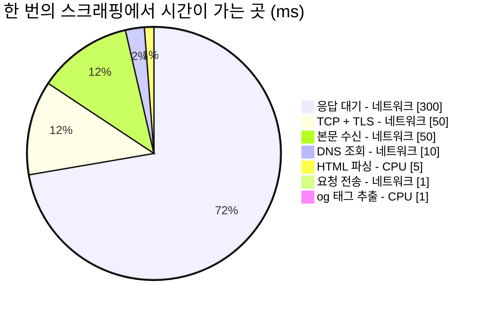

## Table of Contents

## 데모에서는 동작하는 세 줄

링크 미리보기는 명세만 보면 아주 단순한 기능이다. 사용자가 URL을 붙여넣으면 그 페이지의 제목과 이미지를 카드로 보여주면 된다. 코드로 옮기면 세 줄이다.

```ts
const html = await fetch(url).then((r) => r.text())
const $ = cheerio.load(html)
const title = $('meta[property="og:title"]').attr('content')
```

이 세 줄은 실제로 동작한다. 자기 블로그로 시험해 보면 제목이 잘 나온다. 문제는 이 코드가 프로덕션에 올라간 다음에 생긴다. 어느 시간대에는 실패율이 10%를 넘고, 원인을 물으면 "외부 사이트가 이상해서요"라는 답이 돌아오며, 개선안으로는 늘 "캐시를 넣죠"가 나온다. 그리고 캐시를 넣어도 숫자가 잘 안 움직인다.

이 시리즈는 그 세 줄이 무너지는 지점들을 순서대로 따라가 보는 설계 노트다. 사용법보다는 왜 그렇게 설계하게 되는지에 무게를 두었고, 특히 보안은 "이렇게 막으세요"보다 "어떻게 뚫리는가"를 먼저 보는 순서로 잡았다. 어떤 우회를 막는지 모르는 방어 코드는 방어라기보다 선언에 가깝다고 생각한다.

> 이 글에 나오는 상황 설정(에러율 10%, 일 5,000건, 팀 구성)은 논의를 위한 예시 시나리오다. 특정 서비스의 실제 지표가 아니다. 반면 코드의 동작을 확인한 대목은 전부 직접 돌려본 결과이고, 그런 대목에는 검증 환경을 따로 밝혀두었다. 이 시리즈의 실측 환경은 macOS(darwin 25.5.0), Node.js `v24.14.1`, undici `8.10.0`, htmlparser2 `12.0.0`이다.

## 상대가 우리 편이 아니다

세 줄이 무너지는 첫 번째 이유는 통신 상대의 성격에 있다.

우리가 평소에 짜는 대부분의 코드는 우리가 만든 서버, 혹은 최소한 계약이 있는 서버와 통신한다. 응답 형식이 바뀌면 통보를 받고, 느려지면 항의할 창구가 있고, 장애가 나면 같이 대응한다. 스크래핑은 그 전제가 전부 없는 통신이다.

응답이 느려도 항의할 곳이 없고, 우리를 봇으로 판단해 차단해도 마찬가지다. HTML이 규격에 안 맞아도 고쳐달라고 할 수 없고, 내일 갑자기 구조가 바뀌어도 통보받지 못한다. 외부 의존성 중에서도 통제력이 가장 낮은 종류에 속한다.

그래서 실패가 잦은데, 겉으로 보이는 실패의 얼굴이 하나가 아니다.

| 실패        | 겉으로 보이는 것       | 실제 원인            |
| ----------- | ---------------------- | -------------------- |
| 봇 차단     | `403 Forbidden`        | User-Agent 기반 차단 |
| 로그인 벽   | `200`인데 og 태그 없음 | 인증 요구            |
| 타임아웃    | 응답 없음              | 상대 서버 지연       |
| 인코딩 깨짐 | 제목이 `���`           | EUC-KR/CP949         |
| 리다이렉트  | `301`에서 멈춤         | 자동 추적 미구현     |

이 다섯이 대시보드에서는 "에러율 10%"라는 하나의 숫자로 뭉쳐 보인다. 그리고 다섯 중 인코딩 깨짐에는 더 조용한 변종이 있다. 제목이 깨진 글자로 바뀌는 것이 아니라 **멀쩡해 보이는 다른 글자로 바뀌는** 경우인데, 이건 200 응답에 og 태그도 정상이고 값만 틀리기 때문에 에러율에 아예 잡히지 않는다. 이 종류가 왜 특히 곤란한지는 [3편](/2026/08/og-scraping-server-3)에서 실측과 함께 다룬다.

## 증상과 원인을 구분하기

여기서 이 시리즈 전체에 걸리는 첫 번째 전제가 나온다. **"에러율이 높다"는 증상이지 원인이 아니다.** 원인을 분류하지 않고 해법을 고르면 빗나가기 쉽고, 스크래핑에서 가장 흔한 오진이 "에러율이 높다, 그러니 캐시를 넣자"라고 생각한다.

캐시가 줄여주는 것은 같은 URL의 반복 요청이다. 앞의 다섯 실패에 하나씩 대보면 효과가 고르지 않다.

| 실패 원인                              | 캐시의 효과                             |
| -------------------------------------- | --------------------------------------- |
| 같은 URL 반복 요청으로 인한 rate limit | 크다                                    |
| User-Agent 봇 차단                     | 거의 없다. 캐시 미스마다 여전히 403이다 |
| 로그인 벽                              | 없다                                    |
| 타임아웃                               | 없다. 처음 보는 URL은 언제나 미스다     |
| 인코딩 실패                            | 없다                                    |

실패의 대부분이 아래 네 줄에 몰려 있는 상황이라면, 캐시를 넣어도 숫자는 거의 그대로 남을 가능성이 높다. 캐시가 쓸모없다는 뜻이 아니라, 캐시가 고치는 문제와 지금 겪는 문제가 같은 것인지 먼저 확인해야 한다는 뜻이다. 캐시 자체는 [3편](/2026/08/og-scraping-server-3)에서 스탬피드까지 포함해 따로 다룬다.

그래서 코드를 고치기 전에 할 일은 측정이다. 거창할 필요는 없고 실패 지점에 로그 한 줄이면 시작할 수 있다.

```ts
logger.warn('og_scrape_failed', {
  reason, // FORBIDDEN | TIMEOUT | DECODE_FAIL | NO_OG_TAG | ...
  statusCode,
  host: url.hostname, // 전체 URL이 아니라 호스트만 남긴다
  elapsedMs,
})
```

전체 URL 대신 호스트만 남긴 것은 의도적이다. 사용자가 붙여넣은 URL에는 경로와 쿼리에 개인정보나 인증 토큰이 실려 있을 수 있고, 그것이 로그 저장소로 넘어가면 그 저장소의 접근 권한이 곧 개인정보 접근 권한이 된다. 원인 분류에는 호스트만으로 충분하다.

이 로그를 하루치만 모아도 실패의 원인별 비율과, 실패가 몇 개 도메인에 몰려 있는지가 나온다. 경험적으로 후자는 상위 몇 개 도메인이 절반 이상을 차지하는 경우가 많다. 이 두 숫자가 없으면 어떤 개선 목표를 세워도 근거를 붙이기 어렵다.

## 이 워크로드의 모양

측정을 시작했다고 치고, 이제 런타임 이야기로 넘어가려면 이 워크로드가 어떤 모양인지부터 정해야 한다. 한 번의 스크래핑에서 시간이 어디로 가는지 갈라보면 대략 이렇게 나뉜다.



네트워크를 기다리는 시간이 411ms, CPU를 쓰는 시간이 6ms 남짓이다. 대략 98% 대 2%다. 절대값은 대상 사이트에 따라 크게 흔들리지만 이 비율의 자릿수는 잘 안 바뀐다. 시간의 대부분이 남의 서버를 기다리는 데 들어가는, 전형적인 I/O 바운드 워크로드다.

규모도 같이 봐야 한다. 링크 미리보기는 대개 트래픽이 작은 기능이다. 일 5,000건이라고 가정하면,

```
5,000 / 86,400초 ≈ 0.06 TPS
피크를 평균의 10배로 잡아도 1 TPS 미만
```

이 숫자는 뒤에서 "서버를 따로 둘 근거가 있는가"를 따질 때 다시 쓰인다. 작은 트래픽에 큰 인프라를 붙이는 것도 설계 실패의 한 종류이고, 규모를 모르면 그게 과설계인지 아닌지 판단할 방법이 없다.

## 도움이 안 되는 주장 두 개

런타임 이야기를 시작하면 거의 항상 두 개의 주장이 먼저 나온다. 둘 다 결론을 정해두고 붙인 근거에 가깝다고 생각한다.

첫 번째는 이쪽이다.

> "스크래핑은 I/O 바운드니까 비동기에 강한 Node.js가 유리하다"

이건 근거가 되기 어렵다. JVM에도 논블로킹 I/O 스택이 있고(Netty, WebClient, 코루틴), Go나 Rust는 말할 것도 없다. 애초에 1 TPS 남짓한 부하에서는 스레드 풀 기반 블로킹 I/O로도 아무 문제가 없다. "비동기라서 유리하다"는 2010년대 초반에나 통하던 이야기고, 지금은 어느 런타임이든 한다.

두 번째는 반대편이다.

> "팀에 그 런타임 운영 노하우가 없으니 쓰면 안 된다"

이 주장의 문제는 한쪽에만 적용된다는 것이다. Node를 빼자고 할 때는 "프론트엔드 팀에 Node 서버 운영 경험이 없다"를 드는데, 그 대안이 "프론트엔드가 JVM 서버 저장소에 기여한다"라면 프론트엔드의 JVM 경험 부족도 같은 무게로 계산되어야 한다. 한쪽에만 적용되는 기준은 기준이라기보다 결론에 가깝다.

운영 경험이 중요하지 않다는 말은 아니다. 뒤에서 보겠지만 그건 실제로 가장 중요한 조건 중 하나다. 다만 그것을 한쪽에만 붙이면 비교가 되지 않는다.

이 두 주장을 치우고 나면 남는 지점이 보인다.

## 실제로 갈리는 네 지점

정리해 보면 네 개다. 소켓 직전까지의 통제권, 망가진 HTML을 브라우저처럼 파싱하는가, 인코딩, 그리고 누가 이 코드를 소유하는가. 세 번째는 Node가 불리한 항목인데 일부러 넣어두었다. 자기 편만 세는 비교는 신뢰하기 어렵다.

### 소켓 직전까지의 통제권

이 항목은 [2편](/2026/08/og-scraping-server-2) 전체가 그 이유를 설명하는 자리라, 여기서는 결론만 미리 적는다. 사용자가 준 URL을 서버가 대신 여는 기능에서 SSRF 방어의 핵심은 이렇게 요약된다.

> DNS가 해석한 IP를 우리가 검사하고, 그 검사한 IP로 직접 연결해야 한다.

대부분의 HTTP 클라이언트는 "이름을 주면 알아서 연결해 주는" 추상화라, 이 사이에 끼어들 틈을 주지 않는다. Node의 `undici`는 그 틈을 열어둔다.

```ts
new Agent({
  connect: {
    lookup(hostname, options, callback) {
      // 이 함수가 반환하는 주소로 소켓이 연결된다
    },
  },
})
```

JVM에서 같은 일을 하려면 보통 커스텀 DNS 리졸버를 구현해 HTTP 클라이언트에 주입하거나, 네트워크 계층에서 우회하거나, egress 프록시를 세워 강제하는 쪽으로 간다. 불가능한 일은 아니다. 다만 "함수 하나를 넘기면 된다"와는 난이도가 다르고, 이 난이도 차이가 실제로는 구현 여부를 가르는 경우가 많다. 보안 통제를 애플리케이션 코드로 표현할 수 있느냐가 중요한 이유는, 어려우면 결국 안 하게 되기 때문이다.

덧붙여, 2편에서 이 `lookup` 훅이 만능이 아니라는 것도 실측으로 확인하게 된다. 훅이 아예 호출되지 않는 경로가 있다.

### 망가진 HTML

스크래핑 대상의 HTML은 대체로 규격에 맞지 않는다.

```html
<meta property="og:title" content="제목 />
<!-- 닫는 따옴표가 없다 -->
<meta property="og:image" content="/hero.png" />
<head>
  <p>head 안에 있으면 안 되는 태그</p>
</head>
```

브라우저는 이런 문서도 정해진 규칙에 따라 복구해서 파싱한다. 그 규칙이 [WHATWG HTML 파싱 알고리즘](https://html.spec.whatwg.org/multipage/parsing.html)이고, `parse5`가 그 표준을 그대로 옮긴 구현이다. 어느 런타임에나 HTML 파서는 있지만, 표준의 오류 복구 규칙까지 따라가는 파서가 기본 선택지로 놓여 있는지는 생태계마다 차이가 있다.

여기서 정규식으로 og 태그를 뽑는 코드를 꽤 자주 보게 되는데, 위 같은 HTML에서 조용히 틀린 값을 낸다. 조용하다는 게 핵심이다. 예외가 나면 알아채기라도 하는데, 값만 틀리면 알 방법이 없다.

### 인코딩

여기는 Node가 불리한 자리다.

한국어 사이트에는 아직도 EUC-KR과 CP949가 남아 있다. JVM에는 CP949 디코더가 표준 JDK 안에 들어 있다.

```java
new String(bytes, Charset.forName("x-windows-949"))  // 확장 문자까지 정상
```

엄밀히는 `jdk.charsets` 모듈에 들어 있어서, jlink로 런타임을 최소화해 배포하면 이 모듈이 빠져 실패할 수 있다(`--add-modules jdk.charsets`로 넣는다). 그래도 의존성을 추가할 일은 아니다.

반면 Node의 내장 `TextDecoder`는 이 자리에서 조용히 실패한다.

```ts
new TextDecoder('euc-kr').decode(bytes) // CP949 확장 문자가 깨진다
```

실제로 돌려보면 `똠`이 `c`가 되고 `꼃`이 `X`가 된다. 예외도 없고 치환 문자도 아니고, 그냥 다른 글자가 된다. 실측 표와 이유는 [3편](/2026/08/og-scraping-server-3)에 있고, 결론은 `iconv-lite` 의존성이 사실상 필수라는 것이다.

이건 Node의 단점이 맞고 감출 이유도 없다고 생각한다. 다만 의존성 하나로 해결되고, 순수 JS 구현이라 네이티브 빌드 부담도 없다는 점은 같이 적어둘 만하다.

### 누가 소유하는가

링크 미리보기는 기능 명세가 UI에 붙어 있는 종류다. 제목이 몇 자에서 잘리는가, 이미지가 없을 때 무엇을 보여주는가, `og:title`이 없으면 `<title>`로 대체하는가, 도메인 이름을 카드에 노출하는가. 이 결정들은 대체로 프론트엔드에서 난다.

변경 주도권이 프론트엔드에 있는 코드를 백엔드 저장소에 두면, 문구 하나 바꾸는 일에도 두 팀의 일정이 맞아야 한다. 기술적인 이유는 아니지만 실제로 가장 자주 비용이 나가는 부분이라고 생각한다.

## 고르지 말아야 할 조건

네 지점을 다 세고 나면 Node 쪽으로 기우는 것처럼 보이는데, 반대 방향의 조건도 같은 무게로 적어야 비교가 된다. 아래 중 여럿이 겹치면 Node를 고르지 않는 편이 낫다고 본다.

| 조건                          | 이유                                             |
| ----------------------------- | ------------------------------------------------ |
| 사내 표준 런타임이 JVM 하나뿐 | 배포, 시크릿, 로깅 파이프라인을 새로 뚫어야 한다 |
| 온콜 주체가 백엔드 조직       | 새벽에 깨는 사람이 못 읽는 코드가 된다           |
| APM과 모니터링이 JVM 전용     | 대시보드와 알람을 이중으로 관리하게 된다         |
| 보안 검토가 언어별로 나뉨     | 새 언어는 검토 주기가 처음부터 시작된다          |
| 트래픽이 1 TPS 미만           | 런타임 이전에 서버를 따로 둘 근거가 약하다       |

마지막 줄은 조금 더 풀어 쓸 가치가 있다. 앞에서 계산한 0.06 TPS를 놓고, 서버 분리의 흔한 근거들을 하나씩 대보면 이렇게 된다.

"스크래핑 CPU가 이벤트 루프를 막는다"는 걱정은 초당 0.06회의 5ms 파싱을 뜻하므로 점유율이 0.03% 수준이라 맞지 않는 걱정이다. "모니터링을 분리해야 한다"는 라우트별 메트릭 레이블로 해결되는 경우가 많아서 서버를 나눌 이유까지는 안 된다. "장애 격리가 필요하다"는 맞는 이야기인데, 다만 타임아웃과 서킷 브레이커만으로도 상당 부분 확보된다.

그래서 이 규모에서 서버를 나눌 만한 이유로 남는 것은 대개 조직적인 쪽이다. 그리고 그건 부끄러운 이유가 아니라고 생각한다. 누가 소유하고 누가 당직을 서는가는 실제 운영 비용을 결정하는 조건이지, 기술적인 이유를 대신하는 말이 아니다. 다만 그것을 성능 문제인 척 포장하지만 않으면 된다.

정리하면 이런 판단표가 나온다.

| 상황                                                                         | 권장                  |
| ---------------------------------------------------------------------------- | --------------------- |
| 프론트엔드가 소유, 사내에 Node 인프라 있음, SSRF 통제를 코드로 표현하고 싶음 | Node                  |
| 사내 표준이 JVM, 온콜이 백엔드, 트래픽 작음                                  | 기존 백엔드 서버 안에 |
| 트래픽 극소, 이미 Next.js가 있음, 보안 요구 낮음                             | 분리하지 않기         |
| 초당 수백 건, 지연에 민감                                                    | Go나 Rust도 검토      |

이 표에서 하고 싶은 말은 Node가 우월하다는 쪽이 아니라, 첫 줄의 조건에 해당할 때 고르는 선택지라는 쪽이다.

## 아직 코드를 한 줄도 안 짰다

그런데 무엇을 짜야 하는지는 꽤 좁혀졌다. "에러율 10%"가 성질이 다른 다섯 종류의 실패였다는 것, 캐시는 그중 일부만 고친다는 것, 이 워크로드가 I/O 바운드에 저 TPS라는 것, 런타임이 갈리는 지점이 네 개라는 것까지 왔다.

네 지점 중 첫 번째로 꼽은 "소켓 직전까지의 통제권"이 왜 필요한지는 아직 설명하지 않았다. [2편](/2026/08/og-scraping-server-2)이 그 자리다. 사용자가 준 URL을 서버가 대신 여는 일이 왜 그렇게 위험한지, 화이트리스트로 막았다고 믿는 코드가 어떤 여섯 가지 방법으로 뚫리는지, 그리고 그것을 막는 코드를 실제로 돌려보면 무엇이 틀렸는지를 다룬다.

## 참고

- [WHATWG HTML Standard, Parsing HTML documents](https://html.spec.whatwg.org/multipage/parsing.html)
- [WHATWG URL Standard](https://url.spec.whatwg.org/)
- [undici Dispatcher / Agent 문서](https://undici.nodejs.org/#/docs/api/Agent)
- [parse5](https://github.com/inikulin/parse5)
- [htmlparser2](https://github.com/fb55/htmlparser2)
- [The Open Graph protocol](https://ogp.me/)
