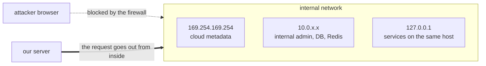
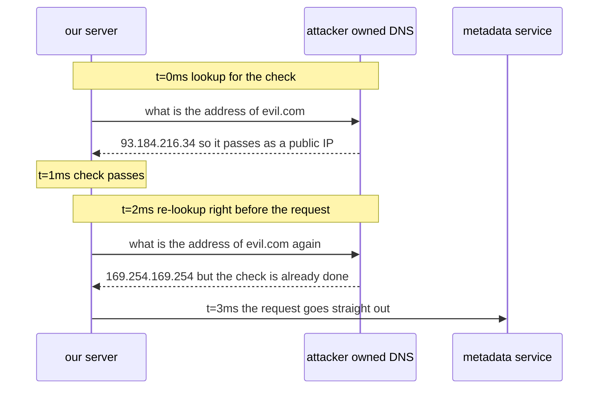
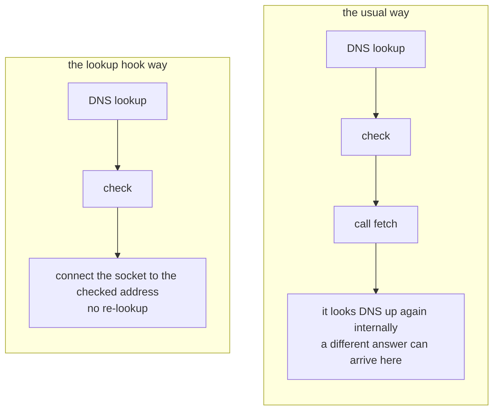
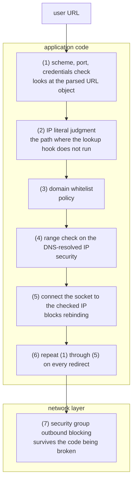

## Table of Contents

## When the Feature Itself Is Shaped Like a Vulnerability

In [Part 1](/2026/08/og-scraping-server-1) I picked "control up to the socket" as the first point where runtimes diverge. Why that control is needed is what this post is about.

If you have not read Part 1, the premise you need is one line. **Our server opens URLs the user hands it.**

SSRF (Server-Side Request Forgery) is a vulnerability where the attacker makes the server send a request wherever the attacker wants. The important part of that definition is not "sends a request" but **"the server sends it."**

Because the attacker's browser and our server are in different network positions.



SSRF is close to lending the attacker our server's network position for a moment. The firewall plays no part here, because the request is not coming in from outside, it is going out from inside.

And a link preview carries the two conditions that make SSRF possible right there in its feature description. The server has to send a request to a URL that came from outside, and the user decides that URL. The vulnerability does not appear by mistake. **The shape of the feature is the shape of the vulnerability.** Which is why "let us just be careful" does not work well and you end up blocking it structurally.

> All the code in this post is code I ran. The verification environment is macOS (darwin 25.5.0), Node.js `v24.14.1`, undici `8.10.0`. And to say it up front, several things I wrote down first turned out to be wrong once I ran them. Those spots are marked in the text as they come up.

## What Is Being Targeted

Follow the most commonly cited AWS scenario and it goes like this.

The attacker pastes a link into a post.

```
http://169.254.169.254/latest/meta-data/iam/security-credentials/
```

Our server opens that URL to build a preview card, and the response contains the name of the IAM role attached to the instance. The attacker appends that name and pastes once more.

```
http://169.254.169.254/latest/meta-data/iam/security-credentials/og-scraper-role
```

This response looks like this.

```json
{
  "AccessKeyId": "ASIA...",
  "SecretAccessKey": "...",
  "Token": "..."
}
```

With these credentials, anything within that role's permissions is directly reachable, S3 or DynamoDB included. Even if the preview card only showed an error message, the moment the response body lands in a log or an error reporting tool, the outcome is the same.

The `169.254.0.0/16` range is link-local. Because it is not routed and is only valid within the same link, cloud providers put their instance metadata services there.

| Provider | Address           | Extra condition                               |
| -------- | ----------------- | --------------------------------------------- |
| AWS      | `169.254.169.254` | With IMDSv2 you must PUT for a token first    |
| GCP      | `169.254.169.254` | Requires the `Metadata-Flavor: Google` header |
| Azure    | `169.254.169.254` | Requires the `Metadata: true` header          |
| Alibaba  | `100.100.100.200` |                                               |

The question "we have IMDSv2 on, are we not fine?" comes up often here, and it is safer to treat that as only half true. IMDSv2 requires getting a token via `PUT /latest/api/token` first and scraping only sends GET, so it is true that plain SSRF does not get through. But there are instances out there with IMDSv1 still enabled, an SSRF that can manipulate the method or headers still works, and above all, **metadata is not the only target.** Internal admin pages, Redis, Elasticsearch, and the Kubernetes API are all on the same internal network.

Enforcing IMDSv2 with a hop limit of 1 is worth doing, but hard to treat as the whole of your defense.

## How a Whitelist Gets Through

At this point the most common answer shows up. "Keep a list of allowed domains and only scrape within it." The direction is right, but on its own it gets through.

The order matters: see how it breaks before how to block it. You only understand why defensive code has that shape once you know which bypass it is aimed at.

### Bypass 1: IP Notation Variants

Start with a check that filters dangerous addresses as strings. This shape shows up often.

```ts
if (rawUrl.includes('127.0.0.1') || rawUrl.includes('169.254.169.254')) {
  throw new Error('blocked')
}
```

The five below all pass this check. And they all connect to `127.0.0.1`.

| URL you paste             | Notation                           |
| ------------------------- | ---------------------------------- |
| `http://2130706433/`      | 32-bit decimal                     |
| `http://0x7f000001/`      | Hexadecimal                        |
| `http://0177.0.0.01/`     | Octal                              |
| `http://127.1/`           | Short form (middle octets omitted) |
| `http://127.000.000.001/` | Zero padded                        |

The string `127.0.0.1` appears nowhere, and the kernel connects all of them to the same place. That is what this bypass really is.

Of the six it is the lightest, though, because it disappears the moment you parse with `new URL()`. The WHATWG URL parser normalizes these notations at the parsing stage.

```ts
new URL('http://2130706433/').hostname // '127.0.0.1'
new URL('http://0x7f000001/').hostname // '127.0.0.1'
new URL('http://0177.0.0.01/').hostname // '127.0.0.1'
new URL('http://127.1/').hostname // '127.0.0.1'
```

So the lesson is not "memorize every IP notation" but **validate the parsed value, not the original string**. That is also why I put this bypass first: the remaining five do not fall to parsing alone.

### Bypass 2: Pointing DNS at a Private IP

So do you just check the `hostname` you got from parsing? Not on its own.

Because a domain name can point at any IP at all. The attacker just sets the A record for their own domain like this.

```
evil.example.com.   IN  A   127.0.0.1
```

Pick `evil.example.com` apart however you like and it is a perfectly ordinary public domain. And it connects to localhost. You do not even need to buy a domain, since public services like `127.0.0.1.nip.io` or `10.0.0.1.nip.io` return exactly the IP written in the name.

**A name tells you nothing about the destination.** What you have to look at is the IP that name resolves to.

### Bypass 3: DNS Rebinding

So do you check the resolved IP instead of the name? That gets through too. Of the six this is the most subtle and the most often missed.

Defensive code usually gets written in this shape.

```ts
const ip = await dns.resolve(url.hostname) // (1) lookup for the check
if (isPrivate(ip)) throw new Error('blocked')

await fetch(url) // (2) the real request. it looks up again here
```

(1) and (2) **each perform their own DNS lookup.** If the answer changes in between, the check and the use diverge. That gap is called TOCTOU (Time-Of-Check to Time-Of-Use).

The attacker prepares a domain with TTL set to 0.



The attacker can do this because they hold the DNS server for their own domain. With a TTL of 0 nothing is cached, so two lookups returning different answers is normal behavior by the standard, which means this attack succeeds without breaking any rules.

Ultimately what you check and what you use have to be the same thing. Instead of checking the name, **check the address and then use that address as is.**

### Bypass 4: Redirects

Say you have done all of the above. You parsed, you checked the resolved IP, you connected directly to that IP. But what you checked is **only the first request**.

Say `example.com` is on the allowlist, and the attacker pastes this.

```
https://example.com/redirect?to=http://169.254.169.254/
```

The host of the first request is `example.com`, so it passes every check above. Then the server responds with `302 Location: http://169.254.169.254/` and the HTTP client follows it automatically, and at that point nobody checks anything.

The nasty part is that the attacker does not even need to get their own domain onto the whitelist. Any one already-allowed site with an open redirect will do, and open redirects are common.

So turn off automatic redirect following and **redo the check from scratch on every hop**.

### Bypass 5: When the Validated Value and the Requested Value Differ

The previous four were about what to validate. This one is a different flavor: you validate properly and then hand something else to the request.

The typical shape is this. Check the whitelist as a string, then pass the original string straight to the client.

```ts
if (!rawUrl.includes('allowed.com')) throw new Error('blocked')

await request(rawUrl) // where does this request go
```

Feed in four inputs and check for real and they split like this.

| Input                             | Contains `allowed.com`? | Actual host   |
| --------------------------------- | ----------------------- | ------------- |
| `http://allowed.com@evil.com/`    | Yes                     | `evil.com`    |
| `http://evil.com#@allowed.com/`   | Yes                     | `evil.com`    |
| `http://allowed.com%2f@evil.com/` | Yes                     | `evil.com`    |
| `http://allowed.com\@evil.com/`   | Yes                     | `allowed.com` |

The first line is the URL `user@host` syntax. `allowed.com` sits in the username slot rather than the host, and the actual host is `evil.com`. In the second, everything after `#` is a fragment and has nothing to do with the destination; in the third, `%2f` and all goes in as the username. The string check passes all four, but the actual destination is `evil.com` for three of them.

The last line is worth a closer look because it runs the other way. With a backslash in there, the WHATWG parser treats it as a path separator and gives the host as `allowed.com`. Which means the same string can get different answers from different parsers, and if the parser you validate with differs from the parser you request with, that difference becomes the hole.

The rule is one thing. **Parse once, and hand that parsed object straight to the request.**

### Bypass 6: IPv6

The last one is a hole that comes from forgetting. Code that only checks IPv4 private ranges lets all of these through.

| Address            | Meaning                         |
| ------------------ | ------------------------------- |
| `::1`              | Loopback                        |
| `::ffff:127.0.0.1` | IPv4-mapped. Actually 127.0.0.1 |
| `::ffff:a9fe:a9fe` | `169.254.169.254` in hex        |
| `fe80::/10`        | link-local                      |
| `fc00::/7`         | ULA (counts as a private range) |
| `64:ff9b::/96`     | NAT64 (translated to IPv4)      |

IPv4-mapped is the tricky one. It looks like IPv6 on the surface and the kernel connects over IPv4. And there is more than one notation, so even if you write it in dotted form the parser gives it back in hex.

```ts
new URL('http://[::ffff:169.254.169.254]/').hostname // '[::ffff:a9fe:a9fe]'
```

Because `a9fe:a9fe` is `169.254.169.254` written in hexadecimal (`0xa9 = 169`, `0xfe = 254`). So code that blocks the string `::ffff:169.254.169.254` misses this address entirely. The same story as bypass 1, repeated once more in IPv6.

And the output above shows one more thing. **The brackets are still there in `hostname`.** What happens if you mistake that for an address and pass it straight to a check is covered later.

## Five Defensive Principles

Five principles run through the six bypasses. I have noted which of the above each one closes.

- **Validate the address, not the name.** Notation variants (bypass 1), pointing DNS at a private IP (bypass 2), and IPv6 (bypass 6) get caught here
- **Connect directly to the address you validated.** This is the only place rebinding (bypass 3) gets blocked
- **On redirects, redo the first two from scratch on every hop** (bypass 4)
- **Use only the object you parsed once** (bypass 5)
- And finally, **do not trust any of the four above**

Let us move them into code one at a time.

### Principle 1: Validate the Address

Node has `net.BlockList` built in, so there is no need to do bit arithmetic yourself.

```ts
import {BlockList, isIP, isIPv4} from 'node:net'

const blocked = new BlockList()

blocked.addSubnet('0.0.0.0', 8, 'ipv4') // this network
blocked.addSubnet('10.0.0.0', 8, 'ipv4') // RFC1918
blocked.addSubnet('100.64.0.0', 10, 'ipv4') // CGNAT
blocked.addSubnet('127.0.0.0', 8, 'ipv4') // loopback
blocked.addSubnet('169.254.0.0', 16, 'ipv4') // link-local (metadata)
blocked.addSubnet('172.16.0.0', 12, 'ipv4') // RFC1918
blocked.addSubnet('192.168.0.0', 16, 'ipv4') // RFC1918
blocked.addSubnet('192.0.0.0', 24, 'ipv4') // IETF protocol assignments (DS-Lite etc)
blocked.addSubnet('198.18.0.0', 15, 'ipv4') // benchmarking
blocked.addSubnet('224.0.0.0', 4, 'ipv4') // multicast
blocked.addSubnet('240.0.0.0', 4, 'ipv4') // reserved
```

Block IPv6 alongside it.

```ts
blocked.addAddress('::', 'ipv6') // unspecified
blocked.addAddress('::1', 'ipv6') // loopback
blocked.addSubnet('64:ff9b::', 96, 'ipv6') // NAT64 (RFC 6052)
blocked.addSubnet('64:ff9b:1::', 48, 'ipv6') // NAT64 local-use (RFC 8215)
blocked.addSubnet('100::', 64, 'ipv6') // discard
blocked.addSubnet('fc00::', 7, 'ipv6') // ULA
blocked.addSubnet('fe80::', 10, 'ipv6') // link-local
blocked.addSubnet('fec0::', 10, 'ipv6') // site-local (deprecated, for older stacks)
blocked.addSubnet('ff00::', 8, 'ipv6') // multicast
```

This list is not the whole of what needs blocking in IPv6. There are several ways to carry an IPv4 address inside IPv6 (NAT64 above is one such example), so if you actually run IPv6, it is safer to skim the [IANA IPv6 Special-Purpose Address Registry](https://www.iana.org/assignments/iana-ipv6-special-registry/iana-ipv6-special-registry.xhtml) once and fill in what is missing.

The check function itself is short.

```ts
export function isPublicAddress(ip: string): boolean {
  if (isIP(ip) === 0) return false // not IP shaped, block it for now
  return !blocked.check(ip, isIPv4(ip) ? 'ipv4' : 'ipv6')
}
```

Why that first line is needed is the important part. Given a string that is not an IP, `blocked.check()` does not throw, it quietly answers "not blocked." Checked directly, it looks like this.

```
"localhost"    check => false   (not blocked)
""             check => false
"999.1.1.1"    check => false
"127.0.0.1 "   check => false   (trailing space)
```

So values that are not IP shaped get cut off at the front of the function, and when in doubt it leans toward blocking (fail-closed).

Write this much and one spot starts to itch. Having read about IPv4-mapped earlier, you want to strip `::ffff:` yourself and then check.

```ts
// this code is vulnerable
const addr = ip.startsWith('::ffff:') ? ip.slice(7) : ip
return !blocked.check(addr, isIPv4(addr) ? 'ipv4' : 'ipv6')
```

Here is the result of running it.

| Input                    | `slice(7)` result | Verdict    |
| ------------------------ | ----------------- | ---------- |
| `::ffff:169.254.169.254` | `169.254.169.254` | Blocked    |
| `::ffff:a9fe:a9fe`       | `a9fe:a9fe`       | **Passes** |
| `::ffff:7f00:1`          | `7f00:1`          | **Passes** |

Strip the prefix off the hex form and what remains is neither IPv4 nor IPv6, and `BlockList.check()` returns `false` for such input rather than throwing. The exact property we saw just above becomes the hole here.

Feed the same values in without stripping and it comes out like this.

| Input                        | Result  |
| ---------------------------- | ------- |
| `::ffff:169.254.169.254`     | Blocked |
| `::ffff:a9fe:a9fe`           | Blocked |
| `::ffff:7f00:1`              | Blocked |
| `64:ff9b::a9fe:a9fe` (NAT64) | Blocked |

`BlockList` recognizes the `::ffff:` form as IPv4 on its own and checks it that way. Dotted or hex, it does not care.

There is a condition on that last row, though. The `64:ff9b::` form (NAT64) is not unwrapped automatically. It was blocked above because the code earlier has `64:ff9b::/96` written into it directly, and take that line out and the results split.

```
64:ff9b::a9fe:a9fe -> passes (vulnerable)
::ffff:a9fe:a9fe   -> blocked
```

To sum up, only `::ffff:` is automatic, and every other "IPv4 carried inside IPv6" has to be blocked by range yourself. Two things come out of this. Do not normalize addresses yourself, use what the runtime provides. And security code has to be tested with bypass cases. In fact the two tables above are the test cases as they stand.

Security code is more accurately expressed as "it blocks these" than as "it works."

```ts
describe('isPublicAddress', () => {
  const blockedCases = [
    '127.0.0.1',
    '169.254.169.254',
    '10.1.2.3',
    '172.16.0.1',
    '192.168.1.1',
    '100.64.0.1',
    '0.0.0.0',
    '::1',
    '::',
    'fe80::1',
    'fd00::1',
    'ff02::1',
    '::ffff:127.0.0.1',
    '::ffff:169.254.169.254',
    '::ffff:a9fe:a9fe',
    '::ffff:7f00:1', // hex notation
    '64:ff9b::a9fe:a9fe', // NAT64
    'localhost', // not an IP
    '', // empty string
    '999.1.1.1', // looks like an IP but is not valid
    '127.0.0.1 ', // trailing space
  ]
  const allowedCases = [
    '93.184.216.34',
    '1.1.1.1',
    '2606:4700::1',
    '172.32.0.1',
    '100.128.0.1',
    '11.0.0.0', // just outside the boundary
  ]

  it.each(blockedCases)('blocks %s', (ip) =>
    expect(isPublicAddress(ip)).toBe(false),
  )
  it.each(allowedCases)('allows %s', (ip) =>
    expect(isPublicAddress(ip)).toBe(true),
  )
})
```

The reason a just-outside-the-boundary case (`172.32.0.1`) is in the allowed set is that over-blocking is a bug too. A perfectly good site whose preview does not render is also an outage.

### Principle 2: Connect Directly to the Validated Address

This is where rebinding gets blocked, and also where the `lookup` hook I mentioned in Part 1 gets used.

```ts
import {Agent} from 'undici'
import {lookup as dnsLookup} from 'node:dns'

export const scrapeAgent = new Agent({
  connect: {
    lookup(hostname, options, callback) {
      dnsLookup(hostname, {all: true}, (err, addresses) => {
        if (err) return callback(err, '', 0)

        // if even one is private, reject them all.
        // the attacker can hand you multiple A records.
        if (!addresses.every((a) => isPublicAddress(a.address))) {
          return callback(new Error('BLOCKED_PRIVATE_ADDRESS'), '', 0)
        }

        if (options.all) return callback(null, addresses)
        callback(null, addresses[0].address, addresses[0].family)
      })
    },
  },
})
```

The last two lines were not there originally. I first wrote it to pick a single address and return that, and running it, the very first request died.

```
single   -> throw TypeError: Invalid IP address: undefined   (options.all = [true])
array    -> status 200                                        (options.all = [true])
```

undici calls this callback with `{ all: true }` and expects an array of addresses. Pass the `{ all: true }` result straight through and it works; pass a single address and you get the error above. The difference between code written from reading the docs and guessing, and code you ran, shows up in spots like this.

The reason this hook blocks rebinding is that the gap between lookup and connect disappears.



With not a single DNS lookup between check time and use time, the TOCTOU window closes. The hostname carried on the request (the `Host` header and the name used for certificate validation) is preserved as it was, so virtual hosting on one IP and certificate validation both keep working. And this check only runs when opening a new connection, which is fine because the other end of a reused connection (keep-alive) is the address that passed the check a moment ago.

Using `every` is deliberate too. The attacker can hand you A records like this.

```
evil.com.  IN  A  93.184.216.34    <- public
evil.com.  IN  A  169.254.169.254  <- private
```

Picking just the public one with `find(isPublic)` looks safe for the moment. But a legitimate domain has little reason to return a mix that includes a private IP, so it is more natural to read such a response as an attack signal in itself. Rejecting all of them states the intent exactly, and it also stops the result from wobbling with lookup order or cache state.

### There Is a Path Where the Hook Is Not Called

Write this much and the `lookup` hook looks like it fully serves as the gate. So I checked one more thing. With a hook attached that **rejects everything unconditionally**, does sending a request really block everything?

```ts
const paranoid = new Agent({
  connect: {
    lookup(hostname, options, callback) {
      callback(new Error('BLOCKED_BY_HOOK'), '', 0) // reject everything, no exceptions
    },
  },
})
```

The result was this.

```
http://localhost:9004/   -> blocked                 | lookup called 1 time
http://127.0.0.1:9004/   -> status 200 INTERNAL     | lookup called 0 times
http://[::1]:9005/       -> status 200 INTERNAL     | lookup called 0 times
```

**When the host is already an IP literal, the `lookup` hook is never called.** The behavior itself is obvious. It is not a name, so there is no name to resolve, and the socket can connect straight to that address. But as a result, `http://169.254.169.254/` walks right past the device this post set up as the core of SSRF defense.

So the URL validation side has to catch IP literals, and there is one more layer here. `URL.hostname` **keeps the brackets on an IPv6 literal.**

```
http://127.0.0.1/               hostname = "127.0.0.1"                isIP = 4
http://[::1]/                   hostname = "[::1]"                    isIP = 0
http://[::ffff:a9fe:a9fe]/      hostname = "[::ffff:a9fe:a9fe]"       isIP = 0
```

So a guard written like this lets IPv6 literals through.

```ts
// misses IPv6 literals
const h = url.hostname
if (isIP(h) !== 0 && !isPublicAddress(h)) throw new BlockedError('BLOCKED')
```

`isIP('[::1]')` is 0, so the condition is false and the check is skipped, and after that the `lookup` hook is not called either. Two things overlap and become a hole.

To fix it, strip the brackets and then judge.

```ts
function hostnameAsIp(hostname: string): string | null {
  const bare =
    hostname.startsWith('[') && hostname.endsWith(']')
      ? hostname.slice(1, -1)
      : hostname
  return isIP(bare) === 0 ? null : bare
}

function assertHostAllowed(url: URL) {
  const ip = hostnameAsIp(url.hostname)
  if (ip !== null) {
    // if the host is an IP literal the lookup hook will not run, so judge here
    if (!isPublicAddress(ip)) throw new BlockedError('BLOCKED_LITERAL_ADDRESS')
    return
  }
  // if it is a name, the lookup hook checks the resolved address
}
```

Here is the result of running the two guards side by side.

| Input                        | Naive guard | Fixed guard |
| ---------------------------- | ----------- | ----------- |
| `http://169.254.169.254/`    | Blocked     | Blocked     |
| `http://2130706433/`         | Blocked     | Blocked     |
| `http://0x7f000001/`         | Blocked     | Blocked     |
| `http://[::1]/`              | **Passes**  | Blocked     |
| `http://[::ffff:a9fe:a9fe]/` | **Passes**  | Blocked     |
| `http://[::ffff:7f00:1]/`    | **Passes**  | Blocked     |
| `http://[fd00::1]/`          | **Passes**  | Blocked     |
| `http://example.com/`        | Passes      | Passes      |
| `http://93.184.216.34/`      | Passes      | Passes      |
| `http://[2606:4700::1]/`     | Passes      | Passes      |

Public IPv6 (`2606:4700::1`) still passes, so this is not over-blocking either.

Something slightly confusing comes up here. The section just before said not to strip the `::ffff:` prefix by hand, and this section says to strip the brackets by hand. It looks contradictory, but the objects are different. The former was an attempt to interpret **the meaning of an address family** by hand, which belongs to `BlockList`. The latter is peeling off **a notational shell** that URL syntax put on, returning it to the original address string. The judging is still done by `isIP` and `BlockList`.

And in a setup that has the domain whitelist from earlier, IP literals are already caught by name matching. The problem is a setup that opens arbitrary URLs without a whitelist, and that is mostly what the actual product requirement for a link preview looks like.

### Principle 3: Follow Redirects Yourself

```ts
const MAX_HOPS = 3

async function fetchGuarded(startUrl: URL) {
  let url = startUrl

  // deadline for the whole redirect chain. however many hops, this time is never exceeded.
  const overall = AbortSignal.timeout(8_000)

  for (let hop = 0; hop <= MAX_HOPS; hop++) {
    assertAllowedUrl(url) // scheme, port, credentials, host

    const res = await request(url, {
      dispatcher: scrapeAgent, // no redirect interceptor attached
      // 5s per hop, 8s for the chain. whichever hits first cuts it off
      signal: AbortSignal.any([overall, AbortSignal.timeout(5_000)]),
    })

    if (res.statusCode < 300 || res.statusCode >= 400) return res

    const location = res.headers.location
    if (!location) return res

    await res.body.dump() // always drain the socket
    url = new URL(location, url) // relative paths handled too
  }

  throw new Error('TOO_MANY_REDIRECTS')
}
```

Two lines in this code are easy to miss and both are necessary. `await res.body.dump()` discards the body and cleans up the socket. Skip past without reading the body and the socket is not returned to the connection pool, so frequent redirects exhaust connections. `new URL(location, url)` resolves a `Location` that is a relative path (`/login`, `../other`) per the standard, and the object it builds gets checked again on the next loop.

The genuinely dangerous side, though, is not this code but the side that just uses `fetch()`. Check against the same local server and it comes out like this.

| Call                                 | On a 302 response                             |
| ------------------------------------ | --------------------------------------------- |
| `undici.request(url)`                | Returns the 302 as is                         |
| `fetch(url)`                         | **Followed it and fetched the internal body** |
| `fetch(url, { redirect: 'manual' })` | Returns the 302 as is                         |

`undici.request()` does not follow redirects by default. To make it follow, you have to attach an interceptor explicitly. The global `fetch()`, on the other hand, defaults to `redirect: 'follow'`, so used without thinking it follows an open redirect straight through.

And here is one more thing I wrote first and got wrong. Following older docs I wrote that you turn it off with `maxRedirections: 0`, and checking on undici 8, here is what happens.

```
maxRedirections: 0 -> status 302
maxRedirections: 3 -> throw InvalidArgumentError: maxRedirections is not supported, use the redirect interceptor
```

Only 0 is allowed and anything else throws. To follow, you have to compose an interceptor.

```ts
const redir = new Agent().compose(interceptors.redirect({maxRedirections: 3}))
```

Since the default is not to follow anyway, the practical defense is closer to **not using `fetch()`**.

### Principle 4: Lock Down the Scheme and Port Too

Here is what `assertAllowedUrl` actually does.

```ts
const ALLOWED_PROTOCOLS = new Set(['http:', 'https:'])
const ALLOWED_PORTS = new Set(['', '80', '443'])

function assertAllowedUrl(url: URL) {
  if (!ALLOWED_PROTOCOLS.has(url.protocol)) {
    throw new BlockedError('SCHEME_NOT_ALLOWED')
  }
  if (!ALLOWED_PORTS.has(url.port)) {
    throw new BlockedError('PORT_NOT_ALLOWED')
  }
  if (url.username || url.password) {
    throw new BlockedError('CREDENTIALS_IN_URL') // blocks the user@host bypass
  }
  assertHostAllowed(url) // IP literal judgment plus domain policy
}
```

The reason to block schemes is that anything other than `http` and `https` opens an entirely different attack surface. `file://` goes to `/etc/passwd` or application secret files, `gopher://` can send arbitrary TCP payloads and is used for Redis or SMTP command injection. `dict://` harvests banners from internal services, and `data:` induces parser confusion. `undici` only supports `http` and `https` so a good chunk is blocked automatically, but rejecting explicitly means the defense survives a client swap later.

The reason to block ports is that ports other than 80 and 443 are usually internal services. Things like 6379 (Redis), 9200 (Elasticsearch), 5432 (PostgreSQL), 27017 (MongoDB), 8080 (internal admin), 2375 (Docker daemon). If you have blocked the IP ranges there is a lot of overlap, but there are situations that need one more layer, such as DNS pointing at a public IP with a proxy sitting behind it.

If you use a domain whitelist, the matching is easy to get wrong.

```ts
const ALLOWED_HOSTS = new Set(['example.com'])

function isAllowedHost(hostname: string): boolean {
  if (ALLOWED_HOSTS.has(hostname)) return true // exact match
  // if you allow subdomains, always attach the "." boundary
  return [...ALLOWED_HOSTS].some((d) => hostname.endsWith('.' + d))
}
```

The most common mistake is checking with `endsWith('example.com')` without the `.`. Then `notexample.com` or `evil-example.com` passes, and the attacker only has to buy one such domain. If you allow subdomains, you also have to think about an attacker seizing a subdomain nobody manages any more (subdomain takeover), and about domains like `exаmple.com` that look identical to the eye but use a different character (the Cyrillic `а`).

### Principle 5: Do Not Trust Application Defenses

Everything written so far lives in the application layer. Swap the library and it is gone, another developer calling `fetch()` directly bypasses it, and a bypass technique we do not know about could show up tomorrow. The IP literal hole we just saw is an example of exactly that.

So you need a setup that blocks once more at the network layer.

| Layer                 | Control                                                        |
| --------------------- | -------------------------------------------------------------- |
| Instance              | Enforce IMDSv2, hop limit 1                                    |
| Security group / NACL | Block internal ranges on outbound                              |
| Egress proxy          | Force all external requests through one point and filter there |
| VPC design            | Isolate the scraping workload in its own subnet                |

Put the whole thing in a diagram and the layers stack like this.



## IP Whitelist or Domain Whitelist?

There is a common misconception worth addressing. The claim that "an IP whitelist is safer than a domain one," which for scraping is hard to say.

| Approach     | Advantage                       | Actual problem                                                     |
| ------------ | ------------------------------- | ------------------------------------------------------------------ |
| IP based     | Unaffected by name manipulation | If the target sits behind a CDN, every site on that CDN is allowed |
| Domain based | Expresses policy precisely      | Meaningless unless you check the resolved IP                       |

It is more accurate to say the two have different purposes. Which sites you allow previews for is a **content policy**, and a domain whitelist expresses it. Preventing traffic from reaching the internal network is **network security**, and IP range blocking plus egress control expresses that. If a domain whitelist says "block a certain kind of link," IP range blocking says "you cannot read metadata." They cannot substitute for each other, so it is not a matter of picking one.

## Two Things Easy to Forget

### A Response Size Cap

The attacker hands you a URL like this.

```
https://evil.com/infinite   ->  the response never ends
https://evil.com/10gb.html  ->  enormous HTML
```

Read it all with `.text()` or `.body()` and memory will not hold. You have to count the bytes actually read and cut.

```ts
const MAX_BYTES = 512 * 1024 // og tags are in <head>. 512KB is plenty

async function readCapped(body: Readable): Promise<Buffer> {
  const chunks: Buffer[] = []
  let total = 0

  for await (const chunk of body) {
    total += chunk.length
    if (total > MAX_BYTES) {
      body.destroy() // tear down the socket
      throw new BlockedError('RESPONSE_TOO_LARGE')
    }
    chunks.push(chunk)
  }
  return Buffer.concat(chunks)
}
```

There are three reasons judging by the `Content-Length` header alone is not enough. With `Transfer-Encoding: chunked` there is no header at all, the header value can be a lie (the remote server belongs to the attacker), and when compressed the header is the compressed size, which can balloon after decompression. It is safer to treat the header check as an auxiliary early-cutoff measure.

### Timeouts Are Not One Thing

Finish with a single `timeout: 5000` and you cannot classify causes. Better to split it by stage.

```ts
new Agent({
  connectTimeout: 2_000, // TCP + TLS handshake
  headersTimeout: 3_000, // from request to response headers
  bodyTimeout: 3_000, // maximum gap between body chunks
})

// and put a separate overall cap on top
request(url, {signal: AbortSignal.timeout(8_000)})
```

`bodyTimeout` is the gap between response chunks, not the total time. Dripping a response one byte at a time to hold a connection open for a long while (the slowloris shape) is hard to block with `bodyTimeout` alone, which is why a separate overall cap is needed.

And that overall cap goes on the whole redirect chain, once, not on a single request. `overall` sitting outside the loop in `fetchGuarded` above plays that role. Give each hop a fresh 5 seconds and three chained redirects stretch to 20 seconds in the worst case.

## Checklist

| Item                                        | What it blocks                                |
| ------------------------------------------- | --------------------------------------------- |
| Restrict schemes to http/https              | `file://`, `gopher://`                        |
| Restrict ports to 80/443                    | Direct access to internal services            |
| Reject URL credentials                      | `user@host` parser confusion                  |
| Domain whitelist                            | Content policy                                |
| **IP literal judgment (brackets stripped)** | The path where the `lookup` hook does not run |
| Range check on the DNS-resolved IP          | Private networks, metadata                    |
| IPv4-mapped and NAT64                       | `::ffff:a9fe:a9fe` (do not strip by hand)     |
| Connect to the checked IP                   | DNS rebinding                                 |
| Revalidate on every redirect hop            | Passing through an open redirect              |
| Response size cap                           | Memory exhaustion                             |
| Per-stage timeouts plus an overall cap      | slowloris                                     |
| Security group outbound blocking            | When everything above is broken               |
| Enforce IMDSv2, hop limit 1                 | Credential theft                              |
| Per-requester rate limit and authentication | Our server being abused as an anonymous proxy |

## What Running It Changed

Of the plausible-sounding things I wrote while drafting, four turned out to be wrong once I ran them, and three of those were in this post.

| What I wrote first                           | What running it showed                                                            |
| -------------------------------------------- | --------------------------------------------------------------------------------- |
| Return a single address from the lookup hook | The first request dies. undici calls it with `{ all: true }` and expects an array |
| Strip `::ffff:` by hand and check            | It gets through in hex notation. Pass it to `BlockList` as is                     |
| Cap it with `maxRedirections: 3`             | It throws on undici 8. You have to use the redirect interceptor                   |

On top of that, while running things to double-check after finishing the draft, I found that the `lookup` hook is not called when the host is an IP literal. It was the device I had set up as the most important one in this post, and I had no idea there was a path where it does not run until I ran the code.

Plausible security code and security code that actually works are different things, and the difference mostly comes down to whether you ran it.

The claim earlier that "stripping by hand gets through in hex notation" is something you can confirm by running it. Block `169.254.0.0/16` (the metadata range), then stand the two approaches side by side: checking an IPv4-mapped address after stripping it by hand, versus passing it to `BlockList` as is.

```ts
import {BlockList, isIPv4} from 'node:net'

const blocked = new BlockList()
blocked.addSubnet('169.254.0.0', 16, 'ipv4')

// ::ffff:a9fe:a9fe is the IPv4-mapped address pointing at 169.254.169.254
const mapped = '::ffff:a9fe:a9fe'

// approach A: strip the '::ffff:' prefix by hand and check
const prefix = '::ffff:'
const stripped = mapped.startsWith(prefix)
  ? mapped.slice(prefix.length)
  : mapped
const passesA = !blocked.check(stripped, isIPv4(stripped) ? 'ipv4' : 'ipv6')

// approach B: hand the original to BlockList without stripping
const passesB = !blocked.check(mapped, isIPv4(mapped) ? 'ipv4' : 'ipv6')

console.log('stripped by hand:', passesA) // true -> lets it through. vulnerable
console.log('as is           :', passesB) // false -> blocks it. safe
```

`a9fe:a9fe` is hexadecimal, so stripping the string and feeding it to `isIPv4` does not register as IPv4, and through that gap the metadata address passes the whitelist. `BlockList` reads IPv4-mapped as IPv4 on its own and blocks it. So not stripping is the right call.

## Wrapping Up: Six Bypasses Close with Five Principles

This post is built as one sequence. First the six bypasses that get through a whitelist, then the five defensive principles running through them that close it. Set the two against each other and they map like this.

| Bypass                                               | What blocks it                                                                      |
| ---------------------------------------------------- | ----------------------------------------------------------------------------------- |
| Notation variants, DNS pointing at private IPs, IPv6 | Validate **the address DNS resolved**, not the name (principle 1)                   |
| DNS rebinding                                        | **Connect directly to that address** you validated (principle 2)                    |
| Bypassing via a redirect                             | Redo principles 1 and 2 **from scratch** on every hop (principle 3)                 |
| Validated value differs from requested value         | Use only the object parsed once, and **lock the scheme and port too** (principle 4) |
| When everything above is broken                      | **Do not trust** application defenses. Outbound blocking and IMDSv2 (principle 5)   |

That table is the point of this post. The fact that you put a whitelist in place guarantees nothing on its own. Only a defense that can name, line by line, which bypass it blocks is a defense, and being able to say that means, in the end, running it. Finding out that four plausible-sounding things I had written down were wrong is how I learned that too.

That covers making it safe for a server to open somebody else's URL. The other side, making the same feature fast and accurate, which is to say lowering the error rate and the latency, is in [Part 1](/2026/08/og-scraping-server-1).

## References

- [OWASP, Server Side Request Forgery Prevention Cheat Sheet](https://cheatsheetseries.owasp.org/cheatsheets/Server_Side_Request_Forgery_Prevention_Cheat_Sheet.html)
- [AWS, Use IMDSv2 (EC2 User Guide)](https://docs.aws.amazon.com/AWSEC2/latest/UserGuide/configuring-instance-metadata-service.html)
- [Node.js net.BlockList](https://nodejs.org/api/net.html#class-netblocklist)
- [undici Dispatcher / Agent docs](https://undici.nodejs.org/#/docs/api/Agent)
- [WHATWG URL Standard, Host parsing](https://url.spec.whatwg.org/#host-parsing)
- [IANA IPv6 Special-Purpose Address Registry](https://www.iana.org/assignments/iana-ipv6-special-registry/iana-ipv6-special-registry.xhtml)
- RFC 1918 (private addresses), RFC 6598 (CGNAT), RFC 4193 (IPv6 ULA), RFC 6052 / RFC 8215 (NAT64)
