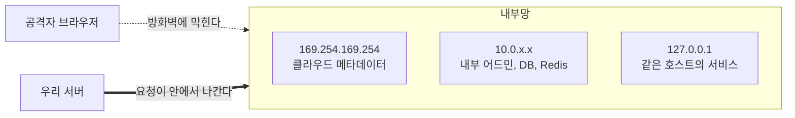
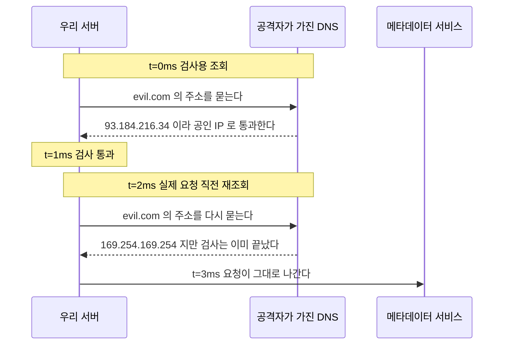
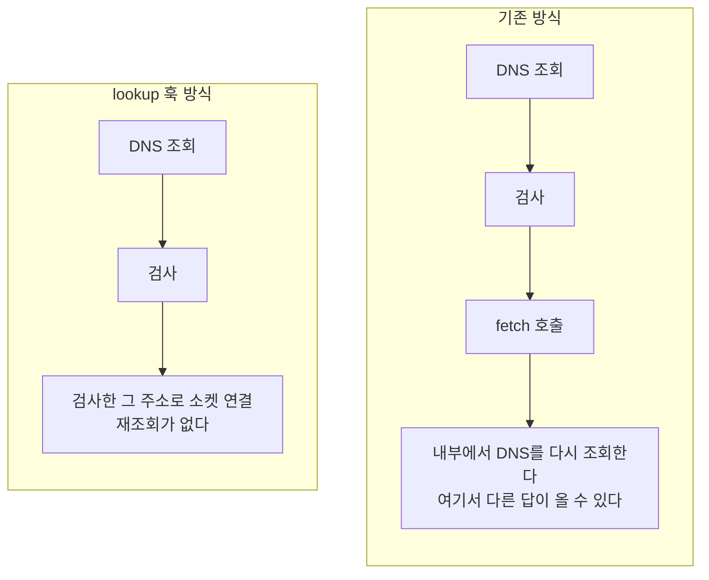
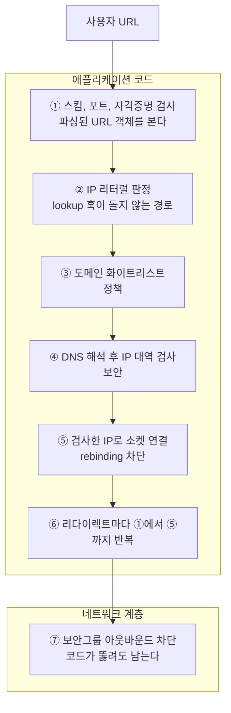

## Table of Contents

## 기능 자체가 취약점의 모양일 때

[1편](/2026/08/og-scraping-server-1)에서 런타임이 갈리는 첫 번째 지점으로 "소켓 직전까지의 통제권"을 꼽았다. 그 통제권이 왜 필요한지가 이 편의 내용이다.

1편을 읽지 않았어도 필요한 전제는 한 줄이다. **우리 서버는 사용자가 준 URL을 대신 열어 준다.**

SSRF(Server-Side Request Forgery)는 공격자가 서버로 하여금 공격자가 원하는 곳에 요청을 보내게 만드는 취약점이다. 이 정의에서 중요한 부분은 "요청을 보낸다"가 아니라 **"서버가 보낸다"** 쪽이다.

공격자의 브라우저와 우리 서버는 네트워크 위치가 다르기 때문이다.



SSRF는 공격자에게 우리 서버의 네트워크 위치를 잠깐 빌려주는 일에 가깝다. 방화벽은 여기서 아무 역할도 하지 못하는데, 요청이 바깥에서 들어오는 게 아니라 안에서 나가기 때문이다.

그리고 링크 미리보기는 SSRF가 가능해지는 두 조건을 기능 설명에 그대로 갖고 있다. 서버가 외부에서 온 URL로 요청을 보내야 하고, 그 URL은 사용자가 정한다. 취약점이 실수로 생기는 게 아니라 **기능의 모양이 곧 취약점의 모양**인 셈이다. 그래서 "조심해서 짜자"로는 잘 안 되고 구조로 막게 된다.

> 이 편의 코드는 전부 직접 돌려본 것이다. 검증 환경은 macOS(darwin 25.5.0), Node.js `v24.14.1`, undici `8.10.0`이다. 그리고 미리 밝혀두면, 글을 쓰면서 처음에 적었던 것 중 몇 개가 실제로 돌려보니 틀렸다. 그 대목은 본문에서 그때그때 표시했다.

## 무엇을 노리는가

가장 흔히 인용되는 AWS 환경의 시나리오를 따라가 보면 이렇게 진행된다.

공격자가 게시글에 링크를 하나 붙여넣는다.

```
http://169.254.169.254/latest/meta-data/iam/security-credentials/
```

우리 서버가 미리보기 카드를 만들려고 그 URL을 열고, 응답에는 인스턴스에 붙은 IAM 역할 이름이 들어 있다. 공격자가 그 이름을 붙여 한 번 더 붙여넣는다.

```
http://169.254.169.254/latest/meta-data/iam/security-credentials/og-scraper-role
```

이번 응답은 이렇게 생겼다.

```json
{
  "AccessKeyId": "ASIA...",
  "SecretAccessKey": "...",
  "Token": "..."
}
```

이 크레덴셜이면 그 역할이 가진 권한 범위 안에서 S3나 DynamoDB에 직접 접근할 수 있다. 미리보기 카드에는 에러 메시지만 떴더라도, 응답 본문이 로그나 에러 리포팅 도구에 남는 순간 같은 결과가 된다.

`169.254.0.0/16` 대역은 link-local이다. 라우팅되지 않고 같은 링크 안에서만 유효한 성질 때문에, 클라우드 사업자들이 인스턴스 메타데이터 서비스를 여기에 올렸다.

| 사업자  | 주소              | 추가 조건                                |
| ------- | ----------------- | ---------------------------------------- |
| AWS     | `169.254.169.254` | IMDSv2면 PUT으로 토큰을 먼저 받아야 한다 |
| GCP     | `169.254.169.254` | `Metadata-Flavor: Google` 헤더 필요      |
| Azure   | `169.254.169.254` | `Metadata: true` 헤더 필요               |
| Alibaba | `100.100.100.200` |                                          |

여기서 "IMDSv2를 켜뒀으니 괜찮지 않나"라는 질문이 자주 나오는데, 절반만 그렇다고 보는 편이 안전하다. IMDSv2는 `PUT /latest/api/token`으로 토큰을 먼저 받아야 하고 스크래핑은 GET만 보내므로, 단순한 형태의 SSRF로는 뚫리지 않는 것이 맞다. 다만 IMDSv1이 아직 켜져 있는 인스턴스가 남아 있는 경우가 있고, SSRF가 메서드나 헤더까지 조작할 수 있는 형태라면 여전히 가능하며, 무엇보다 **메타데이터만 표적인 것이 아니다.** 내부 어드민 페이지, Redis, Elasticsearch, 쿠버네티스 API가 전부 같은 내부망에 있다.

IMDSv2 강제와 hop limit 1은 해두는 편이 좋지만, 그것을 방어의 전부로 두기는 어렵다.

## 화이트리스트는 어떻게 뚫리는가

이쯤에서 가장 흔한 답이 나온다. "허용 도메인 목록을 두고 그 안에서만 스크래핑하면 된다." 방향은 맞는데, 그것만으로는 뚫린다.

막는 법보다 뚫리는 법을 먼저 보는 순서가 중요하다. 방어 코드가 왜 그런 모양인지는 어떤 우회를 막으려는 것인지 알아야 이해되기 때문이다.

### 우회 1: IP 표기 변형

위험한 주소를 문자열로 걸러내는 검사부터 보자. 실제로 자주 보이는 모양이다.

```ts
if (rawUrl.includes('127.0.0.1') || rawUrl.includes('169.254.169.254')) {
  throw new Error('blocked')
}
```

아래 다섯 개는 이 검사를 전부 통과한다. 그리고 전부 `127.0.0.1`로 연결된다.

| 붙여넣는 URL              | 표기                    |
| ------------------------- | ----------------------- |
| `http://2130706433/`      | 32비트 십진수           |
| `http://0x7f000001/`      | 16진수                  |
| `http://0177.0.0.01/`     | 8진수                   |
| `http://127.1/`           | 축약형 (중간 옥텟 생략) |
| `http://127.000.000.001/` | 0 패딩                  |

문자열 `127.0.0.1`은 어디에도 없는데 커널은 전부 같은 곳으로 연결한다. 이게 이 우회의 실체다.

다만 여섯 중에서는 가장 가벼운 편인데, `new URL()`로 파싱하는 것만으로 사라지기 때문이다. WHATWG URL 파서가 이 표기들을 파싱 단계에서 정규화한다.

```ts
new URL('http://2130706433/').hostname // '127.0.0.1'
new URL('http://0x7f000001/').hostname // '127.0.0.1'
new URL('http://0177.0.0.01/').hostname // '127.0.0.1'
new URL('http://127.1/').hostname // '127.0.0.1'
```

그래서 여기서 얻을 교훈은 "IP 표기법을 전부 외워 두라"가 아니라 **검증은 원본 문자열이 아니라 파싱한 값으로 한다**는 쪽이다. 이 우회를 맨 앞에 둔 이유이기도 한데, 남은 다섯은 파싱만으로는 막히지 않는다.

### 우회 2: DNS로 사설 IP 가리키기

그러면 파싱해서 얻은 `hostname`을 검사하면 되는가. 그것만으로는 안 된다.

도메인 이름은 아무 IP나 가리킬 수 있기 때문이다. 공격자가 자기 도메인의 A 레코드를 이렇게 두면 그만이다.

```
evil.example.com.   IN  A   127.0.0.1
```

`evil.example.com`은 `hostname`을 아무리 뜯어봐도 정상적인 공인 도메인이다. 그런데 연결되는 곳은 로컬이다. 도메인을 살 필요조차 없는데, `127.0.0.1.nip.io`나 `10.0.0.1.nip.io`처럼 이름에 적힌 IP를 그대로 돌려주는 공개 서비스가 있다.

**이름은 목적지를 알려주지 않는다.** 봐야 하는 건 그 이름이 해석된 IP다.

### 우회 3: DNS rebinding

그러면 이름 대신 해석된 IP를 검사하면 되는가. 그것도 뚫린다. 여섯 중 가장 교묘하고, 가장 많이 놓친다.

방어 코드가 보통 이런 모양으로 쓰인다.

```ts
const ip = await dns.resolve(url.hostname) // ① 검사용 조회
if (isPrivate(ip)) throw new Error('blocked')

await fetch(url) // ② 실제 요청. 여기서 또 조회한다
```

①과 ②는 **각각 DNS를 조회한다.** 그 사이에 응답이 바뀌면 검사와 사용이 어긋난다. 이 틈을 TOCTOU(Time-Of-Check to Time-Of-Use, 검사 시점과 사용 시점의 불일치)라고 부른다.

공격자는 TTL을 0으로 둔 도메인을 준비한다.



공격자가 이걸 할 수 있는 이유는 자기 도메인의 DNS 서버를 자기가 들고 있기 때문이다. TTL이 0이면 캐시되지 않으므로 두 번의 조회가 다른 답을 받는 것은 표준대로 보면 정상 동작이고, 그래서 이 공격은 규칙을 어기지 않고도 성립한다.

결국 검사한 것과 실제로 쓰는 것이 같아야 한다. 이름을 검사하는 대신 **주소를 검사한 뒤 그 주소를 그대로 써야 한다.**

### 우회 4: 리다이렉트

여기까지를 전부 지켰다고 하자. 파싱했고, 해석된 IP를 검사했고, 그 IP로 직접 연결했다. 그런데 검사한 것은 **첫 번째 요청 하나뿐**이다.

허용 목록에 `example.com`이 있다고 하고, 공격자가 이걸 붙여넣는다.

```
https://example.com/redirect?to=http://169.254.169.254/
```

첫 요청의 호스트는 `example.com`이라 앞의 검사를 전부 통과한다. 그리고 서버가 `302 Location: http://169.254.169.254/`를 응답하면 HTTP 클라이언트가 자동으로 따라가는데, 이때는 아무도 검사하지 않는다.

공격자가 자기 도메인을 화이트리스트에 넣게 만들 필요도 없다는 점이 고약하다. 이미 허용된 사이트 중 open redirect가 있는 곳 아무 데나 하나면 되고, open redirect는 흔한 편이다.

그래서 리다이렉트 자동 추적을 끄고 **홉마다 처음부터 다시** 검사해야 한다.

### 우회 5: 검증한 값과 요청하는 값이 다를 때

앞의 넷은 무엇을 검사할 것인가의 문제였다. 이건 결이 조금 다른데, 제대로 검사하고도 검사한 것과 다른 것을 요청에 넘기는 경우다.

전형적인 모양은 이렇다. 화이트리스트를 문자열로 확인하고, 원본 문자열을 그대로 클라이언트에 넘긴다.

```ts
if (!rawUrl.includes('allowed.com')) throw new Error('blocked')

await request(rawUrl) // 이 요청은 어디로 가는가
```

네 가지 입력을 넣고 실제로 확인해 보면 이렇게 갈린다.

| 입력                              | 문자열에 `allowed.com`이 | 실제 호스트   |
| --------------------------------- | ------------------------ | ------------- |
| `http://allowed.com@evil.com/`    | 있다                     | `evil.com`    |
| `http://evil.com#@allowed.com/`   | 있다                     | `evil.com`    |
| `http://allowed.com%2f@evil.com/` | 있다                     | `evil.com`    |
| `http://allowed.com\@evil.com/`   | 있다                     | `allowed.com` |

첫 줄이 URL의 `user@host` 문법이다. `allowed.com`이 호스트가 아니라 사용자 이름 자리에 들어가 있고 실제 호스트는 `evil.com`이다. 두 번째는 `#` 뒤가 프래그먼트라 목적지와 무관하고, 세 번째는 `%2f`까지 포함해 사용자 이름으로 들어간다. 문자열 검사는 넷 다 통과시키지만 실제 목적지는 셋이 `evil.com`이다.

마지막 줄은 방향이 반대라 더 눈여겨볼 만하다. 백슬래시가 들어가면 WHATWG 파서는 그것을 경로 구분자로 보고 호스트를 `allowed.com`으로 준다. 같은 문자열을 두고 파서마다 답이 갈릴 수 있다는 뜻이고, 검증에 쓰는 파서와 요청에 쓰는 파서가 다르면 그 차이가 그대로 구멍이 된다.

규칙은 하나다. **파싱은 한 번만 하고, 파싱한 그 객체를 그대로 요청에 넘긴다.**

### 우회 6: IPv6

마지막은 잊어버려서 생기는 구멍이다. IPv4 사설 대역만 검사하는 코드는 아래를 전부 통과시킨다.

| 주소               | 의미                                |
| ------------------ | ----------------------------------- |
| `::1`              | 루프백                              |
| `::ffff:127.0.0.1` | IPv4-mapped. 실제로는 127.0.0.1이다 |
| `::ffff:a9fe:a9fe` | `169.254.169.254`의 16진 표기       |
| `fe80::/10`        | link-local                          |
| `fc00::/7`         | ULA (사설 대역에 해당)              |
| `64:ff9b::/96`     | NAT64 (IPv4로 변환된다)             |

특히 IPv4-mapped가 까다롭다. 겉모습은 IPv6인데 커널은 IPv4로 연결한다. 게다가 표기가 하나가 아니어서, 점 표기로 적어 넣어도 파서는 16진 표기로 돌려준다.

```ts
new URL('http://[::ffff:169.254.169.254]/').hostname // '[::ffff:a9fe:a9fe]'
```

`a9fe:a9fe`가 `169.254.169.254`를 16진수로 쓴 것이기 때문이다(`0xa9 = 169`, `0xfe = 254`). 그러니 `::ffff:169.254.169.254`라는 문자열을 막아둔 코드는 이 주소를 그냥 놓친다. 우회 1과 같은 이야기가 IPv6에서 한 번 더 반복되는 셈이다.

그리고 위 출력에서 하나가 더 보인다. `hostname`에 **대괄호가 그대로 남아 있다.** 이걸 주소로 착각하고 그대로 검사에 넘기면 어떻게 되는지는 뒤에서 다시 본다.

## 방어 원리 다섯

여섯 가지 우회를 관통하는 원리는 다섯 개다. 각각이 앞의 무엇을 닫는지 같이 적어 둔다.

- **이름이 아니라 주소를 검증한다.** 표기 변형(우회 1), DNS로 사설 IP 가리키기(우회 2), IPv6(우회 6)가 여기서 걸린다
- **검증한 그 주소로 직접 연결한다.** rebinding(우회 3)을 막는 지점은 여기 하나뿐이다
- **리다이렉트는 홉마다 앞의 둘을 처음부터 다시 한다** (우회 4)
- **한 번 파싱한 객체만 쓴다** (우회 5)
- 그리고 마지막으로, **위의 넷을 전부 믿지 않는다**

하나씩 코드로 옮겨 본다.

### 원리 1: 주소를 검증한다

Node에는 `net.BlockList`가 내장되어 있어서 직접 비트 연산을 할 필요가 없다.

```ts
import {BlockList, isIP, isIPv4} from 'node:net'

const blocked = new BlockList()

blocked.addSubnet('0.0.0.0', 8, 'ipv4') // this network
blocked.addSubnet('10.0.0.0', 8, 'ipv4') // RFC1918
blocked.addSubnet('100.64.0.0', 10, 'ipv4') // CGNAT
blocked.addSubnet('127.0.0.0', 8, 'ipv4') // loopback
blocked.addSubnet('169.254.0.0', 16, 'ipv4') // link-local (메타데이터)
blocked.addSubnet('172.16.0.0', 12, 'ipv4') // RFC1918
blocked.addSubnet('192.168.0.0', 16, 'ipv4') // RFC1918
blocked.addSubnet('192.0.0.0', 24, 'ipv4') // IETF 프로토콜 할당 (DS-Lite 등)
blocked.addSubnet('198.18.0.0', 15, 'ipv4') // 벤치마크
blocked.addSubnet('224.0.0.0', 4, 'ipv4') // 멀티캐스트
blocked.addSubnet('240.0.0.0', 4, 'ipv4') // reserved
```

IPv6도 같이 막는다.

```ts
blocked.addAddress('::', 'ipv6') // unspecified
blocked.addAddress('::1', 'ipv6') // loopback
blocked.addSubnet('64:ff9b::', 96, 'ipv6') // NAT64 (RFC 6052)
blocked.addSubnet('64:ff9b:1::', 48, 'ipv6') // NAT64 local-use (RFC 8215)
blocked.addSubnet('100::', 64, 'ipv6') // discard
blocked.addSubnet('fc00::', 7, 'ipv6') // ULA
blocked.addSubnet('fe80::', 10, 'ipv6') // link-local
blocked.addSubnet('fec0::', 10, 'ipv6') // site-local (deprecated, 구형 스택 대비)
blocked.addSubnet('ff00::', 8, 'ipv6') // 멀티캐스트
```

이 목록이 막아야 할 IPv6 대역의 전부는 아니다. IPv4 주소를 IPv6 안에 품는 방식이 여럿 있어서(위의 NAT64가 그런 예다), IPv6를 실제로 쓰는 환경이라면 [IANA IPv6 Special-Purpose Address Registry](https://www.iana.org/assignments/iana-ipv6-special-registry/iana-ipv6-special-registry.xhtml)를 한 번 훑어 빠진 것을 채우는 편이 안전하다.

검사 함수 자체는 짧다.

```ts
export function isPublicAddress(ip: string): boolean {
  if (isIP(ip) === 0) return false // IP 형식이 아니면 일단 막는다
  return !blocked.check(ip, isIPv4(ip) ? 'ipv4' : 'ipv6')
}
```

첫 줄이 왜 필요한지가 중요하다. `blocked.check()`는 IP가 아닌 문자열을 받으면 예외를 던지는 게 아니라 조용히 "막지 않음"으로 답한다. 직접 확인해 보면 이렇다.

```
"localhost"    check => false   (막지 않음)
""             check => false
"999.1.1.1"    check => false
"127.0.0.1 "   check => false   (뒤에 공백이 붙었다)
```

그래서 IP 형식이 아닌 값은 함수 앞에서 잘라내고, 애매하면 막는 쪽(fail-closed)으로 기울여 둔다.

여기까지 쓰고 나면 손이 근질거리는 지점이 하나 생긴다. 앞에서 IPv4-mapped 이야기를 읽었으니 `::ffff:`를 직접 벗겨서 검사하고 싶어진다.

```ts
// 이 코드는 취약하다
const addr = ip.startsWith('::ffff:') ? ip.slice(7) : ip
return !blocked.check(addr, isIPv4(addr) ? 'ipv4' : 'ipv6')
```

돌려본 결과가 이렇다.

| 입력                     | `slice(7)` 결과   | 판정     |
| ------------------------ | ----------------- | -------- |
| `::ffff:169.254.169.254` | `169.254.169.254` | 차단     |
| `::ffff:a9fe:a9fe`       | `a9fe:a9fe`       | **통과** |
| `::ffff:7f00:1`          | `7f00:1`          | **통과** |

16진 표기에서 접두사를 벗기면 IPv4도 IPv6도 아닌 문자열이 남고, `BlockList.check()`는 그런 입력에 예외 대신 `false`를 돌려준다. 바로 위에서 본 그 성질이 여기서 구멍이 된다.

같은 값을 벗기지 않고 그대로 넣으면 이렇게 나온다.

| 입력                         | 결과 |
| ---------------------------- | ---- |
| `::ffff:169.254.169.254`     | 차단 |
| `::ffff:a9fe:a9fe`           | 차단 |
| `::ffff:7f00:1`              | 차단 |
| `64:ff9b::a9fe:a9fe` (NAT64) | 차단 |

`BlockList`는 `::ffff:` 형태를 알아서 IPv4로 보고 검사한다. 점 표기든 16진 표기든 가리지 않는다.

다만 마지막 줄에는 조건이 붙는다. `64:ff9b::` 형태(NAT64)는 자동으로 풀어주지 않는다. 위에서 막힌 것은 앞의 코드에 `64:ff9b::/96` 한 줄을 직접 넣어뒀기 때문이고, 그 줄을 빼고 확인하면 결과가 갈린다.

```
64:ff9b::a9fe:a9fe -> 통과 (취약)
::ffff:a9fe:a9fe   -> 차단
```

정리하면 `::ffff:`만 자동이고, 나머지 "IPv4를 안에 품은 IPv6"는 대역마다 직접 막아야 한다. 그리고 여기서 두 가지를 얻는다. 주소 정규화는 직접 하지 않고 런타임이 제공하는 것을 쓰는 편이 낫다는 것, 그리고 보안 코드는 반드시 우회 케이스로 테스트해야 한다는 것이다. 사실 위의 두 표가 그대로 테스트 케이스다.

보안 코드는 "잘 동작한다"보다 "이것들을 막는다"로 표현하는 편이 정확하다고 생각한다.

```ts
describe('isPublicAddress', () => {
  const blockedCases = [
    '127.0.0.1',
    '169.254.169.254',
    '10.1.2.3',
    '172.16.0.1',
    '192.168.1.1',
    '100.64.0.1',
    '0.0.0.0',
    '::1',
    '::',
    'fe80::1',
    'fd00::1',
    'ff02::1',
    '::ffff:127.0.0.1',
    '::ffff:169.254.169.254',
    '::ffff:a9fe:a9fe',
    '::ffff:7f00:1', // 16진 표기
    '64:ff9b::a9fe:a9fe', // NAT64
    'localhost', // IP가 아닌 값
    '', // 빈 문자열
    '999.1.1.1', // IP처럼 보이지만 유효하지 않다
    '127.0.0.1 ', // 뒤에 공백
  ]
  const allowedCases = [
    '93.184.216.34',
    '1.1.1.1',
    '2606:4700::1',
    '172.32.0.1',
    '100.128.0.1',
    '11.0.0.0', // 경계 바로 바깥
  ]

  it.each(blockedCases)('%s 를 차단한다', (ip) =>
    expect(isPublicAddress(ip)).toBe(false),
  )
  it.each(allowedCases)('%s 를 허용한다', (ip) =>
    expect(isPublicAddress(ip)).toBe(true),
  )
})
```

허용 케이스에 경계 바로 바깥(`172.32.0.1`)을 넣은 이유는, 과차단도 버그이기 때문이다. 멀쩡한 사이트의 미리보기가 안 나오는 것도 장애다.

### 원리 2: 검증한 주소로 직접 연결한다

여기가 rebinding을 막는 자리이고, 1편에서 미리 말한 `lookup` 훅을 쓰는 자리이기도 하다.

```ts
import {Agent} from 'undici'
import {lookup as dnsLookup} from 'node:dns'

export const scrapeAgent = new Agent({
  connect: {
    lookup(hostname, options, callback) {
      dnsLookup(hostname, {all: true}, (err, addresses) => {
        if (err) return callback(err, '', 0)

        // 하나라도 사설이면 전부 거부한다.
        // 공격자는 A 레코드를 여러 개 줄 수 있다.
        if (!addresses.every((a) => isPublicAddress(a.address))) {
          return callback(new Error('BLOCKED_PRIVATE_ADDRESS'), '', 0)
        }

        if (options.all) return callback(null, addresses)
        callback(null, addresses[0].address, addresses[0].family)
      })
    },
  },
})
```

마지막 두 줄은 처음에 없던 것이다. 원래는 주소 하나만 골라 돌려주도록 썼는데, 돌려보니 첫 요청부터 죽었다.

```
single   -> throw TypeError: Invalid IP address: undefined   (options.all = [true])
array    -> status 200                                        (options.all = [true])
```

undici는 이 콜백을 `{ all: true }`로 호출하고 주소 배열을 기대한다. `{ all: true }` 결과를 그대로 넘기면 되고, 주소 하나만 넘기면 위 에러가 난다. 문서를 읽고 짐작으로 쓴 코드와 돌려본 코드의 차이가 이런 자리에서 나온다.

이 훅이 rebinding을 막는 이유는 조회와 연결 사이에 틈이 없어지기 때문이다.



검사 시점과 사용 시점 사이에 DNS 조회가 한 번도 없으니 TOCTOU 창이 닫힌다. 이때도 요청에 실리는 호스트 이름(`Host` 헤더와 인증서 검증용 이름)은 원래대로 유지되므로, 한 IP에 여러 사이트가 얹힌 경우나 인증서 검증은 정상 동작한다. 그리고 이 검사는 새 연결을 열 때만 도는데, 재사용하는 연결(keep-alive)의 상대는 조금 전 검사를 통과한 그 주소라 문제되지 않는다.

`every`를 쓴 것도 의도가 있다. 공격자는 A 레코드를 이렇게 줄 수 있다.

```
evil.com.  IN  A  93.184.216.34    ← 공인
evil.com.  IN  A  169.254.169.254  ← 사설
```

`find(isPublic)`으로 공인 주소 하나만 골라 쓰면 당장은 안전해 보인다. 그런데 정상적인 도메인이 사설 IP를 섞어 반환할 이유가 별로 없어서, 그런 응답 자체를 공격 신호로 보는 편이 자연스럽다. 전부 거부하면 의도가 정확히 드러나고, 조회 순서나 캐시 상태에 따라 결과가 흔들리는 일도 없어진다.

### 훅이 호출되지 않는 경로가 있다

여기까지 쓰고 나면 `lookup` 훅이 관문 역할을 다 해주는 것처럼 보인다. 그래서 한 가지를 더 확인해 봤다. **무엇이든 무조건 거부하는** 훅을 붙여놓고 요청을 보내면, 정말 전부 막히는가.

```ts
const paranoid = new Agent({
  connect: {
    lookup(hostname, options, callback) {
      callback(new Error('BLOCKED_BY_HOOK'), '', 0) // 예외 없이 전부 거부
    },
  },
})
```

결과는 이랬다.

```
http://localhost:9004/   → 차단됨                 | lookup 호출 1회
http://127.0.0.1:9004/   → status 200 INTERNAL    | lookup 호출 0회
http://[::1]:9005/       → status 200 INTERNAL    | lookup 호출 0회
```

**호스트가 이미 IP 리터럴이면 `lookup` 훅은 아예 호출되지 않는다.** 동작 자체는 당연하다. 이름이 아니니 이름을 풀 일이 없고, 소켓은 그 주소로 바로 연결하면 된다. 다만 그 결과로, 이 편에서 SSRF 방어의 핵심으로 세워둔 장치를 `http://169.254.169.254/`가 그냥 지나간다.

그러면 URL 검증 쪽에서 IP 리터럴을 잡아야 하는데, 여기 한 겹이 더 있다. `URL.hostname`은 **IPv6 리터럴의 대괄호를 남긴다.**

```
http://127.0.0.1/               hostname = "127.0.0.1"                isIP = 4
http://[::1]/                   hostname = "[::1]"                    isIP = 0
http://[::ffff:a9fe:a9fe]/      hostname = "[::ffff:a9fe:a9fe]"       isIP = 0
```

그래서 이렇게 쓴 가드는 IPv6 리터럴을 통과시킨다.

```ts
// IPv6 리터럴을 놓친다
const h = url.hostname
if (isIP(h) !== 0 && !isPublicAddress(h)) throw new BlockedError('BLOCKED')
```

`isIP('[::1]')`이 0이라 조건이 거짓이 되어 검사를 건너뛰고, 그다음엔 `lookup` 훅도 호출되지 않는다. 두 개가 겹쳐서 구멍이 된다.

고치려면 대괄호를 벗기고 나서 판정한다.

```ts
function hostnameAsIp(hostname: string): string | null {
  const bare =
    hostname.startsWith('[') && hostname.endsWith(']')
      ? hostname.slice(1, -1)
      : hostname
  return isIP(bare) === 0 ? null : bare
}

function assertHostAllowed(url: URL) {
  const ip = hostnameAsIp(url.hostname)
  if (ip !== null) {
    // 호스트가 IP 리터럴이면 lookup 훅이 돌지 않으므로 여기서 판정한다
    if (!isPublicAddress(ip)) throw new BlockedError('BLOCKED_LITERAL_ADDRESS')
    return
  }
  // 이름이면 lookup 훅이 해석된 주소를 검사한다
}
```

두 가드를 나란히 돌려본 결과다.

| 입력                         | 순진한 가드 | 고친 가드 |
| ---------------------------- | ----------- | --------- |
| `http://169.254.169.254/`    | 차단        | 차단      |
| `http://2130706433/`         | 차단        | 차단      |
| `http://0x7f000001/`         | 차단        | 차단      |
| `http://[::1]/`              | **통과**    | 차단      |
| `http://[::ffff:a9fe:a9fe]/` | **통과**    | 차단      |
| `http://[::ffff:7f00:1]/`    | **통과**    | 차단      |
| `http://[fd00::1]/`          | **통과**    | 차단      |
| `http://example.com/`        | 통과        | 통과      |
| `http://93.184.216.34/`      | 통과        | 통과      |
| `http://[2606:4700::1]/`     | 통과        | 통과      |

공인 IPv6(`2606:4700::1`)는 그대로 통과하므로 과차단도 아니다.

여기서 조금 헷갈리는 대목이 생긴다. 바로 앞 절에서는 `::ffff:` 접두사를 손으로 벗기지 말라고 했는데, 이 절에서는 대괄호를 손으로 벗겨야 한다. 모순처럼 보이지만 다루는 대상이 다르다. 앞의 것은 **주소 체계의 의미**를 손으로 해석하려던 시도라서 `BlockList`에 맡기는 게 맞고, 뒤의 것은 URL 문법이 씌운 **표기상의 껍데기**를 벗겨 원래 주소 문자열로 되돌리는 일이다. 판단은 여전히 `isIP`와 `BlockList`가 한다.

그리고 앞의 도메인 화이트리스트가 있는 구성이라면 IP 리터럴은 이름 매칭에서 이미 걸린다. 문제는 화이트리스트 없이 임의의 URL을 열어주는 구성인데, 링크 미리보기의 실제 제품 요구사항이 대체로 그쪽이다.

### 원리 3: 리다이렉트를 직접 따라간다

```ts
const MAX_HOPS = 3

async function fetchGuarded(startUrl: URL) {
  let url = startUrl

  // 리다이렉트 체인 전체에 거는 데드라인. 홉이 몇 번이든 이 시간은 넘기지 않는다.
  const overall = AbortSignal.timeout(8_000)

  for (let hop = 0; hop <= MAX_HOPS; hop++) {
    assertAllowedUrl(url) // 스킴, 포트, 자격증명, 호스트

    const res = await request(url, {
      dispatcher: scrapeAgent, // redirect 인터셉터를 붙이지 않는다
      // 홉 하나당 5초, 체인 전체 8초. 둘 중 먼저 걸리는 쪽에서 끊긴다
      signal: AbortSignal.any([overall, AbortSignal.timeout(5_000)]),
    })

    if (res.statusCode < 300 || res.statusCode >= 400) return res

    const location = res.headers.location
    if (!location) return res

    await res.body.dump() // 소켓을 반드시 비운다
    url = new URL(location, url) // 상대 경로도 처리된다
  }

  throw new Error('TOO_MANY_REDIRECTS')
}
```

이 코드에서 두 줄이 눈에 잘 안 들어오는데 둘 다 필요하다. `await res.body.dump()`는 본문을 버리고 소켓을 정리한다. 본문을 읽지 않고 넘어가면 소켓이 커넥션 풀에 반납되지 않아서, 리다이렉트가 잦으면 커넥션이 고갈된다. `new URL(location, url)`은 `Location`이 상대 경로(`/login`, `../other`)일 때를 표준대로 해석하고, 이렇게 만든 객체가 다음 루프에서 다시 검사받는다.

그런데 실제로 위험한 쪽은 이 코드가 아니라 그냥 `fetch()`를 쓰는 쪽이다. 같은 로컬 서버로 확인해 보면 이렇다.

| 호출                                 | 302 응답 처리                     |
| ------------------------------------ | --------------------------------- |
| `undici.request(url)`                | 302를 그대로 반환                 |
| `fetch(url)`                         | **따라가서 내부 본문을 가져왔다** |
| `fetch(url, { redirect: 'manual' })` | 302를 그대로 반환                 |

`undici.request()`는 기본적으로 리다이렉트를 따라가지 않는다. 따라가게 하려면 인터셉터를 명시적으로 붙여야 한다. 반면 전역 `fetch()`는 기본이 `redirect: 'follow'`라, 아무 생각 없이 쓰면 open redirect를 그대로 따라간다.

그리고 여기서 처음에 적었다가 틀린 것이 하나 더 있다. 옛 문서를 따라 `maxRedirections: 0`으로 끄면 된다고 썼는데, undici 8에서 확인해 보니 이렇다.

```
maxRedirections: 0 -> status 302
maxRedirections: 3 -> throw InvalidArgumentError: maxRedirections is not supported, use the redirect interceptor
```

0만 허용되고 그 외의 값은 예외다. 따라가려면 인터셉터를 조립해야 한다.

```ts
const redir = new Agent().compose(interceptors.redirect({maxRedirections: 3}))
```

어차피 기본값이 추적하지 않는 쪽이므로, 실질적인 방어는 **`fetch()`를 쓰지 않는 것**에 가깝다.

### 원리 4: 스킴과 포트도 잠근다

`assertAllowedUrl`이 실제로 하는 일은 이렇다.

```ts
const ALLOWED_PROTOCOLS = new Set(['http:', 'https:'])
const ALLOWED_PORTS = new Set(['', '80', '443'])

function assertAllowedUrl(url: URL) {
  if (!ALLOWED_PROTOCOLS.has(url.protocol)) {
    throw new BlockedError('SCHEME_NOT_ALLOWED')
  }
  if (!ALLOWED_PORTS.has(url.port)) {
    throw new BlockedError('PORT_NOT_ALLOWED')
  }
  if (url.username || url.password) {
    throw new BlockedError('CREDENTIALS_IN_URL') // user@host 우회 차단
  }
  assertHostAllowed(url) // IP 리터럴 판정 + 도메인 정책
}
```

스킴을 막는 이유는 `http`와 `https`가 아닌 스킴이 전혀 다른 공격면을 열기 때문이다. `file://`은 `/etc/passwd`나 애플리케이션 시크릿 파일로 가고, `gopher://`는 임의의 TCP 페이로드를 보낼 수 있어 Redis나 SMTP 명령 주입에 쓰인다. `dict://`는 내부 서비스의 배너를 수집하고, `data:`는 파서 혼동을 유발한다. `undici`가 `http`와 `https`만 지원하므로 상당 부분은 자동으로 막히지만, 명시적으로 거부해 두면 나중에 클라이언트를 교체해도 방어가 남는다.

포트를 막는 이유는 80과 443 외의 포트가 대개 내부 서비스이기 때문이다. 6379(Redis), 9200(Elasticsearch), 5432(PostgreSQL), 27017(MongoDB), 8080(내부 어드민), 2375(Docker daemon) 같은 것들이다. IP 대역을 막았다면 상당 부분 겹치지만, DNS가 공인 IP를 가리키면서 그 뒤에 프록시가 있는 경우처럼 한 겹이 더 필요한 상황이 있다.

도메인 화이트리스트를 쓴다면 매칭에서 실수가 나기 쉽다.

```ts
const ALLOWED_HOSTS = new Set(['example.com'])

function isAllowedHost(hostname: string): boolean {
  if (ALLOWED_HOSTS.has(hostname)) return true // 정확히 일치
  // 서브도메인을 허용한다면 반드시 "." 경계를 붙인다
  return [...ALLOWED_HOSTS].some((d) => hostname.endsWith('.' + d))
}
```

가장 흔한 실수는 `.` 없이 `endsWith('example.com')`으로 검사하는 것이다. 그러면 `notexample.com`이나 `evil-example.com`이 통과하고, 공격자가 그런 도메인 하나만 사면 된다. 서브도메인을 허용한다면 아무도 관리하지 않는 서브도메인을 공격자가 가로채는 경우(subdomain takeover)와, `exаmple.com`처럼 눈으로는 같아 보이지만 다른 글자(키릴 문자 `а`)를 쓴 도메인도 같이 생각해야 한다.

### 원리 5: 애플리케이션 방어를 믿지 않는다

지금까지 쓴 코드는 전부 애플리케이션 계층에 있다. 라이브러리를 교체하면 사라지고, 다른 개발자가 `fetch()`를 직접 쓰면 우회되며, 우리가 모르는 우회 기법이 내일 나올 수도 있다. 방금 본 IP 리터럴 구멍이 그 예시이기도 하다.

그래서 네트워크 계층에서 한 번 더 막는 구성이 필요하다.

| 계층             | 통제                                                |
| ---------------- | --------------------------------------------------- |
| 인스턴스         | IMDSv2 강제, hop limit 1                            |
| 보안 그룹 / NACL | 아웃바운드에서 내부 대역 차단                       |
| Egress 프록시    | 모든 외부 요청을 한 지점으로 강제하고 거기서 필터링 |
| VPC 설계         | 스크래핑 워크로드를 별도 서브넷으로 격리            |

전체를 그림으로 놓으면 이렇게 겹친다.



## 화이트리스트를 IP로 할까 도메인으로 할까

여기서 흔한 오해를 하나 짚고 싶다. "IP 화이트리스트가 도메인보다 안전하다"는 말인데, 스크래핑에서는 그렇게 말하기 어렵다.

| 방식        | 장점                        | 실제 문제                                              |
| ----------- | --------------------------- | ------------------------------------------------------ |
| IP 기반     | 이름 조작에 영향받지 않는다 | 대상이 CDN 뒤에 있으면 그 CDN의 모든 사이트가 허용된다 |
| 도메인 기반 | 정책 표현이 정확하다        | 해석된 IP를 검사하지 않으면 의미가 없다                |

둘은 목적이 다르다. 어떤 사이트의 미리보기를 허용할 것인가는 **콘텐츠 정책**이고 도메인 화이트리스트가 표현한다. 내부망으로 나가지 못하게 하는 것은 **네트워크 보안**이고 IP 대역 차단과 egress 통제가 표현한다. 도메인 화이트리스트가 "특정 유형의 링크를 막는다"를 말한다면, IP 대역 차단은 "메타데이터를 못 읽는다"를 말한다. 서로를 대체하지 못하므로 둘 중 하나를 고르는 문제가 아니다.

## 잊기 쉬운 두 가지

### 응답 크기 상한

공격자가 이런 URL을 준다.

```
https://evil.com/infinite   →  응답이 끝나지 않는다
https://evil.com/10gb.html  →  거대한 HTML
```

`.text()`나 `.body()`로 전부 읽으면 메모리가 버티지 못한다. 실제로 읽은 바이트를 세면서 끊어야 한다.

```ts
const MAX_BYTES = 512 * 1024 // og 태그는 <head>에 있다. 512KB면 충분하다

async function readCapped(body: Readable): Promise<Buffer> {
  const chunks: Buffer[] = []
  let total = 0

  for await (const chunk of body) {
    total += chunk.length
    if (total > MAX_BYTES) {
      body.destroy() // 소켓을 끊는다
      throw new BlockedError('RESPONSE_TOO_LARGE')
    }
    chunks.push(chunk)
  }
  return Buffer.concat(chunks)
}
```

`Content-Length` 헤더만 보고 판단하는 것으로는 부족한 이유가 셋이다. `Transfer-Encoding: chunked`면 헤더가 아예 없고, 헤더 값이 거짓일 수 있으며(상대 서버가 공격자의 것이다), 압축된 경우 헤더는 압축 크기라서 해제 후 크게 부풀 수 있다. 헤더 검사는 조기 차단용 보조 수단 정도로 두는 편이 안전하다.

### 타임아웃은 하나가 아니다

`timeout: 5000` 하나로 끝내면 원인 분류가 안 된다. 단계별로 나누는 편이 낫다.

```ts
new Agent({
  connectTimeout: 2_000, // TCP + TLS 핸드셰이크
  headersTimeout: 3_000, // 요청 후 응답 헤더까지
  bodyTimeout: 3_000, // 본문 청크 사이의 최대 간격
})

// 그리고 전체 상한을 따로 건다
request(url, {signal: AbortSignal.timeout(8_000)})
```

`bodyTimeout`은 응답 조각 사이의 간격이지 전체 시간이 아니다. 응답을 1바이트씩 아주 느리게 흘려 연결을 오래 붙잡는 방식(slowloris형)은 `bodyTimeout`만으로 막기 어려워서 전체 상한이 따로 필요하다.

그리고 이 전체 상한은 요청 하나가 아니라 리다이렉트 체인 전체에 하나만 건다. 앞의 `fetchGuarded`에서 루프 밖에 둔 `overall`이 그 역할이다. 홉마다 5초를 새로 주면 리다이렉트가 세 번 이어질 때 최악의 경우 20초까지 늘어난다.

## 체크리스트

| 항목                               | 막는 것                                 |
| ---------------------------------- | --------------------------------------- |
| 스킴을 http/https로 제한           | `file://`, `gopher://`                  |
| 포트를 80/443으로 제한             | 내부 서비스 직접 접근                   |
| URL 자격증명 거부                  | `user@host` 파서 혼동                   |
| 도메인 화이트리스트                | 콘텐츠 정책                             |
| **IP 리터럴 판정 (대괄호 벗기고)** | `lookup` 훅이 돌지 않는 경로            |
| DNS 해석 IP 대역 검사              | 사설망, 메타데이터                      |
| IPv4-mapped와 NAT64                | `::ffff:a9fe:a9fe` (손으로 벗기지 않기) |
| 검사한 IP로 연결                   | DNS rebinding                           |
| 리다이렉트 홉별 재검증             | open redirect 경유                      |
| 응답 크기 상한                     | 메모리 고갈                             |
| 단계별 타임아웃과 전체 상한        | slowloris                               |
| 보안그룹 아웃바운드 차단           | 위가 전부 뚫렸을 때                     |
| IMDSv2 강제, hop limit 1           | 크레덴셜 탈취                           |
| 요청자별 rate limit과 인증         | 우리 서버가 익명 프록시로 악용되는 것   |

## 돌려보고 나서 고친 것들

글을 쓰면서 그럴듯하게 적어둔 것 중 네 개가 실제로 돌려보니 틀렸고, 그중 세 개가 이 편에 있었다.

| 처음에 쓴 것                         | 돌려본 결과                                                           |
| ------------------------------------ | --------------------------------------------------------------------- |
| lookup 훅에서 주소를 하나만 돌려준다 | 첫 요청부터 죽는다. undici는 `{ all: true }`로 부르고 배열을 기대한다 |
| `::ffff:`를 손으로 벗겨 검사한다     | 16진 표기에서 뚫린다. `BlockList`에 그대로 넘겨야 한다                |
| `maxRedirections: 3`으로 제한한다    | undici 8에서 예외다. redirect 인터셉터를 써야 한다                    |

여기에 더해, 글을 다 쓰고 나서 확인차 돌려보다가 `lookup` 훅이 IP 리터럴에서 호출되지 않는다는 것을 알게 됐다. 이 편에서 가장 중요한 장치로 세워둔 것이었는데, 그 장치가 안 도는 경로가 있다는 것을 코드를 돌리기 전에는 몰랐다.

그럴듯한 보안 코드와 실제로 동작하는 보안 코드는 다르고, 그 차이는 대체로 돌려봤는가에서 온다고 생각한다.

앞에서 "손으로 벗기면 16진 표기에서 뚫린다"고 한 대목은 직접 돌려서 확인할 수 있다. `169.254.0.0/16`(메타데이터 대역)을 막아 두고, IPv4-mapped 주소를 손으로 벗겨 검사하는 방식과 `BlockList`에 그대로 넘기는 방식을 나란히 세워 보면 된다.

```ts
import {BlockList, isIPv4} from 'node:net'

const blocked = new BlockList()
blocked.addSubnet('169.254.0.0', 16, 'ipv4')

// ::ffff:a9fe:a9fe 는 169.254.169.254 를 가리키는 IPv4-mapped 주소다
const mapped = '::ffff:a9fe:a9fe'

// 방식 A: '::ffff:' 접두어를 손으로 벗겨서 검사한다
const prefix = '::ffff:'
const stripped = mapped.startsWith(prefix)
  ? mapped.slice(prefix.length)
  : mapped
const passesA = !blocked.check(stripped, isIPv4(stripped) ? 'ipv4' : 'ipv6')

// 방식 B: 벗기지 않고 원문 그대로 BlockList에 넘긴다
const passesB = !blocked.check(mapped, isIPv4(mapped) ? 'ipv4' : 'ipv6')

console.log('손으로 벗김:', passesA) // true → 통과시킨다. 취약하다
console.log('그대로     :', passesB) // false → 막는다. 안전하다
```

`a9fe:a9fe`는 16진수라 문자열을 벗겨 `isIPv4`에 넣으면 IPv4로 인식되지 않고, 그 틈으로 메타데이터 주소가 화이트리스트를 통과한다. `BlockList`는 IPv4-mapped를 알아서 IPv4로 보고 막는다. 그러니 벗기지 않는 쪽이 옳다.

## 정리: 여섯 우회는 다섯 원리로 닫힌다

이 편은 하나의 순서로 짜여 있다. 먼저 화이트리스트를 뚫는 여섯 가지 우회를 보고, 그다음 그것을 관통하는 방어 원리 다섯 개로 닫았다. 둘을 마주 놓으면 이렇게 대응한다.

| 우회                              | 무엇으로 막는가                                                        |
| --------------------------------- | ---------------------------------------------------------------------- |
| IP 표기 변형, DNS로 사설 IP, IPv6 | 이름이 아니라 **DNS가 해석한 주소**를 검증한다 (원리 1)                |
| DNS rebinding                     | 검증한 **그 주소로 직접 연결**한다 (원리 2)                            |
| 리다이렉트로 우회                 | 홉마다 원리 1과 2를 **처음부터 다시** 한다 (원리 3)                    |
| 검증한 값과 요청하는 값이 다름    | 한 번 파싱한 객체만 쓰고 **스킴과 포트도 잠근다** (원리 4)             |
| 위가 전부 뚫렸을 때               | 애플리케이션 방어를 **믿지 않는다**. 아웃바운드 차단과 IMDSv2 (원리 5) |

이 표가 이 편의 요지다. 화이트리스트를 걸었다는 사실 자체는 아무것도 보장하지 않는다. 어떤 우회를 막는지 한 줄씩 말할 수 있는 방어만 방어이고, 그렇게 말할 수 있으려면 결국 돌려봐야 한다. 실제로 돌려보니 처음에 그럴듯하게 적어둔 네 가지가 틀렸다는 것도 그래서 알게 됐다.

여기까지가 남의 URL을 서버가 대신 여는 일을 안전하게 만드는 법이었다. 같은 기능을 이번엔 빠르고 정확하게 만드는 쪽, 그러니까 에러율과 지연을 낮추는 이야기는 [1편](/2026/08/og-scraping-server-1)에 있다.

## 참고

- [OWASP, Server Side Request Forgery Prevention Cheat Sheet](https://cheatsheetseries.owasp.org/cheatsheets/Server_Side_Request_Forgery_Prevention_Cheat_Sheet.html)
- [AWS, Use IMDSv2 (EC2 User Guide)](https://docs.aws.amazon.com/AWSEC2/latest/UserGuide/configuring-instance-metadata-service.html)
- [Node.js net.BlockList](https://nodejs.org/api/net.html#class-netblocklist)
- [undici Dispatcher / Agent 문서](https://undici.nodejs.org/#/docs/api/Agent)
- [WHATWG URL Standard, Host parsing](https://url.spec.whatwg.org/#host-parsing)
- [IANA IPv6 Special-Purpose Address Registry](https://www.iana.org/assignments/iana-ipv6-special-registry/iana-ipv6-special-registry.xhtml)
- RFC 1918 (사설 주소), RFC 6598 (CGNAT), RFC 4193 (IPv6 ULA), RFC 6052 / RFC 8215 (NAT64)
