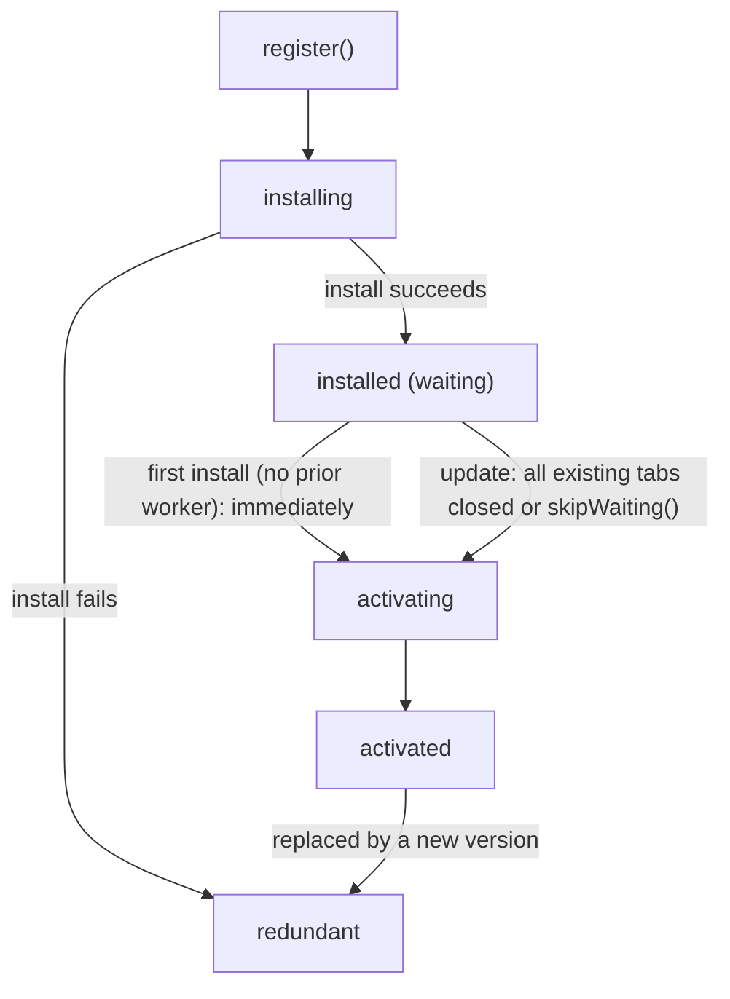

## Table of Contents

## The Cache Layer That Did Not Fit in the Book

The deploy went out yesterday, but users have been staring at the old screen for days. Refreshing does not help. On sites with a service worker, this symptom comes up often enough, and it is not a bug but a design decision. A new worker is built to stop in the waiting state even after it installs, and if you do not know why, you have nothing to offer beyond a note that says "try clearing your cache." Service worker caching is this kind of layer: too many parts spinning on their own for you to bolt it on after reading a few pages of documentation.

To be honest, I carried a small debt around this topic. In the recently published [Frontend Performance Optimization Deep Dive (published in Korean)](/2026/07/frontend-performance-deep-dive-is-out-now), I spent a whole chapter on browser caching, but among the three cache layers (browser cache, CDN cache, service worker cache), the service worker cache was the one I never managed to dig into deeply enough. Honestly, after writing about `Cache-Control` directives, filename hashing, Stale-While-Revalidate, and BFCache, the page count simply would not stretch any further. Then, after finishing the book, I turned this blog into a PWA and ended up designing that service worker caching myself, and I ran into several traps that reading documentation alone would never have revealed. This series is that record, and the story the book could not finish.

This post is that general theory. It first goes over what a service worker even is, takes a smallest possible 20-line service worker for a spin, and then organizes the rest through five questions I actually faced while building one. Where does the service worker stand? Why does the cache rot? Why am I seeing the old version after deploying? What goes in, under which strategy? And so, should you use it? If you can answer these questions, you can reach the starting line in any framework, and the framework-specific particulars ([Part 2](/2026/08/service-worker-caching-2)'s Next.js App Router application and GA4 field measurements) sit on top of them.

> Measurement note: the measurements in this post (storage accounting, worker startup time, error messages) were taken in a Chromium-based browser on macOS against this blog's production origin. Storage quotas and opaque padding sizes depend on the browser and the profile's state, so it is safer to read the order of magnitude than the absolute values.

## What Is a Service Worker: A Definition and the Smallest Example

A service worker is an event-driven worker script that the browser runs on a thread separate from the page[^1]. Once registered, it can intercept the network requests of every page within its scope, and it can answer an intercepted request with a response it constructs itself instead of the network. So calling it a proxy standing between the site and the network, one the developer can program, is closest to what it actually is. Offline support, web push, background sync, home-screen installable apps (PWA): every web feature that has to "work even when no page is open" stands on top of this worker.

This design has a history of failure behind it. AppCache (Application Cache), the web's first attempt at offline, was a model where you declared a list of things to cache in a manifest file and the browser handled the rest, and that "handled" turned out to be a pile of implicit rules that ran against developers' intent, so it was retired in infamy[^14]. The service worker is the product of that lesson. Instead of the browser performing magic, the developer decides entirely in code how each request is handled. The "you must design everything yourself" character we will keep meeting in this post was not an inconvenience but a design goal.

Code is faster than words. The smallest working service worker takes only two files. The page registers the worker,

```javascript
// Page (e.g. a layout or entry script)
if ('serviceWorker' in navigator) {
  navigator.serviceWorker.register('/sw.js')
}
```

and the worker file answers three events.

```javascript
// sw.js
const CACHE = 'mini-v1'

// 1. Install: pre-store the things to show even when offline
self.addEventListener('install', (event) => {
  event.waitUntil(
    caches.open(CACHE).then((cache) => cache.addAll(['/', '/offline.html'])),
  )
})

// 2. Activate: clean up caches from previous versions
self.addEventListener('activate', (event) => {
  event.waitUntil(
    caches
      .keys()
      .then((keys) =>
        Promise.all(
          keys.filter((key) => key !== CACHE).map((key) => caches.delete(key)),
        ),
      ),
  )
})

// 3. Intercept requests: if the network fails, fall back to the cache, and failing that, the offline page
self.addEventListener('fetch', (event) => {
  event.respondWith(
    fetch(event.request).catch(
      async () =>
        (await caches.match(event.request)) ?? caches.match('/offline.html'),
    ),
  )
})
```

Put this file at the site root, serve it on localhost, and it runs as is. Open the page once, shut down the local server, and refresh: you will see the page come up from the cache with no network at all (as we will cover later, shutting the server down is a more reliable check than DevTools' offline emulation). And these 20 lines are, in effect, a miniature of this entire series. All three parts are here: the precache in install, the version cleanup in activate, and the strategy in fetch, and the rest of this post is the work of digging into each of those three parts all the way down.

## Where Does the Service Worker Stand?

Starting with the first question. In the mini example the worker ran the moment it was registered, but nothing has been said yet about where exactly on the request path this worker stands and what it can do there. Three characteristics define this proxy's nature. First, **its lifetime is decoupled from the page.** The registration survives closing the tab, and when there are no events to handle, the browser terminates the worker and wakes it again when an event arrives. This termination and startup happen without giving the code any signal. State kept in global variables can therefore vanish at any time, and anything worth keeping must go into storage like Cache Storage or IndexedDB. The startup cost of waking a sleeping worker comes back in the last question. Second, **it cannot access the DOM.** It talks to the page only through `postMessage` (the "saved for offline" toast in Part 2 uses this channel). Third, **it cannot run just anywhere.** Because intercepting requests wholesale is a powerful privilege, it works only over HTTPS (plus localhost for development), and the scope is limited to paths under where the worker file sits (a server can lift that ceiling with the `Service-Worker-Allowed` header, but that is the default). The convention of placing it at the root, like `/sw.js`, comes from this.

Caching is built on top of the fetch event among these. Every request the page makes (documents, scripts, images, `fetch()` calls) arrives at the worker as a `FetchEvent`, and when the worker passes a Response (or a Promise resolving to one) to `event.respondWith()`, that response stands in for the network. A few rules apply. `respondWith()` must be called synchronously inside the event handler (call it from an async callback and the request has already gone to the network), and if you return without calling it, the request takes its original path as if the worker were not there. When classifying requests, the request object's metadata is useful beyond the URL. `request.mode === 'navigate'` means a navigation request that opens a document from the address bar or a link, and `request.destination` tells you what the request will be consumed as (`'image'`, `'script'`, `'style'`, `'font'`, and so on)[^2]. The router in Part 2 branches on these values.

The fetch event has one more companion tool. `event.waitUntil(promise)` is the device that holds on to the worker's lifetime. It declares to the browser that the worker must not be terminated until the promise you passed settles, even after the response has already been returned, so background work unrelated to the response (the path in Part 2 that returns an RSC response and then separately fetches and stores the HTML is exactly this) does not get cut off by idle termination. In the install and activate events the same method serves as the definition of "this phase is not finished yet," preventing the worker from moving on to installed before the precache is fully populated.

The same worker can also carry other capabilities like web push or background sync, but this series focuses on caching alone.

So how does this proxy relate to the existing HTTP cache? When you first encounter service worker caching it looks like a replacement for the HTTP cache, but in reality they are separate layers positioned at different points on the request path. The order in which the browser looks for a resource is as follows[^3].

1. **The service worker's fetch handler**: a registered service worker intercepts the request and answers from Cache Storage, or passes it on to the network.
2. **The HTTP cache**: if the service worker calls `fetch()` or does not intercept the request, the browser's HTTP cache operates according to its `Cache-Control` rules.
3. **The network**: if both miss, the request goes all the way to the server.

The important point here is that even a `fetch()` executed inside the service worker goes through the HTTP cache, unless you specify a cache mode like `cache: 'no-store'`. Writing a network-first strategy in the service worker does not mean every request reaches the server. If the HTTP cache holds a valid copy, that copy is returned. So when the expiration policies of the two layers disagree, you get problems that cannot be explained by looking at either side alone, like "I clearly deployed a new version, but the service worker keeps caching the old response." For example, on a site where the HTML carries `max-age=300`, a worker trying to refresh the HTML network-first will, for 5 minutes, receive the HTTP cache's copy instead of going to the network, believe it is "fresh," and store it again. The web.dev guide points at exactly this spot and recommends a setup where the service worker side gets the longer lifetime and the initiative, with the HTTP cache as the assistant[^3].

The difference in character between the two caches becomes clear in a table.

| Aspect           | HTTP cache                                          | Service worker cache (Cache Storage)                   |
| ---------------- | --------------------------------------------------- | ------------------------------------------------------ |
| Who controls it  | Server declares via headers, browser enforces       | Developer controls directly in code                    |
| Expiration       | Automatic TTL-based expiry via `max-age` and others | **No TTL**. Stays until code deletes it                |
| When it stores   | Stored automatically upon receiving a response      | Stored only when `cache.put()` is called               |
| Storage unit     | Browser manages per response                        | Request-response pairs in named buckets                |
| Offline          | Expired resources are unusable                      | Code decides, regardless of network state              |
| Cost of mistakes | Even a mistake recovers once the TTL passes         | Bad deployed code must be **actively recalled by you** |

## Why Does the Cache Rot?

The "Expiration" row of the table leads to the second question. Cache Storage, the storage backing this caching, holds requests (Request) as keys and responses (Response) as values. You open a named cache bucket with `caches.open(name)`, and one origin can hold multiple buckets. Splitting buckets by purpose lets you clean up bucket by bucket, and the design in Part 2 leans on this property. There are four basic operations[^4].

```javascript
const cache = await caches.open('pages-v1')

await cache.put(request, response) // store
await cache.addAll(['/offline', '/']) // fetch a list of URLs and store them in bulk (for precaching)
const hit = await cache.match(request) // look up (one bucket)
const anyHit = await caches.match(request) // look up (all buckets)
const keys = await cache.keys() // stored requests, insertion order guaranteed
await cache.delete(request) // delete an entry
await caches.delete('pages-v0') // delete a bucket wholesale (for version cleanup)
```

The matching rules for lookups are also worth knowing. By default, `match()` compares URLs exactly, query string included, and if the response carries a `Vary` header it also checks the corresponding request headers. Each of these defaults can be relaxed with an option: `ignoreSearch: true` ignores the query string, and `ignoreVary: true` turns off the `Vary` check. In situations where the query pollutes the cache key (the `?dpl=` in Part 2 is exactly that case), these options become your choices.

This storage has no TTL. What you `put()` stays until code deletes it, and everything the HTTP cache did for free (expiration, quota management, automatic recovery from mistakes) must now be designed by hand. I think this is the essence of service worker caching. No expiration and full control in code is power, but it also means that unless you design versioning and cleanup, the cache will rot, guaranteed. If even one asset changes its URL per deploy, the cache grows monotonically, and entries written by old logic break when new logic reads them.

Conversely, "no TTL" does not mean "permanent storage" either. When storage runs low, the browser can evict an origin's storage wholesale (Cache Storage included)[^5], and Safari deletes service worker registrations and caches after 7 days **of Safari use** without interaction with the site (counted in days the browser is actually used, not calendar days, and web apps added to the home screen keep their own counter and are not the intended target of this deletion)[^6]. There is a path to request persistence via `navigator.storage.persist()`, but the default is strictly best-effort storage. How much you are currently using can be checked with `navigator.storage.estimate()`. In short, this is a place that never cleans itself, yet can disappear entirely when needed. Both sides must go into the design.

There are also two traps on the handling side, and this time I reproduced them myself.

The first is stepped on by nearly everyone using it for the first time: **a Response body is a stream and can only be read once.** To return a network response through `respondWith()` while also putting it in the cache, you must take a copy for storage with `response.clone()`. Get the order wrong and you meet this error.

```
TypeError: Failed to execute 'text' on 'Response': body stream already read
```

The same holds on the `cache.put()` side: pass it an already-consumed (disturbed) body and the spec requires it to reject with a TypeError rather than let it slide[^4]. Whichever way the order gets tangled, it surfaces as an explicit error, so make it a rule that "the original response goes back to the network caller, and the clone goes into the cache" and you are safe.

The second is cross-origin resources. A response fetched with `mode: 'no-cors'` becomes an opaque response: its status reads 0 and its body cannot be inspected, yet it can be stored and reused. What makes a response opaque is not the absence of CORS headers on the server but the mode of the request. Even when the server does send `Access-Control-Allow-Origin`, a request made with `mode: 'no-cors'` still comes back opaque. The problem is twofold. First, code cannot distinguish success from failure. Even a 404 shows status 0 as opaque, so you end up caching a broken resource believing it is fine. Second, its storage footprint is accounted far larger than its actual size, because the browser adds padding to prevent cross-origin information from leaking through response sizes[^7]. Measuring it directly looks like this. From this blog's origin, I fetched a 104KB (106,346-byte) external image with `no-cors` and stored it, and the usage reported by `navigator.storage.estimate()` grew by **6,869,027 bytes (about 6.6MB)**. The padding is not proportional to the original size. Chromium adds a random value between zero and roughly 14.1 MB to each opaque response[^7], so a response of a few kilobytes can be accounted at that scale, and how much lands differs from one response to the next. The 6.6 MB above is one draw from that range. The profile had its quota set at 10GB, so there was room to spare, but it means a design that stacks up hundreds of opaque responses can reach gigabytes in accounting terms and pull eviction forward. That said, for an origin that allows CORS there is the option of fetching with `mode: 'cors'` (or the `crossorigin` attribute on an image tag) and storing that instead, in which case the response is not opaque and no padding gets added at all. What cannot be avoided is limited to origins that do not send CORS headers.

## Why Am I Seeing the Old Version After Deploying?

The symptom from the opening, and the third question. The answer lies in a deployment model unique to service workers: the lifecycle. After being registered with `register()`, a worker must pass through several states in order before it controls requests. The state transitions fit in one diagram.



Each state is tangible through `registration.installing`, `registration.waiting`, and `registration.active`, and transitions can be observed through an individual worker's `state` property and its `statechange` event[^1]. install is designed as the right moment to fill the precache, and activate as the right moment to clean up old caches. What lingers in the diagram's waiting state is only an update. A first install passes through installed (waiting) too, but with no prior active worker the Try Activate that runs right after installation calls Activate immediately, so it moves on to activation without stopping. One important detail sits here. A freshly registered worker, by default, **does not control pages that were already open** even after it becomes activated. Control begins with the next navigation, and if you want to pull it forward you must call `clients.claim()`. From the page's perspective, whether it is currently controlled is determined by whether `navigator.serviceWorker.controller` is null.

Updates ride this same state machine. On every navigation (and on functional events like push, if the last check was more than 24 hours ago), the browser checks the registered worker script for updates, and if even one byte differs it starts the new worker as installing[^8]. Here the problem emerges. Even after the new worker finishes installing, it **stays frozen in waiting** until every tab controlled by the existing worker is closed. It is a safety mechanism to keep old logic and new logic from mixing on one origin, but flipped around, it means a user who keeps a tab open and only refreshes can stay trapped under the old cache logic for days. A refresh keeps occupying the same tab, so it can never satisfy the "all tabs closed" condition. If you deployed and users are seeing the old version, this waiting is usually the cause.

The standard pattern for detecting a waiting new version from the page is also built from the lifecycle API. The "a new version is available" banner is this.

```javascript
const registration = await navigator.serviceWorker.register('/sw.js')

registration.addEventListener('updatefound', () => {
  const next = registration.installing
  next.addEventListener('statechange', () => {
    if (next.state === 'installed' && navigator.serviceWorker.controller) {
      // The new worker has arrived at waiting, and this page is controlled by the old worker
      showRefreshBanner()
    }
  })
})
```

The other half, what happens when the user clicks "refresh" on the banner, is also completed with the lifecycle API. It is a three-step circuit: ask the waiting worker via a message to skip its wait, then catch the moment control actually transfers with `controllerchange` and redraw the page.

```javascript
// Page: on banner click, ask the waiting worker
registration.waiting?.postMessage({type: 'SKIP_WAITING'})

// sw.js: skipWaiting only when asked
self.addEventListener('message', (event) => {
  if (event.data?.type === 'SKIP_WAITING') self.skipWaiting()
})

// Page: when the controlling worker changes, reload under the new logic
navigator.serviceWorker.addEventListener('controllerchange', () => {
  location.reload()
})
```

Unlike calling `skipWaiting()` unconditionally, this pattern defers the skip until after the user's consent. The user closes the window in which old HTML and new cache logic could mix, so you keep the waiting state's safety mechanism while also avoiding the "old version for days" problem.

There are two more rules worth knowing. The worker script itself bypasses the HTTP cache by default and is fetched fresh every time (the default `updateViaCache: 'imports'` allows caching only for importScripts targets). Even if you change it to use the cache, the spec nails down that for a registration whose last update check was more than 24 hours ago, the HTTP cache is bypassed[^8]. That means even a broken worker gets a replacement opportunity within a day at most, but flipped around, it also means broken code can preside over every request for a day. This is why service worker deployments call for unusual conservatism, and as an escape route for the worst case there is the known pattern of overwriting the same URL with a no-op worker that has no fetch handler, neutralizing the broken one (with a `Clear-Site-Data: storage` header as a supplement when storage has to go too)[^9]. Whether to leave the waiting in place or skip it with `skipWaiting()` is a decision that depends on the app's structure, so this blog's choice is covered in [Part 2](/2026/08/service-worker-caching-2).

The tools for fighting this lifecycle during development are gathered in the DevTools Application > Service Workers panel. "Update on reload" forcibly updates and activates the worker on every refresh, effectively pretending the waiting state does not exist, and "Bypass for network" bypasses the worker entirely. There is also something to watch out for in the opposite direction. A cache-ignoring refresh (hard reload) routes that request around the service worker, so "it works/breaks with a hard reload" is not evidence for verifying the worker. This is a layer where the tools themselves change the state, so verification you can trust ends up happening in a fresh incognito window or on a real device.

## What Goes in, Under Which Strategy?

If Cache Storage and the fetch event are the ingredients, strategies are the recipes. The fourth question resolves by asking two things of each resource: **is it acceptable for this to be shown stale**, and **what should happen when there is no network.** The Offline Cookbook lays the catalog out as eight serving suggestions[^10], but the ones that circulate by name in practice narrow down to about five[^11].

| Strategy               | Behavior                                           | Suited resources                                      | Cost                                 |
| ---------------------- | -------------------------------------------------- | ----------------------------------------------------- | ------------------------------------ |
| cache-first            | Cache first; on miss, fetch from network and store | Hash-stamped static assets, fonts, images             | Can go stale with no refresh signal  |
| network-first          | Network first; on failure, fall back to cache      | HTML, frequently changing APIs                        | Every request waits on the network   |
| stale-while-revalidate | Answer instantly from cache, refresh in background | Things allowed to be slightly stale (avatars, badges) | Shows a stale response once          |
| cache-only             | Ask only the cache                                 | Reserved for assets precached at install              | Fails outright when not in the cache |
| network-only           | Never touch the cache                              | Analytics, POST requests                              | No offline support                   |

The first three are short to implement. Still, even short code has four rules to keep. Avoid the clone trap from the previous section, check `response.ok` so failure responses are never stored (skip it and a 404 or 500 squats in the cache), keep lookups and stores on the same bucket (look up via the all-bucket `caches.match()` and splitting buckets loses its meaning, and a not-yet-cleaned old bucket may even match first), and detach the store with `event.waitUntil()` so it never holds the response back.

```javascript
async function cacheFirst(event, cacheName) {
  const cache = await caches.open(cacheName)
  const cached = await cache.match(event.request)
  if (cached) return cached
  const response = await fetch(event.request)
  if (response.ok) event.waitUntil(cache.put(event.request, response.clone()))
  return response
}

async function networkFirst(event, cacheName) {
  const cache = await caches.open(cacheName)
  try {
    const response = await fetch(event.request)
    if (response.ok) event.waitUntil(cache.put(event.request, response.clone()))
    return response
  } catch (error) {
    const cached = await cache.match(event.request)
    if (cached) return cached
    throw error
  }
}

async function staleWhileRevalidate(event, cacheName) {
  const cache = await caches.open(cacheName)
  const cached = await cache.match(event.request)
  const refresh = fetch(event.request).then((response) => {
    if (response.ok) event.waitUntil(cache.put(event.request, response.clone()))
    return response
  })
  event.waitUntil(refresh.catch(() => {}))
  return cached ?? refresh
}
```

It is no accident that all three take the whole event. Per the spec `cache.put()` only settles after it has read the response body to the end[^4], so awaiting the store and then returning the response means the browser receives it only once the whole body has come down. Put HTML through network-first that way and streaming parsing disappears entirely. So in all three strategies the store is detached with the `waitUntil` we saw earlier: the response goes back immediately, and the store rides on the worker's lifetime. staleWhileRevalidate has one more thing on top of that. Once the cache answers instantly, nobody awaits the refresh promise, so swallowing its failure with a catch to avoid an unhandled rejection, and handing that promise to `waitUntil` so idle termination cannot cut it off, is part of the same set.

Short code does not mean the failure modes are simple. Pointing at where each strategy goes wrong, one by one: cache-first has no refresh path at all, so applying it to a resource without a hash in its URL leaves a stale response that not even a deploy can fix (cleanup then falls to the versioning strategy discussed later). For network-first, the crux is the definition of "failure." `fetch()` rejects only when the connection cannot be made at all, and it does not fail in the connected-but-endlessly-slow state (lie-fi), so unless you build a variant that applies its own timeout and falls over to the cache, the experience is "infinite loading" even though an offline fallback exists. The cost of stale-while-revalidate is that there is no way to tell the user whether the background refresh succeeded. The screen has already been drawn with the stale version, and the fresh response only shows up on the next visit. For cache-only, precache list management is availability itself, so a resource missing from the list is an outage on the spot, and network-only is by definition a path where the worker contributes nothing, so it is better not to call `respondWith()` at all and let it pass through (because of the overhead we will see in the next question).

These five names are close to an industry lingua franca, so even if you end up using Workbox, you will meet classes with the same names (`CacheFirst`, `NetworkFirst`, `StaleWhileRevalidate`, `CacheOnly`, `NetworkOnly`)[^11]. stale-while-revalidate shares its name with the `Cache-Control: stale-while-revalidate` covered in the book's cache chapter, and that is no coincidence: it is the same idea. Serve the stale thing first and refresh behind it; the difference is whether you declare that idea in an HTTP header or enforce it yourself in worker code.

And these five are not the whole story. Real-world work is mostly combinations and variations of strategies. You attach an offline notice page as a fallback to network-first, or attach a second lookup to a cache-first miss that "looks for at least a similar cache entry." The "network-first + offline fallback" and "cache-first + variant fallback" in Part 2 are examples of exactly that, and the timeout fallback mentioned above is a variation of network-first.

## So, Should You Use It?

The last question remains. This layer carries distinct costs, and for most sites, the likely answer is that service worker caching is not needed.

The moment you register a fetch handler, every request on that origin routes through the service worker. If the worker was asleep, navigation must wait for it to wake, unless you use a mechanism like navigation preload. The time the worker inserts into the request path can be seen directly in resource timing. In the navigation entry of a page the worker controls, `fetchStart - workerStart` is that span. `workerStart` is stamped immediately before the fetch event is dispatched when the worker is already running, or immediately before the worker thread starts when it is not, so it covers startup only on a cold start and leaves just dispatch and handler entry when warm. Measured on this blog it is around 2ms in the warm state where the worker is alive. The problem is cold startup, and there is a measurement trap here. With DevTools attached, the worker is never idle-terminated, so you cannot reproduce a cold start while the developer tools are open. It is a cost that looks absent during development and shows up only for real users. The real-user size is confirmed in the field measurements of [Part 2](/2026/08/service-worker-caching-2), and to spoil it up front, this blog's returning-visitor TTFB with the worker in the path got worse by 525ms on average[^15].

Browser vendors take this cost seriously too. When the practice spread of adding an empty fetch handler that does nothing, just to satisfy PWA installability criteria, Chrome started showing a console warning from version 112, and the optimization that skips such handlers entirely became enabled by default in 115[^12]. That the browser built an explicit bypass tells you the size of the cost. The compensating mechanism is navigation preload[^13]. Enable it in activate, and the navigation request departs in parallel with worker startup, with the fetch handler receiving the result as `event.preloadResponse`.

```javascript
self.addEventListener('activate', (event) => {
  event.waitUntil(self.registration.navigationPreload?.enable())
})

self.addEventListener('fetch', (event) => {
  if (event.request.mode === 'navigate') {
    event.respondWith(
      (async () => (await event.preloadResponse) ?? fetch(event.request))(),
    )
  }
})
```

Instead of the startup time inserting itself before the request, it flows overlapped with the request, which makes this the standard remedy for offsetting the cold startup cost of network-first navigations.

Filename hashing, `Cache-Control`, and a CDN already solve most of repeat-visit performance. Doing just the material in the book's cache chapter properly is enough for most sites. Service worker caching earns its keep when offline is an actual requirement, when many of your users sit on unstable networks, or when you need a strategy the HTTP cache cannot express (like Part 2's RSC handling).

Pulling all of this together, the decision has two steps. First, if repeat-visit performance is your only goal, this layer is unlikely to be the answer. You would be rebuilding in code what the HTTP cache already does, while adding a worker detour to every request; in this blog's measurements, returning-visitor FCP improved by an average of 634ms while TTFB got worse by the 525ms mentioned above. A performance gain is not the reason to adopt this layer but one of its outcomes, and it arrives together with metrics that get worse. Second, if any of the three conditions applies and you decide to use it, the ways to keep the cost down are already in this post's answers: let requests you have no reason to intercept pass through without calling `respondWith()`, enable navigation preload for navigations, pick a strategy per resource with the two questions, design old-cache cleanup around versioned buckets, and put real-user metrics in place to compare before and after, before you deploy.

In the end, this layer is a trade: you take over, in code, the work the HTTP cache did for free, and in exchange you gain full control over the request path. The proxy position, the TTL-less storage, the waiting-by-default lifecycle, and the strategy chosen by two questions are the parts that stay the same in any framework; what differs is the shape of the requests that arrive on top. [Part 2](/2026/08/service-worker-caching-2) applies this general theory to a real blog on the Next.js App Router, covering the traps met along the way (soft navigation, prefetching, `next/image`) and the record of confirming the results with GA4 real-user data.

---

[^1]: [Service Worker API](https://developer.mozilla.org/en-US/docs/Web/API/Service_Worker_API), MDN. Outlines its nature as a proxy server, the lifetime and event model, the state property, and the HTTPS requirement.

[^2]: [FetchEvent](https://developer.mozilla.org/en-US/docs/Web/API/FetchEvent) and [Request.destination](https://developer.mozilla.org/en-US/docs/Web/API/Request/destination), MDN.

[^3]: [Service worker caching and HTTP caching](https://web.dev/articles/service-worker-caching-and-http-caching), web.dev. Covers the lookup order of the two cache layers and guidance for designing expiration policies.

[^4]: [Cache](https://developer.mozilla.org/en-US/docs/Web/API/Cache), MDN. Lists put/match/keys and outlines them. The match options (ignoreSearch, ignoreVary, and others) are documented in [Cache.match](https://developer.mozilla.org/en-US/docs/Web/API/Cache/match), and the guarantee that keys() returns insertion order ("The requests are returned in the same order that they were inserted.") in [Cache.keys](https://developer.mozilla.org/en-US/docs/Web/API/Cache/keys). The rule that a store completes only after the response body has been read to the end is defined in [the Cache.put algorithm in the spec](https://w3c.github.io/ServiceWorker/#cache-put).

[^5]: [Storage quotas and eviction criteria](https://developer.mozilla.org/en-US/docs/Web/API/Storage_API/Storage_quotas_and_eviction_criteria), MDN. Explains origin-level LRU eviction under storage pressure, stating that IndexedDB and Cache API data are deleted together.

[^6]: [Full Third-Party Cookie Blocking and More](https://webkit.org/blog/10218/full-third-party-cookie-blocking-and-more/), WebKit Blog. Describes the policy of deleting script-writable storage, including service worker registrations and caches, after 7 days without interaction.

[^7]: [storage/common/quota/padding_key.cc](https://chromium.googlesource.com/chromium/src/+/main/storage/common/quota/padding_key.cc), Chromium source. `ShouldPadResponseType()` selects opaque and opaqueRedirect responses for padding, and `ComputeRandomResponsePadding()` returns `raw_random % kPaddingRange`, where `kPaddingRange` is `14431 * 1024`, about 14.1 MB. It exists to keep response sizes from leaking cross-origin responses.

[^8]: [The update algorithm in the Service Worker spec](https://w3c.github.io/ServiceWorker/#update-algorithm). Defines the rule that the HTTP cache is bypassed when the registration is stale (more than 24 hours since the last update check). For the `updateViaCache` option itself, see [MDN's register() documentation](https://developer.mozilla.org/en-US/docs/Web/API/ServiceWorkerContainer/register).

[^9]: [Removing buggy service workers](https://developer.chrome.com/docs/workbox/remove-buggy-service-workers), Chrome for Developers. Describes the procedure of deploying a no-op worker with no fetch handler at the same URL to neutralize a broken one, and the `Clear-Site-Data` header as a supplementary measure.

[^10]: [The Offline Cookbook](https://web.dev/articles/offline-cookbook), web.dev (Jake Archibald). The document that serves as the standard catalog of caching strategies.

[^11]: [workbox-strategies](https://developer.chrome.com/docs/workbox/modules/workbox-strategies), Chrome for Developers. The five strategies are provided as classes under the same names.

[^12]: [Intent to Ship: Skip service worker no-op fetch handler](https://groups.google.com/a/chromium.org/g/blink-dev/c/tEFS0BH8UmE), blink-dev. Explains the background of the console warning from Chrome 112 and the no-op handler skip optimization. The version in which the optimization became enabled by default is listed as 115 in the [Chrome Platform Status entry](https://chromestatus.com/feature/5136946693668864).

[^13]: [NavigationPreloadManager](https://developer.mozilla.org/en-US/docs/Web/API/NavigationPreloadManager), MDN.

[^14]: [Application Cache is a Douchebag](https://alistapart.com/article/application-cache-is-a-douchebag/), Jake Archibald, A List Apart (2012). The article that laid out how AppCache's implicit rules betray developers' intent, and that came to symbolize the API's retirement.

[^15]: This average is mostly the work of the tail. 70% of the gap comes from the top 10% while the median moves by 134ms, and 26 events with a TTFB over 10 seconds (1.4% of the sample) account for 57% of the average gap on their own. [Part 3](/2026/08/service-worker-caching-3) reads this number again.
