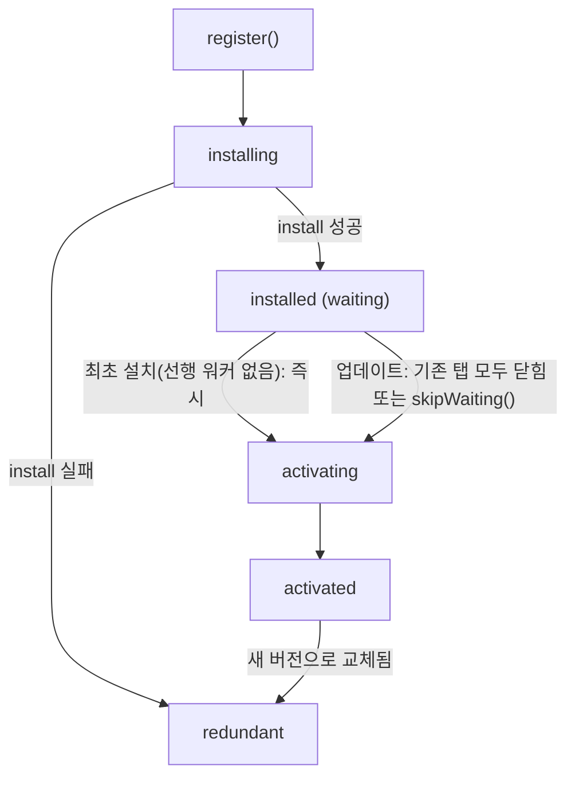

## Table of Contents

## 책에 넣지 못한 캐시 한 층

배포는 어제 나갔는데 사용자는 며칠째 옛 화면을 보고 있다. 새로고침을 해도 그대로다. 서비스 워커가 있는 사이트에서 심심찮게 겪는 이 증상은 버그가 아니라 설계다. 새 워커는 설치되고도 대기 상태에 멈춰 있도록 만들어져 있고, 그 이유를 모르면 "캐시를 지워보세요"라는 안내문 말고는 손에 쥔 것이 없게 된다. 서비스 워커 캐싱은 이런 식으로, 문서 몇 장 읽고 붙이기에는 혼자 도는 부품이 많은 레이어다.

사실 이 주제에는 약간의 부채 의식이 있었다. 얼마 전 출간한 [『프런트엔드 성능 최적화 Deep Dive』](/2026/07/frontend-performance-deep-dive-is-out-now)에서 브라우저 캐시를 한 장에 걸쳐 다뤘지만, 캐시의 세 레이어(브라우저 캐시, CDN 캐시, 서비스 워커 캐시) 중 서비스 워커 캐시만큼은 끝내 충분히 파고들지 못했다. 솔직히 말하면 `Cache-Control` 지시어, 파일명 해싱, Stale-While-Revalidate, BFCache까지 쓰고 나니 분량을 더는 감당할 수 없었다. 그러다 책을 마무리하고 이 블로그를 PWA로 만들면서 그 서비스 워커 캐싱을 직접 설계할 일이 생겼고, 문서만 읽어서는 알 수 없었던 함정들을 여럿 만났다. 이 시리즈는 그 기록이자, 책에서 못 다한 이야기다.

이번 편은 그 일반론이다. 서비스 워커가 무엇인지부터 짚고, 20줄짜리 가장 작은 서비스 워커를 하나 굴려본 다음, 직접 만들며 실제로 마주쳤던 다섯 개의 질문으로 나머지를 정리한다. 서비스 워커는 어디에 서 있는가. 캐시는 왜 썩는가. 배포했는데 왜 옛 버전이 보이는가. 무엇을 어떤 전략으로 담는가. 그래서 이걸 써야 하는가. 이 질문들에 답할 수 있으면 어느 프레임워크에서든 출발선에 설 수 있고, 프레임워크가 만드는 각론([2편](/2026/08/service-worker-caching-2)의 Next.js App Router 적용기와 GA4 실측)은 그 위에 얹힌다.

> 측정 노트: 이 글의 실측(스토리지 계상, 워커 기동 시간, 에러 메시지)은 macOS의 Chromium 계열 브라우저에서 이 블로그의 프로덕션 오리진을 대상으로 잰 값이다. 스토리지 쿼터와 opaque 패딩 크기는 브라우저와 프로필 상태를 타므로, 절대값보다 자릿수를 보는 것이 안전하다.

## 서비스 워커란 무엇인가: 정의와 가장 작은 예제

서비스 워커는 브라우저가 페이지와 별도의 스레드에서 실행하는 이벤트 기반 워커 스크립트다[^1]. 한 번 등록되면 자신의 범위(scope) 안에 있는 모든 페이지의 네트워크 요청을 가로챌 수 있고, 가로챈 요청에 네트워크 대신 직접 만든 응답을 돌려줄 수도 있다. 그래서 사이트와 네트워크 사이에 선, 개발자가 프로그래밍할 수 있는 프록시라고 부르는 것이 실체에 가깝다. 오프라인 지원, 웹 푸시, 백그라운드 동기화, 홈 화면 설치형 앱(PWA)까지, "페이지가 떠 있지 않아도 동작해야 하는" 웹 기능들이 전부 이 워커 위에 서 있다.

이 설계에는 앞서 실패한 역사가 있다. 오프라인 웹의 첫 시도였던 AppCache(Application Cache)는 매니페스트 파일에 캐시할 목록을 선언하면 나머지를 브라우저가 알아서 하는 모델이었는데, 그 "알아서"가 개발자의 의도와 어긋나는 암묵적 규칙투성이라 악명 속에 폐기됐다[^14]. 서비스 워커는 그 교훈의 산물이다. 브라우저가 마법을 부리는 대신, 요청을 어떻게 처리할지를 개발자가 코드로 전부 결정한다. 이 글에서 계속 만나게 될 "전부 직접 설계해야 한다"는 성질은 불편이 아니라 설계 목표였던 셈이다.

말보다 코드가 빠르다. 동작하는 가장 작은 서비스 워커는 파일 두 개면 된다. 페이지 쪽에서 워커를 등록하고,

```javascript
// 페이지 (예: 레이아웃이나 엔트리 스크립트)
if ('serviceWorker' in navigator) {
  navigator.serviceWorker.register('/sw.js')
}
```

워커 파일이 세 이벤트에 답한다.

```javascript
// sw.js
const CACHE = 'mini-v1'

// 1. 설치: 오프라인에서도 보여줄 것들을 미리 담는다
self.addEventListener('install', (event) => {
  event.waitUntil(
    caches.open(CACHE).then((cache) => cache.addAll(['/', '/offline.html'])),
  )
})

// 2. 활성화: 이전 버전의 캐시를 청소한다
self.addEventListener('activate', (event) => {
  event.waitUntil(
    caches
      .keys()
      .then((keys) =>
        Promise.all(
          keys.filter((key) => key !== CACHE).map((key) => caches.delete(key)),
        ),
      ),
  )
})

// 3. 요청 가로채기: 네트워크가 실패하면 캐시로, 그것도 없으면 오프라인 페이지로
self.addEventListener('fetch', (event) => {
  event.respondWith(
    fetch(event.request).catch(
      async () =>
        (await caches.match(event.request)) ?? caches.match('/offline.html'),
    ),
  )
})
```

이 파일을 사이트 루트에 두고 localhost에서 서빙하면 그대로 돈다. 페이지를 한 번 연 뒤 로컬 서버를 끄고 새로고침해 보면, 네트워크 없이 캐시에서 페이지가 뜨는 것을 확인할 수 있다(뒤에서 다루겠지만, DevTools의 오프라인 에뮬레이션보다 서버를 끄는 쪽이 정직한 확인법이다). 그리고 이 20줄이 사실상 이 시리즈 전체의 축소판이다. install의 프리캐시, activate의 버전 청소, fetch의 전략이라는 세 부품이 전부 들어 있고, 이 글의 나머지는 이 세 부품을 각각 끝까지 파고드는 일이다.

## 서비스 워커는 어디에 서 있는가

첫 질문부터. 미니 예제에서 워커는 등록만 하면 돌았지만, 이 워커가 요청 경로의 정확히 어디에 서서 무엇을 할 수 있는지는 아직 말하지 않았다. 이 프록시의 성격을 규정하는 특징이 셋 있다. 첫째, **페이지와 수명이 분리되어 있다.** 탭을 닫아도 등록은 남고, 처리할 이벤트가 없으면 브라우저가 워커를 종료했다가 이벤트가 오면 다시 깨운다. 이 종료와 기동은 코드에 아무 신호도 주지 않고 일어난다. 그래서 전역 변수에 담아둔 상태는 언제든 사라질 수 있고, 남겨야 할 것은 Cache Storage나 IndexedDB 같은 저장소에 두어야 한다. 잠든 워커를 깨우는 기동 비용은 마지막 질문에서 다시 만난다. 둘째, **DOM에 접근할 수 없다.** 페이지와는 `postMessage`로만 대화한다(2편에 나오는 "오프라인에 저장됨" 토스트가 이 통로를 쓴다). 셋째, **아무 데서나 돌 수 없다.** 요청을 통째로 가로채는 강력한 권한이라 HTTPS(그리고 개발용 localhost)에서만 동작하고, scope는 워커 파일이 놓인 경로 아래로 제한된다(서버가 `Service-Worker-Allowed` 헤더로 상한을 풀어줄 수는 있지만 기본값이 그렇다). `/sw.js`처럼 루트에 두는 관례가 여기서 나온다.

캐싱은 이 중 fetch 이벤트 위에 세워진다. 페이지가 만드는 모든 요청(문서, 스크립트, 이미지, `fetch()` 호출)이 `FetchEvent`로 워커에 도착하고, 워커가 `event.respondWith()`에 Response(또는 그것으로 resolve되는 Promise)를 넘기면 그 응답이 네트워크를 대신한다. 몇 가지 규칙이 있다. `respondWith()`는 이벤트 핸들러 안에서 동기적으로 불러야 하고(비동기 콜백에서 부르면 이미 네트워크로 넘어간 뒤다), 부르지 않고 리턴하면 요청은 워커가 없던 것처럼 원래 경로를 탄다. 요청을 분류할 때는 URL 외에 요청 객체의 메타데이터가 유용하다. `request.mode === 'navigate'`는 주소창 진입이나 링크로 문서를 여는 내비게이션 요청이라는 뜻이고, `request.destination`은 그 요청이 무엇으로 소비될지(`'image'`, `'script'`, `'style'`, `'font'` 등)를 알려준다[^2]. 2편의 라우터가 이 값들로 분기한다.

fetch 이벤트에는 짝이 되는 도구가 하나 더 있다. `event.waitUntil(promise)`는 워커의 수명을 붙잡아 두는 장치다. 응답을 이미 돌려준 뒤에도 넘긴 promise가 끝날 때까지 브라우저에게 워커를 종료하지 말라고 선언하는 것으로, 응답과 무관한 백그라운드 작업(2편에서 RSC 응답을 돌려준 뒤 HTML을 따로 받아 저장하는 경로가 정확히 이것이다)이 유휴 종료에 잘리지 않게 해준다. install과 activate 이벤트에서도 같은 메서드가 "이 단계가 아직 안 끝났다"의 기준이 되어, 프리캐시가 다 차기 전에 워커가 installed로 넘어가는 것을 막는다.

같은 워커에 웹 푸시나 백그라운드 동기화 같은 다른 능력도 실을 수 있지만, 이 시리즈는 캐싱에만 집중한다.

그렇다면 이 프록시는 기존의 HTTP 캐시와 어떤 관계인가. 서비스 워커 캐싱을 처음 접하면 HTTP 캐시의 대체재처럼 보이지만, 실제로는 요청 경로에서 서로 다른 위치에 놓인 별개의 레이어다. 브라우저가 리소스를 찾는 순서는 다음과 같다[^3].

1. **서비스 워커의 fetch 핸들러**: 등록된 서비스 워커가 요청을 가로채 Cache Storage에서 응답하거나, 네트워크로 넘긴다.
2. **HTTP 캐시**: 서비스 워커가 `fetch()`를 부르거나 요청을 가로채지 않으면, 브라우저의 HTTP 캐시가 `Cache-Control` 규칙대로 동작한다.
3. **네트워크**: 둘 다 놓치면 서버까지 간다.

여기서 중요한 것은 서비스 워커 안에서 실행한 `fetch()`도, `cache: 'no-store'` 같은 캐시 모드를 명시하지 않는 한 HTTP 캐시를 통과한다는 점이다. 서비스 워커에서 network-first 전략을 짰다고 해서 항상 서버까지 가는 것이 아니다. HTTP 캐시에 유효한 사본이 있으면 그것이 반환된다. 그래서 두 레이어의 만료 정책이 어긋나면 "분명 새로 배포했는데 서비스 워커가 옛날 응답을 캐시하는" 식의, 어느 한쪽만 봐서는 설명되지 않는 문제가 생긴다. 예를 들어 HTML에 `max-age=300`이 붙어 있는 사이트에서 워커가 network-first로 HTML을 갱신하려 하면, 5분 동안은 네트워크에 가는 대신 HTTP 캐시의 사본을 받아 와서 "최신"이라고 믿고 다시 저장하게 된다. web.dev의 가이드도 이 지점을 지적하면서, 서비스 워커 쪽에 더 긴 유효 기간과 주도권을 주고 HTTP 캐시를 보조로 두는 구성을 권한다[^3].

두 캐시의 성격 차이는 표로 정리하면 명확하다.

| 구분        | HTTP 캐시                           | 서비스 워커 캐시 (Cache Storage)            |
| ----------- | ----------------------------------- | ------------------------------------------- |
| 제어 주체   | 서버가 헤더로 선언, 브라우저가 집행 | 개발자가 코드로 직접 제어                   |
| 만료        | `max-age` 등 TTL 기반 자동 만료     | **TTL 없음**. 코드로 지우기 전까지 유지     |
| 저장 시점   | 응답을 받으면 자동 저장             | `cache.put()`을 불러야 저장                 |
| 저장 단위   | 브라우저가 응답별로 관리            | 이름 붙은 버킷에 요청-응답 쌍으로           |
| 오프라인    | 만료된 리소스는 사용 불가           | 네트워크 상태와 무관하게 코드가 결정        |
| 실수의 대가 | 잘못돼도 TTL이 지나면 회복          | 잘못된 코드가 배포되면 **직접 회수해야 함** |

## 캐시는 왜 썩는가

표의 "만료" 줄이 두 번째 질문으로 이어진다. 캐싱의 저장소가 되는 Cache Storage는 요청(Request)을 키로, 응답(Response)을 값으로 담는 저장소다. `caches.open(이름)`으로 이름 붙은 캐시 버킷을 열고, 한 오리진에 버킷을 여러 개 둘 수 있다. 용도별로 버킷을 나누면 청소를 버킷 단위로 할 수 있게 되는데, 2편의 설계가 이 성질에 기댄다. 기본 조작은 넷이다[^4].

```javascript
const cache = await caches.open('pages-v1')

await cache.put(request, response) // 저장
await cache.addAll(['/offline', '/']) // URL 목록을 받아와 일괄 저장 (프리캐시용)
const hit = await cache.match(request) // 조회 (버킷 하나)
const anyHit = await caches.match(request) // 조회 (모든 버킷)
const keys = await cache.keys() // 저장된 요청 목록, 삽입 순서 보장
await cache.delete(request) // 엔트리 삭제
await caches.delete('pages-v0') // 버킷 통째로 삭제 (버전 청소용)
```

조회의 매칭 규칙도 알아둘 가치가 있다. `match()`는 기본적으로 URL을 쿼리 스트링까지 포함해 정확히 비교하고, 응답에 `Vary` 헤더가 있으면 해당 요청 헤더까지 대조한다. 이 기본값은 옵션으로 하나씩 풀 수 있다. `ignoreSearch: true`는 쿼리 스트링을 무시하고, `ignoreVary: true`는 `Vary` 대조를 끈다. 쿼리가 캐시 키를 오염시키는 상황(2편의 `?dpl=`이 정확히 이 사례다)에서 이 옵션들이 선택지가 된다.

이 저장소에는 TTL이 없다. `put()`으로 넣은 것은 코드로 지우기 전까지 그대로 있고, HTTP 캐시가 공짜로 해주던 일들(만료, 용량 관리, 실수로부터의 자동 회복)을 전부 직접 설계해야 한다. 이것이 서비스 워커 캐싱의 본질이라고 생각한다. 만료가 없고 모든 것을 코드로 제어한다는 것은 강력함인 동시에, 버전 관리와 청소를 설계하지 않으면 캐시가 반드시 썩는다는 뜻이다. 배포마다 URL이 바뀌는 자산이 하나라도 있으면 캐시는 단조 증가하고, 옛 로직이 만든 엔트리는 새 로직이 읽다가 깨진다.

거꾸로 "TTL이 없다"가 "영구 저장"이라는 뜻도 아니다. 저장 공간이 부족해지면 브라우저는 origin 단위로 저장소를 통째로 축출할 수 있고(Cache Storage 포함)[^5], Safari는 사이트와 상호작용 없이 **Safari를 사용한 날 기준** 7일이 지나면 서비스 워커 등록과 캐시를 지운다(달력 7일이 아니라 사용일로 세고, 홈 화면에 추가된 웹앱은 별도 카운터를 가져 이 삭제의 의도 대상이 아니다)[^6]. `navigator.storage.persist()`로 영속을 요청하는 길이 있지만, 기본값은 어디까지나 best-effort 저장이다. 지금 얼마나 쓰고 있는지는 `navigator.storage.estimate()`로 확인할 수 있다. 요약하면 이 저장소는 스스로 청소하지 않으면서, 필요하면 통째로 사라질 수는 있는 곳이다. 양쪽 모두를 설계에 넣어야 한다.

다루는 쪽의 함정도 둘 있는데, 이번에는 재현까지 해봤다.

첫 번째는 처음 쓰는 사람 대부분이 밟는 것으로, **Response의 바디는 스트림이라 한 번만 읽을 수 있다.** 네트워크에서 받은 응답을 `respondWith()`로 돌려주면서 캐시에도 넣으려면, 저장용 사본을 `response.clone()`으로 떠야 한다. 순서를 놓치면 이런 에러를 만난다.

```
TypeError: Failed to execute 'text' on 'Response': body stream already read
```

`cache.put()` 쪽도 마찬가지로, 이미 소비된(disturbed) 바디를 넘기면 조용히 넘어가는 것이 아니라 TypeError로 거부하도록 스펙에 못 박혀 있다[^4]. 어느 경로로 순서가 꼬이든 명시적인 에러로 나타난다는 뜻이니, "네트워크 응답은 원본을 돌려주고, 캐시에는 clone을 넣는다"를 규칙으로 삼으면 안전하다.

두 번째는 교차 출처 리소스다. `mode: 'no-cors'`로 가져온 응답은 opaque 응답이 되는데, status가 0으로 보이고 바디를 들여다볼 수 없지만 저장과 재사용은 가능하다. 응답을 opaque로 만드는 것은 서버에 CORS 헤더가 없어서가 아니라 요청의 mode다. 서버가 `Access-Control-Allow-Origin`을 보내주더라도 `mode: 'no-cors'`로 요청하면 응답은 여전히 opaque다. 문제는 두 가지다. 우선 성공인지 실패인지 코드로 구분할 수 없다. 404 응답도 opaque로는 status 0이라, 깨진 리소스를 정상인 줄 알고 캐시하게 된다. 다음으로 저장 용량이 실제 크기보다 훨씬 크게 계상된다. 응답 크기를 통해 교차 출처 정보가 새는 것을 막으려고 브라우저가 패딩을 더하기 때문이다[^7]. 직접 재보면 이렇다. 이 블로그의 오리진에서 104KB(106,346바이트)짜리 외부 이미지를 `no-cors`로 받아 저장했더니, `navigator.storage.estimate()`의 usage가 **6,869,027바이트(약 6.6MB)** 늘었다. 패딩은 원본 크기에 비례하는 것이 아니라 응답 하나당 수 MB가 통째로 얹히는 형태라, 몇 KB짜리 응답을 저장해도 계상되는 크기는 비슷하다. 쿼터가 10GB로 잡힌 프로필이라 여유는 있지만, opaque 응답을 수백 개 쌓는 설계라면 계상 기준으로는 기가바이트 단위가 되어 축출을 앞당길 수 있다는 뜻이다. 다만 CORS를 허용하는 출처라면 `mode: 'cors'`로(이미지 태그라면 `crossorigin` 속성으로) 받아 저장하는 길이 있고, 이때는 응답이 opaque가 아니니 패딩 계상도 생기지 않는다. 피해 갈 수 없는 것은 CORS 헤더를 주지 않는 출처에 한정된다.

## 배포했는데 왜 옛 버전이 보이는가

서두의 증상, 세 번째 질문이다. 답은 서비스 워커에만 있는 배포 모델, 라이프사이클에 있다. 워커는 `register()`로 등록된 뒤 여러 상태를 순서대로 지나야 요청을 제어하게 된다. 상태 전이를 한 장으로 그리면 이렇다.



각 상태는 `registration.installing`, `registration.waiting`, `registration.active`로 손에 잡히고, 개별 워커의 `state` 속성과 `statechange` 이벤트로 전이를 관찰할 수 있다[^1]. install은 프리캐시를 채우기에, activate는 옛 캐시를 청소하기에 알맞은 시점으로 설계되어 있다. 다이어그램의 대기(waiting)는 업데이트에만 해당하는 상태로, 선행 active 워커가 없는 최초 설치는 설치가 끝나면 대기 없이 곧장 활성화된다. 여기에 중요한 디테일이 하나 있다. 처음 등록된 워커는 activated가 된 뒤에도 기본적으로 **이미 열려 있던 페이지는 제어하지 않는다.** 제어는 다음 내비게이션부터 시작되고, 당겨오고 싶다면 `clients.claim()`을 불러야 한다. 페이지 입장에서 지금 제어받고 있는지는 `navigator.serviceWorker.controller`가 null인지로 판별한다.

업데이트도 이 상태 기계를 그대로 탄다. 브라우저는 내비게이션 때마다(그리고 push 같은 기능 이벤트에서도 마지막 확인이 24시간을 넘겼다면) 등록된 워커 스크립트의 업데이트를 확인하고, 바이트가 하나라도 다르면 새 워커를 installing으로 띄운다[^8]. 여기서 문제가 나온다. 새 워커는 설치를 마쳐도, 기존 워커가 제어하는 탭이 모두 닫히기 전까지 **waiting에 멈춰 있다.** 옛 로직과 새 로직이 한 오리진에서 섞이지 않게 하려는 안전장치인데, 뒤집으면 탭을 계속 열어두고 새로고침만 하는 사용자는 며칠이고 옛 캐시 로직에 붙잡혀 있을 수 있다는 뜻이다. 새로고침은 같은 탭을 계속 점유하므로 "탭이 모두 닫히는" 조건을 영원히 만들지 못한다. 배포를 했는데 사용자가 옛 버전을 보고 있다면 대개 이 대기가 원인이다.

대기 중인 새 버전을 페이지에서 감지하는 표준 패턴도 라이프사이클 API로 만든다. "새 버전이 있습니다" 배너가 이것이다.

```javascript
const registration = await navigator.serviceWorker.register('/sw.js')

registration.addEventListener('updatefound', () => {
  const next = registration.installing
  next.addEventListener('statechange', () => {
    if (next.state === 'installed' && navigator.serviceWorker.controller) {
      // 새 워커가 waiting에 도착했고, 지금 페이지는 옛 워커가 제어 중이다
      showRefreshBanner()
    }
  })
})
```

배너에서 "새로고침"을 눌렀을 때의 나머지 절반도 라이프사이클 API로 완성된다. waiting 워커에게 메시지로 대기를 건너뛰라고 요청하고, 제어권이 실제로 넘어온 순간을 `controllerchange`로 받아 페이지를 다시 그리는 3단 회로다.

```javascript
// 페이지: 배너 클릭 시 waiting 워커에게 요청
registration.waiting?.postMessage({type: 'SKIP_WAITING'})

// sw.js: 요청을 받으면 그때 skipWaiting
self.addEventListener('message', (event) => {
  if (event.data?.type === 'SKIP_WAITING') self.skipWaiting()
})

// 페이지: 제어 워커가 바뀌면 새 로직 기준으로 리로드
navigator.serviceWorker.addEventListener('controllerchange', () => {
  location.reload()
})
```

무조건 `skipWaiting()`을 부르는 것과 달리, 이 패턴은 건너뛰는 시점을 사용자의 동의 뒤로 미룬다. 옛 HTML과 새 캐시 로직이 섞이는 창을 사용자가 스스로 닫게 하는 셈이라, 대기의 안전장치를 유지하면서 "며칠째 옛 버전" 문제도 피할 수 있다.

알아둘 규칙이 둘 더 있다. 워커 스크립트 자체는 기본적으로 HTTP 캐시를 우회해서 매번 새로 받아온다(기본값 `updateViaCache: 'imports'`는 importScripts 대상에만 캐시를 허용한다). 캐시를 쓰도록 바꾸더라도, 마지막 업데이트 확인 후 24시간이 지난 등록에 대해서는 HTTP 캐시를 우회하도록 스펙에 못 박혀 있다[^8]. 잘못된 워커가 배포돼도 최대 하루 안에는 교체 기회가 온다는 뜻인데, 뒤집어 말하면 하루 동안은 잘못된 코드가 모든 요청을 주무를 수 있다는 뜻이기도 하다. 서비스 워커 배포에 유독 보수적이어야 하는 이유이고, 최악의 경우를 대비해 캐시를 비우고 스스로 등록 해제하는, 이른바 kill switch 워커를 배포하는 탈출로도 알려져 있다[^9]. 대기를 그대로 둘지 `skipWaiting()`으로 건너뛸지는 앱의 구조에 따라 갈리는 결정이라, 이 블로그의 선택은 [2편](/2026/08/service-worker-caching-2)에서 다룬다.

개발 중에 이 라이프사이클과 싸우는 도구는 DevTools의 Application > Service Workers 패널에 모여 있다. "Update on reload"는 새로고침마다 워커를 강제로 갱신하고 활성화해 대기를 없는 셈 치게 해주고, "Bypass for network"는 워커를 통째로 우회한다. 반대로 조심할 것도 있다. 캐시 무시 새로고침(hard reload)은 그 요청을 서비스 워커 밖으로 우회시키므로, "하드 리로드로 해보니 된다/안 된다"는 워커 검증의 근거가 되지 못한다. 도구가 상태를 바꿔버리는 레이어라서, 정직한 검증은 결국 시크릿 창을 새로 열거나 실제 기기에서 하게 된다.

## 무엇을 어떤 전략으로 담는가

Cache Storage와 fetch 이벤트가 재료라면, 전략은 조리법이다. 네 번째 질문은 리소스마다 두 가지를 되물으면 풀린다. **낡은 채로 보여도 되는가**, 그리고 **네트워크가 없을 때 어떻게 되어야 하는가.** 이름 붙은 전략은 대체로 다섯 가지로 정리된다[^10].

| 전략                   | 동작                                     | 어울리는 리소스                   | 대가                        |
| ---------------------- | ---------------------------------------- | --------------------------------- | --------------------------- |
| cache-first            | 캐시 먼저, 없으면 네트워크에서 받아 저장 | 해시 박힌 정적 자산, 폰트, 이미지 | 갱신 신호 없이 낡을 수 있음 |
| network-first          | 네트워크 먼저, 실패하면 캐시             | HTML, 자주 바뀌는 API             | 매 요청이 네트워크를 기다림 |
| stale-while-revalidate | 캐시로 즉답하고 백그라운드에서 갱신      | 조금 낡아도 되는 것(아바타, 배지) | 한 번은 낡은 응답을 보여줌  |
| cache-only             | 캐시에만 묻는다                          | install 때 넣어둔 프리캐시 전용   | 캐시에 없으면 그대로 실패   |
| network-only           | 캐시를 아예 쓰지 않는다                  | 애널리틱스, POST 요청             | 오프라인 지원 없음          |

앞의 셋은 구현도 짧다. 다만 짧은 코드에도 지킬 규칙이 넷 있다. 앞 절의 clone 함정을 피하는 것, 실패 응답을 저장하지 않도록 `response.ok`를 확인하는 것(빼먹으면 404나 500이 캐시에 눌러앉는다), 조회와 저장을 같은 버킷으로 맞추는 것(전 버킷을 뒤지는 `caches.match()`로 조회하면 버킷을 나눈 의미가 사라지고, 청소 전의 옛 버킷이 먼저 걸릴 수도 있다), 그리고 저장을 `event.waitUntil()`로 떼어 응답을 붙들지 않는 것이다.

```javascript
async function cacheFirst(event, cacheName) {
  const cache = await caches.open(cacheName)
  const cached = await cache.match(event.request)
  if (cached) return cached
  const response = await fetch(event.request)
  if (response.ok) event.waitUntil(cache.put(event.request, response.clone()))
  return response
}

async function networkFirst(event, cacheName) {
  const cache = await caches.open(cacheName)
  try {
    const response = await fetch(event.request)
    if (response.ok) event.waitUntil(cache.put(event.request, response.clone()))
    return response
  } catch (error) {
    const cached = await cache.match(event.request)
    if (cached) return cached
    throw error
  }
}

async function staleWhileRevalidate(event, cacheName) {
  const cache = await caches.open(cacheName)
  const cached = await cache.match(event.request)
  const refresh = fetch(event.request).then((response) => {
    if (response.ok) event.waitUntil(cache.put(event.request, response.clone()))
    return response
  })
  event.waitUntil(refresh.catch(() => {}))
  return cached ?? refresh
}
```

세 함수가 모두 event를 받는 것은 우연이 아니다. `cache.put()`은 스펙상 응답 바디를 끝까지 읽은 뒤에야 끝나므로[^4], 저장을 `await`로 기다린 다음 응답을 돌려주면 브라우저는 본문이 전부 내려온 뒤에야 그 응답을 받는다. HTML을 network-first로 처리한다면 스트리밍 파싱이 통째로 사라지는 셈이다. 그래서 세 전략 모두 저장은 앞에서 본 `waitUntil`로 떼어, 응답은 곧바로 돌려주고 저장은 워커의 수명에 얹는다. staleWhileRevalidate에는 여기에 하나가 더 붙는다. 캐시로 즉답하고 나면 갱신 promise를 아무도 기다리지 않으므로, 갱신 fetch가 실패했을 때 unhandled rejection이 되지 않게 catch로 삼키고 그 promise를 `waitUntil`에 넘겨 유휴 종료에 잘리지 않게 하는 것까지가 한 세트다.

코드가 짧다고 실패 모드까지 단순한 것은 아니다. 각 전략이 어긋나는 지점을 하나씩 짚으면 이렇다. cache-first는 갱신 경로가 아예 없으므로, URL에 해시가 없는 리소스에 걸면 배포로도 못 고치는 낡은 응답이 남는다(청소는 뒤의 버전 전략 몫이 된다). network-first는 "실패"의 정의가 관건이다. `fetch()`는 연결이 아예 안 될 때만 reject하고, 연결은 되는데 하염없이 느린 상태(lie-fi)에서는 실패하지 않으므로, 타임아웃을 직접 걸어 캐시로 넘어가는 변형을 만들지 않으면 오프라인 폴백이 있어도 체감은 "무한 로딩"이 된다. stale-while-revalidate의 대가는 백그라운드 갱신이 성공했는지 사용자에게 알릴 방법이 없다는 것이다. 화면은 이미 낡은 버전으로 그려졌고, 새 응답은 다음 방문에야 보인다. cache-only는 프리캐시 목록 관리가 곧 가용성이라 목록에서 빠진 리소스가 바로 장애가 되고, network-only는 말 그대로 워커가 보태는 것이 없는 경로이니 애초에 `respondWith()`를 부르지 않고 통과시키는 편이 낫다(다음 질문에서 볼 오버헤드 때문이다).

이 다섯 이름은 업계 공용어에 가까워서, Workbox를 쓰게 되더라도 같은 이름의 클래스(`CacheFirst`, `NetworkFirst`, `StaleWhileRevalidate`, `CacheOnly`, `NetworkOnly`)를 그대로 만나게 된다[^11]. stale-while-revalidate는 책의 캐시 장에서 다룬 `Cache-Control: stale-while-revalidate`와 이름이 같은데, 우연이 아니라 같은 아이디어다. 낡은 것을 먼저 주고 뒤에서 갱신한다는 발상을 HTTP 헤더로 선언하느냐, 워커 코드로 직접 집행하느냐의 차이다.

그리고 이 다섯이 전부는 아니다. 실전은 대부분 전략의 조합과 변형이다. network-first에 오프라인 안내 페이지를 폴백으로 붙이고, cache-first 미스에 "비슷한 캐시라도 찾아보는" 2차 조회를 붙이는 식이다. 2편에 나오는 "network-first + 오프라인 폴백"과 "cache-first + 변형 폴백"이 그 예이고, 위에서 말한 타임아웃 폴백도 network-first의 변형이다.

## 그래서 이걸 써야 하는가

마지막 질문이 남는다. 이 레이어에는 뚜렷한 대가가 있고, 대부분의 사이트에는 서비스 워커 캐싱이 필요하지 않을 가능성이 높다.

fetch 핸들러를 등록하는 순간, 그 오리진의 모든 요청은 서비스 워커를 경유한다. 워커가 잠들어 있었다면, navigation preload 같은 장치를 쓰지 않는 한 깨어나는 시간까지 내비게이션이 기다려야 한다. 기동이 요청 경로에 끼어드는 시간은 리소스 타이밍으로 직접 볼 수 있다. 워커가 제어하는 페이지의 navigation entry에서 `fetchStart - workerStart`가 워커를 세우는 데 쓴 구간인데, 이 블로그에서 재보면 워커가 살아 있는 웜 상태에서는 2ms 안팎이다. 문제는 콜드 기동이고, 여기에 측정 함정이 하나 있다. DevTools가 붙어 있으면 워커가 유휴 종료되지 않아서, 개발자 도구를 열어둔 채로는 콜드 기동을 재현할 수 없다. 개발 중에는 빠져 보이다가 실사용자에게서만 나타나는 비용이라는 뜻이다. 실사용자 쪽 크기는 [2편](/2026/08/service-worker-caching-2)의 실측에서 확인하는데, 미리 말해두면 워커 경유가 끼어든 이 블로그의 재방문자 TTFB는 평균 525ms 나빠졌다[^15].

브라우저 개발사도 이 비용을 심각하게 여긴다. 한때 PWA 판정 조건을 맞추려고 아무 일도 하지 않는 빈 fetch 핸들러를 넣는 관행이 퍼지자, Chrome은 112부터 콘솔 경고를 띄웠고, 그런 핸들러를 아예 건너뛰는 최적화는 115에서 기본 활성화됐다[^12]. 브라우저가 명시적으로 우회로를 만들 만큼의 비용이라는 뜻이다. 보완 장치로는 navigation preload가 있다[^13]. activate에서 켜두면 내비게이션 요청을 워커 기동과 병렬로 먼저 출발시키고, fetch 핸들러는 그 결과를 `event.preloadResponse`로 받아 쓴다.

```javascript
self.addEventListener('activate', (event) => {
  event.waitUntil(self.registration.navigationPreload?.enable())
})

self.addEventListener('fetch', (event) => {
  if (event.request.mode === 'navigate') {
    event.respondWith(
      (async () => (await event.preloadResponse) ?? fetch(event.request))(),
    )
  }
})
```

기동 시간이 요청 앞에 끼어드는 대신 요청과 겹쳐 흐르게 되므로, network-first 내비게이션의 콜드 기동 비용을 상쇄하는 표준적인 해법이다.

파일명 해싱과 `Cache-Control`, CDN만으로 재방문 성능은 이미 상당 부분 해결된다. 책의 캐시 장에서 다룬 그 내용만 제대로 해도 대부분의 사이트는 충분하다. 서비스 워커 캐싱이 실질적인 값어치를 하는 것은 오프라인이라는 요구사항이 실제로 있거나, 네트워크가 불안정한 환경의 사용자가 많거나, HTTP 캐시로는 표현할 수 없는 전략(2편의 RSC 처리 같은)이 필요할 때다.

여기까지를 한 번에 모으면 판단은 두 단계다. 먼저, 목표가 재방문 성능 하나라면 이 레이어는 답이 아닐 가능성이 높다. HTTP 캐시가 이미 해주는 일을 코드로 다시 만드는 셈인 데다 모든 요청에 워커 경유 비용이 얹히는데, 실제로 이 블로그의 실측에서는 재방문자 FCP가 평균 634ms 좋아지는 동안 TTFB가 앞서 말한 525ms만큼 나빠졌다. 성능 개선은 도입의 이유가 아니라 도입의 결과 중 하나이고, 좋아지는 지표와 나빠지는 지표가 함께 온다. 다음으로, 세 조건 중 하나라도 해당해 쓰기로 했다면 비용을 줄이는 방법은 이 글의 답들에 이미 나와 있다. 가로챌 필요가 없는 요청은 `respondWith()`를 부르지 않고 원래 경로로 통과시키고, 내비게이션에는 navigation preload를 켜고, 리소스마다 두 질문으로 전략을 고르고, 버전 붙은 버킷으로 옛 캐시 청소를 설계하고, 배포 전후를 비교할 실사용자 지표를 먼저 갖추는 것이다.

결국 이 레이어는 HTTP 캐시가 공짜로 해주던 일들을 코드로 넘겨받는 대신 요청 경로에 대한 완전한 제어권을 얻는 거래다. 프록시라는 위치, TTL 없는 저장소, 대기가 기본인 라이프사이클, 두 질문으로 고르는 전략까지는 어느 프레임워크에서든 같은 부분이고, 다른 것은 그 위에 올라오는 요청의 모양이다. [2편](/2026/08/service-worker-caching-2)에서는 이 일반론을 Next.js App Router 위의 실제 블로그에 적용하며 만난 함정들(소프트 내비게이션, 프리페치, `next/image`)과, 그 결과를 GA4 실사용자 데이터로 확인한 기록을 다룬다.

---

[^1]: [Service Worker API](https://developer.mozilla.org/en-US/docs/Web/API/Service_Worker_API), MDN. 프록시 서버로서의 성격, 수명과 이벤트 모델, 상태(state)와 HTTPS 요건을 개괄한다.

[^2]: [FetchEvent](https://developer.mozilla.org/en-US/docs/Web/API/FetchEvent) 및 [Request.destination](https://developer.mozilla.org/en-US/docs/Web/API/Request/destination), MDN.

[^3]: [Service worker caching and HTTP caching](https://web.dev/articles/service-worker-caching-and-http-caching), web.dev. 두 캐시 레이어의 조회 순서와 만료 정책 설계 지침을 다룬다.

[^4]: [Cache](https://developer.mozilla.org/en-US/docs/Web/API/Cache), MDN. put/match/keys의 동작, match 옵션(ignoreSearch, ignoreVary 등), keys()가 삽입 순서를 보장한다는 점이 명시되어 있다. 저장이 응답 바디를 끝까지 읽은 뒤에야 끝난다는 규칙은 [스펙의 Cache.put 알고리즘](https://w3c.github.io/ServiceWorker/#cache-put)에 정의되어 있다.

[^5]: [Storage quotas and eviction criteria](https://developer.mozilla.org/en-US/docs/Web/API/Storage_API/Storage_quotas_and_eviction_criteria), MDN. 저장 공간 압박 시 origin 단위 LRU 축출을 설명하며, IndexedDB와 Cache API 데이터가 함께 삭제된다고 명시한다.

[^6]: [Full Third-Party Cookie Blocking and More](https://webkit.org/blog/10218/full-third-party-cookie-blocking-and-more/), WebKit Blog. 7일간 상호작용이 없으면 서비스 워커 등록과 캐시를 포함한 스크립트 기록 가능 저장소를 삭제하는 정책을 설명한다.

[^7]: [Storage for the web](https://web.dev/articles/storage-for-the-web), web.dev. 교차 출처 opaque 응답의 용량 계상에 패딩이 더해지는 이유를 설명한다.

[^8]: [Service Worker 스펙의 업데이트 알고리즘](https://w3c.github.io/ServiceWorker/#update-algorithm). registration이 stale(마지막 업데이트 확인 후 24시간 경과)이면 HTTP 캐시를 우회하는 규칙이 정의되어 있다. `updateViaCache` 옵션 자체는 [MDN의 register() 문서](https://developer.mozilla.org/en-US/docs/Web/API/ServiceWorkerContainer/register)를 참고.

[^9]: [Removing buggy service workers](https://developer.chrome.com/docs/workbox/remove-buggy-service-workers), Chrome for Developers.

[^10]: [The Offline Cookbook](https://web.dev/articles/offline-cookbook), web.dev (Jake Archibald). 캐싱 전략들의 표준 카탈로그로 통용되는 문서다.

[^11]: [workbox-strategies](https://developer.chrome.com/docs/workbox/modules/workbox-strategies), Chrome for Developers. 다섯 전략이 같은 이름의 클래스로 제공된다.

[^12]: [Intent to Ship: Skip service worker no-op fetch handler](https://groups.google.com/a/chromium.org/g/blink-dev/c/tEFS0BH8UmE), blink-dev. Chrome 112부터의 콘솔 경고와 no-op 핸들러 스킵 최적화의 배경을 설명한다. 최적화가 기본 활성화된 버전은 [Chrome Platform Status 항목](https://chromestatus.com/feature/5136946693668864)에서 115로 확인된다.

[^13]: [NavigationPreloadManager](https://developer.mozilla.org/en-US/docs/Web/API/NavigationPreloadManager), MDN.

[^14]: [Application Cache is a Douchebag](https://alistapart.com/article/application-cache-is-a-douchebag/), Jake Archibald, A List Apart (2012). AppCache의 암묵적 규칙들이 어떻게 개발자의 의도를 배신하는지 정리한, 이 API의 폐기를 상징하게 된 글이다.

[^15]: 이 평균은 대부분 꼬리가 만든 값이다. 격차의 70%가 상위 10%에서 나오고 중앙값 이동은 134ms이며, TTFB가 10초를 넘긴 이벤트 26건(표본의 1.4%)만으로 평균 격차의 57%가 설명된다. 이 수치를 다시 읽는 일은 [3편](/2026/08/service-worker-caching-3)에서 다룬다.
