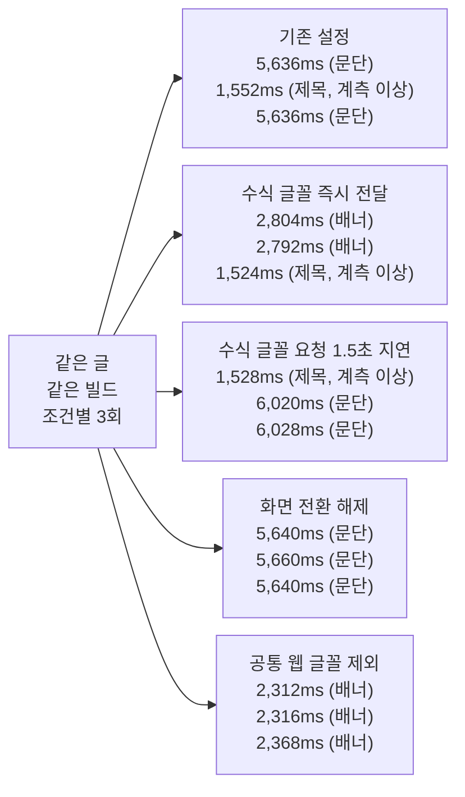

## Table of Contents

## 고친 코드와 줄어든 기다림 사이

일반 웹 글꼴을 제거하고 다시 빌드한 뒤, 수식 글의 첫 방문 LCP 중앙값은 5,650ms에서 2,352ms로 줄었다. FCP는 1,514ms에서 758ms가 됐다. 수식 전용 글꼴은 유지했고, 수정 후 네 번 모두 5초대 LCP가 나오지 않았다. 다만 이 LCP는 대상이 본문 문단에서 하단 모집 배너로 바뀐 값이고, 수식 글꼴 자체는 이 단계까지 약 4.8초에 도착했다. 홈 LCP는 같은 이유로 늦어졌으므로 모든 경로의 지표가 좋아졌다고 쓰지는 않는다.

두 그래프는 일반 웹 글꼴을 실제로 제거하기 직전과 직후의 비교다. 수식 전용 글꼴은 유지했다. 준비된 프로덕션 서버에 새 브라우저로 접속하고 CPU 4배 감속, 지연 150ms, 전송 속도 1,600Kbps를 적용했다. 막대는 경로별 네 번의 중앙값이며, 각 경로의 전과 후를 나란히 배치했다. 실행 범위는 본문에 적었다. FCP는 첫 콘텐츠가 그려진 시간, LCP는 화면에서 가장 큰 콘텐츠 후보의 페인트 기록이다.

<BarCompare title="일반 글꼴 제거 전후 FCP" unit="ms" before="제거 전" after="제거 후" rows="홈|1626|868;코드|2146|870;수식|1514|758" />

<BarCompare title="일반 글꼴 제거 전후 LCP" unit="ms" before="제거 전" after="제거 후" rows="홈|1684|2376;코드|3150|2250;수식|5650|2352" />

처음부터 이 결과가 나온 것은 아니다. 마이그레이션 직후에는 빌드 중앙값이 167.00초에서 20.92초로 줄었지만 홈 FCP는 비슷했다. 수식 글 LCP는 2,428ms에서 5,640ms로 늘었다. 그 지연을 추적하고 글꼴을 줄인 과정까지 기록했다. 5.6초 동안 본문이 안 보였다는 뜻은 아니었지만, 일반 웹 글꼴을 계속 내려보낼 필요도 없었다.

[첫 편](/2026/09/tailwind-to-stylex-migration)에서는 Tailwind와 전역 CSS를 StyleX 중심으로 옮겼고, [두 번째 편](/2026/09/markdown-pipeline-to-rust-wasm)에서는 마크다운 파싱과 후처리를 Rust/WASM으로 모았다. 그 사이 글 목록 메타데이터를 재사용하고, 본문에서만 쓰는 CSS를 분리하고, 수식이 없는 글에서 받던 KaTeX 자원도 없앴다. 코드는 꽤 바뀌었다. 그런데 두 글의 수치만 모아 놓으면 정작 이 질문에 바로 답하기 어려웠다. 그래서 이 블로그를 여는 사람은 얼마나 덜 기다리게 됐을까.

StyleX 글의 FCP는 서버를 미리 방문한 뒤 느린 네트워크와 CPU 감속을 적용한 결과다. WASM 글의 첫 방문은 서버 프로세스도 새로 띄웠지만 브라우저 감속은 적용하지 않았다. 두 결과의 개선율을 더하거나, 한쪽 시간을 다른 쪽 표에 넣으면 비교 조건부터 어긋난다. 빌드 시간을 줄인 작업도 브라우저의 첫 화면이 빨라졌다는 근거는 아니다.

먼저 두 작업 이전의 블로그와 마이그레이션을 마친 블로그를 같은 조건에서 열었다. 그 결과에서 수식 글의 LCP 지연을 발견해 원인을 좁혔고, 일반 웹 글꼴을 제거한 뒤 다시 빌드해 비교했다. 최초 비교, 원인 대조, 실제 수정 후 검증은 서로 다른 실행으로 남겼다.

## 비교할 두 버전부터 고정했다

최초 비교의 이전 버전은 두 마이그레이션 브랜치가 갈라진 공통 조상인 `32260159`다. Tailwind와 전역 스타일시트를 사용하고, `next-mdx-remote-client`가 마크다운을 컴파일한다. 변경 후는 `118a9466`이다. 스타일은 StyleX와 용도별 CSS로 나뉘었고, 마크다운 처리에는 전체 WASM 파이프라인을 사용한다. 이 시점에는 일반 웹 글꼴이 남아 있었다. 아래의 최초 비교 그래프는 이 두 커밋의 기록이며, 글꼴을 제거한 `973aba65`의 결과는 뒤에서 따로 비교한다.

| 영역               | 변경 전                      | 변경 후                          |
| ------------------ | ---------------------------- | -------------------------------- |
| 스타일 작성        | Tailwind 유틸리티와 전역 CSS | StyleX와 용도별 CSS              |
| 본문 스타일 전달   | 전역 스타일시트에 포함       | 긴 본문을 쓰는 경로에서 로드     |
| 마크다운 처리      | MDX 컴파일과 JS 플러그인     | Rust/WASM 처리 후 React에 연결   |
| 수식               | 모든 글에서 KaTeX 자원 로드  | MathML과 로컬 수식 글꼴          |
| 글 목록 메타데이터 | React `cache()`              | 프로덕션 모듈 캐시로 추가 재사용 |

각 커밋을 별도 worktree로 꺼내고, 글과 시리즈 소개, `public`의 이미지와 글꼴은 같은 입력으로 맞췄다. 썸네일 URL의 버전 값에 파일 수정 시각을 쓰고 있어, 이미지 내용뿐 아니라 수정 시각도 같게 맞췄다. 두 버전의 소스 코드는 그대로 두고 각자의 잠금 파일로 의존성을 설치했다. 따라서 이 비교에는 의존성 버전의 차이도 들어간다. Node와 Next.js, React 버전은 양쪽이 같다. 특정 라이브러리만 바꾼 실험으로 읽으면 안 되는 이유다.

글 목록을 맞춘 것은 홈 화면에 새 글이 추가되는 일을 막기 위해서다. 홈은 글 카드와 시리즈 표시 같은 UI 변경도 포함한 최종 화면끼리 비교한다. 코드 글과 수식 글의 마크다운은 원래 두 커밋에서도 같았지만, 전체 글 목록까지 같아야 목록을 읽는 비용과 미리 가져오는 링크의 입력을 맞출 수 있었다.

> 2026년 9월 14일, Apple M1 8코어와 메모리 16GiB, macOS 26.6.2에서 Node 24.20.0, pnpm 12.1.0, Next.js 16.3.1, React 19.2.8을 사용했다. 인기글 API 결과가 바뀌는 것을 피하려고 GA4 자격증명은 비웠다. 프로덕션 빌드와 서버로 측정했으며, 공식 측정 중에는 개발 서버와 다른 빌드, 브라우저 측정을 함께 실행하지 않았다.

## 첫 방문과 재방문을 구분했다

대상은 [홈](/), [코드 블록이 있는 Kubernetes 글](/2026/08/k8s-for-frontend-1), [수식 31개가 있는 집합 글](/2020/07/math-for-programmer-chapter1-2-set)이다. 홈은 공통 UI와 카드, 코드 글은 일반적인 긴 본문, 수식 글은 별도 글꼴과 수식 마크업이 붙는 경우를 확인하기 위해 골랐다.

먼저 서버의 세 경로와 자원을 한 번씩 방문했다. 이번 비교에서는 준비된 서버에 브라우저가 접속한다. WASM 인스턴스를 처음 만들거나 서버 인스턴스를 할당하는 상황은 앞의 콜드 요청 측정과 구분했다.

브라우저는 Chromium 153.0.8010.12를 사용하고, 모바일 화면 390×844, 기기 배율 2, 터치 입력으로 설정했다. CPU 감속은 4배, 네트워크 설정은 지연 150ms와 다운로드, 업로드 각각 1,600Kbps다. 실제 휴대전화를 사용한 결과가 아니라 M1에서 Chromium을 감속한 실험이다. User-Agent도 Android 14 Pixel 7로 바꿔 보냈다. 이 서버는 UA로 분기하지 않지만 조건으로 남긴다. 감속 값을 설정하는 데서 끝내지 않고, 실제 요청에 CDP의 네트워크 규칙 ID가 붙었는지도 검사했다.

첫 방문에는 새 Chromium 프로세스와 프로필을 사용했다. 그 방문이 끝나면 같은 브라우저에서 빈 페이지로 이동한 뒤 같은 URL을 다시 열었다. 두 번째 방문에서는 첫 방문 때 받은 HTTP 캐시를 유지했다. 두 경우 모두 서비스 워커는 차단했다. 따라서 여기서 재방문은 HTTP 캐시가 있는 일반 문서 탐색이며, 앱 내부의 클라이언트 라우팅이나 뒤로 가기 캐시를 측정한 결과는 아니다.

각 경로와 방문 조건을 버전별로 네 번씩 측정했다. 실행 순서는 변경 전과 변경 후를 번갈아 먼저 오도록 했다. 관찰은 `load`, 글꼴 준비와 네트워크 유휴 상태를 기다리고 5초 뒤에 끝냈다. 그동안의 정상 애니메이션과 Next.js의 링크 prefetch도 포함한다. 측정 당시에는 9월 30일까지 표시하는 모집 배너도 켜져 있었다. 배너를 닫거나 시각을 바꾸지 않았으므로, 날짜가 지난 뒤에는 LCP 대상이 달라질 수 있다.

아래 막대그래프의 전과 후는 최초 비교의 마이그레이션 전후이며, 숫자는 네 번의 중앙값이다. 같은 경로의 두 막대를 비교하면 된다. 모든 축은 0에서 시작한다. 시간과 전송량 모두 짧은 막대가 더 작은 비용을 뜻한다. 실행 범위는 본문에 적었고, 세부 수치는 그래프 아래에서 표를 펼쳐 볼 수 있다.

## 글꼴을 줄이기 전 첫 화면

FCP(First Contentful Paint)는 탐색을 시작한 뒤 텍스트나 이미지 같은 콘텐츠가 처음 그려진 시간이다. 글 본문이 아니라 헤더가 먼저 나타나도 기록될 수 있다. LCP(Largest Contentful Paint)는 화면 안에서 가장 큰 콘텐츠 요소가 그려진 시점을 추적한다. [FCP 설명](https://web.dev/articles/fcp), [LCP 설명](https://web.dev/articles/lcp)

<BarCompare title="마이그레이션 전후 FCP" unit="ms" before="변경 전" after="변경 후" rows="홈|1556|1568;코드|1898|2014;수식|1658|1450" />

홈의 FCP 범위는 변경 전 1,548ms에서 1,568ms, 변경 후 1,556ms에서 1,572ms였다. 중앙값의 12ms 차이보다 실행 범위가 겹친다는 점을 함께 봤다. 이 조건에서 홈의 첫 화면이 빨라졌다고 쓰기는 어렵다.

코드 글의 FCP는 116ms 늦어졌다. 변경 전 네 번은 1,876ms에서 1,920ms, 변경 후는 2,008ms에서 2,020ms로 범위가 겹치지 않았다. 반대로 수식 글의 FCP는 208ms 빨라졌다. 같은 마이그레이션을 적용했어도 경로에 따라 결과가 달랐다. 다만 네 번의 범위는 한 세션 안의 재현성이지 측정 불확실성이 아니다. 같은 변경 후 빌드를 세 시간 뒤 다른 세션에서 다시 쟀을 때 코드 글 FCP 중앙값은 2,014ms에서 2,146ms로 움직였고, 세 경로 모두 앞 세션과 범위가 겹치지 않았다. 세션 간 차이 132ms가 여기서 말하는 116ms보다 크므로, 100ms 안팎의 경로별 차이는 방향만 적고 확정하지 않는다.

<BarCompare title="마이그레이션 전후 LCP" unit="ms" before="변경 전" after="변경 후" rows="홈|1644|1648;코드|3248|3082;수식|2428|5640" />

<details>
<summary>첫 방문 FCP와 LCP 측정값 표로 보기</summary>

| 경로    | FCP 변경 전 | FCP 변경 후 | LCP 변경 전 | LCP 변경 후 |
| ------- | ----------: | ----------: | ----------: | ----------: |
| 홈      |     1,556ms |     1,568ms |     1,644ms |     1,648ms |
| 코드 글 |     1,898ms |     2,014ms |     3,248ms |     3,082ms |
| 수식 글 |     1,658ms |     1,450ms |     2,428ms |     5,640ms |

</details>

LCP는 값과 함께 어떤 요소가 기록됐는지 봐야 했다. 홈의 첫 방문은 양쪽 모두 같은 글 카드의 썸네일이었다. 코드 글은 변경 전 네 번 중 한 번이 제목, 세 번이 하단 모집 배너였고, 변경 후는 네 번 모두 모집 배너였다. 제목이 잡힌 한 번은 `size`가 34,238로 뷰포트 폭 390에 87.8을 곱한 값이라, 뒤에서 다룰 계측 이상과 같은 종류다. 그 뒤로 더 큰 후보가 없어 2,256ms에 얼어붙었다. 이 한 번을 빼면 변경 전은 배너 세 번의 3,236ms에서 3,252ms, 중앙값 3,248ms이고, 변경 후는 같은 배너가 3,076ms에서 3,088ms다. 같은 요소가 약 166ms 일찍 그려졌다는 뜻이며, 위 표와 그래프의 변경 전 값은 이 세 번의 중앙값이다. 수식 글은 반대로 대상이 바뀌면서 늘었다. 변경 전 네 번은 본문의 벤 다이어그램 이미지가, 변경 후 네 번은 집합을 설명하는 문단이 최종 후보였고, 변경 후 값은 5,636ms에서 5,648ms 사이였다. 그 문단은 수식 글꼴이 도착한 뒤에 다시 기록된 것이었다. 이 3.2초의 원인은 다음 절에서 글꼴 조건을 바꿔 가며 확인한다.

브라우저에 스켈레톤이나 제목이 먼저 나오면 FCP와 실제 본문 사이에 간격이 생길 수 있다. 글 페이지에서는 `aria-hidden`인 로딩용 요소를 제외하고, 텍스트가 100자를 넘는 `article.post-article`을 DOM에서 처음 감지한 시점도 기록했다. 아래의 본문 DOM은 이 감지 시간을 뜻한다.

<BarCompare title="첫 방문 본문 DOM 감지" unit="ms" before="변경 전" after="변경 후" rows="코드|1487.8|1472.8;수식|1277.3|1099.4" />

<BarCompare title="재방문 본문 DOM 감지" unit="ms" before="변경 전" after="변경 후" rows="코드|215.8|204.8;수식|215.6|200.8" />

<details>
<summary>본문 DOM 감지 시간 표로 보기</summary>

| 경로    | 첫 방문 변경 전 | 첫 방문 변경 후 | 재방문 변경 전 | 재방문 변경 후 |
| ------- | --------------: | --------------: | -------------: | -------------: |
| 코드 글 |       1,487.8ms |       1,472.8ms |        215.8ms |        204.8ms |
| 수식 글 |       1,277.3ms |       1,099.4ms |        215.6ms |        200.8ms |

</details>

코드 글의 첫 방문 본문 DOM은 약 1.49초와 1.47초로 가까웠다. 수식 글에서는 1,277.3ms에서 1,099.4ms로 약 178ms 줄었다. 그런데 수식 글의 LCP는 약 3.21초 늦어졌다. 본문이 DOM에 들어오는 것과, 그 뒤에 브라우저가 기록하는 가장 큰 콘텐츠의 페인트가 다른 단계라는 점이 수치에도 나타났다. 다만 수식 마크업과 글꼴이 함께 바뀐 상태에서 측정한 것이므로, 이 3.21초를 특정 파일 하나의 다운로드 시간으로 단정하지는 않았다.

처음에는 TTFB도 표에 넣으려 했다. 그런데 지연을 150ms로 설정했는데도 Navigation Timing의 `responseStart`는 수 밀리초로 나왔다. 별도의 작은 HTML 응답에서 중간 응답과 캐시를 없애고 지연을 0ms, 150ms, 500ms로 바꿔 설정마다 한 번씩 확인했다. FCP는 16ms, 184ms, 544ms로 늘었지만 `responseStart`는 1.5ms에서 3.3ms 사이였다. 이 Chromium의 CDP 계측에서는 합성 지연이 해당 필드에 반영되지 않았다. 원자료의 `ttfbMs`는 그 필드를 복사한 값으로 보존하고, 모바일 네트워크의 첫 응답 시간을 비교하는 표에서는 제외했다.

## 글꼴을 기다린 시간과 본문이 보인 시간

수식 글의 LCP를 설명하려고 서버의 본문 생성 지연, 글꼴 전송, 화면 배치와 LCP 대상의 변화, 브라우저의 렌더링 작업을 후보로 잡았다. 네 후보를 모두 기존 기록과 대조했다. 본문 DOM은 약 178ms 일찍 감지됐고, 관찰 구간의 JS 실행 시간 중앙값도 185.7ms에서 170.0ms로 줄었다. 레이아웃 작업은 472.4ms에서 408.1ms, 스타일 재계산은 492.9ms에서 419.3ms였다. 서버가 본문을 늦게 만들거나 브라우저의 작업량이 늘어서 3초 넘게 지연됐다는 설명을 뒷받침하는 결과는 아니었다. 다만 관찰 구간의 합계만으로 특정 페인트 직전의 대기까지 배제할 수는 없어, 글꼴 전송 시점과 LCP 대상을 더 살펴봤다.

기존 네 번의 추적 기록에서는 비슷한 순서가 반복됐다. 약 1.10초에 본문 DOM이 들어오고, 1.22초에 Libertinus Math 요청이 시작됐다. 글꼴 로드는 약 5.57초에 끝났고, 약 70ms 뒤 본문 문단이 LCP로 기록됐다. 글꼴 전송량도 마이그레이션 전 KaTeX 글꼴 네 개 약 64KiB(수식이 없는 홈과 코드 글도 받던 파일이다)에서 수식 전용 글꼴 334KiB로 늘었다. 다만 시간 순서만 보고 글꼴이 원인이라고 결론 내릴 수는 없었다.

그래서 `118a9466`의 같은 프로덕션 빌드에서 조건을 하나씩 바꿨다. 수식 글꼴을 즉시 전달하는 경우에는 다운로드한 파일과 동일한 바이트를 브라우저에 넣었다. 반대 실험에서는 같은 파일의 요청을 1.5초 늦췄다. 모든 조건에서 같은 URL을 가로채되 대조군은 바로 원래 요청을 이어 보냈고, 브라우저가 받은 글꼴의 SHA-256도 대조했다. MathML 31개와 본문 HTML은 그대로였다. 화면 전환 기능(View Transitions)을 끄는 조건과, 수식 글꼴은 남기고 공통 웹 글꼴만 제외하는 조건도 따로 측정했다.



이 도식은 기존 48회에 합친 결과가 아니다. 준비된 같은 서버에 새 브라우저로 접속하고, CPU 4배 감속과 지연 150ms, 전송 속도 1,600Kbps를 유지한 추가 실험이다. 다섯 조건을 세 번씩 실행했으며, 각 상자에 세 번의 LCP와 최종 대상을 적었다. 중앙값만으로는 제목과 문단 사이에서 대상이 바뀌는 모습을 감추기 쉬워 개별 값을 남겼다.

수식 글꼴을 즉시 전달하면 5초대의 늦은 문단 후보가 나오지 않았다. 요청을 늦춘 조건에서는 문단이 최종 후보인 두 번이 6,020ms와 6,028ms로 더 늦어졌다. 화면 전환을 끈 세 번에서는 모두 5초대의 늦은 문단 후보가 다시 나왔으므로, 화면 전환이 지연을 일으킨다는 가설은 버렸다. 글꼴 전송 시점은 늦은 LCP 후보에 영향을 줬다.

그런데 기존 설정과 즉시 전달, 요청 지연 조건에서 한 번씩 총 세 번은 제목이 최종 후보로 남아 1,552ms, 1,524ms, 1,528ms로 끝났다. 처음에는 대상이 갈리는 변동으로 읽었다. 원자료를 열어 보니 계측 이상이었다. 이 세 실행의 제목은 LCP `size`가 23,400으로 기록됐는데, 뷰포트 폭이 390이므로 390 곱하기 60이다. 같은 제목이 나머지 아홉 번에서는 5,226으로 기록되고, 콜백에서 읽은 실제 사각형은 열다섯 번 모두 326 곱하기 67.1875로 같다. 제목이 아직 뷰포트 폭 전체를 차지하던 중간 레이아웃의 페인트가 잡힌 것이다.

LCP는 직전 최대보다 큰 후보가 그려질 때만 새 항목을 낸다. 본문 문단은 20,672, 모집 배너는 10,335이므로 23,400이 한 번 박히면 뒤에 무엇이 그려져도 기록되지 않는다. 실제로 이 세 실행만 후보가 다섯 개가 아니라 세 개에서 끝났다. 5.6초에 문단이 그려졌는데도 지표는 1.5초에 얼어붙었다. 세 번 모두 화면 전환이 실행된 열두 번 안에서 나왔고 해제한 세 번에서는 없었지만, 원인까지 확인하지는 못했다.

그래서 이 세 값은 조건의 효과로 읽을 수 없다. 빼고 보면 다섯 조건 모두 최소 두 번의 기록이 남고 방향은 그대로다. 최종 값이 어떤 요소가 가장 큰 후보로 남는지에 달려 있다는 것도 여전하다. 다만 그 근거는 제목이 아니라, 문단에서 배너로 대상이 바뀌는 실행들이다.

더 확인할 것은 실제 화면이었다. 로딩 중 화면을 별도로 캡처한 두 번의 실행에서는 LCP가 각각 5,640ms와 5,632ms로 기록됐다. 그런데 약 2초 시점에 이미 제목과 본문 첫 문단의 시작이 보였다. 이때 수식 글꼴은 여전히 로딩 중이었다.


따라서 5.6초라는 LCP를 본문이 처음 읽히기까지 걸린 시간으로 설명하면 틀린다. 이 실행에서는 글꼴 로드가 끝난 뒤 이미 보이던 문단이 LCP 후보로 새로 기록됐다. 측정 당시 CSS에는 `font-display: swap`도 이미 있었다. 이 속성을 추가하면 해결된다는 설명도 맞지 않는다. 브라우저 내부에서 문단을 다시 후보로 기록한 세부 경로까지는 확인하지 못했지만, 글꼴 전송 조건을 바꾼 결과와 실제 화면을 보면 파서의 실행 시간으로 설명할 문제는 아니었다.

공통 글꼴을 제외하는 실험에서는 `Inter`, `JetBrains Mono`, `Fraunces`에 쓰던 CSS 변수를 시스템 글꼴로 바꾸고, 이 글꼴들의 미리 불러오기 요청을 차단했다. 수식의 `Libertinus Math`는 그대로 뒀다. FCP 중앙값은 대조군 1,448ms에서 688ms로 줄었고, 공통 글꼴 전송량 약 168KiB도 없어졌다. LCP는 세 번 모두 모집 배너였으며 2,312ms, 2,316ms, 2,368ms로 기록됐다. 반면 수식 글꼴의 응답 완료는 여전히 약 4.8초였다. 첫 페인트와 LCP는 줄었지만, 수식 글꼴 다운로드까지 일찍 끝낸 결과는 아니었다.

이 결과는 [추가 실험 기록](https://github.com/yceffort/blog/blob/09afeb98/apps/blog/tests/performance/series-overall/lcp-investigation.json)에 따로 남겼다. 이 단계까지는 기존 빌드에 요청 차단과 CSS 덮어쓰기를 적용한 실험이었다. 공통 웹 글꼴을 뺄 근거는 얻었으므로, 실제 코드에서도 제거하고 다시 빌드하기로 했다.

## 일반 웹 글꼴을 실제 코드에서 제거했다

루트 레이아웃에서 `Inter`, `JetBrains Mono`, `Fraunces`의 `next/font/google` 호출과 글꼴 클래스를 제거했다. 기존 스타일이 사용하는 CSS 변수 이름은 유지하되 시스템 글꼴을 가리키도록 바꿨다. 본문, 코드, 장식용 글자는 기기에 설치된 글꼴로 그리며, 수식 전용 `Libertinus Math`와 MathML은 그대로 남겼다. [변경 커밋](https://github.com/yceffort/blog/commit/973aba65)

```css
html {
  --font-sans: system-ui;
  --font-mono: ui-monospace;
  --font-serif: ui-serif;
}
```

이전 웹 글꼴도 Next.js가 자체 호스팅하므로 방문할 때 Google에서 직접 받던 것은 아니다. 제거한 비용은 블로그 서버에서 받는 일반 글꼴 파일과 미리 불러오기 요청이다. 파일을 받지 않게 한 만큼 같은 화면을 보장하지는 않는다. 영문 제목과 코드의 글자 모양, 굵기와 줄바꿈은 운영체제와 브라우저의 시스템 글꼴에 따라 달라진다.

글꼴 제거 커밋을 별도 worktree에 꺼내고 최초 비교와 동일한 글, 시리즈, 공개 자산과 수정 시각을 적용했다. 프로덕션 빌드 후 홈, 코드 글, 수식 글의 첫 방문을 제거 전후 네 번씩, 총 24회 비교했다. CPU 4배 감속, 지연 150ms, 전송 속도 1,600Kbps와 화면 크기는 앞의 실험과 같고, 새 브라우저를 사용했다. 이번에는 글꼴 요청을 차단하거나 CSS를 주입하지 않았다.

FCP는 세 경로 모두 줄었고, 네 번씩 측정한 실행 범위도 겹치지 않았다. 수식 글은 제거 전 1,492ms부터 1,528ms 사이, 제거 후 740ms부터 776ms 사이였다. 공통 글꼴 전송량은 세 경로 모두 약 168KiB 줄었다. 홈과 코드 글에서는 글꼴 요청이 없어졌고, 수식 글에서는 약 334KiB의 수식 전용 글꼴 하나만 남았다.

수식 글 LCP는 제거 전 5,648ms부터 5,672ms 사이, 제거 후 2,320ms부터 2,392ms 사이였다. 네 번 모두 5초대의 늦은 문단 후보가 나오지 않았다. 본문의 MathML 31개와 수식 글꼴 요청은 그대로였으며, 일반 웹 글꼴의 요청과 글꼴 정의가 사라진 것도 확인했다. 실제 수정으로 첫 페인트가 빨라졌고, 이 측정 조건의 5초대 LCP도 해결됐다.

<details>
<summary>실제 일반 웹 글꼴 제거 전후 측정값 표로 보기</summary>

| 경로    | FCP 제거 전 | FCP 제거 후 | LCP 제거 전 | LCP 제거 후 |
| ------- | ----------: | ----------: | ----------: | ----------: |
| 홈      |     1,626ms |       868ms |     1,684ms |     2,376ms |
| 코드 글 |     2,146ms |       870ms |     3,150ms |     2,250ms |
| 수식 글 |     1,514ms |       758ms |     5,650ms |     2,352ms |

</details>

LCP를 해석할 때는 여전히 대상의 차이를 봐야 한다. 제거 후 세 경로의 마지막 후보는 모두 모집 배너였다. 코드 글은 제거 전에도 배너여서 같은 요소의 시간이 줄었다. 수식 글은 본문 문단에서 배너로 바뀌었고, 홈은 썸네일에서 배너로 바뀌면서 LCP 중앙값이 1,684ms에서 2,376ms로 늦어졌다. 홈 FCP가 빨라진 것과 홈 LCP가 늦어진 것은 함께 나온 결과다. 배너를 숨겨 측정값을 맞추지는 않았다.

이번 수정으로 일반 글꼴 약 168KiB를 없애고 세 경로의 FCP를 줄였으며, 수식 글의 5초대 LCP도 없앴다. 수식 글꼴 자체의 용량은 이 시점에는 줄이지 않았다. 24회 관찰 구간의 CLS는 모두 0이었지만, 운영체제별 글자 모양이 이전과 같다는 뜻은 아니다. [실제 수정 후 측정 원자료](https://github.com/yceffort/blog/blob/09afeb98/apps/blog/tests/performance/series-overall/font-removal-results.json)에 개별 실행과 LCP 대상을 함께 남겼다.

## 수식 글꼴은 쓰는 글자만 남겼다

남은 비용은 수식 글꼴이었다. Libertinus Math는 글리프가 4,221개인 341,752바이트짜리 파일인데, 이 블로그의 수식 노드 145개가 실제로 쓰는 문자는 80개 안팎이었다. 그래서 글에서 쓰는 글리프만 남긴 서브셋을 만들었다. posts와 series를 전부 렌더해 `<math>` 안의 텍스트에서 코드포인트를 모으고, fontTools의 `pyftsubset`으로 그 글리프만 남겼다. 새 글이 서브셋에 없는 글자를 쓰면 마크다운 검사 스크립트가 경고하고, 그때 같은 스크립트로 서브셋을 다시 만든다.

수식 글꼴은 글자만 빼면 끝나는 파일이 아니었다. 분수의 가로줄과 첨자의 위치는 `MATH` 테이블의 상수에서 오고, 근호와 괄호는 크기별 변형 글리프와 조각을 이어 붙이는 조립 정보로 늘어난다. 서브셋 뒤에 이 테이블이 남았는지, 남긴 글리프의 변형과 조각이 빠지지 않았는지 원본과 대조하는 검증을 스크립트에 넣었다. 첨자용으로 모양을 바꾼 대체 글리프도 기본 옵션에서는 빠지므로 레이아웃 기능을 전부 남기도록 했다.

글자 하나짜리 `<mi>`에는 함정이 하나 더 있었다. 브라우저는 `<mi>x</mi>`를 그릴 때 `x`가 아니라 수학 이탤릭 코드포인트 `𝑥`를 쓴다. 그래서 처음에는 바뀐 글자만 넣었는데, 그리는 글리프는 같은데도 수식 상자의 높이가 전체 글꼴과 달라지는 요소가 145개 중 114개 나왔다. 글리프 범위를 나눠 가며 대조해 보니 원래 글자 `x`가 글꼴에 없을 때만 생기는 차이였다. Chromium은 그리는 데 쓰지 않는 원래 글자의 글리프를 상자 크기 계산에 쓰고, 그 글자가 없으면 시스템 글꼴로 잰다. 원래 글자를 함께 남기자 두 서버에서 잰 `<math>` 145개의 크기 차이가 0건이 됐고, 모든 글리프가 Libertinus Math로 그려지는 것도 CDP로 확인했다. 최종 서브셋은 글리프 230개, 26,164바이트다.

같은 조건으로 수식 글의 첫 방문을 전체 글꼴과 서브셋 글꼴에서 네 번씩 쟀다. 코드와 글은 같고 글꼴 파일 하나만 다르다.

| 항목           | 전체 글꼴 |   서브셋 |
| -------------- | --------: | -------: |
| 수식 글꼴 전송 |  334.1KiB |  25.9KiB |
| 전체 전송      |  941.0KiB | 632.6KiB |
| 글꼴 응답 완료 |  약 4.8초 | 약 1.4초 |
| FCP 중앙값     |     728ms |    730ms |
| LCP 중앙값     |   2,254ms |  2,084ms |
| `load` 중앙값  |   4,802ms |  1,942ms |

첫 페인트는 같았다. 글꼴은 첫 화면에 그려지는 자원이 아니므로 그래야 한다. 대신 글꼴 응답이 약 4.8초에서 약 1.4초로 앞당겨졌고, `load`는 그 뒤를 따라 4,802ms에서 1,942ms가 됐다. LCP는 여덟 번 모두 모집 배너가 최종 대상이었고 170ms 줄었다. 추적 파일의 후보 이력을 보면 양쪽 모두 썸네일, 제목, 배너의 세 후보로 끝났고 글꼴 도착 뒤에 문단이 다시 기록된 실행은 없었다. 앞 절에서 본 5.6초짜리 문단 기록은 글꼴이 배너보다 늦게 도착할 때 생길 수 있는 일이었는데, 이제 글꼴이 배너보다 약 0.7초 먼저 도착한다. 9월 30일 이후 배너가 사라져 문단이 최종 후보가 되더라도 글꼴 때문에 늦게 기록될 여지는 없어졌다. [서브셋 전후 측정 원자료](https://github.com/yceffort/blog/blob/main/apps/blog/tests/performance/series-overall/font-subset-results.json)에 개별 실행과 요청 목록을 남겼다.

## 이미 받아 둔 자원이 있을 때

첫 방문에서 줄어든 바이트가 재방문에도 같은 차이를 만들지는 않는다. 브라우저에 CSS와 JS, 글꼴이 남아 있으면 다시 전송하지 않아도 되기 때문이다. 그래서 첫 방문만 반복한 뒤 그 결과를 모든 방문의 개선량으로 쓰지 않았다.

<BarCompare title="재방문 FCP" unit="ms" before="변경 전" after="변경 후" rows="홈|318|300;코드|390|366;수식|290|356" />

<BarCompare title="재방문 LCP" unit="ms" before="변경 전" after="변경 후" rows="홈|438|436;코드|600|592;수식|444|528" />

재방문 그래프는 수백 ms 차이를 읽을 수 있도록 앞의 첫 방문 그래프보다 시간 축을 확대했다.

<details>
<summary>재방문 FCP와 LCP 측정값 표로 보기</summary>

| 경로    | FCP 변경 전 | FCP 변경 후 | LCP 변경 전 | LCP 변경 후 |
| ------- | ----------: | ----------: | ----------: | ----------: |
| 홈      |       318ms |       300ms |       438ms |       436ms |
| 코드 글 |       390ms |       366ms |       600ms |       592ms |
| 수식 글 |       290ms |       356ms |       444ms |       528ms |

</details>

두 버전 모두 첫 방문에 비해 페인트 시간이 짧아졌다. 다만 변경 전후의 차이는 실행마다 흔들렸다. 코드 글의 재방문 FCP 범위는 변경 전 284ms에서 492ms, 변경 후 256ms에서 488ms였다. 중앙값 24ms 차이만으로 안정적인 개선이라고 판단하지 않았다. 수식 글은 재방문에서도 FCP와 LCP 중앙값이 더 늦었지만, 양쪽 실행 범위가 겹쳤다.

모든 재방문에서 CSS와 JS, 글꼴, 이미지의 전송 바이트는 0이었다. 캐시에서 처리된 요청도 홈은 변경 전 34개와 변경 후 30개, 코드 글은 51개와 47개, 수식 글은 32개와 29개로 확인했다. 첫 방문의 수식 글꼴 334KiB를 재방문에서도 다시 다운로드한 결과가 아니다.

재방문의 전체 전송량은 버전 차이로 읽을 수 없었다. 수식 글 변경 전 네 번은 12.3, 22.7, 231.0, 22.7KiB로 갈렸고 관찰 종료 시각도 7.1초 세 번과 12.7초 한 번이었다. 변경 후 네 번은 모두 235.1KiB인데 관찰이 16.5초 넘게 이어졌다. 코드 글도 양쪽 모두 230KiB대와 320KiB대가 두 번씩 번갈아 나왔다. 관찰 창이 network idle을 기다린 뒤 닫히므로, 홈과 영문 홈의 RSC prefetch 응답 두 개(약 212KiB)가 창 안에 들어오느냐가 값을 갈랐다. 이 기록은 창이 닫힐 때 받고 있던 요청의 바이트를 따로 세기 전 하네스로 쟀다. 그래서 재방문의 전송량은 비교에서 제외하고, 캐시 적중 수와 재전송 0바이트만 남긴다.

## 줄어든 자원과 새로 생긴 자원

단위는 KiB이며, 1KiB는 1,024바이트다. 전체 전송량에는 HTML과 RSC, 이미지 등도 들어 있다.

<BarCompare title="첫 방문 전체 전송량" unit="KiB" before="변경 전" after="변경 후" rows="홈|765.9|719.8;코드|1096.3|1070.3;수식|787.6|1073.2" />

홈에서는 전체 전송량이 약 46KiB, 코드 글에서는 약 26KiB 줄었다. 하지만 CSS와 JS 항목만 보면 둘 다 늘었고, HTML 문서도 홈 109.3KiB에서 114.8KiB, 코드 글 55.0KiB에서 61.0KiB로 커졌다. 문서 응답 완료 시각은 홈이 2,016ms에서 2,144ms로 늦어진 반면 코드 글은 1,233ms에서 1,142ms로 빨라졌다. StyleX로 바꿨다는 사실만으로 브라우저에 내려가는 CSS나 JS가 줄었다고 설명할 수는 없었다. 아래 표의 CSS는 관찰 종료까지 받은 합계라 첫 페인트를 막는 CSS의 양과도 구분해야 한다.

<details>
<summary>첫 방문 자원별 전송량 표로 보기 (KiB)</summary>

| 경로    | 버전    |    전체 |  HTML |  CSS |    JS |  글꼴 |
| ------- | ------- | ------: | ----: | ---: | ----: | ----: |
| 홈      | 변경 전 |   765.9 | 109.3 | 28.2 | 199.2 | 232.3 |
| 홈      | 변경 후 |   719.8 | 114.8 | 30.9 | 206.8 | 168.3 |
| 코드 글 | 변경 전 | 1,096.3 |  55.0 | 28.2 | 408.6 | 232.3 |
| 코드 글 | 변경 후 | 1,070.3 |  61.0 | 30.9 | 414.0 | 168.3 |
| 수식 글 | 변경 전 |   787.6 |  28.3 | 28.2 | 199.2 | 232.3 |
| 수식 글 | 변경 후 | 1,073.2 |  28.8 | 30.9 | 206.8 | 502.3 |

</details>

<BarCompare title="첫 방문 글꼴 전송량" unit="KiB" before="변경 전" after="변경 후" rows="홈|232.3|168.3;코드|232.3|168.3;수식|232.3|502.3" />

차이를 만든 자원 중 하나는 글꼴이었다. 변경 전 네트워크 기록에는 수식이 없는 홈과 코드 글에서도 KaTeX 글꼴 네 개가 들어 있었다. 합계는 약 64KiB였다. 변경 후에는 이 요청이 없어졌고 공통 글꼴 약 168KiB가 남았다.

수식 글에서는 반대였다. Libertinus Math 글꼴 한 개가 응답 헤더를 포함해 약 334KiB 전송됐다. 기존 KaTeX 글꼴 네 개보다 약 270KiB 많다. 전체 전송량이 약 286KiB 늘어난 것 중 대부분이 이 글꼴 항목의 증가다. CSS와 JS, 글꼴, 이미지와 나머지 응답을 각각 합산해 확인한 차이다. 세 경로에서 이미지 전송량은 변경 전후가 같았다.

MathML로 옮기면서 JS의 KaTeX 후처리는 없어졌다. 브라우저에서는 대신 새 글꼴을 받아 수식을 그린다. 서버의 변환 코드를 한곳에 모으는 목적은 달성했지만, 이 수식 글의 첫 다운로드 비용은 늘었다. 마이그레이션의 이점과 함께 남겨야 할 결과였다.

WASM 파일은 서버에서 불러 쓴다. 브라우저에는 결과로 만든 HTML과 React의 데이터가 전달되며, WASM 바이너리를 다운로드해 마크다운을 실행하지 않는다. 반면 MathML을 표시하기 위한 글꼴은 브라우저가 받는다. 파이프라인의 배포 파일 크기와 독자가 다운로드하는 크기를 구분해야 했다.

수식의 출력도 이전과 완전히 같지는 않다. KaTeX의 HTML과 MathML은 구조와 배치가 다르고, 코드의 토큰 경계와 색도 Prism과 syntect가 다르게 판정한다. 시각적 호환성은 이 글의 범위 밖이고, 보존한 내용과 검사한 범위는 두 번째 글에 적었다.

## 빌드를 기다리는 시간은 별도로 줄었다

빌드 시간은 최초 비교의 `32260159`와 `118a9466`에서 쟀다. 매번 `.next`를 지운 뒤 `next build`를 실행해 양쪽을 네 번씩 측정했다. 의존성 설치와 Rust/WASM 재컴파일은 포함하지 않았다. 일반 블로그 빌드가 이미 저장소에 들어 있는 WASM 파일을 사용하는 조건이다. CI에서 전체 모노레포를 검증할 때 Rust를 다시 빌드하는 시간과는 구분한다.

<BarCompare title="블로그 빌드 시간" unit="초" before="변경 전" after="변경 후" rows="빌드|167|20.92" />

<details>
<summary>빌드 시간 측정값 표로 보기</summary>

| 버전    |   중앙값 |     최소 |     최대 |
| ------- | -------: | -------: | -------: |
| 변경 전 | 167.00초 | 166.05초 | 168.33초 |
| 변경 후 |  20.92초 |  19.94초 |  21.29초 |

</details>

빌드 중앙값의 차이는 약 146초다. 반복 범위도 겹치지 않았다. 이 환경에서는 블로그 빌드 한 번을 기다리는 시간이 2분 47초에서 21초 정도로 줄었다. 두 버전 모두 네 번의 빌드가 성공했고, 로그에서 타임아웃이나 재시도는 확인되지 않았다.

이전 글에서 `getAllPosts`의 모듈 메모이즈만 비교했을 때도 빌드 시간이 크게 줄었다. 이번 전체 비교에는 그 변경이 들어 있다. 따라서 위 빌드 차이를 Rust 파서 하나의 효과로 돌릴 수는 없다. 실제로 두 번째 글에서 메모이즈를 세 구성 모두 켜고 비교했을 때는 JS 20.88초, 전체 WASM 20.33초였다. 같은 마크다운 변경이라도 글 목록을 반복해서 읽는지 여부를 함께 보면 전혀 다른 규모의 차이가 나온다.

빌드가 빨라지면 배포를 기다리는 시간은 줄어든다. 이미 배포된 페이지에 방문하는 사람의 FCP가 같은 비율로 줄어드는 것은 아니다. 첫 화면과 빌드를 따로 그린 이유다.

## 어디까지 확인한 결과인가

이번 결과는 세 경로를 하나의 로컬 환경에서 반복한 실험이다. 실제 독자의 국가와 네트워크, 사용 기기와 브라우저 분포가 들어 있는 수치는 아니다. 48회 모두 관찰 구간의 CLS는 0이었다. 다만 클릭과 입력 시나리오를 실행하지 않았으므로 INP(상호작용에서 다음 화면 갱신까지의 지연)가 좋아졌다는 결론까지 내리지 않는다.

네트워크 자원과 본문 DOM, 페인트를 함께 남겼지만, 모든 변경의 기여도를 따로 떼어 낸 실험은 아니다. 이전 구현은 jsDelivr에서 KaTeX CSS와 글꼴을 받고, 현재 구현은 로컬 서버에서 수식 글꼴을 받는다. 설정한 감속뿐 아니라 외부 CDN의 실제 응답 시간도 영향을 주므로 모든 요청의 왕복 시간이 정확히 150ms로 같다는 뜻도 아니다. 특정 CSS 파일이나 캐시 변경의 효과는 앞선 개별 실험과 구분해서 읽어야 한다. 여기서는 최종 버전을 열었을 때 무엇이 달라졌는지를 확인했다.

입력 커밋과 해시, 모든 실행 시간과 자원 목록은 [측정 원자료](https://github.com/yceffort/blog/tree/4c8fb62c/apps/blog/tests/performance/series-overall)에 남겼다. 이 원자료는 창이 닫힐 때 받고 있던 요청을 따로 세고 LCP 후보 이력을 저장하는 수정 이전의 하네스로 쟀으므로, 지금 스크립트로 다시 돌리면 결과 파일의 필드가 다르다. `apps/blog/scripts/series-performance/build.mjs`가 비교용 worktree를 만들고 빌드를 재며, `compare-performance.mjs`가 첫 방문과 재방문을 측정한다. 측정 입력은 이 글을 추가하기 전에 고정했다. 따라서 지금 체크아웃한 글 목록은 당시 입력과 다르다. 재현 방법과 당시의 범위는 결과 디렉터리의 README에 함께 적었다.

## 이번 작업에서 얻은 것과 남은 비용

확인한 개선 중 가장 큰 것은 빌드 대기였다. 전체 변경을 적용한 뒤 중앙값이 167.00초에서 20.92초로 줄었다. 글 목록 메타데이터 재사용까지 포함한 결과이며, WASM 파서 하나의 효과는 아니다. 유지보수 쪽에서는 스타일의 소유 위치를 정하고 마크다운 변환 규칙을 Rust로 모았다.

첫 화면은 경로별로 달랐다. 홈 FCP는 1,556ms와 1,568ms로 비슷했고, 코드 글 FCP는 1,898ms에서 2,014ms로 늦어졌다. 수식 글 FCP는 1,658ms에서 1,450ms로 줄었지만 첫 비교의 LCP는 2,428ms에서 5,640ms로 늘었다. 수식 글꼴 전송량도 약 64KiB에서 334KiB가 됐다. 블로그 전체가 빨라졌다고 묶어 쓰기에는 이 비용이 남았다.

그 상태로 끝내지 않고 일반 웹 글꼴을 실제 코드에서 제거했다. 재빌드 후 수식 글의 FCP 중앙값은 1,514ms에서 758ms, LCP는 5,650ms에서 2,352ms로 줄었다. 이 LCP는 대상이 문단에서 배너로 바뀐 값이다. 홈과 코드 글의 FCP도 줄었고, 세 경로에서 공통 글꼴 약 168KiB가 사라졌다. 다만 홈 LCP는 썸네일에서 배너로 대상이 바뀌면서 1,684ms에서 2,376ms로 늦어졌다. 수식 전용 글꼴은 글에서 쓰는 글리프만 남긴 서브셋으로 바꿔 전송량을 334.1KiB에서 25.9KiB로 줄였고, 글꼴 도착이 약 4.8초에서 약 1.4초로 앞당겨지면서 배너보다 먼저 오게 됐다.

5.6초라는 수치의 뜻도 바로잡았다. 별도로 화면을 확인한 실행에서는 약 2초에 본문 첫 문단의 시작이 이미 보였다. 이후 글꼴 로드가 끝나면서 그 문단이 LCP로 새로 기록됐다. 글꼴 전송 시점을 바꾸면 늦은 후보도 달라졌고, 배너가 최종 후보가 되는 실행도 있었다. 제목이 최종 후보로 잡힌 세 번은 계측 이상이었는데, 그것도 LCP 숫자만 봐서는 알 수 없었다. 다음 변경의 효과를 확인할 때도 LCP 숫자만 비교하지 않고 실제로 보인 화면과 선택된 요소를 함께 보려 한다.
