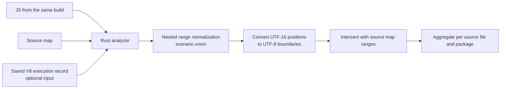

## Table of Contents

## What to check before counting executed bytes

In [part 1](/2026/09/tracing-bundle-waste-with-v8-coverage-and-sourcemaps), I analyzed the blog's first screen, search, and diagram zoom with [coldpath](https://www.npmjs.com/package/@yceffort/coldpath). Connecting the unobserved amount to source files let me separate code that arrives early through prefetch from code whose use can be deferred. Behind that judgment is a calculation that turns V8's execution record into bytes of generated code.

The ranges V8 returns mix an executed outer function together with an unexecuted inner block. Adding these ranges as they are double-counts the same position. A source map likewise only connects positions; it does not directly tell you how many bytes of generated code each source file occupies. To combine the two inputs, I first had to decide which unit and which rule to aggregate by.

What I wanted to confirm with this implementation went beyond whether the numbers looked plausible: whether those numbers actually pointed at the right file to investigate. In practice, when the same 13-byte input was distributed to a source, DevTools's function assigned 13 bytes while this analyzer's policy assigned 6 bytes. If you cannot tell a bug in the execution calculation apart from a difference in source attribution policy, a mismatched number can lead you to fix a correct calculation or optimize the wrong file.

> Reference: I describe the implementation and verification using [the initial analyzer at blog commit `7f33d3bc`](https://github.com/yceffort/blog/tree/7f33d3bccd6ebc71d7c26c07a2527ced07846c3b/experiments/bundle-trace) (named `bundle-trace` at the time). The implementation after splitting it out into [coldpath](https://github.com/yceffort/coldpath) is based on [commit `24a1a99`](https://github.com/yceffort/coldpath/tree/24a1a995443dc494926e9d841091e32ac7c52860), and the mapping diagnostics are based on [0.1.1](https://github.com/yceffort/coldpath/tree/v0.1.1). Installation and run commands are in part 1.

> What this post's verification does not guarantee: I cross-checked the normalization of execution ranges against both the DevTools implementation and a separate calculation, but attribution per source is a policy this tool defined, so it can differ from DevTools's per-source numbers. Whether the source map generator preserved the source's meaning exactly, and whether some code will never execute under any scenario, are both outside the scope of this verification.

## The boundary between browser collection and Rust analysis

To show whether code executed, the way DevTools Coverage does, you need an execution record in addition to the build files. The mere fact that code is inside the bundle does not tell you whether it was called.

For example, whether the following branch executes depends on a runtime value.

```js
if (globalThis.__API_MOCKING) {
  startMockServer()
}
```

If this value isn't fixed at build time, the bundler can leave the branch in. The Rust program that later reads the bundle and source map has no value from that execution either. No matter how closely you read the source map, it won't tell you whether `startMockServer()` was called. Tracing why code was included and observing whether it executed are separate tasks.

So I split the inputs into three.

| Input        | What it tells you                                                       | What it does not contain                                 |
| ------------ | ----------------------------------------------------------------------- | -------------------------------------------------------- |
| Generated JS | The code actually delivered and its length                              | Which path the user executed                             |
| Source map   | The correspondence between generated and source positions               | Whether it executed, the import graph between modules    |
| V8 coverage  | How many times functions and blocks executed during the observed window | Whether it's unnecessary for other users or other inputs |

The collector performs an action once in Chromium and saves the V8 record. Rust only reads the JS, map, and record files. Beyond that point, aggregation needs neither a browser nor a JavaScript runtime. If you omit coverage, the same analyzer just computes build size and each source's contribution.



DevTools also has an implementation that computes coverage per source file. This time, I wanted to build **an analysis stage where I could inspect the aggregation rules and results using inputs kept as files**. I chose Rust so that this stage could stay a single executable. JavaScript execution is the browser's job.

I initially named the project `bundle-trace`. Below is its structure at the time. It's a separate Cargo workspace from the blog, and the analysis code doesn't reference Next.js or Playwright. I used the existing `sourcemap` crate for source map decoding, and implemented coverage range processing, character position conversion, and combining the two results myself.

```text
bundle-trace/
  src/main.rs         CLI arguments and report output
  src/coverage.rs     V8 range normalization, union of observed ranges
  src/text.rs         UTF-16 and UTF-8 boundaries and line positions
  src/maps.rs         sourceMappingURL resolution
  src/attribution.rs  generated code ranges attributed to sources
  src/lib.rs          hash verification, range intersection, aggregation
```

The JavaScript for coverage collection is not a dependency of this executable; it's a separate program that produces the input. The npm distribution installs this Rust binary as a platform-specific package and runs it from the Node.js CLI's `npx @yceffort/coldpath analyze` command. The calculations described below are performed in the Rust analyzer. To confirm this boundary, I finally copied only the binary and a recorded verification example into a temporary directory outside the repository and ran it there. Without invoking Node or Chromium, combining the records of the initial load and a subsequent call gave 208B observed and 85B unobserved out of a total of 293B. Below, I trace how this 208B gets produced.

## Nesting and union of V8 execution ranges

Collection starts with the Chrome DevTools Protocol (CDP)'s `Profiler.startPreciseCoverage`. I turn it on before opening the page and request block-level recording and execution counts.

```js
await cdp.send('Profiler.enable')
await cdp.send('Profiler.startPreciseCoverage', {
  callCount: true,
  detailed: true,
})

// The action to observe: page entry, button click, etc.

const {result} = await cdp.send('Profiler.takePreciseCoverage')
```

The result has a structure where functions sit under a script, and `ranges` sit under each function. The end of a range is exclusive. The following is an input to illustrate the structure.

```json
{
  "functionName": "search",
  "isBlockCoverage": true,
  "ranges": [
    {"startOffset": 100, "endOffset": 200, "count": 1},
    {"startOffset": 140, "endOffset": 180, "count": 0}
  ]
}
```

This function executed once, but the block at `[140, 180)` did not execute. The executed length is 60, not 100. The outer range gives the default state, and the inner range overwrites that state.

You also need to check `isBlockCoverage`. Requesting `detailed: true` doesn't mean every function gets block information. In actual records, a function that was never called appeared as a single full range with `count: 0` and `isBlockCoverage: false`. There's no reason to require a record down to the internal branches of a function that hasn't executed yet. On the other hand, **if a function did execute but only has function-level information**, you cannot tell which branch executed. The analyzer leaves a warning in this case.

[V8's coverage explanation](https://v8.dev/blog/javascript-code-coverage) distinguishes best-effort collection from precise collection. This analysis used precise records as input. Also, the `startPreciseCoverage` entry in [the CDP definition](https://github.com/ChromeDevTools/devtools-protocol/blob/14748336eee2ebdf69a811c1360fbf53f12a238e/json/js_protocol.json) notes that it disables optimized code execution. That's why you shouldn't treat execution time measured with coverage turned on as ordinary execution time. I ran the transfer-size check described later separately from coverage.

### Calculating execution length from nested ranges

Two calculations come to mind first. Add up all the executed ranges, or sum the unexecuted ranges and subtract them from the total. The former double-counts, and the latter can lose an executed range nested further inside.

Below is a nested range test I made to check this difference. It is not a shortened version of an actual blog record; it's an input for verifying the aggregation rule.

```text
[0, 100)    count=1
  [10, 90)  count=0
    [20, 40)  count=1
      [25, 30)  count=0
```

The outer executed range's length is 100. But inside it, 80 turns unobserved, and inside that again, 20 turns back to observed, of which 5 turns unobserved. The answer is 35. Flattening this into actual non-overlapping intervals makes the calculation clearer.

| Interval    | State applied                       | Executed length |
| ----------- | ----------------------------------- | --------------: |
| `[0, 10)`   | The outermost observed state        |              10 |
| `[10, 20)`  | The second range's unobserved state |               0 |
| `[20, 25)`  | The third range's observed state    |               5 |
| `[25, 30)`  | The innermost unobserved state      |               0 |
| `[30, 40)`  | Back to the third range             |              10 |
| `[40, 90)`  | Back to the second range            |               0 |
| `[90, 100)` | Back to the outermost               |              10 |

In Rust, I sort the ranges by start position, and when start points tie, place the larger range first. The range that owns the current position sits at the top of a stack. A range that ended before a new one starts gets popped, and entering a new range applies its state. When an inner range ends, we return to the parent state that was underneath on the stack.

What matters in this structure is not adding up lengths separately per function. Since another function can be declared inside a function body, positions overlap between functions too. You have to place every range in the script on the same coordinate system and process them together.

The traversal after sorting is proportional to the number of ranges. Including the sort, it's O(R log R) where R is the number of ranges. Rather than storing an executed flag for every byte of the string, I only keep the boundaries where the state changes. Conversely, a range that partially overlaps another without nesting cleanly can't be explained by this nested model, so I treat it as an error. It's better to surface which assumption broke than to produce a plausible-looking total from a bad input.

### What remains in a second collection

`takePreciseCoverage` resets the execution counters when it collects. A second call carries only the record since the previous collection. [V8's `CollectBlockCoverage`](https://github.com/v8/v8/blob/4615af981a0b4775e01481d9fc3bfed02c5f8a68/src/debug/debug-coverage.cc) resets the counters to 0 after collecting block information.

To check this, I made a small verification example.

```js
export function makeFeature() {
  return function later(flag) {
    return flag ? '한🔥' : '다른 경로'
  }
}

// Runs on initial load.
const run = makeFeature()

// Runs after the first collection.
run(true)
```

The actual verification example was bundled and minified with esbuild, then run in Chromium. In the first collection, the outer function had executed and the function to be called later had not. In the second collection, the later function had executed, but the outer function's record was missing entirely. The positions were as follows.

```text
First collection
  Outer function [6, 62)    count=1
  Later function [26, 61)   count=0

Second collection
  Later function [26, 61)   count=1
    Unselected branch [52, 60) count=0
  No entry for the outer function
```

The second result didn't even have an entry for the outer function with `count: 0`. This Chromium build omitted that entry. So you can't build cumulative state simply by overwriting whether a range appears or overwriting the array of execution counts.

I first resolve the nesting **within each collection result**, and then take the union of the executed intervals. Multiple scenarios are combined the same way. The goal isn't the sum of call counts, but the set of positions observed at least once.

| Verification example record   | Executed UTF-16 code units | Executed UTF-8 bytes |
| ----------------------------- | -------------------------: | -------------------: |
| Initial load                  |                        177 |                  177 |
| Subsequent call interval only |                         27 |                   31 |
| Union of the two records      |                        204 |                  208 |

If you look only at the second record and mark the initialization code as unobserved, that's correct for this particular observation window but wrong when explaining usage over the whole page. The start and end of collection have to be part of the result too.

## Converting UTF-16 offsets to UTF-8 bytes

In the table above, 27 UTF-16 code units became 31 UTF-8 bytes because `한🔥`'s encoded length differs between the two.

V8's source offsets are based on UTF-16 code units. The generated column in a JavaScript source map uses the same unit. The index used to slice a range in Rust's `str` is UTF-8 bytes. Testing only with an ASCII bundle hides this difference.

Take `한🔥x` as an example: the boundaries differ like this.

| UTF-16 position | UTF-8 position | Meaning                         |
| --------------: | -------------: | ------------------------------- |
|               0 |              0 | Start of string                 |
|               1 |              3 | After `한`                      |
|               2 | Cannot convert | Middle of `🔥`'s surrogate pair |
|               3 |              7 | After `🔥`                      |
|               4 |              8 | After `x`                       |

`[1, 3)` has length 2 in UTF-16, but once converted to UTF-8 it's `[3, 7)` with length 4. Plugging the numbers straight into the offsets breaks a character boundary or aggregates the wrong code.

So the initial implementation walked the file once and built a table mapping UTF-16 boundaries to UTF-8 boundaries. Here's the core of `src/text.rs` at the time. It puts `None` instead of a valid byte position in the middle of a surrogate pair.

```rust
let mut boundaries = vec![Some(0)];
for (byte, ch) in text.char_indices() {
    if ch.len_utf16() == 2 {
        boundaries.push(None);
    }
    boundaries.push(Some(byte + ch.len_utf8()));
}
```

I convert coverage ranges through this table and then count bytes. To convert line and column positions, I also record each line's start and end separately. CRLF consumes two code units, but the line should change only once. If a column number goes past that line or points into the middle of a surrogate pair, I don't treat it as a valid position. Later, coldpath's `TextIndex` changed to store correction values only around non-ASCII characters to cut memory use, but it kept the rule of checking for valid character boundaries.

This is also where I fixed the output metric. The primary metric is **UTF-8 bytes of the generated JS**. I kept the UTF-16 length in a separate field, for comparison against DevTools's calculation. I wanted to avoid the confusion of calling a JavaScript string length "bytes" while describing pre-compression file size.

## Calculating size per source file from a source map

Even after reconstructing the executed intervals, there's still no source file name. Since V8 executed the generated script, coverage also returns coordinates in the generated script. To get back to the original TypeScript, you need the source map from the same build.

The source map in [ECMA-426](https://tc39.es/ecma426/) has mappings that connect generated positions to source positions. They're usually stored in the `mappings` string using VLQ, a variable-length integer encoding, and decoding them produces points like the following.

```text
generated (row 0, col 10) → sources[0]'s (row 3, col 2)
generated (row 0, col 25) → sources[1]'s (row 8, col 0)
generated (row 1, col 4)  → sources[0]'s (row 5, col 0)
```

There is no field here saying "the first source owns 15 bytes of generated code." The aggregator has to decide which source to assign the space between mapping points to. Adding up the `sourcesContent` lengths of source files isn't the answer either, since code can be deleted from the source or added during transformation.

This tool assigns **from one mapping point to the next mapping point on the same line** to that source. If there's no next mapping on the same line, it stops at the end of the line. The prefix before the first mapping, line breaks, mappings with no source information, and lines with no mapping at all go into `[unmapped]`.

This too is an estimate. If syntax created by a transformer sits between two mappings on the same line, it can end up attached to the earlier source. Having an `[unmapped]` bucket doesn't guarantee that the rest of the attribution is semantically accurate.

### Same source map, different attribution policy

To check the difference in policy, I wrote the following string into a file verbatim. It contains two semicolons and one LF, with no trailing newline. Since this input is for comparing byte counts, I show it as a string so a formatter doesn't alter the code.

```text
const source = "foo();\nbar();"
```

The file is 13 ASCII bytes. In the map, I put in only a single mapping saying the first column of the first line connects to `a.ts`.

```json
{
  "version": 3,
  "sources": ["a.ts"],
  "names": [],
  "mappings": "AAAA",
  "sourcesContent": ["foo()"]
}
```

All four values of `AAAA` are 0. They represent the initial position of the first generated column, the source file index, the source row, and the source column. There is no mapping on the second line.

I fed this input into the Rust analyzer, and separately extracted DevTools's `calculateSizeForSources` and passed it the same boundaries through a minimal SourceMap/Text adapter. [The implementation I compared against](https://github.com/ChromeDevTools/devtools-frontend/blob/63555438dd48b3cdecaa6293b01c446d86176d42/front_end/panels/coverage/CoverageModel.ts) extends the last mapping's range all the way to the end of the content.

| Aggregation             | Attributed to `a.ts` | Unmapped |
| ----------------------- | -------------------: | -------: |
| DevTools's function     |                   13 |        0 |
| This tool's Rust policy |                    6 |        7 |

Since it's ASCII only, this isn't an encoding difference. It's a difference in how far past the last mapping you assign to that source. This experiment doesn't let me conclude that DevTools's per-source size is wrong. What it confirms is that **computing per-source size from the same source map still gives different numbers when the aggregation policy differs**.

So the extent to which I can say this tool is compatible with DevTools stops at the normalization of execution ranges.

### Intersecting executed intervals with source intervals

At this point there are two kinds of non-overlapping intervals over the generated file: one is the executed positions, and the other is the positions attributed to a source file. Convert both to the same UTF-8 coordinates and add up the length of the intersection.

```text
Source A's interval: [0, 12)
Source B's interval: [12, 20)
Executed interval:   [5, 16)

Length observed in A: [5, 12) → 7
Length observed in B: [12, 16) → 4
```

The overlap length of each pair is `min(end) - max(start)`, or 0 if negative. The implementation walks along the sorted executed intervals and never looks back at an interval it has already passed. For each source interval, it adds up the executed length and leaves the rest of that source interval as unobserved.

There's one exception: if that script has no coverage record at all, the state is different. There's no basis at all for judging it unexecuted, so it's entirely **unmeasured**.

```text
Total bytes attributed to a source
  = observed bytes + unobserved bytes + unmeasured bytes
```

This equation has to hold at the level of source file, package, bundle, and grand total, all of them. Even if the per-package table looks fine on its own, a mismatched total means bytes were lost or double-counted somewhere. I aggregate the unmapped region the same way too, so it doesn't disappear from the total.

### A section boundary that a total check alone can miss

While reviewing, I found a bug that this equation alone doesn't catch. I was flattening an indexed map, which links several maps together via `sections`, into a plain map before processing it. But a section's start point and that section's first mapping don't have to be at the same position.

In `abcdefghij`, 10 bytes long, I set the first section to connect to `a.ts` from column 0, and the second section to start at column 5 but with its first mapping at column 2 within it, that is, column 7 overall, connecting to `b.ts`. The flattened mapping list kept only columns 0 and 7. The earlier implementation attached everything in between to `a.ts`.

| Interval  | Attribution preserving sections | Attribution in the earlier implementation |
| --------- | ------------------------------- | ----------------------------------------- |
| `[0, 5)`  | `a.ts`                          | `a.ts`                                    |
| `[5, 7)`  | `[unmapped]`                    | `a.ts`                                    |
| `[7, 10)` | `b.ts`                          | `b.ts`                                    |

Both results totaled 10 bytes. Even when the executed amount matches too, per-file fix priority can still be wrong. Querying the same `sourcemap` crate for columns 5 and 6 before flattening returned no source. It was a case where I discarded, during aggregation prep, a boundary the decoder had already told me about.

I fixed it to recursively walk the sections, first inserting an unmapped boundary at each start point, then overwriting it if an actual mapping lands at the same position. Empty sections still leave a boundary. I also checked line and column shifts in nested sections, and inputs that encroach on the next section. This doesn't mean the spec dictates byte ownership; it's processing to keep the conservative attribution policy I chose consistent even within a section.

## Connecting an actual build's source map to an execution record

JS and its source map are connected through `sourceMappingURL` at the end of the file. In actual Turbopack output, there were files where the JS and map had different hash names. Looking for `same-name.js.map` misses this connection.

```js
//# sourceMappingURL=2-mqq3lqx17rw.js.map
```

I check mapping positions per line too. In an early analysis build, I ran into a chunk where the first line's UTF-16 length was 12,912 but the last mapping column was 12,914. If you let 12,914 pass just because it's within the whole file's range, you end up attaching bytes on the next line to the previous line's source. Checking against the file's range alone wasn't enough; I had to check **against the end of that line**.

This implementation excludes such mapping points and leaves a warning. It doesn't force them to the end of the line or push them to the next line. I didn't trace the cause inside whatever generated it.

Knowing only the count of excluded mappings makes it hard to tell which source's numbers need a closer look. In 0.1.1, which reflects [issue #16](https://github.com/yceffort/coldpath/issues/16), `mappingDiagnostics` records the excluded coordinates, the nearest valid mapping, the generated interval to inspect, and its current attribution. `inspectRegion` is a range to check the surrounding code in, not a range proven to be wrong. It doesn't force-correct coordinates or subtract extra bytes from the aggregation.

Recomputing part 1's input by restoring the same JS and source map hashes left `SiteSearch.tsx`'s value unchanged. The 3 mappings excluded from the same chunk all pointed at `Provider.tsx`, and the inspection interval `[70722, 70723)` didn't overlap the bytes attributed to the search file. This is the result of cross-checking the warning's location, separately from the bundle total matching; I left the coordinates and hashes in the [recalculation notes](/demos/coldpath/recalculation-0.1.1-2026-09-25.md).

You also need to confirm the execution record matches the build. For example, even if coverage says `[100, 200)` executed, that means something entirely different in a new build where the code in between has changed. Matching file length isn't safe either. If even one of the generated code's order, minified identifiers, or chunk boundaries changes, the positions shift.

At collection time, I fetch the source the browser read via `Debugger.getScriptSource` and compare its SHA-256 against the JS on disk. I put both the JS and the map hashes into the record, and Rust checks both when it reads them. Even when only the JS matches but the map differs, I reject it, since source attribution would change as well.

This constraint directly affects the goal of "analyzing at build time." **You can't attach yesterday's coverage run to today's changed bundle as is.** This tool doesn't try to infer that shift. If you want execution information for a new build, you need a new record. What you can do reliably in an environment without a browser is static size analysis and reanalyzing a record that's already tied to its build.

## Showing the verified scope per input format

Besides JSON from the dedicated collector, the analyzer also reads Chrome export's `{url, text, ranges}[]` shape, Playwright's coverage result, and raw V8's `{result: [...]}`. It handles inline source maps as well as ones in local files. What matters when the input format changes is what verification evidence each record carries.

[Playwright's JavaScript coverage](https://playwright.dev/docs/api/class-coverage#coverage-stop-js-coverage) can include `source`. Chrome export's `text` can also be used to compare content against the local JS. But neither format has the evidence the dedicated collector keeps, the map's SHA-256 recorded at collection time. Content matching for the JS and provenance verification for the map have to be shown separately.

So I record code verification and map verification separately for each record. A dedicated input gets `sha256 / capture-bound`; a standard input that has code gets `source-text / unverified`. A record with neither code body nor hash, like raw V8, is rejected by default and only read when the user explicitly passes `--allow-unverified`. Even with this option on, it still fails if the code or hash given doesn't match. Having no evidence to verify against is different from having evidence that disagrees.

I ran the same 293B example with both actual Playwright and `NODE_V8_COVERAGE`. The observed amount for the initial run was 177B for both inputs, matching the dedicated record. For the Chrome export shaped input, I built the executed ranges with a separate code-unit array cross-check. This input was also 177B, though I didn't verify a file actually exported from the DevTools UI. While they produced the same answer, I kept each input's verification status distinct.

## Preserving code positions and expanding only the chunks you need

Opening unobserved code in the HTML report needs the position of the generated code, not just the per-source totals. Report v2 keeps **chunk → source file → generated code interval**. Each interval stores both a UTF-8 byte range and a UTF-16 range, because where Rust slices a string and where the JavaScript inside the HTML slices a string are different. The emoji in the middle of `한🔥x` is `[3, 7)` in Rust and `[1, 3)` in JavaScript. Passing the byte range `[3, 7)` straight into `slice()` ends up coloring the wrong code.

The source view shows the source map's mapping points and the surrounding code. Since the source position corresponding to a generated interval is a mapping point, I don't expand it to the executed state of the whole source line. The selected position is marked blue, and observed execution of generated code is marked green, kept distinct. For a map without `sourcesContent`, I show only the position and don't guess at filling in the source content.

This detail can get large. For 7.25MB of the blog's generated code, the detailed JSON, with positions and field names repeated, came to about 517MiB. The Node verification script reading it stopped with `RangeError: Invalid string length`. So I keep only totals and per-chunk source links in the default JSON, and require `--details` to request the code and intervals. The HTML serializes intervals as a numeric array, wraps it in gzip/base64, and stores it at about 28MiB.

Compression cuts the file size, but decompressing all the detail data at once still leaves the cost of building the objects. The report parses only file names, package names, and totals on the first screen, and decompresses the selected chunk's generated code, source content, and intervals together only when you open the code. Moving to a different chunk or closing the view drops the reference to the previous detail data. A large chunk's interval list is displayed in pieces, rendering only around the selected position.

I checked that no detail chunk gets decoded on the first screen, that only one gets decoded after a selection, and that closing and reopening triggers a redecode. In one measurement of the same report in local Chromium, the JS heap after GC was about 2.0MB on the first screen and about 4.9MB after selecting the MiniSearch source. The HTML file is about 28MiB, and the encoded data stays in the DOM the whole time. These figures are not the process's total memory or its peak usage. I left the measured load times and heap samples in `results/report-size.json`.

The finished HTML can be opened without a server. In browser testing, I checked chunk and source selection, moving between unobserved intervals, source position, package name search, and mobile width. I also checked that source containing `</script><script>…` stays as text in the report rather than becoming executable code. When embedding uncompressed JSON inside the HTML, I escape `<`, and I render code display through `textContent`.

## Verifying results with a separate calculation and the DevTools implementation

For verification, I used hand-calculated expected values, a separate JavaScript calculation, and the DevTools implementation.

First, I hand-calculated expected values on small inputs. I put nested ranges, scenario unions, Unicode, CRLF, map interval boundaries, hash mismatches, and so on into Rust tests. I checked not just the total but also which specific interval should remain.

Next, I fed an actual Chromium record into a separate JavaScript calculation. The verification code makes one array slot per UTF-16 code unit and overwrites the executed state going from the larger range to the smaller ones. It then reads the string character by character and recounts the UTF-8 bytes. It's slow, but it gets the answer by a different route than Rust's interval traversal.

Finally, I extracted `convertToDisjointSegments` from DevTools's source and fed it the same record. I pinned the compared revision to `63555438dd48b3cdecaa6293b01c446d86176d42`. I changed the type and method declarations to be runnable and kept the function bodies intact. This isn't an automated verification of the whole DevTools UI. I cross-checked it against **that implementation's range normalization function**.

An input executing `[0, 5)` and one executing `[5, 10)` both give an ASCII executed length of 5 bytes. If you only compare lengths, coloring the wrong position still passes verification. To catch this, I built inputs that move an executed interval of the same size to a different position, and confirmed the comparison necessarily fails on those inputs.

I merge Rust's detailed intervals into contiguous runs per state and cross-check them against **the start, end, and state of each interval** produced by DevTools and by the separate array-based verification. I also confirm the UTF-16 boundary in the generated code lands at the same position as the actual UTF-8 byte boundary. Boundaries that got subdivided because of the source map are merged for comparison, but boundaries where the executed state changes are preserved. The accuracy of source attribution is a separate problem, so it has to be checked on its own, as in the section counterexample earlier.

Across six scenarios, first entry to the default build, prefetch blocked, navigating to the intro page, search, and first entry and search on the dynamic-import build, I confirmed 77 script interval splits. This includes cases where the same file was checked across multiple scenarios. The positions of executed and unobserved intervals, and their UTF-8 converted boundaries, all matched.

| Executed amount for the default build's first entry |   Value |
| --------------------------------------------------- | ------: |
| UTF-16 code units from the DevTools function        | 278,325 |
| UTF-16 code units Rust kept separately              | 278,325 |
| UTF-8 bytes, Rust's primary metric                  | 278,485 |

The 160 difference between the last two values isn't an aggregation error; it's a difference in string units. Add in the source map attribution policy difference from before, and the mere fact that "the number differs from the DevTools screen" doesn't tell you what's wrong. You have to compare execution ranges, character units, and source attribution separately.

I left the [verification code and results](https://github.com/yceffort/blog/tree/7f33d3bccd6ebc71d7c26c07a2527ced07846c3b/experiments/bundle-trace) in the experiment directory.

## From an experiment directory to a standalone tool

`bundle-trace` started on September 22 in the blog repository's `experiments/bundle-trace`. The next day, [when I moved it to a standalone repository](https://github.com/yceffort/coldpath/commit/537b085), I added per-scenario analysis, comparison against a previous report, and bundler graph input. On September 25, I [bundled collection, graph conversion, and analysis behind a single command](https://github.com/yceffort/coldpath/commit/5fcd1a0), renamed it coldpath, and published it to npm. I also added `snapshot`, `modules`, and `label`, for analyzing external sites without a source map, on the same day, and strengthened `modules`'s module reconstruction in 0.3.1 on September 26.

Even as features grew, I kept the boundary I set at the start. Work that needs a JavaScript runtime, like launching a browser or calling a model, stays with the Node.js CLI (`bin/coldpath.mjs`), while aggregation stays with the Rust analyzer, which only reads files.

<iframe src="/demos/coldpath/coldpath-architecture-2026-09-26.html" title="Structure of coldpath 0.3.1" width="100%" height="980" loading="lazy" frameBorder="0"></iframe>

[Open the coldpath architecture diagram in a new window](/demos/coldpath/coldpath-architecture-2026-09-26.html)

There are four commands on the Node.js side. `collect` and `snapshot` open Chromium via Playwright and receive V8 coverage through CDP. When analyzing a local build, they record the hashes of the JS and source map the browser read; when analyzing an external site, they save the script body to a file. `graph` converts the analysis output of esbuild, webpack, Rollup/Vite, or Turbopack into the `graph.json` that coldpath reads, and `modules` finds module boundaries in webpack chunks that have no source map and builds a synthetic source map. `label` sends a portion of a module's code to a model to guess its name.

`analyze` resolves file-linking options like `--maps-json` and then passes the rest of the arguments to the Rust analyzer. The CLI looks for the binary in this order: the `COLDPATH_ANALYZER` environment variable, the co-installed platform package (`@yceffort/coldpath-<platform>-<arch>`), then `PATH`. Inside the analyzer, `coverage.rs` and `text.rs` normalize execution ranges and convert them to UTF-8 positions, while `attribution.rs`, `scenario.rs`, and `baseline.rs` handle source attribution, per-scenario aggregation, and comparison against a previous report. The result gets written out as JSON, Markdown, and HTML by `report.rs`. A GitHub Action uses this report to compare a PR's size change and leave a comment. The range normalization and source attribution covered earlier correspond to the two middle stages of this structure.

## The verified scope of execution ranges and source attribution

This analyzer reconstructs the intervals where execution was observed over the generated JavaScript, and distributes those bytes to source files based on the source map's positions. What I confirmed by implementing it myself is that verification needs the same distinction. A test that just checks the total was correct couldn't guarantee the position of the executed interval or the assignment to the right source file.

So when checking coldpath's results, I cross-check execution intervals, character units, source attribution, and build matching separately. If the executed amount differs from another tool, I first check whether it counted UTF-16 or UTF-8; if the total matches but the per-file values differ, I look at how far the source map's boundary was assigned. If it's a record from an entirely different build, I reject it before this comparison even starts. The small, isolated inputs and the separate calculations were verification aimed at telling these differences apart.

With the results calculated this way, I can distinguish code that arrived on the first screen from code that executed later during interaction. Whether it's safe to delete that code, or how much moving it to a dynamic import would save, still needs to be checked against the actual usage path and a build made after the change. In [part 1's search library experiment](/2026/09/tracing-bundle-waste-with-v8-coverage-and-sourcemaps) too, the candidate found through coverage and the actual reduction in response body size didn't match. So I use coldpath's byte counts as grounds for picking which code to investigate, and check the effect of a change separately with a post-change build.

For a site I didn't build myself, I can't prepare the same input. The next post covers [tracing Toss Securities's JavaScript without a source map](/2026/09/tracing-third-party-javascript-without-sourcemaps). Reconstructing module boundaries from the generated code lets me reuse this calculation, but confirming the actual source file names and package identities needs different evidence.
