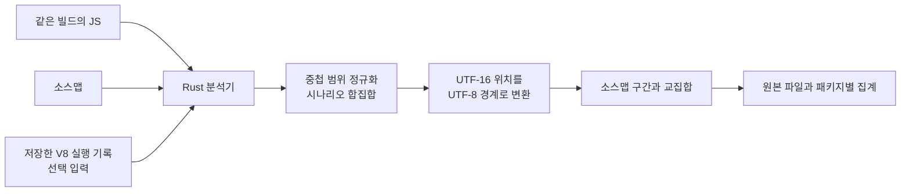

## Table of Contents

## 실행된 바이트를 세기 전에 확인할 것

[1부](/2026/09/tracing-bundle-waste-with-v8-coverage-and-sourcemaps)에서는 블로그의 첫 화면과 검색, 다이어그램 확대를 [coldpath](https://www.npmjs.com/package/@yceffort/coldpath)로 분석했다. 미실행량을 원본 파일에 연결하자 prefetch로 먼저 받은 코드와 사용 시점을 늦출 수 있는 코드를 구분할 수 있었다. 이 판단의 바탕에는 V8의 실행 기록을 생성 코드의 바이트로 바꾸는 계산이 있다.

V8이 돌려주는 범위에는 실행된 바깥 함수와 실행되지 않은 안쪽 블록이 함께 들어 있다. 이 범위를 그대로 더하면 같은 위치를 중복해서 센다. 소스맵 역시 위치를 연결할 뿐, 각 원본이 생성 코드의 몇 바이트를 차지하는지 직접 알려주지는 않는다. 두 입력을 결합하려면 먼저 어떤 단위와 규칙으로 집계할지 정해야 했다.

이 구현에서 확인하고 싶었던 것은 숫자가 그럴듯하게 나오는지를 넘어, 그 숫자가 조사할 파일을 제대로 가리키는가였다. 실제로 같은 13바이트 입력을 원본에 배분해도 DevTools의 함수는 13바이트, 이 분석기의 정책은 6바이트를 배정했다. 실행량 계산의 버그와 원본 귀속 정책의 차이를 구분하지 못하면, 수치가 다르다는 이유로 올바른 계산을 고치거나 잘못된 파일을 최적화할 수 있다.

> 기준: 구현과 검증은 [블로그 커밋 `7f33d3bc`의 초기 분석기](https://github.com/yceffort/blog/tree/7f33d3bccd6ebc71d7c26c07a2527ced07846c3b/experiments/bundle-trace)(당시 이름 `bundle-trace`)로 설명하고, [coldpath](https://github.com/yceffort/coldpath)로 분리한 뒤의 구현은 [커밋 `24a1a99`](https://github.com/yceffort/coldpath/tree/24a1a995443dc494926e9d841091e32ac7c52860), 매핑 진단은 [0.1.1](https://github.com/yceffort/coldpath/tree/v0.1.1) 기준이다. 설치와 실행 명령은 1부에 있다.

> 이 글의 검증이 보장하지 않는 것: 실행 범위의 정규화는 DevTools 구현과 별도 계산으로 대조했지만, 원본별 귀속은 이 도구가 정한 정책이어서 DevTools의 원본별 수치와 다를 수 있다. 소스맵 생성기가 원본의 의미를 정확히 보존했는지, 어떤 시나리오에서도 실행되지 않을 코드인지도 이 검증의 범위 밖이다.

## 브라우저 수집과 Rust 분석의 경계

DevTools Coverage처럼 실행 여부를 표시하려면 빌드 파일 외에 실행 기록이 필요하다. 번들에 들어 있다는 사실만으로 그 코드가 호출됐는지는 알 수 없다.

예를 들어 다음 분기의 실행 여부는 런타임 값에 달려 있다.

```js
if (globalThis.__API_MOCKING) {
  startMockServer()
}
```

이 값이 빌드할 때 정해지지 않았다면 번들러는 분기를 남길 수 있다. 나중에 번들과 소스맵을 읽는 Rust 프로그램에도 그 실행의 값은 없다. 소스맵을 아무리 자세히 읽어도 `startMockServer()`를 호출했는지는 나오지 않는다. 코드가 들어온 이유를 추적하는 것과 실행됐는지를 관찰하는 것은 별도의 작업이다.

그래서 입력을 세 가지로 나눴다.

| 입력        | 알 수 있는 것                            | 들어 있지 않은 것                         |
| ----------- | ---------------------------------------- | ----------------------------------------- |
| 생성된 JS   | 실제 전달할 코드와 그 길이               | 사용자가 어느 경로를 실행했는지           |
| 소스맵      | 생성 위치와 원본 위치의 대응             | 실행 여부, 모듈 사이의 import 그래프      |
| V8 커버리지 | 관찰 구간 동안 함수와 블록이 실행된 횟수 | 다른 사용자나 다른 입력에서도 필요 없는지 |

수집기는 Chromium에서 동작을 한 번 수행하고 V8 기록을 저장한다. Rust는 JS, map, 기록 파일만 읽는다. 이후 집계에는 브라우저도 JavaScript 런타임도 필요 없다. 커버리지를 생략하면 같은 분석기가 빌드 크기와 원본별 기여도만 계산한다.



DevTools에도 원본 파일별 커버리지를 계산하는 구현이 있다. 이번에는 **파일로 보관한 입력으로 집계 규칙과 결과를 검사할 수 있는 분석 단계**를 만들고 싶었다. Rust를 고른 것도 이 단계를 실행 파일 하나로 두기 위해서였다. JavaScript 실행은 브라우저가 맡는다.

처음 프로젝트 이름은 `bundle-trace`로 정했다. 아래는 당시의 구조다. 블로그와는 별도의 Cargo workspace이며, 분석 코드는 Next.js나 Playwright를 참조하지 않는다. 소스맵 디코딩에는 기존 `sourcemap` 크레이트를 쓰고, 커버리지 범위 처리와 문자 위치 변환, 두 결과의 결합을 구현했다.

```text
bundle-trace/
  src/main.rs         CLI 인자와 보고서 출력
  src/coverage.rs     V8 범위 정규화, 관찰 구간의 합집합
  src/text.rs         UTF-16과 UTF-8 경계와 줄 위치
  src/maps.rs         sourceMappingURL 해석
  src/attribution.rs  원본에 귀속할 생성 코드 구간
  src/lib.rs          해시 검증, 구간 교차, 집계
```

커버리지 수집용 JavaScript는 이 실행 파일의 의존성이 아니라 입력을 만드는 별도 프로그램이다. npm 배포본은 이 Rust 바이너리를 플랫폼별 패키지로 설치하고, Node.js CLI의 `npx @yceffort/coldpath analyze` 명령에서 실행한다. 아래에서 설명하는 계산은 Rust 분석기에서 수행한다. 이 경계를 확인하려고 마지막에는 저장소 밖의 임시 디렉터리에 바이너리와 기록된 검증용 예제만 복사해 실행했다. Node와 Chromium을 호출하지 않고 초기 로드와 후속 호출의 기록을 합쳐, 전체 293B 중 실행 관찰 208B와 미실행 85B를 얻었다. 아래에서 이 208B가 만들어지는 과정을 따라간다.

## V8 실행 범위의 중첩과 합집합

수집은 Chrome DevTools Protocol(CDP)의 `Profiler.startPreciseCoverage`로 시작한다. 페이지를 열기 전에 켜고, 블록 단위 기록과 실행 횟수를 요청했다.

```js
await cdp.send('Profiler.enable')
await cdp.send('Profiler.startPreciseCoverage', {
  callCount: true,
  detailed: true,
})

// 페이지 진입, 버튼 클릭 등 관찰할 동작

const {result} = await cdp.send('Profiler.takePreciseCoverage')
```

결과는 스크립트 아래 함수들이 있고, 각 함수 아래 `ranges`가 있는 구조다. 범위의 끝은 포함하지 않는다. 다음은 구조를 설명하기 위한 입력이다.

```json
{
  "functionName": "search",
  "isBlockCoverage": true,
  "ranges": [
    {"startOffset": 100, "endOffset": 200, "count": 1},
    {"startOffset": 140, "endOffset": 180, "count": 0}
  ]
}
```

이 함수는 한 번 실행됐지만 `[140, 180)`에 있는 블록은 실행되지 않았다. 실행된 길이는 100이 아니라 60이다. 바깥 범위는 기본 상태를 주고, 안쪽 범위는 그 상태를 덮어쓴다.

`isBlockCoverage`도 확인해야 한다. `detailed: true`를 요청했다고 모든 함수에 블록 정보가 생기는 것은 아니다. 실제 기록에서 호출하지 않은 함수는 전체 범위 하나와 `count: 0`, `isBlockCoverage: false`로 나타났다. 아직 실행하지 않은 함수의 내부 분기까지 기록이 있어야 한다고 요구할 이유는 없다. 반면 **실행된 함수인데 함수 단위 정보만 있다면** 어느 분기가 실행됐는지는 구분할 수 없다. 분석기는 이 경우 경고를 남긴다.

[V8의 커버리지 설명](https://v8.dev/blog/javascript-code-coverage)은 best-effort와 precise 수집을 구분한다. 이번 분석은 precise 기록을 입력으로 삼았다. 또 [CDP 정의](https://github.com/ChromeDevTools/devtools-protocol/blob/14748336eee2ebdf69a811c1360fbf53f12a238e/json/js_protocol.json)의 `startPreciseCoverage`에는 최적화된 코드의 실행을 막는다는 설명이 있다. 커버리지를 켠 채 측정한 실행 시간을 평소의 실행 시간처럼 취급해서는 안 되는 이유다. 뒤의 전송량 확인은 커버리지와 별도로 실행했다.

### 중첩된 범위에서 실행량 계산하기

처음 생각하기 쉬운 계산은 두 가지다. 실행된 범위를 전부 더하거나, 실행되지 않은 범위를 합쳐 전체에서 빼는 것이다. 앞의 방식은 중복으로 세고, 뒤의 방식은 더 안쪽에 있는 실행 범위를 잃을 수 있다.

아래는 이 차이를 확인하기 위해 만든 중첩 범위 테스트다. 실제 블로그 기록을 축약한 것이 아니라, 집계 규칙을 검증하기 위한 입력이다.

```text
[0, 100)    count=1
  [10, 90)  count=0
    [20, 40)  count=1
      [25, 30)  count=0
```

바깥의 실행 범위 길이는 100이다. 그러나 그 안에서 80이 미실행으로 바뀌고, 다시 그 안에서 20이 실행으로 바뀌며, 그중 5가 미실행으로 바뀐다. 답은 35다. 이를 실제로 겹치지 않는 구간으로 펴면 계산이 더 분명해진다.

| 구간        | 적용할 상태                | 실행 길이 |
| ----------- | -------------------------- | --------: |
| `[0, 10)`   | 가장 바깥의 실행 상태      |        10 |
| `[10, 20)`  | 두 번째 범위의 미실행 상태 |         0 |
| `[20, 25)`  | 세 번째 범위의 실행 상태   |         5 |
| `[25, 30)`  | 가장 안쪽의 미실행 상태    |         0 |
| `[30, 40)`  | 세 번째 범위로 복귀        |        10 |
| `[40, 90)`  | 두 번째 범위로 복귀        |         0 |
| `[90, 100)` | 가장 바깥으로 복귀         |        10 |

Rust에서는 시작 위치 순으로 범위를 정렬하고, 시작점이 같으면 큰 범위를 먼저 둔다. 스택 맨 위에 현재 위치를 소유한 범위를 둔다. 새 범위가 시작되기 전에 끝난 범위는 꺼내고, 새 범위 안으로 들어가면 그 상태를 적용한다. 안쪽 범위가 끝나면 스택 아래에 있던 부모 상태로 돌아간다.

이 구조에서 중요한 것은 함수별로 길이를 따로 더하지 않는 것이다. 함수 본문 안에 다른 함수가 선언될 수 있으므로 함수 사이에도 위치가 겹친다. 스크립트의 모든 범위를 같은 좌표계에 놓고 처리해야 한다.

정렬 이후 순회는 범위 수에 비례한다. 정렬을 포함하면 범위 수를 R이라고 할 때 O(R log R)이다. 문자열의 모든 바이트에 실행 여부를 저장하지 않고, 상태가 바뀌는 경계만 유지한다. 반대로 일부만 걸쳐서 교차하는 범위는 이 중첩 모델로 설명할 수 없으므로 오류로 처리했다. 입력이 잘못됐는데도 그럴듯한 합계를 내는 것보다 어느 가정이 깨졌는지 드러내는 편이 낫다.

### 두 번째 수집에 남는 정보

`takePreciseCoverage`는 수집할 때 실행 카운터를 초기화한다. 두 번째 호출에는 직전 수집 이후의 기록이 남는다. [V8 구현의 `CollectBlockCoverage`](https://github.com/v8/v8/blob/4615af981a0b4775e01481d9fc3bfed02c5f8a68/src/debug/debug-coverage.cc)는 블록 정보를 수집한 뒤 카운터를 0으로 돌린다.

이를 확인하려고 작은 검증용 예제를 만들었다.

```js
export function makeFeature() {
  return function later(flag) {
    return flag ? '한🔥' : '다른 경로'
  }
}

// 초기 로드에서 실행한다.
const run = makeFeature()

// 첫 수집 이후에 실행한다.
run(true)
```

실제 검증용 예제는 esbuild로 번들링하고 축소한 뒤 Chromium에서 실행했다. 첫 수집에서는 바깥 함수가 실행됐고, 나중에 호출할 함수는 실행되지 않았다. 두 번째 수집에서는 나중 함수가 실행됐지만 바깥 함수의 기록은 아예 빠졌다. 위치는 다음과 같았다.

```text
첫 수집
  바깥 함수 [6, 62)    count=1
  나중 함수 [26, 61)   count=0

두 번째 수집
  나중 함수 [26, 61)   count=1
    선택하지 않은 분기 [52, 60) count=0
  바깥 함수의 항목은 없음
```

두 번째 결과에는 바깥 함수를 `count: 0`으로 둔 항목도 없었다. 이번 Chromium은 해당 항목을 생략했다. 따라서 범위의 출현 여부나 실행 횟수 배열을 그대로 덮어쓰는 방식으로 누적 상태를 만들 수 없다.

먼저 **각 수집 결과 안에서** 중첩을 해소하고, 그다음 실행 구간들의 합집합을 구했다. 여러 시나리오도 같은 방식으로 합친다. 목적은 호출 횟수의 합이 아니라 적어도 한 번 관찰한 위치의 집합이다.

| 검증용 예제 기록 | 실행된 UTF-16 코드 유닛 | 실행된 UTF-8 바이트 |
| ---------------- | ----------------------: | ------------------: |
| 초기 로드        |                     177 |                 177 |
| 후속 호출 구간만 |                      27 |                  31 |
| 두 기록의 합집합 |                     204 |                 208 |

두 번째 기록만 보고 초기화 코드를 미실행이라고 표시하면, 이번 관찰 구간에서는 맞아도 페이지 전체 사용 여부를 설명할 때는 틀린 답이 된다. 수집의 시작과 끝도 결과의 일부여야 한다.

## UTF-16 오프셋을 UTF-8 바이트로 바꾸기

위 표에서 UTF-16 코드 유닛 27개가 UTF-8 바이트 31개가 된 것은 `한🔥`의 인코딩 길이가 다르기 때문이다.

V8의 소스 오프셋은 UTF-16 코드 유닛을 기준으로 한다. JavaScript 소스맵의 생성 열도 같은 단위를 쓴다. Rust의 `str`에서 범위를 자를 때 쓰는 인덱스는 UTF-8 바이트다. ASCII 번들로만 시험하면 이 차이가 숨는다.

`한🔥x`를 예로 들면 경계가 이렇게 달라진다.

| UTF-16 위치 |     UTF-8 위치 | 의미                      |
| ----------: | -------------: | ------------------------- |
|           0 |              0 | 문자열 시작               |
|           1 |              3 | `한` 다음                 |
|           2 | 변환할 수 없음 | `🔥`의 서로게이트 쌍 중간 |
|           3 |              7 | `🔥` 다음                 |
|           4 |              8 | `x` 다음                  |

`[1, 3)`은 UTF-16에서는 길이 2지만, UTF-8로 바꾸면 `[3, 7)`이고 길이 4다. 오프셋에 숫자를 그대로 넣으면 문자 경계를 깨거나 다른 코드를 집계한다.

그래서 초기 구현에서는 파일을 한 번 순회하며 UTF-16 경계에서 UTF-8 경계로 가는 테이블을 만들었다. 당시 `src/text.rs`의 핵심은 다음과 같다. 서로게이트 쌍의 중간에는 유효한 바이트 위치 대신 `None`을 넣는다.

```rust
let mut boundaries = vec![Some(0)];
for (byte, ch) in text.char_indices() {
    if ch.len_utf16() == 2 {
        boundaries.push(None);
    }
    boundaries.push(Some(byte + ch.len_utf8()));
}
```

커버리지 범위를 이 테이블로 변환한 뒤 바이트를 센다. 줄과 열 위치를 변환하기 위해 줄의 시작과 끝도 따로 기록한다. CRLF에서는 두 코드 유닛을 소비하지만 줄은 한 번만 바뀌어야 한다. 열 번호가 그 줄을 넘어가거나 서로게이트 쌍의 중간을 가리키면 유효한 위치로 취급하지 않는다. 이후 coldpath의 `TextIndex`는 메모리 사용을 줄이려고 비ASCII 문자 주변의 보정값만 저장하도록 바꿨지만, 유효한 문자 경계를 확인하는 규칙은 유지했다.

여기서 출력 지표도 정했다. 주 지표는 **생성된 JS의 UTF-8 바이트**다. DevTools 계산과 비교하기 위한 UTF-16 길이는 별도 필드에 남겼다. 압축 전 파일 크기를 설명하면서 JavaScript 문자열 길이를 바이트라고 부르는 혼동을 피하고 싶었다.

## 소스맵으로 원본 파일별 크기 계산하기

실행 구간을 복원해도 아직 원본 파일 이름은 없다. V8은 생성된 스크립트를 실행했으므로, 커버리지 역시 생성된 스크립트의 좌표를 돌려준다. 원본 TypeScript로 돌아가려면 같은 빌드의 소스맵이 필요하다.

[ECMA-426](https://tc39.es/ecma426/)의 소스맵에는 생성 위치와 원본 위치를 연결하는 매핑이 있다. 보통 `mappings` 문자열에 가변 길이 정수 인코딩인 VLQ로 저장되어 있고, 디코딩하면 다음과 같은 점들이 나온다.

```text
생성 (0행, 10열) → sources[0]의 (3행, 2열)
생성 (0행, 25열) → sources[1]의 (8행, 0열)
생성 (1행,  4열) → sources[0]의 (5행, 0열)
```

여기에는 "첫 번째 원본이 생성 코드의 15바이트를 소유한다"는 필드가 없다. 매핑 지점 사이를 어떤 원본에 배정할지는 집계기가 결정해야 한다. 원본 파일의 `sourcesContent` 길이를 더하는 것도 답이 아니다. 원본에서 삭제된 코드와 변환 과정에서 추가된 코드가 있을 수 있기 때문이다.

이번 도구에서는 **한 매핑 지점부터 같은 줄의 다음 매핑 지점까지**를 그 원본에 배정했다. 같은 줄에 다음 매핑이 없으면 줄 끝에서 멈춘다. 첫 매핑 전의 접두부, 줄바꿈, 원본 정보가 없는 매핑, 매핑이 전혀 없는 줄은 `[unmapped]`에 둔다.

이것도 추정이다. 같은 줄 안에서 매핑 두 개 사이에 변환기가 만든 구문이 끼어 있으면 앞쪽 원본에 붙을 수 있다. `[unmapped]`를 두었다고 나머지 귀속이 의미적으로 정확하다는 보장이 생기는 것은 아니다.

### 같은 소스맵, 다른 귀속 정책

정책 차이를 확인하기 위해 다음 문자열을 그대로 파일에 썼다. 세미콜론 두 개와 LF 한 개를 포함하며 마지막 줄바꿈은 없다. 바이트 수를 비교하는 입력이므로 포매터가 코드를 바꾸지 않도록 문자열로 표시한다.

```text
const source = "foo();\nbar();"
```

파일은 ASCII 13바이트다. map에는 첫 줄 첫 열이 `a.ts`로 연결된다는 매핑 하나만 넣었다.

```json
{
  "version": 3,
  "sources": ["a.ts"],
  "names": [],
  "mappings": "AAAA",
  "sourcesContent": ["foo()"]
}
```

`AAAA`의 네 값은 모두 0이다. 첫 생성 열, 원본 파일 인덱스, 원본 행, 원본 열의 초기 위치를 나타낸다. 두 번째 줄에는 매핑이 없다.

이 입력을 Rust 분석기에 넣고, DevTools의 `calculateSizeForSources`를 추출해 최소한의 SourceMap/Text 어댑터로 같은 경계를 전달했다. [비교한 구현](https://github.com/ChromeDevTools/devtools-frontend/blob/63555438dd48b3cdecaa6293b01c446d86176d42/front_end/panels/coverage/CoverageModel.ts)은 마지막 매핑의 구간을 전체 콘텐츠 끝까지 계산한다.

| 집계                 | `a.ts`에 귀속 | 원본 미지정 |
| -------------------- | ------------: | ----------: |
| DevTools의 해당 함수 |            13 |           0 |
| 이번 Rust 정책       |             6 |           7 |

ASCII만 있으므로 인코딩 차이는 아니다. 마지막 매핑 이후를 어디까지 그 원본에 배정하느냐의 차이다. 이 실험으로 DevTools의 원본별 크기가 틀렸다고 결론 낼 수는 없다. **같은 소스맵으로 원본별 크기를 구해도 집계 정책이 다르면 다른 수치가 나온다**는 것을 확인한 것이다.

그래서 이 도구가 DevTools와 호환된다고 말할 수 있는 범위는 실행 범위의 정규화까지다.

### 실행 구간과 원본 구간의 교집합

이제 생성 파일 위에 두 종류의 겹치지 않는 구간이 생긴다. 하나는 실행된 위치이고, 다른 하나는 원본 파일에 귀속한 위치다. 같은 UTF-8 좌표로 바꾼 뒤 교집합의 길이를 더하면 된다.

```text
원본 A의 구간: [0, 12)
원본 B의 구간: [12, 20)
실행된 구간:  [5, 16)

A에서 관찰한 길이: [5, 12) → 7
B에서 관찰한 길이: [12, 16) → 4
```

각 쌍의 겹친 길이는 `min(끝) - max(시작)`이며, 음수라면 0이다. 구현에서는 정렬된 실행 구간을 따라가며 이미 지나간 구간을 다시 보지 않는다. 원본 구간마다 실행된 길이를 더하고, 그 원본 구간의 나머지를 미실행으로 둔다.

단, 그 스크립트에 커버리지 기록이 없으면 상태가 다르다. 실행되지 않았다고 판정할 근거 자체가 없으므로 전부 **미측정**이다.

```text
원본에 귀속한 전체 바이트
  = 실행 관찰 바이트 + 미실행 바이트 + 미측정 바이트
```

이 등식은 원본 파일, 패키지, 번들, 전체 합계에서 모두 성립해야 한다. 패키지별 표만 보기 좋게 나와도 합계가 다르면 어딘가에서 바이트를 잃거나 중복으로 센 것이다. 원본 미지정 영역도 같은 방식으로 집계해서 합계에서 사라지지 않게 했다.

### 합계 검사로 놓칠 수 있는 섹션 경계

리뷰하면서 이 등식만으로 잡히지 않는 오류를 찾았다. 여러 map을 `sections`로 연결한 indexed map을 일반 map으로 평탄화해서 처리하고 있었다. 그런데 섹션 시작점과 그 섹션의 첫 매핑은 같은 위치일 필요가 없다.

10바이트인 `abcdefghij`에서 첫 섹션은 0열부터 `a.ts`에 연결하고, 두 번째 섹션은 5열에서 시작하되 첫 매핑은 그 안의 2열, 즉 전체 7열부터 `b.ts`에 연결하도록 했다. 평탄화된 매핑 목록에는 0열과 7열만 남았다. 이전 구현은 그 사이를 전부 `a.ts`에 붙였다.

| 구간      | 섹션을 보존한 귀속 | 이전 구현의 귀속 |
| --------- | ------------------ | ---------------- |
| `[0, 5)`  | `a.ts`             | `a.ts`           |
| `[5, 7)`  | `[unmapped]`       | `a.ts`           |
| `[7, 10)` | `b.ts`             | `b.ts`           |

두 결과 모두 합계는 10바이트였다. 실행량까지 같아도 파일별 수정 우선순위는 틀릴 수 있는 것이다. 같은 `sourcemap` 크레이트에 평탄화 전의 5열과 6열을 조회하면 원본이 없다고 나왔다. 디코더가 알려주던 경계를 집계 준비 과정에서 내가 버린 문제였다.

섹션을 재귀적으로 순회하면서 시작점에 원본 미지정 경계를 먼저 넣고, 실제 매핑이 같은 위치에 있으면 덮어쓰도록 고쳤다. 빈 섹션도 경계는 남긴다. 중첩 섹션의 줄과 열의 이동과 다음 섹션을 침범하는 입력도 검사했다. 이것은 표준이 바이트 소유권까지 정해준다는 뜻이 아니라, 내가 정한 보수적 귀속 정책을 섹션 안에서도 유지하기 위한 처리다.

## 실제 빌드의 소스맵과 실행 기록 연결하기

JS와 소스맵은 파일 끝의 `sourceMappingURL`로 연결한다. 실제 Turbopack 결과에는 JS와 map의 해시 이름이 다른 파일이 있었다. `같은 이름.js.map`을 찾는 방식으로는 이 연결을 놓친다.

```js
//# sourceMappingURL=2-mqq3lqx17rw.js.map
```

매핑 위치도 줄 단위로 검사한다. 초기 분석용 빌드에서는 첫 줄의 UTF-16 길이가 12,912인데 마지막 매핑 열이 12,914인 청크를 만났다. 전체 파일 기준으로 12,914가 범위 안이라고 통과시키면 다음 줄에 있는 바이트를 앞줄의 원본에 붙이게 된다. 파일 범위 검사만으로 부족하고, **그 줄의 끝을 기준으로** 검사해야 했다.

이번 구현은 이런 매핑 지점을 제외하고 경고를 남긴다. 줄 끝으로 강제로 당기거나 다음 줄로 넘기지 않는다. 생성기 내부의 원인은 추적하지 않았다.

제외한 개수만으로는 어떤 원본의 수치를 더 살펴봐야 하는지 알기 어렵다. [이슈 #16](https://github.com/yceffort/coldpath/issues/16)을 반영한 0.1.1에서는 `mappingDiagnostics`에 제외한 좌표, 인접한 유효 매핑, 검사할 생성 구간과 현재 귀속을 남긴다. `inspectRegion`은 오류가 입증된 범위가 아니라 주변 코드를 확인할 범위다. 좌표를 강제로 고치거나 집계에서 바이트를 더 빼지는 않는다.

1부의 입력을 같은 JS와 소스맵 해시로 복원해 재계산하자 `SiteSearch.tsx`의 값은 그대로였다. 같은 청크에서 제외한 3개 매핑은 모두 `Provider.tsx`를 가리켰고, 검사 구간 `[70722, 70723)`은 검색 파일에 귀속한 바이트와 겹치지 않았다. 번들 합계의 일치와 별도로 경고의 위치를 대조한 결과이며, [재계산 자료](/demos/coldpath/recalculation-0.1.1-2026-09-25.md)에 좌표와 해시를 남겼다.

실행 기록과 빌드가 같은지도 확인해야 한다. 예를 들어 커버리지가 `[100, 200)`을 실행했다고 해도, 그 사이 코드가 바뀐 새 빌드에서는 전혀 다른 의미다. 파일 길이가 같아도 안전하지 않다. 생성 코드의 순서, 축소한 식별자, 청크 경계 중 하나만 달라져도 위치가 바뀐다.

수집 시 브라우저가 읽은 소스를 `Debugger.getScriptSource`로 가져와 디스크의 JS와 SHA-256을 비교했다. 기록에 JS와 map의 해시를 넣고, Rust가 읽을 때도 둘 다 검사한다. JS만 같고 map만 다른 경우 역시 원본 귀속이 바뀌므로 거부한다.

이 제약은 "빌드할 때 분석한다"는 목표에 직접 영향을 준다. **어제 실행한 커버리지를 오늘 바뀐 번들에 그대로 붙일 수 없다.** 이번 도구는 그 이동을 추정하지 않는다. 새 빌드에 대한 실행 정보를 원하면 새 기록이 필요하다. 브라우저 없는 환경에서 확실하게 할 수 있는 일은 정적 크기 분석과, 같은 빌드에 묶인 기록의 재분석이다.

## 입력 형식에 따라 검증한 범위 표시하기

분석기는 전용 수집기의 JSON 외에 Chrome export 형태의 `{url, text, ranges}[]`, Playwright의 커버리지 결과, 원본 V8의 `{result: [...]}`도 읽는다. 로컬 파일에 있는 소스맵과 함께 인라인 소스맵도 처리한다. 입력 형식이 달라질 때 중요한 것은 각 기록에 어떤 검증 근거가 들어 있는가다.

[Playwright의 JavaScript 커버리지](https://playwright.dev/docs/api/class-coverage#coverage-stop-js-coverage)에는 `source`가 포함될 수 있다. Chrome export의 `text`도 로컬 JS와 내용을 비교하는 데 쓸 수 있다. 그러나 두 형식에는 전용 수집기처럼 수집 당시 map의 SHA-256을 함께 보관한 증거가 없다. JS의 내용 일치와 map의 출처 검증을 따로 표시해야 한다.

그래서 각 기록에 코드 검증과 map 검증을 따로 남겼다. 전용 입력은 `sha256 / capture-bound`, 코드가 있는 표준 입력은 `source-text / unverified`다. 원본 V8처럼 코드 본문도 해시도 없는 기록은 기본적으로 거부하고, 사용자가 `--allow-unverified`를 명시했을 때만 읽는다. 이 옵션을 켜도 이미 주어진 코드나 해시가 다르면 실패한다. 검증할 증거가 없는 것과 증거가 불일치하는 것은 다르기 때문이다.

실제 Playwright와 `NODE_V8_COVERAGE`로 같은 293B 예제를 실행했다. 초기 실행의 관찰량은 두 입력 모두 177B였고 전용 기록과 같았다. Chrome export 형태의 입력은 별도의 코드 유닛 배열 검산으로 실행 범위를 만들어 넣었다. 이 입력도 177B였지만, DevTools UI에서 내보낸 파일을 검증한 것은 아니다. 같은 답을 내면서 입력별 검증 상태는 구분해 남겼다.

## 코드 위치를 보존하고 필요한 청크만 펼치기

HTML 보고서에서 미실행 코드를 열려면 원본별 합계 외에 생성 코드의 위치가 필요하다. 보고서 v2에는 **청크 → 원본 파일 → 생성 코드 구간**을 남겼다. 각 구간에 UTF-8 바이트 범위와 UTF-16 범위를 모두 저장한다. Rust의 문자열을 자르는 위치와 HTML 안의 JavaScript가 문자열을 자르는 위치가 다르기 때문이다. `한🔥x`의 가운데 이모지는 Rust에서 `[3, 7)`, JavaScript에서 `[1, 3)`이다. 바이트 범위 `[3, 7)`을 그대로 `slice()`에 넘기면 다른 코드에 색을 칠하게 된다.

원본 화면에는 소스맵의 매핑 지점과 주변 코드를 보여준다. 생성 구간에 대응하는 원본 위치는 매핑 지점이므로, 원본 줄 전체의 실행 여부로 확대하지 않는다. 선택 위치는 파란색으로, 생성 코드의 실행 관측은 초록색으로 구분한다. `sourcesContent`가 없는 map은 위치만 보여주고 원본 내용을 추측해서 채우지 않았다.

이 상세 정보는 크기가 커질 수 있다. 7.25MB의 블로그 생성 코드에서 위치와 필드 이름을 반복한 상세 JSON은 약 517MiB였다. 이를 읽던 Node 검산 스크립트가 `RangeError: Invalid string length`로 중단됐다. 그래서 기본 JSON에는 합계와 청크별 원본 연결을 남기고, 코드와 구간은 `--details`로 요청하도록 했다. HTML은 구간을 숫자 배열로 직렬화하고 gzip/base64로 담아 약 28MiB로 저장한다.

압축은 파일 크기를 줄이지만, 모든 상세 데이터를 한꺼번에 압축 해제하면 객체를 만드는 비용은 남는다. 보고서는 첫 화면에서 파일명, 패키지명, 합계만 파싱하고, 코드를 열 때 선택한 청크의 생성 코드와 원본 내용, 구간을 함께 압축 해제한다. 다른 청크로 이동하거나 탐색을 닫으면 이전 상세 데이터의 참조를 놓는다. 큰 청크의 구간 목록은 나누어 표시하고 선택 위치 주변만 렌더링한다.

첫 화면에서 상세 청크를 하나도 디코딩하지 않는지, 선택 후 하나만 디코딩하는지, 닫았다 다시 열면 재디코딩하는지를 검사했다. 같은 보고서를 로컬 Chromium에서 한 번 측정했을 때 GC 뒤의 JS 힙은 첫 화면 약 2.0MB, MiniSearch 원본 선택 후 약 4.9MB였다. HTML 파일은 약 28MiB이며 인코딩된 데이터는 계속 DOM에 남는다. 이 값은 프로세스 전체 메모리나 최고 사용량이 아니다. 측정한 로딩 시간과 힙 표본은 `results/report-size.json`에 남겼다.

완성한 HTML은 서버 없이 열 수 있다. 브라우저 테스트에서는 청크와 원본 선택, 미실행 구간 이동, 원본 위치, 패키지명 검색, 모바일 너비를 확인했다. 소스에 `</script><script>…`가 들어간 경우에도 보고서의 코드가 되지 않고 텍스트로 남는지 검사했다. 압축하지 않은 JSON을 HTML 안에 넣을 때는 `<`를 이스케이프하고, 코드 표시는 `textContent`로 처리했다.

## 별도 계산과 DevTools 구현으로 결과 검증하기

검증에는 직접 계산한 기대값, 별도 JavaScript 계산, DevTools 구현을 사용했다.

먼저 작은 입력에서 기대값을 직접 계산했다. 중첩 범위, 시나리오 합집합, Unicode, CRLF, map의 구간 경계, 해시 불일치 등을 Rust 테스트에 넣었다. 합계만 확인하지 않고 어떤 구간이 남아야 하는지도 확인했다.

그다음 실제 Chromium 기록을 별도의 JavaScript 계산에 넣었다. 검산 코드는 UTF-16 코드 유닛마다 배열 한 칸을 만들고 큰 범위부터 작은 범위 순서로 실행 상태를 덮어쓴다. 이후 문자열을 문자 단위로 읽으며 UTF-8 바이트를 다시 센다. 느리지만 Rust의 구간 순회와 다른 방식으로 답을 구할 수 있다.

마지막으로 DevTools 소스의 `convertToDisjointSegments`를 추출해 같은 기록을 넣었다. 비교한 리비전은 `63555438dd48b3cdecaa6293b01c446d86176d42`로 고정했다. 타입과 메서드 선언을 실행할 수 있게 바꿨고 함수 본문은 유지했다. DevTools 화면 전체를 자동화한 검증은 아니다. **그 구현의 범위 정규화 함수**와 대조한 것이다.

`[0, 5)`를 실행한 답과 `[5, 10)`을 실행한 답은 ASCII 실행량이 모두 5바이트다. 길이만 비교하면 잘못된 위치에 색을 칠해도 검증을 통과한다. 이를 잡기 위해 같은 크기의 실행 구간을 다른 위치로 옮긴 입력을 만들고, 이 입력에서는 비교가 반드시 실패하는지 확인했다.

Rust의 상세 구간을 상태별 연속 구간으로 합쳐 DevTools와 별도 배열 검산이 만든 **각 구간의 시작과 끝, 상태**와 대조한다. 생성 코드의 UTF-16 경계가 실제 UTF-8 바이트 경계와 같은 위치인지도 확인한다. 소스맵 때문에 세분화된 경계는 합쳐 비교하되 실행 상태가 달라지는 경계는 보존한다. 원본 귀속의 정확성은 별도 문제여서 앞의 섹션 반례처럼 따로 검사해야 한다.

기본 빌드의 첫 진입, prefetch 차단, 소개 페이지 이동, 검색, 동적 import 빌드의 첫 진입과 검색까지 여섯 시나리오에서 77건의 스크립트 구간 분할을 확인했다. 같은 파일을 여러 시나리오에서 확인한 건수도 포함한다. 실행 구간과 미실행 구간의 위치와 UTF-8 환산 경계가 모두 일치했다.

| 기본 빌드 첫 진입의 실행량            |      값 |
| ------------------------------------- | ------: |
| DevTools 함수로 구한 UTF-16 코드 유닛 | 278,325 |
| Rust가 따로 보관한 UTF-16 코드 유닛   | 278,325 |
| Rust의 주 지표인 UTF-8 바이트         | 278,485 |

마지막 두 값의 160 차이는 집계 오류가 아니라 문자열 단위 차이다. 앞에서 본 소스맵 귀속 정책 차이까지 더하면, "DevTools 화면의 수치와 다르다"는 사실만으로 무엇이 틀렸는지 알 수 없다. 실행 범위, 문자 단위, 원본 귀속을 나눠 비교해야 한다.

[검산 코드와 결과](https://github.com/yceffort/blog/tree/7f33d3bccd6ebc71d7c26c07a2527ced07846c3b/experiments/bundle-trace)는 실험 디렉터리에 남겼다.

## 실험 디렉터리에서 독립 도구로

`bundle-trace`는 9월 22일 블로그 저장소의 `experiments/bundle-trace`에서 시작했다. 다음 날 [독립 저장소로 옮기면서](https://github.com/yceffort/coldpath/commit/537b085) 시나리오별 분석과 이전 보고서와의 비교, 번들러 그래프 입력을 붙였다. 9월 25일에는 수집과 그래프 변환, 분석을 [명령 하나로 묶어 패키지로 만들고](https://github.com/yceffort/coldpath/commit/5fcd1a0) 이름을 coldpath로 바꿔 npm에 배포했다. 소스맵 없는 외부 사이트를 분석하는 `snapshot`, `modules`, `label`도 같은 날 추가했고, 9월 26일의 0.3.1에서 `modules`의 모듈 복원을 보강했다.

기능이 늘어도 처음에 정한 경계는 그대로 뒀다. 브라우저를 띄우거나 모델을 호출하는 일처럼 JavaScript 런타임이 필요한 작업은 Node.js CLI(`bin/coldpath.mjs`)가 맡고, 집계는 파일만 읽는 Rust 분석기가 맡는다.

<iframe src="/demos/coldpath/coldpath-architecture-2026-09-26.html" title="coldpath 0.3.1의 구조" width="100%" height="980" loading="lazy" frameBorder="0"></iframe>

[coldpath 구조도 새 창에서 열기](/demos/coldpath/coldpath-architecture-2026-09-26.html)

Node.js 쪽 명령은 네 가지다. `collect`와 `snapshot`은 Playwright로 Chromium을 열고 CDP로 V8 커버리지를 받는다. 로컬 빌드를 분석할 때는 브라우저가 읽은 JS와 소스맵의 해시를 기록에 남기고, 외부 사이트를 분석할 때는 스크립트 본문을 파일로 저장한다. `graph`는 esbuild, webpack, Rollup/Vite, Turbopack의 분석 결과를 coldpath가 읽는 `graph.json`으로 바꾸고, `modules`는 소스맵이 없는 webpack 청크에서 모듈 경계를 찾아 합성 소스맵을 만든다. `label`은 모듈의 코드 일부를 모델에 보내 이름을 추정한다.

`analyze`는 `--maps-json` 같은 파일 연결 옵션을 풀어 준 뒤 나머지 인자를 Rust 분석기에 넘긴다. CLI는 `COLDPATH_ANALYZER` 환경 변수, 함께 설치된 플랫폼 패키지(`@yceffort/coldpath-<platform>-<arch>`), `PATH`의 순서로 바이너리를 찾는다. 분석기 안에서는 `coverage.rs`와 `text.rs`가 실행 범위를 정규화하고 UTF-8 위치로 바꾸며, `attribution.rs`와 `scenario.rs`, `baseline.rs`가 원본 귀속과 시나리오별 집계, 이전 보고서와의 비교를 맡는다. 결과는 `report.rs`가 JSON과 Markdown, HTML로 쓴다. GitHub Action은 이 보고서로 PR의 크기 변화를 비교하고 댓글을 남긴다. 앞에서 다룬 범위 정규화와 원본 귀속은 이 구조의 가운데 두 단계에 해당한다.

## 실행 범위와 원본 귀속의 검증 범위

이 분석기는 생성된 JavaScript 위에서 실행을 관찰한 구간을 복원하고, 소스맵의 위치를 기준으로 그 바이트를 원본 파일에 배분한다. 직접 구현하며 확인한 것은 검증에도 같은 구분이 필요하다는 점이다. 합계가 맞는다는 테스트만으로는 실행 구간의 위치나 원본 파일의 배정을 보장할 수 없었다.

그래서 coldpath의 결과를 확인할 때는 실행 구간, 문자 단위, 원본 귀속, 빌드 일치를 각각 대조한다. 다른 도구와 실행량이 다르면 UTF-16과 UTF-8 중 무엇을 셌는지부터 확인하고, 합계는 같은데 파일별 값만 다르면 소스맵의 경계를 어디까지 배정했는지 살펴본다. 아예 다른 빌드의 기록이라면 이 비교를 시작하기 전에 거부한다. 독립된 작은 입력과 별도 계산은 이 차이를 구분하기 위한 검증이었다.

이렇게 계산한 결과로 첫 화면에 들어온 코드와 나중 동작에서 실행된 코드를 구분할 수 있다. 그 코드를 삭제해도 되는지, 동적 import로 옮기면 얼마나 줄어드는지는 실제 사용 경로와 변경 후 빌드로 확인해야 한다. [1부의 검색 라이브러리 실험](/2026/09/tracing-bundle-waste-with-v8-coverage-and-sourcemaps)에서도 커버리지로 찾은 후보와 실제 응답 본문의 감소량은 달랐다. 그래서 coldpath의 바이트는 조사할 코드를 고르는 근거로 쓰고, 변경의 효과는 변경 후 빌드로 따로 확인하려 한다.

직접 빌드하지 않은 사이트에는 같은 입력을 준비할 수 없다. 다음 글에서는 [소스맵 없이 토스증권의 JavaScript를 추적한 과정](/2026/09/tracing-third-party-javascript-without-sourcemaps)을 다룬다. 생성 코드에서 모듈 경계를 복원하면 이 계산을 재사용할 수 있지만, 원본 파일명과 패키지의 정체를 확인하는 데에는 다른 근거가 필요하다.
