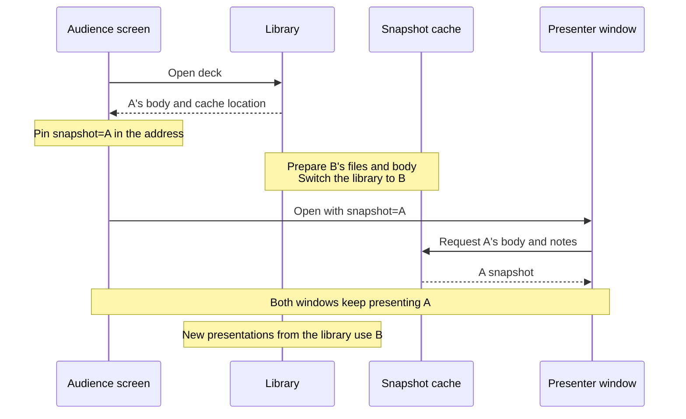

Ahead of FEConf 2026, the organizers asked speakers to prepare their materials so they could present without an internet connection. That request was the push I needed to add offline saving to [research](https://research.yceffort.kr), where I publish my presentation decks.

research converts Markdown with Marp and feeds the result into a React viewer I built myself. It has slide transitions and Mermaid diagrams, and the presenter view, opened in a separate window, shows notes, a timer, and a preview of the next slide. I wanted all of that to work offline as well.

The starting point was to save, ahead of time in the browser, the deck data and the executable files the existing viewer already uses. The user picks a deck, it downloads completely, and the same viewer opens it even after the connection drops. Then I added automatic updates for decks, and along the way I had to rework how new deployments are picked up and how an ongoing presentation is kept intact.

> The final implementation is based on `a16ccab2` on `main`, checked on September 30, 2026. It uses the Next.js 16.3.5 App Router. Code and paths in the design explanations reflect the current implementation, and parts that changed along the way link to the commits of that time. The comparison experiment, screenshots, and regression tests were run against a build of the final commit. Results from actually using it at FEConf are not included.

## Saving the existing viewer and decks in the browser

[The service worker I added to this blog earlier](/2026/08/service-worker-caching-2) kept responses obtained while browsing. A presentation deck needs even the slides you haven't flipped to yet. So instead of relying on site visits, I built a feature where the user chooses a deck and saves it.

**A single deck, from its first slide to its last, is one unit of storage.** For example, choosing `feconf-2026-vendor-sdk` downloads its body, theme, presenter notes, and the collected images and fonts together. Saving deck A doesn't download deck B's body, but the JS and CSS that run the viewer are shared across decks.

I also split storage according to two jobs: looking up decks and answering file requests. IndexedDB is used to read and replace deck records keyed by `slug`. Cache Storage keeps a `Response` for each URL so the service worker can answer image and executable file requests with it directly.[^1][^2]

| What is stored                                          | Where                            | Used by                              |
| ------------------------------------------------------- | -------------------------------- | ------------------------------------ |
| Per-slide HTML, CSS, font declarations, notes, metadata | `decks` in IndexedDB             | Library and slide viewer             |
| The deck's images and font files                        | Per-deck Cache Storage           | Service worker file responses        |
| Shared HTML, JS, CSS, and fonts                         | Per-viewer-version Cache Storage | Starting the viewer without a server |

That was the initial storage layout. Keeping one more copy of each deck's body and pinning the version being presented came later, while fixing the presenter window problem described below.[^3]

### Finish the Marp conversion on the server and save the result

The online viewer receives the output of the server's `generateRenderedMarp()`. It runs Marp with `htmlAsArray: true` to get HTML per slide and returns the theme CSS, font declarations, and presenter notes along with it. To use the same viewer offline, I decided to save the result of this server work.[^4]

`/api/slides/[slug]/offline` calls the same render function as the online viewer and returns JSON of the following shape.[^5]

```ts
export interface OfflineDeck {
  schemaVersion: 1
  slug: string
  title: string
  description?: string
  html: string[]
  css: string
  fonts: string[]
  notes: string[]
  post?: string
  transition?: TransitionType
}
```

`html` holds each slide's HTML, `css` the theme and slide styles, and `notes` the presenter notes per slide. `fonts` holds `@font-face` declarations, not the font files themselves. The files have to be downloaded separately by finding the URLs inside those declarations.

On the server, the CSS `@import`s are expanded first, and relative URLs inside them are turned into absolute URLs based on the original stylesheet's address. Then `@font-face` is split out. This keeps a `./font.woff2` referenced by an external font CSS from being misresolved against research's own paths.

In the browser, `collectDeckAssets()` inspects **the rendered output of every slide** along with the CSS and font declarations. Looking only at the DOM on screen would miss files on slides you haven't reached yet. Marp's output also contains images inside SVG and background images, so besides `img.src` it collects `href`, `xlink:href`, `srcset`, and CSS `url()`.[^6]

Downloaded files are stored under addresses unique to each saved copy. It generates a UUID, rewrites asset URLs to `/offline-assets/{id}/{index}`, and rewrites the references in the HTML, CSS, and font declarations to match.

Consider two decks that both use `/images/architecture.png`. If the cache were keyed by the original URL and overwritten, updating one deck would change the image in the other one too. Separating addresses and caches per saved copy lets the two decks keep images from different points in time. The same file may be stored twice, but I prioritized being able to replace each deck independently.

The collection covers the attributes and CSS URLs that the implementation handles for current Marp output. It doesn't follow iframe contents, requests JS makes later, or dependencies inside downloaded external files. `data:` URLs already carry their content, so they're left alone, and `blob:` URLs, which depend on the document's lifetime, aren't saved.[^7] Adding a new embed format would mean extending both asset collection and the offline tests.

External files also have to pass CORS. A file that shows up in an `` online may still be unreadable through JS `fetch()`. This implementation reads the response to compute its hash and size, so an opaque response, whose content can't be read, can't stand in for it. If even one collected file fails to download, the save fails.[^8]

### Start the viewer without a server using a shared HTML file

Even with the deck body saved, a new tab can't open it without the HTML and JS that start the viewer. In the Next.js App Router, the RSC payload received during `<Link>` navigation and the HTML document received when opening an address directly are different things. Prefetch results left in memory don't cover what happens after the browser restarts.[^9][^10]

For the offline routes I prepared a single shared HTML file. `/offline`, `/offline/{slug}`, and `/offline/{slug}/presenter` all use `OfflineLibrary`. When the service worker returns the build output of `/offline`, this component reads the `slug` and whether it's in presenter mode from the actual address, then opens the deck from browser storage.[^11]

For example, the response body for `/offline/feconf-2026-vendor-sdk` is the shared HTML. Since the path in the address bar stays the same, the viewer can pick the right deck. There's no need to save a separate Next.js RSC response for each deck.

The moment the path is read is aligned so that the server HTML and the browser's first render match.

```tsx
const pathname = useSyncExternalStore(
  subscribeLocation,
  () => window.location.pathname,
  () => '/offline',
)
```

The third argument provides the same `/offline` value during server rendering and the browser's initial hydration. The shared library screen renders first, and once hydration finishes it switches to the deck screen for the actual address.[^12]

The library's `OfflineLink` renders a plain `<a>`. A document request has to go out for the service worker to answer with the shared HTML. Opening a deck reloads the document, but new tabs and refreshes go through the same path. RSC requests never get this HTML.

Once the deck is read, it's passed to the existing `MarpSlides` and `PresenterView`. `useMarpShadowRoot()` puts each slide's HTML and CSS into a Shadow DOM, and `useFontFace()` registers the font declarations on the document. Marp's browser-side processing runs too.[^13] So this code has to be saved along with the server-rendered output.

This setup works because the viewer can read everything it needs from inside the browser. If a deck lookup API or a Server Action dependency is added to this screen, its offline behavior has to be designed separately.

### Prepare executable files for slides not yet opened

Mermaid still has work to do in the browser after server rendering. The server produces `.mermaid` elements holding the diagram definition, and `Marp.tsx` loads the code with `import('mermaid')` when that slide is shown and turns it into SVG. Saving only the `<script>`s requested when the first slide opened could miss the chunks needed for diagrams further in.

research's build runs `generate-offline-runtime.mjs` after `next build`. The script collects JS, CSS, and font files from `.next/static` plus six favicons. It copies `.next/server/app/offline.html` to `public/offline-shell.html` and records every file's URL and SHA-256 in `offline-runtime.json`.[^14]

Files are downloaded from this list and their actual content hashes are checked. Suppose the list came from deployment A, but by the time `/offline-shell.html` is requested the server has switched to deployment B. A 200 response alone can't tell you whether the two files can be used together. If a hash doesn't match, preparing the new viewer fails.

The location of the completed viewer is recorded in a metadata cache. `ensureRuntime()` swaps the following record only after every file needed in the new cache is ready.[^15]

```ts
const metadata = await caches.open(META_CACHE)
await metadata.put(
  RUNTIME_KEY,
  Response.json({cacheName, shell: manifest.shell}),
)
```

From then on, the next document request starts the new viewer. Until then, the previously prepared viewer is used. Regular file requests use the saved responses, but download requests bypass the HTTP cache and existing saved copies through `cache: 'no-store'` and separate handling in the service worker.[^16]

The download scope has a cost. **Decks are saved selectively, but the shared executable files come from the whole site's build.** Instead of tracking only the chunks the viewer references, it takes every file with the matching extensions. The list for this build had 115 files totaling 7,150,785 bytes uncompressed (about 6.8MiB). The first save includes the cost of downloading these shared files.

## What I fixed while reopening and updating saved decks

On top of saving decks and opening them offline, I added automatic updates. If new decks are fetched when the site opens or the connection comes back, edits made right before the event can make it in too. In doing so I had to deal with files that change on every deployment, a server that doesn't respond, and when each of the two windows is opened.

### Every deployment re-downloaded the same files

The shared HTML contains the Next.js build ID. Even without code changes, a new build can change the download list and the viewer cache name. The initial `ensureRuntime()` fetched a file from the network if it wasn't in the new cache. It didn't check whether the same file remained in a previous version, so after a deployment even unchanged JS and fonts were downloaded again.

I changed it to look for a file with the same URL in the previous caches and copy it into the new cache if its SHA-256 also matches. Only missing or changed files come from the network. The order of preparing every file in the new cache before switching the viewer metadata stayed the same. Files already in that version's cache are only checked for existence.[^17]

Deck bodies had a similar problem. When I first added automatic updates, I included the shared viewer version, `runtimeRevision`, in the deck's update condition. If the viewer version changed, images and fonts were downloaded again to make a new saved copy even when the deck JSON was the same. Since old caches aren't deleted during a presentation, the space used to keep the same deck could keep growing with repeated deployments.

So I separated whether a deck changed from the viewer version. If `sourceRevision`, the hash of the deck JSON, is the same and all assets remain, the existing deck is kept and only the shared viewer is updated separately. Previous viewer caches are included in cleanup, but only deleted when no presentation is open.[^17]

This choice has a limit. If only the content of an image at the same URL changes while the JSON stays the same, automatic updates won't notice. For now it can be re-downloaded with a manual update. Catching that kind of change automatically would require the server to provide asset versions too.

### Online, but the server didn't respond

In the first implementation, decks were also opened as `/offline?deck={slug}`, and the `/offline` path used the saved HTML immediately if it existed. The per-deck `/offline/{slug}` path came later. When automatic updates were added, online entry switched to network first. The idea was to let browsers that had saved an older viewer, one without automatic update code, receive the new HTML and run the update code.[^18]

But this approach didn't handle a server that doesn't respond even when `navigator.onLine` is `true`. Being connected to Wi-Fi doesn't guarantee internet access.[^19] The saved copy was used only after the network request failed, so when neither a response nor an error came back, it kept waiting.

First I changed it to wait at most 5 seconds for the document request when a saved copy exists. If response headers didn't arrive within 5 seconds, the request was aborted and the saved HTML was used. But this still didn't cover receiving the new HTML and then failing to download the new JS it references. A successful HTML request didn't mean the viewer could run.[^18]

In the end, **if a prepared viewer exists, it now starts with that version regardless of connection state.** New HTML and executable files are downloaded separately after the screen opens and used from the next navigation once everything is ready. Browsers that already saved an older viewer without automatic updates have to save again from the online page to get the new update code. I gave up that compatibility path in exchange for never waiting on the server at the moment a saved presentation opens.

I reproduced the difference between the network-first implementation without a timeout and the final implementation in a separate experiment. The app build and deck were the same, and only the service worker changed. The network-first code was the `sw.js` from `399f7c75`, and the saved-copy-first code was from `a16ccab2`. The only difference between the two files is the order of document responses on offline routes. The intermediate 5-second-timeout implementation isn't part of this comparison. Each condition was run 3 times.[^20]

| Network condition                    | Network first                      | Saved copy first  |
| ------------------------------------ | ---------------------------------- | ----------------- |
| Disconnected                         | 123ms (122-128ms)                  | 123ms (122-129ms) |
| Online, document response delayed 8s | 8,143ms (8,119-8,162ms)            | 125ms (124-126ms) |
| Online, no document response         | Didn't open within 20s, all 3 runs | 124ms (122-125ms) |

> Environment: Apple M5, 24GiB memory, macOS arm64, Node.js 24.20.0, Playwright 1.63.0, headless Chromium 153.0.8010.12. Local production server without CPU throttling. Each run saved the deck in a fresh browser context, closed the tab used for saving, and measured from just before `page.goto()` in a new tab until `.marp-slides` was visible. Values are medians, with min and max in parentheses. Save time and browser process restarts are not included.

Delays and non-responses were reproduced with a local proxy. It delays or holds only the document requests the service worker sends to the server, so cached responses inside the browser are unaffected. With the saved-copy-first implementation, 0 target document requests reached the proxy in all 9 runs. That's the result of starting the saved viewer without waiting for the server. These times measure until the viewer's first screen appears, not until every slide's images and diagrams have rendered.

### Rewriting asset URLs broke SVG data URLs

Rewriting images and fonts to per-copy URLs also needed a fix. The initial code wrapped every rewritten CSS `url()` in double quotes. But an SVG data URL containing double quotes may originally be wrapped in single quotes. Wrapping it in double quotes again cuts the CSS string in the middle.

`data:` URLs aren't downloaded as separate files, so they keep their original address. The problem came from rewriting the quotes even for entries whose address didn't need to change. I fixed it so that when the rewritten result equals the original address, the whole `url()` is left as written. I added a test that puts the same SVG data URL in theme CSS, an inline style, and inside `<style>`, and checks that it's still read as a background image after saving.[^21]

### A presenter window opened later read the new deck

Automatic updates were implemented so as not to change the React state of open screens. But that wasn't enough when the audience screen opened first, the storage was updated, and then the presenter window opened.

The old `OfflineLibrary` read IndexedDB with `getSavedDeck(slug)` in every window. If the audience screen read A and then the library switched to B, a presenter window opened afterward would read B. The body the audience sees and the notes the presenter reads could end up being different versions. The sync channel also used only the deck's `slug`, so A and B of the same deck could exchange slide numbers.[^22]

So I pinned the saved copy: a presenter window opened from the audience screen reads A's notes and next slides, while a new presentation started separately from the library reads B.

To do this, the download step also stores the `SavedDeck` as JSON at `/__research_offline_deck_snapshot__` in that asset cache. When a deck is first opened, `?snapshot={assetCache}` is added to the address, and the same value is passed to the presenter window opened from the audience screen. Because the cache name contains the UUID created for each download, it can keep pointing at a specific saved copy.[^11]



A and B in the diagram are names for explanation; the actual `snapshot` value looks like `research-deck-v1-{UUID}`. When the address has a value, `getPresentationDeck()` reads the snapshot from the specified cache instead of the latest IndexedDB record. Refreshing the audience screen or the presenter window uses the same body. If the specified copy is gone, it shows an error instead of switching to a different version.

Slide numbers in the two windows are synced with `BroadcastChannel`. The channel name includes the saved copy too, as `marp-slides-${slug}-${assetCache}`. Opening B in a separate window after an update doesn't change A's slide number.[^23]

## Starting a presentation from a complete saved copy

Now, pressing save for offline from a list card or the slide's context menu downloads the whole selected deck. On a phone, a long press opens the menu. Saved decks can be opened, updated, or deleted from the `/offline` library. Installing an app isn't required.


Starting a presentation from the library runs the viewer from the prepared shared HTML. The saved copy that was first read is pinned in the address, and a presenter window opened from the audience screen uses the same body and notes. After that, even if a new version appears in storage, the ongoing presentation stays as it is.

Locally, I check with `pnpm preview:research`, which runs a production build and server. The dev server doesn't generate the executable file list. When deploying, the shared HTML and download list created by research's `build` script have to ship together with the `/_next/static` files from the same build. When upgrading Next.js, the location of the build artifacts this list depends on needs to be checked again.

### Only complete saved copies make it into the library

From the initial implementation on, IndexedDB was replaced only after the files were downloaded. Pinning the presenter window's version added saving a body snapshot to this. The current flow up to a completed save is as follows.

`downloadDeck()` creates a new asset cache with a new UUID for every download.[^15]

1. Prepare the shared viewer and collect the deck's asset URLs.
2. Download all images and fonts into the new cache.
3. Store the body with rewritten asset URLs and the save metadata in the same cache as a JSON snapshot.
4. Check again whether the download was cancelled.
5. Replace the deck record in IndexedDB so it points to the new saved copy.

An IndexedDB write isn't considered done just because the `put()` request succeeded. The transaction can still abort from a later error, so `database.ts` waits for the transaction's `complete` event. That's when the save is reported as complete.[^24]

No write transaction is held open while waiting on network downloads. An IndexedDB transaction can commit automatically when it has no pending requests, so it can't be expected to still be active after `await fetch()`. Only after all files are downloaded does a short transaction replace the record.

What gets replaced atomically is the deck record in IndexedDB. Cache Storage isn't part of the same transaction. With the existing copy as A and the new copy as B, the state left behind depends on where things stop.

| Where it stops                                      | IndexedDB | Asset caches                           |
| --------------------------------------------------- | --------- | -------------------------------------- |
| Failure or cancellation while downloading B         | A         | B deleted after error handling, A kept |
| Tab killed after B is ready, before the record swap | A         | Unreferenced B may remain              |
| After B's record transaction completes              | B         | A kept for any open presentation       |

Normal error handling deletes the new cache, but if a tab or browser is killed abruptly, `finally` may never run. Leftover caches are cleaned up later. The ordering that matters is that B's files and body are all ready before the record points to B. An IndexedDB write that already started after the cancellation check isn't rolled back by the cancel signal.

File downloads are split across at most 4 workers, and `Promise.allSettled()` waits for all of them. Deleting the cache the moment one fails would let the other workers keep writing into it. As a result, the failure message appears only after the remaining downloads finish, and when the user cancels, a shared abort signal stops the requests.

Updating the shared viewer and replacing a deck record are also separate. A deck download can fail after a new viewer is ready, so a new viewer must be able to read deck formats saved earlier.

### Automatic updates apply to the next presentation

When the site opens or the internet connection returns, saved decks are checked for changes. While the tab is visible it checks every 5 minutes, and when returning to the tab it checks again if a minute has passed since the last attempt. This only runs while the page is open.[^15]

A deck has two version values.

| Field            | Computed from                          | Purpose                                          |
| ---------------- | -------------------------------------- | ------------------------------------------------ |
| `sourceRevision` | Deck JSON returned by the API          | Detect changes to body, CSS, notes, and so on    |
| `revision`       | Deck JSON plus downloaded asset hashes | Identify a saved copy including images and fonts |

The API returns the deck JSON's SHA-256 as an ETag. If all saved assets remain, automatic update requests send the existing value in `If-None-Match`. When the server answers 304, the body and assets aren't downloaded again. The shared viewer is updated separately, so even if a deployment changes the viewer, the existing deck cache is kept as long as the deck JSON is the same.

Saving, updating, and deleting are ordered across tabs with Web Locks. Automatic updates also reread the deck record after acquiring the lock, so they don't resurrect a deck another tab deleted in the meantime. Without Web Locks, the fallback Promise queue only coordinates work within the same page.

Update results and errors are shown in the library. No notification or new body is pushed into an ongoing presentation. Updating storage and deciding when it reaches the presentation screen are kept separate.

The previous body and files are kept until the presentation ends. A later slide may request an older build's Mermaid chunk for the first time, so the files that presentation needs have to remain. The service worker postpones cleaning up previous assets and shared executable files while any offline audience screen or presenter window is open. When none are open, it keeps only the caches that the current deck records and viewer metadata point to.

Since it doesn't track precisely which window uses which version, one long-open tab can keep other decks' old caches around too. It also doesn't call `skipWaiting()` to force a new service worker to activate. However, when the user deletes a deck from the library directly, that copy's cache is deleted immediately. It isn't designed to guard against a manual delete from another tab.

### Checking all the way through closing and reopening the browser

How fast the first screen opens and whether the whole presentation is usable have to be checked separately. `offline.spec.ts` closes the browser that saved the deck, restarts it with the same profile, and jumps straight to a Mermaid slide that was never viewed online, with no network. It also checks refreshing, the presenter window, notes and timer, and moving between slides in both directions.[^25]

For failure cases, it checks cancellation during the first save and during updates, asset download failures, a server that doesn't respond, and a failed download of JS referenced by new HTML. `offline-updates.spec.ts` checks that the existing screen stays as it is when storage is updated mid-presentation, and that a presenter window opened later and a refreshed audience screen stay on the same saved copy. Reusing unchanged files and cleaning up caches after a presentation closes are included too.

Building `a16ccab2` and running `pnpm --filter research test:offline`, all 29 tests passed in headless Chromium: 20 offline tests and 9 viewer and presenter notes tests. The "within 5 seconds" in the no-response test is a pass condition meant to catch regressions. The network comparison table above shows actual elapsed times collected with a separate measurement script.

I also ran the tests on other browser engines. On WebKit 26.6 from Playwright 1.63, 11 of 29 passed, including the scenario that closes the browser that saved the deck, reopens it offline, and checks Mermaid slides and the presenter window, while 18 failed. Most of the failures were tests that cut the network or intercept requests mid-run. So I reproduced the same conditions in real Safari by hand. Reopening offline after quitting the browser, turning off Wi-Fi with the library open and then opening a deck, and being connected to Wi-Fi without internet access all opened the saved deck, and the presenter window, slide navigation, and refreshing worked normally. I attribute the WebKit test failures to differences in how Playwright emulates network state and request interception on WebKit, but I haven't confirmed the cause at the code level. Firefox couldn't be tested because the Firefox 155 that Playwright 1.63 downloads doesn't launch in this macOS environment, and I haven't tried it on actual venue Wi-Fi yet.

Storage needs headroom too. During an update, old and new files are kept together, and old cache cleanup is postponed while a presentation is open. The per-deck size in the library is the original JSON plus the downloaded assets, excluding the extra body snapshot and the shared viewer. It doesn't match actual storage usage. For now it reports quota exceeded errors, and whether `navigator.storage.persist()` is granted is up to the browser.[^26][^27]

Downloads run in the page's JS, so closing the tab before the save completes stops the download. Storage is separated per origin and browser profile, so decks have to be saved in the environment used for the presentation. The saved-copy-first policy of the `/offline` routes doesn't apply to the online address `/slides/{slug}`. The online address still moves to the offline route only after the network fails, so presentations should start from the library.[^23]

The pre-presentation check follows that path too. Confirm the save completed, quit the browser, and reopen the deck from the library without a network. Check not just the first slide but later images and Mermaid diagrams, and open the presenter window from the audience screen to see that the notes and next slide match.

## Wrapping up

Looking back, the problems fixed in this post had a similar shape. Every deployment re-downloaded unchanged files, going online meant waiting for the server's new HTML first, and a presenter window opened later read the deck that had just been updated. All of them were attempts to fetch the new version right away, and at the venue that meant unnecessary downloads or two screens showing different versions. The current implementation decides which viewer and saved copy to use when a presentation starts, and only stores new versions to use the next time a deck is opened.

The trade-off is that the latest deck is reflected one step late. Presentation decks are usually downloaded right before the event and used as is, so I gave more weight to opening at the venue without waiting. If you build a similar feature, deciding up front not only what to download but also when the downloaded files start being used should make the design easier.

On a personal note, getting to actually use IndexedDB stuck with me. I had only studied it from documentation, and it was fun to run into firsthand, while working out the save order, that a successful `put()` request isn't the same as a completed transaction, and that a transaction can commit on its own while you're waiting.

---

[^1]: [IndexedDB access code](https://github.com/yceffort/blog/blob/a16ccab26f0d62ff71e11c95119cfce3ddfc79ef/apps/research/src/lib/offline/database.ts). Looks up and replaces decks by `slug` in the `decks` store of the `research-offline` database.

[^2]: MDN's [IndexedDB API](https://developer.mozilla.org/en-US/docs/Web/API/IndexedDB_API) and [Cache](https://developer.mozilla.org/en-US/docs/Web/API/Cache). The Cache documentation explains that stored items aren't updated unless explicitly requested and don't expire until deleted.

[^3]: [Initial offline saving implementation](https://github.com/yceffort/blog/commit/9939a3c525be2f6baab74991f42ffe794706629c). Per-deck asset caches, IndexedDB records, and the shared viewer came first. Keeping a body snapshot in the deck cache was added later.

[^4]: [Marp rendering and font declaration splitting](https://github.com/yceffort/blog/blob/a16ccab26f0d62ff71e11c95119cfce3ddfc79ef/apps/research/src/lib/marp.ts). `generateRenderedMarp()` and `renderMarp()` produce the data used by the online viewer and the offline API.

[^5]: [Offline API](https://github.com/yceffort/blog/blob/a16ccab26f0d62ff71e11c95119cfce3ddfc79ef/apps/research/src/app/api/slides/%5Bslug%5D/offline/route.ts), [deck and saved copy types](https://github.com/yceffort/blog/blob/a16ccab26f0d62ff71e11c95119cfce3ddfc79ef/apps/research/src/lib/offline/types.ts). The `OfflineDeck` in the code block is copied from that type declaration.

[^6]: [collectDeckAssets and rewriteDeckAssets](https://github.com/yceffort/blog/blob/a16ccab26f0d62ff71e11c95119cfce3ddfc79ef/apps/research/src/lib/offline/assets.ts). The actual scope of asset collection and per-copy URL rewriting.

[^7]: MDN's [blob: URLs](https://developer.mozilla.org/en-US/docs/Web/URI/Reference/Schemes/blob). Explains the lifetime and revocation of object URLs and what happens when the document is unloaded. The addresses this implementation excludes from collection can be seen in [assets.ts](https://github.com/yceffort/blog/blob/a16ccab26f0d62ff71e11c95119cfce3ddfc79ef/apps/research/src/lib/offline/assets.ts).

[^8]: MDN's [CORS](https://developer.mozilla.org/en-US/docs/Web/HTTP/Guides/CORS) and [Using the Fetch API](https://developer.mozilla.org/en-US/docs/Web/API/Fetch_API/Using_Fetch). Explains when JS can read cross-origin responses, opaque responses, and the scope of credentials.

[^9]: Next.js documentation: [Linking and Navigating](https://nextjs.org/docs/app/getting-started/linking-and-navigating) and [the Client cache in Prefetching](https://nextjs.org/docs/app/guides/prefetching#client-cache). Also compared against the same documents bundled with the installed Next.js 16.3.5.

[^10]: Next.js documentation: [Offline support](https://nextjs.org/docs/app/guides/offline-support). Distinguishes the experimental connection detection and request retries from reopening a full page offline.

[^11]: [OfflineLibrary](https://github.com/yceffort/blog/blob/a16ccab26f0d62ff71e11c95119cfce3ddfc79ef/apps/research/src/components/offline/OfflineLibrary.tsx), [OfflineLink](https://github.com/yceffort/blog/blob/a16ccab26f0d62ff71e11c95119cfce3ddfc79ef/apps/research/src/components/offline/OfflineLink.tsx), [saved copy snapshots](https://github.com/yceffort/blog/blob/a16ccab26f0d62ff71e11c95119cfce3ddfc79ef/apps/research/src/lib/offline/snapshots.ts).

[^12]: React documentation: [Adding support for server rendering in useSyncExternalStore](https://react.dev/reference/react/useSyncExternalStore#adding-support-for-server-rendering). `getServerSnapshot` must provide the same initial value for server rendering and browser hydration.

[^13]: [useMarpShadowRoot](https://github.com/yceffort/blog/blob/a16ccab26f0d62ff71e11c95119cfce3ddfc79ef/apps/research/src/hooks/useMarpShadowRoot.ts), [useFontFace](https://github.com/yceffort/blog/blob/a16ccab26f0d62ff71e11c95119cfce3ddfc79ef/apps/research/src/hooks/useFontFace.tsx), [Marp component and lazy Mermaid loading](https://github.com/yceffort/blog/blob/a16ccab26f0d62ff71e11c95119cfce3ddfc79ef/apps/research/src/components/Marp.tsx).

[^14]: [Script that generates the shared executable download list](https://github.com/yceffort/blog/blob/a16ccab26f0d62ff71e11c95119cfce3ddfc79ef/apps/research/scripts/generate-offline-runtime.mjs), [research build command](https://github.com/yceffort/blog/blob/a16ccab26f0d62ff71e11c95119cfce3ddfc79ef/apps/research/package.json).

[^15]: [Download and automatic update implementation](https://github.com/yceffort/blog/blob/a16ccab26f0d62ff71e11c95119cfce3ddfc79ef/apps/research/src/lib/offline/client.ts). Described based on `ensureRuntime()`, `downloadDeck()`, `withDownloadLock()`, `checkOfflineUpdates()`, and `watchOfflineUpdates()`.

[^16]: MDN's [Request.cache](https://developer.mozilla.org/en-US/docs/Web/API/Request/cache). Explains how `no-store` behaves with the HTTP cache. The handling where the service worker sees the same option and skips saved responses is implemented separately in [sw.js](https://github.com/yceffort/blog/blob/a16ccab26f0d62ff71e11c95119cfce3ddfc79ef/apps/research/public/sw.js).

[^17]: [Cleaning up previous viewer caches](https://github.com/yceffort/blog/commit/6e5bcba1feb48ad67e7ea9e302b978cb0b6f635e), [reusing identical executable files](https://github.com/yceffort/blog/commit/399f7c758030b59f6c344df9cd1a6f76f127a0f8), [separating the viewer version from the deck update condition](https://github.com/yceffort/blog/commit/89bc6bf42f5b0ef0802619bb44c78e84a49ce666).

[^18]: [Adding automatic updates and network-first entry](https://github.com/yceffort/blog/commit/e996a8792ea5eb0becf71921c00d651731160b71), [adding the 5-second timeout](https://github.com/yceffort/blog/commit/6b7a29ba6ebb017501b5311ae3fab8db19ba8ed0), [starting directly from the prepared viewer](https://github.com/yceffort/blog/commit/054da489258bf0d7e3c2e8c2f71970be7bb063f7). The last change also includes a test for failing to download the JS of new HTML.

[^19]: MDN's [Navigator.onLine](https://developer.mozilla.org/en-US/docs/Web/API/Navigator/onLine). You may be connected to a local network without internet access, and browsers and operating systems decide this differently.

[^20]: The reproduction script is at `experiments/offline-marp/measure.mjs` in the repository. After a production build of research, start the server with `pnpm --filter research exec next start --port 3312` and run `node experiments/offline-marp/measure.mjs` from the repository root. The [raw measurement JSON](https://yceffort.kr/2026/09/images/offline-marp-slides/navigation-measurements.json) records the environment, all 18 measurements, and the service worker code hashes. The local proxy delays or holds only document requests that reach the network.

[^21]: [Preserving CSS URLs that don't change](https://github.com/yceffort/blog/commit/7572c4a41cc73c35f6bd5384f49042fa701064d2). Changed `rewriteDeckAssets()` to return the matched original text when the address is the same, and added regression tests for SVG data URLs in three places.

[^22]: [Pinning the presented saved copy and sync channel](https://github.com/yceffort/blog/commit/09940768be8c2dba4f9397fccfae49d6be1556cd). Replaced reading the latest record in each window with snapshot lookups, and tested presenter windows opened late after an update and refreshes.

[^23]: [Service worker document responses and cache cleanup](https://github.com/yceffort/blog/blob/a16ccab26f0d62ff71e11c95119cfce3ddfc79ef/apps/research/public/sw.js), [presentation screen sync](https://github.com/yceffort/blog/blob/a16ccab26f0d62ff71e11c95119cfce3ddfc79ef/apps/research/src/hooks/useBroadcastChannel.ts).

[^24]: MDN's [IDBTransaction](https://developer.mozilla.org/en-US/docs/Web/API/IDBTransaction). Explains a transaction's active state, auto-commit, and failure conditions. The code that waits for save completion is described based on `transaction()` in [database.ts](https://github.com/yceffort/blog/blob/a16ccab26f0d62ff71e11c95119cfce3ddfc79ef/apps/research/src/lib/offline/database.ts).

[^25]: [Offline save and restart tests](https://github.com/yceffort/blog/blob/a16ccab26f0d62ff71e11c95119cfce3ddfc79ef/apps/research/tests/offline.spec.ts), [automatic update tests](https://github.com/yceffort/blog/blob/a16ccab26f0d62ff71e11c95119cfce3ddfc79ef/apps/research/tests/offline-updates.spec.ts).

[^26]: MDN's [StorageManager.persist()](https://developer.mozilla.org/en-US/docs/Web/API/StorageManager/persist). Whether a persistent storage request is granted depends on browser policy.

[^27]: MDN's [Storage quotas and eviction criteria](https://developer.mozilla.org/en-US/docs/Web/API/Storage_API/Storage_quotas_and_eviction_criteria). Explains per-origin storage, quota overflow and eviction, and the scope of persistent storage.
