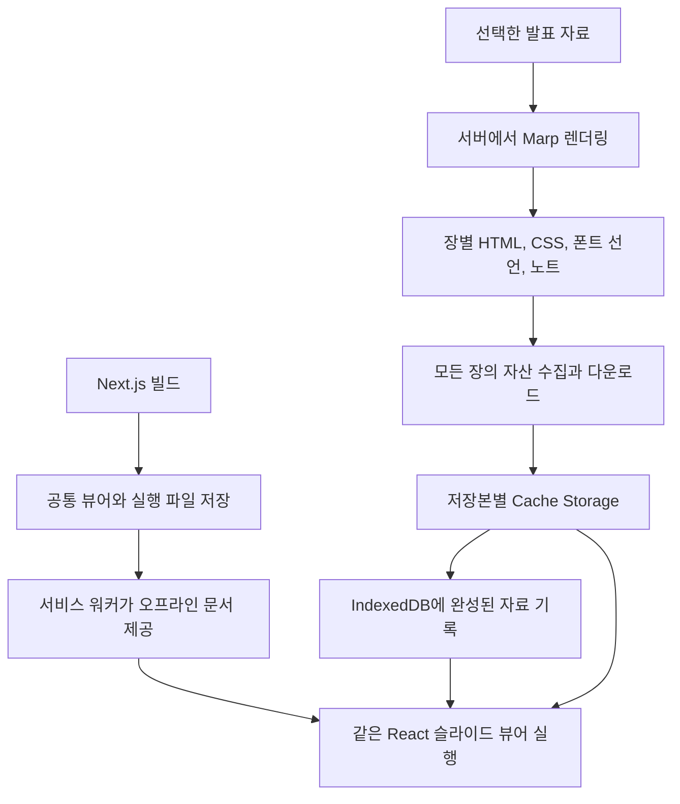

FEConf 2026을 앞두고 행사 측에서 인터넷 연결 없이도 발표할 수 있도록 자료를 준비해 달라는 요청을 받았다. 이를 계기로 발표 자료를 올리는 [research](https://research.yceffort.kr)에 오프라인 저장 기능을 붙였다.

research의 발표 자료는 Marp로 만든다. 마크다운을 슬라이드로 변환하고, 그 결과를 직접 만든 React 뷰어에 넣는다. 슬라이드 전환 효과와 Mermaid 다이어그램이 있고, 별도 창으로 여는 발표자 화면에는 노트와 타이머, 다음 장 미리보기가 있다. Marp CLI로 PDF나 HTML을 내보낼 수도 있고, [기본 HTML 템플릿에는 발표자 모드도 있다](https://github.com/marp-team/marp-cli#bespoke-template-default). 이번에는 research에서 쓰던 뷰어와 기능을 오프라인에서도 그대로 쓰고 싶었다.

[서비스 워커 캐싱을 다룬 글](/2026/08/service-worker-caching-2)에서는 이 블로그에 서비스 워커를 붙여 방문한 글을 오프라인에서도 읽을 수 있게 만들었다. 다만 [첫 글](/2026/08/service-worker-caching-1)부터 이어진 측정은 모두 네트워크가 연결된 상태에서 했고, [마지막 글](/2026/08/service-worker-caching-3)에서 적었듯 정작 오프라인 동작은 측정하지 않았다. 이번에는 research에 자료 저장 기능을 만들면서, 네트워크가 끊기거나 응답이 오지 않을 때 저장본이 열리는지도 확인했다.

발표 자료에서는 블로그의 방문 캐싱보다 저장의 기준을 더 분명하게 잡았다. 사용자가 고른 자료의 모든 장과 필요한 파일을 받고, 준비가 끝난 뒤에만 저장했다고 표시한다. 아직 넘겨 보지 않은 장의 이미지나 다이어그램도 여기에 포함된다.

이를 구현하려면 Marp의 렌더 결과를 어떤 형태로 보관할지, Next.js 서버 없이 뷰어를 어떻게 시작할지, 업데이트 중 연결이 끊기면 기존 자료를 어떻게 지킬지 정해야 했다.

> 이 글은 2026년 9월 28일의 `main` 브랜치 커밋 `6b7a29ba`를 기준으로 한다. Next.js 16.3.5의 App Router를 사용하며, 코드 링크도 이 커밋에 고정했다. 구현을 살펴보고 로컬에서 테스트한 기록으로, FEConf 현장에서 사용한 결과는 아직 포함하지 않았다. 글을 준비하며 발견한 문제 두 가지와 수정 전후의 측정값도 함께 적었다.

## 저장 버튼 하나가 보관하는 범위

목록 카드나 슬라이드의 우클릭 메뉴에서 오프라인 저장을 누르면 해당 발표 자료를 내려받는다. 휴대폰에서는 길게 눌러 메뉴를 연다. 저장한 자료는 `/offline` 보관함에서 열거나 업데이트하고 삭제할 수 있다. 사이트를 방문하거나 슬라이드를 한 번 열었다고 자동으로 보관함에 추가하지는 않는다.

**발표 자료 하나가 저장 단위이고, 그 안의 각 장은 함께 저장한다.** 예를 들어 `feconf-2026-vendor-sdk`라는 자료는 1장부터 마지막 장까지가 하나의 저장본이다. 자료마다 식별자인 `slug`가 있고, 각 장의 HTML은 그 자료의 `html[]`에 들어간다.

모든 장과 테마, 발표자 노트를 한꺼번에 저장하고 교체하면 자료 전체를 같은 버전으로 유지할 수 있다. 발표자 화면에서 보여 줄 다음 장도 이미 저장되어 있으므로, 발표 중에 추가로 내려받을 필요가 없다.

자료마다 따로 저장하므로 자료 A를 저장할 때 자료 B의 본문과 이미지까지 내려받지는 않는다. 뷰어를 실행할 JS와 CSS는 여러 자료가 공유한다.

## Marp는 서버에서 변환하고, 브라우저에는 결과를 저장한다

온라인에서는 서버의 `generateRenderedMarp()`가 마크다운을 처리한다. Marp를 `htmlAsArray: true`로 실행해 장별 HTML을 얻고, 테마 CSS를 처리한 뒤 `@font-face` 선언을 별도로 추출한다. 발표자 노트도 마크다운에서 꺼내 배열로 만든다.[^1]

테마 CSS를 처리하는 순서도 중요하다. 먼저 `postcss-import-url`로 `@import`한 스타일을 가져오고, `resolveUrls: true`로 그 안의 상대 URL을 원래 스타일시트 주소에 맞는 절대 URL로 바꾼다. 그다음 `@font-face`를 분리한다. 예를 들어 외부 폰트 CSS가 `./font.woff2`를 참조한다면, 그 주소를 research의 경로로 해석해서는 안 된다. 서버에서 CSS를 펼치고 주소를 정리해 두어야 나중에 브라우저가 실제 폰트 파일을 찾아 저장할 수 있다.

오프라인에서는 이 서버 함수를 부를 수 없다. 그렇다고 마크다운만 IndexedDB에 넣어 두면 기존 뷰어가 바로 읽을 수도 없다. 마크다운을 변환하는 과정까지 브라우저에 옮기는 대신, 서버에서 변환한 결과를 저장하기로 했다. 기존 뷰어가 받는 데이터 형식을 그대로 쓸 수 있기 때문이다.

`/api/slides/[slug]/offline`은 온라인 뷰어와 같은 렌더 함수를 호출하고, 다음 `OfflineDeck` 타입에 맞는 JSON을 반환한다.[^2]

```ts
export interface OfflineDeck {
  schemaVersion: 1
  slug: string
  title: string
  description?: string
  html: string[]
  css: string
  fonts: string[]
  notes: string[]
  post?: string
  transition?: TransitionType
}
```

`html`은 각 장의 렌더 결과이고, `css`는 그 자료의 테마와 슬라이드 스타일이다. `fonts`에는 폰트 파일 자체가 아니라 `@font-face` 선언이 들어간다. 실제 폰트 파일은 선언에 있는 URL을 찾아 따로 내려받는다. `notes`는 발표자 화면에 표시할 장별 노트다.

오프라인 보관함은 이 데이터를 IndexedDB에서 읽어 기존 `MarpSlides`와 `PresenterView`에 전달한다. 뷰어는 공유하고 데이터를 읽어 오는 경로와 발표자 창의 주소(`/offline/{slug}/presenter`)를 바꿨다.

슬라이드의 스타일과 폰트를 적용하는 방식도 기존 뷰어를 따른다. `useMarpShadowRoot()`는 각 장의 HTML과 CSS를 Shadow DOM에 넣어 사이트 스타일과 섞이지 않게 한다. 폰트 선언은 `useFontFace()`가 `document.head`에 등록하며, 여러 장이 같은 선언을 쓰면 참조 횟수를 세어 공유한다. `@marp-team/marp-core/browser`의 `browser(shadowRoot)`도 실행해 Marp의 브라우저용 처리를 적용한다.[^3]

여기서는 슬라이드의 일반 스타일과 폰트 등록 범위를 따로 관리한다. 슬라이드의 `section`이나 제목 스타일은 각 Shadow DOM 안에 두고, 폰트 선언은 같은 문서의 여러 슬라이드에서 참조한다. 발표자 화면에는 현재 장과 다음 장이 동시에 표시되므로, 장 하나가 사라졌다고 폰트 선언까지 지우면 남은 장도 영향을 받는다. `useFontFace()`는 선언 문자열을 키로 등록 횟수를 세고, 마지막 사용자가 사라졌을 때만 `<style>`을 제거한다. 오프라인에서도 HTML뿐 아니라 분리한 폰트 선언을 함께 보관하는 이유다.

따라서 마크다운을 변환하는 서버 작업을 미리 끝내더라도, 슬라이드 HTML과 함께 뷰어와 Marp의 브라우저용 코드도 저장해야 한다.

Mermaid도 브라우저에서 할 일이 남아 있다. 서버는 Mermaid 코드 블록을 완성된 SVG로 변환하지 않고, 다이어그램 정의를 담은 `.mermaid` 요소로 남긴다. `Marp.tsx`가 해당 장을 표시할 때 `import('mermaid')`로 코드를 불러와 SVG를 만든다. 오프라인에서도 이 과정을 실행하므로, 아직 한 번도 보지 않은 다이어그램에 필요한 JS 청크까지 저장해야 한다.

## IndexedDB에는 자료를, Cache Storage에는 파일을

자료를 관리할 때는 `slug`로 본문을 읽거나 목록을 조회해야 하고, 이미지 요청에는 저장한 파일을 응답해야 한다. 이 두 용도에 맞춰 저장소를 나눴다. IndexedDB의 `research-offline` 데이터베이스에는 `decks`라는 객체 저장소를 두고 `slug`를 키로 쓴다.[^4]

```ts
const request = indexedDB.open('research-offline', 1)
request.addEventListener('upgradeneeded', () => {
  request.result.createObjectStore('decks', {keyPath: 'slug'})
})
```

자료별 레코드는 이 객체 저장소 하나에서 관리한다. `get(slug)`로 특정 자료를 읽고, `getAll()`로 보관함 목록을 만든다. 같은 `slug`로 `put()`하면 그 자료의 저장본을 교체한다.

`indexedDB.open()`에 넘긴 버전 `1`과 `OfflineDeck.schemaVersion`의 `1`은 별개다. 앞의 값은 객체 저장소나 인덱스 같은 데이터베이스 구조를 바꿀 때 사용하고, 뒤의 값은 저장할 자료의 형식을 나타낸다. 자료 내용이 바뀔 때마다 데이터베이스 버전을 올리는 구조는 아니다. 현재 다운로드 코드는 `schemaVersion === 1`인지 확인하며, 이전 형식을 새 형식으로 변환하는 코드는 없다. 나중에 저장 형식을 바꾼다면 이미 브라우저에 남은 자료를 어떻게 읽을지도 함께 설계해야 한다.

저장된 레코드에는 앞의 `OfflineDeck`뿐 아니라 저장 시각과 용량, 버전, 자산 캐시 이름, 저장한 자산 URL 목록이 함께 들어간다. 반면 이미지와 실제 폰트 파일은 Cache Storage에 `Response`로 보관한다. 서비스 워커가 이미지나 폰트 요청을 받았을 때 그 응답을 그대로 돌려줄 수 있도록 하기 위해서다.

IndexedDB에 이미지의 `Blob`을 넣는 방법도 가능하다. 다만 이 뷰어는 HTML과 CSS에 적힌 URL로 파일을 요청하므로, 파일을 URL과 `Response`의 쌍으로 보관하면 서비스 워커에서 바로 찾을 수 있다. 저장소를 나눈 기준은 텍스트와 바이너리를 저장할 수 있느냐가 아니라, 자료를 조회하는 방식과 파일 요청에 응답하는 방식의 차이다.

| 보관할 것                                  | 저장 위치                  | 사용하는 곳                |
| ------------------------------------------ | -------------------------- | -------------------------- |
| 장별 HTML, CSS, 폰트 선언, 노트, 저장 정보 | IndexedDB의 `decks`        | 보관함과 슬라이드 뷰어     |
| 자료에 딸린 이미지와 폰트 파일             | 저장본별 Cache Storage     | 서비스 워커의 자산 응답    |
| 뷰어의 HTML, JS, CSS와 공통 폰트           | 버전별 Cache Storage       | 오프라인에서 뷰어 시작     |
| 준비를 마친 공통 뷰어의 위치               | 메타데이터용 Cache Storage | 서비스 워커의 문서 응답    |
| 마지막으로 읽은 장 번호                    | localStorage               | 자료를 다시 열 때 이어보기 |

마지막으로 읽은 장 번호는 localStorage에 동기적으로 기록한다. 슬라이드를 넘긴 직후 페이지를 닫더라도 쓰기를 마치기 위해서다. 저장할 값이 숫자 하나라 가능한 선택이다. 위치를 기록하지 못하더라도 발표는 계속할 수 있도록, 이 쓰기 작업에서 난 오류는 무시한다.

전체 흐름을 그리면 다음과 같다.



저장소를 나눈 만큼 상태를 맞추는 일은 직접 해야 한다. IndexedDB 트랜잭션 하나로 Cache Storage까지 묶을 수 없으므로 저장 순서를 정해야 하고, 레코드는 있는데 파일이 사라진 경우도 처리해야 한다. 보관함은 자산 캐시가 있는 자료만 목록에 올리고, 자료를 열 때는 기록된 자산이 실제로 남아 있는지 다시 확인한다.

## 이미지와 폰트는 모든 장에서 찾아야 했다

자료를 저장할 때는 API에서 받은 **모든 장의 렌더 결과**를 검사한다. 현재 화면의 DOM만 살펴보면 아직 넘겨 보지 않은 장의 파일을 놓칠 수 있기 때문이다.

`collectDeckAssets()`는 각 장의 HTML뿐 아니라 테마 CSS와 폰트 선언도 읽는다. Marp의 렌더 결과에는 SVG의 `foreignObject` 안에 들어간 이미지가 있고, 배경 이미지가 인라인 CSS의 `url()`로 들어갈 수도 있다. `img.src`만 모으면 이 자산들을 놓친다. 그래서 이미지 요소의 `src`, SVG의 `href`와 `xlink:href`, `srcset`, 인라인 스타일과 스타일 요소의 URL까지 수집한다.[^5]

상대 주소의 기준은 저장 버튼을 누른 페이지가 아니라 `/slides/{slug}`다. 보관함에서 업데이트하더라도 원래 슬라이드에서 해석하던 주소로 파일을 찾아야 하기 때문이다. 수집한 주소는 `Set`으로 중복을 없애고 정렬한다. 다운로드할 때는 URL의 `#fragment`를 제외하고, HTML과 CSS의 주소를 치환할 때 다시 붙인다. 같은 SVG 파일의 서로 다른 부분을 가리키는 주소라도 파일 자체는 한 번만 저장할 수 있다.

방문 중에 발생한 요청을 캐시할 때는 브라우저가 요청한 파일을 저장하면 된다. 자료 전체를 내려받으려면 아직 요청하지 않은 파일도 찾아야 하므로 Marp의 출력 형식을 살펴봐야 했다.

받은 파일을 원래 URL에 그대로 저장하지도 않는다. 저장본마다 UUID를 만들고, 자산 주소를 `/offline-assets/{id}/{index}` 형태로 바꾼다. HTML과 CSS, 폰트 선언에 있는 원래 주소도 이 로컬 주소로 치환한다.

예를 들어 두 발표 자료가 같은 `/images/architecture.png`를 사용한다고 하자. 한 자료만 업데이트했는데 원래 URL의 캐시를 덮어쓰면 다른 자료도 새 이미지를 보게 된다. 본문은 예전 버전인데 이미지만 바뀌는 셈이다. 저장본마다 주소와 캐시를 분리하면 두 자료가 서로 다른 시점의 이미지를 유지할 수 있고, 업데이트 중인 자료가 이미 열린 발표의 자산을 덮어쓰지도 않는다.

그만큼 같은 이미지가 여러 자료에 중복 저장될 수 있다. 여기서는 저장 공간을 줄이는 것보다 자료마다 독립적으로 저장하고 교체하는 쪽을 우선했다.

수집 범위에는 한계가 있다. 현재 코드는 정해 둔 요소의 속성과 CSS의 `url()`을 검사한다. iframe 안의 문서나 실행 중인 JS가 나중에 만들어 내는 요청까지 따라가지는 않으며, 내려받은 외부 파일 안의 의존성을 재귀적으로 분석하지도 않는다. `data:` URL은 이미 본문에 내용이 들어 있어 별도 다운로드가 필요 없지만, 수집에서 제외하는 `blob:` URL은 내용을 영구 보관했다는 뜻이 아니다. 새로고침 뒤에도 같은 주소를 쓸 수 있다고 기대해서는 안 된다.[^17] 따라서 이 글에서 모든 파일을 저장한다는 것은 **현재 Marp 출력에서 수집하도록 구현한 자산을 모두 받는다**는 범위다. 새로운 임베드 형식을 추가한다면 수집 코드와 오프라인 테스트도 함께 늘려야 한다.

## Next.js 서버 없이 뷰어를 시작하기

research는 Next.js App Router를 사용한다. 평소에는 `<Link>`로 이동하고, 서버에서 만든 RSC 페이로드(React Server Component의 렌더 결과)를 받아 화면을 갱신한다. 처음 주소를 열 때 받는 HTML 문서와, 실행 중인 앱 안에서 이동할 때 받는 응답은 다르다. 프리페치로 미리 받은 RSC 페이로드도 클라이언트 메모리의 캐시에 들어간다.[^6]

한 번 연 페이지가 화면에 남아 있다고 해서 오프라인으로 다시 열 수 있는 것은 아니다. 새로고침하거나 브라우저를 다시 시작하면 HTML 문서부터 받아야 한다. 그 문서가 참조하는 JS도 있어야 뷰어를 실행할 수 있다. Next.js의 정적 생성으로 서버의 렌더 작업을 미리 끝냈더라도, 결과 파일을 사용자의 브라우저에 저장하는 일은 따로 해야 한다.

Next.js 16.3.5에는 실험적 `useOffline` 기능도 있다. 연결이 끊겼을 때 상태를 알리고, 실패한 탐색이나 Server Action 요청을 연결 복구 후 다시 시도하는 기능이다. 공식 문서에서는 오프라인 상태에서 전체 페이지를 새로고침하려면 별도의 서비스 워커가 필요하다고 설명한다. research에서는 브라우저를 다시 시작한 뒤에도 저장한 자료를 열어야 하므로 추가 구현이 필요했다.[^7]

해결 방법은 **오프라인 뷰어를 시작할 HTML을 하나 준비하고, 자료는 IndexedDB에서 읽는 것**이었다. `/offline`, `/offline/{slug}`, `/offline/{slug}/presenter`는 모두 같은 `OfflineLibrary` 컴포넌트를 사용한다. 이 컴포넌트는 `window.location.pathname`에서 어떤 자료를 열지, 발표자 모드인지를 읽는다.

서비스 워커는 네트워크 없이 `/offline/feconf-2026-vendor-sdk`를 열 때 저장해 둔 공통 HTML을 응답한다. HTML은 `/offline`을 빌드한 결과지만 주소창의 경로는 그대로 남는다. 뷰어는 그 주소에서 `slug`를 얻고, IndexedDB의 해당 레코드를 연다. 자료별 Next.js 페이지의 RSC 응답을 모두 저장할 필요가 없어진다.

이때 서버 HTML과 브라우저의 첫 렌더가 일치해야 한다. `OfflineLibrary`의 `useSyncExternalStore`는 서버 스냅샷으로 `/offline`을 반환한다. 공통 HTML을 하이드레이션(서버 HTML에 React의 동작을 연결하는 과정)할 때는 이 값을 쓰고, 그 뒤 실제 경로를 읽어 자료를 고른다. Next.js로 빌드한 화면과 React 뷰어는 유지하면서 자료를 고르는 부분을 클라이언트에서 처리한 것이다.[^8]

관련 코드는 다음과 같다. 세 번째 인수는 서버 렌더뿐 아니라 브라우저의 초기 하이드레이션에서도 사용된다. 서버가 만든 보관함 화면에 브라우저가 곧바로 자료 화면을 맞추려 하지 않고, 처음에는 같은 경로 값을 사용하도록 한 것이다.[^18]

```tsx
const pathname = useSyncExternalStore(
  subscribeLocation,
  () => window.location.pathname,
  () => '/offline',
)
```

보관함에서 쓰는 `OfflineLink`도 일반 `<a>`를 렌더링한다. `next/link`의 클라이언트 탐색 대신 문서 요청을 보내야 서비스 워커가 공통 HTML을 응답할 수 있기 때문이다. 자료를 열 때마다 문서를 다시 불러오는 비용이 있지만, 새 탭으로 열거나 새로고침할 때와 같은 방식으로 저장된 뷰어를 시작할 수 있다.

`rsc: 1` 헤더나 `_rsc` 쿼리가 있는 요청은 네트워크로 보내고, 실패하면 503을 반환한다. RSC를 기대하는 요청에 공통 HTML을 돌려주면 응답 형식이 맞지 않는다. 오프라인 뷰어는 자료를 IndexedDB에서 읽으므로 이 요청 없이도 자료를 열 수 있다.

이 방식은 Next.js 앱 전체를 오프라인으로 만드는 방법은 아니다. 공통 HTML이 시작하는 컴포넌트가 자료와 필요한 상태를 브라우저 안에서 읽을 수 있어서 가능한 구성이다. 이 화면에 자료를 조회하는 서버 요청이나 Server Action 의존성을 새로 넣으면, HTML과 JS를 저장해 두었어도 그 기능은 연결 없이 실행되지 않는다. 또 `/offline`을 만들 때 특정 자료의 제목이나 본문을 서버 HTML에 넣는다면 그 HTML을 다른 자료의 공통 화면으로 쓰는 전제도 다시 검토해야 한다.

저장을 시작할 때는 서비스 워커의 등록과 현재 페이지의 제어 여부도 구분한다. `register('/sw.js')`가 끝나도 현재 페이지에 `navigator.serviceWorker.controller`가 바로 생긴다고 가정할 수는 없다.[^19] Cache Storage에 파일이 있어도 요청을 처리할 워커가 없다면 `/offline-assets/...`라는 주소로 그 파일을 돌려줄 수 없다. 이 주소에 대응하는 실제 파일을 서버에 만드는 것은 아니기 때문이다.

그래서 `ensureController()`는 워커를 등록한 뒤 `controller`를 확인하고, 아직 없으면 `controllerchange`를 최대 15초 기다린다. 워커는 `activate`에서 `clients.claim()`을 호출한다. 이 대기는 처음 저장할 때 현재 페이지가 워커의 제어를 받는지 확인하기 위한 것이다. 새 버전의 워커가 대기 중일 때 이를 강제로 활성화하는 `skipWaiting()`과는 목적이 다르다.

## 아직 실행하지 않은 코드도 저장해야 했다

공통 HTML을 준비한 다음에는 뷰어 실행에 필요한 코드를 모두 저장해야 한다. 첫 화면에서 불러온 `<script>`만 저장하면 Mermaid처럼 나중에 불러오는 코드가 빠진다. 발표자 창을 처음 열 때 필요한 코드도 포함해야 한다.

research의 빌드 명령은 `next build` 뒤에 `generate-offline-runtime.mjs`를 실행한다. 이 스크립트는 `.next/static` 아래의 JS, CSS, 폰트 파일을 재귀적으로 수집하고, `.next/server/app/offline.html`을 `public/offline-shell.html`로 복사한다. 각 파일의 SHA-256과 URL을 `offline-runtime.json`에 기록한다.[^9]

이 JSON은 실행 파일의 다운로드 목록이다. 앱 이름과 아이콘, 시작 주소를 정하는 웹 앱 매니페스트와는 용도가 다르다. 파일을 내려받을 때 목록에 적힌 SHA-256과 실제 파일의 해시를 비교한다. 배포 도중 서로 다른 버전의 HTML과 JS를 받더라도, 해시가 맞지 않으면 다운로드를 실패로 처리해 뒤섞인 뷰어가 사용되지 않게 한다.

예를 들어 목록은 배포 A의 것을 받았는데 `/offline-shell.html`을 요청할 때 서버가 배포 B로 바뀔 수 있다. 응답 상태가 200이라는 것만으로는 A의 JS와 함께 써도 되는 HTML인지 알 수 없다. 여기서는 목록에 적힌 해시와 파일 내용이 일치해야 새 공통 뷰어에 포함한다. URL과 파일 내용이 같은 이전 캐시를 재사용할 때도 같은 검사를 한다. 다만 이미 해당 버전의 캐시에 들어 있는 항목은 존재 여부만 확인하므로, 자료를 열 때마다 모든 파일을 다시 해시 검사하는 구조는 아니다.

다운로드가 예전 파일을 다시 받는 일도 막아야 한다. `fetchFile()`은 `cache: 'no-store'`로 브라우저의 HTTP 캐시를 우회하고, 서비스 워커는 같은 옵션이 붙은 파일 요청을 자신의 Cache Storage로 응답하지 않는다.[^20] HTTP 캐시와 서비스 워커가 직접 관리하는 캐시는 별개이므로 양쪽에서 구분한 것이다. 일반 뷰어의 파일 요청은 저장한 응답을 쓰되, 업데이트를 위해 보내는 요청은 서버에서 다시 받을 수 있게 했다.

공통 뷰어의 캐시 이름에는 다운로드 목록의 버전을 붙인다. 새 캐시에 파일을 모두 준비한 뒤에만 서비스 워커가 사용할 캐시를 바꾼다. `ensureRuntime()`의 마지막에서 메타데이터에 새 캐시 이름과 공통 HTML의 주소를 기록하는 방식이다.[^10]

```ts
const metadata = await caches.open(META_CACHE)
await metadata.put(
  RUNTIME_KEY,
  Response.json({cacheName, shell: manifest.shell}),
)
```

이 기록을 바꾸기 전까지 서비스 워커는 이전에 준비한 공통 뷰어를 사용한다. 다운로드 중인 파일이 일부만 있는 상태로 뷰어를 시작하지 않도록 한 것이다.

다만 다운로드하는 코드의 범위는 넓다. 오프라인 뷰어가 실제로 참조하는 청크만 추적하지 않고, `.next/static`의 해당 확장자 파일을 모두 포함한다. **발표 자료는 선택해서 저장하지만, 공통 실행 파일은 사이트 전체 빌드에서 가져온다.** 오프라인에서 쓰지 않는 화면의 코드도 포함될 수 있다.

이렇게 하면 지연 로딩할 파일을 빠뜨릴 가능성은 줄지만 최초 다운로드 용량이 커진다. `6b7a29ba`를 빌드해 확인한 목록에는 파일 115개가 있었고, 압축 전 크기의 합은 7,149,685바이트(약 6.8MiB)였다. 보관함에 표시하는 자료별 용량에는 이 공통 실행 파일이 포함되지 않는다. 자료를 처음 저장할 때는 화면에 표시된 용량 외에 이 파일들도 받아야 한다.

글을 준비하며 코드를 다시 읽다가, 배포할 때마다 이 파일들을 다시 받고 이전 캐시도 남겨 두는 문제를 발견했다. 공통 HTML로 복사하는 `offline.html`에는 Next.js의 빌드 ID가 들어간다. 코드를 바꾸지 않고 두 번 빌드해도 다운로드 목록의 버전이 달라졌고, 새 버전의 뷰어를 준비할 때마다 파일 115개를 다시 받았다. 이전 캐시를 지우는 코드도 없었으므로, 사용자가 배포 후 사이트를 열어 업데이트를 받을 때마다 당시 빌드 기준 약 6.8MiB의 캐시가 더 쌓일 수 있었다.

지금은 새 공통 뷰어를 준비할 때 이전 캐시를 먼저 확인한다. 같은 URL의 파일이 있고 SHA-256도 일치하면 새 캐시로 복사하고, 없거나 달라진 파일만 네트워크에서 받는다. 공통 HTML 하나만 바뀐 배포를 재현한 테스트에서, 수정 전에는 목록의 113개 파일을 전부 다시 받았지만 수정 후에는 공통 HTML 하나만 받았다. 이 테스트의 파일 수는 앞서 용량을 잰 빌드의 목록과 다르다.

저장 공간을 회수하기 위해 이전 버전의 캐시를 지우는 처리도 추가했다. 다만 발표 중인 화면이 예전 파일을 필요로 할 수 있으므로, 열린 발표가 없을 때만 정리한다. 그전까지는 여러 버전이 함께 남는다.

이 구현은 `.next/server/app/offline.html`의 위치와 정적 파일 구조에도 의존한다. Next.js를 올릴 때 해당 파일이 같은 위치에 생성되고 공통 HTML로 사용할 수 있는지 확인해야 한다. 개발 서버에서는 다운로드 목록을 만들지 않으므로, 오프라인 저장은 프로덕션 빌드를 사용하는 `pnpm preview:research`로 확인한다.

배포에서도 `next build`만 실행해서는 이 구성이 완성되지 않는다. research 패키지의 `build` 스크립트를 실행해 공통 HTML과 다운로드 목록을 생성하고, 이를 같은 빌드의 `/_next/static` 파일과 함께 배포해야 한다. 현재 생성된 두 파일은 Git에 보관하지 않는 배포 산출물이다. 해시 검사는 파일이 뒤섞인 배포를 감지할 수 있지만, 빠진 파일을 만들어 주거나 맞는 빌드로 복구해 주지는 않는다.

## 저장이 끝나기 전에는 기존 자료를 교체하지 않는다

자료 업데이트 도중 이미지 하나를 받지 못할 수 있다. 사용자가 취소할 수도 있고, 저장 공간이 부족할 수도 있다. 이때 기존 레코드를 먼저 덮어썼다면 본문과 자산이 서로 다른 상태로 남는다.

`downloadDeck()`은 새 UUID의 자산 캐시를 만들어 다운로드하고, URL 치환까지 끝난 뒤 `putSavedDeck()`으로 IndexedDB의 레코드를 교체한다. 다운로드 중에는 기존 레코드를 그대로 둔다. 다음은 실제 저장 순서다.[^10]

1. 공통 뷰어를 준비하고 자료의 모든 자산 URL을 수집한다.
2. 새 자산 캐시에 이미지와 폰트를 내려받고, 각 파일의 로컬 주소를 정한다.
3. 모든 다운로드가 끝난 뒤 취소 여부를 다시 확인한다.
4. 자산 주소를 치환한 자료와 새 캐시의 위치를 IndexedDB에 기록한다.

다운로드가 실패하거나 다운로드 후의 검사에서 취소를 확인하면 새 자산 캐시를 지우고 기존 저장본을 유지한다. 다만 이 검사 뒤에 시작한 IndexedDB 쓰기까지 취소 신호와 연결한 것은 아니다. 취소 버튼이 저장 과정의 어느 순간에나 이전 상태로 되돌린다고 보장하지는 않는다.

IndexedDB의 쓰기도 `put()` 요청의 성공 이벤트만 보고 끝내지 않는다. `database.ts`는 트랜잭션의 `complete` 이벤트를 기다린다. 파일 다운로드와 자료 레코드의 교체가 모두 끝나야 저장 완료를 알린다.

`put()` 요청이 성공했다는 것과 트랜잭션 전체가 확정됐다는 것은 다르다. 트랜잭션이 이후 오류로 중단될 수 있으므로, 호출자에게는 `complete` 이후에 결과를 반환한다. 또 네트워크 다운로드를 기다리는 동안 IndexedDB 트랜잭션을 열어 두지 않는다. IndexedDB는 처리할 요청이 없으면 트랜잭션을 자동으로 커밋할 수 있다. 트랜잭션을 만든 뒤 `await fetch()`하고 돌아와서 `put()`하는 방식은 그때도 트랜잭션이 활성 상태라고 기대할 수 없다.[^21] 여기서는 파일을 모두 준비한 다음 짧은 쓰기 트랜잭션으로 레코드만 교체한다.

원자적으로 교체되는 것은 IndexedDB의 자료 레코드다. 공통 뷰어 준비와 자산 캐시 쓰기까지 하나의 트랜잭션으로 묶이는 것은 아니다. 파일을 먼저 준비하고 마지막에 레코드가 새 파일을 가리키도록 바꿔, 중간 실패가 기존 자료에 영향을 주지 않게 했다. 공통 뷰어도 자료 레코드와 별도로 갱신되므로 새 뷰어는 이전에 저장한 자료 형식도 읽을 수 있어야 한다.

기존 저장본을 A, 업데이트할 저장본을 B라고 하면 중단 시점에 따라 남는 상태를 다음처럼 구분할 수 있다. 아래 표는 브라우저가 기존 저장소를 유지한다는 전제에서 본 저장 순서다.

| 중단되거나 확인하는 시점           | IndexedDB의 자료 | 자산 캐시와 다음 실행                                     |
| ---------------------------------- | ---------------- | --------------------------------------------------------- |
| B의 파일을 내려받는 중             | A                | 오류를 처리할 수 있으면 B 캐시를 지우고 A를 유지한다      |
| B의 파일을 받은 뒤, 레코드 교체 전 | A                | 갑자기 종료되면 참조되지 않는 B 캐시가 남을 수 있다       |
| B 레코드의 트랜잭션 완료 후        | B                | 새로 열면 B를 읽고, 이미 열린 A를 위해 예전 캐시도 남긴다 |

`finally`에서 정리하는 코드는 정상적으로 오류를 처리할 수 있을 때 실행된다. 탭이나 브라우저가 갑자기 종료되면 새 캐시의 일부가 남을 수 있고, 이런 캐시는 다음 정리 작업의 대상이 된다. 반대로 레코드가 새 캐시를 가리키는 시점에는 모든 자산 쓰기가 끝나 있어야 한다. 중간에 파일이 남는 경우를 허용하는 대신, 다운로드 중인 자료가 완성된 자료로 나타나지 않도록 순서를 정한 것이다.

파일 다운로드는 최대 4개 작업으로 나누어 진행한다. `parallel()`이 `Promise.allSettled()`를 쓰는 것도 정리 순서와 관련이 있다. `Promise.all()`은 하나가 실패하면 바로 거절되지만 나머지 작업을 취소하지는 않는다. 그 즉시 실패한 캐시를 정리하면 다른 작업이 여전히 그 캐시에 쓰고 있을 수 있다. 현재 구현은 시작한 작업들이 모두 끝난 뒤 오류를 전달하고, 그다음 새 자산 캐시를 지운다. 그만큼 하나가 실패해도 실패 안내까지 다른 작업을 기다릴 수 있다.

외부 이미지와 폰트도 모두 받아야 저장을 완료한다. CORS가 허용되지 않거나 불투명한 응답(opaque response)이어서 파일 내용을 읽을 수 없으면 저장을 실패로 처리한다. 다만 슬라이드에 걸린 링크의 목적지나 별도 온라인 데모까지 내려받지는 않는다.

온라인에서 이미지가 보인다고 이 조건을 만족하는 것은 아니다. ``로 표시할 수 있는 외부 파일도 JS의 `fetch()`로 응답 내용을 읽으려면 서버의 CORS 허용이 필요할 수 있다. 이 구현은 내용을 `ArrayBuffer`로 읽어 해시와 용량을 계산하고, 로컬 URL용 `Response`를 새로 만들기 때문에 불투명한 응답을 그대로 보관하는 것으로 대체할 수 없다.[^22] 다른 출처의 자산에는 로그인 쿠키도 보내지 않는 `credentials: 'same-origin'`을 쓰므로, 로그인 상태에 의존하는 외부 파일은 별도로 확인해야 한다.

여러 탭에서 저장과 삭제를 동시에 요청할 때도 순서를 맞춰야 한다. `withDownloadLock()`은 Web Locks의 `research-offline-downloads` 잠금 안에서 저장과 업데이트, 삭제를 처리한다. 자동 업데이트는 잠금을 얻은 뒤 IndexedDB를 다시 읽어, 다른 탭에서 이미 삭제한 자료를 다시 저장하지 않도록 한다. Web Locks를 사용할 수 없는 브라우저에서는 페이지 안의 Promise 큐로 처리하므로, 같은 페이지의 요청만 순서대로 실행하고 탭 사이의 작업까지 조율하지는 못한다.

## 새 자료를 받아도 진행 중인 발표는 유지한다

발표 자료는 행사 직전까지 수정할 수 있다. 사이트에서 고친 내용을 오프라인 저장본에도 반영하고 싶지만, 발표 도중 화면까지 바뀌어서는 안 된다. 저장소에는 새 버전을 받아 두고, 열린 화면은 처음 읽은 자료를 계속 사용하도록 했다.

사이트를 열거나 인터넷 연결이 돌아오면 저장한 자료가 바뀌었는지 확인한다. 화면이 보이는 동안에는 5분 간격으로, 탭으로 돌아왔을 때는 마지막 확인 시도에서 1분이 지났으면 다시 확인한다. 이 작업은 페이지가 열려 있을 때 실행한다. 사이트를 닫아 둔 동안 주기적으로 내려받는 백그라운드 동기화는 구현하지 않았다.

자료와 뷰어, 첨부 파일의 변경을 구분하기 위해 세 가지 버전 값을 사용한다.

| 필드              | 계산하는 대상                  | 필요한 이유                                 |
| ----------------- | ------------------------------ | ------------------------------------------- |
| `sourceRevision`  | API가 반환한 자료 JSON         | HTML, CSS, 노트 등의 변경을 확인            |
| `runtimeRevision` | 공통 실행 파일의 다운로드 목록 | 뷰어 빌드가 달라졌는지 확인                 |
| `revision`        | 자료 JSON과 받은 자산의 해시   | 이미지와 폰트 내용까지 포함한 저장본을 식별 |

API는 자료 JSON의 SHA-256을 ETag로 반환한다. 자동 업데이트에서는 저장된 자산이 모두 있고 공통 뷰어 버전도 같을 때 `If-None-Match`로 기존 버전을 보낸다. 서버가 304로 응답하면 자료 본문과 자산을 다시 받지 않는다. 공통 뷰어 버전이 바뀌었다면 자료 JSON이 같아도 자산을 다시 받아, 주소를 유지한 채 바뀐 이미지나 폰트를 반영한다.

한계도 있다. 자료 JSON과 공통 뷰어 버전이 그대로인데 같은 URL의 외부 이미지 내용만 바뀌면, ETag 비교로는 알아내지 못한다. 자산의 해시는 파일을 내려받은 뒤에야 계산하기 때문이다. 이런 변경을 자동으로 발견하려면 서버가 자산 버전도 제공하는 등의 추가 설계가 필요하다. 현재는 수동 업데이트를 눌러 다시 받을 수 있다.

업데이트가 끝나도 열린 `MarpSlides`와 `PresenterView`의 상태는 바꾸지 않는다. 갱신된 IndexedDB 레코드는 자료를 다시 열 때 읽는다. 자동 업데이트의 진행 상황과 오류는 보관함에 표시하고, 발표 화면에는 알림을 띄우지 않는다.

화면의 상태만 유지해서는 부족하다. 뒤쪽 장으로 넘어가면서 예전 빌드의 Mermaid 청크를 처음 요청할 수도 있으므로 이전 파일도 남겨야 한다. 서비스 워커는 `/offline/{slug}`나 발표자 경로를 연 창이 하나라도 있으면 이전 자산과 공통 실행 파일의 정리를 미룬다. 그런 창이 없을 때 자료 레코드가 가리키는 자산 캐시와 메타데이터가 가리키는 공통 뷰어만 남긴다. 새 워커를 강제로 활성화하는 `skipWaiting()`도 호출하지 않는다.[^11]

현재 정리 조건은 보수적이다. 어느 창이 어느 버전의 자산을 사용하는지 추적하지 않고, 오프라인 발표 창이 하나라도 있으면 이전 캐시의 정리를 전부 미룬다. 오래 열어 둔 탭 하나 때문에 다른 자료의 이전 캐시까지 남을 수 있지만, 지연 로딩할 파일을 너무 일찍 지우는 일을 피하는 쪽으로 구현했다. 이 보호는 업데이트로 생긴 이전 캐시에 대한 것이다. 사용자가 보관함에서 자료를 직접 삭제하면 `deleteDeck()`은 현재 저장본의 자산 캐시를 즉시 지운다. 발표 중인 자료를 다른 탭에서 삭제하는 경우까지 보호하지는 않는다.[^10]

발표자 화면과 청중 화면은 기존 `BroadcastChannel`로 동기화한다. `marp-slides-${slug}`라는 채널에서 장 번호와 동기화 요청을 주고받는다. 같은 브라우저의 창 사이에서 처리하므로 서버 요청은 필요하지 않다. 저장본 하나에는 노트와 현재 장, 다음 장의 데이터가 모두 들어 있다.

다만 장 번호를 동기화하는 것과 자료 버전을 맞추는 것은 별개다. 두 창은 열릴 때 각각 IndexedDB를 읽고, 채널 이름과 메시지에는 저장본의 `revision`이 들어 있지 않다. 코드 구조상 청중 화면을 연 뒤 자료가 업데이트되고, 그다음 발표자 화면을 새로 열면 서로 다른 버전을 읽을 수 있다. 이번에 기록한 테스트 결과로 이 조합까지 검증했다고 볼 수는 없다. 현재 방식으로 발표를 준비할 때는 업데이트를 마친 뒤 두 창을 함께 열어 내용을 확인할 필요가 있다. 이 상황까지 자동으로 맞추려면 발표 세션이 사용할 버전을 고정하고 새 창에도 전달하는 처리가 추가로 필요하다.[^8][^11]

## 와이파이에 연결되어 있어도 응답은 오지 않을 수 있다

`/offline`과 저장한 자료 경로의 문서 요청은 온라인일 때 네트워크를 먼저 시도하고, 실패하면 저장한 공통 HTML을 사용한다. 항상 캐시만 사용하면 뷰어를 갱신하는 코드 자체가 예전 버전으로 남을 수 있기 때문이다.

여기서 놓치기 쉬운 경우가 있다. 기기는 와이파이에 연결되어 있는데 인터넷은 되지 않는 상태다. `navigator.onLine`은 이때도 `true`일 수 있다. 이 값은 브라우저가 판단한 네트워크 연결 상태이며, research 서버가 응답할지는 요청을 보내 봐야 알 수 있다.[^12]

처음에는 별도의 대기 시간 제한이 없었다. 브라우저가 온라인이라고 판단하면 서비스 워커는 네트워크 응답을 기다렸고, 요청이 실패해야만 저장한 HTML을 사용했다. 응답이 늦거나 요청이 끝나지 않으면 저장본이 있어도 자료를 열지 못했다. 글을 준비하면서 로컬에서 이 조건을 재현해 시간을 쟀다.

> 측정 환경: Apple M1, macOS 27.0, Node.js 24.20.0, Playwright 1.63.0의 headless Chromium 153. 5초 제한을 넣기 전 코드(`399f7c75`)를 `next start`로 띄운 로컬 프로덕션 서버에서 자료 하나(`suspense-error-boundary-deep-dive`)를 저장한 뒤, 새 탭으로 `/offline/{slug}`를 열고 슬라이드가 나타날 때까지의 시간을 쟀다. 서버 지연은 Playwright의 요청 가로채기로 만들었다.

| 조건                         | 자료가 열리기까지    |
| ---------------------------- | -------------------- |
| 네트워크 끊김                | 185ms                |
| 온라인, 서버가 8초 뒤 응답   | 8,253ms              |
| 온라인, 서버가 응답하지 않음 | 20초까지 열리지 않음 |

지연시킨 대상은 서비스 워커가 서버로 보낸 `fetch`였다. 페이지가 서비스 워커에 보낸 문서 요청을 막은 것은 아니다. 저장본이 준비되어 있어도 서비스 워커가 네트워크를 기다리면 열 수 없다는 점을 확인한 것이다. 발표장에서도 자료를 새로 열거나 새로고침할 때 이런 상황이 생길 수 있다.

그래서 지금은 저장된 공통 HTML이 있으면 문서 응답 헤더를 최대 5초까지만 기다린다. 그 안에 헤더를 받지 못하면 요청을 취소하고 저장한 HTML을 사용한다. 헤더를 받으면 타이머를 해제하므로, 이후 본문 다운로드와 화면 표시에 걸리는 시간까지 제한하지는 않는다.

`fetch()`의 Promise는 응답 본문을 전부 받기 전에, 상태와 헤더를 받으면 이행된다. 현재 코드는 그 시점에 타이머를 해제한다.[^24] 예를 들어 헤더가 1초 만에 왔지만 본문 전송이 그 뒤 멈춘 상황은 이 5초 제한으로 해결하지 못한다. 본문을 전부 버퍼에 받은 뒤 사용할지 결정하는 방법도 있지만, 현재는 응답을 받기 시작한 뒤에는 중간에 끊지 않는 쪽을 택했다. 저장된 공통 HTML이 아직 없다면 대체할 문서도 없으므로 이 타이머 자체를 설정하지 않는다.

서버가 응답하지 않는 조건은 테스트에도 추가했다. 문서가 `DOMContentLoaded`에 도달하기까지의 제한을 10초로 두고, 슬라이드가 표시되는지와 요청을 시작한 뒤 최소 5초가 지났는지를 확인한다. 이 테스트의 10초와 서비스 워커의 5초는 측정하는 구간이 다르다.

5초 제한은 오프라인 보관함과 저장한 자료 경로에만 적용한다. 온라인 주소인 `/slides/{slug}`도 네트워크 요청이 실패하면 대응하는 오프라인 경로로 연결하지만, 같은 시간 제한은 없다. 발표를 시작할 때는 보관함에서 `/offline/{slug}`로 여는 편이 이 동작을 확실히 이용할 수 있다.

5초가 최적인지 여러 환경에서 비교한 것은 아니다. 최신 문서를 받을 시간을 주되, 저장본이 있는데도 응답을 계속 기다리는 일을 막으려고 정한 값이다. 참고로 Workbox의 `pageCache` 레시피도 네트워크 우선 전략에 시간 제한을 두며 기본값은 3초다.[^13]

이 시간은 자료를 저장할 때의 제한과도 다르다. 다운로드에 쓰는 `fetchFile()`은 요청마다 30초짜리 `AbortSignal.timeout()`을 만들고 사용자의 취소 신호와 합친다. 자료를 여는 문서 요청은 저장된 화면으로 돌아가기 위해 짧게 기다리고, 파일을 저장하는 요청은 다운로드를 시도할 시간을 별도로 주는 구조다.

## 방문한 페이지 캐싱과 자료 저장의 차이

사용한 기술은 서비스 워커, Cache Storage, IndexedDB와 웹 앱 매니페스트다. PWA를 만들 때 쓰는 기술이고, 자료를 골라 저장하는 기능도 PWA에서 구현할 수 있다. 다만 PWA라는 말만으로 어떤 자료를 저장하고 언제 갱신할지가 정해지지는 않는다. Next.js의 PWA 가이드 역시 설치를 위한 매니페스트와 오프라인 지원을 별도 작업으로 다룬다.[^14]

이번 구현의 차이는 방문하면서 얻은 응답을 캐시에 남기는 방식과 비교하면 분명해진다.

| 동작                   | 방문한 응답을 보관하는 방식  | research의 선택 저장                          |
| ---------------------- | ---------------------------- | --------------------------------------------- |
| 저장을 시작하는 시점   | 페이지나 자산을 요청했을 때  | 사용자가 자료의 저장 버튼을 눌렀을 때         |
| 자료의 범위            | 그동안 요청한 응답           | 선택한 자료의 모든 장과 수집한 자산           |
| 완료 판단              | 개별 응답의 캐시 여부        | 공통 뷰어와 자료 자산을 준비한 뒤 레코드 기록 |
| 자료 갱신              | 캐시 전략에 따라 응답별 갱신 | 새 저장본을 준비한 뒤 자료별 교체             |
| 발표 도중 새 버전 발견 | 구현에 따라 다름             | 열린 화면을 유지하고 다음 실행에 반영         |

앱 설치는 필수가 아니다. 일반 브라우저 탭에서 필요한 자료를 저장하고 보관함으로 들어가면 된다. 이번 작업에서는 설치 여부보다 저장 완료의 기준을 정하는 일이 중요했다. 사용자가 고른 자료의 모든 장과 실행 파일이 준비되어 있어야 하고, 업데이트에 실패해도 이전 자료는 남아 있어야 했다.

## 업데이트할 때는 두 버전을 담을 공간이 필요하다

자료를 업데이트하는 동안에는 기존 자산 캐시를 남긴 채 새 캐시를 만든다. 최종 저장본 하나의 크기만큼 공간이 남았다고 업데이트가 끝난다고 볼 수 없는 이유다. 여기에 새 공통 뷰어와 아직 정리하지 않은 이전 버전까지 함께 들어갈 수 있다. 보관함의 자료별 용량은 원본 JSON과 받은 자산의 바이트 수를 더한 값이므로, 브라우저가 실제로 사용하는 저장 공간이나 HTTP 전송량과도 일치하지 않는다.

메모리 사용량도 별도로 생각해야 한다. 현재 코드는 파일을 `ArrayBuffer`로 읽어 SHA-256을 계산하고 Cache Storage에 기록한다. 파일을 처음부터 끝까지 스트리밍하면서 점진적으로 해시를 계산하는 구현은 아니다. 최대 4개 작업이 겹칠 수 있으므로 큰 이미지나 미디어 파일을 넣으면 다운로드 중 메모리 사용량도 커질 수 있다. 동시성 제한만으로 파일 하나의 크기까지 제한되지는 않는다.

브라우저의 저장 공간을 초과하면 `QuotaExceededError`를 처리해 자료를 삭제한 뒤 다시 시도하라는 안내를 표시한다. 현재는 저장 전에 `navigator.storage.estimate()`로 여유 공간을 예상하거나, 오래된 자료를 자동으로 골라 지우는 기능은 없다. 브라우저의 할당량과 제거 정책도 서로 다르므로 특정 용량까지 항상 저장할 수 있다고 정하지 않았다.[^23]

저장 후에는 `navigator.storage.persist()`를 요청하지만 허용 여부는 브라우저가 결정한다. 거절되더라도 이미 끝난 다운로드를 실패로 바꾸지는 않는다. 영구 저장이 허용되면 저장 공간 압박에 따른 자동 제거를 피하는 데 도움이 되지만, 사용자가 사이트 데이터를 지우는 것까지 막지는 못한다.[^16][^23] 이 기능은 브라우저 안의 저장본을 관리하며, 별도 파일 백업을 대체하지는 않는다.

저장한 환경도 같아야 한다. 브라우저 저장소는 출처(origin, 프로토콜과 호스트, 포트의 조합)를 기준으로 나뉜다.[^23] `localhost:3002`에서 저장한 자료가 `research.yceffort.kr`의 보관함에 나타나지는 않는다. 다른 브라우저나 프로필을 쓰는 경우에도 사용할 환경에서 다시 저장해야 한다. `supportsOffline()`은 보안 컨텍스트인지와 Service Worker, Cache Storage, IndexedDB의 존재를 확인하므로, 배포에서는 HTTPS를 사용하고 로컬에서는 `localhost` 미리보기로 확인한다.[^19]

다운로드는 페이지의 JS에서 실행한다. 따라서 완료되기 전에 탭을 닫아도 워커가 다운로드를 끝내 주는 구조는 아니다. 저장이 끝날 때까지 페이지를 열어 두고, 다시 열었을 때 보관함의 레코드뿐 아니라 실제 자료가 열리는지 확인해야 한다.

## 저장한 뒤 브라우저를 닫고 다시 열어 봤다

`offline.spec.ts`에서는 자료를 저장한 브라우저를 닫고 같은 프로필로 다시 시작한 뒤, 네트워크를 끈 상태에서 자료를 연다. 온라인에서 보지 않았던 Mermaid 장에 직접 진입하고, 새로고침과 발표자 창 열기, 노트와 타이머, 양방향 장 이동을 확인한다. 첫 화면만 확인해서는 찾을 수 없는 누락을 검사하기 위한 시나리오다.[^15]

실패 상황도 검사한다. 자산 다운로드가 실패하거나 취소되어도 기존 저장본이 유지되는지, 서버 응답이 멈추면 저장된 뷰어를 사용하는지 확인한다. `offline-updates.spec.ts`에서는 발표 중인 화면을 유지한 채 저장소를 갱신하는지, 연결 복구 후 다시 시도하는지, 바뀌지 않은 공통 파일을 재사용하는지, 발표가 닫힌 뒤 이전 캐시를 정리하는지 검사한다.

`6b7a29ba`를 빌드하고 `pnpm --filter research test:offline`을 실행해 오프라인 테스트 15개, 뷰어와 발표자 노트 테스트 9개가 모두 통과하는 것을 확인했다. 총 24개이며, 앞의 측정과 같은 환경의 headless Chromium에서 실행한 결과다. Safari와 Firefox, 실제 발표장 와이파이에서는 확인하지 않았다. 발표 전에는 사용할 기기와 브라우저에서 자료를 저장하고 브라우저를 종료한 뒤, 네트워크 없이 다시 여는 과정까지 확인할 필요가 있다.

실제로 사용할 때도 저장 완료 표시를 확인한 뒤 브라우저를 닫고, 네트워크를 끈 상태에서 `/offline/{slug}`로 다시 들어가는 순서가 필요하다. 첫 장뿐 아니라 아직 보지 않은 뒤쪽 장과 Mermaid 다이어그램을 열고, 발표자 창에서 노트와 다음 장이 맞는지도 확인한다. 이미 열려 있던 탭에서 와이파이만 끄는 확인으로는 브라우저를 다시 시작하는 데 필요한 파일이 빠졌는지 알아내기 어렵다.

오프라인 저장을 붙이면서 가장 많이 고민한 부분은 저장 완료의 시점과 업데이트 순서였다. 파일을 일부 받은 상태와 발표할 준비가 끝난 상태를 구분해야 했고, 저장소에 새 버전이 생겨도 진행 중인 발표는 그대로 유지해야 했다. Marp의 렌더 결과와 Next.js의 실행 파일을 미리 저장하는 것에 더해, 언제 새 자료를 사용하고 언제 이전 파일을 지울지까지 정해야 발표에 쓸 수 있는 기능이 됐다.

---

[^1]: [Marp 렌더링과 폰트 선언 분리](https://github.com/yceffort/blog/blob/6b7a29ba6ebb017501b5311ae3fab8db19ba8ed0/apps/research/src/lib/marp.ts). `generateRenderedMarp()`와 `renderMarp()`에서 온라인 뷰어와 오프라인 API가 사용하는 데이터를 만든다.

[^2]: [오프라인 API](https://github.com/yceffort/blog/blob/6b7a29ba6ebb017501b5311ae3fab8db19ba8ed0/apps/research/src/app/api/slides/%5Bslug%5D/offline/route.ts), [자료와 저장본의 타입](https://github.com/yceffort/blog/blob/6b7a29ba6ebb017501b5311ae3fab8db19ba8ed0/apps/research/src/lib/offline/types.ts). 코드 블록의 `OfflineDeck`은 해당 타입 선언을 옮겼다.

[^3]: [useMarpShadowRoot](https://github.com/yceffort/blog/blob/6b7a29ba6ebb017501b5311ae3fab8db19ba8ed0/apps/research/src/hooks/useMarpShadowRoot.ts), [useFontFace](https://github.com/yceffort/blog/blob/6b7a29ba6ebb017501b5311ae3fab8db19ba8ed0/apps/research/src/hooks/useFontFace.tsx), [Marp 컴포넌트와 Mermaid 지연 로딩](https://github.com/yceffort/blog/blob/6b7a29ba6ebb017501b5311ae3fab8db19ba8ed0/apps/research/src/components/Marp.tsx).

[^4]: [IndexedDB 접근 코드](https://github.com/yceffort/blog/blob/6b7a29ba6ebb017501b5311ae3fab8db19ba8ed0/apps/research/src/lib/offline/database.ts), [장 번호 저장 코드](https://github.com/yceffort/blog/blob/6b7a29ba6ebb017501b5311ae3fab8db19ba8ed0/apps/research/src/lib/offline/positions.ts).

[^5]: [collectDeckAssets와 rewriteDeckAssets](https://github.com/yceffort/blog/blob/6b7a29ba6ebb017501b5311ae3fab8db19ba8ed0/apps/research/src/lib/offline/assets.ts). 자산 수집과 저장본별 URL 치환의 실제 범위다.

[^6]: Next.js 공식 문서의 [Linking and Navigating](https://nextjs.org/docs/app/getting-started/linking-and-navigating)과 [Prefetching의 Client cache](https://nextjs.org/docs/app/guides/prefetching#client-cache). 설치된 Next.js 16.3.5에 포함된 같은 문서와도 대조했다.

[^7]: Next.js 공식 문서의 [Offline support](https://nextjs.org/docs/app/guides/offline-support). 실험적 연결 감지와 요청 재시도, 전체 페이지를 오프라인으로 다시 여는 동작의 범위를 구분한다.

[^8]: [OfflineLibrary](https://github.com/yceffort/blog/blob/6b7a29ba6ebb017501b5311ae3fab8db19ba8ed0/apps/research/src/components/offline/OfflineLibrary.tsx), [OfflineLink](https://github.com/yceffort/blog/blob/6b7a29ba6ebb017501b5311ae3fab8db19ba8ed0/apps/research/src/components/offline/OfflineLink.tsx).

[^9]: [공통 실행 파일 다운로드 목록 생성 스크립트](https://github.com/yceffort/blog/blob/6b7a29ba6ebb017501b5311ae3fab8db19ba8ed0/apps/research/scripts/generate-offline-runtime.mjs), [research 빌드 명령](https://github.com/yceffort/blog/blob/6b7a29ba6ebb017501b5311ae3fab8db19ba8ed0/apps/research/package.json).

[^10]: [다운로드와 자동 업데이트 구현](https://github.com/yceffort/blog/blob/6b7a29ba6ebb017501b5311ae3fab8db19ba8ed0/apps/research/src/lib/offline/client.ts). `ensureRuntime()`, `downloadDeck()`, `withDownloadLock()`, `checkOfflineUpdates()`, `watchOfflineUpdates()`를 기준으로 설명했다.

[^11]: [서비스 워커의 문서 응답과 캐시 정리](https://github.com/yceffort/blog/blob/6b7a29ba6ebb017501b5311ae3fab8db19ba8ed0/apps/research/public/sw.js), [발표 화면 동기화](https://github.com/yceffort/blog/blob/6b7a29ba6ebb017501b5311ae3fab8db19ba8ed0/apps/research/src/hooks/useBroadcastChannel.ts).

[^12]: MDN의 [Navigator.onLine](https://developer.mozilla.org/en-US/docs/Web/API/Navigator/onLine). 로컬 네트워크에 연결되어 있어도 인터넷에 접근하지 못할 수 있으며, 브라우저와 운영체제의 판단 방식도 다르다.

[^13]: Workbox 7.4.1의 [`pageCache.js`](https://unpkg.com/workbox-recipes@7.4.1/pageCache.js)와 Chrome for Developers의 [workbox-recipes](https://developer.chrome.com/docs/workbox/modules/workbox-recipes). `pageCache`는 `NetworkFirst` 전략을 쓰고, `networkTimeoutSeconds`를 지정하지 않으면 3초를 쓴다.

[^14]: Next.js 공식 문서의 [Progressive Web Applications](https://nextjs.org/docs/app/guides/progressive-web-apps). 설치를 위한 웹 앱 매니페스트와 오프라인 지원을 별도로 설명한다.

[^15]: [오프라인 저장과 재시작 테스트](https://github.com/yceffort/blog/blob/6b7a29ba6ebb017501b5311ae3fab8db19ba8ed0/apps/research/tests/offline.spec.ts), [자동 업데이트 테스트](https://github.com/yceffort/blog/blob/6b7a29ba6ebb017501b5311ae3fab8db19ba8ed0/apps/research/tests/offline-updates.spec.ts).

[^16]: MDN의 [StorageManager.persist()](https://developer.mozilla.org/en-US/docs/Web/API/StorageManager/persist). 영구 저장 요청의 허용 여부는 브라우저 정책에 따른다.

[^17]: MDN의 [blob: URLs](https://developer.mozilla.org/en-US/docs/Web/URI/Reference/Schemes/blob). 객체 URL의 수명과 해제, 문서가 종료될 때의 동작을 설명한다. 이 구현이 수집에서 제외하는 주소는 [assets.ts](https://github.com/yceffort/blog/blob/6b7a29ba6ebb017501b5311ae3fab8db19ba8ed0/apps/research/src/lib/offline/assets.ts)에서 확인할 수 있다.

[^18]: React 공식 문서의 [useSyncExternalStore에서 서버 렌더링 지원하기](https://react.dev/reference/react/useSyncExternalStore#adding-support-for-server-rendering). `getServerSnapshot`은 서버 렌더링과 브라우저의 하이드레이션에서 같은 초기 값을 제공해야 한다.

[^19]: MDN의 [ServiceWorkerContainer.controller](https://developer.mozilla.org/en-US/docs/Web/API/ServiceWorkerContainer/controller)와 [Using Service Workers](https://developer.mozilla.org/en-US/docs/Web/API/Service_Worker_API/Using_Service_Workers). 현재 문서를 제어하는 워커, 등록과 활성화 과정, HTTPS와 로컬 개발 조건을 설명한다.

[^20]: MDN의 [Request.cache](https://developer.mozilla.org/en-US/docs/Web/API/Request/cache). `no-store`의 HTTP 캐시 동작을 설명한다. 서비스 워커가 같은 옵션을 보고 저장된 응답을 사용하지 않는 처리는 [sw.js](https://github.com/yceffort/blog/blob/6b7a29ba6ebb017501b5311ae3fab8db19ba8ed0/apps/research/public/sw.js)에 별도로 구현되어 있다.

[^21]: MDN의 [IDBTransaction](https://developer.mozilla.org/en-US/docs/Web/API/IDBTransaction). 트랜잭션의 활성 상태와 자동 커밋, 실패 조건을 설명한다. 저장 완료를 기다리는 코드는 [database.ts](https://github.com/yceffort/blog/blob/6b7a29ba6ebb017501b5311ae3fab8db19ba8ed0/apps/research/src/lib/offline/database.ts)의 `transaction()`을 기준으로 했다.

[^22]: MDN의 [CORS](https://developer.mozilla.org/en-US/docs/Web/HTTP/Guides/CORS)와 [Using the Fetch API](https://developer.mozilla.org/en-US/docs/Web/API/Fetch_API/Using_Fetch). 교차 출처 응답을 JS에서 읽는 조건과 불투명한 응답, 자격 증명 전달 범위를 설명한다.

[^23]: MDN의 [Storage quotas and eviction criteria](https://developer.mozilla.org/en-US/docs/Web/API/Storage_API/Storage_quotas_and_eviction_criteria). 출처별 저장소, 할당량 초과와 저장소 제거, 영구 저장의 범위를 설명한다.

[^24]: MDN의 [Using the Fetch API: Handling the response](https://developer.mozilla.org/en-US/docs/Web/API/Fetch_API/Using_Fetch#handling_the_response). 응답 상태와 헤더를 받은 시점에 Promise가 이행되며 본문 읽기는 별도로 진행된다.
