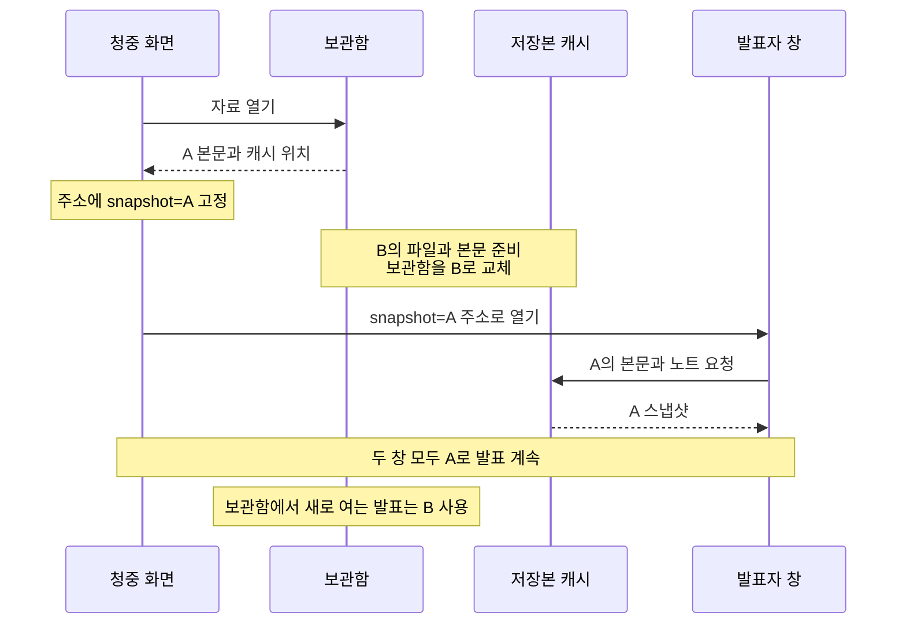

FEConf 2026을 앞두고 행사 측에서 인터넷 연결 없이도 발표할 수 있도록 자료를 준비해 달라는 요청을 받았다. 이를 계기로 발표 자료를 올리는 [research](https://research.yceffort.kr)에 오프라인 저장 기능을 붙였다.

research는 Marp로 마크다운을 변환하고, 그 결과를 직접 만든 React 뷰어에 넣는다. 슬라이드 전환 효과와 Mermaid 다이어그램이 있고, 별도 창으로 여는 발표자 화면에는 노트와 타이머, 다음 장 미리보기가 있다. 이 기능들을 오프라인에서도 그대로 쓰고 싶었다.

출발점은 기존 뷰어가 받는 자료와 실행 파일을 브라우저에 미리 저장하는 것이었다. 사용자가 고른 자료를 끝까지 내려받고, 연결이 끊긴 뒤에도 같은 뷰어로 열도록 만들기로 했다. 여기에 자료의 자동 업데이트를 붙이면서, 새 배포를 받는 방법과 진행 중인 발표를 유지하는 방법을 보완해 갔다.

> 최종 구현은 2026년 9월 30일 확인한 `main`의 `a16ccab2`를 기준으로 한다. Next.js 16.3.5의 App Router를 사용한다. 설계 설명의 코드와 경로는 현재 구현을 쓰고, 중간에 바뀐 부분은 당시 커밋을 따로 연결했다. 비교 실험과 화면 캡처, 회귀 테스트는 최종 커밋을 빌드해 실행했다. FEConf 현장에서 사용한 결과는 아직 포함하지 않았다.

## 기존 뷰어와 자료를 브라우저에 저장하기로 했다

[앞서 블로그에 붙인 서비스 워커](/2026/08/service-worker-caching-2)는 방문하면서 얻은 응답을 캐시에 남겼다. 발표 자료는 아직 넘겨 보지 않은 장까지 준비되어 있어야 한다. 그래서 사이트 방문과 별도로, 사용자가 자료를 골라 저장하는 기능으로 만들었다.

**한 자료의 첫 장부터 마지막 장까지를 하나의 저장 단위로 잡았다.** 예를 들어 `feconf-2026-vendor-sdk`를 고르면 본문과 테마, 발표자 노트, 수집한 이미지와 폰트를 함께 받는다. 자료 A를 저장하면서 자료 B의 본문까지 받지는 않지만, 뷰어를 실행할 JS와 CSS는 여러 자료가 공유한다.

자료를 조회하는 일과 파일 요청에 응답하는 일에 맞춰 저장소도 나눴다. IndexedDB는 `slug`를 키로 자료 레코드를 읽고 교체하는 데 사용한다. Cache Storage는 URL에 대응하는 `Response`를 보관해, 서비스 워커가 이미지나 실행 파일 요청에 그대로 응답하도록 한다.[^1][^2]

| 저장 대상                                   | 저장 위치                 | 사용하는 곳             |
| ------------------------------------------- | ------------------------- | ----------------------- |
| 장별 HTML, CSS, 폰트 선언, 노트와 저장 정보 | IndexedDB의 `decks`       | 보관함과 슬라이드 뷰어  |
| 자료의 이미지와 폰트 파일                   | 자료별 Cache Storage      | 서비스 워커의 파일 응답 |
| 공통 HTML, JS, CSS와 폰트                   | 뷰어 버전별 Cache Storage | 서버 없이 뷰어 시작     |

이것이 초기 저장 구조였다. 자료마다 본문 사본을 하나 더 두고 발표 중인 버전을 고정하는 처리는, 뒤에서 설명할 발표자 창 문제를 해결하면서 추가했다.[^3]

### Marp 변환은 서버에서 끝내고 결과를 저장한다

온라인 뷰어는 서버의 `generateRenderedMarp()`가 만든 결과를 받는다. Marp를 `htmlAsArray: true`로 실행해 장별 HTML을 얻고, 테마 CSS와 폰트 선언, 발표자 노트를 함께 반환한다. 오프라인에서도 같은 뷰어를 사용할 수 있도록, 이 서버 작업을 끝낸 결과를 저장하기로 했다.[^4]

`/api/slides/[slug]/offline`은 온라인 뷰어와 같은 렌더 함수를 호출하고 다음 형태의 JSON을 반환한다.[^5]

```ts
export interface OfflineDeck {
  schemaVersion: 1
  slug: string
  title: string
  description?: string
  html: string[]
  css: string
  fonts: string[]
  notes: string[]
  post?: string
  transition?: TransitionType
}
```

`html`에는 각 장의 HTML, `css`에는 테마와 슬라이드 스타일, `notes`에는 장별 발표자 노트가 들어간다. `fonts`는 실제 폰트 파일이 아니라 `@font-face` 선언이다. 파일은 선언 안의 URL을 찾아 따로 받아야 한다.

서버에서는 먼저 CSS의 `@import`를 펼치고, 그 안의 상대 URL을 원래 스타일시트 주소를 기준으로 절대 URL로 바꾼다. 그다음 `@font-face`를 분리한다. 외부 폰트 CSS가 참조한 `./font.woff2`를 research의 경로로 잘못 해석하지 않도록 하기 위해서다.

브라우저의 `collectDeckAssets()`는 **모든 장의 렌더 결과**와 CSS, 폰트 선언을 검사한다. 현재 화면의 DOM만 보면 아직 넘겨 보지 않은 장의 파일을 놓친다. Marp의 출력에는 SVG 안의 이미지와 배경 이미지도 있으므로 `img.src` 외에 `href`, `xlink:href`, `srcset`, CSS의 `url()`도 수집한다.[^6]

받은 파일은 저장본마다 독립된 주소로 보관한다. UUID를 만든 뒤 자산 URL을 `/offline-assets/{id}/{index}`로 바꾸고, HTML과 CSS, 폰트 선언의 참조도 함께 치환한다.

두 자료가 같은 `/images/architecture.png`를 쓰는 경우를 생각해 보자. 원래 URL의 캐시를 덮어쓰면 한 자료만 업데이트해도 다른 자료의 이미지까지 바뀐다. 저장본마다 주소와 캐시를 분리하면 두 자료가 서로 다른 시점의 이미지를 유지할 수 있다. 같은 파일을 중복 보관할 수 있지만, 자료마다 독립적으로 교체할 수 있다는 점을 우선했다.

수집 범위는 현재 Marp 출력에서 처리하도록 구현한 속성과 CSS URL까지다. iframe 내부나 JS가 나중에 만드는 요청, 내려받은 외부 파일 안의 의존성까지 따라가지는 않는다. `data:` URL은 본문에 내용이 포함되어 있어 그대로 두며, 문서 수명에 의존하는 `blob:` URL은 저장 대상으로 삼지 않는다.[^7] 새로운 임베드 형식을 넣는다면 자산 수집과 오프라인 테스트도 함께 늘려야 한다.

외부 파일은 CORS도 확인해야 한다. 온라인에서 ``로 보이는 파일이라도 JS의 `fetch()`로 내용을 읽지 못할 수 있다. 이 구현은 응답을 읽어 해시와 용량을 계산하므로, 내용을 읽을 수 없는 불투명한 응답으로 대신할 수 없다. 수집한 파일 중 하나라도 받지 못하면 저장을 실패로 처리한다.[^8]

### 공통 HTML로 서버 없이 뷰어를 시작한다

자료 본문을 저장했어도 뷰어를 시작할 HTML과 JS가 없으면 새 탭에서 열 수 없다. Next.js App Router의 `<Link>` 탐색에서 받는 RSC 페이로드와, 주소를 직접 열 때 받는 HTML 문서는 서로 다르다. 메모리에 남은 프리페치 결과만으로 브라우저를 다시 시작한 뒤의 동작까지 해결할 수는 없다.[^9][^10]

오프라인 경로에는 공통 HTML 하나를 준비했다. `/offline`, `/offline/{slug}`, `/offline/{slug}/presenter`는 모두 `OfflineLibrary`를 사용한다. 서비스 워커가 `/offline`의 빌드 결과를 돌려주면 이 컴포넌트가 실제 주소에서 `slug`와 발표자 모드 여부를 읽고, 브라우저 저장소의 자료를 연다.[^11]

예를 들어 `/offline/feconf-2026-vendor-sdk`에 접근해도 응답 본문은 공통 HTML이다. 주소창의 경로는 그대로이므로 뷰어가 해당 자료를 고를 수 있다. 자료마다 별도의 Next.js RSC 응답을 저장할 필요가 없어진다.

서버 HTML과 브라우저의 첫 렌더가 일치하도록 경로를 읽는 시점도 맞춘다.

```tsx
const pathname = useSyncExternalStore(
  subscribeLocation,
  () => window.location.pathname,
  () => '/offline',
)
```

세 번째 인수는 서버 렌더링과 브라우저의 초기 하이드레이션에서 같은 `/offline` 값을 제공한다. 처음에는 공통 보관함 화면을 그리고, 하이드레이션이 끝난 뒤 실제 주소의 자료 화면으로 바꾼다.[^12]

보관함의 `OfflineLink`는 일반 `<a>`를 렌더링한다. 문서 요청을 보내야 서비스 워커가 공통 HTML로 응답할 수 있기 때문이다. 자료를 열 때 문서를 다시 불러오지만, 새 탭과 새로고침도 같은 경로로 처리할 수 있다. RSC 요청에는 이 HTML을 반환하지 않는다.

자료를 읽은 뒤에는 기존 `MarpSlides`와 `PresenterView`에 전달한다. 장별 HTML과 CSS는 `useMarpShadowRoot()`가 Shadow DOM에 넣고, 폰트 선언은 `useFontFace()`가 문서에 등록한다. Marp의 브라우저용 처리도 실행한다.[^13] 따라서 서버 렌더 결과와 함께 이 코드들도 저장해야 한다.

이 구성은 뷰어가 필요한 자료를 브라우저 안에서 읽을 수 있어서 가능하다. 해당 화면에 자료 조회 API나 Server Action 의존성을 새로 넣으면 그 기능의 오프라인 동작도 따로 설계해야 한다.

### 아직 열지 않은 장의 실행 파일도 준비한다

Mermaid는 서버 렌더 뒤에도 브라우저에서 할 일이 남아 있다. 서버는 다이어그램 정의가 든 `.mermaid` 요소를 만들고, `Marp.tsx`가 해당 장을 표시할 때 `import('mermaid')`로 코드를 불러와 SVG를 만든다. 첫 장을 열면서 요청한 `<script>`만 저장하면 뒤쪽 다이어그램에 필요한 청크가 빠질 수 있다.

research의 빌드는 `next build` 뒤에 `generate-offline-runtime.mjs`를 실행한다. 이 스크립트가 `.next/static`의 JS, CSS, 폰트 파일과 파비콘 6개를 수집한다. `.next/server/app/offline.html`은 `public/offline-shell.html`로 복사하고, 모든 파일의 URL과 SHA-256을 `offline-runtime.json`에 기록한다.[^14]

이 목록으로 파일을 받고 실제 내용의 해시를 검사한다. 목록은 배포 A의 것을 받았는데 `/offline-shell.html`을 요청할 때 서버가 배포 B로 바뀌었다면, 200 응답만으로 두 파일을 함께 써도 되는지 판단할 수 없다. 해시가 맞지 않으면 새 뷰어 준비를 실패로 처리한다.

완성된 뷰어의 위치는 메타데이터 캐시에 기록한다. `ensureRuntime()`은 새 캐시에 필요한 파일을 모두 준비한 뒤 다음 기록을 바꾼다.[^15]

```ts
const metadata = await caches.open(META_CACHE)
await metadata.put(
  RUNTIME_KEY,
  Response.json({cacheName, shell: manifest.shell}),
)
```

이때부터 다음 문서 요청이 새 뷰어로 시작한다. 그전까지는 이전에 준비한 뷰어를 사용한다. 일반 파일 요청은 저장된 응답을 쓰지만, 다운로드 요청은 `cache: 'no-store'`와 서비스 워커의 별도 처리로 HTTP 캐시와 기존 저장본을 우회한다.[^16]

다운로드 범위에는 비용이 따른다. **자료는 선택해서 저장하지만 공통 실행 파일은 사이트 전체 빌드에서 가져온다.** 뷰어가 참조하는 청크만 추적하지 않고 해당 확장자의 파일을 모두 넣기 때문이다. 이번 빌드의 목록에는 115개 파일이 있었고, 압축 전 크기의 합은 7,150,785바이트(약 6.8MiB)였다. 최초 저장에는 이 공통 파일을 받는 비용도 들어간다.

## 저장한 자료를 다시 열고 갱신하면서 보완한 것들

자료를 저장하고 오프라인에서 여는 동작에 자동 업데이트를 추가했다. 사이트를 열거나 연결이 돌아왔을 때 새 자료를 받아 두면, 행사 직전 수정한 내용도 반영할 수 있다. 이 과정에서 배포마다 달라지는 파일과 서버가 응답하지 않는 상황, 두 창을 여는 시점까지 함께 다뤄야 했다.

### 배포할 때마다 같은 파일을 다시 받고 있었다

공통 HTML에는 Next.js 빌드 ID가 들어간다. 코드를 바꾸지 않아도 새 빌드의 다운로드 목록과 뷰어 캐시 이름이 달라질 수 있다. 초기 `ensureRuntime()`은 새 캐시 안에 파일이 없으면 네트워크에서 받았다. 이전 버전에 같은 파일이 남아 있어도 확인하지 않았으므로, 배포 뒤에는 바뀌지 않은 JS와 폰트도 다시 받게 됐다.

이를 고쳐 이전 캐시에서 같은 URL의 파일을 찾고, SHA-256도 일치하면 새 캐시로 복사하도록 했다. 없거나 내용이 달라진 파일만 네트워크에서 받는다. 새 캐시의 파일을 모두 준비한 뒤 뷰어 메타데이터를 바꾸는 순서는 유지했다. 이미 해당 버전의 캐시에 들어 있는 파일은 존재 여부만 확인한다.[^17]

자료 본문에도 비슷한 문제가 있었다. 자동 업데이트를 처음 붙일 때는 공통 뷰어 버전인 `runtimeRevision`을 자료의 갱신 조건에 포함했다. 뷰어 버전이 달라지면 자료 JSON이 같아도 이미지와 폰트를 다시 받아 새 저장본을 만들었다. 발표 중에는 이전 캐시를 지우지 않으므로, 배포가 반복될수록 같은 자료를 보관하는 데 쓰는 공간도 늘어날 수 있었다.

그래서 자료의 변경 여부를 뷰어 버전과 분리했다. 자료 JSON의 해시인 `sourceRevision`이 같고 자산이 모두 남아 있으면 기존 자료를 유지하고, 공통 뷰어만 별도로 갱신한다. 이전 뷰어 캐시도 정리 대상에 포함하되, 열린 발표가 없을 때만 지우도록 했다.[^17]

이 선택에는 한계가 있다. JSON은 그대로인데 같은 URL의 이미지 내용만 교체한 경우에는 자동 업데이트가 알아내지 못한다. 현재는 수동 업데이트로 다시 받을 수 있다. 이런 변경까지 자동으로 발견하려면 서버가 자산 버전도 제공해야 한다.

### 온라인인데 서버가 응답하지 않았다

첫 구현에서는 자료도 `/offline?deck={slug}` 형태로 열었고, `/offline` 경로는 저장된 HTML이 있으면 바로 사용했다. 자료별 경로인 `/offline/{slug}`는 그 뒤에 도입했다. 자동 업데이트를 추가하면서 온라인 진입은 네트워크 우선으로 바꿨다. 자동 업데이트 코드가 없던 이전 뷰어를 저장한 브라우저도 새 HTML을 받아 갱신 코드를 실행하도록 하려는 처리였다.[^18]

그런데 이 방식은 `navigator.onLine`이 `true`여도 서버가 응답하지 않는 경우를 처리하지 못했다. 기기가 와이파이에 연결되어 있다는 사실만으로 인터넷 접근이 보장되지는 않는다.[^19] 네트워크 요청이 실패해야 저장본을 쓰는데, 응답도 오류도 오지 않으면 계속 기다렸다.

먼저 저장본이 있을 때 문서 요청을 최대 5초 기다리도록 바꿨다. 5초 안에 응답 헤더를 받지 못하면 요청을 중단하고 저장된 HTML을 사용했다. 하지만 이 방법으로도 새 HTML을 받은 뒤 그 HTML이 참조하는 새 JS를 받지 못하는 경우는 해결하지 못했다. HTML 요청이 성공했다고 뷰어까지 실행할 수 있는 것은 아니었다.[^18]

결국 **준비된 뷰어가 있으면 연결 상태와 관계없이 그 버전으로 시작하도록 바꿨다.** 새 HTML과 실행 파일은 화면이 열린 뒤 별도로 받고, 모두 준비된 다음 탐색부터 사용한다. 자동 업데이트가 없던 과거 뷰어를 이미 저장한 경우에는 온라인 페이지에서 다시 저장해야 새 갱신 코드를 받을 수 있다. 이 호환 처리를 남기는 대신, 저장한 발표를 여는 순간에는 서버 응답을 기다리지 않도록 했다.

대기 시간 제한이 없던 네트워크 우선 구현과 최종 구현의 차이는 별도 실험으로 재현했다. 같은 앱 빌드와 발표 자료를 두고 서비스 워커만 바꿨다. 네트워크 우선 코드는 `399f7c75`, 저장본 우선 코드는 `a16ccab2`의 `sw.js`를 사용했다. 두 파일의 차이는 오프라인 경로의 문서 응답 순서다. 중간의 5초 제한 구현은 이 비교에 포함하지 않았다. 각 조건을 3회씩 실행한 결과는 다음과 같다.[^20]

| 네트워크 조건                | 네트워크 우선                  | 저장본 우선       |
| ---------------------------- | ------------------------------ | ----------------- |
| 연결 끊김                    | 123ms (122~128ms)              | 123ms (122~129ms) |
| 온라인, 문서 응답을 8초 지연 | 8,143ms (8,119~8,162ms)        | 125ms (124~126ms) |
| 온라인, 문서 응답 없음       | 3회 모두 20초 안에 열리지 않음 | 124ms (122~125ms) |

> 측정 환경: Apple M5, 메모리 24GiB, macOS arm64, Node.js 24.20.0, Playwright 1.63.0, headless Chromium 153.0.8010.12. CPU 제한 없이 로컬 프로덕션 서버를 사용했다. 매회 새로운 브라우저 컨텍스트에서 자료를 저장하고 저장에 사용한 탭을 닫은 뒤, 새 탭의 `page.goto()` 직전부터 `.marp-slides`가 보일 때까지 쟀다. 표는 중앙값이며 괄호는 최솟값과 최댓값이다. 저장 시간과 브라우저 프로세스 재시작은 포함하지 않았다.

지연과 무응답은 로컬 프록시에서 재현했다. 서비스 워커가 서버로 보내는 문서 요청만 지연하거나 보류하므로, 브라우저 안의 캐시 응답은 영향을 받지 않는다. 저장본 우선 구현에서는 9회 모두 프록시까지 도달한 대상 문서 요청이 0건이었다. 서버 응답을 기다리지 않고 저장된 뷰어를 시작한 결과다. 이 시간은 첫 화면의 뷰어가 표시되기까지의 값이며, 모든 장의 이미지와 다이어그램이 렌더링되는 데 걸린 시간은 아니다.

### 자산 주소를 바꾸다가 SVG 데이터 URL을 깨뜨렸다

이미지와 폰트를 저장본 전용 URL로 치환하는 과정에도 수정이 필요했다. 초기 코드는 CSS의 `url()`을 찾으면 치환 결과를 모두 큰따옴표로 감쌌다. 그런데 원래 큰따옴표가 들어 있는 SVG 데이터 URL은 작은따옴표로 감싸져 있을 수 있다. 이를 다시 큰따옴표로 감싸면 CSS 문자열이 중간에서 끊긴다.

`data:` URL은 별도 파일로 받지 않아 원래 주소를 유지한다. 주소를 바꿀 필요가 없는 항목까지 따옴표를 다시 쓰면서 문제가 생긴 것이다. 치환 결과가 원래 주소와 같으면 `url()` 전체를 원문 그대로 두도록 고쳤다. 테마 CSS와 인라인 스타일, `<style>` 안에 같은 SVG 데이터 URL을 넣고 저장 뒤에도 배경 이미지로 읽히는지 테스트를 추가했다.[^21]

### 나중에 연 발표자 창은 새 자료를 읽었다

자동 업데이트는 열린 화면의 React 상태를 바꾸지 않도록 구현했다. 그런데 청중 화면을 먼저 열고, 저장소가 업데이트된 뒤 발표자 창을 여는 경우에는 이것만으로 충분하지 않았다.

기존 `OfflineLibrary`는 창마다 `getSavedDeck(slug)`로 IndexedDB를 읽었다. 청중 화면이 A를 읽은 뒤 보관함이 B로 바뀌면, 나중에 연 발표자 창은 B를 읽는다. 청중에게 보이는 본문과 발표자가 읽는 노트가 다른 버전이 될 수 있었다. 동기화 채널도 자료의 `slug`만 사용해, 같은 자료의 A와 B가 장 번호를 주고받을 수 있었다.[^22]

따라서 청중 화면에서 연 발표자 창은 A의 노트와 다음 장을 읽고, 보관함에서 별도로 시작한 새 발표는 B를 읽도록 저장본을 고정했다.

이를 위해 다운로드 단계에서 `SavedDeck`을 해당 자산 캐시의 `/__research_offline_deck_snapshot__`에 JSON으로 함께 보관한다. 자료를 처음 열면 주소에 `?snapshot={assetCache}`를 붙이고, 청중 화면에서 여는 발표자 창에도 같은 값을 넘긴다. 캐시 이름에 다운로드마다 만든 UUID가 있으므로 특정 저장본을 계속 가리킬 수 있다.[^11]



이 그림의 A와 B는 설명을 위한 이름이며, 실제 `snapshot` 값은 `research-deck-v1-{UUID}` 형태다. 주소에 값이 있으면 `getPresentationDeck()`은 IndexedDB의 최신 레코드 대신 지정한 캐시의 스냅샷을 읽는다. 청중 화면이나 발표자 창을 새로고침해도 같은 본문을 사용한다. 지정한 저장본이 사라졌다면 다른 버전으로 넘어가지 않고 오류를 표시한다.

두 창의 장 번호는 `BroadcastChannel`로 동기화한다. 채널 이름에도 저장본을 넣어 `marp-slides-${slug}-${assetCache}`로 구분한다. 업데이트 뒤 B를 별도 창에서 열어도 A의 장 번호를 바꾸지 않는다.[^23]

## 완성된 저장본으로 발표를 시작하기

이제 목록 카드나 슬라이드의 우클릭 메뉴에서 오프라인 저장을 누르면 선택한 자료 전체를 받는다. 휴대폰에서는 길게 눌러 메뉴를 연다. 저장한 자료는 `/offline` 보관함에서 열거나 업데이트하고 삭제할 수 있다. 앱 설치는 필수가 아니다.


보관함에서 발표를 시작하면 준비된 공통 HTML로 뷰어가 실행된다. 처음 읽은 자료의 저장본을 주소에 고정하고, 청중 화면에서 여는 발표자 창도 같은 본문과 노트를 사용한다. 그 뒤 저장소에 새 버전이 생겨도 진행 중인 발표는 유지한다.

로컬에서는 `pnpm preview:research`로 프로덕션 빌드와 서버를 실행해 확인한다. 개발 서버는 실행 파일 목록을 만들지 않는다. 배포할 때도 research의 `build` 스크립트가 만든 공통 HTML과 다운로드 목록을 같은 빌드의 `/_next/static` 파일과 함께 올려야 한다. Next.js를 업그레이드한다면 이 목록이 의존하는 빌드 산출물의 위치도 다시 확인해야 한다.

### 완성된 저장본만 보관함에 올린다

초기 구현부터 파일을 받은 뒤 IndexedDB를 교체하는 순서를 사용했다. 발표자 창의 버전을 고정하면서 여기에 본문 스냅샷 저장도 추가했다. 현재 저장 완료까지의 흐름은 다음과 같다.

`downloadDeck()`은 다운로드마다 새 UUID의 자산 캐시를 만든다.[^15]

1. 공통 뷰어를 준비하고 자료의 자산 URL을 수집한다.
2. 새 캐시에 이미지와 폰트를 모두 받는다.
3. 자산 주소를 치환한 본문과 저장 정보를 같은 캐시에 JSON 스냅샷으로 보관한다.
4. 취소 여부를 다시 확인한다.
5. IndexedDB의 자료 레코드가 새 저장본을 가리키도록 교체한다.

IndexedDB 쓰기도 `put()` 요청의 성공만 보고 끝내지 않는다. 이후 오류로 트랜잭션이 중단될 수 있으므로 `database.ts`는 트랜잭션의 `complete` 이벤트를 기다린다. 이 시점에 저장 완료를 알린다.[^24]

네트워크 다운로드를 기다리는 동안에는 쓰기 트랜잭션을 열어 두지 않는다. IndexedDB 트랜잭션은 처리할 요청이 없으면 자동으로 커밋될 수 있어, `await fetch()` 뒤에도 활성 상태라고 기대할 수 없기 때문이다. 파일을 모두 받은 다음 짧은 트랜잭션으로 레코드만 교체한다.

원자적으로 교체되는 범위는 IndexedDB의 자료 레코드다. Cache Storage까지 같은 트랜잭션으로 묶이지는 않는다. 기존 저장본을 A, 새 저장본을 B라고 하면 중단 시점에 따라 다음 상태가 남는다.

| 중단 시점                                     | IndexedDB | 자산 캐시                            |
| --------------------------------------------- | --------- | ------------------------------------ |
| B 다운로드 중 실패 또는 취소                  | A         | 오류 처리가 끝나면 B를 지우고 A 유지 |
| B 준비 후 레코드 교체 전에 탭이 갑자기 종료됨 | A         | 참조되지 않는 B가 남을 수 있음       |
| B 레코드의 트랜잭션 완료 후                   | B         | 열린 발표를 위해 A도 보존            |

정상적인 오류 처리는 새 캐시를 지우지만, 탭이나 브라우저가 갑자기 종료되면 `finally`가 실행되지 않을 수 있다. 남은 캐시는 이후 정리한다. 중요한 순서는 레코드가 B를 가리키기 전에 B의 파일과 본문이 모두 준비되어 있어야 한다는 것이다. 취소 검사 뒤에 이미 시작한 IndexedDB 쓰기는 취소 신호로 되돌리지 않는다.

파일 다운로드는 최대 4개 작업으로 나누고 `Promise.allSettled()`로 모두 끝나기를 기다린다. 하나가 실패하자마자 캐시를 지우면 나머지 작업이 그 캐시에 계속 쓸 수 있기 때문이다. 그만큼 실패 안내는 남은 다운로드가 끝난 뒤에 나오며, 사용자가 취소하면 공통 취소 신호로 요청들을 멈춘다.

공통 뷰어의 갱신과 자료 레코드의 교체도 별개다. 새 뷰어가 준비된 뒤 자료 다운로드가 실패할 수 있으므로, 새 뷰어는 이전에 저장한 자료 형식도 읽을 수 있어야 한다.

### 자동 업데이트는 다음 발표에 반영한다

사이트를 열거나 인터넷 연결이 돌아오면 저장한 자료의 변경을 확인한다. 탭이 보이는 동안에는 5분 간격으로 확인하며, 탭으로 돌아왔을 때는 마지막 확인 시도에서 1분이 지났으면 다시 확인한다. 이 작업은 페이지가 열려 있을 때 실행한다.[^15]

자료의 버전 값은 두 가지다.

| 필드             | 계산하는 대상                | 용도                                 |
| ---------------- | ---------------------------- | ------------------------------------ |
| `sourceRevision` | API가 반환한 자료 JSON       | 본문, CSS, 노트 등의 변경 확인       |
| `revision`       | 자료 JSON과 받은 자산의 해시 | 이미지와 폰트까지 포함한 저장본 식별 |

API는 자료 JSON의 SHA-256을 ETag로 반환한다. 저장된 자산이 모두 남아 있으면 자동 업데이트 요청에 `If-None-Match`로 기존 값을 보낸다. 서버가 304로 응답하면 본문과 자산을 다시 받지 않는다. 공통 뷰어는 별도로 갱신하므로, 배포로 뷰어가 달라져도 자료 JSON이 같으면 기존 자료 캐시를 유지한다.

저장과 업데이트, 삭제는 Web Locks로 탭 사이의 실행 순서를 맞춘다. 자동 업데이트도 잠금을 얻은 뒤 자료 레코드를 다시 읽어, 기다리는 동안 다른 탭에서 삭제한 자료를 되살리지 않도록 한다. Web Locks가 없을 때의 Promise 큐는 같은 페이지 안의 작업만 조율한다.

업데이트 결과와 오류는 보관함에 표시한다. 진행 중인 발표에는 알림을 띄우거나 새 본문을 넣지 않는다. 저장소를 갱신하는 일과 발표 화면에 반영하는 시점을 분리한 것이다.

발표가 끝날 때까지는 이전 본문과 파일을 함께 유지한다. 뒤쪽 장에서 예전 빌드의 Mermaid 청크를 처음 요청할 수 있으므로, 그 발표에 필요한 파일도 남아 있어야 한다. 서비스 워커는 오프라인 청중 화면이나 발표자 창이 하나라도 있으면 이전 자산과 공통 실행 파일의 정리를 미룬다. 그런 창이 없을 때 현재 자료 레코드와 뷰어 메타데이터가 가리키는 캐시만 남긴다.

어느 창이 어느 버전을 쓰는지 세밀하게 추적하지 않으므로, 오래 열린 탭 하나 때문에 다른 자료의 이전 캐시까지 남을 수 있다. 새 서비스 워커를 강제로 활성화하는 `skipWaiting()`도 호출하지 않는다. 다만 사용자가 보관함에서 자료를 직접 삭제하면 해당 저장본의 캐시는 즉시 지운다. 다른 탭의 수동 삭제까지 막는 구조는 아니다.

### 브라우저를 닫고 다시 여는 것까지 확인한다

첫 화면이 열리는 시간과 발표 전체를 사용할 수 있는지는 별도로 확인해야 한다. `offline.spec.ts`는 자료를 저장한 브라우저를 닫고 같은 프로필로 다시 시작한 뒤, 네트워크 없이 온라인에서 보지 않았던 Mermaid 장에 직접 진입한다. 새로고침, 발표자 창, 노트와 타이머, 양방향 장 이동도 검사한다.[^25]

실패 상황에서는 최초 저장과 업데이트 도중의 취소, 자산 다운로드 실패, 서버 무응답, 새 HTML이 참조하는 JS의 다운로드 실패를 확인한다. `offline-updates.spec.ts`는 발표 중 저장소가 갱신되어도 기존 화면을 유지하는지, 늦게 연 발표자 창과 새로고침한 청중 화면이 같은 저장본에 머무는지 검사한다. 바뀌지 않은 파일의 재사용과 발표를 닫은 뒤의 캐시 정리도 포함한다.

`a16ccab2`를 빌드하고 `pnpm --filter research test:offline`을 실행해 headless Chromium에서 29개 테스트가 모두 통과했다. 오프라인 관련 20개와 뷰어, 발표자 노트 관련 9개다. 기존 무응답 테스트의 ‘5초 이내’는 회귀를 잡기 위한 통과 조건이다. 앞의 네트워크 비교표는 별도의 측정 스크립트로 수집한 실제 소요 시간이다.

다른 브라우저 엔진에서도 테스트를 실행했다. Playwright 1.63의 WebKit 26.6에서는 저장한 브라우저를 종료하고 오프라인으로 다시 열어 Mermaid 장과 발표자 창까지 확인하는 시나리오를 포함해 29개 중 11개가 통과하고 18개가 실패했다. 실패한 테스트는 대부분 실행 중에 네트워크를 끊거나 요청을 가로채는 조건이었다. 그래서 같은 조건을 실제 Safari에서 직접 재현했다. 브라우저를 종료한 뒤 오프라인으로 다시 여는 경우, 보관함을 연 상태에서 와이파이를 끄고 자료를 여는 경우, 와이파이에는 연결되어 있지만 인터넷이 되지 않는 경우 모두 저장한 자료가 열렸고, 발표자 창과 장 이동, 새로고침도 정상으로 동작했다. WebKit 테스트의 실패는 Playwright가 WebKit에서 네트워크 상태와 요청 가로채기를 흉내 내는 방식의 차이로 보고 있지만, 원인을 코드 수준에서 확인하지는 않았다. Firefox는 Playwright 1.63이 받는 Firefox 155가 이 macOS 환경에서 실행되지 않아 테스트하지 못했고, 실제 발표장 와이파이에서도 아직 확인하지 않았다.

저장 공간에도 여유가 필요하다. 업데이트 동안에는 이전 파일과 새 파일을 함께 보관하고, 열린 발표가 있으면 이전 캐시 정리도 미룬다. 보관함의 자료별 용량은 원본 JSON과 받은 자산의 합이며, 추가 본문 스냅샷과 공통 뷰어는 제외한다. 실제 저장 공간 사용량과는 다르다. 현재는 할당량 초과 오류를 안내하며, `navigator.storage.persist()`의 허용 여부는 브라우저가 결정한다.[^26][^27]

다운로드는 페이지의 JS에서 실행하므로 저장 완료 전에 탭을 닫으면 끝까지 받을 수 없다. 저장소는 출처와 브라우저 프로필별로 나뉘므로, 발표에 사용할 환경에서 저장해야 한다. `/offline` 경로의 저장본 우선 정책은 온라인 주소인 `/slides/{slug}`에는 적용하지 않는다. 온라인 주소는 여전히 네트워크 실패 뒤 오프라인 경로로 이동하므로 발표를 시작할 때는 보관함에서 여는 것이 기준이다.[^23]

발표 전 확인도 그 경로를 따른다. 저장 완료를 확인하고 브라우저를 종료한 뒤, 네트워크 없이 보관함에서 자료를 다시 연다. 첫 장뿐 아니라 뒤쪽 이미지와 Mermaid 다이어그램을 확인하고, 청중 화면에서 발표자 창을 열어 노트와 다음 장이 맞는지 살펴본다.

## 마치며

돌아보면 본문에서 고친 문제들은 비슷한 모양이었다. 배포가 일어나면 바뀌지 않은 파일까지 다시 받았고, 온라인이면 서버의 새 HTML부터 기다렸고, 나중에 연 발표자 창은 방금 갱신된 자료를 읽었다. 모두 새 버전을 곧바로 가져오려는 동작이었고, 발표장에서는 그 때문에 불필요한 다운로드가 생기거나 두 화면의 버전이 어긋났다. 지금 구현은 발표를 시작할 때 사용할 뷰어와 저장본을 정하고, 새 버전은 저장만 해 두었다가 다음에 열 때 쓴다.

그만큼 최신 자료는 한 번 늦게 반영된다. 발표 자료는 행사 직전에 받아 두고 그대로 쓰는 경우가 대부분이어서, 발표장에서 기다리지 않고 열리는 쪽을 더 중요하게 봤다. 비슷한 기능을 만든다면 무엇을 받아 둘지와 함께 받은 파일을 언제부터 쓸지도 먼저 정해 두면 설계가 수월할 것 같다. FEConf에서 이 기능으로 발표를 마치면 현장에서 겪은 결과를 덧붙이겠다.

---

[^1]: [IndexedDB 접근 코드](https://github.com/yceffort/blog/blob/a16ccab26f0d62ff71e11c95119cfce3ddfc79ef/apps/research/src/lib/offline/database.ts). `research-offline` 데이터베이스의 `decks` 저장소에서 `slug`로 자료를 조회하고 교체한다.

[^2]: MDN의 [IndexedDB API](https://developer.mozilla.org/en-US/docs/Web/API/IndexedDB_API)와 [Cache](https://developer.mozilla.org/en-US/docs/Web/API/Cache). Cache 문서는 저장한 항목이 명시적으로 요청하지 않으면 갱신되지 않고, 지우기 전까지 만료되지 않는다고 설명한다.

[^3]: [최초 오프라인 저장 구현](https://github.com/yceffort/blog/commit/9939a3c525be2f6baab74991f42ffe794706629c). 자료별 자산 캐시와 IndexedDB 레코드, 공통 뷰어를 먼저 구현했다. 자료 캐시에 본문 스냅샷을 보관하는 처리는 이후 추가했다.

[^4]: [Marp 렌더링과 폰트 선언 분리](https://github.com/yceffort/blog/blob/a16ccab26f0d62ff71e11c95119cfce3ddfc79ef/apps/research/src/lib/marp.ts). `generateRenderedMarp()`와 `renderMarp()`에서 온라인 뷰어와 오프라인 API가 사용하는 데이터를 만든다.

[^5]: [오프라인 API](https://github.com/yceffort/blog/blob/a16ccab26f0d62ff71e11c95119cfce3ddfc79ef/apps/research/src/app/api/slides/%5Bslug%5D/offline/route.ts), [자료와 저장본의 타입](https://github.com/yceffort/blog/blob/a16ccab26f0d62ff71e11c95119cfce3ddfc79ef/apps/research/src/lib/offline/types.ts). 코드 블록의 `OfflineDeck`은 해당 타입 선언을 옮겼다.

[^6]: [collectDeckAssets와 rewriteDeckAssets](https://github.com/yceffort/blog/blob/a16ccab26f0d62ff71e11c95119cfce3ddfc79ef/apps/research/src/lib/offline/assets.ts). 자산 수집과 저장본별 URL 치환의 실제 범위다.

[^7]: MDN의 [blob: URLs](https://developer.mozilla.org/en-US/docs/Web/URI/Reference/Schemes/blob). 객체 URL의 수명과 해제, 문서가 종료될 때의 동작을 설명한다. 이 구현이 수집에서 제외하는 주소는 [assets.ts](https://github.com/yceffort/blog/blob/a16ccab26f0d62ff71e11c95119cfce3ddfc79ef/apps/research/src/lib/offline/assets.ts)에서 확인할 수 있다.

[^8]: MDN의 [CORS](https://developer.mozilla.org/en-US/docs/Web/HTTP/Guides/CORS)와 [Using the Fetch API](https://developer.mozilla.org/en-US/docs/Web/API/Fetch_API/Using_Fetch). 교차 출처 응답을 JS에서 읽는 조건과 불투명한 응답, 자격 증명 전달 범위를 설명한다.

[^9]: Next.js 공식 문서의 [Linking and Navigating](https://nextjs.org/docs/app/getting-started/linking-and-navigating)과 [Prefetching의 Client cache](https://nextjs.org/docs/app/guides/prefetching#client-cache). 설치된 Next.js 16.3.5에 포함된 같은 문서와도 대조했다.

[^10]: Next.js 공식 문서의 [Offline support](https://nextjs.org/docs/app/guides/offline-support). 실험적 연결 감지와 요청 재시도, 전체 페이지를 오프라인으로 다시 여는 동작의 범위를 구분한다.

[^11]: [OfflineLibrary](https://github.com/yceffort/blog/blob/a16ccab26f0d62ff71e11c95119cfce3ddfc79ef/apps/research/src/components/offline/OfflineLibrary.tsx), [OfflineLink](https://github.com/yceffort/blog/blob/a16ccab26f0d62ff71e11c95119cfce3ddfc79ef/apps/research/src/components/offline/OfflineLink.tsx), [저장본 스냅샷](https://github.com/yceffort/blog/blob/a16ccab26f0d62ff71e11c95119cfce3ddfc79ef/apps/research/src/lib/offline/snapshots.ts).

[^12]: React 공식 문서의 [useSyncExternalStore에서 서버 렌더링 지원하기](https://react.dev/reference/react/useSyncExternalStore#adding-support-for-server-rendering). `getServerSnapshot`은 서버 렌더링과 브라우저의 하이드레이션에서 같은 초기 값을 제공해야 한다.

[^13]: [useMarpShadowRoot](https://github.com/yceffort/blog/blob/a16ccab26f0d62ff71e11c95119cfce3ddfc79ef/apps/research/src/hooks/useMarpShadowRoot.ts), [useFontFace](https://github.com/yceffort/blog/blob/a16ccab26f0d62ff71e11c95119cfce3ddfc79ef/apps/research/src/hooks/useFontFace.tsx), [Marp 컴포넌트와 Mermaid 지연 로딩](https://github.com/yceffort/blog/blob/a16ccab26f0d62ff71e11c95119cfce3ddfc79ef/apps/research/src/components/Marp.tsx).

[^14]: [공통 실행 파일 다운로드 목록 생성 스크립트](https://github.com/yceffort/blog/blob/a16ccab26f0d62ff71e11c95119cfce3ddfc79ef/apps/research/scripts/generate-offline-runtime.mjs), [research 빌드 명령](https://github.com/yceffort/blog/blob/a16ccab26f0d62ff71e11c95119cfce3ddfc79ef/apps/research/package.json).

[^15]: [다운로드와 자동 업데이트 구현](https://github.com/yceffort/blog/blob/a16ccab26f0d62ff71e11c95119cfce3ddfc79ef/apps/research/src/lib/offline/client.ts). `ensureRuntime()`, `downloadDeck()`, `withDownloadLock()`, `checkOfflineUpdates()`, `watchOfflineUpdates()`를 기준으로 설명했다.

[^16]: MDN의 [Request.cache](https://developer.mozilla.org/en-US/docs/Web/API/Request/cache). `no-store`의 HTTP 캐시 동작을 설명한다. 서비스 워커가 같은 옵션을 보고 저장된 응답을 사용하지 않는 처리는 [sw.js](https://github.com/yceffort/blog/blob/a16ccab26f0d62ff71e11c95119cfce3ddfc79ef/apps/research/public/sw.js)에 별도로 구현되어 있다.

[^17]: [이전 뷰어 캐시 정리](https://github.com/yceffort/blog/commit/6e5bcba1feb48ad67e7ea9e302b978cb0b6f635e), [같은 실행 파일 재사용](https://github.com/yceffort/blog/commit/399f7c758030b59f6c344df9cd1a6f76f127a0f8), [자료 갱신 조건에서 뷰어 버전 분리](https://github.com/yceffort/blog/commit/89bc6bf42f5b0ef0802619bb44c78e84a49ce666).

[^18]: [자동 업데이트와 네트워크 우선 진입 추가](https://github.com/yceffort/blog/commit/e996a8792ea5eb0becf71921c00d651731160b71), [5초 대기 제한 추가](https://github.com/yceffort/blog/commit/6b7a29ba6ebb017501b5311ae3fab8db19ba8ed0), [준비된 뷰어로 바로 시작하도록 변경](https://github.com/yceffort/blog/commit/054da489258bf0d7e3c2e8c2f71970be7bb063f7). 마지막 변경에는 새 HTML의 JS를 받지 못하는 조건의 테스트도 포함된다.

[^19]: MDN의 [Navigator.onLine](https://developer.mozilla.org/en-US/docs/Web/API/Navigator/onLine). 로컬 네트워크에 연결되어 있어도 인터넷에 접근하지 못할 수 있으며, 브라우저와 운영체제의 판단 방식도 다르다.

[^20]: 재현 스크립트는 저장소의 `experiments/offline-marp/measure.mjs`에 있다. research를 프로덕션 빌드한 뒤 `pnpm --filter research exec next start --port 3312`로 서버를 열고, 저장소 루트에서 `node experiments/offline-marp/measure.mjs`를 실행한다. [측정 원본 JSON](https://yceffort.kr/2026/09/images/offline-marp-slides/navigation-measurements.json)에 실행 환경과 18회 측정값, 서비스 워커 코드의 해시를 남겼다. 로컬 프록시는 네트워크까지 도달한 문서 요청만 지연하거나 보류한다.

[^21]: [변경하지 않는 CSS URL 원문 보존](https://github.com/yceffort/blog/commit/7572c4a41cc73c35f6bd5384f49042fa701064d2). `rewriteDeckAssets()`에서 주소가 같으면 매칭한 원문을 그대로 반환하도록 바꾸고, SVG 데이터 URL을 사용하는 세 위치의 회귀 테스트를 추가했다.

[^22]: [발표 중인 저장본과 동기화 채널 고정](https://github.com/yceffort/blog/commit/09940768be8c2dba4f9397fccfae49d6be1556cd). 창마다 최신 레코드를 읽던 동작을 저장본 스냅샷 조회로 바꾸고, 업데이트 뒤 늦게 여는 발표자 창과 새로고침을 테스트했다.

[^23]: [서비스 워커의 문서 응답과 캐시 정리](https://github.com/yceffort/blog/blob/a16ccab26f0d62ff71e11c95119cfce3ddfc79ef/apps/research/public/sw.js), [발표 화면 동기화](https://github.com/yceffort/blog/blob/a16ccab26f0d62ff71e11c95119cfce3ddfc79ef/apps/research/src/hooks/useBroadcastChannel.ts).

[^24]: MDN의 [IDBTransaction](https://developer.mozilla.org/en-US/docs/Web/API/IDBTransaction). 트랜잭션의 활성 상태와 자동 커밋, 실패 조건을 설명한다. 저장 완료를 기다리는 코드는 [database.ts](https://github.com/yceffort/blog/blob/a16ccab26f0d62ff71e11c95119cfce3ddfc79ef/apps/research/src/lib/offline/database.ts)의 `transaction()`을 기준으로 했다.

[^25]: [오프라인 저장과 재시작 테스트](https://github.com/yceffort/blog/blob/a16ccab26f0d62ff71e11c95119cfce3ddfc79ef/apps/research/tests/offline.spec.ts), [자동 업데이트 테스트](https://github.com/yceffort/blog/blob/a16ccab26f0d62ff71e11c95119cfce3ddfc79ef/apps/research/tests/offline-updates.spec.ts).

[^26]: MDN의 [StorageManager.persist()](https://developer.mozilla.org/en-US/docs/Web/API/StorageManager/persist). 영구 저장 요청의 허용 여부는 브라우저 정책에 따른다.

[^27]: MDN의 [Storage quotas and eviction criteria](https://developer.mozilla.org/en-US/docs/Web/API/Storage_API/Storage_quotas_and_eviction_criteria). 출처별 저장소, 할당량 초과와 저장소 제거, 영구 저장의 범위를 설명한다.
