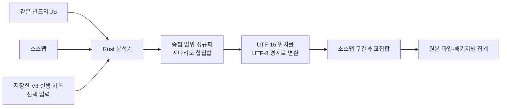

## Table of Contents

## 393KB가 실행되지 않았다. 이만큼 지울 수 있을까

[지난 글](/2026/09/unused-javascript-cost)에서는 호출하지 않는 JavaScript를 10MiB까지 늘렸다. 함수 본문을 실행하지 않아도 전송과 소스 처리에 비용이 들었다. 이번에는 실험용 파일 대신 이 블로그의 번들을 보고 싶었다. 어떤 코드가 지금 필요하지 않고, 그 코드는 어디에서 들어왔을까.

프로덕션 빌드의 첫 화면에서 실행 기록을 수집했다. 기록이 있는 JavaScript는 13개, 압축 전 672,025B였다. 그중 실행되지 않은 구간이 393,540B, 약 58.6%였다.

그런데 이 숫자를 원본 파일로 돌려놓자 서로 다른 문제가 섞여 있었다. 소개 페이지의 컴포넌트는 페이지에 방문하기 전에 내려와 있었다. 검색 라이브러리는 검색창을 열기도 전에 들어와 있었다. 검색을 마친 뒤에도 검색 라이브러리의 절반 이상이 미실행으로 남았다.

소개 페이지의 코드는 링크 prefetch 때문이었다. 검색 라이브러리는 공통 레이아웃의 정적 import 때문이었다. 검색 후에도 남은 코드에는 브라우저에서 호출하지 않은 인덱스 생성·수정 API가 있었다. 모두 커버리지에서는 같은 미실행 구간이지만, 수정할 위치와 판단에 필요한 정보는 달랐다.

이 구분을 자동으로 집계하려고 Rust 분석기를 만들었다. 만드는 동안 더 먼저 풀어야 할 문제도 생겼다. **V8의 실행 범위를 더하면 실행된 코드의 크기가 되는가. 소스맵의 위치를 연결하면 원본 파일별 크기가 정확해지는가. DevTools와 같은 입력을 읽으면 같은 값이 나오는가.**

이 글은 그 계산을 따라간 기록이다. 먼저 실행 기록을 해석하고, 그 결과를 소스맵과 결합한 다음, 실제 블로그에서 바꿀 수 있는 코드까지 내려간다.

## 브라우저에서 떼어낼 수 있는 부분부터 나눴다

먼저 이미 있는 도구부터 짚어야 한다. [source-map-explorer](https://github.com/danvk/source-map-explorer#code-coverage-heat-map)는 소스맵으로 번들 기여도를 보여주고 `--coverage`로 Chrome의 실행 기록을 겹친다. [monocart-coverage-reports](https://github.com/cenfun/monocart-coverage-reports)는 V8 바이트 통계와 소스맵 변환을 지원한다. [c8](https://github.com/bcoe/c8#c8-report)도 저장된 기록으로 보고서를 다시 만들 수 있다. 수집과 분석의 분리 자체가 새로운 기능은 아니다.

그럼에도 직접 만든 이유는 이 계산을 Node 없이 실행되는 Rust 프로그램으로 옮겨보고 싶었기 때문이다. 기존 도구가 어떤 위치를 세는지 이해하고, 같은 입력에서 일치하는 부분과 내가 다르게 정한 부분을 확인하는 것이 목표였다. 기존 도구보다 빠르다는 가정은 두지 않았다. 이번 글에서 비교한 것은 실행 범위와 집계 결과이며, 도구 사이의 성능 우열은 측정하지 않았다.

처음에는 빌드 파일만으로 DevTools Coverage와 비슷한 결과를 내고 싶었다. 하지만 빌드 결과에 들어 있는 정보와 실행한 뒤에야 생기는 정보는 다르다.

다음 코드를 생각해보자.

```js
if (globalThis.__API_MOCKING) {
  startMockServer()
}
```

이 값이 빌드할 때 정해지지 않았다면 번들러는 분기를 남길 수 있다. 나중에 번들과 소스맵을 읽는 Rust 프로그램에도 그 실행의 값은 없다. 소스맵을 아무리 자세히 읽어도 `startMockServer()`를 호출했는지는 나오지 않는다. 코드가 들어온 이유를 추적하는 것과 실행됐는지를 관찰하는 것은 별도의 작업이다.

그래서 입력을 세 가지로 나눴다.

| 입력        | 알 수 있는 것                          | 들어 있지 않은 것                         |
| ----------- | -------------------------------------- | ----------------------------------------- |
| 생성된 JS   | 실제 전달할 코드와 그 길이             | 사용자가 어느 경로를 실행했는지           |
| 소스맵      | 생성 위치와 원본 위치의 대응           | 실행 여부, 모듈 사이의 import 그래프      |
| V8 커버리지 | 관찰 구간 동안 함수·블록이 실행된 횟수 | 다른 사용자나 다른 입력에서도 필요 없는지 |

수집기는 Chromium에서 동작을 한 번 수행하고 V8 기록을 저장한다. Rust는 JS, map, 기록 파일만 읽는다. 이후 집계에는 브라우저도 JavaScript 런타임도 필요 없다. 커버리지를 생략하면 같은 분석기가 빌드 크기와 원본별 기여도만 계산한다.



DevTools에도 원본 파일별 커버리지를 계산하는 구현이 있다. 이번 도구의 목적은 그 기능의 존재를 새로 발견하는 데 있지 않았다. **파일로 보관한 입력을 가지고, 집계 규칙과 결과를 검사할 수 있는 분석 단계를 만드는 것**이었다. Rust를 고른 것도 이 단계를 실행 파일 하나로 두고 싶어서였다. JS 엔진을 내장하거나 브라우저보다 빠르게 JavaScript를 실행하려는 시도는 아니다.

프로젝트 이름은 `bundle-trace`로 정했다. 블로그와는 별도의 Cargo workspace이며, 분석 코드는 Next.js나 Playwright를 참조하지 않는다. 소스맵 디코딩에는 기존 `sourcemap` 크레이트를 쓰고, 커버리지 범위 처리와 문자 위치 변환, 두 결과의 결합을 구현했다.

```text
bundle-trace/
  src/main.rs         CLI 인자와 보고서 출력
  src/coverage.rs     V8 범위 정규화, 관찰 구간의 합집합
  src/text.rs         UTF-16·UTF-8 경계와 줄 위치
  src/maps.rs         sourceMappingURL 해석
  src/attribution.rs  원본에 귀속할 생성 코드 구간
  src/lib.rs          해시 검증, 구간 교차, 집계
```

커버리지 수집용 JavaScript는 이 실행 파일의 의존성이 아니라 입력을 만드는 별도 프로그램이다. 이 경계를 확인하려고 마지막에는 저장소 밖의 임시 디렉터리에 바이너리와 기록된 fixture만 복사해 실행했다. Node와 Chromium을 호출하지 않고 초기 로드와 후속 호출의 기록을 합쳐, 전체 293B 중 실행 관찰 208B와 미실행 85B를 얻었다. 아래에서 이 208B가 만들어지는 과정을 따라간다.

## V8이 돌려주는 것은 실행된 구간의 목록이 아니다

수집은 CDP의 `Profiler.startPreciseCoverage`로 시작한다. 페이지를 열기 전에 켜고, 블록 단위 기록과 실행 횟수를 요청했다.

```js
await cdp.send('Profiler.enable')
await cdp.send('Profiler.startPreciseCoverage', {
  callCount: true,
  detailed: true,
})

// 페이지 진입, 버튼 클릭 등 관찰할 동작

const {result} = await cdp.send('Profiler.takePreciseCoverage')
```

결과는 스크립트 아래 함수들이 있고, 각 함수 아래 `ranges`가 있는 구조다. 범위의 끝은 포함하지 않는다. 다음은 구조를 설명하기 위한 입력이다.

```json
{
  "functionName": "search",
  "isBlockCoverage": true,
  "ranges": [
    {"startOffset": 100, "endOffset": 200, "count": 1},
    {"startOffset": 140, "endOffset": 180, "count": 0}
  ]
}
```

이 함수는 한 번 실행됐지만 `[140, 180)`에 있는 블록은 실행되지 않았다. 실행된 길이는 100이 아니라 60이다. 바깥 범위는 기본 상태를 주고, 안쪽 범위는 그 상태를 덮어쓴다.

`isBlockCoverage`도 확인해야 한다. `detailed: true`를 요청했다고 모든 함수에 블록 정보가 생기는 것은 아니다. 실제 기록에서 호출하지 않은 함수는 전체 범위 하나와 `count: 0`, `isBlockCoverage: false`로 나타났다. 아직 실행하지 않은 함수의 내부 분기까지 기록이 있어야 한다고 요구할 이유는 없다. 반면 **실행된 함수인데 함수 단위 정보만 있다면** 어느 분기가 실행됐는지는 구분할 수 없다. 분석기는 이 경우 경고를 남긴다.

[V8의 커버리지 설명](https://v8.dev/blog/javascript-code-coverage)은 best-effort와 precise 수집을 구분한다. 이번 분석은 precise 기록을 입력으로 삼았다. 또 [CDP 정의](https://github.com/ChromeDevTools/devtools-protocol/blob/master/json/js_protocol.json)의 `startPreciseCoverage`에는 최적화된 코드의 실행을 막는다는 설명이 있다. 커버리지를 켠 채 측정한 실행 시간을 평소의 실행 시간처럼 취급해서는 안 되는 이유다. 뒤의 전송량 확인은 커버리지와 별도로 실행했다.

### 미실행 범위를 전부 빼도 틀린다

처음 생각하기 쉬운 계산은 두 가지다. 실행된 범위를 전부 더하거나, 실행되지 않은 범위를 합쳐 전체에서 빼는 것이다. 앞의 방식은 중복으로 세고, 뒤의 방식은 더 안쪽에 있는 실행 범위를 잃을 수 있다.

아래는 이 차이를 확인하기 위해 만든 중첩 범위 테스트다. 실제 블로그 기록을 축약한 것이 아니라, 집계 규칙을 검증하기 위한 입력이다.

```text
[0, 100)    count=1
  [10, 90)  count=0
    [20, 40)  count=1
      [25, 30)  count=0
```

바깥의 실행 범위 길이는 100이다. 그러나 그 안에서 80이 미실행으로 바뀌고, 다시 그 안에서 20이 실행으로 바뀌며, 그중 5가 미실행으로 바뀐다. 답은 35다. 이를 실제로 겹치지 않는 구간으로 펴면 계산이 더 분명해진다.

| 구간        | 적용할 상태                | 실행 길이 |
| ----------- | -------------------------- | --------: |
| `[0, 10)`   | 가장 바깥의 실행 상태      |        10 |
| `[10, 20)`  | 두 번째 범위의 미실행 상태 |         0 |
| `[20, 25)`  | 세 번째 범위의 실행 상태   |         5 |
| `[25, 30)`  | 가장 안쪽의 미실행 상태    |         0 |
| `[30, 40)`  | 세 번째 범위로 복귀        |        10 |
| `[40, 90)`  | 두 번째 범위로 복귀        |         0 |
| `[90, 100)` | 가장 바깥으로 복귀         |        10 |

Rust에서는 시작 위치 순으로 범위를 정렬하고, 시작점이 같으면 큰 범위를 먼저 둔다. 스택 맨 위에 현재 위치를 소유한 범위를 둔다. 새 범위가 시작되기 전에 끝난 범위는 꺼내고, 새 범위 안으로 들어가면 그 상태를 적용한다. 안쪽 범위가 끝나면 스택 아래에 있던 부모 상태로 돌아간다.

이 구조에서 중요한 것은 함수별로 길이를 따로 더하지 않는 것이다. 함수 본문 안에 다른 함수가 선언될 수 있으므로 함수 사이에도 위치가 겹친다. 스크립트의 모든 범위를 같은 좌표계에 놓고 처리해야 한다.

정렬 이후 순회는 범위 수에 비례한다. 정렬을 포함하면 범위 수를 R이라고 할 때 O(R log R)이다. 문자열의 모든 바이트에 실행 여부를 저장하지 않고, 상태가 바뀌는 경계만 유지한다. 반대로 일부만 걸쳐서 교차하는 범위는 이 중첩 모델로 설명할 수 없으므로 오류로 처리했다. 입력이 잘못됐는데도 그럴듯한 합계를 내는 것보다 어느 가정이 깨졌는지 드러내는 편이 낫다.

### 두 번째 수집 결과는 첫 번째 결과의 갱신본이 아니다

여기서 한 번 더 실수하기 쉬웠다. `takePreciseCoverage`를 두 번 호출하면 두 번째 결과가 페이지 진입 이후의 누적 기록이라고 생각하기 쉽다. 실제로는 카운터가 초기화된다. [V8 구현의 `CollectBlockCoverage`](https://github.com/v8/v8/blob/main/src/debug/debug-coverage.cc)는 블록 정보를 수집한 뒤 카운터를 0으로 돌린다.

이를 확인하려고 작은 fixture를 만들었다.

```js
export function makeFeature() {
  return function later(flag) {
    return flag ? '한🔥' : '다른 경로'
  }
}

// 초기 로드에서 실행한다.
const run = makeFeature()

// 첫 수집 이후에 실행한다.
run(true)
```

실제 fixture는 esbuild로 번들링하고 축소한 뒤 Chromium에서 실행했다. 첫 수집에서는 바깥 함수가 실행됐고, 나중에 호출할 함수는 실행되지 않았다. 두 번째 수집에서는 나중 함수가 실행됐지만 바깥 함수의 기록은 아예 빠졌다. 위치는 다음과 같았다.

```text
첫 수집
  바깥 함수 [6, 62)    count=1
  나중 함수 [26, 61)   count=0

두 번째 수집
  나중 함수 [26, 61)   count=1
    선택하지 않은 분기 [52, 60) count=0
  바깥 함수의 항목은 없음
```

두 번째 결과에서 바깥 함수를 0으로 기록해줄 것이라고 가정해도 안 됐다. 이번 Chromium은 해당 항목을 생략했다. 따라서 범위의 출현 여부나 실행 횟수 배열을 그대로 덮어쓰는 방식으로 누적 상태를 만들 수 없다.

먼저 **각 수집 결과 안에서** 중첩을 해소하고, 그다음 실행 구간들의 합집합을 구했다. 여러 시나리오도 같은 방식으로 합친다. 목적은 호출 횟수의 합이 아니라 적어도 한 번 관찰한 위치의 집합이다.

| fixture 기록     | 실행된 UTF-16 코드 유닛 | 실행된 UTF-8 바이트 |
| ---------------- | ----------------------: | ------------------: |
| 초기 로드        |                     177 |                 177 |
| 후속 호출 구간만 |                      27 |                  31 |
| 두 기록의 합집합 |                     204 |                 208 |

두 번째 기록만 보고 초기화 코드를 미실행이라고 표시하면, 이번 관찰 구간에서는 맞아도 페이지 전체 사용 여부를 설명할 때는 틀린 답이 된다. 수집의 시작과 끝도 결과의 일부여야 한다.

## Rust의 문자열 인덱스에 오프셋을 그대로 넣을 수 없었다

위 표에서 27이 왜 31이 됐을까. `한🔥` 때문이다.

V8의 소스 오프셋은 UTF-16 코드 유닛을 기준으로 한다. JavaScript 소스맵의 생성 열도 같은 단위를 쓴다. Rust의 `str`에서 범위를 자를 때 쓰는 인덱스는 UTF-8 바이트다. ASCII 번들로만 시험하면 이 차이가 숨는다.

`한🔥x`를 예로 들면 경계가 이렇게 달라진다.

| UTF-16 위치 |     UTF-8 위치 | 의미                      |
| ----------: | -------------: | ------------------------- |
|           0 |              0 | 문자열 시작               |
|           1 |              3 | `한` 다음                 |
|           2 | 변환할 수 없음 | `🔥`의 서로게이트 쌍 중간 |
|           3 |              7 | `🔥` 다음                 |
|           4 |              8 | `x` 다음                  |

`[1, 3)`은 UTF-16에서는 길이 2지만, UTF-8로 바꾸면 `[3, 7)`이고 길이 4다. 오프셋에 숫자를 그대로 넣으면 문자 경계를 깨거나 다른 코드를 집계한다.

그래서 파일을 한 번 순회하며 UTF-16 경계에서 UTF-8 경계로 가는 테이블을 만들었다. 실제 구현의 핵심은 다음과 같다. 서로게이트 쌍의 중간에는 유효한 바이트 위치 대신 `None`을 넣는다.

```rust
let mut boundaries = vec![Some(0)];
for (byte, ch) in text.char_indices() {
    if ch.len_utf16() == 2 {
        boundaries.push(None);
    }
    boundaries.push(Some(byte + ch.len_utf8()));
}
```

커버리지 범위를 이 테이블로 변환한 뒤 바이트를 센다. 줄·열 위치를 변환하기 위해 줄의 시작과 끝도 따로 기록한다. CRLF에서는 두 코드 유닛을 소비하지만 줄은 한 번만 바뀌어야 한다. 열 번호가 그 줄을 넘어가거나 서로게이트 쌍의 중간을 가리키면 유효한 위치로 취급하지 않는다.

여기서 출력 지표도 정했다. 주 지표는 **생성된 JS의 UTF-8 바이트**다. DevTools 계산과 비교하기 위한 UTF-16 길이는 별도 필드에 남겼다. 압축 전 파일 크기를 설명하면서 JavaScript 문자열 길이를 바이트라고 부르는 혼동을 피하고 싶었다.

## 소스맵은 위치 대응표이지 바이트 소유권 표가 아니다

실행 구간을 복원해도 아직 원본 파일 이름은 없다. V8은 생성된 스크립트를 실행했으므로, 커버리지 역시 생성된 스크립트의 좌표를 돌려준다. 원본 TypeScript로 돌아가려면 같은 빌드의 소스맵이 필요하다.

[ECMA-426](https://tc39.es/ecma426/)의 소스맵에는 생성 위치와 원본 위치를 연결하는 매핑이 있다. 보통 `mappings` 문자열에 VLQ로 압축되어 있고, 디코딩하면 다음과 같은 점들이 나온다.

```text
생성 (0행, 10열) → sources[0]의 (3행, 2열)
생성 (0행, 25열) → sources[1]의 (8행, 0열)
생성 (1행,  4열) → sources[0]의 (5행, 0열)
```

여기에는 "첫 번째 원본이 생성 코드의 15바이트를 소유한다"는 필드가 없다. 매핑 지점 사이를 어떤 원본에 배정할지는 집계기가 결정해야 한다. 원본 파일의 `sourcesContent` 길이를 더하는 것도 답이 아니다. 원본에서 삭제된 코드와 변환 과정에서 추가된 코드가 있을 수 있기 때문이다.

이번 도구에서는 **한 매핑 지점부터 같은 줄의 다음 매핑 지점까지**를 그 원본에 배정했다. 같은 줄에 다음 매핑이 없으면 줄 끝에서 멈춘다. 첫 매핑 전의 접두부, 줄바꿈, 원본 정보가 없는 매핑, 매핑이 전혀 없는 줄은 `[unmapped]`에 둔다.

이것도 추정이다. 같은 줄 안에서 매핑 두 개 사이에 변환기가 만든 구문이 끼어 있으면 앞쪽 원본에 붙을 수 있다. `[unmapped]`를 두었다고 나머지 귀속이 의미적으로 정확하다는 보장이 생기는 것은 아니다.

### 13바이트짜리 파일로 DevTools와 차이를 만들었다

정책 차이를 확인하기 위해 다음 문자열을 그대로 파일에 썼다. 세미콜론 두 개와 LF 한 개를 포함하며 마지막 줄바꿈은 없다. 바이트 수를 비교하는 입력이므로 포매터가 코드를 바꾸지 않도록 문자열로 표시한다.

```text
const source = "foo();\nbar();"
```

파일은 ASCII 13바이트다. map에는 첫 줄 첫 열이 `a.ts`로 연결된다는 매핑 하나만 넣었다.

```json
{
  "version": 3,
  "sources": ["a.ts"],
  "names": [],
  "mappings": "AAAA",
  "sourcesContent": ["foo()"]
}
```

`AAAA`의 네 값은 모두 0이다. 첫 생성 열, 원본 파일 인덱스, 원본 행, 원본 열의 초기 위치를 나타낸다. 두 번째 줄에는 매핑이 없다.

이 입력을 Rust 분석기에 넣고, DevTools의 `calculateSizeForSources`를 추출해 최소한의 SourceMap/Text 어댑터로 같은 경계를 전달했다. [비교한 구현](https://github.com/ChromeDevTools/devtools-frontend/blob/63555438dd48b3cdecaa6293b01c446d86176d42/front_end/panels/coverage/CoverageModel.ts)은 마지막 매핑의 구간을 전체 콘텐츠 끝까지 계산한다.

| 집계                 | `a.ts`의 몫 | 원본 미지정 |
| -------------------- | ----------: | ----------: |
| DevTools의 해당 함수 |          13 |           0 |
| 이번 Rust 정책       |           6 |           7 |

ASCII만 있으므로 인코딩 차이는 아니다. 마지막 매핑 이후를 어디까지 그 원본에 배정하느냐의 차이다. 이 실험으로 DevTools의 원본별 크기가 틀렸다고 결론 낼 수는 없다. **같은 소스맵으로 원본별 크기를 구해도 집계 정책이 다르면 다른 수치가 나온다**는 것을 확인한 것이다.

따라서 "DevTools와 호환된다"는 표현도 범위를 좁혀야 한다. 실행 범위 정규화는 직접 대조할 수 있다. 원본별 귀속은 이번 도구가 다른 정책을 쓰므로 숫자까지 일치한다고 말할 수 없다.

### 두 종류의 구간을 교차시키면 원본별 실행량이 된다

이제 생성 파일 위에 두 종류의 겹치지 않는 구간이 생긴다. 하나는 실행된 위치이고, 다른 하나는 원본 파일에 귀속한 위치다. 같은 UTF-8 좌표로 바꾼 뒤 교집합의 길이를 더하면 된다.

```text
원본 A의 구간: [0, 12)
원본 B의 구간: [12, 20)
실행된 구간:  [5, 16)

A에서 관찰한 길이: [5, 12) → 7
B에서 관찰한 길이: [12, 16) → 4
```

각 쌍의 겹친 길이는 `min(끝) - max(시작)`이며, 음수라면 0이다. 구현에서는 정렬된 실행 구간을 따라가며 이미 지나간 구간을 다시 보지 않는다. 원본 구간마다 실행된 길이를 더하고, 그 원본 구간의 나머지를 미실행으로 둔다.

단, 그 스크립트에 커버리지 기록이 없으면 상태가 다르다. 실행되지 않았다고 판정할 근거 자체가 없으므로 전부 **미측정**이다.

```text
원본에 귀속한 전체 바이트
  = 실행 관찰 바이트 + 미실행 바이트 + 미측정 바이트
```

이 등식은 원본 파일, 패키지, 번들, 전체 합계에서 모두 성립해야 한다. 패키지별 표만 보기 좋게 나와도 합계가 다르면 어딘가에서 바이트를 잃거나 중복으로 센 것이다. 원본 미지정 영역도 같은 방식으로 집계해서 합계에서 사라지지 않게 했다.

### 합계가 맞아도 다른 파일에 붙일 수 있었다

리뷰하면서 이 등식만으로 잡히지 않는 오류를 찾았다. 여러 map을 `sections`로 연결한 indexed map을 일반 map으로 평탄화해서 처리하고 있었다. 그런데 섹션 시작점과 그 섹션의 첫 매핑은 같은 위치일 필요가 없다.

10바이트인 `abcdefghij`에서 첫 섹션은 0열부터 `a.ts`에 연결하고, 두 번째 섹션은 5열에서 시작하되 첫 매핑은 그 안의 2열, 즉 전체 7열부터 `b.ts`에 연결하도록 했다. 평탄화된 매핑 목록에는 0열과 7열만 남았다. 이전 구현은 그 사이를 전부 `a.ts`에 붙였다.

| 구간      | 섹션을 보존한 귀속 | 이전 구현의 귀속 |
| --------- | ------------------ | ---------------- |
| `[0, 5)`  | `a.ts`             | `a.ts`           |
| `[5, 7)`  | `[unmapped]`       | `a.ts`           |
| `[7, 10)` | `b.ts`             | `b.ts`           |

두 결과 모두 합계는 10바이트였다. 실행량까지 같아도 파일별 수정 우선순위는 틀릴 수 있는 것이다. 같은 `sourcemap` 크레이트에 평탄화 전의 5열과 6열을 조회하면 원본이 없다고 나왔다. 디코더가 알려주던 경계를 집계 준비 과정에서 내가 버린 문제였다.

섹션을 재귀적으로 순회하면서 시작점에 원본 미지정 경계를 먼저 넣고, 실제 매핑이 같은 위치에 있으면 덮어쓰도록 고쳤다. 빈 섹션도 경계는 남긴다. 중첩 섹션의 줄·열 이동과 다음 섹션을 침범하는 입력도 검사했다. 이것은 표준이 바이트 소유권까지 정해준다는 뜻이 아니라, 내가 정한 보수적 귀속 정책을 섹션 안에서도 유지하기 위한 처리다.

## 실제 빌드를 넣자 작은 예제에서는 없던 문제가 나왔다

첫 번째는 map의 파일명이었다. JS 옆에 `같은 이름.js.map`이 있을 것이라고 가정했더니 실제 Turbopack 결과에서 원본 귀속이 사라졌다. JS와 map의 해시 이름이 달랐다. 파일 끝의 `sourceMappingURL`을 따라가야 했다.

```js
//# sourceMappingURL=2-mqq3lqx17rw.js.map
```

두 번째는 줄 밖을 가리키는 매핑이었다. 초기 분석용 빌드에서는 첫 줄의 UTF-16 길이가 12,912인데 마지막 매핑 열이 12,914인 청크를 만났다. 전체 파일 기준으로 12,914가 범위 안이라고 통과시키면 다음 줄에 있는 바이트를 앞줄의 원본에 붙이게 된다. 파일 범위 검사만으로 부족하고, **그 줄의 끝을 기준으로** 검사해야 했다.

이번 구현은 이런 매핑 지점을 제외하고 경고를 남긴다. 줄 끝으로 강제로 당기거나 다음 줄로 넘기지 않는다. 이 사례의 생성기 내부 원인까지 추적한 것은 아니므로 Turbopack의 특정 결함으로 단정하지는 않았다. 다만 분석기가 그런 입력을 받았을 때 어떻게 행동했는지는 결과에 남긴다.

세 번째는 기록과 빌드의 결합이었다. 예를 들어 커버리지가 `[100, 200)`을 실행했다고 해도, 그 사이 코드가 바뀐 새 빌드에서는 전혀 다른 의미다. 파일 길이가 같아도 안전하지 않다. 생성 코드의 순서, 축소한 식별자, 청크 경계 중 하나만 달라져도 위치가 바뀐다.

수집 시 브라우저가 읽은 소스를 `Debugger.getScriptSource`로 가져와 디스크의 JS와 SHA-256을 비교했다. 기록에 JS와 map의 해시를 넣고, Rust가 읽을 때도 둘 다 검사한다. JS만 같고 map만 다른 경우 역시 원본 귀속이 바뀌므로 거부한다.

이 제약은 "빌드할 때 분석한다"는 목표에 직접 영향을 준다. **어제 실행한 커버리지를 오늘 바뀐 번들에 그대로 붙일 수 없다.** 이번 도구는 그 이동을 추정하지 않는다. 새 빌드에 대한 실행 정보를 원하면 새 기록이 필요하다. 브라우저 없는 환경에서 확실하게 할 수 있는 일은 정적 크기 분석과, 같은 빌드에 묶인 기록의 재분석이다.

## 내가 만든 JSON밖에 읽지 못하는 바이너리였다

Node 없이 실행되는 것을 확인하고도 부족한 점이 남았다. 분석기가 읽는 입력이 내가 만든 수집기의 JSON뿐이었다. 같은 fixture의 기록을 Chrome export 형태인 `{url, text, ranges}[]`로 바꾸자 역직렬화부터 실패했다. 원본 V8의 `{result: [...]}`를 넣으면 `schemaVersion`이 없다는 오류가 났다. 유효한 인라인 소스맵도 로컬 상대 경로만 지원한다는 이유로 거부했다. 바이너리는 독립적이었지만 입력 파이프라인은 독립적이지 않았다.

입력을 늘리는 일에서 가장 신경 쓴 부분은 형식을 알아보는 코드보다 **무엇을 검증했다고 표시할 것인가**였다. [Playwright의 JavaScript 커버리지](https://playwright.dev/docs/api/class-coverage#coverage-stop-js-coverage)에는 `source`가 포함될 수 있다. Chrome export 형태의 입력에도 `text`가 있으므로 로컬 JS와 내용을 비교할 수 있다. 그러나 둘 다 이번 전용 형식처럼 수집 당시 map의 SHA-256을 함께 보관한 입력은 아니다. JS가 일치한다고 map의 출처까지 검증됐다고 표시하면 안 된다.

그래서 각 기록에 코드 검증과 map 검증을 따로 남겼다. 전용 입력은 `sha256 / capture-bound`, 코드가 있는 표준 입력은 `source-text / unverified`다. 원본 V8처럼 코드 본문도 해시도 없는 기록은 기본적으로 거부하고, 사용자가 `--allow-unverified`를 명시했을 때만 읽는다. 이 옵션을 켜도 이미 주어진 코드나 해시가 다르면 실패한다. 검증할 증거가 없는 것과 증거가 불일치하는 것은 다르기 때문이다.

실제 Playwright와 `NODE_V8_COVERAGE`로 같은 293B fixture를 다시 실행했다. 초기 실행의 관찰량은 두 입력 모두 177B였고 전용 기록과 같았다. Chrome export는 DevTools UI를 자동 조작해 받은 파일이 아니라, 별도의 코드 유닛 배열 검산으로 실행 범위를 만든 뒤 export 형태에 넣었다. 이 입력도 177B였다. 같은 답을 내면서 검증 상태는 다르게 남는 것이 기대한 결과였다.

입력뿐 아니라 출력도 바꿔야 했다. 처음 JSON에는 원본별 합계만 있었다. `feature.js`가 137B이고 116B가 미실행이라는 표는 만들 수 있었지만, 어느 청크의 어느 위치인지 보여줄 정보가 없었다. HTML을 붙이려면 합계로 줄이기 전에 버렸던 연결부터 보존해야 했다.

보고서 v2에는 **청크 → 원본 파일 → 생성 코드 구간**을 남겼다. 각 구간에 UTF-8 바이트 범위와 UTF-16 범위를 모두 저장한다. Rust의 문자열을 자르는 위치와 HTML 보고서 안의 JavaScript가 문자열을 자르는 위치가 다르기 때문이다. `한🔥x`의 가운데 이모지는 Rust에서 `[3, 7)`, JavaScript에서 `[1, 3)`이다. 합계가 맞더라도 보고서가 `[3, 7)`을 그대로 `slice()`에 넘기면 전혀 다른 코드에 색을 칠하게 된다.

원본 화면에는 소스맵의 매핑 지점과 주변 코드를 보여준다. 여기서 다시 원본의 정확한 실행 범위를 복원했다고 주장할 수는 없다. 생성 구간을 나눈 뒤에도 원본 위치는 그 구간에 대응하는 매핑 지점일 뿐이다. `sourcesContent`가 없는 map은 위치만 보여주고, 원본 내용을 추측해서 채우지 않았다. 큰 청크에서는 구간 목록을 나누어 표시하고 선택 위치 주변만 렌더링하도록 했다.

작은 예제에서 화면이 나온다고 끝난 것은 아니었다. 전체 블로그 빌드로 돌아가자 상세 JSON이 약 517MiB가 됐다. 7.25MB의 생성 코드를 분석했는데 매핑 지점마다 위치와 필드 이름을 반복한 보고서가 훨씬 커진 것이다. Rust는 파일을 썼지만 이를 읽던 Node 검산 스크립트가 `RangeError: Invalid string length`로 중단됐다. 화면에 렌더링할 구간 수를 제한하는 것만으로 입력 데이터의 크기까지 줄어들지는 않았다.

기본 JSON은 합계와 청크별 원본 연결을 남기는 요약으로 바꾸고, 코드와 구간은 `--details`로 요청하도록 했다. HTML은 구간을 숫자 배열로 직렬화하고 gzip/base64로 넣었다. 파일은 약 28MiB로 줄었지만, 여기서 한 번 더 착각했다. 화면에 일부만 그리는 것과 일부만 읽는 것은 달랐다. 첫 구현은 약 100MB의 JSON과 186만 개 구간을 전부 압축 해제하고 파싱했다. 원본 파일 하나를 선택한 뒤 GC를 수행한 로컬 Chromium의 JS 힙도 약 146MB였다. 파일 크기만 줄었다고 메모리 문제가 해결된 것은 아니었다.

다시 요약과 청크별 상세 데이터를 분리했다. 이제 첫 화면에서는 파일·패키지 이름과 합계만 파싱한다. 코드를 열 때 선택한 청크의 생성 코드·원본 내용·구간을 함께 압축 해제하고, 다른 청크로 이동하거나 탐색을 닫으면 이전 상세 데이터의 참조를 놓는다. 단일 HTML 안의 인코딩된 데이터는 계속 DOM에 있으므로 파일 전체를 받거나 보관하는 비용까지 없어진 것은 아니다. 첫 화면에서 상세 청크를 하나도 디코딩하지 않는지, 선택 후 하나만 디코딩하는지, 닫았다 다시 열면 재디코딩하는지를 검사한다. 측정한 로딩 시간과 힙 표본은 `results/report-size.json`에 남겼으며, 단일 로컬 실행을 일반적인 성능 수치로 취급하지 않는다.

수정 후 같은 보고서를 한 번 측정했을 때 GC 뒤의 JS 힙은 첫 화면 약 2.0MB, MiniSearch 원본 선택 후 약 4.9MB였다. HTML 파일은 여전히 약 28MiB다. 이는 JS 힙의 특정 시점 값이며 DOM·압축 데이터까지 포함한 프로세스 전체 메모리나 최고 사용량이 아니다. 여기서 확인한 개선은 파일이 더 작아졌다는 것이 아니라, 첫 원본을 보기 위해 모든 청크의 상세 객체를 만들지 않게 됐다는 것이다.

완성한 HTML은 서버 없이 열 수 있다. 브라우저 테스트에서는 청크와 원본 선택, 미실행 구간 이동, 원본 위치, 검색, 모바일 너비를 확인했다. 소스에 `</script><script>…`가 들어간 경우에도 보고서의 코드가 되지 않고 텍스트로 남는지 검사했다. 압축하지 않은 JSON을 HTML 안에 넣을 때는 `<`를 이스케이프하고, 코드 표시는 `textContent`로 처리했다.

색도 분석 결과의 일부였다. 처음에는 원본의 선택 줄과 생성 코드의 실행 구간을 모두 초록색으로 표시했다. 미실행 8바이트를 선택했는데 원본은 초록색이어서 실행된 줄처럼 읽혔다. 원본 위치와 선택 테두리는 파란색으로 바꾸고, 초록색은 실행 관측에만 썼다. **원본의 파란 줄은 찾아갈 위치이며, 그 줄 전체의 실행 여부를 뜻하지 않는다.** 첫 화면의 패키지 검색 역시 청크 해시만 검색하던 오류를 고쳐, 청크 이름을 모르는 상태에서 `minisearch`로 찾는 경로를 테스트에 넣었다.

## 내가 만든 계산끼리 일치하는 것으로 검증을 끝낼 수는 없었다

검증을 세 층으로 나눴다.

먼저 작은 입력에서 기대값을 직접 계산했다. 중첩 범위, 시나리오 합집합, Unicode, CRLF, map의 구간 경계, 해시 불일치 등을 Rust 테스트에 넣었다. 합계만 확인하지 않고 어떤 구간이 남아야 하는지도 확인했다.

그다음 실제 Chromium 기록을 별도의 JavaScript 계산에 넣었다. 검산 코드는 UTF-16 코드 유닛마다 배열 한 칸을 만들고 큰 범위부터 작은 범위 순서로 실행 상태를 덮어쓴다. 이후 문자열을 문자 단위로 읽으며 UTF-8 바이트를 다시 센다. 느리지만 Rust의 구간 순회와 다른 방식으로 답을 구할 수 있다.

마지막으로 DevTools 소스의 `convertToDisjointSegments`를 추출해 같은 기록을 넣었다. 비교한 리비전은 `63555438dd48b3cdecaa6293b01c446d86176d42`로 고정했다. 타입과 메서드 선언을 실행할 수 있게 바꿨고 함수 본문은 유지했다. DevTools 화면 전체를 자동화한 검증은 아니다. **그 구현의 범위 정규화 함수**와 대조한 것이다.

처음 비교에서는 여기서도 합계만 확인했다. `[0, 5)`를 실행한 답과 `[5, 10)`을 실행한 답은 ASCII 실행량이 모두 5바이트다. 어느 위치를 색칠할지가 핵심인 도구를 길이만으로 검산하고 있었다. 같은 크기의 실행 구간을 다른 위치로 옮긴 입력을 만들고, 이 입력은 반드시 실패하도록 검산을 보강했다.

이제 Rust의 상세 구간을 상태별 연속 구간으로 합쳐 DevTools와 별도 배열 검산이 만든 **각 구간의 시작·끝·상태**와 대조한다. 생성 코드의 UTF-16 경계가 실제 UTF-8 바이트 경계와 같은 위치인지도 확인한다. 소스맵 때문에 세분화된 경계는 합쳐 비교하되 실행 상태가 달라지는 경계는 보존한다. 원본 귀속의 정확성은 별도 문제여서 앞의 섹션 반례처럼 따로 검사해야 한다.

기본 빌드의 첫 진입·prefetch 차단·소개 페이지 이동·검색, 동적 import 빌드의 첫 진입·검색까지 여섯 시나리오에서 77건의 스크립트 구간 분할을 확인했다. 같은 파일을 여러 시나리오에서 확인한 건수도 포함한다. 실행·미실행 구간의 위치와 UTF-8 환산 경계가 모두 일치했다.

| 기본 빌드 첫 진입의 실행량            |      값 |
| ------------------------------------- | ------: |
| DevTools 함수로 구한 UTF-16 코드 유닛 | 278,325 |
| Rust가 따로 보관한 UTF-16 코드 유닛   | 278,325 |
| Rust의 주 지표인 UTF-8 바이트         | 278,485 |

마지막 두 값의 160 차이는 집계 오류가 아니라 문자열 단위 차이다. 앞에서 본 소스맵 귀속 정책 차이까지 더하면, "DevTools 화면의 수치와 다르다"는 사실만으로 무엇이 틀렸는지 알 수 없다. 실행 범위, 문자 단위, 원본 귀속을 나눠 비교해야 한다.

이 검증이 보장하는 범위도 여기까지다. 소스맵 생성기가 원본의 의미를 정확히 보존했는지, 어떤 시나리오에서도 실행되지 않을 코드인지까지 증명한 것은 아니다. [검산 코드와 결과](https://github.com/yceffort/blog/tree/main/experiments/bundle-trace)는 실험 디렉터리에 남겼다.

## 첫 화면에 소개 페이지 코드가 들어온 경로

계산을 확인했으니 다시 블로그의 393,540B로 돌아가보자. 처음 원본별 미실행 목록을 봤을 때 `AboutHero.tsx`, `TableOfContents.tsx`, `Mermaid.tsx`가 눈에 들어왔다. 홈에는 소개 페이지의 화면도, 글 본문의 목차도 없다. 공통 번들에 잘못 합쳐진 것일까.

요청 헤더를 함께 기록하자 `next-router-prefetch: 1`인 RSC 요청이 보였다. `/about`뿐 아니라 글 페이지로 가는 요청도 있었다. [Next.js의 자동 prefetch](https://nextjs.org/docs/app/guides/prefetching)는 프로덕션에서 동작하며 화면에 들어온 링크의 다음 이동을 준비한다. 개발 서버에서 홈의 컴포넌트 트리만 봐서는 이 경로를 놓치기 쉽다.

같은 빌드를 새 브라우저에서 열되, 해당 헤더가 있는 요청만 차단해 다시 수집했다. 원래 설정에서 기록된 네 개의 JS 청크가 이 조건에서는 사라졌다.

| 첫 화면 시나리오   | 기록이 있는 JS | 압축 전 JS | 미실행 구간 |
| ------------------ | -------------: | ---------: | ----------: |
| prefetch 허용      |           13개 |   672,025B |    393,540B |
| prefetch 요청 차단 |            9개 |   607,873B |    343,559B |
| 차이               |            4개 |    64,152B |     49,981B |

prefetch를 차단하자 `AboutHero`, 목차, Mermaid 컴포넌트는 미실행에서 미측정으로 옮겨갔다. 코드는 빌드에 남아 있고, 그 시나리오에서 실행 기록이 사라진 것이다.

소개 페이지로 실제 이동하는 시나리오도 수집했다. 홈에서는 `AboutHero.tsx`에 귀속된 3,449B 중 23B만 실행 상태였지만, 소개 페이지로 이동한 뒤에는 3,449B 모두 실행 상태가 됐다. 홈의 빨간 구간만 보고 컴포넌트를 제거했다면 다음 화면의 기능을 지운 셈이다.

표에는 흥미로운 차이도 있다. JS는 64,152B 줄었는데 미실행 구간은 49,981B만 줄었다. 사라진 네 청크 자체의 미실행 구간은 63,443B였다. 나머지 차이는 공통 스크립트에서 생겼다. prefetch를 수행한 시나리오에서는 공통 코드의 실행 구간이 13,462B 더 넓었다.

```text
사라진 청크의 미실행량 63,443B
  - prefetch로 추가 실행된 공통 코드 13,462B
  = 미실행 합계 차이 49,981B
```

전달량과 미실행 합계가 일대일로 움직이지 않는 실제 사례다. 더 많은 동작을 수행하면 같은 파일에서도 미실행량이 줄어든다. 그러므로 미실행 비율을 줄이는 것 자체를 성능 목표로 삼을 수는 없다.

이 실험만으로 prefetch를 끄는 편이 낫다고 결론 내리지도 않았다. 비용 64KB를 확인했지만, 그 비용으로 다음 이동에서 얼마나 기다리지 않게 됐는지는 다른 측정이다. 여기서 확인한 것은 홈에 필요하지 않은 코드가 들어온 **원인**이다.

## 검색하고 나서도 MiniSearch의 62%가 남았다

MiniSearch는 달랐다. prefetch를 차단해도 같은 양이 첫 화면에 들어왔다. 소스맵에서 `MiniSearch.ts`, `SearchableMap.ts`, `TreeIterator.ts`, `fuzzySearch.ts`를 같은 패키지로 모으면 17,080B였다.

검색창을 열고 `javascript`를 입력해 결과 20개가 표시될 때까지 실행해봤다.

| 기본 빌드의 MiniSearch |    전체 | 실행 관찰 |  미실행 |
| ---------------------- | ------: | --------: | ------: |
| 홈에 진입만 함         | 17,080B |      579B | 16,501B |
| 검색 결과까지 표시     | 17,080B |    6,425B | 10,655B |

검색을 했는데도 약 62.4%가 미실행이다. "기능을 한 번 사용했으니 라이브러리가 대부분 실행될 것"이라는 예상도 맞지 않았다.

이번에는 원본 파일 단위에서 멈추지 않고 해당 청크의 V8 함수 기록을 읽었다. 축소된 코드에서도 다음 메서드 이름은 남아 있었다. 아래 크기는 소스맵으로 배분한 크기가 아니라 **해당 함수의 V8 범위를 생성 문자열에서 직접 잘라 센 값**이다.

| 메서드        | 생성 코드 크기 | 검색 시나리오 호출 횟수 |
| ------------- | -------------: | ----------------------: |
| `loadJS`      |           385B |                       1 |
| `search`      |           380B |                       1 |
| `add`         |           586B |                       0 |
| `remove`      |           731B |                       0 |
| `autoSuggest` |           330B |                       0 |
| `toJSON`      |           448B |                       0 |

이 블로그는 서버에서 인덱스를 만든다. 서버 쪽 코드가 `addAll()`로 문서를 넣고 `toJSON()`으로 직렬화한다. 브라우저에서는 이미 만들어진 인덱스를 `loadJS()`로 읽어 `search()`를 호출한다. 그런데 클라이언트에 들어온 MiniSearch 클래스에는 문서를 추가·삭제하고 인덱스를 직렬화하는 메서드도 남아 있었다.

처음에는 이 결과를 보고 "메서드는 동적 속성 접근으로 호출될 수도 있으니 남았을 것"이라고 설명했다. 하지만 그것은 가능한 이유였을 뿐, 이번 출력의 원인을 분리한 실험은 아니었다. 동적 접근을 없애도 같은 결과가 나오는지 확인해야 했다.

### 동적 접근을 없애도 클래스 메서드가 남았다

블로그에서 사용한 것과 같은 Next.js 16.3.5/Turbopack 버전으로 작은 별도 앱을 만들었다. StyleX나 블로그 코드는 넣지 않았다. `search()`와 `add()`는 각각 고유 문자열만 반환하게 하고, 클라이언트 버튼에서는 `search()`만 호출했다. `add()` 본문의 문자열이 생성된 클라이언트 JS에 남는지 검사했다. 소스맵에는 제거된 코드의 원본도 들어갈 수 있으므로 `.map` 파일은 검색 대상에서 제외했다. esbuild 0.25.12에서도 같은 입력 형태를 따로 번들링했다.

| 입력 형태                                                      | Turbopack의 `add()` 본문 | esbuild의 `add()` 본문 |
| -------------------------------------------------------------- | ------------------------ | ---------------------- |
| `search`, `add`를 각각 named export, `search`만 import         | 제거                     | 제거                   |
| `Search` 클래스를 import하고 `new Search().search()`           | 유지                     | 유지                   |
| 외부 값으로 정한 메서드 이름으로 `new Search()[method]()` 호출 | 유지                     | 유지                   |
| `search`만 import하고 별도 `Unused` 클래스는 사용하지 않음     | 제거                     | 제거                   |
| import 없이 호출 파일에 클래스를 선언하고 `.search()`          | 유지                     | 유지                   |

직접 호출하는 경우에는 인스턴스를 외부로 넘기지도 않았고, 계산된 속성 접근도 없었다. 호출한 결과 문자열만 전역 변수에 저장했다. 그래도 `add()`는 남았다. 반면 사용하지 않은 named export와 사용하지 않은 클래스 전체는 사라졌다. 따라서 **이번 도구 체인에서 미사용 메서드가 남으려면 동적 접근이 반드시 있어야 한다는 설명은 틀렸다.** export나 클래스 전체를 제거하는 최적화가 사용 중인 클래스의 개별 메서드까지 제거해주지는 않았다.

이것으로 MiniSearch 내부의 모든 보존 원인을 증명한 것은 아니다. 확인한 경계는 더 좁다. 라이브러리의 복잡한 내부 호출을 모두 없앤 최소 클래스에서도 같은 보존이 발생했다. `search()`만 호출하도록 앱을 단순화하는 것만으로 편집용 메서드가 없어질 것이라고 기대할 근거가 사라졌다. 개별 export로 API를 나누는 설계는 다른 결과를 만들었지만, 실제 MiniSearch의 상태와 내부 의존성을 분리해 같은 결과를 얻는지는 별도의 라이브러리 변경으로 검증해야 한다. 입력·출력 코드와 청크 해시는 `results/class-shaking.json`, 재현 스크립트는 `scripts/study-class-shaking.mjs`에 남겼다.

`search()`의 본문도 검색의 전체 구현 크기는 아니다. 그 안에서 호출한 다른 메서드의 비용이 이 380B에 포함되어 있지 않다. 이 표를 CPU 시간이나 "검색만 남기면 380B"라는 식으로 읽으면 다시 잘못된 결론이 된다.

여기서 수정 방향은 두 개로 갈렸다. 전체 라이브러리를 **검색할 때까지 늦추는 일**은 지금 앱에서 할 수 있다. 브라우저에서 필요 없는 인덱스 편집 API를 **라이브러리에서 떼어내는 일**은 다른 설계와 검증이 필요하다. 한 번의 검색 기록만으로 후자의 코드를 삭제하지는 않았다.

## 정적 import를 옮긴 뒤 실제로 줄어든 양

MiniSearch가 첫 화면으로 들어온 import 경로는 저장소 코드에서 확인했다.

```text
LayoutWrapper.tsx
  → SiteSearch.tsx
    → minisearch
```

소스맵은 이 그래프를 알려주지 않는다. 도구에는 esbuild metafile을 읽는 선택 기능이 있지만, 이번 빌드는 Turbopack이므로 이 경로는 직접 코드를 읽어 추적했다.

`SiteSearch`는 검색 인덱스를 클릭할 때 받아오고 있었다. 하지만 파일 맨 위에서 라이브러리를 정적으로 가져왔다.

```tsx
import MiniSearch from 'minisearch'

// 검색창을 열 때 실행
const res = await fetch('/api/search-index')
const data = await res.json()
setIndex(MiniSearch.loadJS<SearchDoc>(data.index, miniSearchOptions))
```

데이터를 늦게 받는 것과 라이브러리를 늦게 받는 것이 분리돼 있었다. 비교를 위해 앱의 복사본을 만들고 같은 소스 경로에서 기본 빌드와 변경 빌드를 만들었다. 변경한 부분은 타입 import를 남기고, 라이브러리 import를 인덱스 요청과 함께 시작하는 것이다. 아래는 오류 처리 등을 생략한 핵심 부분이다.

```tsx
import type MiniSearch from 'minisearch'

const [{default: MiniSearch}, res] = await Promise.all([
  import('minisearch'),
  fetch(locale === 'en' ? '/api/search-index/en' : '/api/search-index'),
])
const data = await res.json()
if (data.index) {
  setIndex(MiniSearch.loadJS<SearchDoc>(data.index, miniSearchOptions))
}
```

`import`가 끝나기를 기다린 다음 `fetch`를 시작할 이유는 없다. 두 요청은 서로의 결과를 사용하지 않는다. 필요한 시점에 동시에 시작하고, 인덱스를 복원할 때 둘 다 준비되어 있으면 된다.

변경 빌드의 첫 화면에서는 MiniSearch가 전부 미측정이었다. 네트워크 기록에서도 검색 전에는 해당 청크를 받지 않았고, 검색 시점에 새 JS 요청 한 개가 생겼다. 검색 결과가 같은 순서로 나오는지도 확인했다.

| JS 응답 본문                                   | 기본 빌드 | 동적 import 빌드 |
| ---------------------------------------------- | --------: | ---------------: |
| 홈에서 받은 JS, 압축 해제 후                   |  672,025B |         654,518B |
| 홈에서 받은 JS, 인코딩된 응답 본문             |  211,332B |         205,689B |
| 첫 검색에서 추가로 받은 JS, 압축 해제 후       |        0B |          17,766B |
| 첫 검색에서 추가로 받은 JS, 인코딩된 응답 본문 |        0B |           5,837B |

네트워크 수치는 Resource Timing의 `decodedBodySize`와 `encodedBodySize`다. HTTP 헤더를 포함한 전송 총량이나 패키지별 gzip 추정치가 아니다.

첫 화면에서 줄어든 양은 압축 전 17,507B, 인코딩된 본문 기준 5,643B였다. 소스맵이 MiniSearch에 귀속한 17,080B와도 다르다. 분리 후에는 청크 경계와 생성 코드가 달라지므로 패키지 귀속 크기를 그대로 개선량으로 옮겨 쓸 수 없다.

검색까지 하는 방문자는 이야기가 달라진다. 변경 빌드에서 받은 JS 본문을 모두 더하면 211,526B다. 기본 빌드의 211,332B보다 194B 많다. 전체 빌드의 압축 전 JS도 7,246,076B에서 7,246,335B로 259B 늘었다. 이번 변경은 코드를 제거한 것이 아니라 **전달 시점을 바꾼 것**이다.

단순한 모델로 쓰면 검색하는 방문자의 비율이 p일 때, 새 방문 한 번의 JS 본문 차이는 다음과 같다.

```text
동적 import 빌드 - 기본 빌드
  = -5,643B + p × 5,837B
```

검색하지 않으면 5,643B를 아끼고, 모두 검색하면 194B가 더 든다. 이 모델은 이번 홈과 검색 경로만 다루며 재방문 캐시, 다른 페이지 이동, HTTP 헤더와 CPU 비용은 포함하지 않는다. 실제 p도 이번 실험에서 측정하지 않았다. 다만 커버리지의 미실행률만으로 얻을 수 없는 의사결정 기준이 생겼다. 모든 방문자에게 보내던 비용을 검색하는 방문자에게 옮길 것인가.

전송량과 검색 대기 시간도 구분해야 했다. 로컬 `next start`에서 받은 검색 인덱스는 3,775,467B였고, 확인한 응답에는 압축이 적용되지 않았다. 라이브러리 청크보다 훨씬 큰 별도 입력이다. 이 로컬 응답을 서비스의 CDN 응답과 같다고 가정할 수 없고, JS 본문 5.6KB가 줄었다는 사실만으로 첫 검색이 빨라졌다고 말할 수도 없다.

커버리지를 끈 별도 측정에서는 CPU 4배 감속, 다운로드 1.6Mbps, 지연 설정 150ms를 적용하고 두 빌드를 번갈아 네 번씩 실행했다. 클릭 이벤트부터 검색 결과 DOM이 추가될 때까지의 중앙값은 기본 빌드 20,019ms, 변경 빌드 20,056.9ms였다. 인덱스 응답이 끝나는 시점만 각각 약 19.2초였다. 이 조건에서는 첫 검색이 빨라지지 않았고, 확인된 이득은 검색하지 않는 방문자의 초기 JS 본문 감소였다. 네 번의 로컬 측정으로 실서비스의 지연이나 일반적인 성능 차이를 추정하지는 않는다.

## 빌드 분석에 남길 것과 실행 검증에 남길 것

빌드 전체에는 7.25MB 정도의 JavaScript가 있었지만 홈에서 기록한 양은 672KB 정도였다. 나머지는 다른 경로나 지연 로딩을 위한 청크일 수 있다. 커버리지가 없는 나머지를 전부 미사용으로 칠하면, 이미 늦게 받도록 나눈 큰 라이브러리가 수정 우선순위의 맨 위로 올라온다.

그래서 분석 결과에는 세 상태를 유지했다. **관찰한 실행, 기록 안의 미실행, 기록 자체가 없는 미측정**이다. 어떤 원본을 알 수 없는 `[unmapped]`는 이와 별개의 축이다. 원본 이름을 모르더라도 실행 여부는 알 수 있고, 원본 이름을 알아도 실행 기록은 없을 수 있다.

실행 없이 돌릴 빌드 작업에서는 파일·패키지별 기여도와 크기 변화를 검사할 수 있다. 실행 검증까지 연결하려면 해당 빌드를 띄워 시나리오를 수집해야 한다. 그 이후의 집계와 보고서 재생성은 Rust만으로 처리한다.

```bash
# 실행 기록 없이 빌드의 크기와 출처 분석
bundle-trace --dir path/to/static --json static.json

# 같은 빌드에서 수집한 여러 시나리오의 합집합
bundle-trace --dir path/to/static \
  --coverage home.coverage.json \
  --coverage search.coverage.json \
  --json observed.json --html observed.html
```

이번 실험의 수집 형식은 CDP의 원본 함수·블록 범위에 빌드 해시를 덧붙인 JSON이다. 분석기는 이 형식 외에 DevTools export·Playwright·원본 V8 입력도 읽는다. 표준 입력의 URL은 `--url-prefix` 또는 명시적인 URL과 로컬 파일 연결로 해석하며, 수집 증거가 없는 부분은 보고서에 남긴다. 원본과 검산 스크립트, 빌드 비교 절차는 [실험 README](https://github.com/yceffort/blog/blob/main/experiments/bundle-trace/README.md)에 정리했다.

CI에서도 미실행과 미측정을 구분해야 한다. 실행 기록이 없는 정적 분석의 미실행량은 0B이기 때문이다. 미실행 예산만 검사하면 아무것도 측정하지 않은 빌드가 가장 좋아 보인다. 크기 예산과 입력 형식별 사용법은 README에 따로 정리했다.

gzip과 Brotli 크기는 번들 파일 전체를 각각 압축해서 계산한다. 미실행 부분을 잘라 압축한 값은 넣지 않았다. 압축 사전이 주변 코드와 공유되므로 조각의 압축 크기를 더해도 전체 전송량이 되지 않고, 조각을 제거한 뒤 번들러가 다시 출력한 결과도 달라질 수 있다. 실행 범위가 정확해졌다고 전송 절감량까지 자동으로 정확해지는 것은 아니다.

이번에 구체적으로 바꿔볼 수 있었던 것은 검색 라이브러리의 로딩 시점이었다. 하지만 분석기를 만들며 얻은 더 큰 결과는 393KB를 하나의 제거 후보로 보지 않게 된 것이다. 다음 이동을 위해 먼저 받은 코드, 검색 전에는 필요 없는 코드, 검색을 한 뒤에도 사용하지 않은 API가 각자 다른 이유로 남아 있었다. 그 이유를 구분하려면 커버리지의 범위를 정확히 계산하는 데서 시작해, 소스맵의 귀속 규칙과 네트워크 요청, 실제 import까지 같은 빌드 위에서 연결해야 했다.

> 실험은 2026년 9월 22일 로컬 macOS에서 수행했다. 비교 앱은 Next.js 16.3.5/Turbopack으로 빌드했고, Chromium 153.0.8010.12와 Playwright 1.63.0으로 수집했다. 화면은 1280×900이며 각 커버리지 시나리오는 새 브라우저에서 시작했다. 홈은 `networkidle` 이후 1초, 검색은 결과 표시까지, 소개 페이지는 이동 후 `networkidle`과 추가 1초까지 관찰했다. 서비스 워커와 외부 출처 요청은 차단했고 페이지 CDP target만 수집했다. 여섯 시나리오는 통계적 성능 벤치마크가 아니라 실행 범위 조사다. 비교용 복사본에서 동적 import를 검증했으며 운영 코드에 적용하거나 배포한 결과는 아니다.
