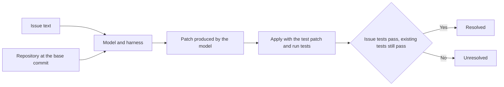

## Table of Contents

## Why I started looking into SWE-bench scores

I use Claude Code as my coding agent. Because of cost, I had to look into whether it could switch to an open-weight model such as GLM or Qwen. The question was: "If I change the model in Claude Code, can it still handle TypeScript work well?"

When I looked up SWE-bench scores on the model cards, however, comparing them turned out to be harder than expected. The [GLM-5](https://huggingface.co/zai-org/GLM-5) model card says it was evaluated with a tool called OpenHands plus its own prompt, and the table for the later [GLM-5.3](https://huggingface.co/zai-org/GLM-5.3) has no SWE-bench entry. The [Qwen3.8](https://huggingface.co/Qwen/Qwen3.8-27B) model card lists a SWE-bench Pro score. But the Opus 4.6 Max score is quoted from the official announcement, while the other models were evaluated with Claude Code. The card also notes that problematic tasks were corrected. Even under the same SWE-bench name, I had to check the tasks and the execution conditions together.

Opening the tasks myself, I found things the scores alone did not show. In one task that fixes a bug in Vue's CSS compiler, previously failing Suspense tests also had to pass for the task to count as resolved. Of the 224 tasks classified as TypeScript, 78 have gold patches that do not touch any `.ts` or `.tsx` implementation file. I realized that before comparing models, I needed to understand what problems they are given and how they are graded.

The first half of this post examines the datasets and the grader code, and the second half uses that to set out the principles and conditions needed for comparing models. I have not yet verified the process of connecting GLM and Qwen, solving the tasks, and grading them. The actual execution environment and experimental conditions will be covered in part 2, and the comparison results and the decision on whether to switch models in part 3.

> I checked the datasets on October 8, 2026. I analyzed Multi-SWE-bench at [`56ff018`][data-msb], mini at [`d0fab3c`][data-mini], and flash at [`b0485db`][data-flash].
>
> The revisions of the other datasets are [`Verified@78f471b`][data-verified], [`Multilingual@846e647`][data-multilingual], and [`SWE-PolyBench@d56445f`][data-polybench].
>
> I read the grader code at [multi-swe-bench `24f493f`](https://github.com/multi-swe-bench/multi-swe-bench/tree/24f493f8a103e72312ded4f6b9c89f081d69cb09). Claude Code's execution conditions were checked against the help output and official documentation for 2.1.294. I have not yet run the full process of connecting a model, solving tasks, and grading them.

## What SWE-bench measures

SWE-bench is a benchmark published in 2023 that evaluates whether language models can resolve issues in real open source repositories[^1]. In coding benchmarks widely used before it, such as HumanEval, it was enough to write a single function from a description. Real development, however, requires looking at a much broader context. You have to find what to fix among thousands of files, and the fixed code must not break other features. SWE-bench turned this process into problems.

A single task (instance) consists of a specific commit of a GitHub repository and one issue that was open at that point. The model reads the issue, edits the repository's code, and produces a patch (diff). The grader applies that patch to the repository, runs the tests, and decides whether the issue was resolved. The final score is the proportion of tasks resolved out of all tasks, called the resolved rate.



The patch the model produces does not have to be identical to the gold patch. There can be several ways to fix the same issue, and if the tests pass, a fix that differs from the actual PR still counts as resolved. Since no human needs to grade, it is also easy to scale to thousands of tasks. I think this ability to grade automatically is one of the reasons SWE-bench is used as a representative metric for coding models. But because grading depends on tests, weak tests make the results hard to trust. I come back to this later while looking at actual tasks.

## How tasks are built

The original paper built tasks in three stages. First, it collected merged PRs from 12 popular Python repositories. Of those, it kept only PRs that were linked to a resolved issue and also modified test files. Such PRs are likely to include tests that check whether the issue was resolved. Finally, it applied each PR's changes, ran the tests, and filtered tasks based on the results. The 2,294 that remained are the original SWE-bench.

To understand grading, the last stage deserves a closer look. The original paper splits a PR's changes into test changes and the remaining implementation changes. It applies the test changes first, then compares test results before and after applying the implementation changes. Multi-SWE-bench, which this post examines later, stores the following three run records, including a state with no patches applied at all.

| Run | Changes applied                      | Meaning                                                                     |
| --- | ------------------------------------ | --------------------------------------------------------------------------- |
| 1   | None                                 | The original state with the issue                                           |
| 2   | Test changes                         | The state with tests that reproduce the issue applied                       |
| 3   | Test changes, implementation changes | The state fixed by the actual PR. Tests that reproduced the issue must pass |

Tests that fail in run 2 and pass in run 3 check whether the issue was resolved. Tests that pass in both runs 2 and 3 check that the fix did not break other features. The original paper excluded PRs that had no test changing from fail to pass. The terms used here are as follows.

| Term               | Meaning                                                                                              |
| ------------------ | ---------------------------------------------------------------------------------------------------- |
| Gold patch         | The implementation changes of the actual PR. Not shown to the model                                  |
| Test patch         | The test changes of the actual PR. Applied together with the model's patch during grading            |
| fail-to-pass (f2p) | Tests that fail with only the test patch applied and pass once the gold patch is also applied        |
| pass-to-pass (p2p) | Tests that pass in both cases                                                                        |
| Resolved rate      | The proportion of evaluated tasks for which the model's patch met the grader's resolution conditions |

According to the original paper, every task has at least one f2p test, and 40% of tasks have two or more. Additional tests that check whether existing features still work are also run. The median number of these additional tests per task is 51.

## Following one actual task

Explanations alone did not give me a good feel for it, so I opened an actual task: `vuejs__core-11899` from Multi-SWE-bench, which contains TypeScript tasks. It comes from issue [#11896](https://github.com/vuejs/core/issues/11896) ("@ queries in scoped nested CSS lack nesting selector"), reported against Vue 3.5.4, and PR [#11899](https://github.com/vuejs/core/pull/11899) ("fix(compiler-sfc): nested css supports atrule and comment"), which fixed it. The dataset stores it as follows.

| Field             | Content                                                                                                     |
| ----------------- | ----------------------------------------------------------------------------------------------------------- |
| `base`            | The commit the PR started from, `d0b513e`                                                                   |
| `resolved_issues` | The title and body of issue #11896                                                                          |
| `fix_patch`       | The gold patch. One file, `packages/compiler-sfc/src/style/pluginScoped.ts`, 49 lines of diff in total      |
| `test_patch`      | The test patch. One file, `packages/compiler-sfc/__tests__/compileStyle.spec.ts`, 43 lines of diff in total |

The model receives only the repository at `base` and the issue text. It has to produce a patch without seeing `fix_patch`. The dataset also stores the results of the three runs described earlier.

| Record              | Patches applied           | Passed | Failed |
| ------------------- | ------------------------- | ------ | ------ |
| `run_result`        | None                      | 3,209  | 1      |
| `test_patch_result` | `test_patch`              | 3,206  | 5      |
| `fix_patch_result`  | `test_patch`, `fix_patch` | 3,211  | 0      |

The 5 tests that failed in the second record all passed in the third, so there are 5 f2p tests. The 3,206 that passed in both records are p2p tests. Each list is stored in the `f2p_tests` and `p2p_tests` fields. The results include tests from many packages, such as runtime and reactivity, not only the CSS compiler.

The Multi-SWE-bench grader reuses the first and second records stored in the dataset. For the third run, it applies the model's patch instead of the gold patch and runs the tests again. It first checks `report.valid` on the new report, then compares the test lists obtained from the run against the lists stored in the dataset. If even one test from a stored list is missing from the new list, the task is marked unresolved. The list comparison in [`gen_report.py`](https://github.com/multi-swe-bench/multi-swe-bench/blob/24f493f8a103e72312ded4f6b9c89f081d69cb09/multi_swe_bench/harness/gen_report.py#L456-L468) looks like this.

```python
for p2p in dataset.p2p_tests:
    if p2p not in report.p2p_tests:
        self.logger.error(
            f"Invalid p2p_tests for {task.id}: missing {p2p}"
        )
        return (report, False)

for f2p in dataset.f2p_tests:
    if f2p not in report.f2p_tests:
        self.logger.error(
            f"Invalid f2p_tests for {task.id}: missing {f2p}"
        )
        return (report, False)
```

To solve this task, the model has to make the 5 failing tests pass while keeping the 3,206 previously passing tests passing.

Other tasks have conditions to check beyond these two lists. The grader also compares `s2p_tests`, the list of tests that were skipped and then passed, and `n2p_tests`, the list of tests that had no result and then passed. Among the 224 TypeScript tasks, 23 have an empty f2p list. The original SWE-bench condition of "at least one f2p" does not apply to every variant.

That does not mean a task with an empty f2p list passes without fixing anything. Before comparing lists, [`Report.check()`](https://github.com/multi-swe-bench/multi-swe-bench/blob/24f493f8a103e72312ded4f6b9c89f081d69cb09/multi_swe_bench/harness/report.py#L90-L142) checks that test results were collected from the new run. Tests that passed with only the test patch applied must not fail after the model's patch is applied. In addition, at least one test that had failed, been skipped, or had no result must change to passing.

There is also a separately filtered anomalous pattern. Suppose a test passed with no patch, but was skipped or had no result once only the test patch was applied. If this test fails after the model's patch is applied, the task is marked unresolved.

## How far can the grading be trusted

Looking closely at the 5 f2p tests of this task, however, something looks odd.

```text
packages/compiler-sfc/__tests__/compileStyle.spec.ts > SFC scoped CSS > nesting selector with atrule and comment
packages/runtime-core/__tests__/components/Suspense.spec.ts > Suspense > nested suspense (child resolves first)
packages/runtime-core/__tests__/components/Suspense.spec.ts > Suspense > branch switch to 3rd branch before resolve
packages/runtime-core/__tests__/components/Suspense.spec.ts > Suspense > nested suspense (w/ suspensible) switch several times before parent suspense resolve
packages/runtime-core/__tests__/apiAsyncComponent.spec.ts > api: defineAsyncComponent > timeout with error + loading components
```

The test that directly reproduces the issue is the first one, added by the test patch. The remaining 4 are Suspense and async component tests in `runtime-core`. The test patch did not touch these files, and the gold patch only changed the style plugin in `compiler-sfc`. The results of each test across the three runs were as follows.

| Test                           | No patch | Test patch | Test patch and gold patch |
| ------------------------------ | -------- | ---------- | ------------------------- |
| 1 CSS compiler test            | None     | Failed     | Passed                    |
| 3 Suspense tests               | Passed   | Failed     | Passed                    |
| 1 async component timeout test | Failed   | Failed     | Passed                    |

What stands out in the 3 Suspense tests is the difference between the first and second runs. Between them, tests were only added to a different file. Neither the implementation code nor the Suspense test file changed. Yet tests that had passed failed. This is grounds to suspect a test whose result changes even with the same code and conditions (a flaky test). However, adding tests may have changed the execution order or shared state, so the cause cannot be confirmed until the tests are run repeatedly under the same conditions.

To see whether other tasks had similar records, I went through all 224 TypeScript tasks in Multi-SWE-bench. I looked for tests in the f2p lists whose results across the three runs were pass, fail, pass, and kept only those in files the test patch did not modify. This condition is meant to isolate cases where results changed before the implementation code was fixed.

Even if a test file is unchanged, a change to a snapshot or fixture can change its input or expected values. So I excluded cases where the test patch modified the relevant snapshot or fixture. For example, the test patch of `vuejs__core-9507` did not touch `defineProps.spec.ts`, but it modified `__snapshots__/defineProps.spec.ts.snap`, which these tests compare against. In that case, failing in the second run is expected. I only excluded cases whose dependency could be confirmed from file paths, and did not trace indirect effects through shared helpers or configuration changes.

| Repository            | Tasks | Tasks with such tests |
| --------------------- | ----- | --------------------- |
| vuejs/core            | 48    | 22                    |
| mui/material-ui       | 174   | 9                     |
| darkreader/darkreader | 2     | 0                     |
| Total                 | 224   | 31                    |

In Vue, close to half of the 48 tasks had such tests. In MUI, `packages/mui-envinfo/envinfo.test.js`, which prints execution environment information, met this condition in 5 tasks, and codemod tests did in 4.

The async component timeout test in the earlier table is fail, fail, pass, so it is left out of this count. In the two runs before the implementation code was fixed, its result was the same. Including this pattern for files the test patch did not modify gives 24 Vue tasks and 10 MUI tasks, 34 in total. Because an implementation change can also legitimately make other tests pass, I do not read this number as the count of tasks with confirmed unstable tests either.

The subsets carry the same records. Of the 50 TypeScript tasks in mini, 6 meet the pass, fail, pass condition, and of the 45 in flash, 20 do. The f2p lists and test patches of these tasks were the same as in the full set. If you start evaluating with flash, you will run into these records in nearly half of the tasks, so a small task count is no reason to skip checking the grading environment.

31 tasks have records that meet the conditions above, and I did not confirm a flaky test in all of them. I have published the [aggregation script](https://github.com/yceffort/blog-experiments/blob/main/swe-bench/audit-typescript.py) and the [task IDs and matching tests](https://github.com/yceffort/blog-experiments/blob/main/swe-bench/results/typescript-audit.json). The script checks the file hashes and per-task records of data downloaded from pinned revisions of the full set, mini, and flash. It runs on Python 3.9 or later with no additional packages, and the reproduction steps are in the [experiment README](https://github.com/yceffort/blog-experiments/tree/main/swe-bench).

If these tests produce different results from run to run, the verdict on a model's patch can change too. The grader reuses the stored failure records, but in the new run with the model's patch applied, those tests must pass. If they fail again, even a correct patch is marked unresolved. The same problem can occur with p2p. The 224 TypeScript tasks have an average of 4,511 p2p tests per task. How often these tests produce unstable results cannot be known from the stored records alone.

Conversely, incorrect patches passing has also been reported. According to a study that analyzed passing patches produced by three tools on SWE-bench Verified, the share of patches that failed the developers' full test suite averaged 7.8% across tools[^2]. The share that behaved differently from the gold patch averaged 29.6%. Behaving differently does not necessarily mean incorrect, so the researchers separately reviewed 77 of them and judged 22 to be incorrect. Applying this sample's error rate, the resolved rate is estimated to be inflated by an average of 6.4 percentage points.

The numbers from this study cannot be applied as they are as an error margin for the TypeScript resolved rates of the models I will compare. Also, unstable test results and tests too weak to catch incorrect patches call for different responses. Grading the same patch repeatedly can show whether results are unstable. But if an incorrect patch passes every time, repetition alone will not reveal the error. This is why passing patches also need additional tests or review.

## The score belongs to the model and the harness together

It is also worth knowing how the model produces a patch. In the original paper, a retrieval technique called BM25 selected files that seemed relevant to the issue, provided them to the model all at once, and had it write a patch in one shot. The best result in this setup was Claude 2's resolved rate of 1.96%[^1].

Today, it is common for the model to explore the repository on its own, opening files, editing code, and then running tests. It may also revise the code again based on the test results. The program that manages this process is called an agent harness or scaffold. Its role differs from the grader described earlier. Which commands the model can use, how it receives file contents, and when it stops running all depend on the harness. Representative examples are as follows.

| Harness   | Approach                                                                                     |
| --------- | -------------------------------------------------------------------------------------------- |
| Agentless | Proceeds through fault localization, repair, and candidate patch selection as fixed stages   |
| SWE-agent | The model works on the repository over multiple turns through a predefined command interface |
| OpenHands | The model runs commands on top of a general-purpose development agent platform               |

Claude Code is also a harness in this role. According to the Multi-SWE-bench paper, the resolved rate on SWE-bench Verified rose from 0.40% (retrieval-based GPT-3.5) to 65.40% (Augment Agent v0) in less than a year[^3]. This reflects progress in both models and harnesses.

The same paper also includes an experiment comparing how much scores change depending on the harness. Below are the results of running Claude 3.7 Sonnet with three harnesses.

| Harness    | Python (Verified) | TypeScript |
| ---------- | ----------------- | ---------- |
| MagentLess | 44.60%            | 3.57%      |
| MSWE-agent | 45.80%            | 11.16%     |
| MopenHands | 52.20%            | 2.23%      |

MopenHands, which scored highest in Python, scored lowest in TypeScript. Converted to the 224 TypeScript tasks, MSWE-agent solved 25 and MopenHands solved 5. Even with the same model, the number of solved tasks differed 5x by harness, and when the language changed, the harness ranking flipped.

The model cards mentioned in the introduction should be read with this in mind. The Qwen3.8 model card quotes the official score for Opus 4.6 Max and explains that the other models were evaluated by having them solve the corrected tasks in Claude Code. Even scores in the same table need their source and evaluation conditions checked. To compare SWE-bench scores, you also need to know "which model, using which harness, solved which version of the tasks."

## Separating the paths by which answers can leak

SWE-bench tasks are built from issues and PRs in public repositories. If a model saw evaluation tasks or answers during training, it may solve them based on what it remembers. This overlap between training data and evaluation data is called data contamination.

The original paper also addressed this problem. It cited as an advantage that continuously collecting new issues the same way allows evaluation on issues created after a model's training cutoff[^1]. In practice, however, fixed task sets became widely used, and over time studies emerged that support the possibility of contamination.

- "The SWE-Bench Illusion"[^4] gave models only the issue description and repository name, without the repository code, and asked them to identify the path of the buggy file. The evaluated models got up to 76% right on SWE-bench Verified tasks and up to 53% on tasks from external repositories. The researchers interpreted this as the tasks or repository information the models had memorized possibly affecting the results.
- In February 2026, OpenAI, which co-created Verified, announced that it would no longer use this benchmark to evaluate the coding ability of frontier models, citing contamination and flawed tests[^6].

There are paths other than training by which a model can encounter the answer. The SWE-Bench+[^5] study examined 251 passing patches produced by SWE-Agent with GPT-4, and 82 of them (32.67%) were cases where the solution was written in the issue description or comments. These are cases where the input given to the model at evaluation time contains the solution. They cannot be treated as evidence of training data contamination, and need to be checked separately when composing problem statements.

Fetching the answer during execution also needs to be distinguished. If the agent can access commits after the task's starting point or remote PRs, it can obtain answers it never saw in training. Preventing this requires limiting what goes into the problem statement, the repository history, and the scope of network access together.

TypeScript tasks are likewise built from public issues and PRs. However, the mere fact that a model was released after a task was published does not tell you whether that task was used in training. SWE-bench-Live and SWE-rebench add new issues, and SWE-bench Pro includes private repositories, to reduce this exposure.

## SWE-bench variants and TypeScript tasks

The variants released so far are summarized below, together with their number of TypeScript tasks, which is the focus of this post.

| Benchmark                                                            | Size                                                       | Languages     | TS tasks                  | Notes                                                   |
| -------------------------------------------------------------------- | ---------------------------------------------------------- | ------------- | ------------------------- | ------------------------------------------------------- |
| SWE-bench[^1]                                                        | 2,294                                                      | Python        | 0                         | The original. 12 repositories                           |
| SWE-bench Lite                                                       | 300                                                        | Python        | 0                         | A subset of shorter, simpler tasks                      |
| SWE-bench Verified                                                   | 500                                                        | Python        | 0                         | Tasks and tests reviewed by humans with OpenAI          |
| SWE-bench Multimodal[^7]                                             | 617                                                        | JavaScript    | Not counted separately    | Tasks whose problem statements or tests include images  |
| [SWE-bench Multilingual](https://www.swebench.com/multilingual.html) | 300                                                        | 9 languages   | 43 together with JS       | 41 repositories (the official page says 42)             |
| Multi-SWE-bench[^3]                                                  | 1,632                                                      | 7 languages   | 224                       | ByteDance Seed. mini (400) and flash (300) subsets      |
| SWE-PolyBench[^8]                                                    | 2,110                                                      | 4 languages   | 729                       | Amazon. JavaScript is the largest with 1,017 tasks      |
| SWE-bench Pro[^9]                                                    | 1,865                                                      | 4 languages   | Not counted separately    | Scale AI. Built from copyleft and private repositories  |
| SWE-bench-Live[^10]                                                  | 1,319 or more                                              | Mainly Python | Separate multilingual set | Only issues from 2024 onward, added monthly             |
| SWE-rebench[^11]                                                     | Over 21,000 public training tasks, separate evaluation set | Python        | 0                         | Refreshes the evaluation set with newly collected tasks |

The original, Lite, and Verified consist entirely of Python tasks. In the experiment cited earlier, Claude 3.7 Sonnet recorded resolved rates of 44-52% in Python and 2-11% in TypeScript. The paper speculates that this gap comes from task difficulty, harnesses optimized for Python, and language-specific execution characteristics such as asynchronous execution. The share of medium-or-harder tasks was 77.1% across Multi-SWE-bench and 61.2% in Verified. Since the repositories and problem difficulty changed along with the language, the gap in resolved rates cannot be explained by TypeScript as a language alone. It is, however, evidence that Python scores alone are not enough to judge performance on TypeScript work.

I downloaded the TypeScript tasks from the following datasets and counted them by repository.

| Dataset                | TS tasks            | Tasks by repository                                                                                                                   |
| ---------------------- | ------------------- | ------------------------------------------------------------------------------------------------------------------------------------- |
| Multi-SWE-bench        | 224                 | mui/material-ui 174, vuejs/core 48, darkreader/darkreader 2                                                                           |
| Multi-SWE-bench mini   | 50                  | mui/material-ui 39, vuejs/core 9, darkreader/darkreader 2                                                                             |
| Multi-SWE-bench flash  | 45                  | vuejs/core 42, darkreader/darkreader 2, mui/material-ui 1                                                                             |
| SWE-PolyBench          | 729                 | mui/material-ui 488, microsoft/vscode 205, tailwindlabs/tailwindcss 20, coder/code-server 14, angular/angular 2                       |
| SWE-bench Multilingual | 43 together with JS | preactjs/preact 17, axios/axios 6, babel/babel 5, facebook/docusaurus 5, vuejs/core 5, mrdoob/three.js 3, immutable-js/immutable-js 2 |

Multilingual has no language field, so I selected JavaScript and TypeScript tasks based on each repository's main language and the file extensions in the gold patch. Looking at these, three things stood out.

First, tasks are concentrated in a few repositories. 78% of Multi-SWE-bench's TypeScript tasks come from MUI, and 95% of SWE-PolyBench's TypeScript tasks come from MUI and VS Code.

Second, the same tasks appear in different benchmarks. Of Multi-SWE-bench's 174 MUI tasks, 107 also appear in SWE-PolyBench with the same PR number. Scoring on both benchmarks does not mean performance was confirmed twice on different problems.

Finally, Multi-SWE-bench classifies a task's language by repository. Splitting the 224 tasks classified as TypeScript by the extensions of the files their gold patches changed gives the following.

| Files changed by the gold patch    | Tasks |
| ---------------------------------- | ----- |
| Includes `.ts` or `.tsx`           | 146   |
| Has `.d.ts` but no `.ts` or `.tsx` | 13    |
| None of `.ts`, `.tsx`, `.d.ts`     | 65    |

Here `.d.ts` is not counted as `.ts` but classified separately. All 78 tasks in the bottom two rows come from MUI. Tasks dealing with JavaScript implementations and `.d.ts` type declarations are also grouped as tasks from a TypeScript repository. The 146 tasks whose gold patches changed `.ts` or `.tsx` are 96 from MUI, 48 from Vue, and 2 from Darkreader. Since these counts are based on the files changed in the actual PR, the model does not necessarily have to change the same files.

Seen this way, Multi-SWE-bench's TypeScript tasks mainly reflect bug-fixing work in the MUI and Vue repositories from a few years ago. They are hard to treat as representative of TypeScript work in general, but they are useful for setting up an environment to run and grade evaluations. I think they are also good enough as a first check of whether performance drops sharply when the model is swapped. I plan to decide whether to actually switch only after evaluating on internal tasks as well.

## Principles for comparing models in Claude Code

What I want to know is how the resolved rate and cost of TypeScript work change when the model in Claude Code is swapped. I plan to pin the version of the Claude model I currently use as the baseline and have GLM and Qwen solve the same tasks. Here I set out the principles needed for the comparison, and I plan to verify the actual connection settings and execution code in part 2.

First, decide how much lower the resolved rate is allowed to be, and how much time to give each task and how many retries to allow. If you set the criteria after seeing the results, it is easy to lower the quality bar because the cost is lower. The conditions for switching also depend on whether a model with a lower API price will take only some easy tasks or most of the work the current model handles.

The overall flow is shown in the diagram below. For each task, Claude Code produces a patch in an isolated container, the patch is graded in a separate environment, and cost is aggregated from usage records.

<LiveDemo src="/demos/swe-bench/eval-flow.html?present=1" title="An evaluation flow in which Claude Code produces a patch in an isolated container per task and the cost per resolved task is calculated from grading results and token usage" height={640} />

### Checking the actual configuration of the model and harness

To connect a different model to Claude Code, first check whether the provider supports an Anthropic-compatible API. [Z.ai](https://docs.z.ai/scenario-example/develop-tools/claude) and [Alibaba Cloud Model Studio](https://www.alibabacloud.com/help/en/model-studio/claude-code) document how to integrate, but some parts still need to be verified with a real connection. You need to confirm the exact ID of the model to evaluate and the authentication method, and check that tool calls and usage reporting work correctly. The published Qwen weights also need to be distinguished from the separate model names used by hosting services.

Which models are used for auxiliary tasks and subagents, not just the main model, is also part of the comparison conditions. Rather than trusting the names assigned to aliases, I plan to cross-check per-model usage in the run results against the provider's records. If the server routes requests to a different model, the name shown on the client is not enough to determine which model was actually used.

Create a separate settings directory inside the container and put only the settings used for evaluation there, so personal settings do not get mixed in. The CLAUDE.md, hooks, and plugins in the working directory also need to be managed (I covered each feature in [Core concepts of coding agents](/2026/01/coding-agent-core-concepts)). Recording which settings were included is what lets you judge whether the evaluation results apply to your everyday setup.

Here, `--bare` is not used as an option that only turns off personal settings. According to the [official documentation](https://code.claude.com/docs/en/headless#start-faster-with-bare-mode), it limits the default tools to Bash, file read, and file edit. Since tools such as Write and subagents are also removed, the harness configuration changes. This is why the `tools` list in the `init` message at startup should be kept even for the same CLI version.

| Condition        | What to record or decide in advance                                                                                |
| ---------------- | ------------------------------------------------------------------------------------------------------------------ |
| Tasks and tools  | Task IDs, problem statements, system prompt, `init.tools` list, subagent policy                                    |
| Model settings   | Provider, model ID and version, auxiliary models, sampling and reasoning settings, maximum output length           |
| Context          | Actual supported limit, the limit Claude Code assumes, compaction threshold                                        |
| Execution budget | Maximum turns, time limit per task, number of request retries and task reruns                                      |
| Environment      | CLI version, personal and repository settings, container image digest, CPU and memory, dependencies, grader commit |

According to the [Claude Code documentation](https://code.claude.com/docs/en/model-config#correct-the-window-for-a-gateway-or-custom-model-id), when you use a custom model ID, the context limit Claude Code assumes can differ from the model's actual limit. Reasoning options also differ in supported range and meaning across models. The limits applied to all models in common and each model's actual settings should be recorded separately.

### Controlling access to answers and execution failures

The agent is given only the code at the task's starting point and the problem statement. Access must be restricted so that it cannot take solutions from later Git history, remote PRs, the gold patch, the test patch used for grading, or the results of previous runs. I plan to install dependencies in advance and allow only the necessary model API traffic during execution. Since remote PRs can also be read through Bash, turning off the web tools alone is not enough.

If `bypassPermissions`, which skips permission checks, is used, run as a non-root user inside an isolated container. According to the [official documentation](https://code.claude.com/docs/en/permission-modes#skip-all-checks-with-bypasspermissions-mode), Claude Code does not start in this mode when run as root or with sudo, and skips this check only inside a recognized sandbox. I do not plan to rely on this exception in the evaluation environment.

A process having exited does not by itself tell you whether the task was handled properly. Record the exit code together with `is_error` and `terminal_reason` from the result, and do not classify a run as successful just because `subtype` is `success`. Timeouts, API errors, and missing result records are kept distinct. When deciding whether to retry or what to include in the resolved rate calculation, the same criteria apply to every model.

The patch must also include new files and changes committed during the run. Decide in advance whether test files modified by the model are included in grading, and if some changes are filtered out, keep the original patch as well. I also plan to review for changes that skip test execution or bypass the verdict.

### Validating the grading environment before the models

First, use a single task to check that the whole process connects, from authentication and tool calls to file edits, patch collection, grading, and usage aggregation. Before starting the full comparison, also check whether the gold patches still pass in the current environment and what results appear with only the test patch applied. If even the gold patch does not pass reliably, the cause should be investigated before interpreting model performance.

Records that need re-validation remain even in the subsets with fewer tasks. 20 of flash's 45 tasks, checked earlier, also had pass, fail, pass records. Rather than excluding these tasks right away or declaring them flaky, I plan to grade the same patch repeatedly and check for variation. Modifying tasks or tests makes the evaluation differ from the official set, so the list of changes and the reasons should be kept as well.

### Comparing billed cost and quality together

The `total_cost_usd` that Claude Code outputs is an estimate calculated from the client's price table. The actual cost of GLM and Qwen has to be calculated by matching input, output, cache read, and cache write token counts against the provider's billing rules. The result's `modelUsage` includes subagent usage, while `usage` counts only the main agent's usage. The [cost tracking documentation](https://code.claude.com/docs/en/agent-sdk/cost-tracking) explains the scope of each field.

The `output_tokens` on per-step assistant messages is a provisional value from before the response finishes generating. Instead of summing it, read output token counts from the final result's `usage` or `modelUsage`. When aggregating input and cache tokens, the same response ID can appear in several messages, so duplicates must be removed. Usage from failed runs or processes that were terminated midway also needs to be cross-checked against the provider's records.

As the cost metric, I use the total evaluation cost divided by the number of resolved tasks. It includes the cost of unsolved attempts and retries, and if no task is resolved, this value is not calculated. For example, on the same 100 tasks, suppose the existing model resolved 80 and spent 80 dollars, while the alternative model resolved 20 and spent 10 dollars. The cost per resolved task halved, but the resolved rate also dropped sharply. Before comparing cost, check first whether the quality criteria set earlier are met.

Pay-as-you-go APIs and subscription plans also differ in how actual spending is calculated. Multiplying the tokens used under a subscription by pay-as-you-go prices does not give the savings as is. If a model has [tiered pricing by input length](https://www.alibabacloud.com/help/en/model-studio/model-pricing), as some Qwen models do, usage has to be aggregated per request. If failed work will be reprocessed with the existing model, add that cost and the waiting time, and I plan to measure human review and correction time separately.

### Reading per-task differences and repeated runs

If two models solve the same tasks, split them into tasks both solved, tasks neither solved, and tasks only one model solved. Even if the overall resolved rates are similar, failures may increase in specific repositories or types of work. When calculating the uncertainty of the difference in resolved rates, the two models' results on the same task should also be compared as pairs.

How much the number of tasks affects the uncertainty of the results can be estimated with a simple calculation. Assuming the tasks are an independent random sample and the resolved rate is 50%, the 95% confidence interval for one model's resolved rate can be calculated with the normal approximation. The half-width of the interval is about $1.96\sqrt{\frac{p(1-p)}{n}}$, so it is ±14.6 percentage points for 45 tasks and ±6.5 percentage points for 224 tasks. However, this is not the confidence interval for the difference between two models' resolved rates. Nor is it grounds for generalizing results from fixed tasks concentrated in MUI and Vue to TypeScript work as a whole.

With repeated runs, you also need to distinguish what is being repeated. Rerunning the agent from scratch shows how much the result varies each time a patch is generated. Repeating only the grading with the same patch shows variation due to the test environment. SWE-rebench runs each model five times on the full benchmark and reports the standard error of the mean and pass@5[^11]. The proportion of tasks solved at least once over several attempts differs from the resolved rate of a single run, so the number of repetitions and the aggregation method should be stated together.

Repeating the grading cannot find incorrect answers that the tests miss. I plan to run additional tests on passing patches and review their content too, and report errors found in that process separately from the automated grading score.

## From public tasks to internal tasks

Once the public benchmark confirms that the execution and grading process works properly, tasks in the same format can be built from internal repositories as well. Pick already merged PRs and apply the method examined above.

1. Pick PRs that include test changes.
2. Set the PR's starting commit as `base`. Split the test file changes into the test patch and the rest into the gold patch.
3. Write the problem statement from the linked issue or PR description. If the solution is written out as is, the leakage SWE-Bench+ pointed out occurs, so keep only the symptoms and expected behavior.
4. Run the tests with no patch applied, with only the test patch applied, and with both patches applied, and record f2p and p2p.
5. Run the tests in each state several times in the same environment to find unstable tests. If no tests remain to verify that the issue was resolved, or the gold patch does not pass reliably, exclude that task from the evaluation. Even so, passing a few times does not guarantee stability.

Internal tasks can reflect the code you actually work with and the way you usually write tests. Keeping the tasks private and not using them for training or tuning also reduces the possibility of training data contamination. Still, they need to be managed separately so that answers do not leak through the problem statement, later commits, or previous agent run results. If you plan to tune prompts while looking at evaluation tasks, set aside separate tasks for the final decision.

Before sending internal code to a hosted API, check how far the company allows it. If you host the model yourself, the calculation should be based on GPU time, actual utilization, and operating costs.

This time, I looked at which repositories the tasks classified as TypeScript came from, which files the gold patches changed, and what the test results were. Based on that, I could gauge what kind of work the benchmark scores reflect.

That is also why we want to rerun the benchmark at the company. Model card scores alone do not tell us how the resolved rate and cost change when we swap the model in the Claude Code we use. Even with the same public tasks, comparing them under the harness and execution conditions we will actually use shows which work each model solves and where it fails. I think being able to see these differences is what makes evaluating it ourselves worthwhile.

Still, running it ourselves does not remove the repository concentration of the public tasks or the limits of the grading. Those results alone are not enough to decide whether all of our internal TypeScript work can be handed over. After checking the execution and grading environment with public tasks, I plan to compare on internal tasks that reflect the work we would actually hand over. I plan to look at the scope of work that can be given to the alternative model together with the cost of retrying failed work and the cost of human review and correction. Only by checking whether the total cost still goes down with these included will it be possible to decide whether to switch.

In part 1, I set out the concepts and comparison principles needed for this. In part 2, I plan to connect the candidate models to Claude Code and finalize the tasks, execution environment, budget, and grading method. Based on that, I will set up an experiment that can be run repeatedly. In part 3, I plan to look at the results and failure cases and decide whether the model can be swapped.

[data-msb]: https://huggingface.co/datasets/ByteDance-Seed/Multi-SWE-bench/tree/56ff018c04a38e27ada1e9d0a6d5839a51f88f0d
[data-mini]: https://huggingface.co/datasets/ByteDance-Seed/Multi-SWE-bench_mini/tree/d0fab3ccc7dff232fcaac234cf8af9a2efeaccf6
[data-flash]: https://huggingface.co/datasets/ByteDance-Seed/Multi-SWE-bench-flash/tree/b0485dbebaf8a1317ebf140e80e6fc6c02d3502b
[data-verified]: https://huggingface.co/datasets/SWE-bench/SWE-bench_Verified/tree/78f471bf655a3137b2e8a75af1501690ec009ec3
[data-multilingual]: https://huggingface.co/datasets/SWE-bench/SWE-bench_Multilingual/tree/846e647b9f33c0b51b739d005d13d85493c9af09
[data-polybench]: https://huggingface.co/datasets/AmazonScience/SWE-PolyBench/tree/d56445f9940eae4e9d2974ec66820c2f1d7754e6

[^1]: [SWE-bench: Can Language Models Resolve Real-World GitHub Issues?](https://arxiv.org/abs/2310.06770) (ICLR 2024)

[^2]: [Are "Solved Issues" in SWE-bench Really Solved Correctly?](https://arxiv.org/html/2503.15223v2) (September 2025 revision). It analyzed SWE-bench Verified passing patches produced by CodeStory, LearnByInteract, and OpenHands. 7.8% and 29.6% are averages of per-tool rates, and 6.4 percentage points is an estimate that applies the error rate of the manually reviewed sample.

[^3]: [Multi-SWE-bench: A Multilingual Benchmark for Issue Resolving](https://arxiv.org/abs/2504.02605). The 1,632 tasks are the paper's figure. The Hugging Face revision pinned in this post adds 500 Python tasks and 105 Kotlin tasks, for 2,237 tasks in total.

[^4]: [The SWE-Bench Illusion](https://arxiv.org/html/2506.12286v2)

[^5]: [SWE-Bench+](https://arxiv.org/abs/2410.06992)

[^6]: [Why we no longer evaluate SWE-bench Verified](https://openai.com/index/why-we-no-longer-evaluate-swe-bench-verified/) (February 2026).

[^7]: [SWE-bench Multimodal](https://arxiv.org/abs/2410.03859). The task count is from the paper and differs from the current version on swebench.com.

[^8]: [SWE-PolyBench](https://arxiv.org/abs/2504.08703)

[^9]: [SWE-Bench Pro](https://arxiv.org/abs/2509.16941). It is split into a public set of 731 tasks, a held-out set of 858 tasks, and a commercial set of 276 tasks.

[^10]: [SWE-bench-Live](https://arxiv.org/abs/2505.23419). The task count is from the paper, and it keeps growing in the [repository](https://github.com/microsoft/SWE-bench-Live).

[^11]: [SWE-rebench](https://arxiv.org/abs/2505.20411), [evaluation methodology](https://swe-rebench.com/about)
