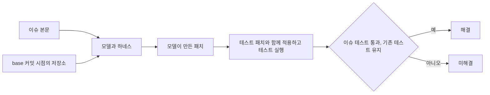

## Table of Contents

## SWE-bench 점수를 들여다보게 된 이유

코딩 에이전트로 Claude Code를 쓰고 있다. 비용 때문에 GLM이나 Qwen 같은 오픈웨이트 모델로 교체할 수 있을지 알아보게 됐다. 궁금한 것은 "Claude Code에서 모델을 바꿔도 TypeScript 작업을 잘 해낼 수 있을까"였다.

그런데 모델 카드에서 SWE-bench 점수를 찾아보니 비교가 생각보다 어려웠다. [GLM-5](https://huggingface.co/zai-org/GLM-5) 모델 카드에는 OpenHands라는 도구에 자체 프롬프트를 붙여 평가했다고 적혀 있고, 그 뒤에 나온 [GLM-5.3](https://huggingface.co/zai-org/GLM-5.3)의 표에는 SWE-bench 항목이 없다. [Qwen3.8](https://huggingface.co/Qwen/Qwen3.8-27B) 모델 카드에는 SWE-bench Pro 점수가 실려 있다. 다만 Opus 4.6 Max의 점수는 공식 발표에서 인용했고, 나머지 모델은 Claude Code로 평가했다고 한다. 문제가 있는 문항을 수정했다는 설명도 붙어 있다. 같은 SWE-bench라는 이름을 써도 문항과 실행 조건을 함께 확인해야 했다.

문항을 직접 열어 보니 점수만으로는 보이지 않던 부분도 있었다. Vue의 CSS 컴파일러 버그를 고치는 문제인데, 실패하던 Suspense 테스트도 통과해야 해결로 인정됐다. TypeScript로 분류된 224문항 가운데 78문항의 정답 패치는 `.ts`, `.tsx` 구현 파일을 고치지 않았다. 어떤 문제를 풀게 하고 어떻게 채점하는지부터 알아야 모델을 비교할 수 있겠다고 생각했다.

이 글의 앞부분에서는 데이터셋과 채점기 코드를 살펴보고, 뒷부분에서는 이를 바탕으로 모델 비교에 필요한 원칙과 조건을 정리한다. 아직 GLM과 Qwen을 연결해 문항을 풀고 채점하는 과정까지 검증하지는 않았다. 실제 실행 환경과 실험 조건은 2편에서, 비교 결과와 모델 교체 여부에 대한 판단은 3편에서 다룰 예정이다.

> 데이터셋은 2026년 10월 8일에 확인했다. Multi-SWE-bench는 [`56ff018`][data-msb], mini는 [`d0fab3c`][data-mini], flash는 [`b0485db`][data-flash]를 분석했다.
>
> 다른 데이터셋의 리비전은 [`Verified@78f471b`][data-verified], [`Multilingual@846e647`][data-multilingual], [`SWE-PolyBench@d56445f`][data-polybench]이다.
>
> 채점기 코드는 [multi-swe-bench의 `24f493f`](https://github.com/multi-swe-bench/multi-swe-bench/tree/24f493f8a103e72312ded4f6b9c89f081d69cb09)를 읽었다. Claude Code의 실행 조건은 2.1.294의 도움말과 공식 문서를 기준으로 확인했다. 모델을 연결해 문항을 풀고 채점하는 전체 과정은 아직 실행하지 않았다.

## SWE-bench는 무엇을 재는가

SWE-bench는 2023년에 발표된 벤치마크로, 언어 모델이 실제 오픈소스 저장소의 이슈를 해결할 수 있는지를 평가한다[^1]. 그전까지 많이 쓰던 HumanEval 같은 코딩 벤치마크에서는 설명에 맞춰 함수 하나를 작성하면 됐다. 하지만 실제 개발에서는 그보다 훨씬 넓은 맥락을 살펴야 한다. 수천 개의 파일 중에서 고칠 곳을 찾아야 하고, 고친 코드가 다른 기능을 깨뜨리지 않아야 한다. SWE-bench는 이 과정을 문제로 만들었다.

문항 하나(instance)는 GitHub 저장소의 특정 커밋과 그 시점에 열려 있던 이슈 하나로 이루어진다. 모델은 이슈를 읽고 저장소의 코드를 고쳐 패치(diff)를 낸다. 채점기는 그 패치를 저장소에 적용하고 테스트를 돌려 이슈가 해결됐는지 판정한다. 최종 점수는 전체 문항 중 해결한 문항의 비율이며, 이를 해결률(resolved rate)이라고 부른다.



모델이 만든 패치가 정답 패치와 완전히 같을 필요는 없다. 같은 이슈를 고치는 방법은 여러 가지일 수 있고, 테스트를 통과하면 실제 PR과 다르게 고쳐도 해결로 인정된다. 사람이 채점하지 않아도 되니 문항을 수천 개로 늘리기도 쉽다. 이처럼 자동으로 채점할 수 있다는 점이 SWE-bench가 코딩 모델의 대표 지표로 쓰이는 이유 중 하나라고 생각한다. 다만 채점이 테스트에 의존하는 만큼, 테스트가 부실하면 결과도 믿기 어렵다. 이 부분은 뒤에서 실제 문항을 보며 다시 다룬다.

## 문항은 이렇게 만들어진다

원본 논문에서는 세 단계를 거쳐 문항을 만들었다. 먼저 인기 있는 Python 저장소 12곳에서 병합된 PR을 모았다. 그중 해결한 이슈와 연결되어 있으면서 테스트 파일도 함께 고친 PR만 남겼다. 이런 PR에는 이슈가 해결됐는지 확인하는 테스트가 포함되어 있을 가능성이 높다. 마지막으로 PR의 변경 사항을 적용해 테스트를 실행하고, 그 결과에 따라 문항을 추렸다. 이렇게 남은 2,294개가 원본 SWE-bench다.

채점 방식을 이해하려면 마지막 단계를 자세히 볼 필요가 있다. 원본 논문에서는 PR의 변경 사항을 테스트 변경과 나머지 구현 변경으로 나눈다. 테스트 변경을 먼저 적용한 뒤, 구현 변경을 적용하기 전과 후의 테스트 결과를 비교한다. 뒤에서 살펴볼 Multi-SWE-bench에는 패치를 전혀 적용하지 않은 상태까지 포함해 다음 세 가지 실행 기록이 저장되어 있다.

| 실행 | 적용한 변경            | 의미                                                        |
| ---- | ---------------------- | ----------------------------------------------------------- |
| 1    | 없음                   | 이슈가 있던 원래 상태                                       |
| 2    | 테스트 변경            | 이슈를 재현하는 테스트를 적용한 상태                        |
| 3    | 테스트 변경, 구현 변경 | 실제 PR이 고친 상태. 이슈를 재현하던 테스트가 통과해야 한다 |

2번에서 실패하고 3번에서 통과하는 테스트로는 이슈가 해결됐는지 확인한다. 2번과 3번 모두에서 통과하는 테스트로는 수정 과정에서 다른 기능이 깨지지 않았는지 확인한다. 원본 논문에서는 실패에서 통과로 바뀌는 테스트가 하나도 없는 PR을 문항에서 제외했다. 여기서 쓰는 용어를 정리하면 다음과 같다.

| 용어                     | 뜻                                                                      |
| ------------------------ | ----------------------------------------------------------------------- |
| 정답 패치 (gold patch)   | 실제 PR의 구현 변경. 모델에게는 보여 주지 않는다                        |
| 테스트 패치 (test patch) | 실제 PR의 테스트 변경. 채점할 때 모델의 패치와 함께 적용한다            |
| fail-to-pass (f2p)       | 테스트 패치만 적용하면 실패하고, 정답 패치까지 적용하면 통과하는 테스트 |
| pass-to-pass (p2p)       | 두 경우 모두 통과하는 테스트                                            |
| 해결률 (resolved rate)   | 전체 평가 문항 중 모델의 패치가 채점기의 해결 조건을 충족한 문항의 비율 |

원본 논문에 따르면 모든 문항에 f2p 테스트가 최소 1개 있고, 40%의 문항에는 2개 이상 있다. 기존 기능이 유지되는지 확인하는 테스트도 추가로 돌린다. 문항별 추가 테스트 수의 중앙값은 51개다.

## 실제 문항 하나 따라가 보기

설명만으로는 감이 잘 오지 않아서 실제 문항 하나를 열어 봤다. TypeScript 문항이 들어 있는 Multi-SWE-bench의 `vuejs__core-11899`다. 이 문항은 Vue 3.5.4에서 보고된 이슈 [#11896](https://github.com/vuejs/core/issues/11896)("@ queries in scoped nested CSS lack nesting selector")과 이를 고친 PR [#11899](https://github.com/vuejs/core/pull/11899)("fix(compiler-sfc): nested css supports atrule and comment")에서 나왔다. 데이터셋에는 다음과 같이 저장되어 있다.

| 필드              | 내용                                                                                        |
| ----------------- | ------------------------------------------------------------------------------------------- |
| `base`            | PR이 출발한 커밋 `d0b513e`                                                                  |
| `resolved_issues` | 이슈 #11896의 제목과 본문                                                                   |
| `fix_patch`       | 정답 패치. `packages/compiler-sfc/src/style/pluginScoped.ts` 한 파일, diff 전체 49줄        |
| `test_patch`      | 테스트 패치. `packages/compiler-sfc/__tests__/compileStyle.spec.ts` 한 파일, diff 전체 43줄 |

모델이 받는 것은 `base` 시점의 저장소와 이슈 본문뿐이다. `fix_patch`를 보지 않고 패치를 만들어야 한다. 데이터셋에는 앞에서 설명한 세 번의 실행 결과도 함께 저장되어 있다.

| 기록                | 적용한 패치               | 통과  | 실패 |
| ------------------- | ------------------------- | ----- | ---- |
| `run_result`        | 없음                      | 3,209 | 1    |
| `test_patch_result` | `test_patch`              | 3,206 | 5    |
| `fix_patch_result`  | `test_patch`, `fix_patch` | 3,211 | 0    |

2번째 기록에서 실패한 테스트 5개가 3번째 기록에서 모두 통과했으니 f2p 테스트는 5개다. 두 기록에서 모두 통과한 3,206개는 p2p 테스트다. 각 목록은 `f2p_tests`, `p2p_tests` 필드에 들어 있다. CSS 컴파일러뿐 아니라 runtime과 reactivity 등 여러 패키지의 테스트 결과가 포함되어 있다.

Multi-SWE-bench 채점기는 데이터셋에 저장된 1번째와 2번째 기록을 재사용한다. 3번째 실행에서는 정답 패치 대신 모델의 패치를 적용해 테스트를 새로 돌린다. 먼저 새 보고서의 `report.valid`를 확인한 뒤, 실행 결과에서 얻은 테스트 목록을 데이터셋에 저장된 목록과 대조한다. 저장된 목록의 테스트가 새 목록에서 하나라도 빠지면 미해결로 처리한다. [`gen_report.py`](https://github.com/multi-swe-bench/multi-swe-bench/blob/24f493f8a103e72312ded4f6b9c89f081d69cb09/multi_swe_bench/harness/gen_report.py#L456-L468)의 목록 대조 부분은 다음과 같다.

```python
for p2p in dataset.p2p_tests:
    if p2p not in report.p2p_tests:
        self.logger.error(
            f"Invalid p2p_tests for {task.id}: missing {p2p}"
        )
        return (report, False)

for f2p in dataset.f2p_tests:
    if f2p not in report.f2p_tests:
        self.logger.error(
            f"Invalid f2p_tests for {task.id}: missing {f2p}"
        )
        return (report, False)
```

모델이 이 문항을 풀려면 실패하던 테스트 5개를 통과시키면서, 기존에 통과하던 테스트 3,206개도 그대로 통과시켜야 한다.

다른 문항에서는 이 두 목록 외에도 확인할 조건이 있다. 채점기는 건너뛰었다가 통과한 테스트 목록인 `s2p_tests`와 결과가 없었다가 통과한 테스트 목록인 `n2p_tests`도 대조한다. TypeScript 224문항 중에는 f2p 목록이 비어 있는 문항도 23개 있다. 원본 SWE-bench의 "f2p가 최소 1개"라는 조건이 모든 변형에 적용되지는 않는다.

그렇다고 f2p가 비어 있으면 아무것도 고치지 않아도 통과하는 것은 아니다. 목록을 대조하기 전에 [`Report.check()`](https://github.com/multi-swe-bench/multi-swe-bench/blob/24f493f8a103e72312ded4f6b9c89f081d69cb09/multi_swe_bench/harness/report.py#L90-L142)에서 새 실행의 테스트 결과가 수집됐는지 확인한다. 테스트 패치만 적용했을 때 통과하던 테스트가 모델 패치를 적용한 뒤 실패해서도 안 된다. 또 실패, 건너뜀, 결과 없음 중 하나였던 테스트가 최소 1개는 통과로 바뀌어야 한다.

별도로 걸러 내는 이상 패턴도 있다. 패치가 없을 때는 통과했지만 테스트 패치만 적용하면 건너뛰거나 결과가 사라지는 테스트가 있다고 하자. 이 테스트가 모델 패치를 적용한 뒤 실패하면 해당 문항을 미해결로 처리한다.

## 채점은 얼마나 믿을 수 있나

그런데 이 문항의 f2p 테스트 5개를 자세히 보면 이상한 점이 있다.

```text
packages/compiler-sfc/__tests__/compileStyle.spec.ts > SFC scoped CSS > nesting selector with atrule and comment
packages/runtime-core/__tests__/components/Suspense.spec.ts > Suspense > nested suspense (child resolves first)
packages/runtime-core/__tests__/components/Suspense.spec.ts > Suspense > branch switch to 3rd branch before resolve
packages/runtime-core/__tests__/components/Suspense.spec.ts > Suspense > nested suspense (w/ suspensible) switch several times before parent suspense resolve
packages/runtime-core/__tests__/apiAsyncComponent.spec.ts > api: defineAsyncComponent > timeout with error + loading components
```

이슈를 직접 재현하는 것은 테스트 패치에서 추가한 첫 번째 테스트다. 나머지 4개는 `runtime-core`의 Suspense와 비동기 컴포넌트 테스트다. 테스트 패치는 이 파일들을 건드리지 않았고, 정답 패치도 `compiler-sfc`의 스타일 플러그인만 고쳤다. 세 번의 실행에서 각 테스트의 결과는 다음과 같았다.

| 테스트                             | 패치 없음 | 테스트 패치 | 테스트 패치와 정답 패치 |
| ---------------------------------- | --------- | ----------- | ----------------------- |
| CSS 컴파일러 테스트 1개            | 없음      | 실패        | 통과                    |
| Suspense 테스트 3개                | 통과      | 실패        | 통과                    |
| 비동기 컴포넌트 timeout 테스트 1개 | 실패      | 실패        | 통과                    |

Suspense 테스트 3개에서 눈여겨볼 것은 첫 번째와 두 번째 실행의 차이다. 이 사이에는 다른 파일에 테스트를 추가했을 뿐, 구현 코드와 Suspense 테스트 파일은 바뀌지 않았다. 그런데 통과하던 테스트가 실패했다. 같은 코드와 조건에서도 결과가 달라지는 테스트(flaky test)를 의심할 근거가 된다. 다만 테스트를 추가하면서 실행 순서나 공유 상태가 달라졌을 수도 있으므로, 같은 조건에서 반복 실행하기 전까지 원인을 확정할 수는 없다.

다른 문항에도 비슷한 기록이 있는지 확인하려고 Multi-SWE-bench의 TypeScript 224문항 전체를 살펴봤다. f2p 목록에서 세 번의 실행 결과가 통과, 실패, 통과인 테스트를 찾고, 그중 테스트 패치가 수정하지 않은 파일의 테스트만 골랐다. 구현 코드를 고치기 전부터 결과가 바뀐 사례를 따로 보기 위한 조건이다.

테스트 파일이 그대로여도 스냅숏이나 픽스처가 바뀌면 입력이나 기대값이 달라질 수 있다. 그래서 테스트 패치가 해당 스냅숏이나 픽스처를 고친 경우는 제외했다. 예를 들어 `vuejs__core-9507`의 테스트 패치는 `defineProps.spec.ts`를 건드리지 않았지만, 이 테스트들이 비교하는 `__snapshots__/defineProps.spec.ts.snap`을 고쳤다. 두 번째 실행에서 실패하는 것이 정상인 경우다. 다만 파일 경로로 의존 관계를 확인할 수 있는 사례만 제외했으며, 공용 헬퍼나 설정 변경에 따른 간접적인 영향까지 추적하지는 않았다.

| 저장소                | 문항 | 해당 테스트가 있는 문항 |
| --------------------- | ---- | ----------------------- |
| vuejs/core            | 48   | 22                      |
| mui/material-ui       | 174  | 9                       |
| darkreader/darkreader | 2    | 0                       |
| 합계                  | 224  | 31                      |

Vue는 48문항 중 절반 가까이에서 이런 테스트가 나왔다. MUI에서는 실행 환경 정보를 출력하는 `packages/mui-envinfo/envinfo.test.js`가 5문항, codemod 테스트가 4문항에서 이 조건에 해당했다.

앞선 표의 비동기 컴포넌트 timeout 테스트는 실패, 실패, 통과이므로 이 집계에서 빠진다. 구현 코드를 고치기 전 두 실행에서는 결과가 같았기 때문이다. 테스트 패치가 수정하지 않은 파일에서 이 패턴까지 포함하면 Vue 24문항과 MUI 10문항, 총 34문항이 된다. 구현 변경으로 다른 테스트도 정상적으로 통과하게 될 수 있으므로, 이 수치를 불안정한 테스트가 확인된 문항 수로 해석하지는 않는다.

부분집합에도 같은 기록이 남아 있다. mini의 TypeScript 50문항 중 6문항, flash의 45문항 중 20문항이 통과, 실패, 통과 조건에 해당한다. 이 문항들의 f2p 목록과 테스트 패치는 전체 세트와 같았다. flash로 평가를 시작한다면 거의 절반의 문항에서 이런 기록을 만나므로, 적은 문항 수만 보고 채점 환경 확인을 생략하기는 어렵다.

위 조건에 맞는 기록이 있는 문항은 31개이며, 이들 모두에서 flaky test를 확인한 것은 아니다. [집계 스크립트](https://github.com/yceffort/blog-experiments/blob/main/swe-bench/audit-typescript.py)와 [문항 ID 및 해당 테스트 목록](https://github.com/yceffort/blog-experiments/blob/main/swe-bench/results/typescript-audit.json)을 함께 남겼다. 스크립트는 전체 세트와 mini, flash의 고정 리비전에서 받은 데이터의 파일 해시와 문항별 기록을 대조한다. Python 3.9 이상에서 추가 패키지 없이 실행할 수 있으며, 재현 방법은 [실험 README](https://github.com/yceffort/blog-experiments/tree/main/swe-bench)에 정리했다.

이 테스트들의 결과가 실행마다 달라진다면 모델의 패치에 대한 판정도 달라질 수 있다. 채점기는 저장된 실패 기록을 재사용하지만, 모델의 패치를 적용한 새 실행에서는 해당 테스트가 반드시 통과해야 한다. 다시 실패하면 올바른 패치도 미해결로 처리된다. p2p에서도 같은 문제가 생길 수 있다. TypeScript 224문항의 p2p 테스트 수는 문항당 평균 4,511개다. 이 테스트들이 얼마나 자주 불안정한 결과를 내는지는 저장된 기록만으로 알 수 없다.

반대로 틀린 패치가 통과하는 경우도 보고되어 있다. SWE-bench Verified에서 세 도구가 만든 통과 패치를 분석한 연구에 따르면, 개발자의 전체 테스트 스위트에서 실패한 패치의 비율은 도구별로 평균 7.8%였다[^2]. 정답 패치와 동작이 다른 비율은 평균 29.6%였다. 동작이 다르다고 반드시 오답은 아니므로 연구진은 그중 77개를 따로 검토했고, 22개를 오답으로 판단했다. 이 표본의 오답 비율을 적용하면 해결률이 평균 6.4%p 높게 평가된 것으로 추정된다.

이 연구의 수치를 앞으로 비교할 모델의 TypeScript 해결률에 그대로 적용해 오차 범위로 삼을 수는 없다. 또 테스트 결과가 불안정할 때와 테스트가 부족해 틀린 패치를 걸러 내지 못할 때는 대처 방법이 다르다. 같은 패치를 반복 채점하면 결과가 불안정한지 살펴볼 수 있다. 하지만 틀린 패치가 매번 통과한다면 반복만으로는 오류를 찾기 어렵다. 통과한 패치에도 추가 테스트나 검토가 필요한 이유다.

## 점수는 모델과 하네스가 함께 받는다

모델이 패치를 만드는 방식도 알아 둘 필요가 있다. 원본 논문에서는 BM25라는 검색 기법으로 이슈와 관련 있어 보이는 파일을 골라 모델에 한꺼번에 제공하고, 패치를 한 번에 작성하게 했다. 이 방식에서 가장 높은 점수를 낸 Claude 2의 해결률은 1.96%였다[^1].

지금은 모델이 직접 저장소를 탐색하며 파일을 열어 보고, 코드를 고친 뒤 테스트를 돌리는 방식이 널리 쓰인다. 테스트 결과에 따라 코드를 다시 고치기도 한다. 이 과정을 관리하는 프로그램을 에이전트 하네스(harness) 또는 스캐폴드(scaffold)라고 부른다. 앞서 본 채점기와는 역할이 다르다. 모델이 쓸 수 있는 명령, 파일 내용을 전달받는 방식, 실행을 멈추는 시점이 하네스에 달려 있다. 대표적인 예는 다음과 같다.

| 하네스    | 방식                                                                |
| --------- | ------------------------------------------------------------------- |
| Agentless | 결함 위치 찾기, 수정, 후보 패치 선택을 정해진 단계로 진행한다       |
| SWE-agent | 미리 정의한 명령 인터페이스로 모델이 여러 턴에 걸쳐 저장소를 다룬다 |
| OpenHands | 범용 개발 에이전트 플랫폼 위에서 모델이 명령을 실행한다             |

Claude Code도 이런 역할을 하는 하네스다. Multi-SWE-bench 논문에 따르면 SWE-bench Verified의 해결률은 1년이 채 안 되는 사이에 0.40%(검색 기반 GPT-3.5)에서 65.40%(Augment Agent v0)로 올랐다[^3]. 여기에는 모델과 하네스가 발전한 효과가 함께 반영되어 있다.

같은 논문에는 하네스에 따라 점수가 얼마나 달라지는지 비교한 실험도 있다. 아래는 Claude 3.7 Sonnet을 세 가지 하네스로 돌린 결과다.

| 하네스     | Python (Verified) | TypeScript |
| ---------- | ----------------- | ---------- |
| MagentLess | 44.60%            | 3.57%      |
| MSWE-agent | 45.80%            | 11.16%     |
| MopenHands | 52.20%            | 2.23%      |

Python에서 가장 높은 점수를 낸 MopenHands가 TypeScript에서는 가장 낮은 점수를 기록했다. TypeScript 224문항으로 환산하면 MSWE-agent는 25문항을, MopenHands는 5문항을 풀었다. 모델이 같아도 하네스에 따라 해결한 문항 수에 5배 차이가 났고, 언어가 달라지자 하네스의 순위도 뒤집혔다.

서론에서 본 모델 카드도 이런 점을 고려해서 봐야 한다. Qwen3.8 모델 카드에서는 Opus 4.6 Max의 공식 점수를 인용하고, 나머지 모델은 수정한 문항을 Claude Code에서 풀게 해 평가했다고 설명한다. 같은 표에 실린 점수라도 출처와 평가 조건을 확인해야 한다. SWE-bench 점수를 비교하려면 "어떤 모델이 어떤 하네스를 사용해, 어떤 버전의 문항을 풀었는가"도 함께 알아야 한다.

## 정답을 미리 접하는 경로도 구분해야 한다

SWE-bench 문항은 공개 저장소의 이슈와 PR로 만든다. 모델이 학습 중에 평가 문항이나 정답을 봤다면, 기억한 내용을 바탕으로 문제를 풀 수도 있다. 이처럼 학습 데이터와 평가 데이터가 겹치는 것을 데이터 오염(contamination)이라고 부른다.

원본 논문에서도 이 문제를 다뤘다. 같은 방식으로 새 이슈를 계속 수집하면 모델의 학습 시점 이후에 생긴 이슈로 평가할 수 있다는 점을 장점으로 꼽았다[^1]. 하지만 실제로는 고정된 문항 세트가 널리 쓰였고, 시간이 지나면서 데이터 오염의 가능성을 뒷받침하는 연구가 나왔다.

- "The SWE-Bench Illusion"[^4]에서는 저장소 코드 없이 이슈 설명과 저장소 이름만 주고 버그가 있는 파일 경로를 맞히게 했다. 평가한 모델은 SWE-bench Verified 문항에서 최대 76%, 외부 저장소 문항에서 최대 53%를 맞혔다. 연구진은 모델이 기억하고 있던 문항이나 저장소 정보가 결과에 영향을 줬을 수 있다고 해석했다.
- 2026년 2월에는 Verified를 함께 만든 OpenAI가 이 벤치마크로 더는 최상위 모델의 코딩 능력을 평가하지 않겠다고 발표했고, 오염과 테스트 결함을 이유로 들었다[^6].

모델이 정답을 접하는 경로는 학습 외에도 있다. SWE-Bench+[^5] 연구에서는 SWE-Agent와 GPT-4가 만든 통과 패치 251개를 살펴봤는데, 그중 82개(32.67%)는 이슈 설명이나 댓글에 해법이 적혀 있던 사례였다. 평가할 때 모델에 주는 입력에 해법이 포함된 경우다. 학습 데이터 오염의 증거로 볼 수는 없으며, 문제 설명을 구성할 때 따로 점검해야 한다.

실행 중에 정답을 가져오는 경우도 구분해야 한다. 에이전트가 문항의 시작 시점 이후 커밋이나 원격 PR에 접근할 수 있다면 학습 때 보지 못했던 정답도 얻을 수 있다. 이를 막으려면 문제 설명에 담을 내용과 저장소 이력, 네트워크 접근 범위를 함께 제한해야 한다.

TypeScript 문항 역시 공개된 이슈와 PR에서 만들었다는 점은 같다. 다만 모델이 문항 공개일 이후에 출시됐다는 사실만으로 해당 문항이 학습에 쓰였는지 알 수는 없다. SWE-bench-Live와 SWE-rebench는 새 이슈를 추가하고, SWE-bench Pro는 비공개 저장소를 포함하는 방식으로 이런 노출 가능성을 줄이려 한다.

## SWE-bench의 여러 버전과 TypeScript 문항

지금까지 나온 변형을 정리하면 다음과 같다. 이 글의 관심사인 TypeScript 문항 수를 함께 적었다.

| 벤치마크                                                             | 규모                                           | 언어        | TS 문항          | 특징                                               |
| -------------------------------------------------------------------- | ---------------------------------------------- | ----------- | ---------------- | -------------------------------------------------- |
| SWE-bench[^1]                                                        | 2,294                                          | Python      | 0                | 원본. 12개 저장소                                  |
| SWE-bench Lite                                                       | 300                                            | Python      | 0                | 짧고 단순한 문항으로 추린 부분집합                 |
| SWE-bench Verified                                                   | 500                                            | Python      | 0                | OpenAI와 함께 사람이 문항과 테스트를 검수          |
| SWE-bench Multimodal[^7]                                             | 617                                            | JavaScript  | 따로 세지 않음   | 문제 설명이나 테스트에 이미지가 포함된 문항        |
| [SWE-bench Multilingual](https://www.swebench.com/multilingual.html) | 300                                            | 9개 언어    | JS와 합쳐 43     | 41개 저장소(공식 페이지는 42개로 소개)             |
| Multi-SWE-bench[^3]                                                  | 1,632                                          | 7개 언어    | 224              | ByteDance Seed. mini(400), flash(300) 부분집합     |
| SWE-PolyBench[^8]                                                    | 2,110                                          | 4개 언어    | 729              | Amazon. JavaScript가 1,017문항으로 가장 많음       |
| SWE-bench Pro[^9]                                                    | 1,865                                          | 4개 언어    | 따로 세지 않음   | Scale AI. 카피레프트 저장소와 비공개 저장소로 구성 |
| SWE-bench-Live[^10]                                                  | 1,319 이상                                     | Python 중심 | 별도 다국어 세트 | 2024년 이후 이슈만 쓰고 매달 추가                  |
| SWE-rebench[^11]                                                     | 공개 학습용 문항 21,000 이상, 평가 세트는 별도 | Python      | 0                | 새 문항을 수집해 평가 세트를 갱신                  |

원본, Lite, Verified는 모두 Python 문항으로 구성되어 있다. 앞서 인용한 실험에서 Claude 3.7 Sonnet은 Python에서 44\~52%, TypeScript에서 2\~11%의 해결률을 기록했다. 논문에서는 이 차이가 문항 난이도, Python에 맞춰 최적화된 하네스, 비동기 실행 같은 언어별 실행 특성에서 비롯됐을 것으로 추정한다. 중간 이상 난이도의 문항 비율은 Multi-SWE-bench 전체에서 77.1%, Verified에서 61.2%였다. 언어뿐 아니라 저장소와 문제 난이도도 달라졌으므로, 해결률 차이를 TypeScript라는 언어만으로 설명할 수는 없다. 다만 Python 점수만으로 TypeScript 업무에서의 성능을 판단하기 어렵다는 근거는 된다.

이 중 다음 데이터셋에서 TypeScript 문항을 받아 저장소별로 세어 봤다.

| 데이터셋               | TS 문항      | 저장소별 문항                                                                                                                         |
| ---------------------- | ------------ | ------------------------------------------------------------------------------------------------------------------------------------- |
| Multi-SWE-bench        | 224          | mui/material-ui 174, vuejs/core 48, darkreader/darkreader 2                                                                           |
| Multi-SWE-bench mini   | 50           | mui/material-ui 39, vuejs/core 9, darkreader/darkreader 2                                                                             |
| Multi-SWE-bench flash  | 45           | vuejs/core 42, darkreader/darkreader 2, mui/material-ui 1                                                                             |
| SWE-PolyBench          | 729          | mui/material-ui 488, microsoft/vscode 205, tailwindlabs/tailwindcss 20, coder/code-server 14, angular/angular 2                       |
| SWE-bench Multilingual | JS와 합쳐 43 | preactjs/preact 17, axios/axios 6, babel/babel 5, facebook/docusaurus 5, vuejs/core 5, mrdoob/three.js 3, immutable-js/immutable-js 2 |

Multilingual에는 언어 필드가 없어 저장소의 주 언어와 정답 패치의 파일 확장자를 기준으로 JavaScript와 TypeScript 문항을 골랐다. 이렇게 살펴보니 세 가지가 눈에 띄었다.

먼저 문항이 몇몇 저장소에 쏠려 있다. Multi-SWE-bench의 TypeScript 문항은 78%가 MUI에서 나왔고, SWE-PolyBench의 TypeScript 문항은 95%가 MUI와 VS Code에서 나왔다.

다음으로 서로 다른 벤치마크에 같은 문항이 들어 있다. Multi-SWE-bench의 MUI 174문항 중 107문항은 SWE-PolyBench에도 같은 PR 번호로 들어 있다. 두 벤치마크에서 점수를 얻었다고 해서 서로 다른 문제로 성능을 두 번 확인했다고 보기는 어렵다.

마지막으로 Multi-SWE-bench에서는 저장소를 기준으로 문항의 언어를 분류한다. TypeScript로 분류된 224문항에서 정답 패치가 고친 파일을 확장자별로 나누면 다음과 같다.

| 정답 패치가 고친 파일                 | 문항 |
| ------------------------------------- | ---- |
| `.ts`나 `.tsx`를 포함                 | 146  |
| `.d.ts`는 있지만 `.ts`, `.tsx`는 없음 | 13   |
| `.ts`, `.tsx`, `.d.ts` 모두 없음      | 65   |

여기서 `.d.ts`는 `.ts`에 포함하지 않고 별도로 분류했다. 표의 아래 두 행에 해당하는 78문항은 모두 MUI에서 나왔다. JavaScript 구현과 `.d.ts` 타입 선언을 다루는 문항도 TypeScript 저장소의 문항으로 묶여 있다. 정답 패치가 `.ts`나 `.tsx`를 고친 146문항은 MUI 96개, Vue 48개, Darkreader 2개다. 실제 PR의 변경 파일을 기준으로 센 것이므로 모델이 반드시 같은 파일을 고쳐야 하는 것은 아니다.

이렇게 보면 Multi-SWE-bench의 TypeScript 문항은 주로 몇 년 전 MUI와 Vue 저장소의 버그 수정 작업을 반영한다. TypeScript 업무 전반을 대표한다고 보기는 어렵지만, 평가를 실행하고 채점하는 환경을 마련하는 데는 유용하다. 모델을 바꿨을 때 성능이 크게 떨어지는지 먼저 확인하는 용도로도 충분하다고 생각한다. 실제 교체 여부는 사내 문항까지 평가한 뒤 판단하려고 한다.

## Claude Code에서 모델을 비교할 때 지킬 원칙

알고 싶은 것은 Claude Code에서 모델을 바꾸면 TypeScript 작업의 해결률과 비용이 어떻게 달라지는지다. 현재 쓰는 Claude 모델의 버전을 고정해 비교 기준으로 삼고, GLM과 Qwen에도 같은 문항을 풀게 하려고 한다. 여기서는 비교에 필요한 원칙을 정리하고, 실제 연결 설정과 실행 코드는 2편에서 검증할 예정이다.

먼저 해결률이 얼마나 낮아져도 괜찮은지, 문항마다 실행 시간을 얼마나 주고 재시도를 몇 번 허용할지 정한다. 결과를 본 뒤에 기준을 정하면 비용이 낮다는 이유로 품질 기준을 낮추기 쉽다. API 단가가 낮은 모델에 쉬운 문항 일부만 맡길 것인지, 현재 모델이 하던 작업 대부분을 맡길 것인지에 따라 교체 조건도 달라진다.

전체 흐름은 아래 도식과 같다. 문항마다 격리된 컨테이너에서 Claude Code로 패치를 만든 뒤, 별도의 환경에서 채점하고 사용량 기록을 바탕으로 비용을 집계한다.

<LiveDemo src="/demos/swe-bench/eval-flow.html?present=1" title="문항마다 격리된 컨테이너에서 Claude Code가 패치를 만들고, 채점 결과와 토큰 사용량으로 해결 1건당 비용을 계산하는 평가 흐름" height={640} />

### 모델과 하네스의 실제 구성을 확인하기

Claude Code에 다른 모델을 연결하려면 제공사가 Anthropic 호환 API를 지원하는지부터 확인해야 한다. [Z.ai](https://docs.z.ai/scenario-example/develop-tools/claude)와 [Alibaba Cloud Model Studio](https://www.alibabacloud.com/help/en/model-studio/claude-code)에서 연동 방법을 안내하지만, 실제로 연결해 검증할 부분은 남아 있다. 평가할 모델의 정확한 ID와 인증 방식을 확인하고, 도구 호출과 사용량 집계도 제대로 동작하는지 살펴봐야 한다. 공개된 Qwen 가중치와 호스팅 서비스에서 쓰는 별도의 모델 이름도 구분할 필요가 있다.

주 모델뿐 아니라 보조 작업과 서브에이전트에 어떤 모델을 쓰는지도 비교 조건에 포함된다. 별칭에 지정한 이름만 믿지 않고, 실행 결과의 모델별 사용량과 제공사 기록을 대조하려고 한다. 서버가 요청을 다른 모델로 보낸다면 클라이언트에 표시된 이름만으로는 실제 사용한 모델을 확정하기 어렵다.

컨테이너 안에 별도의 설정 디렉터리를 만들고 평가에 쓸 설정만 넣어 개인 설정이 섞이지 않도록 한다. 작업 디렉터리의 CLAUDE.md와 훅, 플러그인도 함께 관리해야 한다(각 기능은 [코딩 에이전트 핵심 개념](/2026/01/coding-agent-core-concepts)에서 정리했다). 어떤 설정을 포함했는지 기록해 두어야 평가 결과를 평소 사용 환경에도 적용할 수 있을지 판단할 수 있다.

이때 `--bare`를 개인 설정만 끄는 옵션으로 사용하지 않는다. [공식 문서](https://code.claude.com/docs/en/headless#start-faster-with-bare-mode)에 따르면 기본 도구가 Bash, 파일 읽기, 파일 수정으로 제한된다. Write와 서브에이전트 같은 도구까지 빠지므로 하네스의 구성이 달라진다. 같은 CLI 버전이어도 시작 시점의 `init` 메시지에 담긴 `tools` 목록을 보관해야 하는 이유다.

| 조건        | 기록하거나 미리 정할 내용                                                                    |
| ----------- | -------------------------------------------------------------------------------------------- |
| 문항과 도구 | 문항 ID, 문제 설명, 시스템 프롬프트, `init.tools` 목록, 서브에이전트 정책                    |
| 모델 설정   | 제공사, 모델 ID와 버전, 보조 모델, 샘플링과 추론 설정, 최대 출력 길이                        |
| 컨텍스트    | 실제 지원 한도, Claude Code가 가정하는 한도, 압축 기준                                       |
| 실행 예산   | 최대 턴, 문항 전체의 시간 제한, 요청 재시도와 문항 재실행 횟수                               |
| 환경        | CLI 버전, 개인 설정과 저장소 설정, 컨테이너 이미지 digest, CPU와 메모리, 의존성, 채점기 커밋 |

[Claude Code 문서](https://code.claude.com/docs/en/model-config#correct-the-window-for-a-gateway-or-custom-model-id)에 따르면 사용자 지정 모델 ID를 쓸 때 Claude Code가 가정하는 컨텍스트 한도는 실제 모델의 한도와 다를 수 있다. 추론 옵션도 모델마다 지원 범위와 의미가 다르다. 모든 모델에 공통으로 적용한 제한과 각 모델의 실제 설정을 구분해서 남겨야 한다.

### 정답 접근과 실행 실패를 통제하기

에이전트에는 문항의 시작 시점 코드와 문제 설명만 제공한다. 그 이후의 Git 이력이나 원격 PR, 정답 패치와 채점용 테스트 패치, 이전 실행 결과에서 해법을 가져오지 못하도록 접근을 제한해야 한다. 의존성을 미리 설치하고 실행 중에는 필요한 모델 API 통신만 허용하려고 한다. Bash로도 원격 PR을 읽을 수 있으므로 웹 도구만 끄는 것으로는 충분하지 않다.

권한 확인을 생략하는 `bypassPermissions`를 사용한다면 격리된 컨테이너 안에서 비 root 사용자로 실행한다. [공식 문서](https://code.claude.com/docs/en/permission-modes#skip-all-checks-with-bypasspermissions-mode)에 따르면 Claude Code는 root나 sudo로 실행하면 이 모드로 시작하지 않고, 인식된 샌드박스 안에서만 이 확인을 건너뛴다. 평가 환경에서는 이 예외에 의존하지 않으려고 한다.

프로세스가 종료됐다는 사실만으로 문항이 정상적으로 처리됐는지 알 수는 없다. 종료 코드와 결과의 `is_error`, `terminal_reason`을 함께 기록하고, `subtype`이 `success`라는 이유만으로 성공으로 분류하지 않는다. 시간 초과, API 오류, 결과 기록 누락은 구분해서 남긴다. 재시도 여부나 해결률 계산에 포함할 범위를 정할 때도 모든 모델에 같은 기준을 적용한다.

패치에는 새 파일과 실행 중 커밋한 변경도 포함되어야 한다. 모델이 수정한 테스트 파일을 채점에 포함할지는 미리 정하고, 일부 변경을 걸러 낸다면 원본 패치도 보관한다. 테스트 실행을 생략하거나 판정을 우회하는 변경이 없는지도 검토할 계획이다.

### 모델보다 채점 환경을 먼저 검증하기

먼저 문항 하나로 인증과 도구 호출부터 파일 수정, 패치 수집, 채점, 사용량 집계까지 전체 과정이 이어지는지 확인해야 한다. 전체 비교를 시작하기 전에는 정답 패치가 현재 환경에서도 통과하는지, 테스트 패치만 적용했을 때 어떤 결과가 나오는지도 살펴본다. 정답 패치조차 안정적으로 통과하지 못하면 모델 성능을 해석하기 전에 원인을 조사해야 한다.

재검증이 필요한 기록은 문항 수를 줄인 부분집합에도 남아 있다. 앞에서 확인한 flash의 45문항 중 20문항에도 통과, 실패, 통과 기록이 있었다. 이런 문항을 바로 제외하거나 flaky test라고 단정하기보다 같은 패치를 반복 채점해 변동을 확인하려고 한다. 문항이나 테스트를 수정하면 공식 세트와 다른 평가가 되므로 변경 목록과 이유도 함께 남긴다.

### 청구 비용과 품질을 함께 비교하기

Claude Code가 출력하는 `total_cost_usd`는 클라이언트의 가격표로 계산한 추정치다. GLM과 Qwen의 실제 비용은 입력, 출력, 캐시 읽기와 쓰기 토큰 수를 제공사의 과금 규칙과 대조해 계산해야 한다. 결과의 `modelUsage`는 서브에이전트 사용량을 포함하지만, `usage`에는 주 에이전트 사용량만 집계된다. [비용 집계 문서](https://code.claude.com/docs/en/agent-sdk/cost-tracking)에 각 필드의 범위가 설명되어 있다.

단계별 assistant 메시지의 `output_tokens`는 응답 생성이 끝나기 전의 임시 값이다. 이를 합산하지 않고 최종 결과의 `usage`나 `modelUsage`에서 출력 토큰 수를 읽는다. 입력과 캐시 토큰을 집계할 때는 같은 응답 ID가 여러 메시지에 나타날 수 있으므로 중복을 제거해야 한다. 실패한 실행이나 중간에 종료된 프로세스의 사용량도 제공사 기록과 대조할 필요가 있다.

비용 지표로는 전체 평가에 쓴 비용을 해결한 문항 수로 나눈 값을 쓴다. 풀지 못한 시도와 재시도에 든 비용도 포함하며, 해결한 문항이 0개면 이 값은 계산하지 않는다. 가령 같은 100문항에서 기존 모델은 80개를 풀고 80달러를 썼는데, 대체 모델은 20개를 풀고 10달러를 썼다고 하자. 해결한 문항당 비용은 절반으로 줄었지만 해결률도 크게 낮아졌다. 비용을 비교하기 전에 앞서 정한 품질 조건을 충족하는지부터 봐야 한다.

종량제 API와 구독형 요금제는 실제 지출을 계산하는 방식도 다르다. 구독으로 쓴 토큰 수에 종량제 단가를 곱한 값을 그대로 절감액으로 볼 수는 없다. Qwen의 일부 모델처럼 [입력 길이 구간별 단가](https://www.alibabacloud.com/help/en/model-studio/model-pricing)가 있으면 요청별로 사용량을 집계해야 한다. 실패한 작업을 기존 모델로 다시 처리할 계획이라면 그 비용과 대기 시간까지 합치고, 사람의 검토와 수정 시간은 별도로 측정하려고 한다.

### 문항별 차이와 반복 실행 결과 읽기

두 모델에 같은 문항을 풀게 했다면 둘 다 푼 문항, 둘 다 못 푼 문항, 어느 한 모델만 푼 문항을 나눠 본다. 전체 해결률은 비슷해도 특정 저장소나 작업 유형에서는 실패가 늘어날 수 있다. 해결률 차이의 불확실성을 계산할 때도 같은 문항에 대한 두 모델의 결과를 짝지어 비교해야 한다.

문항 수에 따라 결과의 불확실성이 얼마나 달라지는지는 간단한 계산으로 가늠해 볼 수 있다. 문항을 독립적인 무작위 표본으로 가정하고 해결률이 50%라면, 한 모델의 해결률에 대한 95% 신뢰구간을 정규근사로 계산할 수 있다. 구간의 반폭은 약 $1.96\sqrt{\frac{p(1-p)}{n}}$이므로 45문항이면 ±14.6%p, 224문항이면 ±6.5%p다. 다만 이 값은 두 모델 간 해결률 차이의 신뢰구간이 아니다. MUI와 Vue에 편중된 고정 문항의 결과를 TypeScript 업무 전체로 일반화할 근거도 되지 않는다.

반복 실행에서는 무엇을 반복하는지도 구분해야 한다. 에이전트를 처음부터 다시 실행하면 패치를 생성할 때마다 결과가 얼마나 달라지는지 볼 수 있다. 같은 패치로 채점만 반복하면 테스트 환경에 따른 변동을 살펴볼 수 있다. SWE-rebench에서는 모델마다 전체 벤치마크를 5회 실행하고 평균의 표준오차와 pass@5를 보고한다[^11]. 여러 번 시도해 한 번이라도 성공한 문항의 비율은 1회 실행의 해결률과 다르므로, 반복 횟수와 집계 방식을 함께 적어야 한다.

채점을 반복해도 테스트가 놓치는 오답까지 찾아낼 수는 없다. 통과한 패치에도 추가 테스트를 돌리고 내용을 검토해, 그 과정에서 확인한 오류는 자동 채점 점수와 구분해서 보고하려고 한다.

## 공개 문항 다음에는 사내 문항으로

공개 벤치마크로 실행과 채점 과정이 제대로 동작하는지 확인한 뒤에는 사내 저장소에서도 같은 형식의 문항을 만들 수 있다. 이미 병합된 PR을 골라 앞에서 살펴본 방법을 적용하면 된다.

1. 테스트 변경이 함께 들어간 PR을 고른다.
2. PR의 출발 커밋을 `base`로 정한다. 테스트 파일의 변경 사항은 테스트 패치로, 나머지는 정답 패치로 나눈다.
3. 연결된 이슈나 PR 설명으로 문제 설명을 쓴다. 해법이 그대로 적혀 있으면 SWE-Bench+가 지적한 누출이 생기므로 증상과 기대 동작만 남긴다.
4. 패치를 적용하지 않은 상태, 테스트 패치만 적용한 상태, 두 패치를 모두 적용한 상태에서 각각 테스트를 돌려 f2p와 p2p를 기록한다.
5. 같은 환경에서 각 상태의 테스트를 여러 번 실행해 결과가 불안정한 테스트를 찾는다. 이슈가 해결됐는지 검증할 테스트가 남지 않거나 정답 패치가 안정적으로 통과하지 못하면 해당 문항은 평가에서 제외한다. 다만 몇 번 통과했다는 것만으로 안정성을 보장할 수는 없다.

사내 문항에는 실제로 다루는 코드와 평소 테스트를 작성하는 방식을 반영할 수 있다. 문항을 비공개로 유지하고 학습이나 튜닝에 사용하지 않으면 학습 데이터 오염의 가능성도 줄어든다. 그래도 문제 설명이나 이후 커밋, 이전 에이전트 실행 결과를 통해 정답이 노출되지 않도록 별도로 관리해야 한다. 평가 문항을 보며 프롬프트를 조정할 계획이라면 최종 판단에 쓸 문항은 따로 남겨 둔다.

사내 코드를 호스팅 API로 보내기 전에는 회사에서 어디까지 허용하는지 확인해야 한다. 모델을 직접 호스팅한다면 GPU 사용 시간과 실제 이용률, 운영에 드는 비용을 기준으로 계산해야 한다.

이번에는 TypeScript로 분류된 문항이 어느 저장소에서 나왔는지, 정답 패치가 어떤 파일을 고쳤는지, 테스트 결과는 어땠는지까지 살펴봤다. 이를 바탕으로 벤치마크 점수가 어떤 작업의 성능을 반영하는지 가늠할 수 있었다.

회사에서 벤치마크를 다시 돌려 보려는 이유도 여기에 있다. 모델 카드의 점수만으로는 우리가 쓰는 Claude Code에서 모델을 바꿨을 때 해결률과 비용이 어떻게 달라지는지 알 수 없다. 같은 공개 문항이라도 실제로 사용할 하네스와 실행 조건에서 비교하면, 각 모델이 어떤 작업을 해결하고 어디서 실패하는지 살펴볼 수 있다. 이런 차이를 확인할 수 있다는 점에서 직접 평가할 의미가 있다고 생각한다.

다만 직접 실행해도 공개 문항의 저장소 편중이나 채점의 한계가 사라지지는 않는다. 그 결과만으로 사내 TypeScript 업무 전체를 맡겨도 된다고 판단하기는 어렵다. 공개 문항으로 실행과 채점 환경을 확인한 뒤에는 실제로 맡길 작업을 반영한 사내 문항에서도 비교하려고 한다. 대체 모델에 맡길 수 있는 작업의 범위와 실패한 작업의 재시도 비용, 사람의 검토와 수정 비용을 함께 살펴볼 계획이다. 이 비용까지 포함해도 전체 비용이 줄어드는지 확인해야 교체 여부를 판단할 수 있을 것이다.

1편에서는 이를 위해 알아야 할 개념과 비교 원칙을 정리했다. 2편에서는 Claude Code에 후보 모델을 연결하고 문항, 실행 환경, 예산, 채점 방식을 확정할 예정이다. 이를 바탕으로 반복 실행할 수 있는 실험을 구성한다. 3편에서는 그 결과와 실패 사례를 살펴보고 모델을 바꿔도 될지 판단해 보려고 한다.

[data-msb]: https://huggingface.co/datasets/ByteDance-Seed/Multi-SWE-bench/tree/56ff018c04a38e27ada1e9d0a6d5839a51f88f0d
[data-mini]: https://huggingface.co/datasets/ByteDance-Seed/Multi-SWE-bench_mini/tree/d0fab3ccc7dff232fcaac234cf8af9a2efeaccf6
[data-flash]: https://huggingface.co/datasets/ByteDance-Seed/Multi-SWE-bench-flash/tree/b0485dbebaf8a1317ebf140e80e6fc6c02d3502b
[data-verified]: https://huggingface.co/datasets/SWE-bench/SWE-bench_Verified/tree/78f471bf655a3137b2e8a75af1501690ec009ec3
[data-multilingual]: https://huggingface.co/datasets/SWE-bench/SWE-bench_Multilingual/tree/846e647b9f33c0b51b739d005d13d85493c9af09
[data-polybench]: https://huggingface.co/datasets/AmazonScience/SWE-PolyBench/tree/d56445f9940eae4e9d2974ec66820c2f1d7754e6

[^1]: [SWE-bench: Can Language Models Resolve Real-World GitHub Issues?](https://arxiv.org/abs/2310.06770) (ICLR 2024)

[^2]: [Are "Solved Issues" in SWE-bench Really Solved Correctly?](https://arxiv.org/html/2503.15223v2) (2025년 9월 개정판). CodeStory, LearnByInteract, OpenHands가 만든 SWE-bench Verified 통과 패치를 분석했다. 7.8%와 29.6%는 도구별 비율의 평균이며, 6.4%p는 수동 검토 표본의 오답 비율을 적용한 추정치다.

[^3]: [Multi-SWE-bench: A Multilingual Benchmark for Issue Resolving](https://arxiv.org/abs/2504.02605). 1,632문항은 논문 기준이다. 이 글에서 고정한 Hugging Face 리비전에는 Python 500문항과 Kotlin 105문항이 더해져 2,237문항이 들어 있다.

[^4]: [The SWE-Bench Illusion](https://arxiv.org/html/2506.12286v2)

[^5]: [SWE-Bench+](https://arxiv.org/abs/2410.06992)

[^6]: [Why we no longer evaluate SWE-bench Verified](https://openai.com/index/why-we-no-longer-evaluate-swe-bench-verified/) (2026년 2월).

[^7]: [SWE-bench Multimodal](https://arxiv.org/abs/2410.03859). 문항 수는 논문 기준이며, swebench.com의 현재 버전과는 차이가 있다.

[^8]: [SWE-PolyBench](https://arxiv.org/abs/2504.08703)

[^9]: [SWE-Bench Pro](https://arxiv.org/abs/2509.16941). 공개 세트 731문항, 비공개 세트 858문항, 상용 세트 276문항으로 나뉜다.

[^10]: [SWE-bench-Live](https://arxiv.org/abs/2505.23419). 문항 수는 논문 기준이며 [저장소](https://github.com/microsoft/SWE-bench-Live)에서 계속 늘고 있다.

[^11]: [SWE-rebench](https://arxiv.org/abs/2505.20411), [평가 방식 설명](https://swe-rebench.com/about)
