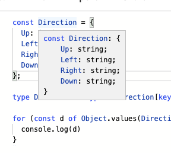
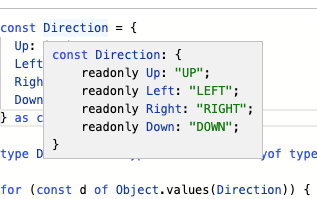

## Enum 이란

[Typescript의 enum](https://www.typescriptlang.org/docs/handbook/enums.html)은 열거형으로, 개발자로 하여금 열거된 세트의 constant를 사용할 수 있도록 한다.

```typescript
enum Direction {
  Up,
  Down,
  Left,
  Right,
}
```

이렇게 해두면, 각각 0, 1, 2, 3의 값을 가지게 된다.

```typescript
Direction.Up // 0
Direction.Down // 1
Direction.Left // 2
Direction.Right // 3
```

물론 아래 처럼 임의의 값을 넣을 수도 있다.

```typescript
enum Direction {
  Up = 'UP',
  Down = 'DOWN',
  Left = 'LEFT',
  Right = 'RIGHT',
}
```

눈치챘겠지만, enum은 자동으로 0, 1, 2, .. 의 숫자를 부여하므로, 문자열 enum을 만들기 위해서는 일일이 문자열을 작성해야 하는 귀찮음도 존재한다.

```typescript
// 보기에도 중복되어보이고, 귀찮다.
enum Day {
  Sunday = 'Sunday',
  Monday = 'Monday',
  Tuesday = 'Tuesday',
  Wednesday = 'Wednesday',
  Thursday = 'Thursday',
  Friday = 'Friday',
  Saturday = 'Saturday',
}
```

## Enum in javascript

문제는 자바스크립트에서는 이러한 기능이 없기 때문에, 이를 자바스크립트로 변환하면 아래와 같이 IIFE를 사용하게 된다.

```javascript
'use strict'
var Direction
;(function (Direction) {
  Direction['Up'] = 'UP'
  Direction['Down'] = 'DOWN'
  Direction['Left'] = 'LEFT'
  Direction['Right'] = 'RIGHT'
})(Direction || (Direction = {}))
```

그러나 번들러 입장에서, IIFE는 언제 쓰일 지 모르는 코드이기 때문에 섣불리 treeshaking을 하지 않게 된다.

[rollup의 예제 코드](https://rollupjs.org/repl/?version=2.26.11&shareable=JTdCJTIybW9kdWxlcyUyMiUzQSU1QiU3QiUyMm5hbWUlMjIlM0ElMjJtYWluLmpzJTIyJTJDJTIyY29kZSUyMiUzQSUyMmltcG9ydCUyMCU3QkRpcmVjdGlvbiU3RCUyMGZyb20lMjAnLiUyRmVudW0uanMnJTVDbmltcG9ydCUyMCU3QmhlbGxvJTdEJTIwZnJvbSUyMCcuJTJGdHJlZXNoYWtlZCclNUNuaW1wb3J0JTIwJTdCaGklN0QlMjBmcm9tJTIwJy4lMkZub3RUcmVlc2hha2VkJyU1Q24lNUNuY29uc29sZS5sb2coaGVsbG8pJTVDbiUyMiUyQyUyMmlzRW50cnklMjIlM0F0cnVlJTdEJTJDJTdCJTIybmFtZSUyMiUzQSUyMmVudW0uanMlMjIlMkMlMjJjb2RlJTIyJTNBJTIyJ3VzZSUyMHN0cmljdCclNUNuZXhwb3J0JTIwdmFyJTIwRGlyZWN0aW9uJTVDbiUzQihmdW5jdGlvbiUyMChEaXJlY3Rpb24pJTIwJTdCJTVDbiUyMCUyMERpcmVjdGlvbiU1QidVcCclNUQlMjAlM0QlMjAnVVAnJTVDbiUyMCUyMERpcmVjdGlvbiU1QidEb3duJyU1RCUyMCUzRCUyMCdET1dOJyU1Q24lMjAlMjBEaXJlY3Rpb24lNUInTGVmdCclNUQlMjAlM0QlMjAnTEVGVCclNUNuJTIwJTIwRGlyZWN0aW9uJTVCJ1JpZ2h0JyU1RCUyMCUzRCUyMCdSSUdIVCclNUNuJTdEKShEaXJlY3Rpb24lMjAlN0MlN0MlMjAoRGlyZWN0aW9uJTIwJTNEJTIwJTdCJTdEKSklMjIlN0QlMkMlN0IlMjJuYW1lJTIyJTNBJTIydHJlZXNoYWtlZC5qcyUyMiUyQyUyMmNvZGUlMjIlM0ElMjJleHBvcnQlMjB2YXIlMjBoZWxsbyUyMCUzRCUyMCdoZWxsbyclMjIlN0QlMkMlN0IlMjJuYW1lJTIyJTNBJTIybm90VHJlZXNoYWtlZC5qcyUyMiUyQyUyMmNvZGUlMjIlM0ElMjJleHBvcnQlMjB2YXIlMjBoaSUyMCUzRCUyMCdoaSclMjIlN0QlNUQlMkMlMjJvcHRpb25zJTIyJTNBJTdCJTIyZm9ybWF0JTIyJTNBJTIyZXMlMjIlMkMlMjJuYW1lJTIyJTNBJTIybXlCdW5kbGUlMjIlMkMlMjJhbWQlMjIlM0ElN0IlMjJpZCUyMiUzQSUyMiUyMiU3RCUyQyUyMmdsb2JhbHMlMjIlM0ElN0IlN0QlN0QlMkMlMjJleGFtcGxlJTIyJTNBbnVsbCU3RA==)

## const enum?

이와 비슷한 const enum이 있다.

```typescript
const enum Direction {
  Up = 'UP',
  Down = 'DOWN',
  Left = 'LEFT',
  Right = 'RIGHT',
}

const left = Direction.Left
```

위 코드는

```javascript
'use strict'
const left = 'LEFT' /* Left */
```

이렇게 변환된다. 순수 enum 보다 더 간결하고, 트리쉐이킹도 잘 될 것만 같다. 실제로도 잘된다. 그러나 문제가 있다.

### Isolated modules

만약 `const enum`과 이를 사용하는 코드가 각각 다른 모듈에 있다면 어떻게 될까? `const enum`의 값을 읽어오기에 위해 해당 코드가 존재하는 모듈도 실행해야 할 것이다. 그러나 만약 `--isolatedModules`가 켜져 있다면, 해당 작업을 수행할 수 없게 된다.

### babel

babel에서 `const enum`을 사용하기 위해서는 추가로 플러그인을 설치해야 한다.

https://github.com/dosentmatter/babel-plugin-const-enum

## Union을 쓰자.

```typescript
const Direction = {
  Up: 'UP',
  Left: 'LEFT',
  Right: 'RIGHT',
  Down: 'DOWN',
} as const

type Direction = typeof Direction[keyof typeof Direction]

for (const d of Object.values(Direction)) {
  console.log(d)
}
```

`as const`를 사용하여, `Direction`에 강한 const assertion을 추가햇다. 이는 타입스크립트에서 타입추론의 범위를 줄이는 효과를 가져온다.





const로 선언했다 할지라도, 객체이기 때문에 바뀔 수 있는데 `as const`를 사용함으로써 `readonly`를 강제하는 효과를 낳았다.

## 참고

- https://engineering.linecorp.com/ko/blog/typescript-enum-tree-shaking/
- https://www.kabuku.co.jp/developers/good-bye-typescript-enum
- https://medium.com/@seungha_kim_IT/typescript-3-4-const-assertion-b50a749dd53b
