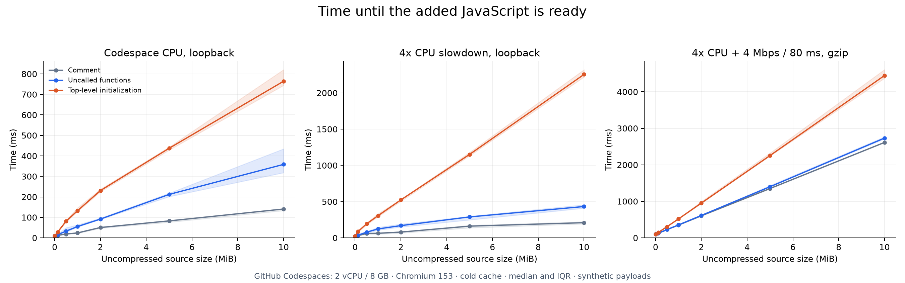
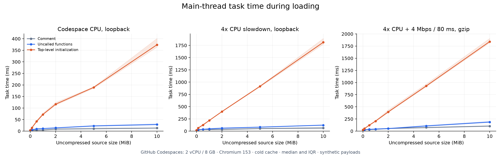
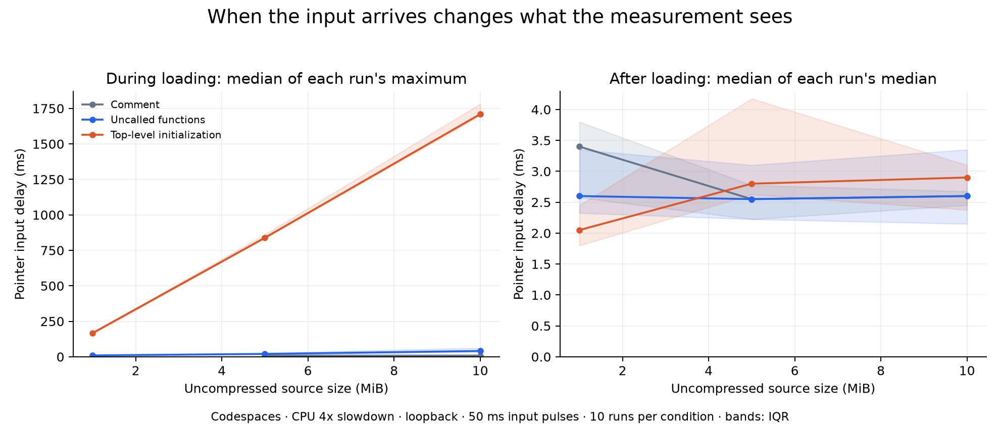

# 실행하지 않는 JavaScript의 비용 — 실측 메모

측정일: 2026-09-16. 실제 브라우저 실행은 GitHub Codespaces의 2 vCPU / 8 GB Ubuntu VM에서 수행했다. Chromium 153.0.8010.12의 headless 모드다. 본 측정은 57개 조건 × 15회 = 855회이며 조건 순서는 매 반복마다 무작위로 섞었다. 추가로 반복 입력 100회, 캐시 재방문 60회, 트레이스 4회, 커버리지 2회를 수집했다. 예비 측정 20회와 캐시 준비 방문 180회는 본 통계에 합치지 않았다.

## 글의 중심 주장

**실행하지 않는 함수도 준비 시간과 메모리 비용을 만든다. 하지만 이 실험에서는 "JS 크기에 따라 브라우저 성능이 기하급수적으로 떨어진다"는 주장을 뒷받침하지 못했다. 같은 바이트 수라도 코드 형태에 따라 메인 스레드 차단 비용이 크게 달랐다.**

아래 값은 모두 실제 측정의 중앙값이다. 준비 시간은 외부 스크립트를 추가한 순간부터 load 이벤트까지이며, 페이지 navigation 시간이나 LCP가 아니다.

## 함수 본문 호출이 0회여도 준비 시간은 늘었다

| 추가 JS                 | CPU 제한 없음: 미호출 함수 | CPU 4배 제한: 미호출 함수 | CPU 4배 제한: 초기화 코드 |
| ----------------------- | -------------------------: | ------------------------: | ------------------------: |
| 기준선: 공통 계측 101 B |                    10.0 ms |                   24.4 ms |                   24.4 ms |
| 128 KiB                 |                    15.4 ms |                   35.8 ms |                   86.8 ms |
| 512 KiB                 |                    32.9 ms |                   78.6 ms |                  193.6 ms |
| 1 MiB                   |                    55.4 ms |                  123.2 ms |                  305.7 ms |
| 2 MiB                   |                    91.8 ms |                  169.2 ms |                  524.2 ms |
| 5 MiB                   |                   212.0 ms |                  289.1 ms |                1,151.4 ms |
| 10 MiB                  |                   358.5 ms |                  432.4 ms |                2,254.8 ms |

서버와 브라우저 사이에 네트워크 제한을 걸지 않은 Codespace 내부 loopback 결과다. 파일은 압축하지 않았다. 네트워크와 브라우저의 리소스 처리 비용이 완전히 0인 환경은 아니다.

5 MiB 미호출 함수 파일에는 22,666개 함수 선언이 있다. 본문 안에 둔 호출 카운터는 본 측정의 모든 미호출 조건에서 0이었다. "파일에 들어 있지만 함수 본문은 실행하지 않았다"는 조건을 코드로 검증했다. 최상위 함수 선언 처리까지 없다는 뜻은 아니다.

5 → 10 MiB에서 미호출 함수의 준비 시간은 제한 없는 조건에서 1.69배, CPU 4배 제한에서 1.50배였다. 초기화 코드는 CPU 4배 제한에서 1.96배였다. 이 구간에서 폭발적으로 증가하는 곡선은 관측하지 못했다.

크기와 중앙값의 단순 선형 회귀 R²는 제한 없는 미호출 함수에서 0.994, CPU 4배 제한의 초기화 코드에서 0.999였다. 이는 관측 구간의 기술적 요약이며, 모든 크기·기기에서 선형임을 증명하거나 지수 모델을 통계적으로 기각한 것은 아니다. 상세 값은 [선형 요약](analysis/linear-descriptive-fit.json)에 있다.

## 준비 시간이 늘어난 만큼 메인 스레드가 멈추지는 않았다

5 MiB, CPU 4배 제한, loopback 조건이다.

| 코드 형태     |  준비 시간 | 메인 스레드 작업 시간 | 긴 작업의 50 ms 초과분 합계 | JS 힙 증가 |
| ------------- | ---------: | --------------------: | --------------------------: | ---------: |
| 주석          |   161.9 ms |               53.5 ms |                        0 ms |   0.06 MiB |
| 미호출 함수   |   289.1 ms |               81.5 ms |                        0 ms |   4.52 MiB |
| 최상위 초기화 | 1,151.4 ms |              915.3 ms |                      799 ms |  13.28 MiB |

같은 5 MiB에서 초기화 코드는 미호출 함수보다 메인 스레드 작업 시간이 약 11.2배 길었다. 이 차이를 "번들이 몇 MB인가"만으로 설명할 수는 없다.

긴 작업 초과분이 0이라는 것은 비용이 0이라는 뜻이 아니다. 메인 스레드에서 수행한 작업이 있더라도 개별 작업이 50 ms를 넘지 않을 수 있다. 위 지표는 자체 측정 구간의 합이며 Lighthouse TBT와 같은 구간의 지표가 아니다.

또한 289 ms의 준비 시간 전체를 파싱 때문에 메인 스레드가 막힌 시간으로 읽으면 안 된다. V8은 함수별 지연 컴파일과 백그라운드 컴파일을 사용하며, 다운로드와 일부 처리를 겹칠 수 있다. [V8의 설명](https://v8.dev/blog/explicit-compile-hints)

JS 힙 증가량은 준비 직전·직후의 JSHeapUsedSize 차이다. 강제 GC를 하지 않았으므로 유지 메모리의 정확한 크기나 브라우저 전체 메모리로 읽지 않는다. 주석의 힙 증가가 작다는 사실로 "5 MiB 소스를 보관하는 메모리가 없다"고 결론 내릴 수 없다.

## 전송이 느리면 실행하지 않는 코드도 기다리는 비용이 크다

CPU 4배 제한, gzip level 6, CDP 다운로드 4 Mbps / latency 80 ms 조건이다.

| 코드 형태     | 5 MiB 준비 시간 | 10 MiB 준비 시간 |
| ------------- | --------------: | ---------------: |
| 주석          |      1,351.2 ms |       2,613.5 ms |
| 미호출 함수   |      1,400.2 ms |       2,732.2 ms |
| 최상위 초기화 |      2,254.1 ms |       4,445.0 ms |

5 MiB의 주석과 미호출 함수는 gzip으로 각각 약 594.32 KiB, 594.31 KiB다. 압축 후 전송량이 사실상 같은 대조군이다. 이 조건에서는 둘 다 준비까지 1초 이상이 걸렸다.

미호출 함수 10 MiB가 준비될 때까지 약 2.7초를 기다렸다는 것은, 그동안 메인 스레드가 2.7초 동안 계속 막혔다는 뜻은 아니다. 같은 조건의 메인 스레드 작업 시간 중앙값은 186.9 ms였다.

## 입력을 언제 보내는지가 결과를 바꿨다

시작 후 약 25 ms에 보낸 입력만 보면, CPU 4배 제한의 10 MiB 초기화 코드에서도 입력 지연 중앙값은 6.2 ms였다. 하지만 이 조건의 가장 긴 작업 중앙값은 1,739 ms였다. 로딩 초기에 입력을 한 번 보내는 방식으로는 나중에 시작하는 긴 작업을 놓칠 수 있다.

그래서 별도 100회 실험에서는 준비가 끝날 때까지 50 ms 간격으로 입력을 보냈다. 아래 "로딩 중"은 각 실행에서 관측한 최대 입력 지연을 구한 뒤, 그 최대값 10개의 중앙값을 계산한 것이다. 전체 사용자 p95나 INP가 아니다.

| 코드 형태     |   크기 | 로딩 중 입력 지연 | 준비 완료 후 입력 지연 |
| ------------- | -----: | ----------------: | ---------------------: |
| 주석          |  5 MiB |            7.8 ms |                 2.5 ms |
| 미호출 함수   |  5 MiB |           19.9 ms |                 2.5 ms |
| 최상위 초기화 |  5 MiB |          838.5 ms |                 2.8 ms |
| 주석          | 10 MiB |            8.3 ms |                 2.6 ms |
| 미호출 함수   | 10 MiB |           40.5 ms |                 2.6 ms |
| 최상위 초기화 | 10 MiB |        1,709.5 ms |                 2.9 ms |

환경은 CPU 4배 제한, loopback이다. 준비 완료 후 값은 각 실행의 입력 3회 중앙값을 먼저 구한 뒤 실행 간 중앙값을 낸 것이다. 로딩 중 최대값과 준비 후 중앙값은 집계 방식이 다르다.

**초기화 중에는 입력이 1초 이상 밀릴 수 있었지만, 초기화가 끝난 뒤 같은 버튼이 계속 그만큼 느리지는 않았다.** 이 짧은 관찰에서는 큰 파일을 로드했다는 이유만으로 준비 후 입력 지연이 계속 크게 증가하지 않았다. 장시간 사용 중 메모리 압박, GC, 실제 앱의 복잡한 상호작용까지 검증한 것은 아니다.

기준선과 1 MiB 주석 조건은 로딩이 일찍 끝나 로딩 중 입력 표본이 없었다. 이 값은 0 ms로 처리하지 않고 원본 집계에서 null로 남겼다.

세부 자료: [입력 실험 집계](analysis/pulse-summary.json), [원본 100회](results/pulse/raw.jsonl).

## 캐시를 켜면 결과가 크게 달라졌다

같은 URL로 3회 준비 방문한 뒤 4번째 방문을 측정했다. 각 조건 10회이며 HTTP 캐시와 브라우저의 코드 재사용을 허용했다. 측정한 재방문 60회 모두 추가 스크립트의 Resource Timing transferSize가 0이었다.

| 환경                            | 미호출 함수 크기 | cold 준비 시간: n=15 | warm 준비 시간: n=10 |
| ------------------------------- | ---------------: | -------------------: | -------------------: |
| CPU 4배 제한, loopback          |            5 MiB |             289.1 ms |              36.0 ms |
| CPU 4배 제한, loopback          |           10 MiB |             432.4 ms |              71.0 ms |
| CPU 4배 제한, gzip·4 Mbps·80 ms |            5 MiB |           1,400.2 ms |              35.8 ms |
| CPU 4배 제한, gzip·4 Mbps·80 ms |           10 MiB |           2,732.2 ms |              71.1 ms |

캐시를 허용한 재방문에서 비용은 크게 줄었지만 0이 되지는 않았다. HTTP 캐시 적중은 확인했으나, 이 차이 전부를 코드 캐시 효과라고 분리해 주장하지 않는다. HTTP 캐시와 V8의 코드 캐시는 서로 다른 층위다. [V8의 코드 캐시 설명](https://v8.dev/blog/improved-code-caching)

고정 시점 입력 측정에는 또 하나의 함정이 있었다. CPU 4배 제한의 10 MiB 미호출 함수에서 시작 후 약 25 ms 입력 지연은 cold 중앙값 5.6 ms, warm 중앙값 45.5 ms였다. 준비는 훨씬 빨라졌는데 이 입력 하나만 보면 나빠진 것처럼 보인다. 같은 시점의 입력이 어느 작업과 겹치는지가 달라지므로, 특정 시점의 클릭 한 번을 전반적 반응성으로 일반화하지 않아야 한다.

자료: [재방문 원본 60회](results/warm/raw.jsonl), [캐시 준비 방문 180회](results/warm/priming.jsonl).

## 브라우저 내부 기록과 호출 수 교차 검증

별도 수집한 5 MiB 커버리지에서는 다음을 확인했다.

| 코드 형태     | 함수 수 | 호출된 함수 수 | 본문 호출 카운터 |
| ------------- | ------: | -------------: | ---------------: |
| 미호출 함수   |  22,666 |              0 |                0 |
| 최상위 초기화 |  18,120 |         18,120 |           18,120 |

트레이스에서는 미호출 조건의 `V8.PreParse` 22,666회가 `ThreadPoolForegroundWorker`에 기록됐다. `v8.parseOnBackground`의 URL도 실험 파일을 가리켰다. "미호출 함수가 브라우저에서 아무 처리도 받지 않았다"는 설명은 이 기록과 맞지 않는다.

메인 스레드의 `V8.ParseFunction` 이벤트는 미호출 조건에서 22회, 초기화 조건에서 18,144회였다. 이 이벤트 수에는 계측용 코드도 포함되므로 모든 항목을 추가 함수와 일대일로 대응시키지는 않는다. 초기화 조건에서 함수 본문 파싱·컴파일 작업이 메인 스레드에 대량으로 추가되는 방향을 확인할 수 있다.

**트레이스의 시간은 본 측정의 대표 지연으로 사용하지 않았다.** 실제로 세부 컴파일 이벤트를 켠 5 MiB 초기화 진단의 준비 시간은 3,070 ms로, 계측을 끈 본 측정 중앙값 1,151 ms와 크게 달랐다. 트레이스는 처리 경로를 확인하는 자료이며 855회 통계와 섞지 않았다. 중첩 이벤트의 inclusive duration도 서로 합산하지 않는다.

- [커버리지 요약](analysis/coverage-summary.json)
- [스레드·이벤트별 트레이스 요약](analysis/trace-summary.json)
- [미호출 함수 원본 트레이스](results/trace/traces/local-4x-functions-5120-0.json.gz)
- [초기화 코드 원본 트레이스](results/trace/traces/local-4x-initialized-5120-0.json.gz)

## 글로 발전시키기 좋은 결론

"큰 JS는 기하급수적으로 느리다"보다 다음 문장이 이번 결과를 잘 설명한다.

> 실행하지 않는 JavaScript도 비용을 만든다. 그 비용이 다운로드 대기인지, 백그라운드 사전 파싱인지, 메인 스레드의 선언·초기화인지에 따라 사용자가 겪는 지연은 달라진다.

글의 흐름은 "함수 호출을 0으로 고정하고 크기를 늘렸다 → 준비 시간과 메인 스레드 차단이 다르게 움직였다 → 초기화와 캐시 조건에서 차이가 커졌다 → 클릭 시점과 계측 도구 자체도 결과를 바꿨다"로 잡을 수 있다.

## 관측 범위와 자료

이 결과는 합성한 classic script를 동적으로 추가하는 한 종류의 로딩 패턴에 대한 것이다. 실제 서비스 번들, ESM 모듈 그래프, React hydration, 모바일 실기기, Safari·Firefox는 직접 측정하지 않았다. CPU 4배 제한도 특정 휴대전화의 성능을 재현하지 않는다.

모든 실행의 값은 버리지 않고 보존했다. 그래프의 음영은 IQR이다. 중앙값의 bootstrap 95% 구간, 최소·최대, 요청 원본, 입력 시각은 아래 자료로 확인할 수 있다.

- [전체 집계표](analysis/tables.md)
- [집계 CSV](analysis/summary.csv)
- [본 측정 원본 855회](results/cold/raw.jsonl)
- [환경과 소스 해시](results/cold/environment.json)
- [GitHub Codespace 사양 증거](results/codespace-provenance.json)
- [실험 방법·재현 명령](README.md)
